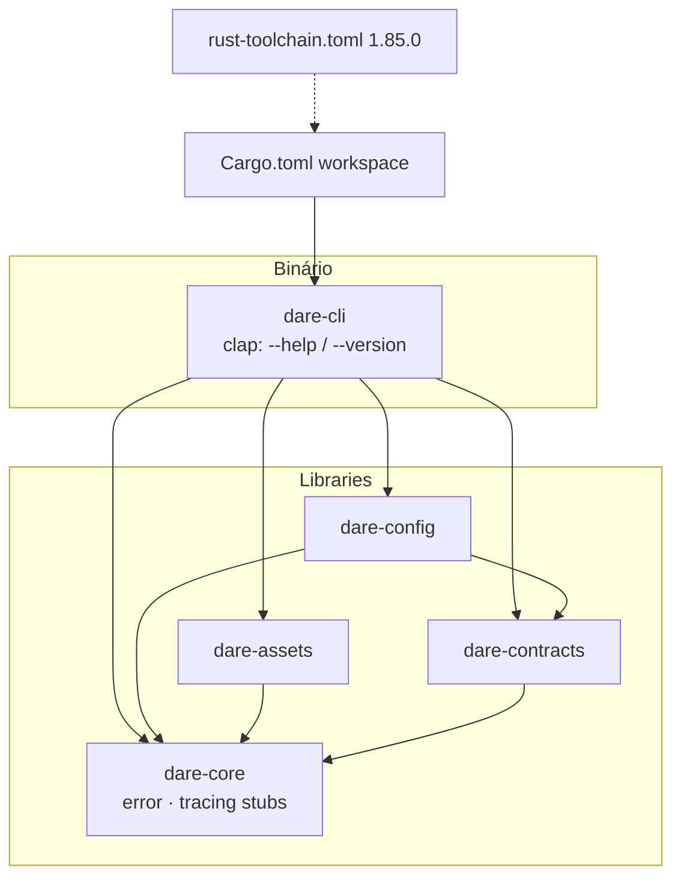

# BLUEPRINT: Workspace Rust e toolchain (Microplano 002)

> **Gerado a partir de:** `DARE/DESIGN-002-workspace-rust-e-toolchain.md` v1.0  
> **Data:** 2026-07-20 | **Status:** DRAFT  
> **Arquivo:** `DARE/BLUEPRINT-002-workspace-rust-e-toolchain.md`  
> **Não substitui:** `DARE/BLUEPRINT.md` (microplano 001)

---

## 0. TRADE-OFFS (Architect)

`DARE/PATTERNS.md` / `patterns-facts.json` ausentes — sem `DiscoveredPattern` 🟢. Decisões 🟡 a partir do Design 002 + Doc Mestre §12 + DEC-001.

| # | Trade-off | Escolha | Justificativa |
|---|-----------|---------|---------------|
| T-01 | Toolchain pin | **`1.85.0`** em `rust-toolchain.toml` + `rust-version = "1.85.0"` | Alinha Design (ex. 1.85.0); MSRV = canal; edition 2021 estável; rustup instala o pin automaticamente |
| T-02 | Edition 2021 vs 2024 | **2021** | Compatível com MSRV 1.85; evita surpresas de edition 2024 |
| T-03 | Members `crates/*` vs lista explícita | **Lista explícita das 5 crates** | Impede crates acidentais no workspace até o time expandir |
| T-04 | Deps entre libs | `dare-cli` → todas; `dare-config`/`dare-assets` → `dare-core` (+ `dare-contracts` só em config); `dare-contracts` → `dare-core`; `dare-core` folha | Doc Mestre §12.1; core não vira god-crate — só tipos/erros/tracing mínimos |
| T-05 | CI mínima vs 003 | **Um job Ubuntu** build/test/fmt/clippy + upload binário | RF-13 SHOULD; matriz 5 OS fica no 003 |
| T-06 | LICENSE | **Apache-2.0** | Comum em ecossistema Rust/CLI; se npm for MIT, dual-license COULD depois — documentar DEC |

---

## 1. VISÃO GERAL DA ARQUITETURA

Workspace **Cargo monorepo** com binário fino e libs por responsabilidade (não hexagonal completo ainda — stubs estruturados).



**Decisões arquiteturais principais:**

| Decisão | Escolha | Justificativa |
|---------|---------|---------------|
| Layout | `crates/{dare-cli,dare-core,dare-contracts,dare-config,dare-assets}` | Doc Mestre §12; escopo Design RF-03…07 |
| Regra de deps | Nenhuma lib depende de `dare-cli` | §12.1; testável sem binário |
| CLI surface | Só flags globais `--help` / `--version` (sem subcommands) | RF-11; evita creep R-04 |
| Versão do binário | `CARGO_PKG_VERSION` via clap | Uma fonte de verdade no workspace package version |
| Lints | `[workspace.lints.rust]` + clippy `-D warnings` | RF-08 |
| Sem target global | Não criar `.cargo/config.toml` com `[build] target` | RS-06 |

---

## 2. STACK TÉCNICA DEFINIDA

| Camada | Tecnologia | Versão | Papel |
|--------|-----------|--------|-------|
| Linguagem | Rust | **1.85.0** (toolchain + MSRV) | Compilação |
| Edition | Rust | **2021** | Todas as crates |
| Workspace package version | semver | **0.1.0-alpha.0** | `--version` |
| CLI | `clap` | **4.5.40** | Derive Parser |
| Erros (libs) | `thiserror` | **2.0.12** | `DareCoreError` etc. |
| Erros (borda CLI) | `anyhow` | **1.0.98** | `main` only |
| Logging | `tracing` | **0.1.41** | Em `dare-core` |
| Subscriber CLI | `tracing-subscriber` | **0.3.19** | Init opcional em `main` (nível ERROR default; sem output em --help/--version happy path) |
| Teste CLI | `assert_cmd` | **2.0.17** | Integração binário |
| Predicates | `predicates` | **3.1.3** | Asserts stdout |
| Container build | Docker | **24+** | `Dockerfile.rust` multi-stage |
| Compose | Compose | **2.x** | Serviço `dare-cli-smoke` |
| CI | GitHub Actions | `ubuntu-latest` | Workflow `rust-workspace-002.yml` |
| Ralph Loop | `dare.config.json` | `backend: "rust-axum"` | Gates cargo |
| Baseline TS | npm | **3.18.1** | Paridade documental apenas |

> Versões de crates acima são **pins exatos** no `Cargo.toml` workspace (`[workspace.dependencies]`). Bump só com PR + audit.

---

## 3. ESTRUTURA DE PASTAS E ARQUIVOS

Arquivos **novos/alterados** neste microplano:

```text
dare-cli/
├── Cargo.toml                          # workspace + [workspace.dependencies] + rust-version
├── Cargo.lock                          # commitado
├── rust-toolchain.toml                 # channel = "1.85.0", components rustfmt+clippy
├── rustfmt.toml
├── clippy.toml                         # opcional; deny via RUSTFLAGS/CI args
├── LICENSE                             # Apache-2.0
├── CONTRIBUTING.md                     # Conventional Commits
├── README.md                           # ou seção “Rust workspace” (atualizar existente se houver)
├── .github/
│   ├── CODEOWNERS
│   └── workflows/
│       └── rust-workspace-002.yml      # job único Ubuntu (RF-13)
├── crates/
│   ├── dare-cli/
│   │   ├── Cargo.toml
│   │   ├── src/
│   │   │   └── main.rs
│   │   └── tests/
│   │       └── cli_smoke.rs
│   ├── dare-core/
│   │   ├── Cargo.toml
│   │   └── src/
│   │       ├── lib.rs
│   │       ├── error.rs
│   │       └── tracing_init.rs         # stub: init_subscriber_for_tests
│   ├── dare-contracts/
│   │   ├── Cargo.toml
│   │   └── src/lib.rs
│   ├── dare-config/
│   │   ├── Cargo.toml
│   │   └── src/lib.rs
│   └── dare-assets/
│       ├── Cargo.toml
│       └── src/lib.rs
├── Dockerfile.rust
├── docker-compose.rust.yml
├── .env.rust.example                   # RUST_LOG= (vazio)
├── docs/
│   └── compatibility/
│       └── rust-msrv.md                # MSRV 1.85.0 + upgrade path
├── docs/DECISION-LOG.md                # append DEC-002 (toolchain/MSRV/license)
└── dare.config.json                    # backend → rust-axum
```

**Proibido neste ciclo:** `[build] target` em `.cargo/config.toml`; crates além das cinco; subcommands clap.

---

## 4. MODELO DE DADOS

Sem banco. Entidades = **crates + metadados de versão**.

### 4.1 `WorkspaceManifest` (Cargo.toml raiz)

| Campo | Tipo | Constraints |
|-------|------|-------------|
| `workspace.members` | string[] | exatamente as 5 paths `crates/dare-*` |
| `workspace.resolver` | string | `"2"` |
| `workspace.package.version` | string | `0.1.0-alpha.0` |
| `workspace.package.edition` | string | `2021` |
| `workspace.package.rust-version` | string | `1.85.0` |
| `workspace.package.license` | string | `Apache-2.0` |
| `workspace.dependencies.*` | pins | versões §2 |

### 4.2 `ToolchainFile` (`rust-toolchain.toml`)

```toml
[toolchain]
channel = "1.85.0"
components = ["rustfmt", "clippy"]
profile = "minimal"
```

### 4.3 Crate graph (relacional)

| Crate | depends_on (path) | publish |
|-------|-------------------|---------|
| `dare-core` | — | false |
| `dare-contracts` | `dare-core` | false |
| `dare-config` | `dare-core`, `dare-contracts` | false |
| `dare-assets` | `dare-core` | false |
| `dare-cli` | `dare-core`, `dare-contracts`, `dare-config`, `dare-assets`, `clap`, `anyhow`, `tracing-subscriber` | false (bin only) |

**Invariante verificável:** `cargo metadata --format-version 1` não contém aresta `dare-*` → `dare-cli` exceto o próprio binário.

---

## 5. CONTRATOS DE API / INTERFACES EXECUTÁVEIS

Não há HTTP. Contratos = **CLI** + **APIs públicas Rust**.

### 5.0 Tabela-resumo CLI

| Invocação | Auth | Stdout (contrato) | Stderr | Exit |
|-----------|------|-------------------|--------|------|
| `dare --help` | N/A | Usage clap em **en-US**; contém `Usage:` e `Options:`; menciona `--help` e `--version` | vazio ou só tracing se RUST_LOG set (default: vazio) | 0 |
| `dare --version` | N/A | Uma linha: `dare 0.1.0-alpha.0` **ou** `dare 0.1.0-alpha.0\n` (trim OK); regex `^dare 0\.1\.0-alpha\.0\s*$` | vazio | 0 |
| `dare` (sem args) | N/A | Igual a `--help` **ou** mensagem curta + help — **decisão:** imprimir help e exit 0 (clap default com `arg_required_else_help` **desligado**; usar `#[command(about=...)]` e se zero args → help via `Command::print_help`) | — | 0 |
| `dare --unknown` | N/A | — | erro clap | **2** (clap padrão) |

**Diferença vs TS 3.18.1:** classificar no DEC-002 / changelog curto: versão `0.1.0-alpha.0` ≠ `3.18.1` (intencional — binário Rust novo); help em inglês (language-policy).

---

### 5.1 CLI — implementação clap (`dare-cli`)

```rust
use clap::Parser;

#[derive(Debug, Parser)]
#[command(
    name = "dare",
    version, // from CARGO_PKG_VERSION
    about = "DARE Framework CLI (native Rust rewrite)",
    disable_help_subcommand = true,
    arg_required_else_help = false
)]
struct Cli {
    // no fields — only global --help / --version from clap
}

fn main() -> anyhow::Result<()> {
    // Optional: tracing_subscriber only if std::env::var_os("RUST_LOG").is_some()
    let _cli = Cli::parse();
    // Zero args: print help explicitly
    // If parse succeeded with only defaults, call Cli::command().print_help()?;
    Ok(())
}
```

**Comportamento exato com zero args:**

1. `Cli::command().print_help()` para stdout  
2. `println!()` newline  
3. `Ok(())` → exit 0  

**Pré-condições:** binário linkado.  
**Pós-condições:** processo termina; nenhum arquivo criado.  
**Concorrência:** N/A (processo single-shot).

**Testes (`crates/dare-cli/tests/cli_smoke.rs`):**

| Teste | Comportamento |
|-------|----------------|
| `version_prints_semver` | `cargo_bin("dare").arg("--version")` → success, stdout matches `dare 0.1.0-alpha.0` |
| `help_mentions_version_flag` | `--help` success, stdout contains `--version` |
| `help_exit_zero` | `--help` code 0 |
| `unknown_flag_fails` | `--not-a-real-flag` → failure, code != 0 |

---

### 5.2 `dare-core` — APIs públicas mínimas (anti-stub)

```rust
// crates/dare-core/src/error.rs
#[derive(Debug, thiserror::Error, PartialEq, Eq)]
pub enum CoreError {
    #[error("invalid argument: {0}")]
    InvalidArgument(String),
}

pub type CoreResult<T> = Result<T, CoreError>;

/// Valida que `name` não é vazio e não contém NUL.
/// Pré: —
/// Pós: Ok(()) se válido.
/// Erro: CoreError::InvalidArgument
pub fn validate_nonempty_name(name: &str) -> CoreResult<()> {
    if name.is_empty() {
        return Err(CoreError::InvalidArgument("name must not be empty".into()));
    }
    if name.contains('\0') {
        return Err(CoreError::InvalidArgument("name must not contain NUL".into()));
    }
    Ok(())
}
```

```rust
// crates/dare-core/src/tracing_init.rs
/// Instala subscriber fmt para testes. Idempotente o suficiente para testes unitários.
/// Não chama em `dare --help` / `--version` a menos que RUST_LOG esteja setado (borda CLI).
pub fn init_test_subscriber() { /* tracing_subscriber::fmt().with_test_writer().try_init() ignore err */ }
```

**Testes:** `validate_nonempty_name_ok`, `validate_nonempty_name_empty_err`, `validate_nonempty_name_nul_err`.

**Proibido:** `todo!()`, funções `pub fn` vazias, I/O de filesystem real neste ciclo.

---

### 5.3 `dare-contracts` — API pública mínima

```rust
/// Identificador de schema de contrato (placeholder estável).
pub const CONTRACTS_SCHEMA_VERSION: &str = "0.0.0-placeholder";

/// Retorna a versão de schema anunciada por esta crate.
pub fn schema_version() -> &'static str {
    CONTRACTS_SCHEMA_VERSION
}
```

**Teste:** `schema_version_is_placeholder`.

---

### 5.4 `dare-config` — API pública mínima

```rust
use dare_core::validate_nonempty_name;
use dare_contracts::schema_version;

/// Smoke: compõe core + contracts sem carregar disco.
pub fn config_layer_ping(label: &str) -> dare_core::CoreResult<&'static str> {
    validate_nonempty_name(label)?;
    let _ = schema_version();
    Ok("config-ok")
}
```

**Testes:** `ping_ok`, `ping_empty_err`.

---

### 5.5 `dare-assets` — API pública mínima

```rust
use dare_core::validate_nonempty_name;

pub fn assets_layer_ping(label: &str) -> dare_core::CoreResult<&'static str> {
    validate_nonempty_name(label)?;
    Ok("assets-ok")
}
```

**Testes:** `ping_ok`, `ping_empty_err`.

---

### 5.6 Verificação de grafo de dependências

**Script ou teste de workspace** (em `crates/dare-cli/tests/dep_graph.rs` ou `tests/workspace_deps.rs`):

- Rodar `cargo metadata --format-version 1 --no-deps` insuficiente — usar com deps resolvidas path.
- Assert: para cada pacote `dare-core|dare-contracts|dare-config|dare-assets`, nenhuma dependência direta nomeada `dare-cli`.

Alternativa aceitável: doc + checklist de review + `cargo tree -i dare-cli` mostra só o binário.

**Critério DONE O-05:** pelo menos um teste automatizado **ou** job CI que falha se `dare-cli` aparecer como dep de outra crate do workspace.

---

## 6. PLANO DE EXECUÇÃO (FASES)

### Fase 1: Containerização Rust smoke ← **SEMPRE PRIMEIRA**

**Objetivo:** ambiente que valida o binário (mesmo que crates ainda sejam criadas nas fases seguintes — nesta fase criar Dockerfiles que **assumem** workspace; se build falhar até Fase 2, a Fase 1 entrega os ficheiros e healthcheck baseado em `rustc --version` temporário **não** — preferir: Fase 1 cria `Dockerfile.rust` + compose; healthcheck = `dare --version` após COPY do workspace. Ordem prática: Fase 1 entrega ficheiros Docker; healthcheck verde só após Fase 3 (binário). **Critério Phase 1 DONE:** ficheiros Docker/compose/env existem; `docker compose -f docker-compose.rust.yml config` válido.

**Entregáveis:** `Dockerfile.rust` (multi-stage: `rust:1.85.0-bookworm` builder → `debian:bookworm-slim` runtime com binário `/usr/local/bin/dare`), `docker-compose.rust.yml`, `.env.rust.example`.

```dockerfile
# builder
FROM rust:1.85.0-bookworm AS builder
WORKDIR /src
COPY Cargo.toml Cargo.lock rust-toolchain.toml ./
COPY crates ./crates
RUN cargo build --release -p dare-cli
# runtime
FROM debian:bookworm-slim
COPY --from=builder /src/target/release/dare /usr/local/bin/dare
ENTRYPOINT ["dare"]
CMD ["--version"]
```

Healthcheck: `CMD dare --version` (fica healthy após imagem buildável — validar na Fase 7 se Docker disponível).

---

### Fase 2: Toolchain, workspace root, LICENSE, CODEOWNERS, CONTRIBUTING

**Critério de DONE:**
- `rust-toolchain.toml` com `1.85.0` + rustfmt/clippy
- `Cargo.toml` workspace com 5 members (crates podem ser criados vazios na mesma fase ou Fase 3)
- `rustfmt.toml` com `newline_style = "Unix"`
- `LICENSE` Apache-2.0, `.github/CODEOWNERS`, `CONTRIBUTING.md` (Conventional Commits)
- `docs/compatibility/rust-msrv.md` + DEC-002 no decision log

**Entregáveis:** RF-01, RF-02, RF-09, RF-10 (parcial se crates na Fase 3).

---

### Fase 3: Cinco crates + binário `--help`/`--version`

**Critério de DONE:**
- `cargo build` e `cargo build --release` exit 0
- `cargo run -p dare-cli -- --version` imprime `dare 0.1.0-alpha.0`
- `cargo test --workspace` exit 0 (inclui cli_smoke + testes das libs)
- Grafo de deps conforme §4.3

**Entregáveis:** RF-03…RF-07, RF-11 + APIs §5.2–5.5.

---

### Fase 4: Lints workspace deny-warnings

**Critério de DONE:**
- `cargo fmt --check` exit 0
- `cargo clippy --workspace --all-targets -- -D warnings` exit 0
- `[workspace.lints]` configurado (rust unused must error, etc.)

**Entregáveis:** RF-08.

---

### Fase 5: `dare.config.json` → rust-axum + Ralph alinhado

**Critério de DONE:**
- `dare.config.json` com `"backend": "rust-axum"`
- `dare execute --complete` (smoke) usa gates cargo — validar com `dare info` ou dry complete de task dummy **ou** documentar que próximo DAG 002 usará esses gates
- Scripts Node `governance-001.yml` **permanecem** intactos

**Entregáveis:** RF-12.

---

### Fase 6: Auditoria de segurança e dependências ← **N-1**

**Critério de DONE:**
- `cargo audit` exit 0 **ou**, se `cargo-audit` não instalado: instalar via `cargo install cargo-audit --locked` na CI/local e passar; HIGH/CRITICAL = fail
- Nenhum secret em crates; `.env.rust.example` só nomes
- Confirmar ausência de `[build] target` global
- Checklist RS-01…RS-08 marcado

**Entregáveis:** RS-04, RS-05, RS-06.

---

### Fase 7: CI mínima + fechamento (RF-13/14) ← **N**

**Critério de DONE:**
- `.github/workflows/rust-workspace-002.yml`: checkout, rust-toolchain 1.85.0, `cargo fmt --check`, `clippy -D warnings`, `cargo test --workspace`, `cargo build --release -p dare-cli`, upload-artifact do binário
- DEC-002 / épico placeholder RF-14
- Opcional: `docker compose -f docker-compose.rust.yml build` se daemon disponível
- Microplano 002 desbloqueia 003

**Entregáveis:** RF-13, RF-14, O-06.

---

## 7. VALIDAÇÃO E SEGURANÇA

### Validation Gates (Ralph Loop)

| Stack | Build | Test | Lint/Audit |
|-------|-------|------|------------|
| **Rust (após RF-12)** | `cargo build --workspace` | `cargo test --workspace` | `cargo clippy --workspace --all-targets -- -D warnings` (+ `cargo audit` na Fase 6) |
| Node governance (coexiste) | `npm run build` | `npm test` | `npm run lint` / audit scripts |

### Controles RS-* → fases

| RS | Controle | Fase |
|----|----------|------|
| RS-01 | clap valida args | 3 |
| RS-02 | sem secrets em código | 3, 6 |
| RS-03 | libs sem I/O de contrato | 3 |
| RS-04 | cargo audit | 6, 7 |
| RS-05 | env example | 1, 6 |
| RS-06 | sem build target global | 2, 6 |
| RS-07 | validate_nonempty_name; sem shell | 3 |
| RS-08 | LICENSE + CODEOWNERS | 2 |

### Checklist

- [ ] Rate limiting HTTP N/A
- [ ] Input CLI via clap
- [ ] Sem PII/tokens em logs default
- [ ] Audit sem HIGH/CRITICAL
- [ ] Headers HTTP N/A
- [ ] Secrets só env

---

## 8. ESTRATÉGIA DE TESTES

| Tipo | Ferramenta | Cobertura mínima | O que cobre |
|------|-----------|------------------|-------------|
| Unitários | `cargo test` | 100% das fns públicas §5.2–5.5 | CoreError paths |
| Integração CLI | `assert_cmd` | 4 testes §5.1 | help/version/unknown |
| Dep graph | teste metadata ou CI | 1 assert | O-05 |
| Segurança | `cargo audit` | 100% deps | RS-04 |
| Container | docker build | SHOULD | smoke `--version` |
| E2E produto | N/A | — | Sem discover/execute |

---

## 9. ESTRATÉGIA DE DEPLOY

| Ambiente | Branch | Trigger | Infra |
|----------|--------|---------|-------|
| `local` | qualquer | `cargo run -p dare-cli -- --version` | rustup 1.85.0 |
| `ci` | PR/push paths `crates/**`, `Cargo.*`, `rust-toolchain.toml` | GHA Ubuntu | artifact `dare` |
| `container` | manual | `docker compose -f docker-compose.rust.yml build` | Docker |
| `prod` | — | — | N/A (alpha interno; releases oficiais ≥ 015) |

---

## 10. CHECKLIST DE APROVAÇÃO DO BLUEPRINT

- [ ] Toolchain/MSRV **1.85.0** e edition **2021** aprovados
- [ ] Grafo de crates §4.3 aprovado
- [ ] Contratos CLI §5.0–5.1 (incluindo zero-args → help) aprovados
- [ ] APIs públicas das libs anti-stub revisadas
- [ ] Fases 1–7 com DONE verificáveis
- [ ] CI mínima vs 003 delimitada
- [ ] RS-* mapeados
- [ ] LICENSE Apache-2.0 aceita (T-06)
- [ ] Pronto para `/dare-tasks` gerando artefatos **002** (não misturar com DAG 001)

---

## 11. PRÓXIMAS ETAPAS

1. Aprovar este Blueprint.
2. `/dare-tasks` a partir de `DARE/BLUEPRINT-002-workspace-rust-e-toolchain.md` → gerar `TASKS-002` / DAG 002 / `EXECUTION/` dedicados (ou substituir o DAG ativo após arquivar o 001).
3. Após closeout: microplano 003.
