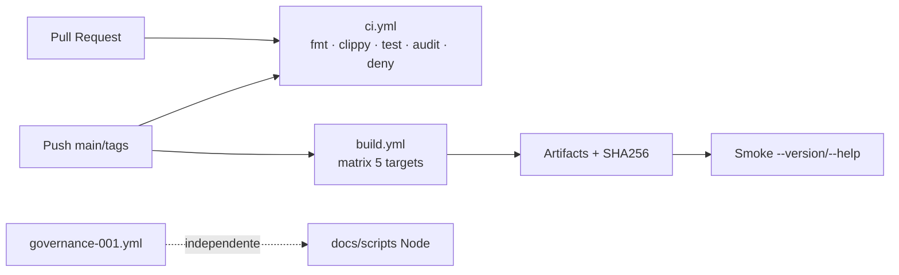

# BLUEPRINT: CI cross-platform e qualidade (Microplano 003)

> **Gerado a partir de:** `DARE/DESIGN-003-ci-cross-platform-e-qualidade.md` v1.0  
> **Data:** 2026-07-20 | **Status:** DRAFT  
> **Arquivo:** `DARE/BLUEPRINT-003-ci-cross-platform-e-qualidade.md`  
> **Não substitui:** `DARE/BLUEPRINT.md` (001) nem `BLUEPRINT-002-*.md`

---

## 0. TRADE-OFFS (Architect)

Sem `PATTERNS.md` / `patterns-facts.json` — decisões 🟡 a partir do Design 003 + workspace 002.

| # | Trade-off | Escolha | Justificativa |
|---|-----------|---------|---------------|
| T-01 | Linux ARM: `cross` vs runner ARM | **Runner nativo `ubuntu-24.04-arm`** | Evita qemu/`cross` flaky (R-01); build + smoke no mesmo host |
| T-02 | macOS x64 | **`macos-13`** (Intel) para `x86_64-apple-darwin` | ARM runner não produz x64 nativo confiável sem cross |
| T-03 | macOS arm64 | **`macos-14`** (Apple Silicon) | Target `aarch64-apple-darwin` nativo |
| T-04 | Cache | **`Swatinem/rust-cache@v2.7.8`** | Padrão Rust GHA; key por lockfile |
| T-05 | Job 002 | **Remover** `rust-workspace-002.yml` após `ci.yml`+`build.yml` verdes | RF-09; evita duplicação |
| T-06 | SBOM | **Fora (COULD)** — não implementar neste ciclo | Design RF-12 COULD; focar audit+deny+checksums |
| T-07 | Checksums | **Implementar** (SHOULD → tratado como MUST técnico) | SHA-256 por artifact + `SHA256SUMS.txt` no job summary |

---

## 1. VISÃO GERAL DA ARQUITETURA

Dois workflows GitHub Actions + política `deny.toml` + scripts de smoke. Sem mudança de crates de domínio.



**Decisões arquiteturais:**

| Decisão | Escolha | Justificativa |
|---------|---------|---------------|
| Separação ci vs build | `ci.yml` qualidade; `build.yml` artifacts | PRs não precisam matrix 5 OS sempre (custo); build em push/`workflow_dispatch` + PR opcional |
| PR sempre roda `ci.yml` | Sim | O-01 |
| Build em PR | `workflow_dispatch` + push em `main`/`rust/**`; em PR só se label `ci-build` **ou** paths crates (decisão: **build também em PR** com matrix — Design exige targets; aceitar minutos) | O-02 em todo PR que toca Rust |
| Toolchain | Sempre `1.85.0` via `rust-toolchain.toml` + `dtolnay/rust-toolchain@1.85.0` | Alinhado MSRV 002 |
| Permissions | `contents: read`; `actions: write` só onde upload-artifact | RS-03 |

---

## 2. STACK TÉCNICA DEFINIDA

| Camada | Tecnologia | Versão | Papel |
|--------|-----------|--------|-------|
| Rust | rustc/cargo | **1.85.0** | Build/test |
| GHA checkout | `actions/checkout` | **v4.2.2** | Clone |
| Toolchain | `dtolnay/rust-toolchain` | **1.85.0** (tag/action pin) | Install + components |
| Cache | `Swatinem/rust-cache` | **v2.7.8** | Registry/git/target |
| Audit | `cargo-audit` | **0.21.2** (install `--locked` na CI) | Advisories |
| Deny | `cargo-deny` | **0.18.2** | Licenses/advisories/bans |
| Upload | `actions/upload-artifact` | **v4.6.0** | Binários |
| Retention | upload-artifact | **7 days** | RF-06 |
| Container local | `Dockerfile.rust` (002) + `docker-compose.ci.yml` | — | Fase 1 smoke local |
| Runners | ver §5 matrix | — | 5 targets |

---

## 3. ESTRUTURA DE PASTAS E ARQUIVOS

```text
dare-cli/
├── .github/
│   └── workflows/
│       ├── ci.yml                      # NOVO
│       ├── build.yml                   # NOVO
│       ├── governance-001.yml          # intacto
│       └── rust-workspace-002.yml      # REMOVIDO ao final (T-05)
├── deny.toml                           # NOVO
├── scripts/
│   └── ci/
│       ├── smoke-dare.sh               # NOVO (Unix)
│       └── smoke-dare.ps1              # NOVO (Windows)
├── docker-compose.ci.yml               # NOVO (Fase 1)
├── docs/
│   └── compatibility/
│       └── ci-cross-platform.md        # NOVO (RF-10)
└── docs/DECISION-LOG.md                # DEC-004 (CI matrix + remoção workflow 002)
```

---

## 4. MODELO DE DADOS

Sem banco. Entidades = **jobs / artifacts / deny policy**.

### 4.1 Artifact naming (canônico)

| target triple | runner | artifact name | binary path no artifact |
|---------------|--------|---------------|-------------------------|
| `x86_64-unknown-linux-gnu` | `ubuntu-latest` | `dare-x86_64-unknown-linux-gnu` | `dare` |
| `aarch64-unknown-linux-gnu` | `ubuntu-24.04-arm` | `dare-aarch64-unknown-linux-gnu` | `dare` |
| `x86_64-apple-darwin` | `macos-13` | `dare-x86_64-apple-darwin` | `dare` |
| `aarch64-apple-darwin` | `macos-14` | `dare-aarch64-apple-darwin` | `dare` |
| `x86_64-pc-windows-msvc` | `windows-latest` | `dare-x86_64-pc-windows-msvc` | `dare.exe` |

Cada upload inclui: binário + `dare.sha256` (hex do ficheiro) + opcionalmente `SHA256SUMS.txt` agregado no job `checksums` (SHOULD).

### 4.2 `deny.toml` (política inicial)

```toml
[advisories]
yanked = "deny"
unmaintained = "warn"
# vulnerability: deny (default in recent cargo-deny)

[licenses]
allow = [
  "Apache-2.0",
  "MIT",
  "BSD-2-Clause",
  "BSD-3-Clause",
  "ISC",
  "Unicode-3.0",
  "Zlib",
]
confidence-threshold = 0.8

[bans]
multiple-versions = "warn"
wildcards = "deny"

[sources]
unknown-registry = "deny"
unknown-git = "deny"
allow-registry = ["https://github.com/rust-lang/crates.io-index"]
```

**Ajuste permitido:** se `cargo deny` falhar por license edge-case de dep transitiva, adicionar exception **nomeada** em `deny.toml` com comentário + entrada DEC — não silenciar advisories.

---

## 5. CONTRATOS / INTERFACES EXECUTÁVEIS

### 5.1 Workflow `ci.yml` — contrato de gates

**Trigger:**
```yaml
on:
  pull_request:
    paths: [crates/**, Cargo.toml, Cargo.lock, rust-toolchain.toml, rustfmt.toml, deny.toml, .github/workflows/ci.yml]
  push:
    paths: [mesmo]
permissions:
  contents: read
```

**Job `quality` (ubuntu-latest) — steps obrigatórios nesta ordem:**

| Step id | Comando / ação | Fail se |
|---------|----------------|---------|
| `checkout` | `actions/checkout@v4.2.2` | clone fail |
| `toolchain` | `dtolnay/rust-toolchain@1.85.0` + `components: rustfmt, clippy` | install fail |
| `cache` | `Swatinem/rust-cache@v2.7.8` | — |
| `fmt` | `cargo fmt --check` | exit ≠ 0 |
| `clippy` | `cargo clippy --workspace --all-targets -- -D warnings` | exit ≠ 0 |
| `test` | `cargo test --workspace` | exit ≠ 0 |
| `install-audit` | `cargo install cargo-audit --version 0.21.2 --locked` | install fail |
| `audit` | `cargo audit` | exit ≠ 0 |
| `install-deny` | `cargo install cargo-deny --version 0.18.2 --locked` | install fail |
| `deny` | `cargo deny check` | exit ≠ 0 |

**Edge cases:**
- Advisory novo → job vermelho até bump de dep (processo R-06)
- Cache miss → job mais lento; não skip gates

---

### 5.2 Workflow `build.yml` — matrix

```yaml
strategy:
  fail-fast: false
  matrix:
    include:
      - target: x86_64-unknown-linux-gnu
        os: ubuntu-latest
      - target: aarch64-unknown-linux-gnu
        os: ubuntu-24.04-arm
      - target: x86_64-apple-darwin
        os: macos-13
      - target: aarch64-apple-darwin
        os: macos-14
      - target: x86_64-pc-windows-msvc
        os: windows-latest
```

**Por célula (anti-stub):**

1. checkout  
2. toolchain 1.85.0 com `targets: ${{ matrix.target }}`  
3. rust-cache (`key: ${{ matrix.target }}`)  
4. `cargo build --release -p dare-cli --target ${{ matrix.target }}`  
5. Determinar `BIN`:
   - Windows: `target/${{ matrix.target }}/release/dare.exe`
   - else: `target/${{ matrix.target }}/release/dare`
6. Smoke **no runner** (mesmo OS/arch do binário):
   - Unix: `scripts/ci/smoke-dare.sh "$BIN"`
   - Windows: `pwsh scripts/ci/smoke-dare.ps1 -Bin $BIN`
7. Gerar checksum: `sha256sum` / `Get-FileHash` → `dare.sha256`  
8. `upload-artifact@v4.6.0` name `dare-${{ matrix.target }}`, path: `[BIN, dare.sha256]`, `retention-days: 7`

**Trigger:** mesmo path filter que `ci.yml` + `workflow_dispatch`.

**Permissions:** `contents: read`

---

### 5.3 Scripts de smoke (contratos stdout)

#### `scripts/ci/smoke-dare.sh`

```bash
#!/usr/bin/env bash
set -euo pipefail
BIN="${1:?usage: smoke-dare.sh /path/to/dare}"
test -x "$BIN"
OUT_V="$("$BIN" --version)"
echo "$OUT_V" | grep -Eq '^dare 0\.1\.0-alpha\.0[[:space:]]*$'
OUT_H="$("$BIN" --help)"
echo "$OUT_H" | grep -Eq 'Usage:|--version'
```

Exit: 0 sucesso; 1 falha grep/test.

#### `scripts/ci/smoke-dare.ps1`

```powershell
param([Parameter(Mandatory=$true)][string]$Bin)
if (-not (Test-Path $Bin)) { throw "missing $Bin" }
$v = & $Bin --version
if ($v -notmatch '^dare 0\.1\.0-alpha\.0\s*$') { throw "bad version: $v" }
$h = & $Bin --help | Out-String
if ($h -notmatch 'Usage:|--version') { throw "bad help" }
```

**Edge cases enumerados:**
| Caso | Resultado |
|------|-----------|
| BIN inexistente | exit ≠ 0 |
| versão ≠ `0.1.0-alpha.0` | fail |
| help sem `--version` | fail |
| binário de outro target no runner errado | build.yml evita (smoke só nativo) |

---

### 5.4 Container local — `docker-compose.ci.yml`

**Fase 1 DONE:** ficheiro existe; `docker compose -f docker-compose.ci.yml config` OK.

```yaml
services:
  dare-ci-smoke:
    build:
      context: .
      dockerfile: Dockerfile.rust
    command: ["--version"]
    healthcheck:
      test: ["CMD", "dare", "--version"]
      interval: 30s
      timeout: 10s
      retries: 3
```

(Reusa `Dockerfile.rust` do 002; não redefine multi-stage.)

---

### 5.5 Documentação `docs/compatibility/ci-cross-platform.md`

Deve conter:
1. Tabela targets ↔ runners (§4.1)  
2. Como baixar artifact do Actions  
3. Como verificar `dare.sha256`  
4. Nota: `governance-001.yml` separado  
5. DEC-004 referência (remoção workflow 002)

---

## 6. PLANO DE EXECUÇÃO (FASES)

### Fase 1: Containerização CI local ← **SEMPRE PRIMEIRA**

**DONE:** `docker-compose.ci.yml` + `docker compose … config` exit 0.  
**Entregáveis:** `docker-compose.ci.yml`.

---

### Fase 2: `deny.toml` + scripts smoke

**DONE:** `cargo deny check` exit 0 localmente; `bash scripts/ci/smoke-dare.sh $(cargo metadata …)` ou path release local passa após `cargo build -p dare-cli`.  
**Entregáveis:** `deny.toml`, `smoke-dare.sh`, `smoke-dare.ps1` (exec bit no `.sh`).

---

### Fase 3: Workflow `ci.yml`

**DONE:** YAML válido; steps §5.1 presentes; documentação menciona gates. Validação local: `actionlint` se disponível, senão review + `cargo fmt/clippy/test/audit/deny` espelhando steps.

---

### Fase 4: Workflow `build.yml` (matrix 5)

**DONE:** matrix §5.2 completa; nomes de artifact canônicos; smoke steps Unix+Windows.

---

### Fase 5: Checksums + docs CI

**DONE:** step checksum em `build.yml`; `docs/compatibility/ci-cross-platform.md` completo; DEC-004 no decision log.

---

### Fase 6: Auditoria de segurança ← **N-1**

**DONE:**
- `cargo audit` + `cargo deny check` exit 0  
- Permissions GHA revisadas (`contents: read`)  
- Nenhum secret em YAML  
- Checklist RS-01…RS-08  
- Smoke scripts sem `eval`/concat de shell com input externo  

---

### Fase 7: Remover workflow 002 + fechamento ← **N**

**DONE:**
- `rust-workspace-002.yml` removido  
- `ci.yml` + `build.yml` são a fonte de verdade  
- Release notes curtas em `ci-cross-platform.md` (“Ciclo CI 003”)  
- Microplano 004 desbloqueado  

---

## 7. VALIDAÇÃO E SEGURANÇA

### Gates Ralph (projeto)

| Stack | Build | Test | Lint/Audit |
|-------|-------|------|------------|
| Rust | `cargo build --workspace` | `cargo test --workspace` | `cargo clippy --workspace --all-targets -- -D warnings` + `cargo audit` + `cargo deny check` |

### RS → fases

| RS | Fase |
|----|------|
| RS-01 | 3, 4 |
| RS-02 | 2, 6 |
| RS-03 | 3, 4, 6 |
| RS-04 | 2, 3, 6 |
| RS-05 | 3, 4, 6 |
| RS-06 | 2, 4 |
| RS-07 | 5 |
| RS-08 | 7 (governance intacto) |

---

## 8. ESTRATÉGIA DE TESTES

| Tipo | Onde | O que |
|------|------|-------|
| Unit/integration crates | `ci.yml` `cargo test` | workspace 002 |
| Smoke binário | `build.yml` + scripts | version/help |
| Supply chain | audit + deny | RS-04 |
| Compose config | Fase 1 | YAML válido |
| actionlint | SHOULD local | workflows |
| E2E produto | N/A | — |

---

## 9. ESTRATÉGIA DE DEPLOY

| Ambiente | Trigger | Infra |
|----------|---------|-------|
| PR | `ci.yml` (+ `build.yml`) | GHA matrix |
| `main` push | ci + build | artifacts 7d |
| Manual | `workflow_dispatch` em build | idem |
| GitHub Releases | — | **fora** deste microplano |

---

## 10. CHECKLIST DE APROVAÇÃO DO BLUEPRINT

- [ ] T-01…T-07 aceitos (ARM runner, macos-13/14, remoção workflow 002)
- [ ] Contratos `ci.yml` / `build.yml` / smoke scripts revisados
- [ ] `deny.toml` allowlist de licenses aceita
- [ ] Fases 1–7 com DONE verificáveis
- [ ] SBOM confirmado fora (T-06)
- [ ] Pronto para `/dare-tasks` → artefatos `*-003-*` / `mp003-*`

---

## 11. PRÓXIMAS ETAPAS

1. Aprovar este Blueprint.  
2. `/dare-tasks` a partir de `DARE/BLUEPRINT-003-ci-cross-platform-e-qualidade.md`.  
3. Após closeout → microplano 004.
