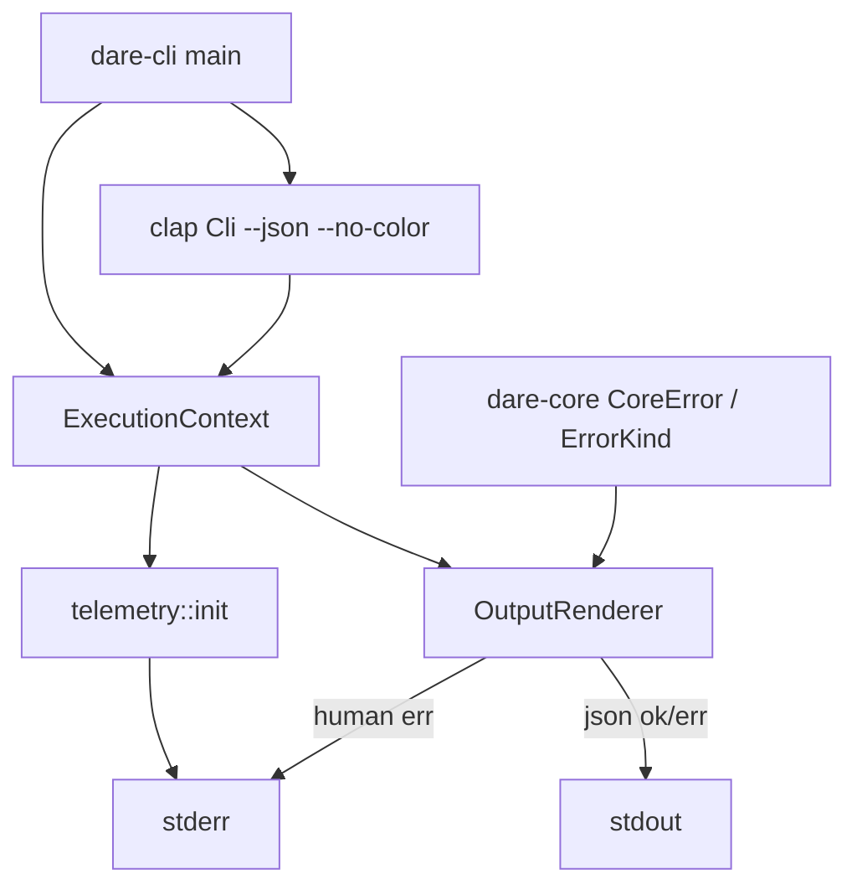

# BLUEPRINT: Erros, tracing e saída da CLI (Microplano 004)

> **Gerado a partir de:** `DARE/DESIGN-004-erros-tracing-e-saida-da-cli.md` v1.0  
> **Data:** 2026-07-20 | **Status:** DRAFT  
> **Arquivo:** `DARE/BLUEPRINT-004-erros-tracing-e-saida-da-cli.md`  
> **Não substitui:** Blueprints 001–003

---

## 0. TRADE-OFFS (Architect)

Sem `PATTERNS.md` / `patterns-facts.json` — decisões 🟡 a partir do Design 004 + código atual (`CoreError::InvalidArgument`, clap/`anyhow`).

| # | Trade-off | Escolha | Justificativa |
|---|-----------|---------|---------------|
| T-01 | Erro JSON: stdout vs stderr | **stdout + exit ≠ 0**; tracing/human diagnostics em **stderr** | Automação (`--json`) faz parse de um stream; exit code sinaliza falha |
| T-02 | Flag global `--json` | **Sim** em `Cli` root (`clap`) | Base para todos os comandos futuros; help/version ignoram envelope |
| T-03 | Cores | **`anstream` 0.6.18** + lógica própria (sem `owo-colors`) | Já transitiva via clap; menos surface; ANSI só em human + TTY + sem `NO_COLOR`/`--no-color` |
| T-04 | Correlation id | **`uuid` 1.16.0** feature `v4` | Padrão; não derivado de PII (RS-07) |
| T-05 | `schema_version` no envelope | **Fora (COULD)** — shape mínimo sem campo | Evita contrato prematuro; ADR-002 allowlist cobre voláteis |
| T-06 | `CoreError::InvalidArgument` | **Migrar → `InvalidInput`** + `ErrorKind` | Alinhar RF-01; atualizar call sites (validate_nonempty_name) |
| T-07 | Exit codes 6+ | **Reservados** — não atribuir no 004 | Guard/graph etc. em microplanos futuros |

---

## 1. VISÃO GERAL DA ARQUITETURA

Camada **core** tipa erros + telemetria; camada **cli** renderiza e define `process::exit`.



**Decisões arquiteturais:**

| Decisão | Escolha | Justificativa |
|---------|---------|---------------|
| Domínio sem anyhow | `thiserror` only em `dare-core` | RF-03/04; borda converte |
| JSON canónico | `to_canonical_json_string` com sort recursivo de keys | ADR-002 |
| TTY testável | `ExecutionContext` recebe `stdout_is_terminal` / `stderr_is_terminal` injetáveis | R-06 |
| Help/version | Continua clap nativo; **não** envelopa JSON | Smoke 003 intacto |
| Flag desconhecida | clap error → map `ErrorKind::Usage` exit 2 + renderer | RF-12 |

---

## 2. STACK TÉCNICA DEFINIDA

| Camada | Tecnologia | Versão | Papel |
|--------|-----------|--------|-------|
| Rust | rustc/cargo | **1.85.0** | — |
| thiserror | workspace | **2.0.12** | CoreError |
| anyhow | workspace | **1.0.104** | só dare-cli glue |
| clap | workspace | **4.5.40** | flags globais |
| tracing | workspace | **0.1.41** | spans |
| tracing-subscriber | workspace | **0.3.23** | fmt + env filter |
| serde | workspace **novo** | **1.0.219** | derive |
| serde_json | workspace | **1.0.140** | Value/Map |
| uuid | workspace **novo** | **1.16.0** (`v4`) | correlation_id |
| anstream | workspace **novo** | **0.6.18** | write stdout/stderr |
| assert_cmd / predicates | existentes | — | CLI tests |

---

## 3. ESTRUTURA DE PASTAS E ARQUIVOS

```text
crates/dare-core/src/
├── lib.rs                 # EDIT: re-exports
├── error.rs               # REWRITE: ErrorKind, exit_code, CoreError
├── telemetry.rs           # NOVO (renomear/expandir tracing_init.rs)
├── redact.rs              # NOVO: redact()
└── context.rs             # NOVO: ExecutionContext, ColorMode

crates/dare-cli/src/
├── main.rs                # EDIT: wire context + renderer + exit
└── output.rs              # NOVO: OutputRenderer

docs/compatibility/
└── cli-output-and-errors.md   # NOVO

docs/DECISION-LOG.md           # APPEND DEC-005

docker-compose.ci.yml          # VERIFICAR (Fase 1 — sem mudança obrigatória)
```

Remover ou reexportar `tracing_init.rs` → lógica em `telemetry.rs` (manter `init_test_subscriber` público para testes).

---

## 4. MODELO DE DADOS (tipos)

### 4.1 `ErrorKind`

```rust
#[derive(Debug, Clone, Copy, PartialEq, Eq, Hash)]
pub enum ErrorKind {
    Usage,        // exit 2
    NotFound,     // exit 3
    InvalidInput, // exit 4
    Config,       // exit 4
    Io,           // exit 5
    Internal,     // exit 1
}

impl ErrorKind {
    pub fn as_str(self) -> &'static str; // "Usage", "NotFound", ...
}

/// Pure mapping — MUST be exhaustive and stable.
pub fn exit_code(kind: ErrorKind) -> i32 {
    match kind {
        ErrorKind::Internal => 1,
        ErrorKind::Usage => 2,
        ErrorKind::NotFound => 3,
        ErrorKind::InvalidInput | ErrorKind::Config => 4,
        ErrorKind::Io => 5,
    }
}
```

| Exit | Kind(s) | Semântica |
|------|---------|-----------|
| 0 | — | sucesso |
| 1 | Internal | bug/unexpected |
| 2 | Usage | args/flags inválidos |
| 3 | NotFound | recurso ausente |
| 4 | InvalidInput, Config | validação / config |
| 5 | Io | filesystem/network I/O |
| ≥6 | — | **reservado** (não usar no 004) |

### 4.2 `CoreError` (thiserror)

```rust
#[derive(Debug, Error, PartialEq, Eq)]
pub enum CoreError {
    #[error("{0}")]
    Usage(String),
    #[error("{0}")]
    NotFound(String),
    #[error("{0}")]
    InvalidInput(String),
    #[error("{0}")]
    Config(String),
    #[error("{0}")]
    Io(String),
    #[error("{0}")]
    Internal(String),
}

impl CoreError {
    pub fn kind(&self) -> ErrorKind { /* match */ }
    pub fn exit_code(&self) -> i32 { exit_code(self.kind()) }
    /// Message after redact(); constructors should call redact on input.
    pub fn message(&self) -> &str { /* inner */ }
}
```

**Migração:** `InvalidArgument` → `InvalidInput`. Atualizar `validate_nonempty_name` e testes.

**Construtores recomendados** (aplicam `redact`):

```rust
impl CoreError {
    pub fn usage(msg: impl Into<String>) -> Self;
    pub fn invalid_input(msg: impl Into<String>) -> Self;
    // ... idem para cada kind
}
```

### 4.3 `ColorMode` + `ExecutionContext`

```rust
#[derive(Debug, Clone, Copy, PartialEq, Eq)]
pub enum ColorMode {
    Auto,
    Never,
    Always, // reserved; 004 só usa Auto|Never
}

#[derive(Debug, Clone)]
pub struct ExecutionContext {
    pub correlation_id: String,       // uuid v4 hyphenated lowercase
    pub json: bool,
    pub color: ColorMode,
    pub stdout_is_terminal: bool,
    pub stderr_is_terminal: bool,
    pub started_at: std::time::Instant,
}

impl ExecutionContext {
    /// From flags + env. `NO_COLOR` set (any value) => ColorMode::Never.
    /// `--no-color` => Never. Else Auto.
    pub fn from_cli(json: bool, no_color: bool) -> Self;
    pub fn color_enabled_for_stdout(&self) -> bool;
    pub fn color_enabled_for_stderr(&self) -> bool;
}
```

### 4.4 Envelope JSON (canónico)

Sucesso:

```json
{
  "correlation_id": "550e8400-e29b-41d4-a716-446655440000",
  "data": {},
  "ok": true
}
```

Erro:

```json
{
  "correlation_id": "550e8400-e29b-41d4-a716-446655440000",
  "error": {
    "kind": "Usage",
    "message": "unexpected argument '--unknown'"
  },
  "ok": false
}
```

Regras:
- Keys de **cada** objeto em ordem lexicográfica (ADR-002).
- `correlation_id` volátil (allowlist).
- **Zero** bytes ANSI (`\x1b`) no payload.
- Sem `schema_version` (T-05).

---

## 5. CONTRATOS / FUNÇÕES PÚBLICAS (ANTI-STUB)

### 5.1 `redact`

```rust
/// Redacts known secret patterns. Idempotent.
pub fn redact(input: &str) -> String;
```

**Patterns MUST (case-insensitive onde aplicável):**

| Pattern | Replacement |
|---------|-------------|
| `Bearer <token>` (non-space run) | `Bearer [REDACTED]` |
| `password=...` / `password:...` (até delim `&`/`\s`/`"`) | `password=[REDACTED]` |
| `api_key=...` / `api-key=...` | `api_key=[REDACTED]` |
| `token=...` | `token=[REDACTED]` |
| `Authorization: ...` header-like | `Authorization: [REDACTED]` |
| AWS-like `AKIA[0-9A-Z]{16}` | `[REDACTED]` |

**Edge cases:**
| Input | Output |
|-------|--------|
| `""` | `""` |
| texto sem match | idêntico |
| múltiplos matches | todos redigidos |
| já `[REDACTED]` | estável (não duplica absurdamente) |

**Pré:** nenhuma. **Pós:** output não contém substrings originais matched.  
**Erros:** nenhum (total function).

### 5.2 `telemetry`

```rust
/// Init subscriber: EnvFilter from RUST_LOG, default "warn".
/// Includes correlation_id in span/fields when possible.
/// No-op / Ok if already init (tests).
pub fn init_tracing(ctx: &ExecutionContext) -> Result<(), CoreError>;

/// Test helper (existing behavior).
pub fn init_test_subscriber();
```

**Edge:** `RUST_LOG` ausente → default `warn`. Init duplo não panic.

### 5.3 `to_canonical_json_string`

```rust
pub fn to_canonical_json_string(value: &serde_json::Value) -> Result<String, CoreError>;
```

- Objetos: keys sort lexicográfico Unicode; recursivo.
- Arrays: ordem preservada.
- Erro → `CoreError::Internal` se serialize falhar (raro).

**Teste:** `{"ok":true,"a":1}` serializa com `"a"` antes de `"ok"`.

### 5.4 `OutputRenderer`

```rust
pub struct OutputRenderer<'a> {
    pub ctx: &'a ExecutionContext,
}

impl<'a> OutputRenderer<'a> {
    pub fn new(ctx: &'a ExecutionContext) -> Self;

    /// JSON mode: write success envelope to stdout (canonical + newline).
    /// Human mode: write `message` (+ optional ANSI) to stdout.
    pub fn write_success(&self, human_message: &str, data: serde_json::Value) -> Result<(), CoreError>;

    /// JSON: error envelope to stdout; Human: redacted message to stderr (optional red prefix if color).
    /// Returns exit code to use with process::exit / std::process.
    pub fn write_error(&self, err: &CoreError) -> i32;
}
```

**Streams (T-01):**

| Modo | Sucesso | Erro |
|------|---------|------|
| human | stdout | stderr |
| json | stdout | **stdout** + return exit≠0 |

**Side effects:** apenas I/O stdio; sem ficheiros.

**Edge cases:**
| Caso | Comportamento |
|------|----------------|
| `json=true`, data com nested objects | keys sorted em todos os níveis |
| `color=Never` | nenhum `\x1b` em human |
| mensagem com secret | já redigida via `CoreError` constructors / `write_error` chama `redact` de novo |

### 5.5 CLI — flags globais

```rust
#[derive(Parser)]
#[command(name = "dare", version, about = "...", disable_help_subcommand = true)]
struct Cli {
    /// Emit JSON envelopes on stdout (ADR-002).
    #[arg(long, global = true)]
    json: bool,

    /// Disable ANSI colors (also honors NO_COLOR).
    #[arg(long, global = true)]
    no_color: bool,
}
```

**Comportamento `main`:**

1. Parse env TTY flags → build `ExecutionContext` (se parse falhar cedo, ver passo 4).
2. `telemetry::init_tracing`.
3. Zero args → `print_help` + exit 0 (human; se `--json` sozinho: ainda help human nesta versão **ou** JSON `{ok:true,data:{"help":true}}` — **decisão: help/version nunca JSON**).
4. Clap parse error (flag desconhecida): construir `CoreError::usage(redacted_msg)`, `write_error`, `process::exit(code)`.
5. Sucesso parse sem subcommand: exit 0 (como hoje).

**Demonstração RF-12:** teste `dare --unknown` → exit 2; com `--json` → stdout JSON `ok:false` kind Usage, sem ANSI.

### 5.6 Integração `validate_nonempty_name`

Continua em core; retorna `Err(CoreError::InvalidInput(...))` (não `InvalidArgument`).

---

## 6. PLANO DE EXECUÇÃO (FASES)

### Fase 1: Containerização ← **SEMPRE PRIMEIRA**

**DONE:** `docker compose -f docker-compose.ci.yml config` exit 0 (ficheiro 003 intacto; sem regressão).  
**Entregáveis:** confirmação documentada na task (sem novo Dockerfile obrigatório).

---

### Fase 2: `ErrorKind` + `CoreError` + exit_code + migração InvalidInput

**DONE:**
- `exit_code` testes tabela completa
- `validate_nonempty_name` + dependents compilam
- `cargo test -p dare-core`

**Entregáveis:** `error.rs` reescrito; call sites atualizados.

---

### Fase 3: `redact` + testes de fixtures

**DONE:** suite cobre Bearer, password=, api_key=, token=, AKIA…  
**Entregáveis:** `redact.rs`.

---

### Fase 4: `ExecutionContext` + `telemetry` + uuid

**DONE:** `from_cli` honra `NO_COLOR` e `--no-color`; correlation_id UUID v4; `init_tracing` default warn.  
**Entregáveis:** `context.rs`, `telemetry.rs`.

---

### Fase 5: `OutputRenderer` + JSON canónico + wire `main`

**DONE:**
- `dare --version` / `--help` OK
- `dare --not-a-real-flag` exit 2 human stderr
- `dare --json --not-a-real-flag` exit 2; stdout JSON sem ANSI; keys sorted
- flags `--json` / `--no-color` no help

**Entregáveis:** `output.rs`, `main.rs` editado; deps workspace pins.

---

### Fase 6: Docs + DEC-005

**DONE:** `docs/compatibility/cli-output-and-errors.md` + DEC-005 (exit table, T-01…T-07, JSON streams).  
**Entregáveis:** docs + decision log.

---

### Fase 7: Auditoria de segurança ← **N-1**

**DONE:**
- `cargo audit` + `cargo deny check` exit 0
- Checklist RS-01…RS-08 na doc
- Nenhum secret em exemplos de doc
- Redaction fixtures passam
- Sem `unwrap()` em paths novos de produção

---

### Fase 8: Fechamento ← **N**

**DONE:** TASKS-004 100%; microplano 005 desbloqueado; release notes curtas na doc “Ciclo 004”.

---

## 7. VALIDAÇÃO E SEGURANÇA

| Stack | Build | Test | Lint/Audit |
|-------|-------|------|------------|
| Rust | `cargo build --workspace` | `cargo test --workspace` | `cargo clippy --workspace --all-targets -- -D warnings` + `cargo audit` + `cargo deny check` |

### RS → fases

| RS | Fase |
|----|------|
| RS-01 | 3, 5 |
| RS-02 | 3, 5, 7 |
| RS-03 | 5, 7 |
| RS-04 | 7 |
| RS-05 | 3, 7 |
| RS-06 | 5, 7 |
| RS-07 | 4 |
| RS-08 | 2–5 (sem APIs de path) |

---

## 8. ESTRATÉGIA DE TESTES

| Tipo | Onde | Casos |
|------|------|-------|
| Unit | dare-core | exit_code matrix; redact fixtures; canonical JSON key order; ColorMode/NO_COLOR |
| Unit | dare-cli output | write_error json vs human (capture via injectable writers **ou** assert_cmd) |
| Integration | assert_cmd | `--version`, `--help`, unknown flag ± `--json` |
| Security | redact + audit/deny | RS-02/04 |
| Golden TS | SHOULD parcial | documentar diffs DEC-005; não bloquear |

**Testes nomeados mínimos:**

- `exit_code_mapping_is_stable`
- `redact_bearer_password_api_key_token_akia`
- `canonical_json_sorts_object_keys_recursively`
- `cli_unknown_flag_exit_2_human`
- `cli_unknown_flag_json_stdout_no_ansi`
- `no_color_env_disables_ansi_human` (se aplicável com inject)

---

## 9. ESTRATÉGIA DE DEPLOY

| Ambiente | Trigger | Nota |
|----------|---------|------|
| Local | `cargo run -p dare-cli` | — |
| CI | `ci.yml` / `build.yml` (003) | sem workflow novo obrigatório |
| Releases | — | fora (015) |

---

## 10. CHECKLIST DE APROVAÇÃO DO BLUEPRINT

- [ ] T-01…T-07 aceitos (JSON err→stdout, anstream, uuid, sem schema_version)
- [ ] Tabela exit 1–5 + reserva ≥6
- [ ] Assinaturas `redact` / `OutputRenderer` / `ExecutionContext` revisadas
- [ ] Envelope JSON exemplos OK
- [ ] Fases 1–8 com DONE verificáveis
- [ ] Pronto para `/dare-tasks` → `*-004-*` / `mp004-*`

---

## 11. PRÓXIMAS ETAPAS

1. Aprovar este Blueprint.  
2. `/dare-tasks` → `DARE/TASKS-004-…`, `dare-dag-004.yaml`, `EXECUTION-004/`.  
3. Após closeout → microplano 005.
