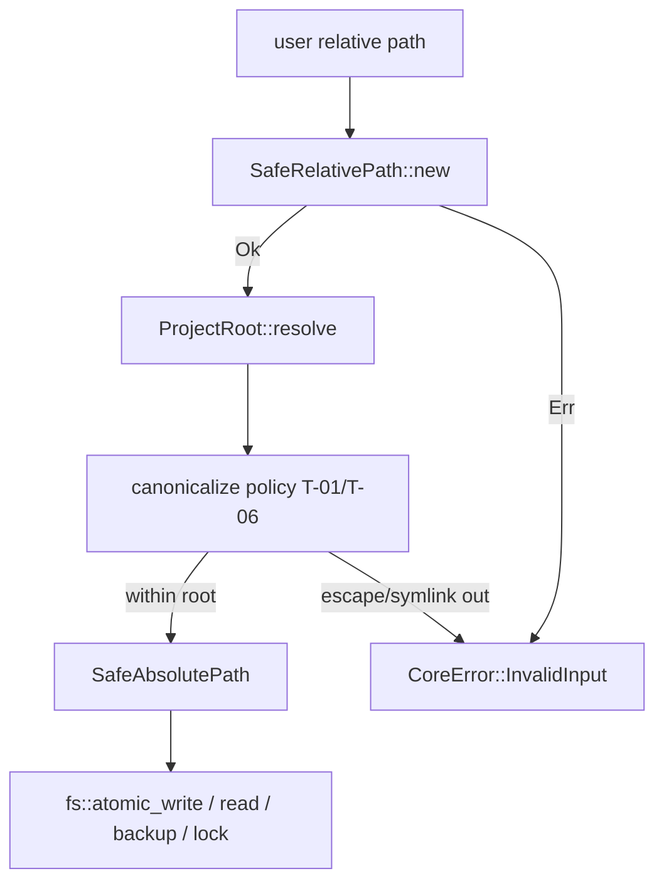

# BLUEPRINT: Filesystem seguro e path safety (Microplano 005)

> **Gerado a partir de:** `DARE/DESIGN-005-filesystem-seguro-e-path-safety.md` v1.0  
> **Data:** 2026-07-20 | **Status:** DRAFT  
> **Arquivo:** `DARE/BLUEPRINT-005-filesystem-seguro-e-path-safety.md`  
> **Não substitui:** Blueprints 001–004

---

## 0. TRADE-OFFS (Architect)

Sem `PATTERNS.md` / `patterns-facts.json` — decisões 🟡 a partir do Design 005 + Documento Mestre + erros 004.

| # | Trade-off | Escolha | Justificativa |
|---|-----------|---------|---------------|
| T-01 | Symlink/junction | **Deny se target final (canonicalize) sai do root**; links internos OK | RS-06; alinhado a path-safety TS |
| T-02 | Backup location | **`.dare/backups/<utc>-<sha8>/<posix-rel>`** | Isolado do tree de produto; sob jail; preparado para update futuro |
| T-03 | File lock | **`fs4` 0.12.1** try-lock exclusivo | Sucessor de fs2; Win+Unix; try_lock evita hang em CI |
| T-04 | Path UTF-8 | **`camino` 1.1.9** (`Utf8Path`/`Utf8PathBuf`) | Documento Mestre; evita OsStr opaco em APIs públicas |
| T-05 | Erro de escape | **`CoreError::invalid_input`** mensagem fixa (abaixo) | Exit 4; SHOULD vs TS |
| T-06 | Path ainda não existe | **Canonicalize o ancestral existente** + join dos segmentos restantes; depois `is_within_root` | R-02 |
| T-07 | UNC / drive fora do root | **Rejeitar** (InvalidInput) | R-05 |
| T-08 | Soft-delete avançado | **Fora (COULD)** | RF-16 |

**Mensagem canónica de escape (en-US):**

```text
path must be relative and stay within the project
```

(Display de `CoreError` já prefixa via thiserror; testes assertam `contains` desta substring.)

---

## 1. VISÃO GERAL DA ARQUITETURA



**Decisões:**

| Decisão | Escolha | Justificativa |
|---------|---------|---------------|
| Sem I/O sem root | Toda write/read/backup exige `&ProjectRoot` | RNF-01 |
| Locks em ficheiro auxiliar | Lock file = `<target>.darelock` no mesmo dir | Evita lock no conteúdo durante replace |
| Atomic write | temp `.<name>.tmp.<pid>` → fsync best-effort → `rename` | RS-07 |
| CLI surface | **Sem novo subcomando** neste ciclo | Só lib + testes + docs |

---

## 2. STACK TÉCNICA DEFINIDA

| Camada | Tecnologia | Versão | Papel |
|--------|-----------|--------|-------|
| Rust | 1.85.0 | pin | — |
| CoreError | 004 | — | InvalidInput / Io |
| camino | **1.1.9** | workspace | Utf8 paths |
| tempfile | **3.20.0** | workspace | tempdirs testes + temps |
| fs4 | **0.12.1** | workspace | exclusive try_lock |
| sha2 | **0.10.9** | workspace | sha8 no path de backup (curto) |

---

## 3. ESTRUTURA DE PASTAS E ARQUIVOS

```text
crates/dare-core/src/
├── lib.rs                 # EDIT: mods + re-exports
├── path.rs                # NOVO
└── fs/
    ├── mod.rs             # NOVO
    ├── atomic.rs          # NOVO: atomic_write / read_to_string
    ├── backup.rs          # NOVO: backup / restore
    └── lock.rs            # NOVO: FileLock

docs/compatibility/
└── path-safety.md         # NOVO

docs/DECISION-LOG.md       # APPEND DEC-006

docker-compose.ci.yml      # VERIFICAR (Fase 1)
```

---

## 4. MODELO DE DADOS (tipos)

### 4.1 `SafeRelativePath`

```rust
#[derive(Debug, Clone, PartialEq, Eq, Hash)]
pub struct SafeRelativePath {
    // always stored with `/` separators, no leading `/`, no `..`, no empty `.` segments except ""
    inner: String,
}

impl SafeRelativePath {
    /// Parse user/input path. Rejects absolute, `..`, NUL, empty, Windows UNC prefix, drive `X:`.
    pub fn new(raw: &str) -> CoreResult<Self>;

    pub fn as_str(&self) -> &str; // POSIX form
    pub fn to_path_buf(&self) -> Utf8PathBuf;
}
```

**Regras de rejeição (`InvalidInput` + mensagem canónica ou mais específica):**

| Input | Resultado |
|-------|-----------|
| `""` | Err |
| `../x`, `a/../../b` | Err |
| `/abs`, `C:\x`, `\\server\share` | Err |
| `a\0b` | Err |
| `foo/bar` | Ok → `foo/bar` |
| `foo\\bar` (Windows style) | Ok → normalizado `foo/bar` |
| `.` / `./foo` | Ok → `foo` (strip `.`) |

### 4.2 `ProjectRoot`

```rust
#[derive(Debug, Clone)]
pub struct ProjectRoot {
    // absolute, canonicalized Utf8 path to existing directory
    root: Utf8PathBuf,
}

impl ProjectRoot {
    /// `dir` must exist and be a directory. Canonicalizes.
    pub fn new(dir: impl AsRef<Path>) -> CoreResult<Self>;

    pub fn as_path(&self) -> &Utf8Path;
    pub fn to_posix(&self) -> String; // root as POSIX string

    /// Resolve relative path under jail. Applies T-01/T-06.
    pub fn resolve(&self, rel: &SafeRelativePath) -> CoreResult<SafeAbsolutePath>;

    /// True if `candidate` (absolute) is within root (lexical + after canonicalize when exists).
    pub fn contains(&self, candidate: &Utf8Path) -> CoreResult<bool>;
}
```

### 4.3 `SafeAbsolutePath`

```rust
#[derive(Debug, Clone, PartialEq, Eq)]
pub struct SafeAbsolutePath {
    path: Utf8PathBuf, // absolute, verified within a ProjectRoot at construction
}

impl SafeAbsolutePath {
    pub fn as_path(&self) -> &Utf8Path;
    pub fn to_posix(&self) -> String;
}
```

Só construível via `ProjectRoot::resolve` (ou `pub(crate)` para testes).

### 4.4 Backup layout

```text
<root>/.dare/backups/<YYYYMMDDThhmmssZ>-<sha8>/<posix-rel-file>
```

- `sha8` = primeiros 8 hex de SHA-256 do `posix-rel` (estável).
- Timestamp UTC `YYYYMMDDThhmmssZ`.
- Cria dirs intermediários com `create_dir_all` só sob root.

---

## 5. CONTRATOS / FUNÇÕES PÚBLICAS (ANTI-STUB)

### 5.1 `to_posix`

```rust
pub fn to_posix(path: &Utf8Path) -> String;
```

Substitui `\` por `/`; não resolve `.`/`..` (isso é de `SafeRelativePath`/`resolve`).

### 5.2 `fs::read_to_string`

```rust
pub fn read_to_string(root: &ProjectRoot, rel: &SafeRelativePath) -> CoreResult<String>;
```

- resolve → open read → string UTF-8  
- Err: NotFound / Io / InvalidInput (escape)

### 5.3 `fs::atomic_write`

```rust
pub fn atomic_write(root: &ProjectRoot, rel: &SafeRelativePath, data: &[u8]) -> CoreResult<()>;
```

**Algoritmo (ordem):**
1. `abs = root.resolve(rel)?`
2. `create_dir_all(parent)` sob root
3. Criar temp no **mesmo** parent: `.<file_name>.tmp.<pid>`
4. Write all bytes; `sync_all` best-effort (ignore Unsupported)
5. `rename(temp, abs)` (atomic replace)
6. Se passo 4/5 falha: remover temp se existir; **não** truncar `abs` pré-existente

**Edge:** destino inexistente → create; destino existe → replace atómico.

### 5.4 `fs::backup` / `fs::restore`

```rust
pub fn backup(root: &ProjectRoot, rel: &SafeRelativePath) -> CoreResult<SafeRelativePath>;
// returns relative path of backup file under root (POSIX)

pub fn restore(root: &ProjectRoot, backup_rel: &SafeRelativePath, dest_rel: &SafeRelativePath) -> CoreResult<()>;
```

- `backup`: lê source via resolve; escreve em layout §4.4 via `atomic_write` no path de backup (SafeRelativePath derivado).
- `restore`: lê backup; `atomic_write` em `dest_rel`.
- Err se source/backup missing → `NotFound`.

### 5.5 `fs::FileLock`

```rust
pub struct FileLock { /* fs4::FileExt + File */ }

impl FileLock {
    /// Creates/opens `<abs>.darelock` and `try_lock_exclusive`.
    /// Err Io if lock held (WouldBlock mapped to Io message "file lock held").
    pub fn try_acquire(root: &ProjectRoot, rel: &SafeRelativePath) -> CoreResult<Self>;
}

impl Drop for FileLock {
    fn drop(&mut self); // unlock
}
```

**Concorrência:** segundo `try_acquire` no mesmo rel → Err (não bloqueia indefinidamente).

### 5.6 Symlink policy (T-01) — detalhe executável

Em `ProjectRoot::resolve`:
1. Construir path lexical `root.join(rel)` sem `..` (já garantido por SafeRelativePath).
2. Se o path **existe**: `canonicalize`; verificar `starts_with(root_canonical)` (com cuidado Win prefix `\\?\`); se symlink/junction apontar fora → Err InvalidInput mensagem canónica.
3. Se **não existe**: canonicalize o deepest existing ancestor; join remaining; verificar ancestor within root; rejeitar se algum componente intermédio for symlink para fora (walk).

### 5.7 Integração erros 004

| Situação | Kind | Exit |
|----------|------|------|
| traversal / fora do root / UNC inválido | InvalidInput | 4 |
| ficheiro ausente | NotFound | 3 |
| permissão / IO / lock held | Io | 5 |

Mensagens passam por constructors que já aplicam `redact`.

---

## 6. PLANO DE EXECUÇÃO (FASES)

### Fase 1: Containerização ← **SEMPRE PRIMEIRA**

**DONE:** `docker compose -f docker-compose.ci.yml config` exit 0.  
**Entregáveis:** verificação (sem novo Dockerfile).

---

### Fase 2: Deps workspace (`camino`, `tempfile`, `fs4`, `sha2`)

**DONE:** `cargo metadata` / `cargo check -p dare-core` OK com pins §2.  
**Entregáveis:** `Cargo.toml` + lockfile.

---

### Fase 3: `path.rs` — SafeRelativePath + ProjectRoot + resolve + to_posix

**DONE:** testes unitários: reject `..`, abs, UNC; accept `foo/bar`; POSIX normalize; jail escape fail.  
**Entregáveis:** `path.rs` + exports.

---

### Fase 4: Symlink/junction tests (+ Windows cfg)

**DONE:** teste Unix cria symlink para fora do root → resolve Err; symlink interno Ok (se viável em CI). Windows: `cfg(windows)` junction ou documentar skip com `#[ignore]` + nota DEC se runner não permitir.  
**Entregáveis:** testes + política documentada no código.

---

### Fase 5: `fs::atomic` + `fs::backup`/`restore`

**DONE:** atomic_write round-trip; simular falha pré-rename deixa original; backup/restore conteúdo igual.  
**Entregáveis:** `fs/atomic.rs`, `fs/backup.rs`.

---

### Fase 6: `fs::lock` + contenção

**DONE:** dois `try_acquire` sequenciais no mesmo path — segundo falha enquanto primeiro vivo.  
**Entregáveis:** `fs/lock.rs`.

---

### Fase 7: Docs + DEC-006

**DONE:** `docs/compatibility/path-safety.md` + DEC-006 (T-01…T-08).  
**Entregáveis:** docs.

---

### Fase 8: Auditoria ← **N-1**

**DONE:** `cargo test --workspace`; clippy `-D warnings`; `cargo audit`; `cargo deny check`; checklist RS-01…RS-09 na doc.

---

### Fase 9: Fechamento ← **N**

**DONE:** TASKS-005 100%; microplano 006 desbloqueado; release notes “Ciclo 005” na doc.

---

## 7. VALIDAÇÃO E SEGURANÇA

| Stack | Build | Test | Lint/Audit |
|-------|-------|------|------------|
| Rust | `cargo build --workspace` | `cargo test --workspace` | `cargo clippy --workspace --all-targets -- -D warnings` + audit + deny |

### RS → fases

| RS | Fase |
|----|------|
| RS-01 | 3–5 |
| RS-02 | 5, 8 |
| RS-03 | 3–6 |
| RS-04 | 2, 8 |
| RS-05 | 5, 8 |
| RS-06 | 4 |
| RS-07 | 5 |
| RS-08 | 6 |
| RS-09 | todas (sem Command) |

---

## 8. ESTRATÉGIA DE TESTES

| Tipo | Casos mínimos (nomes) |
|------|------------------------|
| Unit path | `safe_relative_rejects_dotdot_and_absolute` |
| Unit path | `to_posix_normalizes_backslashes` |
| Unit resolve | `resolve_keeps_path_within_root` |
| Integration | `symlink_escape_is_rejected` (`cfg(unix)`) |
| Integration | `atomic_write_preserves_original_on_pre_rename_failure` |
| Integration | `backup_restore_roundtrip` |
| Integration | `file_lock_try_acquire_contention` |
| Windows | `cfg(windows)` drive/UNC reject fixtures |

Usar `tempfile::tempdir()` sempre.

---

## 9. ESTRATÉGIA DE DEPLOY

| Ambiente | Nota |
|----------|------|
| Local / CI 003 | Sem workflow novo; testes cobrem Win runners no matrix existente |
| Releases | Fora (015) |

---

## 10. CHECKLIST DE APROVAÇÃO DO BLUEPRINT

- [ ] T-01…T-08 aceitos (deny symlink escape, `.dare/backups`, fs4, camino)
- [ ] Mensagem canónica de escape OK
- [ ] Assinaturas `atomic_write` / `backup` / `FileLock` revisadas
- [ ] Fases 1–9 com DONE verificáveis
- [ ] Pronto para `/dare-tasks` → `*-005-*` / `mp005-*`

---

## 11. PRÓXIMAS ETAPAS

1. Aprovar este Blueprint.  
2. `/dare-tasks` → `DARE/TASKS-005-…`, `dare-dag-005.yaml`, `EXECUTION-005/`.  
3. Após closeout → microplano 006.
