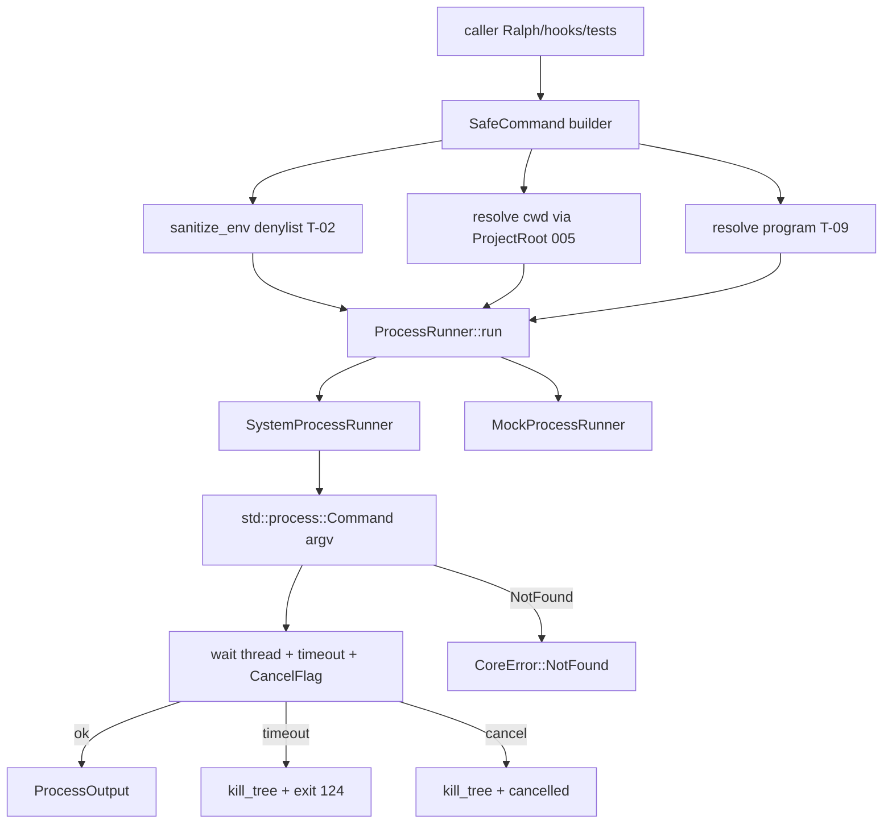

# BLUEPRINT: Execução segura de processos (Microplano 006)

> **Gerado a partir de:** `DARE/DESIGN-006-execucao-segura-de-processos.md` v1.0  
> **Data:** 2026-07-21 | **Status:** DRAFT  
> **Arquivo:** `DARE/BLUEPRINT-006-execucao-segura-de-processos.md`  
> **Não substitui:** Blueprints 001–005

---

## 0. TRADE-OFFS (Architect)

Sem `PATTERNS.md` / `patterns-facts.json` — decisões 🟡 a partir do Design 006 + Documento Mestre §5.5 + PM (aceite implícito ao avançar para Blueprint).

| # | Trade-off | Escolha | Justificativa |
|---|-----------|---------|---------------|
| T-01 | Runtime async | **`std::process` + thread de wait/timeout** — **sem** `tokio` em `dare-core` neste ciclo | Mantém core sync (004/005); evita runtime global; Classe B vs Mestre (`tokio::process`) — reavaliar quando `dare-cli` for async |
| T-02 | Env policy | **Denylist por substring** no nome (case-insensitive): `SECRET`, `TOKEN`, `KEY`, `PASSWORD` | Paridade TS safe-spawn; allowlist estrita = COULD futuro |
| T-03 | Kill-tree | **`kill_tree` 0.2.4** feature default `blocking` | Cross-platform (Unix+Win); API sync; se `bindgen` quebrar CI → fallback documentado em DEC + Job Object/`process_group` manual |
| T-04 | Cancel API | **`CancelFlag` = `Arc<AtomicBool>`** (ou `watch` mpsc drop) | Zero tokio; `runner.run` verifica flag no loop de wait |
| T-05 | Exit 124 | Só em **`ProcessOutput.exit_code`** (+ `timed_out=true`) | Não altera exit 1–5 do binário `dare` (004) |
| T-06 | Grace kill | **2 s** após TERM/equivalente → KILL via kill_tree | R-06 Design |
| T-07 | Truncate | **4000** Unicode scalar values (`chars().count()`) por stream | Paridade TS; flag `stdout_truncated` / `stderr_truncated` |
| T-08 | Encoding | UTF-8 **lossy** (`String::from_utf8_lossy`) | Determinismo; Classificar vs TS se divergir |
| T-09 | Programa | Bare name → PATH; relativo → jail 005; absoluto → só se dentro de `ProjectRoot` | Ralph precisa `cargo`/`npm`; paths de projeto ficam no jail |
| T-10 | Streaming | **Fora** (RF-16 COULD) | Buffer até EOF ou kill |
| T-11 | Shell | **Proibido** na API (`no shell:true`); argv only | RS-06 |
| T-12 | Exe ausente | **`CoreError::not_found`** mensagem fixa (abaixo) | Exit 3 do *CLI* se propagado; não confundir com 124 |

**Mensagem canónica — executável ausente (en-US):**

```text
executable not found
```

(opcional sufixo redacted `: <program>` se seguro; testes assertam `contains("executable not found")`.)

**Mensagem canónica — cwd escape:** reutilizar `path must be relative and stay within the project` (005).

---

## 1. VISÃO GERAL DA ARQUITETURA



**Decisões:**

| Decisão | Escolha | Justificativa |
|---------|---------|---------------|
| Trait runner | `ProcessRunner` + mock injetável | RF-10; testes sem side effects |
| Sem subcomando CLI | Só lib + testes + docs | Ciclo de primitivas (como 005) |
| Timeout default | **None** na API base; caller passa `Duration` | Ralph/verificação definem 600s depois |
| Limite default streams | 4000 chars | T-07 |

---

## 2. STACK TÉCNICA DEFINIDA

| Camada | Tecnologia | Versão | Papel |
|--------|-----------|--------|-------|
| Rust | 1.85.0 | pin | — |
| CoreError / redact | 004 | — | NotFound / InvalidInput / Io |
| Path / ProjectRoot | 005 | — | cwd + paths relativos |
| Processos | `std::process` | std | spawn argv |
| Kill tree | **`kill_tree` =0.2.4** | workspace | blocking tree kill |
| Sync | `std::sync::{Arc, AtomicBool, mpsc}` | std | cancel + wait |
| Testes | `tempfile` 3.20.0 | existente | fixtures |
| **Não** | `tokio` | — | T-01 |

---

## 3. ESTRUTURA DE PASTAS E ARQUIVOS

```text
crates/dare-core/src/
├── lib.rs                 # EDIT: mod process + re-exports
└── process/
    ├── mod.rs             # NOVO: re-exports públicos
    ├── command.rs         # NOVO: SafeCommand builder
    ├── env.rs             # NOVO: sanitize_env
    ├── output.rs          # NOVO: ProcessOutput
    ├── runner.rs          # NOVO: ProcessRunner + SystemProcessRunner
    ├── mock.rs            # NOVO: MockProcessRunner
    └── kill.rs            # NOVO: wrap kill_tree + grace 2s

docs/compatibility/
└── process-safety.md      # NOVO

docs/DECISION-LOG.md       # APPEND DEC-007

Cargo.toml                 # EDIT: workspace.dependencies kill_tree
crates/dare-core/Cargo.toml

docker-compose.ci.yml      # VERIFICAR (Fase 1)
```

---

## 4. MODELO DE DADOS (tipos)

### 4.1 `ProcessOutput`

```rust
#[derive(Debug, Clone, PartialEq, Eq)]
pub struct ProcessOutput {
    pub exit_code: i32,           // 124 se timed_out
    pub stdout: String,           // já truncado
    pub stderr: String,
    pub stdout_truncated: bool,
    pub stderr_truncated: bool,
    pub timed_out: bool,
    pub cancelled: bool,
}
```

**Invariantes:**
- Se `timed_out` → `exit_code == 124` e `cancelled == false`.
- Se `cancelled` → `timed_out == false`; `exit_code` = código após kill ou `-1` se indisponível — **fixar:** usar `exit_code = 124` só para timeout; cancel → `exit_code = -1` **ou** código OS se wait obteve; documentar: **`cancelled` ⇒ `exit_code = -1`** (sentinel estável).
- Truncate flags true ⇒ `chars().count() <= 4000` no campo correspondente.

### 4.2 `SafeCommand`

```rust
#[derive(Debug, Clone)]
pub struct SafeCommand {
    program: String,                    // bare, relative, or absolute (validated at run)
    args: Vec<String>,                  // argv[1..] — never joined into a shell line
    cwd: Option<CwdSpec>,
    extra_env: Vec<(String, String)>,   // applied AFTER sanitize of inherited env
    clear_env: bool,                    // if true: start empty then only extra_env (+ minimal PATH if needed — ver §5.2)
    timeout: Option<Duration>,
    stdout_limit: usize,                // default 4000
    stderr_limit: usize,                // default 4000
    cancel: Option<CancelFlag>,
}

#[derive(Debug, Clone)]
pub struct CwdSpec {
    root: ProjectRoot,
    rel: SafeRelativePath,
}

pub type CancelFlag = Arc<AtomicBool>; // true = cancel requested
```

**Builder (API pública):**

```rust
impl SafeCommand {
    pub fn new(program: impl Into<String>) -> Self;
    pub fn arg(self, arg: impl Into<String>) -> Self;
    pub fn args<I, S>(self, args: I) -> Self where I: IntoIterator<Item = S>, S: Into<String>;
    pub fn cwd(self, root: ProjectRoot, rel: SafeRelativePath) -> Self;
    pub fn env(self, key: impl Into<String>, val: impl Into<String>) -> Self;
    pub fn clear_env(self, clear: bool) -> Self;
    pub fn timeout(self, d: Duration) -> Self;
    pub fn stdout_limit(self, n: usize) -> Self;
    pub fn stderr_limit(self, n: usize) -> Self;
    pub fn cancel_flag(self, flag: CancelFlag) -> Self;
}
```

**Sem** método `shell(...)` / `raw_command(String)`.

### 4.3 `ProcessRunner`

```rust
pub trait ProcessRunner {
    fn run(&self, cmd: &SafeCommand) -> CoreResult<ProcessOutput>;
}

pub struct SystemProcessRunner;

pub struct MockProcessRunner {
    // interior: Mutex<Vec<MockRule>> or Fn
}
```

---

## 5. CONTRATOS / FUNÇÕES PÚBLICAS (ANTI-STUB)

### 5.1 `sanitize_env`

```rust
/// Filter inherited environment. Removes any entry whose key contains
/// (ASCII case-insensitive) one of: SECRET, TOKEN, KEY, PASSWORD.
pub fn sanitize_env(vars: impl IntoIterator<Item = (String, String)>) -> Vec<(String, String)>;

pub fn env_key_is_denied(key: &str) -> bool;
```

**Regras `env_key_is_denied`:**

| Key | Denied? |
|-----|---------|
| `API_TOKEN` | yes (`TOKEN`) |
| `MY_SECRET` | yes |
| `PASSWORD` | yes |
| `AWS_SECRET_ACCESS_KEY` | yes (`SECRET` e `KEY`) |
| `PATH` | no |
| `HOME` | no |
| `DARE_FOO` | no (salvo se contiver substring deny) |
| `monkey` | no |
| `keyring` | **yes** (`KEY` substring) — documentar; Classificar se baseline TS diferir |

**Edge:** `extra_env` em `SafeCommand` **também** passa por `env_key_is_denied` — se key denied → `Err(InvalidInput("environment variable name denied"))` (não injetar secret via API).

### 5.2 Resolução de `program` (T-09)

Ordem em `SystemProcessRunner::run`:

1. Se `program` contém `\0` → `InvalidInput`.
2. Se `program` é path absoluto (`Path::new(program).is_absolute()`):
   - Exige `cwd.root` presente **ou** `ProjectRoot` passado — **regra:** absoluto só permitido se `cmd.cwd` Some e `root.contains(abs)? == true`; senão `InvalidInput` (mensagem path escape ou `"absolute program path must stay within the project"`).
3. Se `program` contém separador `/` ou `\` (relativo):
   - Exige `cwd` Some; `root.resolve(SafeRelativePath::new(program)?)` → usar path absoluto resultante como `Command::new`.
4. Senão (bare name, ex. `cargo`, `git`):
   - `Command::new(program)` — resolução via PATH do env **já sanitizado**.

### 5.3 Resolução de `cwd`

- Se `cwd` Some: `root.resolve(&rel)?` → `Command::current_dir(abs)`.
- Se None: herda cwd do processo atual (documentar; testes devem setar cwd explícito quando path-sensitive).

### 5.4 `SystemProcessRunner::run` — algoritmo

```text
1. Validar program (5.2); montar std::process::Command com .args(cmd.args) — NUNCA shell.
2. Env:
   - if clear_env: env_clear(); then apply only filtered extra_env
   - else: env_clear(); apply sanitize_env(std::env::vars()); then apply filtered extra_env
3. stdout/stderr = Stdio::piped()
4. spawn() → Child
   - Err NotFound (os) → CoreError::not_found("executable not found")
   - outros Io → CoreError::io(redact)
5. Loop wait (thread ou try_wait + sleep 10–50ms):
   a. se cancel.load(Ordering::SeqCst) → kill_tree(pid); return Ok(ProcessOutput{ cancelled:true, exit_code:-1, ... buffers drained/truncated })
   b. se timeout elapsed → kill_with_grace(pid); return Ok(... timed_out:true, exit_code:124 ...)
   c. se child exited → drain pipes, truncate, return Ok
6. kill_with_grace:
   a. kill_tree::blocking::kill_tree(pid)  // TERM-ish via crate
   b. wait up to 2s for exit
   c. se ainda vivo: kill_tree novamente / force (crate API) 
```

**Drain + truncate:**

```rust
fn truncate_chars(s: String, limit: usize) -> (String, bool) {
    if s.chars().count() <= limit {
        (s, false)
    } else {
        (s.chars().take(limit).collect(), true)
    }
}
```

Ler pipes até EOF após exit/kill (evitar deadlock: threads leitoras **ou** `take` stdout/stderr antes do wait — **MUST:** usar duas threads reader ou `std::io::read_to_end` em threads joined após wait; padrão recomendado:

1. `let stdout = child.stdout.take();`
2. spawn thread `read_to_end`;
3. idem stderr;
4. wait loop no main;
5. join readers;
6. truncate.

### 5.5 `kill_with_grace`

```rust
pub(crate) fn kill_with_grace(pid: u32) -> CoreResult<()>;
```

- Chama `kill_tree::blocking::kill_tree(pid)` (mapear erro → `CoreError::io`).
- Sleep/poll até 2s se necessário (child handle).
- Segunda tentativa force se API permitir; senão log tracing warn + best-effort.

**Teste aceitável:** spawn `sleep 30` (Unix) / `timeout /t 30` **como argv** (`Command::new("sleep").arg("30")`) — **não** via shell string; após timeout curto (200ms), assert `timed_out` e processo não listável (best-effort `kill_tree` + `try_wait`).

### 5.6 `MockProcessRunner`

```rust
impl MockProcessRunner {
    pub fn new() -> Self;
    /// Queue FIFO responses for the next `run` calls (ignores cmd or matches by program).
    pub fn push(&self, output: ProcessOutput);
    pub fn push_err(&self, err: CoreError);
    /// If set, only matches when cmd.program == program.
    pub fn when_program(&self, program: &str, output: ProcessOutput);
}

impl ProcessRunner for MockProcessRunner {
    fn run(&self, cmd: &SafeCommand) -> CoreResult<ProcessOutput>;
}
```

- **MUST NOT** chamar `std::process::Command`.
- Se fila vazia e sem match → `CoreError::internal("mock process runner: no response queued")`.

### 5.7 Integração erros 004

| Situação | Tipo | Exit CLI se propagado |
|----------|------|------------------------|
| exe ausente | `NotFound` | 3 |
| cwd/program escape, env key denied, NUL | `InvalidInput` | 4 |
| spawn/kill IO | `Io` | 5 |
| timeout / cancel / exit≠0 do filho | **`Ok(ProcessOutput)`** | N/A — caller decide |

---

## 6. PLANO DE EXECUÇÃO (FASES)

### Fase 1: Containerização ← **SEMPRE PRIMEIRA**

**DONE:** `docker compose -f docker-compose.ci.yml config` exit 0.  
**Entregáveis:** verificação (sem novo Dockerfile).

---

### Fase 2: Dep `kill_tree` workspace

**DONE:** `kill_tree = "=0.2.4"` em workspace + `dare-core`; `cargo check -p dare-core` OK (Win+local). Se bindgen falhar: parar e DEC fallback antes de seguir.  
**Entregáveis:** `Cargo.toml` + lockfile.

---

### Fase 3: Tipos — `SafeCommand`, `ProcessOutput`, `sanitize_env`

**DONE:** testes unitários denylist (`API_TOKEN` out, `PATH` in); builder sem shell API; invariantes truncate helper.  
**Entregáveis:** `process/{command,env,output,mod}.rs` + exports.

---

### Fase 4: `SystemProcessRunner` spawn + capture + truncate

**DONE:** run `echo`-equivalente cross-platform (`cmd` `/C` `echo` hello **só em teste Win** como program+args; Unix `/bin/echo` ou `echo`); stdout truncado em fixture >4000; bare `program` funciona.  
**Entregáveis:** `runner.rs` (sem timeout ainda ou timeout None).

---

### Fase 5: Timeout → 124 + kill_tree + grace 2s

**DONE:** comando long-running + timeout 200–500ms → `timed_out && exit_code==124`; pós-teste filho não zombie (best-effort assert).  
**Entregáveis:** `kill.rs` + timeout no runner.

---

### Fase 6: CancelFlag + `MockProcessRunner` + exe missing

**DONE:** cancel mid-run → `cancelled && exit_code==-1`; mock não spawna; path inexistente → `NotFound` + `"executable not found"`.  
**Entregáveis:** `mock.rs` + testes.

---

### Fase 7: Docs + DEC-007

**DONE:** `docs/compatibility/process-safety.md` + DEC-007 (T-01…T-12, Classe B tokio).  
**Entregáveis:** docs.

---

### Fase 8: Auditoria ← **N-1**

**DONE:** `cargo test --workspace`; clippy `-D warnings`; `cargo audit`; `cargo deny check`; RS-01…RS-09 mapeados na doc.

---

### Fase 9: Fechamento ← **N**

**DONE:** TASKS-006 100%; microplano 007 desbloqueado; release notes “Ciclo 006” na doc.

---

## 7. VALIDAÇÃO E SEGURANÇA

| Stack | Build | Test | Lint/Audit |
|-------|-------|------|------------|
| Rust | `cargo build --workspace` | `cargo test --workspace` | `cargo clippy --workspace --all-targets -- -D warnings` + audit + deny |

### RS → fases

| RS | Fase |
|----|------|
| RS-01 | 3–6 |
| RS-02 | 3, 4, 7 |
| RS-03 | 3–5 |
| RS-04 | 2, 8 |
| RS-05 | 4–6, 8 |
| RS-06 | 3–4 (sem shell) |
| RS-07 | 5–6 |
| RS-08 | 4 |
| RS-09 | 6 |

---

## 8. ESTRATÉGIA DE TESTES

| Tipo | Caso mínimo (nome) |
|------|---------------------|
| Unit | `sanitize_env_strips_token_secret_key_password` |
| Unit | `sanitize_env_keeps_path_and_home` |
| Unit | `extra_env_denied_key_is_invalid_input` |
| Unit | `truncate_chars_at_4000` |
| Unit | `mock_runner_returns_queued_output_without_spawn` |
| Integration | `system_runner_echo_ok` |
| Integration | `system_runner_truncates_stdout` |
| Integration | `system_runner_timeout_returns_124` |
| Integration | `system_runner_cancel_sets_cancelled` |
| Integration | `system_runner_missing_exe_not_found` |
| Integration | `relative_program_outside_root_rejected` (`cwd` + path) |
| cfg | Windows echo via `cmd.exe` + args `/C` `echo` `hi` (argv separado) |

Fixtures: `tempfile::tempdir()` + `ProjectRoot::new` quando cwd/jail.

---

## 9. ESTRATÉGIA DE DEPLOY

| Ambiente | Nota |
|----------|------|
| Local / CI 003 | Sem workflow novo; matrix Win/macOS/Linux exercita kill/timeout |
| Releases | Fora (015) |

---

## 10. CHECKLIST DE APROVAÇÃO DO BLUEPRINT

- [ ] T-01…T-12 aceitos (`std::process`, denylist, kill_tree 0.2.4, 124 só em ProcessOutput, cancel −1)
- [ ] Resolução de program (bare / relativo / absoluto) OK
- [ ] Assinaturas `ProcessRunner` / `SafeCommand` / `MockProcessRunner` revisadas
- [ ] Fases 1–9 com DONE verificáveis
- [ ] Pronto para `/dare-tasks` → `*-006-*` / `mp006-*`

---

## 11. PRÓXIMAS ETAPAS

1. Aprovar este Blueprint.  
2. `/dare-tasks` → `DARE/TASKS-006-…`, `dare-dag-006.yaml`, `EXECUTION-006/`.  
3. Após closeout → microplano 007 (`007-contratos-persistidos.md`).
