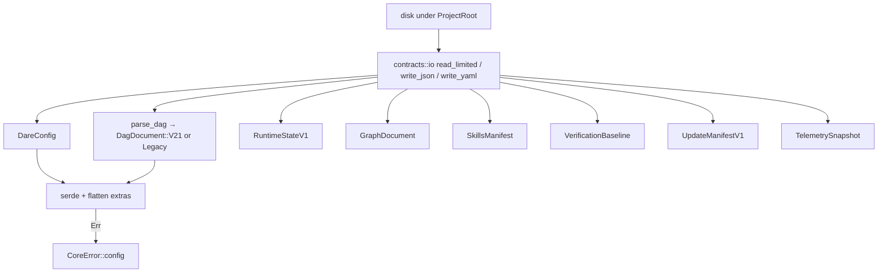

# BLUEPRINT: Contratos persistidos (Microplano 007)

> **Gerado a partir de:** `DARE/DESIGN-007-contratos-persistidos.md` v1.0  
> **Data:** 2026-07-21 | **Status:** DRAFT  
> **Arquivo:** `DARE/BLUEPRINT-007-contratos-persistidos.md`  
> **Não substitui:** Blueprints 001–006

---

## 0. TRADE-OFFS (Architect)

Sem `PATTERNS.md` / `patterns-facts.json` — decisões 🟡 a partir do Design 007 + Documento Mestre §13 + ADR-002 + `disk-and-json-policy.md`.

| # | Trade-off | Escolha | Justificativa |
|---|-----------|---------|---------------|
| T-01 | Flatten | **Raiz + cada bloco tipado conhecido** com `#[serde(flatten)] extra: Map<String, Value>` | ADR-002; preserva unknown keys nested sem perder tipagem dos campos MUST |
| T-02 | YAML crate | **`serde_yaml = { package = "yaml_serde", version = "=0.10.4" }`** | Fork mantido (MSRV 1.82); `serde_yaml` 0.9.34 deprecated; imports `serde_yaml::` via rename |
| T-03 | Validação deep | **Só serde neste ciclo**; garde/validator → 008 | R-06; unblocks types+IO |
| T-04 | Cap de ficheiro | **2 MiB** (`MAX_CONTRACT_BYTES`) | RS-07 DoS; suficiente para DAG/config típicos |
| T-05 | JSON write | **`dare_core::to_canonical_json_string`** + `atomic_write` | ADR-002 keys lex |
| T-06 | YAML write | **`serde_yaml::to_string`** + `atomic_write`; testes de **igualdade semântica** (re-parse), não byte-igual ao js-yaml | R-02 Classe B whitespace |
| T-07 | DAG detect | Se documento YAML tem `tasks` como **sequência** → `DagV21`; se mapping id→task → `LegacyDag` | Doc Mestre §5.2 |
| T-08 | Graph SQLite | **Fora** — só YAML/JSON document model | RF-17 / 040+ |
| T-09 | Erros parse | **`CoreError::config`** (exit 4) para schema/malformed; `InvalidInput` path; `NotFound` ficheiro; `Io` resto | Alinha 004 |
| T-10 | schema_version crate | Substituir placeholder por **`0.1.0-contracts`** constante documentada (não bump disco) | Distinto de version fields nos ficheiros |

**Mensagens canónicas (en-US):**

```text
contract file exceeds size limit
invalid dare.config.json
invalid dare-dag.yaml
invalid .dare/state.json
```

(testes: `contains` substring estável.)

---

## 1. VISÃO GERAL DA ARQUITETURA



**Decisões:**

| Decisão | Escolha | Justificativa |
|---------|---------|---------------|
| Crate boundary | `dare-contracts` → `dare-core` only | R-05 |
| Sem subcomando CLI | Lib + fixtures + docs | Como 005/006 |
| Value type | `serde_json::Value` / `Map` para extras | Ubíquo; YAML desserializa para Value via serde |

---

## 2. STACK TÉCNICA DEFINIDA

| Camada | Tecnologia | Versão | Papel |
|--------|-----------|--------|-------|
| Rust | 1.85.0 | pin | — |
| dare-core | path | erros, path, fs, JSON canónico | |
| serde | **1.0.219** | workspace | derive |
| serde_json | **1.0.140** | workspace | Value/Map |
| YAML | **yaml_serde 0.10.4** as `serde_yaml` | workspace | parse/emit |
| garde/validator | **não** | — | T-03 |

---

## 3. ESTRUTURA DE PASTAS E ARQUIVOS

```text
crates/dare-contracts/
├── Cargo.toml                 # EDIT: deps
├── src/
│   ├── lib.rs                 # EDIT: mods + re-exports + CONTRACTS_SCHEMA_VERSION
│   ├── io.rs                  # NOVO: read_limited, write_json_atomic, write_yaml_atomic
│   ├── config.rs              # NOVO: DareConfig
│   ├── dag.rs                 # NOVO: DagV21, LegacyDag, DagDocument, parse_dag
│   ├── state.rs               # NOVO: RuntimeStateV1
│   ├── graph.rs               # NOVO: GraphNode, GraphEdge, GraphDocument
│   ├── skills.rs              # NOVO: SkillsManifest
│   ├── verification.rs        # NOVO: VerificationBaseline
│   ├── update_manifest.rs     # NOVO: UpdateManifestV1
│   └── telemetry.rs           # NOVO: TelemetrySnapshot
└── tests/
    ├── fixtures/              # NOVO: 1+ por artefato
    │   ├── dare.config.json
    │   ├── dare-dag.v21.yaml
    │   ├── dare-dag.legacy.yaml
    │   ├── state.v1.json
    │   ├── dare-graph.yml
    │   ├── skills.yml
    │   ├── verification.task.json
    │   ├── UPDATE-MANIFEST.json
    │   └── telemetry.snapshot.json
    └── roundtrip.rs           # NOVO: integration

docs/compatibility/persisted-contracts.md  # NOVO
docs/DECISION-LOG.md                       # APPEND DEC-008
docker-compose.ci.yml                      # VERIFICAR Fase 1
```

---

## 4. MODELO DE DADOS (tipos)

### 4.0 Constante

```rust
pub const CONTRACTS_SCHEMA_VERSION: &str = "0.1.0-contracts";
pub const MAX_CONTRACT_BYTES: u64 = 2 * 1024 * 1024;
```

### 4.1 `DareConfig`

```rust
#[derive(Debug, Clone, Serialize, Deserialize, PartialEq)]
pub struct DareConfig {
    #[serde(default, skip_serializing_if = "Option::is_none")]
    pub ide: Option<String>,
    #[serde(default, skip_serializing_if = "Option::is_none")]
    pub project: Option<ConfigObject>,
    // blocos opt-in conhecidos — tipados como ConfigObject (mapa + flatten interno)
    #[serde(default, skip_serializing_if = "Option::is_none")]
    pub agent: Option<ConfigObject>,
    #[serde(default, skip_serializing_if = "Option::is_none")]
    pub guard: Option<ConfigObject>,
    #[serde(default, skip_serializing_if = "Option::is_none")]
    pub graph: Option<ConfigObject>,
    #[serde(default, skip_serializing_if = "Option::is_none")]
    pub hooks: Option<ConfigObject>,
    #[serde(flatten)]
    pub extra: Map<String, Value>,
}

/// Objeto JSON genérico com extras preservados (blocos nested).
#[derive(Debug, Clone, Serialize, Deserialize, PartialEq, Default)]
pub struct ConfigObject {
    #[serde(default, skip_serializing_if = "Option::is_none")]
    pub enabled: Option<bool>,
    #[serde(flatten)]
    pub extra: Map<String, Value>,
}
```

**Regra:** chaves tipadas (`ide`, `project`, …) **não** duplicam em `extra`. Unknown top-level → `extra`.

### 4.2 DAG

```rust
#[derive(Debug, Clone, Serialize, Deserialize, PartialEq)]
pub struct DagV21 {
    pub title: String,
    pub version: String,
    #[serde(default)]
    pub limits: DagLimits,
    #[serde(default)]
    pub models: Map<String, Map<String, String>>,
    pub tasks: Vec<DagTask>,
    #[serde(flatten)]
    pub extra: Map<String, Value>,
}

#[derive(Debug, Clone, Serialize, Deserialize, PartialEq)]
pub struct DagLimits {
    #[serde(default = "default_parent_ctx")]
    pub parent_context_chars: u32, // 2000
    #[serde(default = "default_task_out")]
    pub task_output_chars: u32,    // 4000
    #[serde(default = "default_timeout")]
    pub timeout_seconds: u32,      // 600
    #[serde(flatten)]
    pub extra: Map<String, Value>,
}

#[derive(Debug, Clone, Serialize, Deserialize, PartialEq)]
pub struct DagTask {
    pub id: String,
    pub title: String,
    #[serde(default)]
    pub depends_on: Vec<String>,
    pub complexity: String, // LOW|MED|HIGH — string para paridade; validação estrita em 026
    #[serde(default)]
    pub subtask_prompt: String,
    #[serde(default)]
    pub spec_file: String,
    #[serde(flatten)]
    pub extra: Map<String, Value>,
}

/// Legacy: mapping task-id → task body (sem array `tasks`).
#[derive(Debug, Clone, Serialize, Deserialize, PartialEq)]
pub struct LegacyDag {
    #[serde(flatten)]
    pub tasks: Map<String, LegacyTask>,
}

#[derive(Debug, Clone, Serialize, Deserialize, PartialEq)]
pub struct LegacyTask {
    #[serde(default)]
    pub title: String,
    #[serde(default)]
    pub depends_on: Vec<String>,
    #[serde(default)]
    pub complexity: String,
    #[serde(flatten)]
    pub extra: Map<String, Value>,
}

#[derive(Debug, Clone, PartialEq)]
pub enum DagDocument {
    V21(DagV21),
    Legacy(LegacyDag),
}
```

### 4.3 `RuntimeStateV1`

```rust
#[derive(Debug, Clone, Serialize, Deserialize, PartialEq)]
pub struct RuntimeStateV1 {
    pub version: u32, // must be 1 on write; reject !=1 on strict read? → Err config "unsupported state version"
    pub updated_at: String, // serde rename updatedAt
    #[serde(default)]
    pub tasks: Map<String, TaskRuntimeState>,
    #[serde(flatten)]
    pub extra: Map<String, Value>,
}

#[derive(Debug, Clone, Serialize, Deserialize, PartialEq)]
pub struct TaskRuntimeState {
    pub status: String,
    #[serde(default)]
    pub output: String,
    #[serde(default)]
    pub error: String,
    #[serde(default)]
    pub tokens: Option<u64>,
    #[serde(default)]
    pub duration: Option<u64>,
    #[serde(default)]
    pub attempts: Vec<AttemptRecord>,
    #[serde(default, rename = "parentId")]
    pub parent_id: Option<String>,
    #[serde(default, rename = "dependsOn")]
    pub depends_on: Vec<String>,
    #[serde(flatten)]
    pub extra: Map<String, Value>,
}

#[derive(Debug, Clone, Serialize, Deserialize, PartialEq)]
pub struct AttemptRecord {
    pub n: u32,
    pub at: String,
    pub passed: bool,
    #[serde(default, rename = "failureSignature")]
    pub failure_signature: Option<String>,
    #[serde(default, rename = "failedAspect")]
    pub failed_aspect: Option<String>,
    #[serde(flatten)]
    pub extra: Map<String, Value>,
}
```

Use `#[serde(rename_all = "camelCase")]` on structs that need `updatedAt` if cleaner — **MUST** match fixture field names (`updatedAt`, `failureSignature`).

### 4.4 Graph

```rust
#[derive(Debug, Clone, Serialize, Deserialize, PartialEq)]
pub struct GraphDocument {
    #[serde(default)]
    pub nodes: Vec<GraphNode>,
    #[serde(default)]
    pub edges: Vec<GraphEdge>,
    #[serde(flatten)]
    pub extra: Map<String, Value>,
}

#[derive(Debug, Clone, Serialize, Deserialize, PartialEq)]
pub struct GraphNode {
    pub id: String,   // e.g. task:mp007-001
    #[serde(rename = "type")]
    pub node_type: String,
    pub label: String,
    #[serde(default)]
    pub description: String,
    #[serde(default)]
    pub metadata: Map<String, Value>,
    #[serde(flatten)]
    pub extra: Map<String, Value>,
}

#[derive(Debug, Clone, Serialize, Deserialize, PartialEq)]
pub struct GraphEdge {
    pub id: String, // kind:from->to
    #[serde(rename = "source_id", alias = "sourceId")]
    pub source_id: String,
    #[serde(rename = "target_id", alias = "targetId")]
    pub target_id: String,
    #[serde(rename = "type")]
    pub edge_type: String,
    #[serde(default)]
    pub weight: f64,
    #[serde(default)]
    pub metadata: Map<String, Value>,
    #[serde(flatten)]
    pub extra: Map<String, Value>,
}
```

Helpers (pure):

```rust
pub fn canonical_task_node_id(task_id: &str) -> String; // format!("task:{task_id}")
pub fn canonical_file_node_id(posix_path: &str) -> String;
pub fn canonical_edge_id(kind: &str, from: &str, to: &str) -> String;
```

### 4.5 `SkillsManifest`

```rust
#[derive(Debug, Clone, Serialize, Deserialize, PartialEq)]
pub struct SkillsManifest {
    #[serde(default)]
    pub version: Option<String>,
    #[serde(default)]
    pub skills: Vec<SkillEntry>,
    #[serde(flatten)]
    pub extra: Map<String, Value>,
}

#[derive(Debug, Clone, Serialize, Deserialize, PartialEq)]
pub struct SkillEntry {
    pub id: String,
    #[serde(default)]
    pub version: Option<String>,
    #[serde(flatten)]
    pub extra: Map<String, Value>,
}
```

### 4.6 `VerificationBaseline`

```rust
#[derive(Debug, Clone, Serialize, Deserialize, PartialEq)]
pub struct VerificationBaseline {
    #[serde(default, rename = "taskId")]
    pub task_id: Option<String>,
    #[serde(default)]
    pub aspects: Map<String, Value>,
    #[serde(flatten)]
    pub extra: Map<String, Value>,
}
```

### 4.7 `UpdateManifestV1`

```rust
#[derive(Debug, Clone, Serialize, Deserialize, PartialEq)]
pub struct UpdateManifestV1 {
    #[serde(rename = "schemaVersion")]
    pub schema_version: u32, // expect 1
    #[serde(default)]
    pub releases: Vec<Value>, // opaque até 021
    #[serde(flatten)]
    pub extra: Map<String, Value>,
}
```

### 4.8 `TelemetrySnapshot`

```rust
#[derive(Debug, Clone, Serialize, Deserialize, PartialEq, Default)]
pub struct TelemetrySnapshot {
    #[serde(default)]
    pub dag: Map<String, Value>,
    #[serde(default)]
    pub gates: Map<String, Value>,
    #[serde(default)]
    pub cost: Map<String, Value>,
    #[serde(default, rename = "bestOfN")]
    pub best_of_n: Map<String, Value>,
    #[serde(default)]
    pub guard: Map<String, Value>,
    #[serde(default)]
    pub drift: Map<String, Value>,
    #[serde(flatten)]
    pub extra: Map<String, Value>,
}
```

---

## 5. CONTRATOS / FUNÇÕES PÚBLICAS (ANTI-STUB)

### 5.1 `io`

```rust
pub fn read_limited(root: &ProjectRoot, rel: &SafeRelativePath) -> CoreResult<Vec<u8>>;
// 1. resolve; 2. metadata len > MAX_CONTRACT_BYTES → config("contract file exceeds size limit")
// 3. read via dare_core::fs::read_to_string or read bytes

pub fn write_json_atomic<T: Serialize>(root: &ProjectRoot, rel: &SafeRelativePath, value: &T) -> CoreResult<()>;
// serialize Value via serde_json::to_value → to_canonical_json_string → atomic_write bytes

pub fn write_yaml_atomic<T: Serialize>(root: &ProjectRoot, rel: &SafeRelativePath, value: &T) -> CoreResult<()>;
// serde_yaml::to_string → atomic_write

pub fn from_json_slice<T: DeserializeOwned>(bytes: &[u8]) -> CoreResult<T>;
pub fn from_yaml_str<T: DeserializeOwned>(s: &str) -> CoreResult<T>;
// map serde errors → CoreError::config(redact(msg))
```

### 5.2 Config

```rust
pub fn load_dare_config(root: &ProjectRoot, rel: &SafeRelativePath) -> CoreResult<DareConfig>;
pub fn save_dare_config(root: &ProjectRoot, rel: &SafeRelativePath, cfg: &DareConfig) -> CoreResult<()>;
```

**Round-trip teste:** fixture com `"customExtension": {"x":1}` → load → save → load → `extra` contém chave; valor preservado.

### 5.3 DAG

```rust
pub fn parse_dag_yaml(text: &str) -> CoreResult<DagDocument>;
pub fn load_dag(root: &ProjectRoot, rel: &SafeRelativePath) -> CoreResult<DagDocument>;
pub fn save_dag(root: &ProjectRoot, rel: &SafeRelativePath, doc: &DagDocument) -> CoreResult<()>;
```

**Detector T-07:**

1. Parse YAML → `Value`.
2. Se `Value` é Mapping e contém key `tasks` cujo valor é **Sequence** → deserialize `DagV21`.
3. Senão se Mapping e **não** tem `tasks` sequence (ou `tasks` ausente) e parece mapa de tasks → `LegacyDag`.
4. Senão → `Err(config("invalid dare-dag.yaml"))`.

### 5.4 Demais load/save

Para cada tipo: `load_*` / `save_*` / `from_str` espelhando §5.2 (state, graph, skills, verification, update_manifest, telemetry).

Telemetria: `from_str`/`to_canonical_json` suficiente (ficheiro opcional).

### 5.5 Edge cases

| Input | Resultado |
|-------|-----------|
| Ficheiro > 2 MiB | `Config` + size limit msg |
| JSON truncado | `Config` invalid … |
| state `version: 2` | `Config` `"unsupported state version"` |
| UpdateManifest `schemaVersion: 0` | Parse OK se campo presente; **warn via teste** — reject se ≠1 no `load` estrito: `Err(config("unsupported update manifest schemaVersion"))` |
| Path escape | `InvalidInput` path msg 005 |
| Missing file | `NotFound` |

---

## 6. PLANO DE EXECUÇÃO (FASES)

### Fase 1: Containerização ← **SEMPRE PRIMEIRA**

**DONE:** `docker compose -f docker-compose.ci.yml config` exit 0.

---

### Fase 2: Deps workspace (`yaml_serde` as serde_yaml)

**DONE:** pin `serde_yaml = { package = "yaml_serde", version = "=0.10.4" }` + `dare-contracts` deps (`serde`, `serde_json`, `serde_yaml`, `dare-core`); `cargo check -p dare-contracts`.

---

### Fase 3: `io.rs` + version constant

**DONE:** `read_limited` rejeita >2MiB; `write_json_atomic` keys lex; `CONTRACTS_SCHEMA_VERSION = "0.1.0-contracts"`; testes unitários size + json roundtrip tempdir.

---

### Fase 4: `DareConfig` load/save + flatten

**DONE:** testes `config_preserves_unknown_root_keys`; `config_preserves_nested_block_extras`.

---

### Fase 5: `DagV21` + `LegacyDag` + `parse_dag`

**DONE:** fixtures v21 + legacy parseiam; save V21 re-parse OK; detector cobre ambos.

---

### Fase 6: State + Verification + Telemetry (JSON)

**DONE:** tipos + load/save/from_str; fixture state com `failureSignature`; version≠1 rejeitado.

---

### Fase 7: Graph + Skills + UpdateManifest (YAML/JSON)

**DONE:** GraphDocument + IDs helpers; SkillsManifest; UpdateManifest schemaVersion=1; testes parse fixtures.

---

### Fase 8: Suite fixtures + `tests/roundtrip.rs`

**DONE:** ≥1 fixture por artefato MUST; integration roundtrip no tempdir sob `ProjectRoot`.

---

### Fase 9: Docs + DEC-008

**DONE:** `docs/compatibility/persisted-contracts.md` + DEC-008 (T-01…T-10).

---

### Fase 10: Auditoria ← **N-1**

**DONE:** `cargo test --workspace`; clippy `-D warnings`; audit; deny; RS checklist na doc.

---

### Fase 11: Fechamento ← **N**

**DONE:** TASKS-007 100%; microplano 008 desbloqueado.

---

## 7. VALIDAÇÃO E SEGURANÇA

| Stack | Build | Test | Lint/Audit |
|-------|-------|------|------------|
| Rust | `cargo build --workspace` | `cargo test --workspace` | clippy `-D warnings` + audit + deny |

### RS → fases

| RS | Fase |
|----|------|
| RS-01 | 3–8 |
| RS-02 | 8–9 |
| RS-03 | 3–8 |
| RS-04 | 2, 10 |
| RS-05 | 8 |
| RS-06 | todas |
| RS-07 | 3 |
| RS-08 | 3–7 |
| RS-09 | todas |

---

## 8. ESTRATÉGIA DE TESTES

| Tipo | Caso |
|------|------|
| Unit | `read_limited_rejects_oversize` |
| Unit | `dare_config_roundtrip_preserves_extra` |
| Unit | `parse_dag_v21_and_legacy` |
| Unit | `runtime_state_rejects_version_2` |
| Unit | `canonical_edge_id_format` |
| Unit | `update_manifest_rejects_schema_0` |
| Integration | `fixtures_*_parse` |
| Integration | `atomic_write_config_under_project_root` |

---

## 9. ESTRATÉGIA DE DEPLOY

| Ambiente | Nota |
|----------|------|
| Local / CI 003 | Sem workflow novo |
| Releases | Fora (015) |

---

## 10. CHECKLIST DE APROVAÇÃO DO BLUEPRINT

- [ ] T-01…T-10 aceitos (flatten nested, yaml_serde 0.10.4, 2 MiB, sem garde)
- [ ] Campos state/DAG/graph revisados vs Doc Mestre
- [ ] Fases 1–11 com DONE verificáveis
- [ ] Pronto para `/dare-tasks` → `*-007-*` / `mp007-*`

---

## 11. PRÓXIMAS ETAPAS

1. Aprovar este Blueprint.  
2. `/dare-tasks` → `DARE/TASKS-007-…`, `dare-dag-007.yaml`, `EXECUTION-007/`.  
3. Após closeout → microplano 008 (`008-configuracao-e-migrations.md`).
