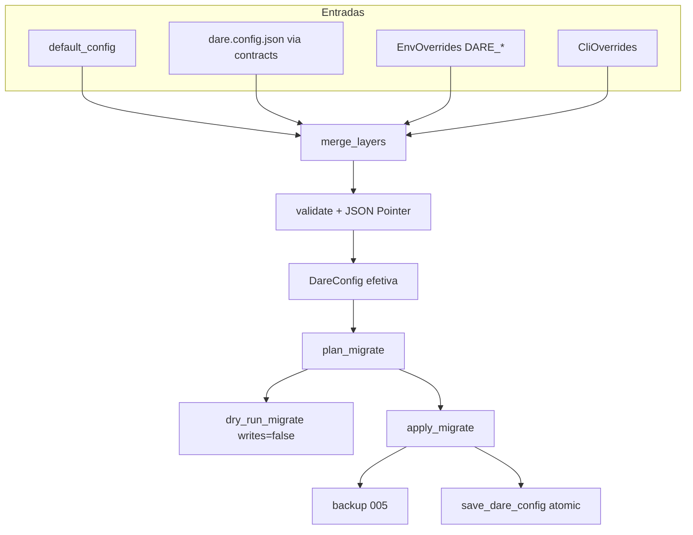

# BLUEPRINT: Configuração e migrations (Microplano 008)

> **Gerado a partir de:** `DARE/DESIGN-008-configuracao-e-migrations.md` v1.1 (APPROVED)  
> **Data:** 2026-07-21 | **Status:** DRAFT  
> **Arquivo:** `DARE/BLUEPRINT-008-configuracao-e-migrations.md`  
> **Não substitui:** Blueprints 001–007  
> **Estado do código:** crate `dare-config` já implementa a maior parte dos MUST — este Blueprint **congela contratos**, fecha gaps (export público, docs, fixtures golden) e define fases de verificação/closeout.  
> **DEC:** DEC-009 (active)

---

## 0. TRADE-OFFS (Architect)

Sem `DARE/PATTERNS.md` / `patterns-facts.json` neste repo — decisões 🟡 ancoradas no Design 008 + DEC-009 + código em `crates/dare-config`.

| # | Trade-off | Escolha | Justificativa |
|---|-----------|---------|---------------|
| T-01 | Precedência | **CLI > env > file > default** (`defaults ← file ← env ← cli`) | DEC-009; paridade observável npm 3.18.1 |
| T-02 | Env desconhecida | **Ignorar** (não erro) | Allowlist fechada; evita acoplamento a vars de terceiros |
| T-03 | Bool env inválido | Lenient: skip; **Strict**: `CoreError::Config` com `/env/{KEY}` | RF-18 SHOULD; `env_overrides_from_os` usa strict |
| T-04 | `schemaVersion` | Só em `extra` com `write_schema_version: true` | Nunca default; flatten ADR-002 |
| T-05 | Deep validation | **Skip** se `enabled: false`; deep Zod-parity = COULD (fora) | Evita falsos positivos em blocos desligados |
| T-06 | Migration steps v1 | `Noop`, `SetEnabled`, `WriteSchemaVersion` | Extensão só via ADR |
| T-07 | Apply sem steps | **Noop** (sem backup, sem write) | Evita churn de disco |
| T-08 | Apply com steps + ficheiro existia | `backup` **antes** de `save_dare_config` | RS-08 |
| T-09 | Apply com steps + ficheiro ausente | Grava novo sem backup | Não há original a preservar |
| T-10 | Superfície CLI | **Fora** (`dare config`/`migrate` = microplanos comando) | Biblioteca apenas |
| T-11 | Fingerprint | SHA-256 hex do JSON **canónico** (`to_canonical_json_string`) | Audit trail estável cross-OS |
| T-12 | Mensagens | en-US + JSON Pointer RFC 6901 | ADR-002 / language-policy |

---

## 0.1 GAP ANALYSIS (código → MUST)

| Item | Estado | Ação neste ciclo |
|------|--------|------------------|
| Módulos `defaults`/`load`/`merge`/`env`/`override`/`validate`/`migrate` | ✅ | Congelar API §5 |
| Matriz P1–P5 / B1–B3 em `tests/precedence.rs` | ✅ | Manter; reforçar se falhar CI |
| `dry_run_migrate` zero-write + teste | ✅ | Manter |
| `apply_migrate` backup + atomic | ✅ | Manter |
| Fixtures `legacy` / `with_extras` / `enabled_false` | ✅ ficheiros | Garantir testes de integração que as carregam |
| `env_overrides_from_vars_strict` | ✅ impl | **Re-exportar** em `lib.rs` (gap RF-18) |
| Docs `config-and-migrations.md` | ✅ básico | Expandir pointers, matriz P/B, steps, exemplos |
| DEC-009 | ✅ | Verificar coerência; não duplicar DEC |
| `dare config` CLI | ❌ COULD | Fora |
| Compose Fase 1 | — | Verificar `docker-compose.ci.yml` |

---

## 1. VISÃO GERAL DA ARQUITETURA

Biblioteca **modular** na crate `dare-config`: composição de camadas → validação → (opcional) migration plan/dry-run/apply. Persistência e path jail ficam em `dare-contracts` + `dare-core` (sem ciclo).



**Decisões arquiteturais:**

| Decisão | Escolha | Justificativa |
|---------|---------|---------------|
| Separação crates | config → contracts → core | Evita ciclo (R-08); I/O tipado no 007 |
| Merge deep só em `ConfigObject` | `enabled` OR + `extra` overlay | Preserva unknown nested (RF-07) |
| Migration como dados tipados | `MigrationStepKind` enum | RS-06 — nunca eval de JSON |
| Soft NotFound | file ausente = defaults+overrides | RF-03 |

---

## 2. STACK TÉCNICA DEFINIDA

| Camada | Tecnologia | Versão | Papel |
|--------|-----------|--------|-------|
| Rust | toolchain | **1.85.0** | MSRV workspace |
| Crate | `dare-config` | `0.1.0-alpha.0` | Domínio config/migrate |
| Contrato | `dare-contracts` | workspace | `DareConfig`, load/save, 2 MiB |
| Core | `dare-core` | workspace | `ProjectRoot`, `backup`, `CoreError`, JSON canónico |
| Serde | `serde` / `serde_json` | pins workspace | Serialize |
| Hash | `sha2` | pin workspace | Fingerprint |
| Test | `tempfile` | pin workspace | Integração FS |
| Container CI | `docker-compose.ci.yml` | existente | Fase 1 |
| Baseline | npm `@dewtech/dare-cli` | **3.18.1** | Paridade classificada |

**Sem novas crates** neste ciclo.

---

## 3. ESTRUTURA DE PASTAS E ARQUIVOS

```text
crates/dare-config/
├── Cargo.toml
├── src/
│   ├── lib.rs              # EDIT: re-export env_overrides_from_vars_strict
│   ├── defaults.rs         # default_config
│   ├── load.rs             # load_effective, DEFAULT_CONFIG_REL
│   ├── merge.rs            # merge_layers
│   ├── env.rs              # env_overrides_from_vars(_strict)/_os
│   ├── override.rs         # CliOverrides, EnvOverrides
│   ├── validate.rs         # validate
│   └── migrate.rs          # plan/dry_run/apply
└── tests/
    ├── precedence.rs       # P1–P5, B1–B3
    ├── fixtures_roundtrip.rs  # NOVO ou expandir: carregar 3 fixtures
    └── fixtures/
        ├── legacy.config.json
        ├── with_extras.config.json
        └── enabled_false.config.json

docs/compatibility/
└── config-and-migrations.md   # EDIT: expandir

docs/DECISION-LOG.md           # VERIFICAR DEC-009

docker-compose.ci.yml          # VERIFICAR Fase 1
```

---

## 4. MODELO DE DADOS

### 4.1 `DareConfig` (007 — congelado; não alterar shape sem ADR)

| Campo | Tipo | Nullable | Notas |
|-------|------|----------|-------|
| `ide` | `Option<String>` | sim | skip se None; validate non-empty se Some |
| `project` | `Option<ConfigObject>` | sim | |
| `agent` | `Option<ConfigObject>` | sim | |
| `guard` | `Option<ConfigObject>` | sim | |
| `graph` | `Option<ConfigObject>` | sim | |
| `hooks` | `Option<ConfigObject>` | sim | |
| `extra` | `Map<String, Value>` | flatten | unknown keys raiz; `schemaVersion` aqui |

### 4.2 `ConfigObject`

| Campo | Tipo | Nullable | Notas |
|-------|------|----------|-------|
| `enabled` | `Option<bool>` | sim | `false` ⇒ skip deep validate |
| `extra` | `Map<String, Value>` | flatten | unknown nested |

### 4.3 Overrides

```rust
pub struct CliOverrides {
    pub ide: Option<String>,
    pub block_enabled: BTreeMap<String, bool>, // keys: project|agent|guard|graph|hooks
    pub extra_string: BTreeMap<String, String>, // reservado; não usado no merge v1
}

pub struct EnvOverrides { /* mesmos campos */ }
```

### 4.4 Migration

```rust
pub enum MigrationStepKind {
    Noop,
    SetEnabled { block: String, enabled: bool },
    WriteSchemaVersion { version: u32 },
}

pub struct MigrationStep {
    pub id: String,          // ex: "write-schema-version"
    pub pointer: String,     // ex: "/schemaVersion"
    pub description: String, // en-US
    pub kind: MigrationStepKind,
}

pub struct MigrationPlan {
    pub source_path: String,           // "dare.config.json"
    pub steps: Vec<MigrationStep>,
    pub from_fingerprint: String,      // sha256 hex lowercase
    pub would_write_schema_version: bool,
}

pub struct MigrateOptions {
    pub write_schema_version: bool, // default false
    pub schema_version: u32,        // default 1; apply usa .max(1)
}

pub struct MigrateDryRunReport {
    pub plan: MigrationPlan,
    pub before: DareConfig,
    pub after: DareConfig,
    pub writes: bool, // sempre false no dry-run
}
```

**Disco:**

| Path | Papel |
|------|-------|
| `dare.config.json` | Relativo a `ProjectRoot` (`DEFAULT_CONFIG_REL`) |
| `.dare/backups/<utc>-<sha8>/…` | Backup 005 antes de apply |

---

## 5. CONTRATOS DE API (ANTI-STUB)

> Não há HTTP neste microplano. Contratos = funções públicas Rust.

### 5.1 `default_config`

```rust
pub fn default_config() -> DareConfig;
```

- **Pré:** nenhuma.
- **Pós:** `ide == None`; todos os blocos `None`; `extra` vazio.
- **Erro:** nunca.

### 5.2 `merge_layers`

```rust
pub fn merge_layers(
    defaults: &DareConfig,
    file: Option<&DareConfig>,
    env: &EnvOverrides,
    cli: &CliOverrides,
) -> DareConfig;
```

**Algoritmo:**
1. `out = defaults.clone()`
2. Se `file`: overlay `ide` (`file.or(out)`); deep-merge cada bloco; merge `extra` (overlay keys vencem)
3. Aplicar `env.ide` / `env.block_enabled`
4. Aplicar `cli.ide` / `cli.block_enabled` (vence)

**Deep-merge bloco:** `enabled = overlay.enabled.or(base.enabled)`; `extra = base ∪ overlay`.

**Matriz de aceite (obrigatória):**

| ID | Input | `out.ide` / guard |
|----|-------|-------------------|
| P1 | file cursor + env claude | `claude` |
| P2 | file cursor + cli windsurf | `windsurf` |
| P3 | file + env + cli | cli |
| P4 | tudo None | `None` |
| P5 | só file | file |
| B1 | guard false + env true | guard.enabled=true |
| B2 | env false + cli true | true |
| B3 | file.extra custom | preservado após merge |

### 5.3 Env parsers

```rust
pub fn env_overrides_from_vars<I>(vars: I) -> EnvOverrides;
pub fn env_overrides_from_vars_strict<I>(vars: I) -> CoreResult<EnvOverrides>;
pub fn env_overrides_from_os() -> CoreResult<EnvOverrides>; // = strict(std::env::vars())
```

**Allowlist:** `DARE_IDE`, `DARE_{PROJECT,AGENT,GUARD,GRAPH,HOOKS}_ENABLED`.

**Bool aceites (case-insensitive trim):** `true|1|yes|on` / `false|0|no|off`.

| Caso | Lenient | Strict |
|------|---------|--------|
| `DARE_GUARD_ENABLED=maybe` | ignora chave | `Err` … `/env/DARE_GUARD_ENABLED` |
| `DARE_UNKNOWN=x` | ignora | ignora |
| `DARE_IDE=` (vazio) | não seta ide | não seta ide |

**Redact (RS-02):** mensagens de erro **não** incluem o valor raw do env — só pointer + "expected boolean".

### 5.4 `validate`

```rust
pub fn validate(cfg: &DareConfig) -> CoreResult<()>;
```

| Caso | Resultado |
|------|-----------|
| `ide: None` | Ok |
| `ide: Some("")` | `Err(Config)` `invalid dare.config.json at /ide: must be non-empty` |
| `ide: Some("cursor")` | Ok |
| `guard.enabled: false` + extras estranhos | Ok (sem deep) |

### 5.5 `load_effective`

```rust
pub const DEFAULT_CONFIG_REL: &str = "dare.config.json";

pub fn load_effective(
    root: &ProjectRoot,
    rel: &SafeRelativePath,
    env: &EnvOverrides,
    cli: &CliOverrides,
) -> CoreResult<DareConfig>;
```

1. `load_dare_config` → `Some` / `NotFound`→`None` / outros erros propagam
2. `merge_layers(default, file, env, cli)`
3. `validate` → Ok(cfg) ou Err

**Exemplo:** file ausente + env `DARE_IDE=cursor` → `ide=Some("cursor")`.

### 5.6 Migration

```rust
pub fn plan_migrate(current: &DareConfig, opts: &MigrateOptions) -> MigrationPlan;
pub fn apply_plan_in_memory(cfg: &DareConfig, plan: &MigrationPlan) -> DareConfig;
pub fn dry_run_migrate(root, rel, opts) -> CoreResult<MigrateDryRunReport>;
pub fn apply_migrate(root, rel, opts) -> CoreResult<MigrationPlan>;
```

**`plan_migrate`:**
- Se `write_schema_version`: um step `WriteSchemaVersion { version: opts.schema_version.max(1) }`, pointer `/schemaVersion`, `would_write_schema_version=true`
- Senão: `steps=[]`, `would_write=false`
- Sempre preenche `from_fingerprint`

**`dry_run_migrate`:**
- Load or default; plan; apply in memory; `writes: false`
- **Pós:** bytes do ficheiro em disco **bit-iguais** aos pré (teste obrigatório)

**`apply_migrate`:**
- Se `steps.is_empty()` → return plan (sem I/O write)
- Se ficheiro existia → `backup(root, rel)?` depois `save_dare_config`
- Se não existia → só `save_dare_config`
- `WriteSchemaVersion` → `extra["schemaVersion"] = json!(version)`

**Erros:** `CoreError` de load/backup/save (path jail, oversized 2 MiB, JSON malformado).

**Concorrência:** sem lock dedicado neste ciclo; callers de update (022) usam `FileLock` 005 se necessário.

---

## 6. PLANO DE EXECUÇÃO (FASES)

### Fase 1: Containerização ← **SEMPRE PRIMEIRA**

**Objetivo:** confirmar ambiente CI compose.

**DONE:** `docker compose -f docker-compose.ci.yml config` exit 0 (ou YAML válido documentado se Docker ausente).

**Entregáveis:** nota no complete; compose intacto ou fix sintático mínimo.

---

### Fase 2: API pública + re-export strict

**Objetivo:** fechar gap RF-18 na superfície pública.

**DONE:**
- `lib.rs` exporta `env_overrides_from_vars_strict`
- `cargo test -p dare-config` inclui teste strict (já em `env.rs`)
- Doc rustdoc nas 3 funções env aponta diferença lenient/strict

**Entregáveis:** `lib.rs` EDIT.

---

### Fase 3: Fixtures golden round-trip

**Objetivo:** O-02 / RF-17.

**DONE:**
- Teste integração carrega `tests/fixtures/legacy.config.json`, `with_extras.config.json`, `enabled_false.config.json` via `ProjectRoot` + `load_dare_config` ou `load_effective`
- Assert: unknown keys em `extra` (e nested) sobrevivem `merge_layers` + `validate`
- `enabled: false` passa `validate`

**Entregáveis:** `tests/fixtures_roundtrip.rs` (ou módulo equivalente).

---

### Fase 4: Matriz precedência + migration gates

**Objetivo:** O-01, O-04, O-05, O-06.

**DONE:**
- `tests/precedence.rs` P1–P5 + B1–B3 verdes
- `dry_run_does_not_write` e `apply_creates_backup_and_writes` verdes
- Teste explícito: `MigrateOptions::default()` → apply **não** introduz `schemaVersion`
- Teste: apply com steps vazios **não** cria `.dare/backups`

**Entregáveis:** testes em `migrate.rs` / precedence se faltarem asserts.

---

### Fase 5: Docs de compatibilidade

**Objetivo:** RF-16.

**DONE:** `docs/compatibility/config-and-migrations.md` contém:
- Matriz P/B
- Allowlist + bool grammar
- Assinaturas API §5
- Fluxo dry-run vs apply (mermaid ou lista)
- Política schemaVersion
- JSON Pointer exemplos `/ide`, `/env/DARE_GUARD_ENABLED`
- Link DEC-009 + disk-and-json-policy
- Classificação paridade TS 3.18.1 (Classe A precedência; gaps COULD notados)

**Entregáveis:** doc expandido; DEC-009 intacto.

---

### Fase 6: Auditoria ← **N-1**

**DONE:**
- `cargo test --workspace`
- `cargo clippy --workspace --all-targets -- -D warnings`
- `cargo audit`
- `cargo deny check` (se `deny.toml`)
- RS-01…RS-10 checklist na doc

---

### Fase 7: Fechamento ← **N**

**DONE:** TASKS-008 100%; microplano **009** desbloqueado.

---

## 7. VALIDATION GATES POR STACK

| Stack | Build | Test | Lint/Audit |
|-------|-------|------|------------|
| Rust | `cargo build -p dare-config` | `cargo test -p dare-config` + `--workspace` | `cargo clippy --workspace --all-targets -- -D warnings` && `cargo audit` && `cargo deny check` |

---

## 8. CONTROLES DE SEGURANÇA (RS → fases)

| RS | Controlo | Fase |
|----|----------|------|
| RS-01 | Allowlist + validate ide + bool parse | 2–4 |
| RS-02 | Erros sem valor env raw | 2, 5 |
| RS-03 | Só via `ProjectRoot` / `SafeRelativePath` | 3–4 |
| RS-04 | audit + deny | 6 |
| RS-05 | Sem secrets no código | todas |
| RS-06 | Steps tipados | 4 |
| RS-07 | Cap 2 MiB contracts | 3–4 |
| RS-08 | Backup antes apply | 4 |
| RS-09 | Sem shell | todas |
| RS-10 | Dry-run zero-write | 4 |

---

## 9. ESTRATÉGIA DE TESTES

| Tipo | Cobertura |
|------|-----------|
| Unit | `default_config`, `validate`, env lenient/strict |
| Unit/integ | `merge_layers` P/B |
| Integ FS | `load_effective` missing/malformed |
| Integ FS | dry-run bit-igual; apply backup |
| Golden | 3 fixtures round-trip |
| Segurança | oversized (contracts); pointer em erros; redact |
| CI | matrix 003 multi-OS |

---

## 10. ESTRATÉGIA DE DEPLOY

| Ambiente | Branch / trigger | Infra |
|----------|------------------|-------|
| Local | dev | `cargo test -p dare-config` |
| CI | PR / push main | job test 003 (inclui dare-config) |
| Release | tags alpha 015 | binário consome lib; sem artefacto separado |

---

## 11. CHECKLIST DE APROVAÇÃO DO BLUEPRINT

- [ ] T-01…T-12 e DEC-009 aceites
- [ ] Gap analysis (re-export strict + fixtures tests + docs) aceite
- [ ] Contratos §5 executáveis (anti-stub)
- [ ] Matriz P/B e migration side-effects enumerados
- [ ] Fases 1–7 com DONE verificáveis (Fase 1 compose; Fase 6 audit)
- [ ] CLI `dare config`/`migrate` confirmados **fora**
- [ ] Pronto para `/dare-tasks` → `TASKS-008-*` / `dare-dag-008.yaml` / `mp008-*`

---

## 12. PRÓXIMAS ETAPAS

1. Revisar e aprovar este Blueprint.  
2. `/dare-tasks` → `DARE/TASKS-008-configuracao-e-migrations.md`, `DARE/dare-dag-008.yaml`, `DARE/EXECUTION-008/`.  
3. Executar DAG; após closeout → microplano **009** (assets).
