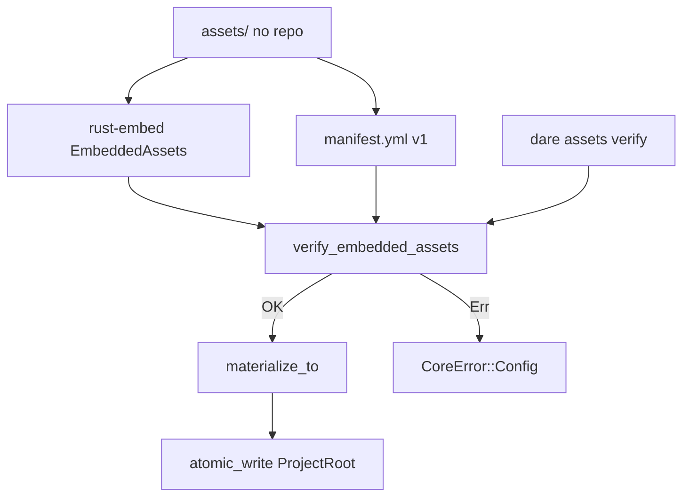

# BLUEPRINT: Inventário e empacotamento de assets (Microplano 009)

> **Gerado a partir de:** `DARE/DESIGN-009-inventario-e-empacotamento-de-assets.md` v1.0  
> **Data:** 2026-07-21 | **Status:** DRAFT  
> **Arquivo:** `DARE/BLUEPRINT-009-inventario-e-empacotamento-de-assets.md`  
> **Não substitui:** Blueprints 001–008  
> **Estado do código:** `dare-assets` + `assets/` + `dare assets verify` já existem — este Blueprint **congela contratos**, fecha política de espelho, harden de path, teste de freshness de hashes, docs e closeout.  
> **DEC:** DEC-010 (active)

---

## 0. TRADE-OFFS (Architect)

Sem `PATTERNS.md` / `patterns-facts.json` — decisões 🟡 a partir do Design 009 + DEC-010 + código atual.

| # | Trade-off | Escolha | Justificativa |
|---|-----------|---------|---------------|
| T-01 | SoT templates | **`assets/templates/*` é canónico**; `templates/` na raiz = **espelho legado** (Class B) | DEC-010; embed só lê `assets/` |
| T-02 | Sync espelho | Doc: editar só em `assets/`; script SHOULD `scripts/sync-templates-from-assets.ps1` (+ `.sh`) copia → raiz | Evita drift silencioso |
| T-03 | Embed crate | **rust-embed =8.7.2** (`include_dir` fora) | DEC-010; pin workspace |
| T-04 | `external` | Skip em verify + materialize; pode listar no manifest **ou** só na tabela de inventário doc | Não apagar `.claude` |
| T-05 | Paths no manifest | POSIX relativos sem leading `/`, sem `..` | Cross-OS + RS-01 |
| T-06 | Hash | SHA-256 **hex lowercase** | Determinismo |
| T-07 | Manifest version | Só `version: 1` aceite | Breaking ⇒ ADR |
| T-08 | Dest materialize | Default documentado `.dare/assets`; caller passa `SafeRelativePath` | Jail 005 |
| T-09 | capability-matrix | Permanece em `assets/` como `canonical`; **validação profunda = 010** | Evita scope creep |
| T-10 | Freshness test | Teste que lê `assets/` do FS via `CARGO_MANIFEST_DIR/../../assets` e compara hashes | RF-16 SHOULD → **MUST técnico** neste Blueprint |
| T-11 | CLI surface | Só `dare assets verify` neste ciclo (sem `materialize` CLI) | Materialize via API para 019/022 |
| T-12 | Erros | `CoreError::Config` com `asset missing:` / `asset hash mismatch:` + path | Exit Config (004) |

---

## 0.1 GAP ANALYSIS (código → MUST)

| Item | Estado | Ação |
|------|--------|------|
| `manifest` / `embed` / `verify` / `materialize` | ✅ | Congelar §5; harden paths |
| `assets/manifest.yml` + 6 templates + matrix | ✅ | Inventário doc + freshness test |
| `dare assets verify` | ✅ | Smoke CLI |
| Path `..` no `entry.path` | ⚠️ depende só de `SafeRelativePath` | Validar explicitamente em verify/materialize |
| `materialize` usa `.expect` / `unwrap_or("")` | ⚠️ | Trocar por `CoreResult` / erros tipados |
| Script regen hashes | ❌ | Criar SHOULD script + doc |
| Espelho `templates/` | ⚠️ duplicado | T-01/T-02 + README curto |
| Docs `assets-inventory.md` | ✅ básico | Expandir matriz inventário TS |
| Compose Fase 1 | — | Verificar |

---

## 1. VISÃO GERAL DA ARQUITETURA



**Decisões:**

| Decisão | Escolha | Justificativa |
|---------|---------|---------------|
| Single embed root | `../../assets` from crate | Um folder; manifest incluso |
| Verify before write | `materialize_to` chama verify | RNF-07 |
| Sem ciclo config | assets → core only | Independente de 008 |

---

## 2. STACK TÉCNICA DEFINIDA

| Camada | Tecnologia | Versão | Papel |
|--------|-----------|--------|-------|
| Rust | toolchain | **1.85.0** | MSRV |
| Crate | `dare-assets` | `0.1.0-alpha.0` | Domínio |
| Embed | `rust-embed` | **=8.7.2** | Compile-time |
| Hash | `sha2` | pin workspace | SHA-256 |
| YAML | `yaml_serde` as `serde_yaml` | **=0.10.4** | Manifest |
| Core | `dare-core` | workspace | Path/FS/errors |
| CLI | `dare-cli` | workspace | `assets verify` |
| Test | `tempfile` | pin | materialize |

**Sem novas crates de runtime.** Scripts PowerShell/Bash OK.

---

## 3. ESTRUTURA DE PASTAS E ARQUIVOS

```text
assets/
├── manifest.yml                 # SoT inventário
├── capability-matrix.yml        # canonical (validação 010)
└── templates/
    ├── DESIGN-template.md
    ├── BLUEPRINT-template.md
    ├── TASKS-template.md
    ├── TASK-SPEC-template.md
    ├── TELEMETRY-template.md
    └── HOOKS-ADAPTER.md

templates/                       # espelho legado (Class B) — não editar como SoT
├── README.md                    # NOVO: aponta para assets/
└── *.md                         # sync via script SHOULD

crates/dare-assets/src/
├── lib.rs
├── manifest.rs                  # tipos + sha256 + load
├── embed.rs
├── verify.rs                    # EDIT: reject `..` / absolute
├── materialize.rs               # EDIT: no expect; path checks
└── (capability.rs)              # 010 — não expandir neste ciclo

scripts/
├── regen-assets-manifest.py     # NOVO SHOULD: recalcula sha256 no manifest
└── sync-templates-from-assets.ps1  # NOVO SHOULD (+ .sh opcional)

docs/compatibility/
└── assets-inventory.md          # EDIT expandir

crates/dare-cli/tests/cli_smoke.rs  # EDIT: assets verify smoke

docker-compose.ci.yml            # VERIFICAR Fase 1
```

---

## 4. MODELO DE DADOS

### 4.1 `AssetsManifest`

| Campo | Tipo | Constraints |
|-------|------|-------------|
| `version` | `u32` | **must == 1** |
| `assets` | `Vec<AssetEntry>` | pode ser vazio (não recomendado) |

### 4.2 `AssetEntry`

| Campo | Tipo | Constraints |
|-------|------|-------------|
| `id` | `String` | non-empty; kebab-case recomendado; único no manifest |
| `path` | `String` | relativo POSIX; **sem** `..`, **sem** leading `/`, **sem** `\` |
| `sha256` | `String` | 64 hex chars lowercase `[0-9a-f]{64}` |
| `kind` | `AssetKind` | `canonical` \| `generated` \| `external` (serde snake_case) |

### 4.3 Inventário mínimo MUST (já no repo)

| id | path | kind |
|----|------|------|
| template-design | templates/DESIGN-template.md | canonical |
| template-blueprint | templates/BLUEPRINT-template.md | canonical |
| template-tasks | templates/TASKS-template.md | canonical |
| template-task-spec | templates/TASK-SPEC-template.md | canonical |
| template-telemetry | templates/TELEMETRY-template.md | canonical |
| template-hooks-adapter | templates/HOOKS-ADAPTER.md | canonical |
| capability-matrix | capability-matrix.yml | canonical |

### 4.4 Inventário TS (SHOULD — doc only neste ciclo)

| Área npm 3.18.1 | Classe | Tratamento 009 |
|-----------------|--------|----------------|
| `templates/*` DARE | A | Em `assets/templates` |
| `implementations/**` | C | Fora embed; tabela no doc |
| `.claude/commands` skills | B | `external` — não materializar/apagar |
| Harness IDE files | C | Microplanos 011–014 |

---

## 5. CONTRATOS DE API (ANTI-STUB)

### 5.1 `sha256_hex`

```rust
pub fn sha256_hex(bytes: &[u8]) -> String;
```

- **Pós:** exatamente 64 chars `[0-9a-f]`.
- **Erro:** nunca.

### 5.2 `load_manifest_from_str`

```rust
pub fn load_manifest_from_str(yaml: &str) -> CoreResult<AssetsManifest>;
```

| Caso | Resultado |
|------|-----------|
| YAML inválido | `Err(Config)` `invalid assets manifest: …` |
| `version != 1` | `Err` `unsupported assets manifest version: N` |
| OK | `Ok(manifest)` |

### 5.3 Path validation (partilhada)

```rust
fn assert_safe_asset_path(path: &str) -> CoreResult<()>;
```

Regras:
1. `path` non-empty
2. Não começa com `/` ou `\`
3. Não contém `..` como segmento (`split('/')`)
4. Não contém `\`
5. Usado em **verify** e **materialize** para cada entry (mesmo `external` se listado — se path inválido, erro)

### 5.4 `verify_embedded_assets`

```rust
pub fn verify_embedded_assets() -> CoreResult<()>;
```

**Algoritmo:**
1. `EmbeddedAssets::get("manifest.yml")` — missing → `asset missing: manifest.yml`
2. UTF-8 + `load_manifest_from_str`
3. Para cada entry:
   - `assert_safe_asset_path(&entry.path)?`
   - se `kind == External` → **continue**
   - `EmbeddedAssets::get(&entry.path)` — missing → `asset missing: {path}`
   - `sha256_hex` == `entry.sha256` — senão `asset hash mismatch: {path}`
4. `Ok(())`

**Não** escreve disco. Idempotente. Thread-safe (read-only embed).

### 5.5 `materialize_to`

```rust
pub fn materialize_to(root: &ProjectRoot, dest_rel: &SafeRelativePath) -> CoreResult<usize>;
```

**Pré:** `dest_rel` já jail-safe (criado via `SafeRelativePath::new`).

**Algoritmo:**
1. `verify_embedded_assets()?`
2. Carregar manifest (erro tipado se encoding falhar — **sem** `unwrap_or("")`)
3. `atomic_write` `{dest}/manifest.yml`
4. Para cada non-external: `atomic_write` `{dest}/{entry.path}` (path já validado)
5. Return `count` (ficheiros escritos)

| Edge | Comportamento |
|------|----------------|
| `dest` = `.dare/assets` | OK |
| entry path com `..` | Err antes de write |
| verify falha | 0 writes (fail fast) |
| external only | ainda escreve manifest; count ≥ 1 |

### 5.6 CLI

```text
dare assets verify
```

- Exit **0** + human `assets verify: ok`
- Exit **Config** (kind 004) se verify Err; JSON envelope se `--json`

**Exemplo human:**

```text
assets verify: ok
```

---

## 6. PLANO DE EXECUÇÃO (FASES)

### Fase 1: Containerização ← **SEMPRE PRIMEIRA**

**DONE:** `docker compose -f docker-compose.ci.yml config` exit 0 (ou YAML documentado).

---

### Fase 2: Harden path + materialize errors

**DONE:**
- `assert_safe_asset_path` usado em verify/materialize
- Testes: path com `..` rejeitado; path com `\` rejeitado
- `materialize` sem `expect`/`unwrap_or("")` em paths de erro
- `cargo test -p dare-assets`

---

### Fase 3: Freshness de hashes (RF-16) + inventário

**DONE:**
- Teste `manifest_hashes_match_assets_dir` (cfg ou `#[test]`): para cada entry non-external, ler `CARGO_MANIFEST_DIR/../../assets/{path}` e comparar SHA-256 ao manifest
- `templates/README.md` aponta SoT = `assets/templates`
- Tabela inventário TS (SHOULD) em docs

---

### Fase 4: Script regen + sync espelho (SHOULD)

**DONE:**
- `scripts/regen-assets-manifest.py` (ou `.mjs`) atualiza `sha256` no YAML preservando ids/paths/kinds
- `scripts/sync-templates-from-assets.ps1` copia `assets/templates/*` → `templates/`
- Doc: quando correr (após editar asset)

---

### Fase 5: CLI smoke + docs DEC-010

**DONE:**
- `cli_smoke`: `dare assets verify` exit 0; stdout contém `assets verify: ok`
- `assets-inventory.md` expandido: T-01…T-12, API §5, inventário mínimo, Class A/B/C, RS checklist
- DEC-010 coerente (não criar DEC-011 aqui)

---

### Fase 6: Auditoria ← **N-1**

**DONE:** `cargo test --workspace`; clippy `-D warnings`; `cargo audit`; `cargo deny check`; RS na doc.

---

### Fase 7: Fechamento ← **N**

**DONE:** TASKS-009 100%; microplano **010** desbloqueado.

---

## 7. VALIDATION GATES POR STACK

| Stack | Build | Test | Lint/Audit |
|-------|-------|------|------------|
| Rust | `cargo build -p dare-assets` | `cargo test -p dare-assets` + workspace | clippy `-D warnings` + audit + deny |

---

## 8. CONTROLES DE SEGURANÇA (RS → fases)

| RS | Fase |
|----|------|
| RS-01 | 2 |
| RS-02 | 3, 5 (review inventário) |
| RS-03 | 2 |
| RS-04 | 6 |
| RS-05 | todas |
| RS-06 | 2–3 |
| RS-07 | 2–3 |
| RS-08 | 2 (skip external) |
| RS-09 | 2–4 |
| RS-10 | 5 (doc) |

---

## 9. ESTRATÉGIA DE TESTES

| Tipo | Caso |
|------|------|
| Unit | parse manifest v1; reject version≠1 |
| Unit | `sha256_hex` length/format |
| Unit | `verify_embedded_ok` |
| Unit | path `..` / `\` rejected |
| Unit | freshness FS vs manifest |
| Integ | `materialize_writes_files` sob tempfile |
| Smoke | `dare assets verify` |
| Segurança | mismatch → Err; external skipped |

---

## 10. ESTRATÉGIA DE DEPLOY

| Ambiente | Nota |
|----------|------|
| Local/CI | verify no `cargo test -p dare-assets` |
| Release alpha | binário já embute `assets/` via rust-embed |

---

## 11. CHECKLIST DE APROVAÇÃO DO BLUEPRINT

- [ ] T-01…T-12 aceites (SoT `assets/`, espelho legado, freshness MUST técnico)
- [ ] Gap harden path + materialize errors aceite
- [ ] Contratos §5 executáveis
- [ ] Inventário mínimo congelado
- [ ] Fases 1–7 (compose + audit N-1)
- [ ] CLI só `verify` (sem materialize CLI) aceite
- [ ] Pronto para `/dare-tasks` → `*-009-*` / `mp009-*`

---

## 12. PRÓXIMAS ETAPAS

1. Aprovar este Blueprint.  
2. `/dare-tasks` → `TASKS-009-…`, `dare-dag-009.yaml`, `EXECUTION-009/`.  
3. Após closeout → microplano **010** (capabilities).
