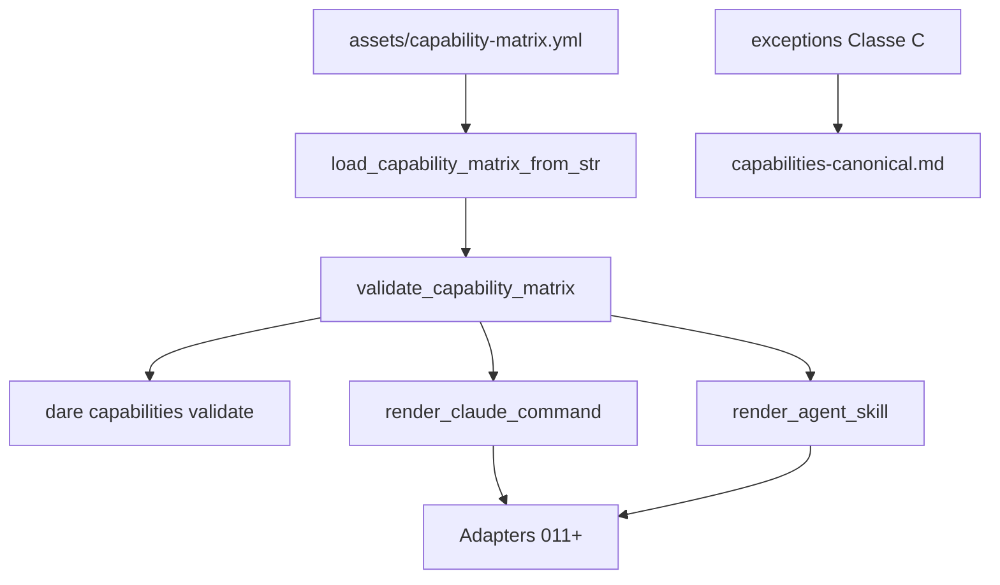

# BLUEPRINT: Modelo canónico de capabilities (Microplano 010)

> **Gerado a partir de:** `DARE/DESIGN-010-modelo-canonico-de-capabilities.md` v1.0  
> **Data:** 2026-07-21 | **Status:** DRAFT  
> **Arquivo:** `DARE/BLUEPRINT-010-modelo-canonico-de-capabilities.md`  
> **Não substitui:** Blueprints 001–009  
> **Estado do código:** `dare-assets::capability` + `assets/capability-matrix.yml` (49) + CLI `capabilities validate` já existem — este Blueprint **congela contratos ADR-007**, fecha exceptions Classe C, harden de paths de output, docs e closeout.  
> **DEC:** DEC-011 (active) · **ADR:** ADR-007 (Accepted)

---

## 0. TRADE-OFFS (Architect)

Sem `PATTERNS.md` / `patterns-facts.json` — decisões 🟡 a partir do Design 010 + ADR-007 + DEC-011 + código atual.

| # | Trade-off | Escolha | Justificativa |
|---|-----------|---------|---------------|
| T-01 | Onde vivem os tipos | **`dare-assets/src/capability.rs`** | DEC-011; adapters 011+ reexportam; microplano path `dare-harness/...` = futuro |
| T-02 | Contagem Claude | **MUST = 49** capabilities com `outputs.claude` Some | Teste `matrix_loads_and_validates` |
| T-03 | Cursor 33 / rules 25 / skills 48 | **Não expandir matriz neste ciclo**; registar **exceptions** Classe C | Baseline repo incompleta; adapters 012–014 |
| T-04 | Exception ids canónicos | `cursor-commands-full-parity`, `cursor-rules-full-parity`, `agent-skills-full-parity` | Estáveis; reason en-US |
| T-05 | Id kebab | Reject espaço e `_`; allow `[a-z0-9-]+` (já parcial) | ADR-007 |
| T-06 | Output paths | Relativos; `assert_safe_asset_path` em **cada** path Some | RS-03 / 009 |
| T-07 | Render Claude | Template fixo §5.4 (sem frontmatter YAML) | Reproduzível |
| T-08 | Render skill | Frontmatter `name` + `description` + body | Codex/Antigravity share |
| T-09 | `assets/capabilities/**` | **Não** gerar em massa neste ciclo (SHOULD defer 011) | Evita drift binário; render on-demand |
| T-10 | CLI | Só `dare capabilities validate` | Install = 011+ |
| T-11 | Matrix version | Só `1` | Breaking ⇒ ADR |
| T-12 | Skill-pacote vs capability | Distinção ADR-007; este ciclo só capability IDE | Sem misturar `dare skill` |

---

## 0.1 GAP ANALYSIS (código → MUST)

| Item | Estado | Ação |
|------|--------|------|
| Tipos + load + validate + render | ✅ | Congelar §4–5; harden paths |
| 49 entries | ✅ | Manter assert `len()==49` |
| `exceptions: []` | ⚠️ | Preencher T-04 |
| Path safety em `outputs.*` | ⚠️ | Chamar `assert_safe_asset_path` |
| Id regex estrito | ⚠️ parcial | Rejeitar chars fora de kebab |
| CLI validate | ✅ | Smoke |
| Docs | ✅ básico | Expandir exceptions + ADR-007 |
| Render golden | ✅ unit | Reforçar skill frontmatter |
| Compose Fase 1 | — | Verificar |

---

## 1. VISÃO GERAL DA ARQUITETURA



**Decisões:**

| Decisão | Escolha | Justificativa |
|---------|---------|---------------|
| Single YAML SoT | `capability-matrix.yml` | ADR-007 |
| Validate before consume | Fail-fast Config | Adapters não escrevem lixo |
| Sem write IDE neste ciclo | Só validate/render | Scope 010 |

---

## 2. STACK TÉCNICA DEFINIDA

| Camada | Tecnologia | Versão | Papel |
|--------|-----------|--------|-------|
| Rust | toolchain | **1.85.0** | MSRV |
| Crate | `dare-assets` | `0.1.0-alpha.0` | Tipos capability |
| YAML | `yaml_serde` as serde_yaml | **=0.10.4** | Parse |
| Path | `assert_safe_asset_path` | 009 | Output paths |
| Embed | rust-embed | **=8.7.2** | Matrix embutida |
| CLI | `dare-cli` | workspace | `capabilities validate` |

**Sem novas crates.**

---

## 3. ESTRUTURA DE PASTAS E ARQUIVOS

```text
assets/
├── capability-matrix.yml     # EDIT: exceptions T-04
└── manifest.yml              # hash atualizado se YAML mudar (regen 009)

crates/dare-assets/src/
└── capability.rs             # EDIT: path checks + id charset + tests

crates/dare-cli/tests/
└── cli_smoke.rs              # EDIT: capabilities_validate_ok

docs/compatibility/
└── capabilities-canonical.md # EDIT expandir

docs/adr/
└── ADR-007-formato-canonico-capabilities.md  # VERIFICAR alinhamento

docker-compose.ci.yml         # VERIFICAR Fase 1
```

**Não criar** `assets/capabilities/**` em massa neste ciclo (T-09).

---

## 4. MODELO DE DADOS

### 4.1 `CapabilityMatrix`

| Campo | Tipo | Constraints |
|-------|------|-------------|
| `version` | `u32` | **== 1** |
| `exceptions` | `Vec<CapabilityException>` | ver §4.4 |
| `capabilities` | `Vec<Capability>` | **len == 49** |

### 4.2 `Capability` (ADR-007)

| Campo | Tipo | Constraints |
|-------|------|-------------|
| `id` | `String` | non-empty; regex `^[a-z0-9]+(-[a-z0-9]+)*$`; único |
| `title` | `String` | non-empty |
| `description` | `String` | non-empty |
| `instructions` | `String` | non-empty; sem secrets |
| `cli_commands` | `Vec<String>` | default `[]` |
| `outputs` | `HarnessOutputs` | paths únicos globais |
| `assets` | `Vec<String>` | default `[]`; se Some paths → também safe |

### 4.3 `HarnessOutputs`

| Campo | Tipo | Nota |
|-------|------|------|
| `claude` | `Option<String>` | tipicamente `.claude/commands/{id}.md` |
| `cursor` | `Option<String>` | `.cursor/commands/{id}.md` |
| `codex` | `Option<String>` | `.codex/skills/{id}/SKILL.md` |
| `antigravity` | `Option<String>` | `.antigravity/commands/{id}.md` |

### 4.4 Exceptions (MUST neste ciclo)

```yaml
exceptions:
  - id: cursor-commands-full-parity
    reason: "Cursor command count 33 vs matrix deferred to adapter 012; Class C"
  - id: cursor-rules-full-parity
    reason: "Cursor rules count 25 not modeled as separate Capability rows; Class C"
  - id: agent-skills-full-parity
    reason: "Agent Skills count 48 package skills != IDE capabilities; Class C until 044/012"
```

---

## 5. CONTRATOS DE API (ANTI-STUB)

### 5.1 `load_capability_matrix_from_str`

```rust
pub fn load_capability_matrix_from_str(yaml: &str) -> CoreResult<CapabilityMatrix>;
```

| Caso | Resultado |
|------|-----------|
| YAML inválido | `Err` `invalid capability-matrix: …` |
| `version != 1` | `Err` `unsupported capability-matrix version: N` |
| OK | `Ok(m)` |

### 5.2 `validate_capability_matrix`

```rust
pub fn validate_capability_matrix(m: &CapabilityMatrix) -> CoreResult<()>;
```

**Regras (ordem):**
1. Para cada capability:
   - `id` match kebab regex; senão `invalid capability id: {id}`
   - `id` único; senão `duplicate capability id: {id}`
   - `title`/`description`/`instructions` non-empty
   - Para cada path em `outputs.*` Some: `assert_safe_asset_path(path)?`
   - Path inserido em set global; duplicado → `duplicate harness output path: {path}`
   - Para cada `assets[]` path: `assert_safe_asset_path`
2. Exceptions: `id` e `reason` non-empty (se lista não vazia)
3. **Não** exige que exceptions cubram gaps — mas este Blueprint **exige** as 3 entries T-04 no YAML

**Pré:** matrix parseada. **Pós:** sem side effects.

### 5.3 Renders

```rust
pub fn render_claude_command(cap: &Capability) -> String;
pub fn render_agent_skill(cap: &Capability) -> String;
```

**Claude (exato):**

```text
# /{id}

{title}

{description}

{instructions.trim()}
\n
```

**Skill:**

```text
---
name: {id}
description: {description with newlines collapsed to space, trimmed}
---

# {title}

{instructions.trim()}
\n
```

| Edge | Comportamento |
|------|----------------|
| Chamar 2× | strings iguais |
| `description` multilinha no skill | spaces only na linha frontmatter |

### 5.4 CLI

```text
dare capabilities validate
```

- Load `EmbeddedAssets::get("capability-matrix.yml")` → parse → validate
- Human: `capabilities validate: ok ({N} entries)` com N=49
- Exit Config se falhar

---

## 6. PLANO DE EXECUÇÃO (FASES)

### Fase 1: Containerização ← **SEMPRE PRIMEIRA**

**DONE:** `docker compose -f docker-compose.ci.yml config` exit 0.

---

### Fase 2: Harden validate (paths + id regex + exceptions YAML)

**DONE:**
- `validate_capability_matrix` usa kebab regex + `assert_safe_asset_path` em outputs/assets
- Testes: `rejects_underscore_id`; `rejects_dotdot_output_path`
- `capability-matrix.yml` com 3 exceptions T-04
- Regenerar hash no `assets/manifest.yml` se YAML mudou (`python scripts/regen-assets-manifest.py`)
- `cargo test -p dare-assets`

---

### Fase 3: Contagem 49 + alinhamento opcional `.claude`

**DONE:**
- Assert `capabilities.len() == 49`
- Se `.claude/commands` existir no repo: teste opcional (ou doc) que set de stems ⊆ ids da matrix — **não falhar CI** se pasta ausente em checkout mínimo
- `matrix_loads_and_validates` verde

---

### Fase 4: Render snapshots

**DONE:**
- Teste `render_agent_skill_has_frontmatter` (contém `---\nname:`)
- `render_reproducible` mantido
- Documentar templates em docs

---

### Fase 5: CLI smoke + docs DEC-011

**DONE:**
- `cli_smoke`: `dare capabilities validate` → ok + `49 entries` (ou contains `entries`)
- `capabilities-canonical.md`: ADR-007 campos, T-01…T-12, exceptions, Classe C 33/25/48, API §5
- Não criar DEC-012 aqui

---

### Fase 6: Auditoria ← **N-1**

**DONE:** test workspace; clippy `-D warnings`; audit; deny; RS na doc.

---

### Fase 7: Fechamento ← **N**

**DONE:** TASKS-010 100%; microplano **011** desbloqueado.

---

## 7. VALIDATION GATES POR STACK

| Stack | Build | Test | Lint/Audit |
|-------|-------|------|------------|
| Rust | `cargo build -p dare-assets` | `cargo test -p dare-assets` + workspace | clippy + audit + deny |

---

## 8. CONTROLES DE SEGURANÇA (RS → fases)

| RS | Fase |
|----|------|
| RS-01 | 2 |
| RS-02 | 5 (review instructions) |
| RS-03 | 2 |
| RS-04 | 6 |
| RS-05 | 2–5 |
| RS-06 | 2 |
| RS-07 | 2 |
| RS-08 | 2 (exceptions + validate entries) |

---

## 9. ESTRATÉGIA DE TESTES

| Tipo | Caso |
|------|------|
| Unit | load version 1; reject version≠1 |
| Unit | 49 entries + validate OK |
| Unit | reject `_` in id; reject `..` in output |
| Unit | render claude/skill reproducible |
| Smoke | `capabilities validate` |
| Segurança | duplicate path Err |

---

## 10. ESTRATÉGIA DE DEPLOY

| Ambiente | Nota |
|----------|------|
| CI | validate via unit + smoke |
| Adapters 011+ | consomem API render + matrix embed |

---

## 11. CHECKLIST DE APROVAÇÃO DO BLUEPRINT

- [ ] T-01…T-12 aceites (tipos em assets; exceptions Classe C; sem gerar assets/capabilities/**)
- [ ] Contratos §5 executáveis
- [ ] 3 exceptions canónicas T-04
- [ ] Fases 1–7 (compose + audit)
- [ ] Pronto para `/dare-tasks` → `mp010-*`

---

## 12. PRÓXIMAS ETAPAS

1. Aprovar este Blueprint.  
2. `/dare-tasks` → `TASKS-010-…`, `dare-dag-010.yaml`, `EXECUTION-010/`.  
3. Após closeout → microplano **011** (adapter Claude).
