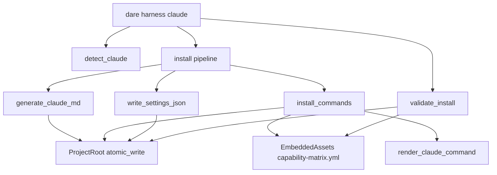

# BLUEPRINT: Adapter Claude Code (Microplano 011)

> **Gerado a partir de:** `DARE/DESIGN-011-adapter-claude-code.md` v1.0  
> **Data:** 2026-07-21 | **Status:** APPROVED  
> **Arquivo:** `DARE/BLUEPRINT-011-adapter-claude-code.md`  
> **Não substitui:** Blueprints 001–010  
> **Estado do código:** `dare-harness::claude` + CLI `dare harness claude` já existem — este Blueprint **congela contratos DEC-012**, fecha gaps (help `--force`, docs, golden paths SHOULD, smoke, Ralph) e closeout.  
> **DEC:** DEC-012 (active) · **ADR:** ADR-007 (Accepted) · **Pré:** 005, 009, 010 DONE

---

## 0. TRADE-OFFS (Architect)

Sem `PATTERNS.md` / `patterns-facts.json` — decisões 🟡 a partir do Design 011 + DEC-012 + código atual + ADR-007.

| # | Trade-off | Escolha | Justificativa |
|---|-----------|---------|---------------|
| T-01 | Onde vive o adapter | **`crates/dare-harness/src/claude.rs`** | Microplano + DEC-012; CLI thin |
| T-02 | Fonte de commands | Matrix embed `capability-matrix.yml` + `render_claude_command` | 010; sem duplicar conteúdo |
| T-03 | Marcador managed (md) | Prefixo 1ª linha `<!-- dare:managed` | Detectável; preserve sem DB |
| T-04 | Marcador settings | `"_dare_managed": true` | JSON-native; Classe B se TS diferir |
| T-05 | Preserve default | Skip overwrite se unmanaged e `!force` | RF-07/08; RS-07 |
| T-06 | `--force` | Overwrite unmanaged + rewrite managed | Consentimento explícito no help |
| T-07 | settings merge | **Skip ou replace** (sem merge field-level) | RF-18 backlog; evita corrupção |
| T-08 | PostToolUse command | String fixa `echo "…Ralph Loop…"` | RS-06; sem interpolação user |
| T-09 | Contagem Claude | **49** paths com `outputs.claude` Some | Alinhado 010 / teste |
| T-10 | Validate | Só existência de ficheiro (não hash conteúdo) | Fail-fast Config; re-install corrige drift |
| T-11 | CLAUDE.md body | Stub managed + pointer a `.claude/commands/` | Sem LLM neste ciclo |
| T-12 | Escrita FS | `SafeRelativePath` + `atomic_write` | 005; RS-03 |
| T-13 | Outros adapters | Fora (012–014) | Scope |
| T-14 | Golden vs TS | SHOULD: lista de paths em docs/fixture | Classe B/C se drift |

---

## 0.1 GAP ANALYSIS (código → MUST)

| Item | Estado | Ação |
|------|--------|------|
| `detect_claude` | ✅ | Congelar §5.1 |
| `generate_claude_md` | ✅ | Congelar §5.2; teste preserve |
| `install_commands` | ✅ | Assert 49; preserve |
| `write_settings_json` + PostToolUse | ✅ parcial | Congelar schema §5.4; teste `_dare_managed` |
| `validate_install` | ✅ | Mensagem missing amostra ≤5 |
| CLI detect/install/validate | ✅ | Smoke; help `--force` |
| Docs `harness-claude.md` | ✅ básico | Expandir DEC-012 + T-* + RS |
| Golden paths TS | ⚠️ | SHOULD: tabela ou fixture |
| Compose Fase 1 | — | Verificar `docker-compose.ci.yml` |
| Ralph + TASKS-011 | ⚠️ | Fases N-1 / N |

---

## 1. VISÃO GERAL DA ARQUITETURA



**Decisões:**

| Decisão | Escolha | Justificativa |
|---------|---------|---------------|
| Adapter em harness | Separado de `dare-assets` | Assets = SoT; harness = I/O IDE |
| Install = 3 passos | md + commands + settings | RF-12; ordem fixa |
| Preserve por marcador | Sem backup automático neste ciclo | Simples; `--force` documentado |
| Validate existência | Não compara hash | Rápido; re-install idempotente corrige |

---

## 2. STACK TÉCNICA DEFINIDA

| Camada | Tecnologia | Versão | Papel |
|--------|-----------|--------|-------|
| Rust | toolchain | **1.85.0** | MSRV |
| Crate | `dare-harness` | `0.1.0-alpha.0` | Adapter Claude |
| Assets | `dare-assets` | workspace | Matrix + render |
| Core FS | `dare-core` | workspace | ProjectRoot / atomic_write |
| JSON | `serde_json` | workspace | settings.json |
| CLI | `dare-cli` + clap | workspace | `harness claude` |
| Temp tests | `tempfile` | workspace | Unit FS |

**Sem novas crates de runtime.**

---

## 3. ESTRUTURA DE PASTAS E ARQUIVOS

```text
crates/dare-harness/src/
├── lib.rs                 # re-export claude::*
└── claude.rs              # EDIT: contratos §5 + testes gap

crates/dare-cli/src/
└── main.rs                # EDIT: help --force; smoke path já chama write_settings_json

crates/dare-cli/tests/
└── cli_smoke.rs           # EDIT: harness_claude_detect_install_validate (tempdir)

docs/compatibility/
└── harness-claude.md      # EDIT: DEC-012, preserve, settings schema, T-*, RS

docs/DECISION-LOG.md       # VERIFICAR DEC-012 active (já presente)

docker-compose.ci.yml      # VERIFICAR Fase 1

# Destinos no projeto alvo (não no repo CLI, exceto fixtures de teste):
# CLAUDE.md
# .claude/commands/*.md
# .claude/settings.json
```

**Não** alterar `assets/capability-matrix.yml` neste ciclo salvo bug de path Claude.

---

## 4. MODELO DE DADOS

### 4.1 `ClaudeDetect`

| Campo | Tipo | Semântica |
|-------|------|-----------|
| `claude_md` | `bool` | `CLAUDE.md` existe como ficheiro sob root |
| `claude_dir` | `bool` | diretório `.claude` existe |

Sem persistência; só retorno in-memory.

### 4.2 Marcadores

| Artefacto | Regra managed |
|-----------|---------------|
| `CLAUDE.md` / `*.md` commands | `lines().next().trim_start().starts_with("<!-- dare:managed")` |
| `.claude/settings.json` | JSON object contém `"_dare_managed": true` (bool) **ou** string search legado `"_dare_managed"` no texto — implementação atual usa contains string; Blueprint exige: se ficheiro existe e **não** contém `"_dare_managed"`, treat unmanaged |

### 4.3 Settings JSON (contrato mínimo gerado)

| Campo | Tipo | Obrigatório |
|-------|------|-------------|
| `permissions.allow` | `array<string>` | sim — incluir pelo menos `Read(DARE/**)`, `Write(DARE/**)` |
| `hooks.PostToolUse` | `array<object>` | sim — 1 entry |
| `hooks.PostToolUse[0].matcher` | `string` | `"Write"` |
| `hooks.PostToolUse[0].hooks[0].type` | `string` | `"command"` |
| `hooks.PostToolUse[0].hooks[0].command` | `string` | constante §5.4 |
| `_dare_managed` | `bool` | `true` |

### 4.4 Contagem

| Métrica | Valor |
|---------|-------|
| Capabilities com `outputs.claude.is_some()` | **49** |
| `install_commands(..., true)` return | **49** |
| `validate_install` Ok | **49** |

---

## 5. CONTRATOS DE API (ANTI-STUB)

Constantes:

```rust
const MANAGED_PREFIX: &str = "<!-- dare:managed";
const CLAUDE_MD_REL: &str = "CLAUDE.md";
const SETTINGS_REL: &str = ".claude/settings.json";
```

### 5.1 `detect_claude`

```rust
pub fn detect_claude(root: &ProjectRoot) -> CoreResult<ClaudeDetect>;
```

| Pré | `root` jail válido |
| Pós | Nenhum ficheiro criado/alterado |
| OK | `ClaudeDetect { claude_md, claude_dir }` |
| Err | `SafeRelativePath` / resolve failures → `CoreError` path |

**Edge:** root vazio → ambos `false`. Só `.claude` dir → `claude_dir=true`, `claude_md=false`.

### 5.2 `generate_claude_md`

```rust
pub fn generate_claude_md(root: &ProjectRoot, force: bool) -> CoreResult<()>;
```

| Caso | Comportamento |
|------|----------------|
| Não existe | Write managed stub |
| Existe + managed **ou** `force` | Rewrite managed stub |
| Existe + unmanaged + `!force` | **No-op** Ok |
| Path escape | Err path safety |

**Body exacto (conteúdo mínimo):**

```text
<!-- dare:managed claude-md -->
# DARE Framework

Generated by `dare harness claude`. Follow Design → Blueprint → Tasks → Execute.
Use slash commands from `.claude/commands/`.
```

(LF; sem secrets.)

### 5.3 `install_commands`

```rust
pub fn install_commands(root: &ProjectRoot, force: bool) -> CoreResult<usize>;
```

**Algoritmo:**
1. Load embed `capability-matrix.yml` → parse → `validate_capability_matrix`
2. `written = 0`
3. Para cada `cap` em ordem da matriz:
   - Se `cap.outputs.claude` None → skip
   - `rel = SafeRelativePath::new(out)?`
   - Se `!should_write(root, rel, force)` → continue (preserve)
   - `body = format!("{MANAGED_PREFIX} capability={} -->\n{}", cap.id, render_claude_command(cap))`
   - `atomic_write(root, rel, body.as_bytes())?`
   - `written += 1`
4. Return `Ok(written)`

| Caso | Resultado |
|------|-----------|
| force, matrix 49 | `Ok(49)` |
| 1 unmanaged path, !force | `Ok(48)` (ou 49−k) |
| Matrix inválida | Err Config |
| Path inválido na matrix | Err (validate 010 já falha) |

**Concorrência:** single-writer por root; sem lock neste ciclo (documentar).

### 5.4 `write_settings_json`

```rust
pub fn write_settings_json(root: &ProjectRoot, force: bool) -> CoreResult<()>;
```

| Caso | Comportamento |
|------|----------------|
| Não existe | Write default + `_dare_managed: true` |
| Existe + contém `_dare_managed` **ou** `force` | Rewrite default managed |
| Existe + sem `_dare_managed` + `!force` | **No-op** Ok |

**`command` fixo (exato):**

```text
echo "File saved. Remember Ralph Loop: cargo test --workspace && cargo clippy --all-features -- -D warnings"
```

Pretty JSON via `serde_json::to_vec_pretty`. Sem campos secretos.

### 5.5 `validate_install`

```rust
pub fn validate_install(root: &ProjectRoot) -> CoreResult<usize>;
```

1. Load + validate matrix
2. Para cada `outputs.claude` Some: se `!is_file` → push to `missing`
3. Se `missing` non-empty → `Err(CoreError::config(format!("claude commands missing ({}): {}", len, first_5_joined)))`
4. Else `Ok(count_present)` (= 49 no happy path)

**Não** apaga ficheiros; **não** exige managed marker (validate = presença).

### 5.6 CLI (superfície pública)

```text
dare harness claude detect [--root <path>]
dare harness claude install [--root <path>] [--force]
dare harness claude validate [--root <path>]
```

| Subcomando | Side effects | Human stdout (en-US) | Exit |
|------------|--------------|----------------------|------|
| `detect` | nenhum | `harness claude detect: claude_md={bool} claude_dir={bool}` | 0 / path err |
| `install` | md + commands + settings | `harness claude install: wrote {n} commands` | 0 / Config |
| `validate` | nenhum | `harness claude validate: ok ({n} commands)` | 0 / Config |

**Help `--force` (MUST):** texto clap deve mencionar que unmanaged files are overwritten when set.

**Ordem install:** `generate_claude_md` → `install_commands` → `write_settings_json` (erros de settings: se `write_settings_json` Err, propagar; se No-op Ok, OK).

**Root default:** cwd / project detection existente no CLI (mesmo padrão outros comandos).

### 5.7 Exemplos concretos

**Detect (projeto vazio):**

```text
harness claude detect: claude_md=false claude_dir=false
```

**Install force (tempdir):**

```text
harness claude install: wrote 49 commands
```

Ficheiros: `CLAUDE.md`, `.claude/settings.json`, `.claude/commands/dare-design.md`, … (49).

**Validate missing:**

```text
# stderr/human Config — mensagem contém:
claude commands missing (3): .claude/commands/a.md, .claude/commands/b.md, ...
```

---

## 6. PLANO DE EXECUÇÃO (FASES)

### Fase 1: Containerização ← **SEMPRE PRIMEIRA**

**DONE:** `docker compose -f docker-compose.ci.yml config` exit 0.

**Entregáveis:** confirmação compose CI (sem novo Dockerfile se já existe).

---

### Fase 2: Congelar API detect + generate_claude_md + preserve

**DONE:**
- Assinaturas §5.1–5.2
- Unit: detect empty; generate cria managed; unmanaged CLAUDE.md preservado sem force
- `cargo test -p dare-harness -- claude::`

---

### Fase 3: install_commands + validate_install (49 + preserve)

**DONE:**
- Roundtrip force: install 49 + validate 49
- Preserve: unmanaged command → 48 escritos; conteúdo user intacto
- Re-install managed: `written == 49` (idempotente rewrite managed)
- Mensagem missing ≤5 paths

---

### Fase 4: settings.json + PostToolUse + CLI help `--force`

**DONE:**
- `write_settings_json` produz `_dare_managed` + matcher `Write` + command §5.4
- Preserve settings unmanaged sem force
- CLI install chama os 3 passos
- Help/docstring `--force` menciona overwrite unmanaged
- Unit parse JSON settings

---

### Fase 5: CLI smoke + docs DEC-012 + golden SHOULD

**DONE:**
- Smoke: tempdir → `dare harness claude install --force --root …` → validate ok 49; detect true/true
- `harness-claude.md`: CLI, preserve, settings schema, T-01…T-14, RS map, DEC-012
- SHOULD: tabela dos 49 paths Claude (ou “paths = matrix outputs.claude”) vs baseline note Classe B/C

---

### Fase 6: Auditoria ← **N-1**

**DONE:**
```text
cargo test --workspace
cargo clippy --workspace --all-targets -- -D warnings
cargo audit
cargo deny check
```
RS checklist na doc. Exit codes no output da task.

---

### Fase 7: Fechamento ← **N**

**DONE:** `TASKS-011` 7/7 (ou N/N); próximo microplano **012-adapter-cursor**.

---

## 7. VALIDATION GATES POR STACK

| Stack | Build | Test | Lint/Audit |
|-------|-------|------|------------|
| Rust | `cargo build -p dare-harness -p dare-cli` | `cargo test --workspace` | `cargo clippy --workspace --all-targets -- -D warnings` + `cargo audit` + `cargo deny check` |

---

## 8. CONTROLES DE SEGURANÇA (RS → fases)

| RS | Fase | Verificação |
|----|------|-------------|
| RS-01 | 3 | Matrix validate + SafeRelativePath antes write |
| RS-02 | 2–4 | Stub/hook/commands sem secrets |
| RS-03 | 2–4 | Só ProjectRoot |
| RS-04 | 6 | audit + deny |
| RS-05 | 4 | settings gerados sem secrets |
| RS-06 | 4 | command PostToolUse constante |
| RS-07 | 4–5 | help `--force` |
| RS-08 | 3 | atomic por ficheiro; validate não apaga |

---

## 9. ESTRATÉGIA DE TESTES

| Tipo | Caso |
|------|------|
| Unit | `detect_claude` empty / after install |
| Unit | `install_validate_roundtrip_force` → 49 |
| Unit | `preserve_unmanaged_command` → 48 + content |
| Unit | settings managed marker + PostToolUse present |
| Unit | preserve unmanaged settings |
| Smoke | CLI detect / install --force / validate |
| Segurança | path jail (indirect via SafeRelativePath) |
| SHOULD | fixture lista paths vs matrix |

---

## 10. ESTRATÉGIA DE DEPLOY

| Ambiente | Nota |
|----------|------|
| Local / CI | Gates §7; smoke CLI |
| Release binário | Fora (015) — alpha workspace |
| Consumo | Developer roda `dare harness claude install` no projeto alvo |

---

## 11. CHECKLIST DE APROVAÇÃO DO BLUEPRINT

- [ ] T-01…T-14 aceites (preserve, settings skip/replace, 49, stub CLAUDE.md)
- [ ] Contratos §5 executáveis (anti-stub)
- [ ] Fases 1–7 (compose + audit + closeout 012)
- [ ] RS mapeados
- [ ] Escopo: sem Cursor/Codex/discover
- [ ] Pronto para `/dare-tasks` → `mp011-*`

---

## 12. PRÓXIMAS ETAPAS

1. Aprovar este Blueprint.  
2. `/dare-tasks` → `TASKS-011-adapter-claude-code.md`, `dare-dag-011.yaml`, `EXECUTION-011/`.  
3. Após closeout → [`012-adapter-cursor.md`](../DARE-RUST-MICRO-PLANOS/DARE-RUST-MICRO-PLANOS/012-adapter-cursor.md).
