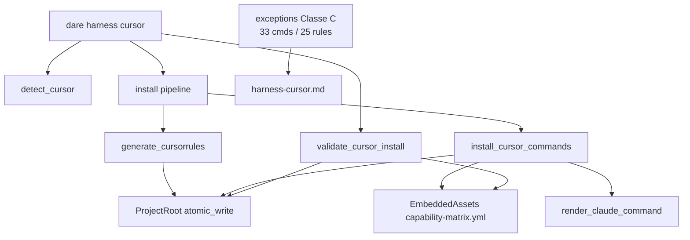

# BLUEPRINT: Adapter Cursor (Microplano 012)

> **Gerado a partir de:** `DARE/DESIGN-012-adapter-cursor.md` v1.0  
> **Data:** 2026-07-21 | **Status:** APPROVED  
> **Arquivo:** `DARE/BLUEPRINT-012-adapter-cursor.md`  
> **Não substitui:** Blueprints 001–011  
> **Estado do código:** `dare-harness::cursor` + CLI `dare harness cursor` já existem (detect / cursorrules / commands 49 / validate) — este Blueprint **congela contratos DEC-013**, fecha gaps (preserve tests, help `--force`, docs, smoke, Ralph) e **defere rules `.mdc`** (exception Classe C).  
> **DEC:** DEC-013 (active) · **ADR:** ADR-007 · **Pré:** 005, 009, 010, 011 DONE

---

## 0. TRADE-OFFS (Architect)

Sem `PATTERNS.md` / `patterns-facts.json` — decisões 🟡 a partir do Design 012 + DEC-013 + código atual + padrão 011.

| # | Trade-off | Escolha | Justificativa |
|---|-----------|---------|---------------|
| T-01 | Onde vive o adapter | **`crates/dare-harness/src/cursor.rs`** | Microplano + DEC-013 |
| T-02 | Fonte de commands | Matrix `outputs.cursor` + `render_claude_command` | Mesmo corpo MD que Claude; documentar Classe B se Cursor divergir depois |
| T-03 | Contagem commands | **SoT = matrix** (hoje **49**) | Não reduzir a 33 sem ADR |
| T-04 | Baseline “33” | Exception `cursor-commands-full-parity` Classe C | Aceite microplano via exception |
| T-05 | Rules `.mdc` (25) | **Defer neste ciclo** | Exception `cursor-rules-full-parity` MUST; sem inventário em assets |
| T-06 | Frontmatter `.mdc` | Fora (segue T-05) | Evita API morta |
| T-07 | Rules condicionais stack | Fora (COULD) | RF-17 |
| T-08 | Marcador managed | `<!-- dare:managed` 1ª linha | Paridade 011 |
| T-09 | Preserve default | Skip se unmanaged + `!force` | RS-07 |
| T-10 | `--force` | Overwrite unmanaged | Help clap obrigatório |
| T-11 | Validate | Existência de ficheiro (não hash) | Igual 011 |
| T-12 | Install pipeline | `generate_cursorrules` → `install_cursor_commands` | Sem rules neste ciclo |
| T-13 | Escrita FS | `SafeRelativePath` + `atomic_write` | 005 |
| T-14 | Codex/Antigravity | Fora | 013/014 |

---

## 0.1 GAP ANALYSIS (código → MUST)

| Item | Estado | Ação |
|------|--------|------|
| `detect_cursor` | ✅ | Congelar §5.1; teste empty |
| `generate_cursorrules` | ✅ | Congelar §5.2; teste preserve |
| `install_cursor_commands` | ✅ | Assert 49; preserve unmanaged |
| `validate_cursor_install` | ✅ | Missing amostra ≤5 |
| CLI detect/install/validate | ✅ parcial | Help `--force`; smoke |
| Preserve tests | ⚠️ | Adicionar (commands + cursorrules) |
| Docs `harness-cursor.md` | ⚠️ stub | Expandir DEC-013 + T/RS + 49 vs 33/25 |
| Rules `.mdc` | ❌ | **Não implementar** (T-05); doc exception |
| Compose Fase 1 | — | Verificar |
| Ralph + TASKS-012 | ⚠️ | Fases N-1 / N |

---

## 1. VISÃO GERAL DA ARQUITETURA



**Decisões:**

| Decisão | Escolha | Justificativa |
|---------|---------|---------------|
| Espelhar 011 | detect / install / validate / preserve | Consistência multi-harness |
| Sem rules neste ciclo | Exception + docs | Sem fonte `.mdc` em assets |
| Render partilhado | `render_claude_command` | Conteúdo capability idêntico; path Cursor distinto |
| Contagem 49 | Assert matrix | SoT ADR-007 |

---

## 2. STACK TÉCNICA DEFINIDA

| Camada | Tecnologia | Versão | Papel |
|--------|-----------|--------|-------|
| Rust | toolchain | **1.85.0** | MSRV |
| Crate | `dare-harness` | `0.1.0-alpha.0` | Adapter Cursor |
| Assets | `dare-assets` | workspace | Matrix + render |
| Core FS | `dare-core` | workspace | ProjectRoot / atomic_write |
| CLI | `dare-cli` + clap | workspace | `harness cursor` |
| Temp tests | `tempfile` | workspace | Unit + smoke |

**Sem novas crates.**

---

## 3. ESTRUTURA DE PASTAS E ARQUIVOS

```text
crates/dare-harness/src/
└── cursor.rs                 # EDIT: contratos §5 + testes preserve/detect

crates/dare-cli/src/
└── main.rs                   # EDIT: help --force em CursorCmd::Install

crates/dare-cli/tests/
└── cli_smoke.rs              # EDIT: harness_cursor_install_validate_detect

docs/compatibility/
└── harness-cursor.md         # EDIT: DEC-013, T-*, RS, 49 vs 33/25

docs/DECISION-LOG.md          # VERIFICAR DEC-013 active

assets/capability-matrix.yml  # VERIFICAR exceptions (não remover)

docker-compose.ci.yml         # VERIFICAR Fase 1

# Destinos no projeto alvo:
# .cursorrules
# .cursor/commands/*.md
# (.cursor/rules/*.mdc — NÃO neste ciclo)
```

---

## 4. MODELO DE DADOS

### 4.1 `CursorDetect`

| Campo | Tipo | Semântica |
|-------|------|-----------|
| `cursor_dir` | `bool` | diretório `.cursor` existe |
| `cursorrules` | `bool` | ficheiro `.cursorrules` existe |

### 4.2 Marcador managed

| Artefacto | Regra |
|-----------|-------|
| `.cursorrules` / `.cursor/commands/*.md` | `lines().next().trim_start().starts_with("<!-- dare:managed")` |

### 4.3 Contagens

| Métrica | Valor |
|---------|-------|
| `outputs.cursor.is_some()` | **49** (assert) |
| `install_cursor_commands(..., true)` | **49** |
| `validate_cursor_install` Ok | **49** |
| Baseline TS “33” / “25 rules” | Exceptions Classe C (não assert numérico legado) |

### 4.4 Exceptions (MUST permanecer no YAML)

```yaml
- id: cursor-commands-full-parity
  reason: "… Class C …"   # SoT = 49 matrix paths; baseline 33 legado
- id: cursor-rules-full-parity
  reason: "… Class C …"   # 25 .mdc deferred; no install in microplano 012
```

Atualizar `reason` em docs se texto atual for vago; **não** apagar entries.

---

## 5. CONTRATOS DE API (ANTI-STUB)

Constantes:

```rust
const MANAGED_PREFIX: &str = "<!-- dare:managed";
```

### 5.1 `detect_cursor`

```rust
pub fn detect_cursor(root: &ProjectRoot) -> CoreResult<CursorDetect>;
```

| Pré | root jail válido |
| Pós | zero writes |
| OK | `{ cursor_dir, cursorrules }` |
| Edge | root vazio → ambos `false` |

### 5.2 `generate_cursorrules`

```rust
pub fn generate_cursorrules(root: &ProjectRoot, force: bool) -> CoreResult<()>;
```

| Caso | Comportamento |
|------|----------------|
| Não existe | Write managed stub |
| Existe + managed **ou** `force` | Rewrite stub |
| Existe + unmanaged + `!force` | No-op Ok |

**Body mínimo:**

```text
<!-- dare:managed cursorrules -->
# DARE Cursor rules

Follow DARE Design → Blueprint → Tasks → Execute. Prefer slash commands.
```

### 5.3 `install_cursor_commands`

```rust
pub fn install_cursor_commands(root: &ProjectRoot, force: bool) -> CoreResult<usize>;
```

**Algoritmo:**
1. Load embed matrix → validate
2. Para cada `cap` com `outputs.cursor` Some:
   - Se `!should_write` → continue
   - `body = format!("{MANAGED_PREFIX} capability={} -->\n{}", id, render_claude_command(cap))`
   - `atomic_write`
3. Return `written`

| Caso | Resultado |
|------|-----------|
| force | `Ok(49)` |
| 1 unmanaged + !force | `Ok(48)` |
| Matrix inválida | Err Config |

### 5.4 `validate_cursor_install`

```rust
pub fn validate_cursor_install(root: &ProjectRoot) -> CoreResult<usize>;
```

- Missing → `Err(config("cursor commands missing ({n}): {first5}"))`
- Ok → `Ok(count)` (=49)
- Não exige marcador managed; não apaga ficheiros

### 5.5 CLI

```text
dare harness cursor detect [--root <path>]
dare harness cursor install [--root <path>] [--force]
dare harness cursor validate [--root <path>]
```

| Subcomando | Side effects | stdout (en-US) |
|------------|--------------|----------------|
| `detect` | nenhum | `harness cursor detect: cursor_dir={bool} cursorrules={bool}` |
| `install` | cursorrules + commands | `harness cursor install: wrote {n} commands` |
| `validate` | nenhum | `harness cursor validate: ok ({n} commands)` |

**Help `--force` (MUST):** docstring clap — unmanaged files are overwritten when set.

**Ordem install:** `generate_cursorrules` → `install_cursor_commands` (sem rules).

### 5.6 Exemplos

**Detect vazio:**

```text
harness cursor detect: cursor_dir=false cursorrules=false
```

**Install force:**

```text
harness cursor install: wrote 49 commands
```

**Validate missing:**

```text
cursor commands missing (49): .cursor/commands/..., ...
```

### 5.7 Explicitamente NÃO neste ciclo

```rust
// NÃO adicionar:
// install_cursor_rules
// validate_mdc_frontmatter
```

Documentar em `harness-cursor.md` sob “Deferred / Class C”.

---

## 6. PLANO DE EXECUÇÃO (FASES)

### Fase 1: Containerização ← **SEMPRE PRIMEIRA**

**DONE:** `docker compose -f docker-compose.ci.yml config` exit 0.

---

### Fase 2: Congelar detect + generate_cursorrules + preserve

**DONE:**
- Assinaturas §5.1–5.2
- Unit: detect empty; generate managed; preserve unmanaged `.cursorrules`
- `cargo test -p dare-harness -- cursor::`

---

### Fase 3: install_cursor_commands + validate (49 + preserve)

**DONE:**
- Roundtrip force → 49 / 49
- Preserve unmanaged command → 48 + content intacto
- Missing message ≤5 paths
- `cargo test -p dare-harness -- cursor::`

---

### Fase 4: CLI help `--force` + alinhar install pipeline

**DONE:**
- Clap `--force` docstring em `CursorCmd::Install`
- Install chama generate + install_commands (já); confirmar ordem
- `cargo build -p dare-cli`

---

### Fase 5: CLI smoke + docs DEC-013 + exceptions

**DONE:**
- Smoke: tempdir → install --force → validate 49; detect true/true
- `harness-cursor.md`: CLI, preserve, T-01…T-14, RS, SoT 49 vs 33/25 exceptions, rules deferred
- Verificar exceptions presentes no YAML embutido (não remover)
- Gate: `cargo test -p dare-cli --test cli_smoke`

---

### Fase 6: Auditoria ← **N-1**

**DONE:**
```text
cargo test --workspace
cargo clippy --workspace --all-targets -- -D warnings
cargo audit
cargo deny check
```

---

### Fase 7: Fechamento ← **N**

**DONE:** TASKS-012 7/7; próximo **013-adapter-codex**.

---

## 7. VALIDATION GATES POR STACK

| Stack | Build | Test | Lint/Audit |
|-------|-------|------|------------|
| Rust | `cargo build -p dare-harness -p dare-cli` | `cargo test --workspace` | clippy `-D warnings` + audit + deny |

---

## 8. CONTROLES DE SEGURANÇA (RS → fases)

| RS | Fase | Verificação |
|----|------|-------------|
| RS-01 | 3 | SafeRelativePath + matrix validate |
| RS-02 | 2–3 | Stub/commands sem secrets |
| RS-03 | 2–3 | ProjectRoot jail |
| RS-04 | 6 | audit + deny |
| RS-05 | 2–5 | sem secrets em código |
| RS-06 | 5 | doc: sem execução de frontmatter (rules fora) |
| RS-07 | 4–5 | help `--force` |
| RS-08 | 3 | atomic_write; validate não apaga |

---

## 9. ESTRATÉGIA DE TESTES

| Tipo | Caso |
|------|------|
| Unit | detect empty / after install |
| Unit | generate + preserve cursorrules |
| Unit | install/validate 49 force |
| Unit | preserve unmanaged command → 48 |
| Unit | validate missing message |
| Smoke | CLI install/validate/detect |
| Doc | exceptions 33/25 + rules deferred |

---

## 10. ESTRATÉGIA DE DEPLOY

| Ambiente | Nota |
|----------|------|
| Local / CI | Gates §7 + smoke |
| Release binário | Fora (015) |
| Consumo | `dare harness cursor install` no projeto alvo |

---

## 11. CHECKLIST DE APROVAÇÃO DO BLUEPRINT

- [ ] T-01…T-14 aceites (**rules `.mdc` deferidas**; SoT 49)
- [ ] Contratos §5 executáveis
- [ ] Fases 1–7 (compose + audit + closeout 013)
- [ ] Exceptions Classe C obrigatórias
- [ ] Escopo: sem Codex/Antigravity/discover
- [ ] Pronto para `/dare-tasks` → `mp012-*`

---

## 12. PRÓXIMAS ETAPAS

1. Aprovar este Blueprint.  
2. `/dare-tasks` → `TASKS-012-adapter-cursor.md`, `dare-dag-012.yaml`, `EXECUTION-012/`.  
3. Após closeout → [`013-adapter-codex.md`](../DARE-RUST-MICRO-PLANOS/DARE-RUST-MICRO-PLANOS/013-adapter-codex.md).
