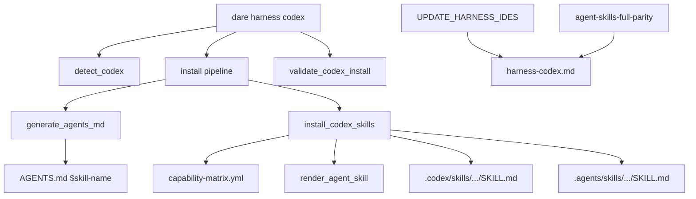

# BLUEPRINT: Adapter Codex (Microplano 013)

> **Gerado a partir de:** `DARE/DESIGN-013-adapter-codex.md` v1.0  
> **Data:** 2026-07-21 | **Status:** APPROVED  
> **Arquivo:** `DARE/BLUEPRINT-013-adapter-codex.md`  
> **Não substitui:** Blueprints 001–012  
> **Estado do código:** `dare-harness::codex` + CLI `dare harness codex` já existem — este Blueprint **congela contratos DEC-014**, fecha gaps (help `--force`, detect tests, smoke, docs, Ralph) e closeout 014.  
> **DEC:** DEC-014 (active) · **ADR:** ADR-007 · **Pré:** 005, 009, 010, 011–012 DONE

---

## 0. TRADE-OFFS (Architect)

Sem `PATTERNS.md` / `patterns-facts.json` — decisões 🟡 a partir do Design 013 + DEC-014 + código atual + padrão 011/012.

| # | Trade-off | Escolha | Justificativa |
|---|-----------|---------|---------------|
| T-01 | Onde vive o adapter | **`crates/dare-harness/src/codex.rs`** | Microplano + DEC-014 |
| T-02 | Fonte de skills | Matrix `outputs.codex` + `render_agent_skill` | 010; frontmatter skill |
| T-03 | Contagem | **SoT = matrix** (hoje **49**) | Não reduzir a 48 package skills |
| T-04 | Gap 48 package | Exception `agent-skills-full-parity` Classe C | Aceite via exception; registry 044+ |
| T-05 | Share Antigravity | Também escrever `.agents/skills/{id}/SKILL.md` | Mesmo `skill_body`; sem drift |
| T-06 | AGENTS.md | Lista dinâmica `$id` + descrição | Invocação `$skill-name` |
| T-07 | Managed marker | `<!-- dare:managed` **ou** 1ª linha `---` | Skills com frontmatter; Classe B documentada |
| T-08 | Preserve default | Skip unmanaged + `!force` | RS-07 |
| T-09 | `--force` | Overwrite unmanaged | Help clap MUST |
| T-10 | Validate | Paths codex + `AGENTS.md` existem | Não hash |
| T-11 | Update policies | `UPDATE_HARNESS_IDES` inclui `"codex"` | Constante; wire 021+ SHOULD |
| T-12 | Escrita FS | SafeRelativePath + atomic_write | 005 |
| T-13 | Install Antigravity | Fora | 014 |
| T-14 | Wire `dare update` | Só constante neste ciclo | RF-16 SHOULD |

---

## 0.1 GAP ANALYSIS (código → MUST)

| Item | Estado | Ação |
|------|--------|------|
| `detect_codex` | ✅ | Congelar §5.1; teste empty |
| `generate_agents_md` + `$skill` | ✅ | Congelar §5.2; preserve AGENTS.md |
| `install_codex_skills` + share | ✅ | Assert 49; coexistência |
| `validate_codex_install` | ✅ | AGENTS.md + missing ≤5 |
| `UPDATE_HARNESS_IDES` / `update_policies_include_codex` | ✅ | Manter teste |
| CLI detect/install/validate | ✅ parcial | Help `--force`; smoke |
| Docs `harness-codex.md` | ⚠️ stub | Expandir DEC-014 + T/RS |
| Compose Fase 1 | — | Verificar |
| Ralph + TASKS-013 | ⚠️ | Fases N-1 / N |

---

## 1. VISÃO GERAL DA ARQUITETURA



**Decisões:**

| Decisão | Escolha | Justificativa |
|---------|---------|---------------|
| Dual write skills | `.codex` + `.agents` | Coexistência sem conteúdo divergente |
| AGENTS.md gerado | Lista matrix | `$skill-name` descobível |
| Policies | Constante estática | Update não pode omitir Codex |
| Sem Antigravity install | Só share path | Scope 013 |

---

## 2. STACK TÉCNICA DEFINIDA

| Camada | Tecnologia | Versão | Papel |
|--------|-----------|--------|-------|
| Rust | toolchain | **1.85.0** | MSRV |
| Crate | `dare-harness` | `0.1.0-alpha.0` | Adapter Codex |
| Assets | `dare-assets` | workspace | Matrix + `render_agent_skill` |
| Core FS | `dare-core` | workspace | ProjectRoot / atomic_write |
| CLI | `dare-cli` + clap | workspace | `harness codex` |
| Temp | `tempfile` | workspace | Unit + smoke |

**Sem novas crates.**

---

## 3. ESTRUTURA DE PASTAS E ARQUIVOS

```text
crates/dare-harness/src/
└── codex.rs                  # EDIT: contratos §5 + testes gap

crates/dare-cli/src/
└── main.rs                   # EDIT: help --force CodexCmd::Install

crates/dare-cli/tests/
└── cli_smoke.rs              # EDIT: harness_codex_install_validate_detect

docs/compatibility/
└── harness-codex.md          # EDIT: DEC-014, T-*, RS, $skill, share, exception 48

assets/capability-matrix.yml  # VERIFICAR exception agent-skills-full-parity

docker-compose.ci.yml         # VERIFICAR Fase 1

# Destinos no projeto alvo:
# AGENTS.md
# .codex/skills/<id>/SKILL.md
# .agents/skills/<id>/SKILL.md
```

---

## 4. MODELO DE DADOS

### 4.1 `CodexDetect`

| Campo | Tipo | Semântica |
|-------|------|-----------|
| `agents_md` | `bool` | `AGENTS.md` existe |
| `codex_dir` | `bool` | `.codex/` existe |
| `agents_skills` | `bool` | `.agents/skills/` existe |

### 4.2 `UPDATE_HARNESS_IDES`

```rust
pub const UPDATE_HARNESS_IDES: &[&str] = &[
    "claude-code", "cursor", "codex", "antigravity", "hybrid", "claude-hybrid",
];
```

`update_policies_include_codex()` → `true` iff `"codex"` presente.

### 4.3 Contagens

| Métrica | Valor |
|---------|-------|
| `outputs.codex.is_some()` | **49** |
| `install_codex_skills(..., true)` return | **49** (só conta writes matrix path) |
| `validate_codex_install` Ok | **49** |
| Package skills “48” | Exception Classe C — não assert |

### 4.4 Marcador managed

| Regra | Detalhe |
|-------|---------|
| Managed | 1ª linha trim starts with `<!-- dare:managed` **ou** `---` |
| Unmanaged | Caso contrário → preserve sem `--force` |

---

## 5. CONTRATOS DE API (ANTI-STUB)

### 5.1 `detect_codex`

```rust
pub fn detect_codex(root: &ProjectRoot) -> CoreResult<CodexDetect>;
```

| Pré | root válido |
| Pós | zero writes |
| Edge | vazio → todos `false` |

### 5.2 `generate_agents_md`

```rust
pub fn generate_agents_md(root: &ProjectRoot, force: bool) -> CoreResult<()>;
```

**Body (estrutura):**

```text
<!-- dare:managed agents-md -->
# DARE Codex Agents

Invoke Agent Skills with `$skill-name` (example: `$dare-design`).

## Skills
- `$<id>` — <description.trim()>
… (uma linha por capability com outputs.codex)

Shared skills live under `.agents/skills/` (Antigravity coexistence) and `.codex/skills/`.
```

| Caso | Comportamento |
|------|----------------|
| unmanaged + !force | No-op |
| force / managed / missing | Rewrite |

### 5.3 `install_codex_skills`

```rust
pub fn install_codex_skills(root: &ProjectRoot, force: bool) -> CoreResult<usize>;
```

**Algoritmo:**
1. Load + validate matrix
2. `written = 0`
3. Para cada cap com `outputs.codex` Some:
   - `body = "<!-- dare:managed capability={id} -->\n" + render_agent_skill(cap)`
   - Se `should_write(matrix_path)` → atomic_write; `written += 1`
   - Shared `.agents/skills/{id}/SKILL.md`: se `should_write` e (force ou conteúdo ≠ body) → atomic_write
4. Return `written`

| Caso | Resultado |
|------|-----------|
| force | `Ok(49)` + shared files existem |
| shared unmanaged custom | conteúdo user intacto |

### 5.4 `validate_codex_install`

```rust
pub fn validate_codex_install(root: &ProjectRoot) -> CoreResult<usize>;
```

- Sem `AGENTS.md` → `Err(config("AGENTS.md missing"))`
- Missing skills → `Err(config("codex skills missing ({n}): {first5}"))`
- Ok → `Ok(49)`

### 5.5 `update_policies_include_codex`

```rust
pub fn update_policies_include_codex() -> bool;
```

Sempre `true` neste ciclo (constante).

### 5.6 CLI

```text
dare harness codex detect [--root <path>]
dare harness codex install [--root <path>] [--force]
dare harness codex validate [--root <path>]
```

| Subcomando | stdout |
|------------|--------|
| `detect` | `harness codex detect: agents_md={} codex_dir={} agents_skills={}` |
| `install` | `harness codex install: wrote {n} skills + AGENTS.md` (ou equivalente atual estável) |
| `validate` | `harness codex validate: ok ({n} skills)` |

**Ordem install:** `generate_agents_md` → `install_codex_skills`.

**Help `--force`:** unmanaged overwritten when set.

### 5.7 Exemplos

**Install force:** `wrote 49` + ficheiro `AGENTS.md` contém `$dare-design`.

**Coexistência:** shared file `user custom skill\n` sem managed → intacto após install !force.

---

## 6. PLANO DE EXECUÇÃO (FASES)

### Fase 1: Containerização ← **SEMPRE PRIMEIRA**

**DONE:** `docker compose -f docker-compose.ci.yml config` exit 0.

---

### Fase 2: Congelar detect + generate_agents_md + preserve + policies

**DONE:**
- §5.1–5.2; `UPDATE_HARNESS_IDES` / `update_policies_include_codex`
- Unit: detect empty; generate com `$dare-design`; preserve unmanaged AGENTS.md; policies true
- `cargo test -p dare-harness -- codex::`

---

### Fase 3: install_codex_skills + validate + coexistência

**DONE:**
- Roundtrip force → 49 / 49 + shared `dare-design` existe
- Coexistência: unmanaged shared preservado
- Missing / AGENTS.md missing messages
- `cargo test -p dare-harness -- codex::`

---

### Fase 4: CLI help `--force` + install pipeline

**DONE:**
- Clap docstring `--force` em `CodexCmd::Install`
- Ordem generate → install_codex_skills
- `cargo build -p dare-cli`

---

### Fase 5: CLI smoke + docs DEC-014 + exception

**DONE:**
- Smoke: tempdir install --force → validate 49; detect agents_md=true
- `harness-codex.md`: CLI, `$skill-name`, share `.agents`, T-01…T-14, RS, SoT 49 vs 48 exception, UPDATE_HARNESS_IDES
- Não remover exception; não implementar Antigravity adapter
- Gate: `cargo test -p dare-cli --test cli_smoke`

---

### Fase 6: Auditoria ← **N-1**

**DONE:**
```text
cargo test --workspace
cargo clippy --workspace --all-targets -- -D warnings
cargo audit
cargo deny check
```

---

### Fase 7: Fechamento ← **N**

**DONE:** TASKS-013 7/7; próximo **014-adapter-antigravity**.

---

## 7. VALIDATION GATES POR STACK

| Stack | Build | Test | Lint/Audit |
|-------|-------|------|------------|
| Rust | `cargo build -p dare-harness -p dare-cli` | `cargo test --workspace` | clippy `-D warnings` + audit + deny |

---

## 8. CONTROLES DE SEGURANÇA (RS → fases)

| RS | Fase | Verificação |
|----|------|-------------|
| RS-01 | 3 | SafeRelativePath + matrix |
| RS-02 | 2–3 | AGENTS/skills sem secrets |
| RS-03 | 2–3 | ProjectRoot jail |
| RS-04 | 6 | audit + deny |
| RS-05 | 2–5 | sem secrets em código |
| RS-06 | 5 | doc: adapter não executa skills |
| RS-07 | 4–5 | help `--force` |
| RS-08 | 3 | atomic_write; validate não apaga |

---

## 9. ESTRATÉGIA DE TESTES

| Tipo | Caso |
|------|------|
| Unit | detect empty |
| Unit | generate `$dare-design` + policies |
| Unit | install/validate 49 + shared file |
| Unit | coexistência preserve unmanaged shared |
| Smoke | CLI install/validate/detect |
| Doc | exception 48 + UPDATE_HARNESS_IDES |

---

## 10. ESTRATÉGIA DE DEPLOY

| Ambiente | Nota |
|----------|------|
| Local / CI | Gates §7 + smoke |
| Release | Fora (015) |
| Consumo | `dare harness codex install` |

---

## 11. CHECKLIST DE APROVAÇÃO DO BLUEPRINT

- [ ] T-01…T-14 aceites (share `.agents`; SoT 49; constante update)
- [ ] Contratos §5 executáveis
- [ ] Fases 1–7 (compose + audit + closeout 014)
- [ ] Exception `agent-skills-full-parity` obrigatória
- [ ] Sem Antigravity adapter / discover neste ciclo
- [ ] Pronto para `/dare-tasks` → `mp013-*`

---

## 12. PRÓXIMAS ETAPAS

1. Aprovar este Blueprint.  
2. `/dare-tasks` → `TASKS-013-adapter-codex.md`, `dare-dag-013.yaml`, `EXECUTION-013/`.  
3. Após closeout → [`014-adapter-antigravity.md`](../DARE-RUST-MICRO-PLANOS/DARE-RUST-MICRO-PLANOS/014-adapter-antigravity.md).
