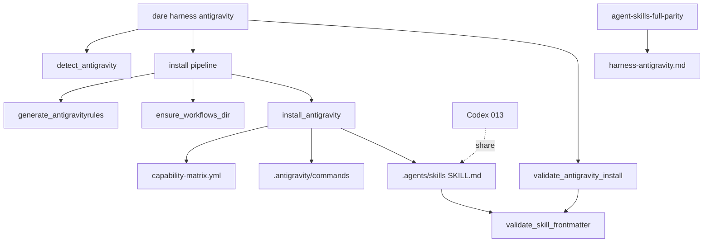

# BLUEPRINT: Adapter Antigravity (Microplano 014)

> **Gerado a partir de:** `DARE/DESIGN-014-adapter-antigravity.md` v1.0  
> **Data:** 2026-07-21 | **Status:** APPROVED  
> **Arquivo:** `DARE/BLUEPRINT-014-adapter-antigravity.md`  
> **Não substitui:** Blueprints 001–013  
> **Estado do código:** `dare-harness::antigravity` + CLI já existem — este Blueprint **congela contratos DEC-015**, fecha gaps (help `--force`, detect/preserve tests, smoke, docs, Ralph) e closeout **015**.  
> **DEC:** DEC-015 (active) · **ADR:** ADR-007 · **Pré:** 005, 009, 010, 011–013 DONE

---

## 0. TRADE-OFFS (Architect)

Sem `PATTERNS.md` / `patterns-facts.json` — decisões 🟡 a partir do Design 014 + DEC-015 + código atual + padrão 011–013.

| # | Trade-off | Escolha | Justificativa |
|---|-----------|---------|---------------|
| T-01 | Onde vive o adapter | **`crates/dare-harness/src/antigravity.rs`** | Microplano + DEC-015 |
| T-02 | Commands | Matrix `outputs.antigravity` + `render_claude_command` | Paridade Cursor body |
| T-03 | Skills | `.agents/skills/{id}/SKILL.md` + `render_agent_skill` | Mesmo corpo Codex |
| T-04 | Contagem | **SoT = matrix** (hoje **49**) | Não forçar 48 |
| T-05 | Gap 48 package | Exception `agent-skills-full-parity` Classe C | Aceite microplano |
| T-06 | Workflows | Só `.agents/workflows/.gitkeep` | Paridade TS empty |
| T-07 | Frontmatter | `name:` + `description:` non-empty no bloco `---` | RF-08 |
| T-08 | Managed marker | `<!-- dare:managed` **ou** `---` | Igual Codex |
| T-09 | Preserve default | Skip unmanaged + `!force` | RS-07 |
| T-10 | `--force` | Overwrite unmanaged | Help clap MUST |
| T-11 | Validate | Rules + commands + skills frontmatter | Fail-fast Config |
| T-12 | Install CLI order | rules → workflows → install_antigravity | RF-14 |
| T-13 | Escrita FS | SafeRelativePath + atomic_write | 005 |
| T-14 | Release / discover | Fora | 015 / 018+ |

---

## 0.1 GAP ANALYSIS (código → MUST)

| Item | Estado | Ação |
|------|--------|------|
| detect / rules / workflows / install / validate / frontmatter | ✅ | Congelar §5; testes detect/preserve |
| Coexistência Codex | ✅ | Manter teste |
| CLI | ✅ parcial | Help `--force`; smoke |
| Docs | ⚠️ stub | Expandir DEC-015 |
| Compose Fase 1 | — | Verificar |
| Ralph + TASKS-014 | ⚠️ | Fases N-1 / N |

---

## 1. VISÃO GERAL DA ARQUITETURA



**Decisões:**

| Decisão | Escolha | Justificativa |
|---------|---------|---------------|
| Dual materialization | commands + shared skills | IDE commands + Agent Skills |
| Share com Codex | Mesmo path/corpo | Sem drift |
| Workflows mínimos | `.gitkeep` | Scope; conteúdo real = 015+ backlog |
| Fechar adapters | Closeout → 015 | Série 011–014 completa |

---

## 2. STACK TÉCNICA DEFINIDA

| Camada | Tecnologia | Versão | Papel |
|--------|-----------|--------|-------|
| Rust | toolchain | **1.85.0** | MSRV |
| Crate | `dare-harness` | `0.1.0-alpha.0` | Adapter Antigravity |
| Assets | `dare-assets` | workspace | Matrix + render |
| Core FS | `dare-core` | workspace | ProjectRoot / atomic_write |
| CLI | `dare-cli` + clap | workspace | `harness antigravity` |
| Temp | `tempfile` | workspace | Unit + smoke |

**Sem novas crates.**

---

## 3. ESTRUTURA DE PASTAS E ARQUIVOS

```text
crates/dare-harness/src/
└── antigravity.rs            # EDIT: contratos §5 + testes gap

crates/dare-cli/src/
└── main.rs                   # EDIT: help --force AntigravityCmd::Install

crates/dare-cli/tests/
└── cli_smoke.rs              # EDIT: harness_antigravity_install_validate_detect

docs/compatibility/
└── harness-antigravity.md    # EDIT: DEC-015, T-*, RS, 49 vs 48, share Codex

assets/capability-matrix.yml  # VERIFICAR exception agent-skills-full-parity

docker-compose.ci.yml         # VERIFICAR Fase 1

# Destinos no projeto alvo:
# .antigravityrules
# .antigravity/commands/*.md
# .agents/skills/<id>/SKILL.md
# .agents/workflows/.gitkeep
```

---

## 4. MODELO DE DADOS

### 4.1 `AntigravityDetect`

| Campo | Tipo | Semântica |
|-------|------|-----------|
| `antigravityrules` | `bool` | `.antigravityrules` existe |
| `antigravity_dir` | `bool` | `.antigravity/` existe |
| `agents_skills` | `bool` | `.agents/skills/` existe |
| `agents_workflows` | `bool` | `.agents/workflows/` existe |

### 4.2 Contagens

| Métrica | Valor |
|---------|-------|
| `outputs.antigravity.is_some()` | **49** |
| `install_antigravity(..., true)` | **49** |
| `validate_antigravity_install` Ok | **49** |
| Package “48” | Exception Classe C |

### 4.3 Frontmatter skill (mínimo)

Bloco entre `---` … `---`:

| Campo | Constraint |
|-------|------------|
| `name:` | present; trim non-empty |
| `description:` | present; trim non-empty |

---

## 5. CONTRATOS DE API (ANTI-STUB)

Constantes:

```rust
const MANAGED_PREFIX: &str = "<!-- dare:managed";
const RULES_REL: &str = ".antigravityrules";
const WORKFLOWS_KEEP: &str = ".agents/workflows/.gitkeep";
```

### 5.1 `detect_antigravity`

```rust
pub fn detect_antigravity(root: &ProjectRoot) -> CoreResult<AntigravityDetect>;
```

Zero writes. Edge: root vazio → todos `false`.

### 5.2 `generate_antigravityrules`

```rust
pub fn generate_antigravityrules(root: &ProjectRoot, force: bool) -> CoreResult<()>;
```

**Body mínimo:**

```text
<!-- dare:managed antigravityrules -->
# DARE Antigravity rules

Follow Design → Blueprint → Tasks → Execute. Use Agent Skills under `.agents/skills/`.
Shared with Codex — do not diverge skill bodies.
```

Preserve unmanaged + `!force`.

### 5.3 `ensure_workflows_dir`

```rust
pub fn ensure_workflows_dir(root: &ProjectRoot, force: bool) -> CoreResult<()>;
```

Write `.agents/workflows/.gitkeep` com body vazio (`b""`) se `should_write`.

### 5.4 `install_antigravity`

```rust
pub fn install_antigravity(root: &ProjectRoot, force: bool) -> CoreResult<usize>;
```

**Algoritmo:**
1. Load + validate matrix
2. Para cada `outputs.antigravity` Some:
   - Command: managed + `render_claude_command` → write; `written += 1` se escrito
   - Shared skill: `skill_body` = managed + `render_agent_skill`; write se `should_write` (skip se identical + !force)
3. Return `written`

### 5.5 `validate_skill_frontmatter`

```rust
pub fn validate_skill_frontmatter(body: &str) -> CoreResult<()>;
```

| Caso | Resultado |
|------|-----------|
| `name` + `description` OK | `Ok(())` |
| Incomplete | `Err(config("skill frontmatter missing name and/or description"))` |

### 5.6 `validate_antigravity_install`

```rust
pub fn validate_antigravity_install(root: &ProjectRoot) -> CoreResult<usize>;
```

- Sem `.antigravityrules` → `Err(".antigravityrules missing")`
- Cada command path + shared skill deve existir; skill → `validate_skill_frontmatter`
- Missing → amostra ≤5
- Ok → `Ok(49)`

### 5.7 CLI

```text
dare harness antigravity detect [--root <path>]
dare harness antigravity install [--root <path>] [--force]
dare harness antigravity validate [--root <path>]
```

| Subcomando | stdout (en-US) |
|------------|----------------|
| `detect` | `harness antigravity detect: rules={} dir={} skills={} workflows={}` (campos atuais estáveis) |
| `install` | `harness antigravity install: wrote {n} commands + skills/rules` |
| `validate` | `harness antigravity validate: ok ({n} commands)` |

**Ordem install:** `generate_antigravityrules` → `ensure_workflows_dir` → `install_antigravity`.

**Help `--force`:** unmanaged overwritten when set.

### 5.8 Exemplos

**Frontmatter OK:**

```text
---
name: dare-design
description: Capability IDE for dare-design
---
```

**Coexistência:** Antigravity force install → Codex install !force → `validate_antigravity_install == 49`.

---

## 6. PLANO DE EXECUÇÃO (FASES)

### Fase 1: Containerização ← **SEMPRE PRIMEIRA**

**DONE:** `docker compose -f docker-compose.ci.yml config` exit 0.

---

### Fase 2: Congelar detect + rules + workflows + preserve

**DONE:**
- §5.1–5.3
- Unit: detect empty; generate rules managed; preserve unmanaged rules; workflows `.gitkeep`
- `cargo test -p dare-harness -- antigravity::`

---

### Fase 3: install + validate + frontmatter + coexistência Codex

**DONE:**
- Roundtrip force → 49 / 49
- `frontmatter_rejects_incomplete` + OK case
- Coexistência Codex (já existente) verde
- `cargo test -p dare-harness -- antigravity::`

---

### Fase 4: CLI help `--force` + install pipeline

**DONE:**
- Clap docstring `--force` em `AntigravityCmd::Install`
- Ordem rules → workflows → install
- `cargo build -p dare-cli`

---

### Fase 5: CLI smoke + docs DEC-015 + exception

**DONE:**
- Smoke: tempdir install --force → validate 49; detect rules true
- `harness-antigravity.md`: CLI, frontmatter, share Codex, workflows `.gitkeep`, T-01…T-14, RS, SoT 49 vs 48 exception, DEC-015
- Não remover exception; não implementar release 015
- Gate: `cargo test -p dare-cli --test cli_smoke`

---

### Fase 6: Auditoria ← **N-1**

**DONE:**
```text
cargo test --workspace
cargo clippy --workspace --all-targets -- -D warnings
cargo audit
cargo deny check
```

---

### Fase 7: Fechamento ← **N**

**DONE:** TASKS-014 7/7; próximo **015-pipeline-de-release-nativo-alpha**.

---

## 7. VALIDATION GATES POR STACK

| Stack | Build | Test | Lint/Audit |
|-------|-------|------|------------|
| Rust | `cargo build -p dare-harness -p dare-cli` | `cargo test --workspace` | clippy `-D warnings` + audit + deny |

---

## 8. CONTROLES DE SEGURANÇA (RS → fases)

| RS | Fase | Verificação |
|----|------|-------------|
| RS-01 | 3 | SafeRelativePath + matrix |
| RS-02 | 2–3 | rules/commands/skills sem secrets |
| RS-03 | 2–3 | ProjectRoot jail |
| RS-04 | 6 | audit + deny |
| RS-05 | 2–5 | sem secrets em código |
| RS-06 | 3–5 | frontmatter parse-only |
| RS-07 | 4–5 | help `--force` |
| RS-08 | 3 | atomic_write; validate não apaga |

---

## 9. ESTRATÉGIA DE TESTES

| Tipo | Caso |
|------|------|
| Unit | detect empty / after install |
| Unit | preserve unmanaged rules |
| Unit | install/validate 49 + workflows |
| Unit | frontmatter reject / OK |
| Unit | coexistência Codex |
| Smoke | CLI install/validate/detect |
| Doc | exception 48 + share |

---

## 10. ESTRATÉGIA DE DEPLOY

| Ambiente | Nota |
|----------|------|
| Local / CI | Gates §7 + smoke |
| Release binário | Fora — microplano **015** |
| Consumo | `dare harness antigravity install` |

---

## 11. CHECKLIST DE APROVAÇÃO DO BLUEPRINT

- [ ] T-01…T-14 aceites (SoT 49; `.gitkeep`; share Codex; frontmatter)
- [ ] Contratos §5 executáveis
- [ ] Fases 1–7 (compose + audit + closeout 015)
- [ ] Exception `agent-skills-full-parity` obrigatória
- [ ] Sem release pipeline / discover neste ciclo
- [ ] Pronto para `/dare-tasks` → `mp014-*`

---

## 12. PRÓXIMAS ETAPAS

1. Aprovar este Blueprint.  
2. `/dare-tasks` → `TASKS-014-adapter-antigravity.md`, `dare-dag-014.yaml`, `EXECUTION-014/`.  
3. Após closeout → [`015-pipeline-de-release-nativo-alpha.md`](../DARE-RUST-MICRO-PLANOS/DARE-RUST-MICRO-PLANOS/015-pipeline-de-release-nativo-alpha.md).
