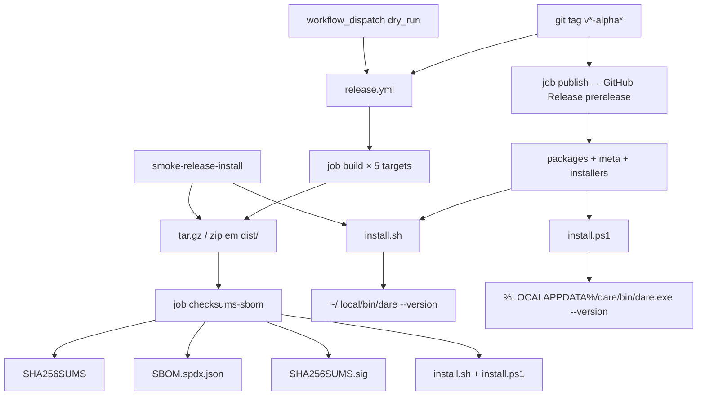

# BLUEPRINT: Pipeline de release nativo alpha (Microplano 015)

> **Gerado a partir de:** `DARE/DESIGN-015-pipeline-de-release-nativo-alpha.md` v1.0  
> **Data:** 2026-07-21 | **Status:** APPROVED  
> **Arquivo:** `DARE/BLUEPRINT-015-pipeline-de-release-nativo-alpha.md`  
> **Não substitui:** `DARE/BLUEPRINT.md` nem Blueprints 001–014  
> **Pré-requisito:** Microplano 003 (CI multi-target) concluído  
> **Nota:** implementação parcial existe — este Blueprint congela contratos executáveis e gaps MUST/SHOULD

---

## 0. TRADE-OFFS (Architect)

Sem `PATTERNS.md` / `patterns-facts.json` — decisões 🟡 a partir do Design 015 + Blueprint/CI 003 + código parcial em `release.yml` / `installers/`.

| # | Trade-off | Escolha | Justificativa |
|---|-----------|---------|---------------|
| T-01 | Linux aarch64: `cross` vs runner ARM | **`cross` em `ubuntu-latest`** (manter parcial) | Release já usa `cross`; runner `ubuntu-24.04-arm` (003) é alternativa se `cross` flaky — documentar fallback em ADR-008 |
| T-02 | macOS runners | **Alinhar a 003: `macos-13` (x64) + `macos-14` (arm64)** | RF-20 SHOULD → MUST técnico neste Blueprint para paridade com `build.yml` |
| T-03 | SBOM | **MUST = SPDX-2.3 mínimo válido**; tool syft/cyclonedx = SHOULD (não bloqueia) | Alpha precisa artefacto; stub documentado em ADR-008 |
| T-04 | Cosign | **Soft-fail**: sempre emitir `SHA256SUMS.sig` (assinatura real **ou** texto skip) | RF-09; stable endurece depois |
| T-05 | Publish gate | **Só tag push** cria Release; `workflow_dispatch` default `dry_run=true` | Evita publish acidental (R-06) |
| T-06 | Naming `latest` | Installers **exigem** `DARE_VERSION` ou `DARE_LOCAL_ARCHIVE` | Archives incluem versão no filename; `latest/download` sem versão é ambíguo |
| T-07 | Versão clap vs tag | **Permitir divergência** na alpha; ADR-008 documenta | Tag nomeia assets; clap pode ficar `0.1.0-alpha.0` |
| T-08 | Checksum no ps1 | **Warn + continue** se verify falhar; sh **MUST fail** se sums remoto e mismatch | Design RS-06; Windows UX menos frágil em alpha |
| T-09 | Container Fase 1 | **Reusar** `Dockerfile.rust` + `docker-compose.ci.yml` (003) — sem imagem de release | Pipeline é GHA, não container de produto |

---

## 0.1 GAP ANALYSIS (código → MUST)

| Item | Estado | Ação |
|------|--------|------|
| `release.yml` matrix 5 + package + publish | Parcial | Alinhar runners macOS (T-02); validar dry_run |
| SHA256SUMS + SBOM stub + cosign soft | Parcial | Congelar formato §5; ADR-008 |
| `install.sh` / `install.ps1` | Parcial | Congelar env + exit codes §5 |
| Smoke `scripts/smoke-release-install.*` | Parcial | Garantir `--version` (não só `--help`) |
| `docs/compatibility/release-alpha.md` | Stub | Completar |
| `docs/adr/ADR-008-*.md` | Ausente | Criar |
| Compose / Dockerfile Fase 1 | Existe (003) | Verificar apenas |

---

## 1. VISÃO GERAL DA ARQUITETURA

Pipeline de **distribuição** (não domínio Rust): GitHub Actions build → package → meta (checksums/SBOM/sig) → GitHub Release prerelease → installers baixam e verificam.



**Decisões arquiteturais:**

| Decisão | Escolha | Justificativa |
|---------|---------|---------------|
| Canal | GitHub Releases prerelease only | Sem npm; cutover stable = 056 |
| Separação jobs | `build` → `checksums-sbom` → `publish` | Fail-fast=false nos builds; meta só com todos packages |
| Permissions | `contents: write` + `id-token: write` | Release + OIDC cosign |
| Installers no repo | `installers/` versionados; copiados para Release | Utilizador pode `curl` script do Release ou do raw |
| Sem mudança crates | Exceto se bump versão explícito (fora MUST) | Escopo = pipeline + scripts |

---

## 2. STACK TÉCNICA DEFINIDA

| Camada | Tecnologia | Versão | Papel |
|--------|-----------|--------|-------|
| Rust | rustc/cargo | **1.85.0** | Build `dare-cli` release |
| Crate | `dare-cli` | workspace `0.1.0-alpha.0` | Binário |
| GHA checkout | `actions/checkout` | **v4.2.2** | Clone |
| Toolchain | `dtolnay/rust-toolchain` | **1.85.0** | Targets matrix |
| Cache | `Swatinem/rust-cache` | **v2.7.8** | key `release-${target}` |
| Cross | `cross` | install `--locked` no job | linux aarch64 |
| Upload | `actions/upload-artifact` | **v4.6.0** | Packages + meta |
| Download | `actions/download-artifact` | **v4.1.8** | merge-multiple |
| Publish | `softprops/action-gh-release` | **v2.2.1** | Prerelease assets |
| Cosign | binary | **v2.4.1** (pin URL) | sign-blob SHA256SUMS |
| Installers | bash / PowerShell 5+ | — | Install + verify |
| Container local | `Dockerfile.rust` + `docker-compose.ci.yml` | 003 | Fase 1 verify |
| Docs | Markdown | — | release-alpha + ADR-008 |

---

## 3. ESTRUTURA DE PASTAS E ARQUIVOS

```text
dare-cli/
├── .github/workflows/
│   ├── release.yml                 # MUST — alinhar runners macOS
│   ├── build.yml                   # ref 003 (não alterar salvo nota)
│   └── ci.yml                      # gate pré-tag
├── installers/
│   ├── install.sh                  # MUST — contrato §5.3
│   └── install.ps1                 # MUST — contrato §5.4
├── scripts/
│   ├── smoke-release-install.sh    # MUST — §5.5
│   └── smoke-release-install.ps1   # MUST — §5.5
├── docs/
│   ├── compatibility/
│   │   └── release-alpha.md        # MUST — completar
│   ├── adr/
│   │   └── ADR-008-release-alpha-nativo.md  # MUST — criar
│   └── DECISION-LOG.md             # DEC-016 (já existe — expandir se preciso)
├── Dockerfile.rust                 # Fase 1 — verificar
├── docker-compose.ci.yml           # Fase 1 — verificar
└── DARE/
    ├── DESIGN-015-pipeline-de-release-nativo-alpha.md
    └── BLUEPRINT-015-pipeline-de-release-nativo-alpha.md
```

---

## 4. MODELO DE DADOS

Sem banco. Entidades = **targets, packages, meta files, env installer**.

### 4.1 Matrix canónica (5 targets)

| target triple | runner | archive | binary in stage |
|---------------|--------|---------|-----------------|
| `x86_64-unknown-linux-gnu` | `ubuntu-latest` | `tar.gz` | `dare` |
| `aarch64-unknown-linux-gnu` | `ubuntu-latest` + `cross: true` | `tar.gz` | `dare` |
| `x86_64-apple-darwin` | `macos-13` | `tar.gz` | `dare` |
| `aarch64-apple-darwin` | `macos-14` | `tar.gz` | `dare` |
| `x86_64-pc-windows-msvc` | `windows-latest` | `zip` | `dare.exe` |

### 4.2 Naming de package

```text
STAGE   = dare-${VERSION}-${TARGET}
ARTIFACT = ${STAGE}.tar.gz   # Unix
         | ${STAGE}.zip      # Windows
VERSION = ${GITHUB_REF_NAME} em tag (ex. v0.1.0-alpha.1)
        | "dev" em dry_run sem tag (só artifacts CI, sem publish)
```

Conteúdo do stage: **apenas** o binário (`dare` ou `dare.exe`) na raiz do diretório stage.

### 4.3 `SHA256SUMS` (formato)

- Encoding: UTF-8, LF
- Uma linha por archive: `<hex_sha256>  <filename>` (dois espaços, estilo `sha256sum`)
- Filenames **sem** path (`dare-v0.1.0-alpha.1-….tar.gz`)
- Ordem: sort lexicográfico do filename
- Inclui **somente** `.tar.gz` e `.zip` (não inclui SBOM/sig/installers)

### 4.4 `SBOM.spdx.json` (mínimo MUST)

Campos obrigatórios:

| Campo | Valor |
|-------|-------|
| `spdxVersion` | `"SPDX-2.3"` |
| `dataLicense` | `"CC0-1.0"` |
| `SPDXID` | `"SPDXRef-DOCUMENT"` |
| `name` | `"dare-cli-${VERSION}"` |
| `documentNamespace` | `"https://github.com/dewtech/dare-cli/spdx/${VERSION}"` |
| `creationInfo.created` | ISO-8601 UTC |
| `creationInfo.creators` | `["Tool: dare-release-alpha"]` |
| `packages[0].name` | `"dare"` |
| `packages[0].SPDXID` | `"SPDXRef-Package-dare"` |
| `packages[0].downloadLocation` | `"NOASSERTION"` |
| `packages[0].filesAnalyzed` | `false` |
| `packages[0].versionInfo` | `${VERSION}` |

SHOULD: substituir por saída syft/cyclonedx se job estável — manter filename `SBOM.spdx.json`.

### 4.5 `SHA256SUMS.sig`

| Caso | Conteúdo |
|------|----------|
| Cosign OK | Assinatura binária/texto cosign de `SHA256SUMS` |
| Skip | Texto ASCII começando por `signing skipped` (não falha job) |

### 4.6 Env installer (canónico)

| Var | Obrigatório | Default | Semântica |
|-----|-------------|---------|-----------|
| `DARE_VERSION` | um de VERSION/LOCAL | — | Tag exata no filename (`v0.1.0-alpha.1`) |
| `DARE_LOCAL_ARCHIVE` | um de VERSION/LOCAL | — | Path absoluto/relativo ao archive local |
| `DARE_REPO` | não | `dewtech/dare-cli` | `owner/repo` |
| `DARE_INSTALL_BASE` | não | `https://github.com/${REPO}/releases/latest/download` | Base URL assets |
| `DARE_PREFIX` | não | Unix: `$HOME/.local`; Win: `%LOCALAPPDATA%\dare` | Prefixo; bin em `${PREFIX}/bin` |

---

## 5. CONTRATOS DE API (ANTI-STUB)

Não há HTTP de produto. Contratos = **workflow jobs**, **funções de script**, **exit codes**.

### 5.1 Workflow `release.yml` — triggers

| Trigger | Condição | Publish? |
|---------|----------|----------|
| `push.tags` | `v*-alpha*` ou `v*-alpha.*` | Sim (job publish) |
| `workflow_dispatch` | input `dry_run` boolean default `true` | Só se `dry_run == false` **e** ref é tag |

```yaml
# condição publish (canónica)
if: startsWith(github.ref, 'refs/tags/') &&
    (github.event_name != 'workflow_dispatch' || inputs.dry_run == false)
```

**Edge cases:**

| Caso | Comportamento |
|------|---------------|
| Dispatch sem tag + dry_run false | Publish **não** corre (ref não é tag) |
| Tag `v1.0.0` sem alpha | Workflow **não** dispara |
| Um target falha | Outros continuam (`fail-fast: false`); publish bloqueado (`needs`) |

### 5.2 Job `build` — package step (contrato)

**Pré-condições:**
- Binário existe em `target/${TARGET}/release/dare[.exe]`
- `VERSION` = `GITHUB_REF_NAME` ou `dev`

**Pós-condições:**
- `dist/dare-${VERSION}-${TARGET}.{tar.gz|zip}` existe
- Artifact GHA name `dare-${TARGET}` contém o ficheiro

**Erros:**
- Binário ausente → exit ≠ 0
- `zip`/`tar` falha → exit ≠ 0

### 5.3 `install.sh` — contrato executável

**Invocação:**
```bash
DARE_VERSION=v0.1.0-alpha.1 bash installers/install.sh
# ou
DARE_LOCAL_ARCHIVE=/path/to/dare-….tar.gz DARE_PREFIX=/tmp/p bash installers/install.sh
```

**Algoritmo (ordem):**
1. `detect_target()` → `x86_64-unknown-linux-gnu` | `aarch64-unknown-linux-gnu` | `x86_64-apple-darwin` | `aarch64-apple-darwin`
2. Se nem `DARE_VERSION` nem `DARE_LOCAL_ARCHIVE` → stderr mensagem en-US; **exit 2**
3. Se local: `cp` archive para tmp
4. Se remoto: `curl -fsSL` archive; `curl` SHA256SUMS; `sha256sum -c --ignore-missing` — **fail se mismatch** (exit ≠ 0)
5. `tar -xzf`; `find` ficheiro nome `dare`; `install -m 755` → `$DARE_PREFIX/bin/dare`
6. Executar `"$BIN_DIR/dare" --version` — falha do binário → exit ≠ 0

**Exit codes:**

| Code | Significado |
|------|-------------|
| 0 | Instalado + `--version` OK |
| 1 | Erro genérico (curl, tar, checksum, unsupported) |
| 2 | Missing `DARE_VERSION` / `DARE_LOCAL_ARCHIVE` |

**Edge cases:**

| Caso | Resultado |
|------|-----------|
| OS não linux/darwin | stderr `unsupported OS`; exit 1 |
| arch não x86_64/aarch64 | stderr `unsupported arch`; exit 1 |
| Reinstall | Sobrescreve binário; exit 0 |
| SHA256SUMS remoto 404 | Comportamento: se curl sums falhar, **não** silenciar checksum — preferir fail **ou** documentar skip só quando LOCAL (atual: if curl sums OK then verify) |

**Proibido:** `eval` de conteúdo remoto; concatenar shell com URL não quotada.

### 5.4 `install.ps1` — contrato executável

**Invocação:**
```powershell
$env:DARE_VERSION='v0.1.0-alpha.1'; .\installers\install.ps1
# ou
$env:DARE_LOCAL_ARCHIVE='C:\path\dare-….zip'; $env:DARE_PREFIX='C:\tmp\p'; .\installers\install.ps1
```

**Algoritmo:**
1. Target fixo alpha: `x86_64-pc-windows-msvc` (arm64 → throw)
2. Sem VERSION/LOCAL → throw (exit ≠ 0)
3. Download zip + opcional SHA256SUMS; mismatch → throw; sums fail → **Write-Warning** e continua (T-08)
4. `Expand-Archive`; achar `dare.exe`; copiar para `$BinDir\dare.exe`
5. `& dare.exe --version` — deve exit 0

**Edge cases:** arm64 Windows → erro explícito “not in alpha matrix”.

### 5.5 Smoke `scripts/smoke-release-install.sh` / `.ps1`

**Algoritmo MUST:**
1. `cargo build -p dare-cli --release` (host)
2. Empacotar host triple como `dare-${VERSION}-${HOST}.{tar.gz|zip}` em `dist/smoke/`
3. Gerar `SHA256SUMS` + `SBOM.spdx.json` mínimo + `SHA256SUMS.sig` skip text
4. Copiar installers para `dist/smoke/`
5. `DARE_LOCAL_ARCHIVE=…` `DARE_PREFIX=dist/smoke/prefix` → installer
6. Assert: `"$PREFIX/bin/dare" --version` (Unix) ou `dare.exe --version` (Win) exit 0
7. Assert ficheiros meta existem
8. Echo confirma matrix 5 declarado em `release.yml` (grep targets — opcional but recommended)

**DONE smoke:** exit 0; `--version` stdout contém `dare` e semântica de versão (regex `^dare `).

### 5.6 Job `checksums-sbom`

**Inputs:** todos packages baixados em `dist/`
**Outputs artifact `dare-release-meta`:**
- `SHA256SUMS`
- `SHA256SUMS.sig`
- `SBOM.spdx.json`
- `install.sh`
- `install.ps1`

**Cosign step:** `continue-on-error: true` **ou** lógica interna que nunca falha o job; sempre produz `.sig`.

### 5.7 Job `publish`

**Pré:** tag ref + condição §5.1  
**Action:** `softprops/action-gh-release@v2.2.1`  
**Params:** `prerelease: true`, `draft: false`, `files: dist/**`, `generate_release_notes: true`  
**Auth:** `GITHUB_TOKEN`  
**Side effects:** cria/atualiza GitHub Release da tag com todos assets.

### 5.8 Exemplos concretos

**SHA256SUMS (exemplo):**
```text
a1b2c3…  dare-v0.1.0-alpha.1-aarch64-apple-darwin.tar.gz
d4e5f6…  dare-v0.1.0-alpha.1-x86_64-pc-windows-msvc.zip
…
```

**Installer OK:**
```text
Installed: /home/user/.local/bin/dare
dare 0.1.0-alpha.0
```

**Installer missing env:**
```text
Set DARE_VERSION=vX.Y.Z-alpha.N or DARE_LOCAL_ARCHIVE=/path/to/archive.tar.gz
# exit 2
```

---

## 6. PLANO DE EXECUÇÃO (FASES)

### Fase 1: Containerização ← **SEMPRE PRIMEIRA**

- **Objetivo:** Confirmar `Dockerfile.rust` + `docker-compose.ci.yml` (herança 003) sobem e compilam `dare-cli`.
- **DONE:** `docker compose -f docker-compose.ci.yml` (ou equivalente documentado) build/run smoke mínimo **ou** waiver explícito “compose 003 intacto + `docker build -f Dockerfile.rust` exit 0”.
- **Entregáveis:** nota em `release-alpha.md` § local verify; sem nova imagem de release.

### Fase 2: Congelar workflow matrix + package + dry_run

- **Objetivo:** `release.yml` com 5 targets, runners T-02, package naming §4.2, dry_run.
- **DONE:** YAML valida; matrix inclui exactamente os 5 triples; macOS 13/14; `workflow_dispatch.dry_run` default true.
- **Entregáveis:** `.github/workflows/release.yml` alinhado.

### Fase 3: SHA256SUMS + SBOM + cosign soft + publish

- **Objetivo:** Job meta + publish em tag.
- **DONE:** Formatos §4.3–4.5; publish condition §5.1; artifact meta completo.
- **Entregáveis:** jobs `checksums-sbom` + `publish`.

### Fase 4: Installers `install.sh` / `install.ps1`

- **Objetivo:** Contratos §5.3–5.4 (env, checksum, `--version`, exit codes).
- **DONE:** Scripts cumprem algoritmo; unsupported OS/arch fail; sem `eval`.
- **Entregáveis:** `installers/install.sh`, `installers/install.ps1`.

### Fase 5: Smoke instalação limpa + docs

- **Objetivo:** Smoke local + `release-alpha.md` + ADR-008 + DEC-016.
- **DONE:** `bash scripts/smoke-release-install.sh` (ou ps1 no Win) exit 0 com `--version`; docs listam targets, naming, política cosign, env vars; ADR-008 existe.
- **Entregáveis:** scripts smoke; `docs/compatibility/release-alpha.md`; `docs/adr/ADR-008-release-alpha-nativo.md`.

### Fase 6: Auditoria ← **N-1**

- **Objetivo:** Gates segurança + deps.
- **DONE:** `cargo fmt --check`; `cargo clippy --workspace --all-targets -- -D warnings`; `cargo test --workspace`; `cargo audit`; `cargo deny check` (pins 003); sem secrets em YAML/scripts; RS checklist §8 verde.
- **Entregáveis:** log Ralph em EXECUTION (via tasks).

### Fase 7: Fechamento ← **N**

- **Objetivo:** Critérios de aceite do microplano 015.
- **DONE:** 5 targets no workflow; checksum+SBOM no contrato; installers → `--version`; Ralph OK; ADR-008; diferença npm vs nativo classificada (canal paralelo, sem incompat CLI); artefacto: smoke local **e/ou** dry_run GHA com artifacts.
- **Entregáveis:** Design/Blueprint status APPROVED/DONE nos artefatos DARE do 015; pronto para 016.

---

## 7. VALIDATION GATES POR STACK

| Stack | Build | Test | Lint / Audit |
|-------|-------|------|--------------|
| Rust workspace | `cargo build -p dare-cli --release` | `cargo test --workspace` | `cargo fmt --check` · `cargo clippy --workspace --all-targets -- -D warnings` · `cargo audit` · `cargo deny check` |
| Release smoke | — | `bash scripts/smoke-release-install.sh` (ou `.ps1`) | Scripts sem secrets |
| GHA | Workflow syntax | dry_run dispatch (manual) | Permissions mínimas |

---

## 8. CONTROLES DE SEGURANÇA (RS → fases)

| RS | Fase | Verificação |
|----|------|-------------|
| RS-01 | 4 | Installer rejeita OS/arch inválidos; exige VERSION/LOCAL |
| RS-02 | 3–4 | Archives só binário; sem `.env`/keys |
| RS-03 | 2–3 | Só `GITHUB_TOKEN`; sem deploy key no repo |
| RS-04 | 6 | audit + deny limpos antes de tag humana |
| RS-05 | 3 | `COSIGN_KEY` só secret; OIDC via `id-token` |
| RS-06 | 4–5 | sh verifica sums; ps1 warn; smoke local |
| RS-07 | 4 | Sem `eval`; curl/iwr URLs quotadas |
| RS-08 | 3 | `SBOM.spdx.json` sempre no meta |

---

## 9. ESTRATÉGIA DE TESTES

| Tipo | O quê | Como |
|------|-------|------|
| Unit | N/A domínio (pipeline) | — |
| Integração local | Package + install prefix | `smoke-release-install.*` |
| Contrato YAML | 5 targets + naming | Review + grep no smoke |
| Segurança | Sem secrets; checksum path | Review scripts + audit/deny |
| Manual GHA | `workflow_dispatch` dry_run | Artifacts 5 packages + meta |
| E2E release | Tag `v*-alpha*` (humano) | Prerelease com assets (opcional neste ciclo se dry_run OK) |

**Asserts smoke obrigatórios:**
1. Archive criado
2. `SHA256SUMS` e `SBOM.spdx.json` existem
3. Installer exit 0
4. `--version` exit 0 e stdout `^dare `

---

## 10. ESTRATÉGIA DE DEPLOY

| Ambiente | Branch / trigger | Infra | Artefacto |
|----------|------------------|-------|-----------|
| Local smoke | working tree | host + cargo | `dist/smoke/` |
| Dry-run CI | `workflow_dispatch` | GHA matrix | upload-artifact only |
| Alpha | tag `v*-alpha*` | GitHub Releases prerelease | packages + meta + installers |
| Stable | — | Fora (056) | — |

**Nota:** publicar tag é **ação humana**; agente não cria tags nem push.

---

## 11. CHECKLIST DE APROVAÇÃO DO BLUEPRINT

- [ ] Trade-offs T-01…T-09 aceites (cross, macOS 13/14, cosign soft, SBOM mínimo)
- [ ] Contratos §5 (workflow, installers, smoke, exit codes) suficientes para `/dare-tasks` sem inventar
- [ ] Formatos SHA256SUMS / SBOM / naming §4 congelados
- [ ] Fases 1→7 com DONE verificáveis
- [ ] RS mapeados
- [ ] Fora de escopo 053/056 respeitado
- [ ] Pronto para `/dare-tasks` → `TASKS-015` + `dare-dag-015.yaml` + `EXECUTION-015/`

---

## 12. PRÓXIMAS ETAPAS

1. Revisar e aprovar este Blueprint.  
2. Executar `/dare-tasks` sobre `DARE/BLUEPRINT-015-pipeline-de-release-nativo-alpha.md`.  
3. Executar DAG `mp015-*` (Ralph por task).  
4. Após closeout → microplano [`016-comando-welcome.md`](../DARE-RUST-MICRO-PLANOS/DARE-RUST-MICRO-PLANOS/016-comando-welcome.md).
