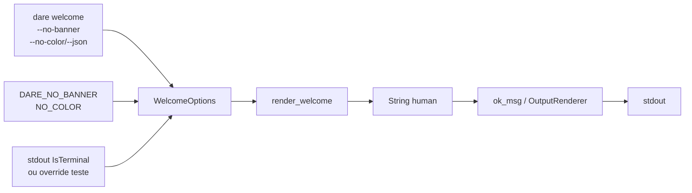

# BLUEPRINT: Comando welcome (Microplano 016)

> **Gerado a partir de:** `DARE/DESIGN-016-comando-welcome.md` v1.0  
> **Data:** 2026-07-21 | **Status:** APPROVED  
> **Arquivo:** `DARE/BLUEPRINT-016-comando-welcome.md`  
> **Não substitui:** `DARE/BLUEPRINT.md` nem Blueprints 001–015  
> **Pré-requisitos:** Microplanos 004 (saída CLI) e 015 (release alpha) concluídos  
> **Nota:** implementação parcial existe — este Blueprint congela contratos executáveis e gaps MUST

---

## 0. TRADE-OFFS (Architect)

Sem `PATTERNS.md` / `patterns-facts.json` — decisões 🟡 a partir do Design 016 + código parcial em `welcome.rs` + DEC-005/017.

| # | Trade-off | Escolha | Justificativa |
|---|-----------|---------|---------------|
| T-01 | Banner vs pipes/CI | **Só TTY** (`IsTerminal`) | Evita poluir stdout em scripts (O-01) |
| T-02 | Silenciar banner | **Flag `--no-banner` + env `DARE_NO_BANNER`** | Paridade UX + automação |
| T-03 | Truthy env | **`1` / `true` / `TRUE` / `yes` / `YES` apenas** | Lista fechada; outros valores = banner on |
| T-04 | Color | **ASCII art se color OK; `BANNER_PLAIN` se `--no-color` ou `NO_COLOR`** | Alinha DEC-005; sem ANSI color elaborado (RF-14 COULD fora) |
| T-05 | Testabilidade TTY | **`WelcomeOptions.stdout_is_tty: Option<bool>`** | Snapshots determinísticos sem pseudo-TTY |
| T-06 | CI-005 `dare new` | **Proibido na saída** + `debug_assert!` + smoke | Classe B fix obrigatório |
| T-07 | Quick-start copy | **Constante `QUICK_START` en-US** | design→blueprint→tasks→execute + hints info/harness/assets |
| T-08 | Container Fase 1 | **Reusar** `Dockerfile.rust` + `docker-compose.ci.yml` (003/015) | Sem imagem nova |
| T-09 | Docs | **`docs/compatibility/cli-welcome.md` + DEC-017** | Gap atual = só decision log |

---

## 0.1 GAP ANALYSIS (código → MUST)

| Item | Estado | Ação |
|------|--------|------|
| Banner TTY / flags / env | Parcial ✅ | Congelar §5; testes já cobrem |
| Sem `dare new` | ✅ | Manter asserts |
| Snapshots unit | ✅ | Manter nomes + eq |
| Smoke CLI | ✅ | Manter + opcional `--json` SHOULD |
| `cli-welcome.md` | 🔴 ausente | Criar (RF-11) |
| DEC-017 nota expandida | ⚠️ | Apontar doc no decision log |
| Compose Fase 1 | Existe | Verificar apenas |
| TASKS/DAG formal | ⚠️ | `/dare-tasks` |

---

## 1. VISÃO GERAL DA ARQUITETURA

Comando UX puro: **render determinístico** → saída via renderer 004 (`ok_msg`). Sem I/O de disco, sem rede.



**Decisões arquiteturais:**

| Decisão | Escolha | Justificativa |
|---------|---------|---------------|
| Lógica em `welcome.rs` | Sim; `main` thin | RNF-05; testável sem clap |
| Sem path safety | N/A | Sem reads/writes |
| Envelope JSON | Via 004 SHOULD | Body = texto welcome completo |
| Sem crate extra | std + clap existente | Escopo mínimo |

---

## 2. STACK TÉCNICA DEFINIDA

| Camada | Tecnologia | Versão | Papel |
|--------|-----------|--------|-------|
| Rust | rustc/cargo | **1.85.0** | Compile |
| Crate | `dare-cli` | `0.1.0-alpha.0` | Comando |
| TTY | `std::io::IsTerminal` | std | Detect |
| CLI | clap | workspace | `--no-banner` |
| Saída | `ok_msg` / renderer 004 | DEC-005 | Human/JSON |
| Testes | unit + assert_cmd | workspace | Snapshots + smoke |
| Container | `Dockerfile.rust` + `docker-compose.ci.yml` | 003/015 | Fase 1 |
| Docs | Markdown | — | `cli-welcome.md` |

---

## 3. ESTRUTURA DE PASTAS E ARQUIVOS

```text
dare-cli/
├── crates/dare-cli/src/
│   ├── commands/
│   │   ├── mod.rs
│   │   └── welcome.rs          # MUST — contrato §5
│   └── main.rs                 # Welcome { no_banner } → render_welcome
├── crates/dare-cli/tests/
│   └── cli_smoke.rs            # welcome_no_banner*; welcome_env*
├── docs/compatibility/
│   └── cli-welcome.md          # MUST — criar
├── docs/DECISION-LOG.md        # DEC-017 → link cli-welcome
├── docker-compose.ci.yml       # Fase 1 verify
├── Dockerfile.rust
└── DARE/
    ├── DESIGN-016-comando-welcome.md
    └── BLUEPRINT-016-comando-welcome.md
```

---

## 4. MODELO DE DADOS

Sem banco. Entidades = **opções + constantes de texto**.

### 4.1 `WelcomeOptions`

| Campo | Tipo | Default | Semântica |
|-------|------|---------|-----------|
| `no_banner` | `bool` | `false` | CLI `--no-banner` |
| `stdout_is_tty` | `Option<bool>` | `None` | `None` → `stdout().is_terminal()`; `Some` → override testes |
| `no_color` | `bool` | `false` | CLI `--no-color` **ou** detecção via env no render |

### 4.2 Constantes (canónicas)

| Const | Conteúdo / regra |
|-------|------------------|
| `BANNER` | ASCII art multi-linha (contém `____`) |
| `BANNER_PLAIN` | Exactamente `"DARE Framework\n"` |
| `QUICK_START` | Inclui `dare design`, `dare blueprint`, `dare tasks`, `dare execute`, `dare info`; **nunca** `dare new` |
| Tagline (inline) | `"Native Rust rewrite — Design → Architecture → Review → Execute\n\n"` quando banner on |

### 4.3 Política `should_show_banner`

```text
false se no_banner OR env_no_banner()
false se !detect_tty(opts)
true  caso contrário
```

`env_no_banner()` = `DARE_NO_BANNER` ∈ {`1`,`true`,`TRUE`,`yes`,`YES`}.

---

## 5. CONTRATOS DE API (ANTI-STUB)

### 5.1 `render_welcome`

```rust
pub fn render_welcome(opts: &WelcomeOptions) -> String
```

**Pré-condições:** nenhuma (sempre retorna).  
**Pós-condições:**
- Resultado **nunca** contém substring `dare new`
- Se `!should_show_banner(opts)` → resultado **igual** a `QUICK_START`
- Se banner on + (`opts.no_color` OR `NO_COLOR` set) → prefixo `BANNER_PLAIN` + tagline + `QUICK_START`
- Se banner on + color allowed → prefixo ASCII `BANNER` (sem leading `\n` extra) + `\n` + tagline + `QUICK_START`
- Contém `Quick start` e `dare design`

**Erros:** nenhum (`String` sempre).  
**Concorrência:** leitura de env; seguro para testes sequenciais; testes que mutam env devem isolar.

**Edge cases:**

| Caso | Resultado |
|------|-----------|
| TTY false | Só `QUICK_START` |
| `no_banner` true + TTY true | Só `QUICK_START` |
| `DARE_NO_BANNER=1` | Sem `____` |
| `DARE_NO_BANNER=0` / unset | Banner se TTY |
| `NO_COLOR` set + TTY + !no_banner | `BANNER_PLAIN` path |
| JSON mode (CLI) | Renderer envolve o mesmo texto (004) |

### 5.2 CLI `dare welcome`

| Aspecto | Contrato |
|---------|----------|
| Assinatura | `dare welcome [--no-banner]` + globais `--json` `--no-color` |
| Exit | `0` no happy path |
| Wiring | `WelcomeOptions { no_banner, no_color: cli.no_color, stdout_is_tty: None }` → `ok_msg(render_welcome(...))` |
| Help | en-US; documenta `--no-banner` |

**Exemplo human (`--no-banner`):**
```text
Quick start — Design → Architecture → Review → Execute

  1. dare design          # /dare-design — requisitos em DARE/DESIGN.md
  …
Also useful:
  dare info               # instalação e caminhos
  …
```

**Exemplo smoke asserts:**
- contains `Quick start`, `dare design`
- not contains `dare new`
- env `DARE_NO_BANNER=1` → not contains `____`

### 5.3 Testes unitários obrigatórios (nomes)

| Teste | Assert |
|-------|--------|
| `no_tty_skips_banner` | sem `____`; tem Quick start; sem `dare new` |
| `no_banner_flag` | sem `____`; tem `dare design` |
| `snapshot_human_tty_no_color` | `eq` `BANNER_PLAIN` + tagline + `QUICK_START` |
| `snapshot_no_tty` | `eq` `QUICK_START` |

### 5.4 Smoke CLI obrigatórios

| Teste | Comando | Assert |
|-------|---------|--------|
| `welcome_no_banner_no_dare_new` | `welcome --no-banner --no-color` | success; Quick start; dare design; not dare new |
| `welcome_env_no_banner` | `DARE_NO_BANNER=1 welcome --no-color` | success; not `____`; Quick start |

### 5.5 Docs `cli-welcome.md` (MUST)

Secções mínimas:
1. Comando + flags (`--no-banner`, `--no-color`, `--json`)
2. Env `DARE_NO_BANNER` / `NO_COLOR`
3. Política TTY
4. CI-005 / proibição `dare new`
5. Quick-start steps
6. Ponteiro DEC-017

### 5.6 Default sem subcomando (SHOULD)

Mensagem existente deve continuar a mencionar `dare welcome` (não remover).

---

## 6. PLANO DE EXECUÇÃO (FASES)

### Fase 1: Containerização ← **SEMPRE PRIMEIRA**

- **Objetivo:** Confirmar `docker compose -f docker-compose.ci.yml config` (herança 003/015).
- **DONE:** exit 0 **ou** waiver documentado em `cli-welcome.md` § Local verify.
- **Entregáveis:** nota no doc; sem nova imagem.

### Fase 2: Congelar `render_welcome` + política banner

- **Objetivo:** Contratos §5.1 + constantes §4.2; CI-005.
- **DONE:** Unit tests §5.3 passam; sem `dare new` na saída.
- **Entregáveis:** `welcome.rs` alinhado (não reescrever cosmético se já cumpre).

### Fase 3: CLI wiring + smoke

- **Objetivo:** `main` + smoke §5.4; `--no-banner` clap.
- **DONE:** `cargo test -p dare-cli --test cli_smoke` passa nos testes welcome.
- **Entregáveis:** `main.rs`, `cli_smoke.rs`.

### Fase 4: Docs DEC-017

- **Objetivo:** `cli-welcome.md` + link no decision log.
- **DONE:** Doc com secções §5.5; DEC-017 aponta o path.
- **Entregáveis:** `docs/compatibility/cli-welcome.md`.

### Fase 5: Auditoria ← **N-1**

- **Objetivo:** Ralph + deps.
- **DONE:** `cargo fmt --check`; `cargo clippy --workspace --all-targets -- -D warnings`; `cargo test --workspace`; `cargo audit`; `cargo deny check`.
- **Entregáveis:** exit codes 0.

### Fase 6: Fechamento ← **N**

- **Objetivo:** Aceite microplano 016.
- **DONE:** Critérios: non-TTY sem banner; sem `dare new`; snapshots OK; Ralph OK; docs presentes; artefacto CI via 015 já disponível.
- **Entregáveis:** TASKS 016 100%; próximo 017.

---

## 7. VALIDATION GATES POR STACK

| Stack | Build | Test | Lint / Audit |
|-------|-------|------|--------------|
| Rust | `cargo build -p dare-cli` | `cargo test -p dare-cli` + `--test cli_smoke` | `cargo fmt --check` · clippy `-D warnings` · audit · deny |
| Docs | — | Secções §5.5 presentes | — |

---

## 8. CONTROLES DE SEGURANÇA (RS → fases)

| RS | Fase | Verificação |
|----|------|-------------|
| RS-01 | 2 | Só flags/env booleanos; sem path input |
| RS-02 | 2–3 | Saída sem tokens/secrets |
| RS-03 | — | N/A local |
| RS-04 | 5 | audit + deny |
| RS-05 | 2 | Sem secrets em constantes |
| RS-06 | 2 | Env só afeta banner |
| RS-07 | 2 | Sem paths absolutos no welcome |

---

## 9. ESTRATÉGIA DE TESTES

| Tipo | O quê | Como |
|------|-------|------|
| Unit | Política banner + snapshots | `welcome::tests::*` |
| Smoke | CLI flags/env | `cli_smoke` welcome_* |
| Segurança | Sem `dare new`; sem secrets | Asserts + review |
| Cross-OS | TTY override | Unit independente de OS |

---

## 10. ESTRATÉGIA DE DEPLOY

| Ambiente | Trigger | Artefacto |
|----------|---------|-----------|
| Local | `cargo run -p dare-cli -- welcome` | stdout |
| CI 003 | PR | unit + smoke |
| Alpha 015 | Tag release | binário já inclui `welcome` |

Sem pipeline novo neste microplano.

---

## 11. CHECKLIST DE APROVAÇÃO DO BLUEPRINT

- [ ] Trade-offs T-01…T-09 aceites
- [ ] Contratos §5 suficientes para `/dare-tasks` sem inventar
- [ ] Snapshots e smoke nomeados
- [ ] Fases 1→6 com DONE verificáveis
- [ ] RS mapeados
- [ ] Fora de escopo 017/i18n/ANSI aceite
- [ ] Pronto para `/dare-tasks` → `TASKS-016` + `dare-dag-016.yaml` + `EXECUTION-016/`

---

## 12. PRÓXIMAS ETAPAS

1. Revisar e aprovar este Blueprint.  
2. Executar `/dare-tasks` sobre `DARE/BLUEPRINT-016-comando-welcome.md`.  
3. Executar DAG `mp016-*` (Ralph por task).  
4. Após closeout → [`017-comando-info.md`](../DARE-RUST-MICRO-PLANOS/DARE-RUST-MICRO-PLANOS/017-comando-info.md).
