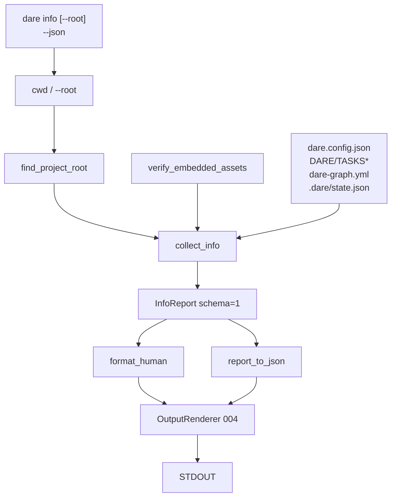

# BLUEPRINT: Comando info (Microplano 017)

> **Gerado a partir de:** `DARE/DESIGN-017-comando-info.md` v1.0  
> **Data:** 2026-07-21 | **Status:** APPROVED  
> **Arquivo:** `DARE/BLUEPRINT-017-comando-info.md`  
> **Não substitui:** `DARE/BLUEPRINT.md` nem Blueprints 001–016  
> **Pré-requisitos:** Microplanos 007–015 (+ 004/005/009)  
> **Nota:** implementação parcial em `info.rs` — este Blueprint congela contratos executáveis e gaps MUST

---

## 0. TRADE-OFFS (Architect)

Sem `PATTERNS.md` / `patterns-facts.json` — decisões 🟡 a partir do Design 017 + código parcial + DEC-005/009.

| # | Trade-off | Escolha | Justificativa |
|---|-----------|---------|---------------|
| T-01 | Mutações | **Strict read-only** | Aceite inegociável; diagnóstico seguro em CI |
| T-02 | Schema JSON | **`schemaVersion: 1` camelCase** congelado | RF-10; bump só com ADR |
| T-03 | Root markers | **`dare.config.json` OR `DARE/` OR `Cargo.toml`** | Brownfield Rust + DARE instalado |
| T-04 | Backend field | **`ide` preferido, fallback `backend`** | Config 008 dual naming |
| T-05 | Graph path | **`dare-graph.yml` raiz, senão `DARE/dare-graph.yml`** | Compat paths |
| T-06 | Tasks progress | **Heurística texto** (`✅`/`DONE` / `⏳`/`PENDING`) em TASKS.md | DAG state = 026 (fora) |
| T-07 | Multi TASKS-* | **Prefer `DARE/TASKS.md`; senão sort lexico `TASKS-*.md` e pick first** | RF-17 MUST técnico neste Blueprint |
| T-08 | Contagem dupla emoji+DONE | **Documentar**; v1 aceita overcount | SHOULD refinar depois; fixture documenta |
| T-09 | Config read | **`ProjectRoot` + `SafeRelativePath`** | RS-06 / 005 |
| T-10 | Container Fase 1 | **Reusar** compose/Dockerfile 003–015 | Sem imagem nova |
| T-11 | Docs | **`cli-info.md` + DEC-018** | Gap atual |

---

## 0.1 GAP ANALYSIS (código → MUST)

| Item | Estado | Ação |
|------|--------|------|
| `collect_info` / human / JSON schema 1 | Parcial ✅ | Congelar §4–§5 |
| Root walk + read-only unit | ✅ | Manter |
| CLI `--root` + JSON via main | Parcial ✅ | Smoke |
| Sort lexico TASKS-* | ⚠️ | Implementar T-07 |
| Smoke CLI `info` / `--json` | 🔴 | Adicionar |
| `cli-info.md` + DEC-018 | 🔴 | Criar |
| Compose Fase 1 | Existe | Verificar |

---

## 1. VISÃO GERAL DA ARQUITETURA

Diagnóstico **read-only**: walk root → ler flags/ficheiros → verify assets → montar `InfoReport` → human + JSON via renderer 004.



**Decisões arquiteturais:**

| Decisão | Escolha | Justificativa |
|---------|---------|---------------|
| Domínio em `info.rs` | Sim; main thin | Testável |
| Sem writes | Assert before/after dir listing | O-07 |
| JSON data = struct serde | `json!(report)` camelCase | Schema estável |
| Assets sempre verificados | Mesmo sem root | Instalação CLI independente do projeto |

---

## 2. STACK TÉCNICA DEFINIDA

| Camada | Tecnologia | Versão | Papel |
|--------|-----------|--------|-------|
| Rust | rustc/cargo | **1.85.0** | Build |
| Crate | `dare-cli` | `0.1.0-alpha.0` | Comando |
| Core | `dare-core` ProjectRoot/SafeRelativePath | workspace | Path jail |
| Assets | `dare-assets::verify_embedded_assets` | 009 | Integridade |
| Serde | serde_json camelCase | workspace | Schema 1 |
| Saída | OutputRenderer / Ok(human, data) | 004 | `--json` |
| Testes | tempfile + assert_cmd | workspace | Unit + smoke |
| Container | `Dockerfile.rust` + `docker-compose.ci.yml` | 003 | Fase 1 |

---

## 3. ESTRUTURA DE PASTAS E ARQUIVOS

```text
dare-cli/
├── crates/dare-cli/src/
│   ├── commands/info.rs          # MUST — §5
│   └── main.rs                   # Commands::Info { root }
├── crates/dare-cli/tests/
│   └── cli_smoke.rs              # MUST — info_* tests
├── docs/compatibility/
│   └── cli-info.md               # MUST — criar
├── docs/DECISION-LOG.md          # DEC-018
├── docker-compose.ci.yml
├── Dockerfile.rust
└── DARE/
    ├── DESIGN-017-comando-info.md
    └── BLUEPRINT-017-comando-info.md
```

---

## 4. MODELO DE DADOS

### 4.1 `InfoReport` (schema 1 — congelado)

| Campo JSON | Tipo Rust | Nullable | Semântica |
|------------|-----------|----------|-----------|
| `schemaVersion` | `u32` | não | Sempre `1` (`INFO_SCHEMA_VERSION`) |
| `version` | `String` | não | `env!("CARGO_PKG_VERSION")` |
| `platform` | `PlatformInfo` | não | os/arch/family |
| `projectRoot` | `Option<String>` | sim | Absolute display path ou null |
| `assetsOk` | `bool` | não | Resultado verify |
| `assetsError` | `Option<String>` | sim | Mensagem se !ok |
| `configPresent` | `bool` | não | `dare.config.json` |
| `graphPath` | `Option<String>` | sim | Path absoluto se presente |
| `graphPresent` | `bool` | não | |
| `backend` | `Option<String>` | sim | `ide` ou `backend` string |
| `tasks` | `TasksProgress` | não | Ver 4.3 |
| `dareDirPresent` | `bool` | não | |
| `statePresent` | `bool` | não | `.dare/state.json` |

### 4.2 `PlatformInfo`

| Campo | Fonte |
|-------|-------|
| `os` | `std::env::consts::OS` |
| `arch` | `std::env::consts::ARCH` |
| `family` | `std::env::consts::FAMILY` |

### 4.3 `TasksProgress`

| Campo | Tipo | Semântica |
|-------|------|-----------|
| `source` | `Option<String>` | Path do ficheiro TASKS usado |
| `done` | `u32` | count `✅` + count `DONE` (heurística v1) |
| `pending` | `u32` | count `⏳` + count `PENDING` |
| `totalMarked` | `u32` | `done + pending` |

**Seleção de ficheiro (algoritmo MUST):**
1. Se `DARE/TASKS.md` existe → usar  
2. Senão listar `DARE/TASKS-*.md`, **sort lexicográfico** dos nomes, pick first  
3. Senão `source=null`, zeros

---

## 5. CONTRATOS DE API (ANTI-STUB)

### 5.1 `find_project_root`

```rust
pub fn find_project_root(start: &Path) -> Option<PathBuf>
```

**Algoritmo:** a partir de `start`, enquanto houver parent: se existe ficheiro `dare.config.json` **ou** dir `DARE` **ou** ficheiro `Cargo.toml` → return cur; senão `pop`. Se esgotar → `None`.

**Edge cases:**

| Caso | Resultado |
|------|-----------|
| start é root do projeto | Some(start) |
| nested `a/b` com config no ancestral | Some(ancestral) |
| sem markers | None |

**Side effects:** só `is_file`/`is_dir`/`pop` — zero writes.

### 5.2 `collect_info`

```rust
pub fn collect_info(cwd: &Path) -> CoreResult<InfoReport>
```

**Pré:** `cwd` existe (se não, comportamento: `find` None + assets still run — não panic).  
**Pós:** `schema_version == 1`; listing do dir de teste inalterado.  
**Erros:** tipicamente `Ok`; path errors internos engolidos para Option fields (não falhar info por config malformado — backend None). Assets err → `assets_ok=false` + `assets_error`.

**Ordem side effects (só reads):**
1. version + platform  
2. `find_project_root(cwd)`  
3. `verify_embedded_assets()`  
4. Se root: flags config/DARE/state; graph paths; `read_backend`; `tasks_progress`

### 5.3 `format_human`

```rust
pub fn format_human(r: &InfoReport) -> String
```

**MUST incluir linhas:** schema, version, platform, project, assets, config, DARE/, .dare/state, graph, backend/ide, tasks, **`mode: read-only (zero mutations)`**.

### 5.4 `report_to_json`

```rust
pub fn report_to_json(r: &InfoReport) -> Value
```

**MUST:** `v["schemaVersion"] == 1`; keys camelCase; sem campos extras no schema 1.

### 5.5 CLI

| Aspecto | Contrato |
|---------|----------|
| Assinatura | `dare info [--root <path>]` + `--json` |
| Exit | 0 se `collect_info` Ok |
| Wiring | `collect_info` → `(format_human, report_to_json)` → renderer |
| `--root` | Start path do walk (não exige ProjectRoot válido a priori) |

### 5.6 Testes unitários obrigatórios

| Teste | Assert |
|-------|--------|
| `find_root_walks_up` | nested encontra config no ancestral |
| `collect_is_read_only_and_schema_stable` | schema 1; dir listing igual before/after; JSON schemaVersion 1 |
| `tasks_picks_lexicographic_tasks_star` (novo SHOULD→MUST técnico) | Com só `TASKS-b.md` e `TASKS-a.md`, source ends with `TASKS-a.md` |

### 5.7 Smoke CLI obrigatórios

| Teste | Comando | Assert |
|-------|---------|--------|
| `info_human_tempdir` | `dare info --root <tmp>` | success; contains `read-only`; `version` |
| `info_json_schema` | `dare info --json --root <tmp>` | success; stdout JSON com `schemaVersion` 1; `assetsOk` bool |

### 5.8 Docs `cli-info.md`

Secções: comando/flags; schema 1 campos; root markers; disk contracts; tasks heuristic + sort; zero mutations; DEC-018; Local verify compose.

### 5.9 Exemplo JSON (tempdir vazio)

```json
{
  "schemaVersion": 1,
  "version": "0.1.0-alpha.0",
  "platform": { "os": "windows", "arch": "x86_64", "family": "windows" },
  "projectRoot": null,
  "assetsOk": true,
  "assetsError": null,
  "configPresent": false,
  "graphPath": null,
  "graphPresent": false,
  "backend": null,
  "tasks": { "source": null, "done": 0, "pending": 0, "totalMarked": 0 },
  "dareDirPresent": false,
  "statePresent": false
}
```

---

## 6. PLANO DE EXECUÇÃO (FASES)

### Fase 1: Containerização ← **SEMPRE PRIMEIRA**

- **DONE:** `docker compose -f docker-compose.ci.yml config` exit 0 **ou** waiver em `cli-info.md`.  
- **Entregáveis:** nota Local verify.

### Fase 2: Congelar `collect_info` + root + schema + read-only + TASKS sort

- **DONE:** Unit §5.6; sort lexico TASKS-*; zero writes; schema 1.  
- **Entregáveis:** `info.rs` alinhado.

### Fase 3: CLI + smoke

- **DONE:** Smokes §5.7 passam.  
- **Entregáveis:** `main.rs` (se gap), `cli_smoke.rs`.

### Fase 4: Docs DEC-018

- **DONE:** `cli-info.md` §5.8; DEC-018 no decision log.  
- **Entregáveis:** docs.

### Fase 5: Auditoria ← **N-1**

- **DONE:** fmt / clippy `-D warnings` / test workspace / audit / deny = 0.

### Fase 6: Fechamento ← **N**

- **DONE:** Aceite microplano; TASKS 017 100%; próximo 018.

---

## 7. VALIDATION GATES POR STACK

| Stack | Build | Test | Lint / Audit |
|-------|-------|------|--------------|
| Rust | `cargo build -p dare-cli` | `cargo test -p dare-cli` + `--test cli_smoke -- info` | fmt · clippy · audit · deny |

---

## 8. CONTROLES DE SEGURANÇA (RS → fases)

| RS | Fase | Verificação |
|----|------|-------------|
| RS-01 | 2–3 | `--root` / walk só markers |
| RS-02 | 2 | Só ide/backend string; sem dump config |
| RS-03 | 2 | before/after listing |
| RS-04 | 5 | audit + deny |
| RS-05 | 2 | Sem secrets em código |
| RS-06 | 2 | ProjectRoot para config |
| RS-07 | 2–3 | Paths só root/reportados |

---

## 9. ESTRATÉGIA DE TESTES

| Tipo | Como |
|------|------|
| Unit | root walk, read-only, schema, TASKS sort |
| Smoke | human + `--json` tempdir |
| Segurança | zero writes; sem secrets |
| Fixture TASKS | opcional contagem documentada |

---

## 10. ESTRATÉGIA DE DEPLOY

| Ambiente | Artefacto |
|----------|-----------|
| Local / CI | binário `dare info` |
| Alpha 015 | já empacota comando |

Sem pipeline novo.

---

## 11. CHECKLIST DE APROVAÇÃO DO BLUEPRINT

- [ ] Trade-offs T-01…T-11 aceites (esp. TASKS sort + heurística)
- [ ] Schema 1 §4 congelado
- [ ] Contratos §5 anti-stub suficientes para `/dare-tasks`
- [ ] Fases 1→6 DONE verificáveis
- [ ] RS mapeados
- [ ] Fora 018/026 aceite
- [ ] Pronto para `/dare-tasks` → `TASKS-017` + `dare-dag-017.yaml` + `EXECUTION-017/`

---

## 12. PRÓXIMAS ETAPAS

1. Revisar e aprovar este Blueprint.  
2. `/dare-tasks` sobre `DARE/BLUEPRINT-017-comando-info.md`.  
3. Executar DAG `mp017-*`.  
4. Após closeout → [`018-discover-deteccao-brownfield.md`](../DARE-RUST-MICRO-PLANOS/DARE-RUST-MICRO-PLANOS/018-discover-deteccao-brownfield.md).
