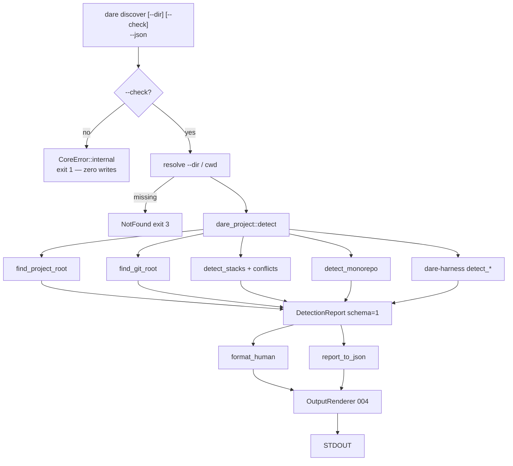

# BLUEPRINT: Discover — detecção brownfield (Microplano 018)

> **Gerado a partir de:** `DARE/DESIGN-018-discover-deteccao-brownfield.md` v1.0  
> **Data:** 2026-07-21 | **Status:** APPROVED  
> **Arquivo:** `DARE/BLUEPRINT-018-discover-deteccao-brownfield.md`  
> **Não substitui:** `DARE/BLUEPRINT.md` nem Blueprints 001–017  
> **Pré-requisitos:** Microplanos **005, 007, 008, 009** (+ **004/006**; harness detect **011–014** para RF-11)  
> **Nota:** greenfield — crate `dare-project` e `Commands::Discover` **ainda não existem**. Instalação (`dare discover` sem `--check`) = microplano **019**.

---

## 0. TRADE-OFFS (Architect)

Sem `PATTERNS.md` / `patterns-facts.json` — decisões 🟡 a partir do Design 018 + APIs existentes (`dare-core`, `dare-harness`) + DEC-005/006/004.

| # | Trade-off | Escolha | Justificativa |
|---|-----------|---------|---------------|
| T-01 | Domínio | **Nova crate `dare-project`** | Design RF-01; Documento Mestre §12; cli thin |
| T-02 | Mutações | **`--check` strict read-only**; sem `--check` → erro tipado **sem write** | O-07 / RF-02 / RF-15 / R-07 |
| T-03 | Schema JSON | **`schemaVersion: 1` camelCase** congelado (Apêndice C Design) | RF-12; bump só com ADR |
| T-04 | Exit codes | **Mapear para `CoreError` 004** (não Apêndice D literal do Design) | Exit codes 004 já congelados; DEC classifica diff Design/TS |
| T-05 | Install stub | **`CoreError::internal(...)` → exit 1** quando sem `--check` | RF-15; evita colidir com Io=5 do core |
| T-06 | Root markers | Ordem de aceite no walk: qualquer de `{dare.config.json, DARE/, package.json, Cargo.toml, pyproject.toml, requirements.txt, setup.py}` | RF-04; DARE markers não têm prioridade especial *além* de existir no dir |
| T-07 | Git root | **1)** walk-up `.git` (dir ou file/worktree); **2)** se root resolvido, opcional `git rev-parse --show-toplevel` via `SafeCommand` | RF-05 / RS-05; git ausente → `gitRoot: null` |
| T-08 | Stacks MUST | **Famílias `node` / `rust` / `python`** apenas no v1 MUST | RF-06..08; Go/PHP = COULD (RF-20) fora do MUST |
| T-09 | Conflito | ≥2 **famílias distintas** no root → `conflicts` não vazio; exit **0** no `--check` | RF-09; 019 decide política de install |
| T-10 | Monorepo | Evidências explícitas **ou** ≥2 manifests filhos depth≤**3**, max **64** entries | RF-10 / RNF-07 / R-01 |
| T-11 | Harnesses | Sempre emitir 4 entradas (`antigravity`,`claude`,`codex`,`cursor`) sorted by id; `present` = OR dos flags do `*Detect` | RF-11 / RF-18 |
| T-12 | Manifest read | Cap **262_144** bytes; sem parse completo de `package.json` no MUST | RS-08; só existência + `[workspace]` line scan |
| T-13 | Paths no JSON | Absolutos display ok no schema 1; testes normalizam | Design Apêndice C |
| T-14 | Container Fase 1 | **Reusar** `Dockerfile.rust` + `docker-compose.ci.yml` (003–015) | Sem imagem nova |
| T-15 | Docs | **`cli-discover-check.md` + DEC-019** | RF-21 |
| T-16 | Stacks finas | **Fora do MUST** (RF-19 SHOULD) — não bloquear closeout | Evitar scope creep |
| T-17 | Fixtures path | `tests/fixtures/{existing-node-project,existing-rust-project,existing-python-project,monorepo}` | RF-16 / fixtures-inventory |

### 0.1 Exit codes (congelados — alinhados a 004)

| Code | `ErrorKind` | Uso neste microplano |
|------|-------------|----------------------|
| 0 | — | `--check` OK |
| 1 | Internal | `discover` **sem** `--check` (install → 019) |
| 2 | Usage | args inválidos / clap |
| 3 | NotFound | `--dir` não existe |
| 4 | InvalidInput / Config | path safety reject / input inválido |
| 5 | Io | falha I/O inesperada ao ler tree |

> **Diff intencional vs Design Apêndice D:** Design rascunhou 3=path, 4=I/O, 5=install. Blueprint **corrige** para o mapa 004. Documentar em DEC-019 / classification matrix (classe B ou C).

### 0.2 GAP ANALYSIS (código → MUST)

| Item | Estado | Ação |
|------|--------|------|
| `crates/dare-project` | 🔴 | Criar + workspace member |
| `detect` / `DetectionReport` | 🔴 | Implementar §5 |
| `Commands::Discover` | 🔴 | clap + wiring |
| `detect_*` harness | ✅ | Reusar |
| Path safety / SafeCommand | ✅ | 005/006 |
| Fixtures Node/Rust/Python/monorepo | 🔴 | Materializar |
| `cli-discover-check.md` / DEC-019 | 🔴 | Criar |
| Compose Fase 1 | Existe | Verificar |

---

## 1. VISÃO GERAL DA ARQUITETURA

Detecção **read-only** brownfield: resolver start (`cwd`/`--dir`) → walk project root → Git → stacks + conflicts + monorepo → harnesses → `DetectionReport` schema 1 → human + JSON. Sem `--check` → erro Internal sem tocar disco.



**Decisões arquiteturais:**

| Decisão | Escolha | Justificativa |
|---------|---------|---------------|
| Domínio em `dare-project` | Sim; `discover.rs` thin | Testável; 019 reutiliza `detect` |
| Deps crate | `dare-core` + `dare-harness` (+ serde) | RF-01; sem ciclo com cli |
| Sem writes em check | before/after listing assert | O-07 |
| Conflito ≠ falha | exit 0 + `conflicts[]` | R-02; UX de revisão pré-install |

---

## 2. STACK TÉCNICA DEFINIDA

| Camada | Tecnologia | Versão | Papel |
|--------|-----------|--------|-------|
| Rust | rustc/cargo | **1.85.0** | Build |
| Crate | `dare-project` | `0.1.0-alpha.0` | Detecção |
| CLI | `dare-cli` + clap **4.5.40** | workspace | Superfície |
| Core | `dare-core` path/fs/process/error | workspace | Jail + Git argv + exits |
| Harness | `dare-harness` detect_* | workspace | IDE presence |
| Serde | serde / serde_json | workspace | Schema 1 camelCase |
| Saída | OutputRenderer / Ok(human, data) | 004 | `--json` |
| Testes | tempfile + assert_cmd | workspace | Unit + smoke |
| Container | `Dockerfile.rust` + `docker-compose.ci.yml` | 003 | Fase 1 |

---

## 3. ESTRUTURA DE PASTAS E ARQUIVOS

```text
dare-cli/
├── Cargo.toml                              # + member dare-project; workspace.dep
├── crates/dare-project/
│   ├── Cargo.toml
│   └── src/
│       ├── lib.rs                          # re-exports + DETECTION_SCHEMA_VERSION
│       ├── report.rs                       # structs DetectionReport, StackHit, …
│       ├── root.rs                         # find_project_root, find_git_root
│       ├── stacks.rs                       # detect_stacks, conflicts
│       ├── monorepo.rs                     # detect_monorepo
│       ├── harnesses.rs                    # map detect_* → HarnessHit
│       └── detect.rs                       # detect() + format_human + report_to_json
├── crates/dare-cli/
│   ├── Cargo.toml                          # + dare-project
│   └── src/
│       ├── commands/
│       │   ├── mod.rs                      # + mod discover
│       │   └── discover.rs                 # thin CLI
│       └── main.rs                         # Commands::Discover { dir, check }
├── crates/dare-cli/tests/
│   └── cli_smoke.rs                        # discover_* tests
├── tests/fixtures/
│   ├── existing-node-project/
│   │   └── package.json
│   ├── existing-rust-project/
│   │   └── Cargo.toml
│   ├── existing-python-project/
│   │   └── pyproject.toml
│   └── monorepo/
│       ├── pnpm-workspace.yaml
│       ├── package.json
│       ├── packages/a/package.json
│       └── packages/b/package.json
├── docs/compatibility/
│   └── cli-discover-check.md               # MUST
├── docs/DECISION-LOG.md                    # DEC-019
├── docker-compose.ci.yml
├── Dockerfile.rust
└── DARE/
    ├── DESIGN-018-discover-deteccao-brownfield.md
    └── BLUEPRINT-018-discover-deteccao-brownfield.md
```

> **Constraint workspace:** NÃO definir `[build] target` global no `.cargo/config.toml`.

---

## 4. MODELO DE DADOS

### 4.1 `DetectionReport` (schema 1 — congelado)

| Campo JSON | Tipo Rust | Nullable | Semântica |
|------------|-----------|----------|-----------|
| `schemaVersion` | `u32` | não | Sempre `1` (`DETECTION_SCHEMA_VERSION`) |
| `mode` | `String` | não | Sempre `"check"` neste microplano |
| `projectRoot` | `Option<String>` | sim | Path absoluto display ou null |
| `gitRoot` | `Option<String>` | sim | Path absoluto display ou null |
| `stacks` | `Vec<StackHit>` | não | Ordenado por `id` asc |
| `conflicts` | `Vec<StackConflict>` | não | Vazio se ≤1 família |
| `monorepo` | `bool` | não | |
| `monorepoEvidence` | `Vec<String>` | não | Paths relativos POSIX; sorted |
| `harnesses` | `Vec<HarnessHit>` | não | Sempre 4 ids; sorted by `id` |
| `dareAlreadyPresent` | `bool` | não | `dare.config.json` **ou** dir `DARE/` no root |

### 4.2 `StackHit`

| Campo | Tipo | Valores / regras |
|-------|------|------------------|
| `id` | `String` | MUST v1: `"node"` \| `"rust"` \| `"python"` (mesmo que `family` no MUST) |
| `family` | `String` | `"node"` \| `"rust"` \| `"python"` |
| `confidence` | `String` | `"high"` \| `"medium"` \| `"low"` — ver §5.4 |
| `evidence` | `Vec<String>` | Rel paths POSIX no root; **sorted** lexico; não vazio |

### 4.3 `StackConflict`

| Campo | Tipo | Semântica |
|-------|------|-----------|
| `kinds` | `Vec<String>` | Famílias em conflito; **sorted** lexico; len ≥ 2 |
| `evidence` | `Vec<String>` | Rel paths que motivaram; sorted |

### 4.4 `HarnessHit`

| Campo | Tipo | Semântica |
|-------|------|-----------|
| `id` | `String` | `"antigravity"` \| `"claude"` \| `"codex"` \| `"cursor"` |
| `present` | `bool` | OR dos flags do detect correspondente |
| `evidence` | `Vec<String>` | Rel paths presentes; sorted (ex.: `.claude`, `CLAUDE.md`) |

**Mapeamento `present` / evidence (MUST):**

| id | `present` se | evidence candidates (se existirem) |
|----|--------------|-------------------------------------|
| `claude` | `claude_md \|\| claude_dir` | `CLAUDE.md`, `.claude` |
| `cursor` | `cursor_dir \|\| cursorrules` | `.cursor`, `.cursorrules` |
| `codex` | `agents_md \|\| codex_dir \|\| agents_skills` | `AGENTS.md`, `.codex`, `.agents/skills` |
| `antigravity` | `antigravityrules \|\| antigravity_dir \|\| agents_skills \|\| agents_workflows` | `.antigravityrules`, `.antigravity`, `.agents/skills`, `.agents/workflows` |

### 4.5 Constantes

```rust
pub const DETECTION_SCHEMA_VERSION: u32 = 1;
pub const MANIFEST_READ_CAP: usize = 262_144;
pub const MONOREPO_MAX_DEPTH: usize = 3;
pub const MONOREPO_MAX_ENTRIES: usize = 64;
```

---

## 5. CONTRATOS DE API (ANTI-STUB)

### 5.1 `find_project_root`

```rust
pub fn find_project_root(start: &Path) -> Option<PathBuf>
```

**Algoritmo:**
1. Canonicalizar/normalizar `start` para path absoluto se possível (`std::fs::canonicalize` — se falhar, usar `start` absolutizado via `std::env::current_dir` join).
2. `cur = start`; loop:
   - Se **qualquer** marker existe em `cur` → `Some(cur)`:
     - file: `dare.config.json`, `package.json`, `Cargo.toml`, `pyproject.toml`, `requirements.txt`, `setup.py`
     - dir: `DARE`
   - Senão `cur.pop()`; se falhar → `None`.

**Edge cases:**

| Caso | Resultado |
|------|-----------|
| start é root com `package.json` | `Some(start)` |
| nested `pkgs/a` com `Cargo.toml` no ancestral | `Some(ancestral)` |
| tempdir vazio | `None` |
| só `.git` sem manifests | `None` (git sozinho **não** é marker de project root) |

**Side effects:** só `is_file`/`is_dir`/`pop` — zero writes.

### 5.2 `find_git_root`

```rust
pub fn find_git_root(start: &Path, project_root: Option<&Path>) -> Option<PathBuf>
```

**Algoritmo:**
1. Walk-up desde `start` (e se `project_root` Some, também garantir cobertura até esse ancestral): se `cur.join(".git").exists()` (file **ou** dir) → return `cur`.
2. Se ainda `None` **e** `project_root` is Some: tentar processo:
   - `SafeCommand::new("git").args(["rev-parse", "--show-toplevel"]).cwd(ProjectRoot::new(project_root)?, SafeRelativePath::new(".")?)` com timeout **5s**, stdout_limit 4KiB.
   - Se exit 0 e stdout trim non-empty path exists → `Some(PathBuf)`.
   - Se `git` not found / non-zero / timeout → `None` (**não** propaga erro; degradar).
3. Else `None`.

**Pré:** nenhuma. **Pós:** sem writes.  
**Erros:** função retorna `Option` — nunca `Err` por git ausente.

### 5.3 `detect_stacks`

```rust
pub fn detect_stacks(root: &Path) -> (Vec<StackHit>, Vec<StackConflict>)
```

**Regras MUST (existência no `root`, não em filhos):**

| family / id | Markers (qualquer um) | confidence |
|-------------|----------------------|------------|
| `node` | `package.json` | `high` se `package.json`; evidence inclui lockfiles se existirem (`pnpm-lock.yaml`, `yarn.lock`, `package-lock.json`) |
| `rust` | `Cargo.toml` | `high` |
| `python` | `pyproject.toml` **ou** `requirements.txt` **ou** `setup.py` | `high` se `pyproject.toml`; `medium` se só requirements/setup |

**Conflicts:** seja `F` = set de `family` em `stacks`. Se `F.len() >= 2`:

```json
{ "kinds": ["node","rust"], "evidence": ["Cargo.toml","package.json"] }
```

(`kinds` e `evidence` sorted). Pode haver **um** conflict object agregando todas as famílias, ou um por par — **MUST:** exatamente **um** `StackConflict` com `kinds` = todas as famílias em F sorted.

**Pós:** `stacks` sorted by `id`; cada `evidence` sorted.

### 5.4 `detect_monorepo`

```rust
pub fn detect_monorepo(root: &Path) -> (bool, Vec<String>)
```

**`monorepo = true` se qualquer:**

1. File existe: `pnpm-workspace.yaml` | `lerna.json` | `nx.json` → evidence += esse path  
2. `Cargo.toml` existe **e** conteúdo (≤ `MANIFEST_READ_CAP`) contém uma linha cujo trim (sem comment `#`) é `[workspace]` ou começa com `[workspace.` → evidence += `Cargo.toml`  
3. Contagem de manifests filhos: walk dirs depth 1..=`MONOREPO_MAX_DEPTH`, skip `.git`/`node_modules`/`target`/`vendor`/`.dare`, max `MONOREPO_MAX_ENTRIES` dirs visitados; contar ficheiros nomeados `package.json`|`Cargo.toml`|`pyproject.toml` **fora do root**; se count ≥ 2 → evidence += paths relativos sorted (até 16 paths na evidence para não explodir JSON)

**Negativo:** single-package com só root `package.json` → `false`, `[]`.

### 5.5 `detect_harnesses`

```rust
pub fn detect_harnesses(root: &ProjectRoot) -> CoreResult<Vec<HarnessHit>>
```

**Algoritmo:**
1. Chamar `detect_claude`, `detect_cursor`, `detect_codex`, `detect_antigravity`.
2. Mapear para 4 `HarnessHit` (§4.4).
3. Sort by `id` asc.
4. Erros de path safety dos detects → propagar `CoreResult` (raro se root válido).

### 5.6 `detect` (orquestrador)

```rust
pub fn detect(start: &Path) -> CoreResult<DetectionReport>
```

**Pré-condições:**
- `start` existe e é diretório; senão `Err(CoreError::not_found(...))` → exit 3.
- Se path falha jail quando aplicável → `Err(CoreError::invalid_input(...))` → exit 4.

**Algoritmo (ordem fixa):**
1. `project_root = find_project_root(start)`  
2. `git_root = find_git_root(start, project_root.as_deref())`  
3. Se `project_root` is None:
   - return report com roots null/git opcional, stacks/conflicts/mono vazios/false, harnesses todos `present:false` evidence `[]`, `dareAlreadyPresent:false`, `mode:"check"`, `schemaVersion:1`
4. Se Some(pr):
   - `dareAlreadyPresent = pr.join("dare.config.json").is_file() || pr.join("DARE").is_dir()`
   - `(stacks, conflicts) = detect_stacks(&pr)`
   - `(monorepo, monorepoEvidence) = detect_monorepo(&pr)`
   - `ProjectRoot::new(&pr)?` → `harnesses = detect_harnesses(&root)?`
5. Montar `DetectionReport`; paths display via `to_string_lossy` / POSIX preferível em evidence.

**Pós-condições:**
- `schema_version == 1`, `mode == "check"`
- Zero create/write/delete sob `start` / project tree
- Arrays ordenados conforme RF-18

**Erros enumerados:**

| Condição | Erro | Exit |
|----------|------|------|
| start missing / not dir | `NotFound` | 3 |
| `ProjectRoot::new` falha | `InvalidInput` | 4 |
| I/O inesperado leitura | `Io` | 5 |
| harness detect path err | propaga | 3/4/5 |

**Concorrência:** read-only; sem locks; idempotente.

### 5.7 `format_human`

```rust
pub fn format_human(r: &DetectionReport) -> String
```

**MUST incluir (en-US), uma secção por bloco:**
- `schemaVersion`, `mode`
- `projectRoot` / `gitRoot` (ou `(none)`)
- `dareAlreadyPresent`
- stacks (id, family, confidence, evidence)
- conflicts (ou `conflicts: none`)
- monorepo + evidence
- harnesses (id, present)
- linha final exata: `mode: check (zero mutations)`

### 5.8 `report_to_json`

```rust
pub fn report_to_json(r: &DetectionReport) -> Value
```

**MUST:** `serde_json::to_value(r)` (struct com `#[serde(rename_all = "camelCase")]`); `v["schemaVersion"] == 1`; sem campos extras no schema 1.

### 5.9 CLI `dare discover`

| Aspecto | Contrato |
|---------|----------|
| Assinatura | `dare discover [--dir|-d <path>] [--check]` + globais `--json` / `--no-color` |
| Default dir | `std::env::current_dir()` |
| Sem `--check` | **Não** chama `detect`; `Err(CoreError::internal("discover installation is not implemented in this build; use --check (microplano 019)"))` → exit **1**; zero writes |
| Com `--check` | `detect(dir)` → `(format_human, report_to_json)` → `OutputRenderer` |
| Exit 0 | só `--check` + `detect` Ok |
| Help | about menciona brownfield detection; check = no install |

**Wiring `main.rs` (MUST):**

```rust
Discover {
    /// Project directory (default: cwd).
    #[arg(long, short = 'd')]
    dir: Option<PathBuf>,
    /// Detect only — do not install DARE files.
    #[arg(long)]
    check: bool,
}
```

### 5.10 Exemplo JSON — fixture Node (paths ilustrativos)

```json
{
  "schemaVersion": 1,
  "mode": "check",
  "projectRoot": "C:/tmp/existing-node-project",
  "gitRoot": null,
  "stacks": [
    {
      "id": "node",
      "family": "node",
      "confidence": "high",
      "evidence": ["package.json"]
    }
  ],
  "conflicts": [],
  "monorepo": false,
  "monorepoEvidence": [],
  "harnesses": [
    { "id": "antigravity", "present": false, "evidence": [] },
    { "id": "claude", "present": false, "evidence": [] },
    { "id": "codex", "present": false, "evidence": [] },
    { "id": "cursor", "present": false, "evidence": [] }
  ],
  "dareAlreadyPresent": false
}
```

### 5.11 Exemplo JSON — conflito Node+Rust

```json
{
  "schemaVersion": 1,
  "mode": "check",
  "projectRoot": "/tmp/mixed",
  "gitRoot": null,
  "stacks": [
    {
      "id": "node",
      "family": "node",
      "confidence": "high",
      "evidence": ["package.json"]
    },
    {
      "id": "rust",
      "family": "rust",
      "confidence": "high",
      "evidence": ["Cargo.toml"]
    }
  ],
  "conflicts": [
    {
      "kinds": ["node", "rust"],
      "evidence": ["Cargo.toml", "package.json"]
    }
  ],
  "monorepo": false,
  "monorepoEvidence": [],
  "harnesses": [
    { "id": "antigravity", "present": false, "evidence": [] },
    { "id": "claude", "present": false, "evidence": [] },
    { "id": "codex", "present": false, "evidence": [] },
    { "id": "cursor", "present": false, "evidence": [] }
  ],
  "dareAlreadyPresent": false
}
```

### 5.12 Testes unitários obrigatórios (`dare-project`)

| Teste | Assert |
|-------|--------|
| `find_root_walks_up_to_package_json` | nested encontra ancestral |
| `find_root_none_on_empty` | None |
| `detect_node_fixture` | stacks=`[node]`; conflicts=[] |
| `detect_rust_fixture` | stacks=`[rust]` |
| `detect_python_fixture` | stacks=`[python]` |
| `detect_conflict_node_rust` | conflicts.len()==1; kinds sorted |
| `detect_monorepo_pnpm_workspace` | monorepo=true; evidence contains `pnpm-workspace.yaml` |
| `detect_not_monorepo_single_package` | monorepo=false |
| `detect_harnesses_sorted_four` | ids == antigravity,claude,codex,cursor |
| `detect_is_read_only` | dir listing before/after equal |
| `report_schema_version_1` | JSON schemaVersion==1; mode==check |
| `stacks_and_evidence_sorted` | ordem estável |
| `git_root_dot_git_dir` | Some when `.git/` present |
| `git_missing_degrades_to_null` | gitRoot null sem panic |

### 5.13 Smoke CLI obrigatórios (`dare-cli`)

| Teste | Comando | Assert |
|-------|---------|--------|
| `discover_check_human_node` | `dare discover --check -d <fixture-node>` | success; contains `check (zero mutations)`; contains `node` |
| `discover_check_json_schema` | `dare discover --check --json -d <tmp>` | success; `schemaVersion` 1; `mode` check |
| `discover_without_check_exits_1` | `dare discover -d <tmp>` | failure; code 1; tree unchanged |
| `discover_dir_missing_exits_3` | `dare discover --check -d <nope>` | failure; code 3 |

### 5.14 Docs `cli-discover-check.md`

Secções MUST:
1. Comando / flags (`--check`, `-d/--dir`, `--json`)
2. Exit codes (mapa 004 + nota vs Design draft)
3. Schema 1 campos + exemplo
4. Markers root / stacks / monorepo / conflicts
5. Harness mapping
6. Zero mutations
7. Diff vs TS 3.18.1 (classification)
8. Local verify (`docker compose …` ou waiver)
9. Link DEC-019

---

## 6. PLANO DE EXECUÇÃO (FASES)

### Fase 1: Containerização ← **SEMPRE PRIMEIRA**

- **Objetivo:** garantir CI/local compose válido para smoke do binário.  
- **DONE:** `docker compose -f docker-compose.ci.yml config` exit 0 **ou** waiver explícito em `cli-discover-check.md`.  
- **Entregáveis:** nota Local verify no doc (Fase 4 pode completar texto).

### Fase 2: Crate `dare-project` + report + root + stacks + conflicts

- **DONE:** workspace member compila; testes §5.12 de root/stacks/conflict/schema passam; `MANIFEST_READ_CAP` aplicado.  
- **Entregáveis:** `crates/dare-project/**`, structs §4, `detect_stacks`, `find_project_root`.

### Fase 3: Git + monorepo + harnesses + `detect()` orquestrado + read-only

- **DONE:** testes git/monorepo/harnesses/read-only §5.12; `detect()` monta report completo.  
- **Entregáveis:** `root.rs` git, `monorepo.rs`, `harnesses.rs`, `detect.rs`.

### Fase 4: CLI `discover` + fixtures + smoke

- **DONE:** smokes §5.13; fixtures §3 materializadas; sem `--check` → exit 1.  
- **Entregáveis:** `discover.rs`, `main.rs`, `tests/fixtures/**`, `cli_smoke.rs`.

### Fase 5: Docs DEC-019

- **DONE:** `cli-discover-check.md` §5.14; DEC-019 no decision log; classification matrix se diff.  
- **Entregáveis:** docs.

### Fase 6: Auditoria ← **N-1**

- **DONE:** `cargo fmt --check`; `cargo clippy --workspace --all-features -- -D warnings`; `cargo test --workspace`; `cargo audit`; `cargo deny` (se configurado) = exit 0.

### Fase 7: Fechamento ← **N**

- **DONE:** Aceite microplano 018; TASKS 018 100%; próximo → 019 install.

---

## 7. VALIDATION GATES POR STACK

| Stack | Build | Test | Lint / Audit |
|-------|-------|------|--------------|
| Rust | `cargo build -p dare-project -p dare-cli` | `cargo test -p dare-project` + `cargo test -p dare-cli --test cli_smoke -- discover` | `cargo fmt --check` · `cargo clippy --workspace --all-features -- -D warnings` · `cargo audit` · `cargo deny` |

Ralph Loop obrigatório antes de DONE em qualquer task de implementação.

---

## 8. CONTROLES DE SEGURANÇA (RS → fases)

| RS | Fase | Verificação |
|----|------|-------------|
| RS-01 | 2–4 | `--dir` existe; `ProjectRoot` / invalid_input |
| RS-02 | 2–3 | evidence = paths only; sem dump `.env` / JSON secrets |
| RS-03 | 3–4 | before/after listing; stub install sem write |
| RS-04 | 6 | audit + deny |
| RS-05 | 3 | Git via `SafeCommand` argv; sem shell |
| RS-06 | 3 | harness detect sob `ProjectRoot` |
| RS-07 | 4–5 | human/JSON só roots reportados |
| RS-08 | 2 | `MANIFEST_READ_CAP` + teste |

---

## 9. ESTRATÉGIA DE TESTES

| Tipo | Como |
|------|------|
| Unit domínio | §5.12 em `dare-project` |
| Integração FS | fixtures reais sob `tests/fixtures/` |
| Smoke CLI | §5.13 |
| Segurança | zero writes; exit 1 sem check; path missing |
| Determinismo | sort asserts; schema freeze |
| Cross-platform | paths via `Path`/`camino`; CI 003 |

**Não** golden-byte obrigatório vs TS neste ciclo — DEC + classification sufficient (SHOULD golden depois se baseline disponível).

---

## 10. ESTRATÉGIA DE DEPLOY

| Ambiente | Branch / trigger | Artefacto |
|----------|------------------|-----------|
| Local | dev | `cargo run -p dare-cli -- discover --check` |
| CI | PR / main | matrix 003 + smokes discover |
| Alpha | pipeline 015 | binário inclui `discover --check` |

Sem pipeline novo; sem release channel extra.

---

## 11. CHECKLIST DE APROVAÇÃO DO BLUEPRINT

- [ ] Trade-offs T-01…T-17 aceites (esp. **exit codes 004** vs Design Apêndice D)
- [ ] Schema 1 §4 congelado
- [ ] Contratos §5 anti-stub suficientes para `/dare-tasks` (assinaturas, edges, erros)
- [ ] Separação 018 detect / 019 install aceite
- [ ] Fases 1→7 com DONE verificáveis
- [ ] RS mapeados às fases
- [ ] RF-19/RF-20 fora do MUST aceite
- [ ] Pronto para `/dare-tasks` → `TASKS-018` + `dare-dag-018.yaml` + `EXECUTION-018/`

---

## 12. PRÓXIMAS ETAPAS

1. Revisar e aprovar este Blueprint (atenção: exit codes T-04/T-05).  
2. `/dare-tasks` sobre `DARE/BLUEPRINT-018-discover-deteccao-brownfield.md`.  
3. Executar DAG `mp018-*`.  
4. Após closeout → [`019-discover-instalacao-do-dare.md`](../DARE-RUST-MICRO-PLANOS/DARE-RUST-MICRO-PLANOS/019-discover-instalacao-do-dare.md).
