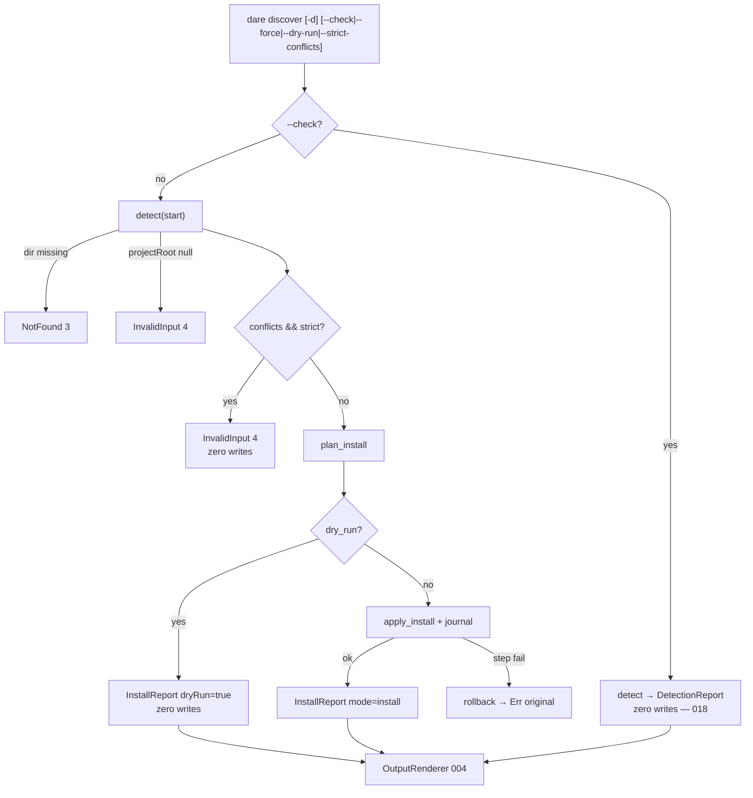

# BLUEPRINT: Discover — instalação do DARE (Microplano 019)

> **Gerado a partir de:** `DARE/DESIGN-019-discover-instalacao-do-dare.md` v1.0  
> **Data:** 2026-07-21 | **Status:** APPROVED  
> **Arquivo:** `DARE/BLUEPRINT-019-discover-instalacao-do-dare.md`  
> **Não substitui:** `DARE/BLUEPRINT.md` nem Blueprints 001–018  
> **Pré-requisitos:** Microplanos **011–014** e **018** concluídos (+ **005/007/008/009/010/004**)  
> **Nota:** remove o stub Internal de `dare discover` sem `--check` (018); `--check` permanece zero-write.

---

## 0. TRADE-OFFS (Architect)

Sem `PATTERNS.md` / `patterns-facts.json` — decisões 🟡 a partir do Design 019 (política de conflicts **já congelada**), APIs 005–014/018 e Documento Mestre §3/§19.

| # | Trade-off | Escolha | Justificativa |
|---|-----------|---------|---------------|
| T-01 | Domínio install | **`dare-project::install`** (não na cli) | RF-01; reuso por 020+; cli thin |
| T-02 | Conflicts | **Warn + install** (exit 0); `--strict-conflicts` → InvalidInput=4 | Design RF-06 congelada; alinhado TS |
| T-03 | Harnesses no install | **Sempre os 4** adapters (force flag) | TS `installIdeFiles` / Ciclo 1; RF-15/16; `--ide` = COULD fora MUST |
| T-04 | `ide` em config | Heurística Apêndice E Design **congelada** aqui (§4.6) | RF-09; default `claude-code` |
| T-05 | Config existente | **Preserve** (skip write) se ficheiro existe e `!force` | RF-08 / RS-06; backup se force overwrite |
| T-06 | Templates dest | Copiar embed `templates/*.md` → **`templates/`** no project root | TS; 009 `materialize_to(.dare/assets)` **não** substitui — helper dedicado |
| T-07 | `dare-graph.yml` | Se ausente: YAML mínimo `GraphDocument::default()` (+ `backend: sqlite` em `extra` se contrato permitir); se existe → skip | RF-13; ADR-006 (não migrar store) |
| T-08 | `.gitignore` | Bloco marcado `# BEGIN DARE` … `# END DARE`; merge por set de linhas | RF-14 / R-06 |
| T-09 | Rollback | **Journal de sessão**: restore backups + delete created files; rmdir dirs vazios criados | RF-19 / R-01 |
| T-10 | Step `ensure_capability_discover` | **Verify** paths matrix; se faltarem após install_*, **re-run** install do harness afetado ou write via render capability — prefer verify-only se 011–014 já cobrem matrix | RF-17 |
| T-11 | Exit codes | Mapa **004** (Design Apêndice D) | Continuidade DEC-019; stub 018 → install = classe B |
| T-12 | `--dry-run` / `--force` | Incluir no MUST de superfície CLI deste Blueprint (Design SHOULD → **implementar** no alpha) | UX Ciclo 1; baixo custo |
| T-13 | Schema `InstallReport` | **`schemaVersion: 1`** camelCase congelado (§4) | RF-21/23; bump + ADR |
| T-14 | Container Fase 1 | Reusar `Dockerfile.rust` + `docker-compose.ci.yml` | Sem imagem nova |
| T-15 | Docs | `cli-discover-install.md` + **DEC-020** | RF-25 |
| T-16 | Cap leitura merge | `INSTALL_READ_CAP = 262_144` (igual 018) | RS-08 |
| T-17 | Project root null | `CoreError::invalid_input` (não NotFound de dir) se start existe mas sem markers | RF-05; dir missing continua NotFound=3 |

### 0.1 Exit codes (congelados — 004)

| Code | `ErrorKind` | Uso |
|------|-------------|-----|
| 0 | — | `--check` Ok **ou** install Ok (mesmo com warnings/conflicts) |
| 1 | Internal | panic path / rollback incompleto grave |
| 2 | Usage | clap |
| 3 | NotFound | `--dir` missing / not a directory |
| 4 | InvalidInput | path safety; root não resolvido; `--strict-conflicts` com conflicts |
| 5 | Io | I/O write/read inesperado |

### 0.2 GAP ANALYSIS (código → MUST)

| Item | Estado | Ação |
|------|--------|------|
| `detect` / `--check` | ✅ 018 | Preservar smokes |
| Stub sem `--check` | 🔴 exit 1 | Remover; ligar `install` |
| `install.rs` / plan/apply/journal | 🔴 | Implementar §5 |
| Harness install/validate | ✅ | Reusar |
| Copy templates → `templates/` | 🔴 | Helper novo (não só `.dare/assets`) |
| gitignore merge | 🔴 | Implementar |
| rollback journal | 🔴 | Implementar |
| Docs DEC-020 | 🔴 | Criar |
| Compose | ✅ | Verificar |

---

## 1. VISÃO GERAL DA ARQUITETURA

`dare discover` sem `--check`: `detect` → política conflicts → `plan_install` → (`dry_run`? report only : `apply_install` com journal/rollback) → `InstallReport` → human/JSON.



**Decisões arquiteturais:**

| Decisão | Escolha | Justificativa |
|---------|---------|---------------|
| Orquestração em `dare-project` | `install()` | Testável sem binário |
| Journal explícito | created + backed_up | Rollback determinístico |
| Preserve unmanaged | `force=false` default nos adapters | RS-06 / 011–014 |
| Warn ≠ fail | conflicts no report | RF-06 |

---

## 2. STACK TÉCNICA DEFINIDA

| Camada | Tecnologia | Versão | Papel |
|--------|-----------|--------|-------|
| Rust | rustc/cargo | **1.85.0** | Build |
| Domínio | `dare-project` | `0.1.0-alpha.0` | detect + install |
| CLI | `dare-cli` + clap **4.5.40** | workspace | Superfície |
| Core | `dare-core` path/fs/backup/atomic | workspace | Jail + rollback FS |
| Config | `dare-config` + `dare-contracts::DareConfig` | workspace | default/save |
| Assets | `dare-assets` EmbeddedAssets | workspace | templates |
| Graph | `dare-contracts::GraphDocument` | workspace | dare-graph.yml |
| Harness | `dare-harness` | workspace | install/validate ×4 |
| Serde | serde / serde_json / yaml_serde | workspace | reports |
| Saída | OutputRenderer 004 | DEC-005 | `--json` |
| Testes | tempfile + assert_cmd | workspace | unit + smoke |
| Container | `Dockerfile.rust` + `docker-compose.ci.yml` | 003 | Fase 1 |

**Deps `dare-project` (MUST):** `dare-core`, `dare-harness`, `dare-assets`, `dare-config`, `dare-contracts`, serde, serde_json. **NÃO** `dare-cli`.

---

## 3. ESTRUTURA DE PASTAS E ARQUIVOS

```text
dare-cli/
├── crates/dare-project/
│   ├── Cargo.toml                    # + dare-assets, dare-config, dare-contracts
│   └── src/
│       ├── lib.rs                    # re-export install::*
│       ├── install.rs                # types + plan + apply + journal + install()
│       ├── gitignore.rs              # merge_gitignore (ou submodule em install)
│       └── templates_install.rs      # copy embed → templates/ (opcional split)
├── crates/dare-cli/src/
│   ├── commands/discover.rs          # check vs install wiring
│   └── main.rs                       # flags force/dry_run/strict_conflicts
├── crates/dare-cli/tests/cli_smoke.rs
├── tests/fixtures/…                  # reutilizar 018
├── docs/compatibility/cli-discover-install.md
├── docs/DECISION-LOG.md              # DEC-020
├── docker-compose.ci.yml
└── DARE/
    ├── DESIGN-019-discover-instalacao-do-dare.md
    └── BLUEPRINT-019-discover-instalacao-do-dare.md
```

> **Constraint:** NÃO `[build] target` global no `.cargo/config.toml`.

---

## 4. MODELO DE DADOS

### 4.1 Constantes

```rust
pub const INSTALL_SCHEMA_VERSION: u32 = 1;
pub const INSTALL_READ_CAP: usize = 262_144;
pub const GITIGNORE_BEGIN: &str = "# BEGIN DARE";
pub const GITIGNORE_END: &str = "# END DARE";
/// Lines inside DARE block (POSIX, no trailing slash variants beyond listed):
pub const GITIGNORE_LINES: &[&str] = &[".dare/", ".dare/backups/"];
pub const DARE_README_REL: &str = "DARE/README.md";
pub const GRAPH_REL: &str = "dare-graph.yml";
pub const CONFIG_REL: &str = "dare.config.json";
```

### 4.2 `InstallOptions`

| Campo | Tipo | Default | Semântica |
|-------|------|---------|-----------|
| `force` | `bool` | `false` | Passa aos adapters; permite overwrite config/templates managed |
| `dry_run` | `bool` | `false` | Sem writes |
| `strict_conflicts` | `bool` | `false` | Abort se `report.conflicts` não vazio |

### 4.3 `InstallStepId` (ordem canónica — enum ou `&'static str`)

Ordem fixa (RF-07):

1. `ensure_dirs`
2. `write_config`
3. `materialize_templates`
4. `write_graph`
5. `merge_gitignore`
6. `install_harness_claude`
7. `install_harness_cursor`
8. `install_harness_codex`
9. `install_harness_antigravity`
10. `ensure_capability_discover`
11. `validate_harnesses`

### 4.4 `InstallPlan`

| Campo | Tipo | Notas |
|-------|------|-------|
| `schema_version` | `u32` | = 1 (plan interno; não precisa JSON público) |
| `project_root` | `PathBuf` | absoluto |
| `ide` | `String` | valor a escrever se create config |
| `steps` | `Vec<InstallStepId>` | sempre a lista completa 1..11 no MUST |
| `warnings` | `Vec<String>` | pré-computadas (ex. conflict warning) |
| `conflicts` | `Vec<StackConflict>` | cópia do detect |

### 4.5 `InstallReport` (schema 1 — **congelado**, JSON público)

| Campo JSON | Tipo Rust | Semântica |
|------------|-----------|-----------|
| `schemaVersion` | `u32` | sempre `1` |
| `mode` | `String` | `"install"` |
| `projectRoot` | `String` | display path |
| `steps` | `Vec<StepResult>` | um por step id, ordem canónica |
| `created` | `Vec<String>` | rel POSIX sorted |
| `updated` | `Vec<String>` | sorted |
| `skipped` | `Vec<String>` | sorted |
| `backedUp` | `Vec<String>` | paths de backup rel **ou** dest — MUST: paths de **backup** relativos POSIX sorted |
| `harnessesValidated` | `Vec<String>` | ids sorted; vazio se dry-run/falha antes |
| `conflicts` | `Vec<StackConflict>` | espelho detect |
| `warnings` | `Vec<String>` | en-US sorted |
| `dryRun` | `bool` | |

`StepResult`: `{ "id": string, "status": "created"|"updated"|"skipped"|"failed"|"rolled_back", "paths": string[] }`

### 4.6 Heurística `ide` (congelada)

| Condição (harnesses `present`) | `ide` |
|--------------------------------|-------|
| só `claude` | `claude-code` |
| só `cursor` | `cursor` |
| só `codex` | `codex` |
| só `antigravity` | `antigravity` |
| `cursor` ∧ `antigravity` (e não claude) | `hybrid` |
| `claude` ∧ `cursor` | `claude-hybrid` |
| nenhum / outros ambíguos | `claude-code` |

Avaliar na ordem: híbridos específicos antes do default; se ≥3 present → `claude-code`.

### 4.7 `SessionJournal` (interno, não JSON)

```text
created_files: Vec<SafeRelativePath>
created_dirs: Vec<SafeRelativePath>   // ordem reverse no rollback
backups: Vec<(dest: SafeRelativePath, bak: SafeRelativePath)>
```

---

## 5. CONTRATOS DE API (ANTI-STUB)

### 5.1 `select_ide`

```rust
pub fn select_ide(report: &DetectionReport) -> String
```

**Pré:** report com 4 harnesses. **Pós:** string ∈ {`claude-code`,`cursor`,`codex`,`antigravity`,`hybrid`,`claude-hybrid`}. **Erros:** nenhum.

### 5.2 `plan_install`

```rust
pub fn plan_install(report: &DetectionReport, opts: &InstallOptions) -> CoreResult<InstallPlan>
```

**Pré:**
- `report.project_root` is `Some` e path existe como dir; senão `Err(invalid_input("project root not resolved; run from a project or use --check"))`.

**Algoritmo:**
1. Se `opts.strict_conflicts && !report.conflicts.is_empty()` → `Err(invalid_input("stack conflicts present; re-run without --strict-conflicts or resolve manifests"))`.
2. `ide = select_ide(report)`.
3. `warnings`: se conflicts não vazio, push `"stack conflicts detected: <kinds joined>; install continues"`.
4. `steps` = lista canónica 1..11.
5. Return `InstallPlan { … }`.

**Pós:** plan determinístico. **Side effects:** nenhum.

### 5.3 `apply_install`

```rust
pub fn apply_install(
    root: &ProjectRoot,
    plan: &InstallPlan,
    opts: &InstallOptions,
) -> CoreResult<InstallReport>
```

**Pré:** `root` aponta para `plan.project_root` (mesmo path canónico).  
**Se `opts.dry_run`:** montar report com todos steps `skipped`, `dryRun=true`, arrays vazias de created/updated (ou skipped paths previstos), **zero** FS mutations; return Ok.

**Algoritmo (não dry-run):**
1. `journal = SessionJournal::default()`; `report` accumulator.
2. Para cada step em ordem, `run_step(...)` (§5.4). Em `Err(e)`: `rollback(&journal)?` (erros de rollback → prefer wrap Internal com cause); return `Err(e)`.
3. Preencher `InstallReport` schema 1; sort arrays; return Ok.

**Concorrência:** single-threaded; sem lockfile global neste microplano (SHOULD futuro).

### 5.4 Steps (comportamento executável)

#### `ensure_dirs`
- Ensure dirs: `DARE/`, `DARE/EXECUTION/`, `.dare/` via `std::fs::create_dir_all` sob jail (`SafeRelativePath`).
- Se dir criado nesta sessão → journal `created_dirs`.
- Step status: `created` se algum novo; else `skipped`.
- **Não** apagar conteúdo existente.

#### `write_config`
- Rel `dare.config.json`.
- Se existe && !force → status `skipped`; paths `[dare.config.json]`.
- Se existe && force → `backup(root, rel)` → journal; write `DareConfig { ide: Some(plan.ide), ..Default }` **mas** se load ok, preserve `extra` e blocos existentes, só set `ide` se None ou force.
- Se ausente → `DareConfig { ide: Some(plan.ide.clone()), ..Default }` via `save_dare_config`; journal created.
- Cap: leitura ≤ `INSTALL_READ_CAP`.

#### `materialize_templates`
- Destinos (MUST):  
  `templates/DESIGN-template.md`, `BLUEPRINT-template.md`, `TASKS-template.md`, `TASK-SPEC-template.md`, `TELEMETRY-template.md`, `HOOKS-ADAPTER.md`  
  (nomes = `assets/manifest.yml` paths sob `templates/`).
- Fonte: `EmbeddedAssets::get("templates/…")` após `verify_embedded_assets` opcional (fail → Config/Internal).
- Se dest existe && !force → skip file; se force → backup + overwrite.
- Se dest ausente → atomic_write; journal created.
- Step status agregado: `created` se ≥1 created; `updated` se ≥1 updated e 0 created; else `skipped`.

#### `write_graph`
- Rel `dare-graph.yml`.
- Se existe → skip (mesmo com force **não** reescrever graph custom no MUST — force só templates/config/harness; documentar).
- Se ausente → `GraphDocument::default()` serializado YAML; opcionalmente `extra.insert("backend", json!("sqlite"))` se flatten permitir; `save_graph`; journal created.

#### `merge_gitignore`
- Rel `.gitignore`.
- Ler ≤ cap; se missing, start empty.
- Se bloco BEGIN/END já presente com **todas** as `GITIGNORE_LINES` → skip.
- Senão: se bloco existe, fazer union das linhas internas; senão append `\n# BEGIN DARE\n.dare/\n.dare/backups/\n# END DARE\n`.
- Se ficheiro existia → backup antes write; journal.
- Idempotência: segunda run skip.

#### `install_harness_*`
- Claude: `generate_claude_md` + `install_commands` + `write_settings_json` (force=opts.force) — espelhar CLI harness install.
- Cursor: `generate_cursorrules` + `install_cursor_commands`.
- Codex: `generate_agents_md` + `install_codex_skills`.
- Antigravity: `generate_antigravityrules` + `install_antigravity` (+ `ensure_workflows_dir` se API existir).
- Status: `updated` se count>0 ou files touched; adapters já preservam unmanaged.
- Em erro → propagate (trigger rollback).

#### `ensure_capability_discover`
- Assert existência (via `ProjectRoot::resolve`):  
  `.claude/commands/dare-discover.md`,  
  `.cursor/commands/dare-discover.md`,  
  `.codex/skills/dare-discover/SKILL.md`,  
  `.antigravity/commands/dare-discover.md`  
  (paths da matrix 010).
- Se todos present → `skipped`.
- Se algum missing → chamar de novo o `install_*` do harness correspondente **ou** escrever conteúdo mínimo via `dare_assets` render se disponível; se ainda missing → `Err(internal/config("dare-discover capability missing after install"))`.

#### `validate_harnesses`
- `validate_install`, `validate_cursor_install`, `validate_codex_install`, `validate_antigravity_install`.
- Em qualquer Err → propagate.
- `harnessesValidated` = `["antigravity","claude","codex","cursor"]`.

### 5.5 `rollback`

```rust
fn rollback(root: &ProjectRoot, journal: &SessionJournal) -> CoreResult<()>
```

**Ordem:**
1. Para cada `(dest, bak)` em `backups` (reverse): `restore(root, bak, dest)`.
2. Para cada file em `created_files` (reverse): `std::fs::remove_file` se exists (ignore NotFound).
3. Para cada dir em `created_dirs` (reverse): `remove_dir` se empty (ignore errors se non-empty — leave + tracing warn).

**Pós:** best-effort; se restore falhar → `Err(internal(...))`.

### 5.6 `install` (orquestrador)

```rust
pub fn install(start: &Path, opts: &InstallOptions) -> CoreResult<InstallReport>
```

1. Se !start.exists() || !start.is_dir() → `not_found`.
2. `report = detect(start)?`.
3. `plan = plan_install(&report, opts)?` (pode Err strict conflicts **antes** de ProjectRoot write).
4. `pr = report.project_root` unwrap path; `ProjectRoot::new(&pr)?`.
5. `apply_install(&root, &plan, opts)`.

### 5.7 Formatação

```rust
pub fn format_install_human(r: &InstallReport) -> String
pub fn install_report_to_json(r: &InstallReport) -> Value
```

**Human MUST incluir:** schemaVersion, mode, projectRoot, warnings (se algum), conflicts summary, counts created/updated/skipped, harnessesValidated, linha final exata: `mode: install`.

**JSON:** `serde_json::to_value` camelCase; `schemaVersion==1`.

### 5.8 CLI wiring

```rust
Discover {
    #[arg(long, short = 'd')]
    dir: Option<PathBuf>,
    #[arg(long)]
    check: bool,
    #[arg(long)]
    force: bool,
    #[arg(long)]
    dry_run: bool,
    #[arg(long)]
    strict_conflicts: bool,
}
```

| Branch | Comportamento |
|--------|----------------|
| `check` | `detect` → format_human/report_to_json DetectionReport (018) — **ignorar** force/dry_run/strict para mutações (strict N/A) |
| `!check` | `InstallOptions { force, dry_run, strict_conflicts }` → `install` → format_install_* |

**Remover** stub `CoreError::internal("…019")`.

Help about: brownfield detect+install; `--check` = no install.

### 5.9 Exemplos

**Warning + install OK (conflicts):** human contém `stack conflicts detected`; JSON `warnings.len()>=1`, `conflicts.len()>=1`, exit 0.

**`--strict-conflicts`:** exit 4; tree unchanged (assert listing).

**Idempotência:** segunda `discover` → created vazio ou só skipped; gitignore sem linhas duplicadas fora do bloco.

**Rollback:** injetar falha após `write_config` (test hook `#[cfg(test)]` failpoint **ou** tempdir read-only no step harness) → config restaurado/removido conforme journal.

### 5.10 Testes unitários obrigatórios (`dare-project`)

| Teste | Assert |
|-------|--------|
| `select_ide_defaults_claude_code` | none present → `claude-code` |
| `select_ide_hybrid` | cursor+antigravity → `hybrid` |
| `plan_strict_conflicts_errors` | Err InvalidInput |
| `plan_conflicts_warns` | warnings non-empty; Ok |
| `apply_dry_run_zero_writes` | listing equal |
| `apply_creates_config_dare_gitignore` | paths exist |
| `apply_idempotent_second_run` | no dup gitignore lines |
| `merge_gitignore_block_stable` | double merge identical |
| `templates_copied_under_templates_dir` | 6 files |
| `graph_created_once` | second skip |
| `rollback_restores_forced_config` | content restored |
| `install_report_schema_version_1` | JSON |
| `ensure_dirs_preserves_existing_execution_files` | pre-existing file kept |

### 5.11 Smoke CLI obrigatórios (`dare-cli`)

| Teste | Comando | Assert |
|-------|---------|--------|
| `discover_install_node_fixture` | `discover -d <node-fixture>` | exit 0; `dare.config.json` + `DARE/README.md`; human `mode: install` |
| `discover_install_idempotent` | ×2 | exit 0 ambas |
| `discover_check_still_read_only` | `--check` | listing equal; ainda contém zero mutations |
| `discover_strict_conflicts_exits_4` | tempdir com package.json+Cargo.toml + `--strict-conflicts` | code 4; no dare.config.json |
| `discover_dry_run_no_writes` | `--dry-run` | code 0; no config file |
| `discover_install_json_schema` | `--json` | `data.schemaVersion==1`, `mode==install` |

### 5.12 Docs `cli-discover-install.md`

Secções MUST: flags; conflicts policy table; exit codes; InstallReport schema; steps; preserve/force; rollback; diff vs TS + stub 018; Local verify compose; DEC-020.

---

## 6. PLANO DE EXECUÇÃO (FASES)

### Fase 1: Containerização ← **SEMPRE PRIMEIRA**

- **DONE:** `docker compose -f docker-compose.ci.yml config` exit 0 **ou** waiver em `cli-discover-install.md`.  
- **Entregáveis:** nota Local verify.

### Fase 2: Tipos + plan + ide + conflicts policy

- **DONE:** `InstallOptions`/`InstallPlan`/`InstallReport`; `select_ide`; `plan_install` testes §5.10 plan_*; schema JSON 1.  
- **Entregáveis:** structs em `install.rs`; deps Cargo.toml.

### Fase 3: apply steps FS (dirs, config, templates, graph, gitignore) + journal/rollback

- **DONE:** testes apply_* / merge_* / rollback_* / templates_* / graph_*; dry_run zero writes.  
- **Entregáveis:** step runners + `gitignore` helper + templates copy.

### Fase 4: Harnesses + ensure_capability + validate + `install()` orquestrador

- **DONE:** install 4 harnesses + validate; capability paths; orquestrador `install()`.  
- **Entregáveis:** steps 6–11.

### Fase 5: CLI wiring + smokes

- **DONE:** stub removido; flags; smokes §5.11; `--check` regressão ok.  
- **Entregáveis:** `discover.rs`, `main.rs`, `cli_smoke.rs`.

### Fase 6: Docs DEC-020

- **DONE:** `cli-discover-install.md` + DEC-020.  
- **Entregáveis:** docs.

### Fase 7: Auditoria ← **N-1**

- **DONE:** `cargo fmt --check`; `clippy -D warnings`; `test --workspace`; `audit`; `deny` = 0.

### Fase 8: Fechamento ← **N**

- **DONE:** TASKS 019 100%; próximo → **020-validate**.

---

## 7. VALIDATION GATES POR STACK

| Stack | Build | Test | Lint / Audit |
|-------|-------|------|--------------|
| Rust | `cargo build -p dare-project -p dare-cli` | `cargo test -p dare-project` + `cargo test -p dare-cli --test cli_smoke -- discover` | `cargo fmt --check` · `clippy --workspace --all-features -- -D warnings` · `cargo audit` · `cargo deny` |

Ralph Loop obrigatório antes de DONE.

---

## 8. CONTROLES DE SEGURANÇA (RS → fases)

| RS | Fase | Verificação |
|----|------|-------------|
| RS-01 | 2–5 | ProjectRoot; InvalidInput root null; NotFound dir |
| RS-02 | 3–5 | sem dump secrets; redact errors |
| RS-03 | 3–5 | só writes sob jail |
| RS-04 | 7 | audit + deny |
| RS-05 | — | sem novos processos shell (harness in-process) |
| RS-06 | 3–4 | force=false preserve; testes unmanaged se já existirem nos harness |
| RS-07 | 3 | backup + rollback test |
| RS-08 | 3 | INSTALL_READ_CAP em gitignore/config read |
| RS-09 | 5 | smoke `--check` read-only |

---

## 9. ESTRATÉGIA DE TESTES

| Tipo | Como |
|------|------|
| Unit | §5.10 |
| Integração FS | tempdir + fixtures 018 |
| Smoke CLI | §5.11 |
| Segurança | dry-run / strict / check regressão / rollback |
| Determinismo | sort arrays; step order |
| Cross-platform | CI 003; paths SafeRelativePath |

---

## 10. ESTRATÉGIA DE DEPLOY

| Ambiente | Trigger | Artefacto |
|----------|---------|-----------|
| Local | dev | `cargo run -p dare-cli -- discover -d <proj>` |
| CI | PR/main | smokes discover* |
| Alpha | pipeline 015 | binário com install |

Sem pipeline novo.

---

## 11. CHECKLIST DE APROVAÇÃO DO BLUEPRINT

- [x] Trade-offs T-01…T-17 (esp. **conflicts warn**, templates dest, rollback journal)
- [x] Schema InstallReport §4.5 congelado
- [x] Contratos §5 anti-stub (steps, erros, CLI flags)
- [x] Heurística `ide` §4.6 aceite
- [x] Fases 1→8 com DONE verificáveis
- [x] RS mapeados
- [x] Separação `--check` / install aceite
- [x] Pronto para `/dare-tasks` → `TASKS-019` + `dare-dag-019.yaml` + `EXECUTION-019/`

---

## 12. PRÓXIMAS ETAPAS

1. Revisar e aprovar este Blueprint.  
2. `/dare-tasks` sobre `DARE/BLUEPRINT-019-discover-instalacao-do-dare.md`.  
3. Executar DAG `mp019-*`.  
4. Após closeout → [`020-validate.md`](../DARE-RUST-MICRO-PLANOS/DARE-RUST-MICRO-PLANOS/020-validate.md).
