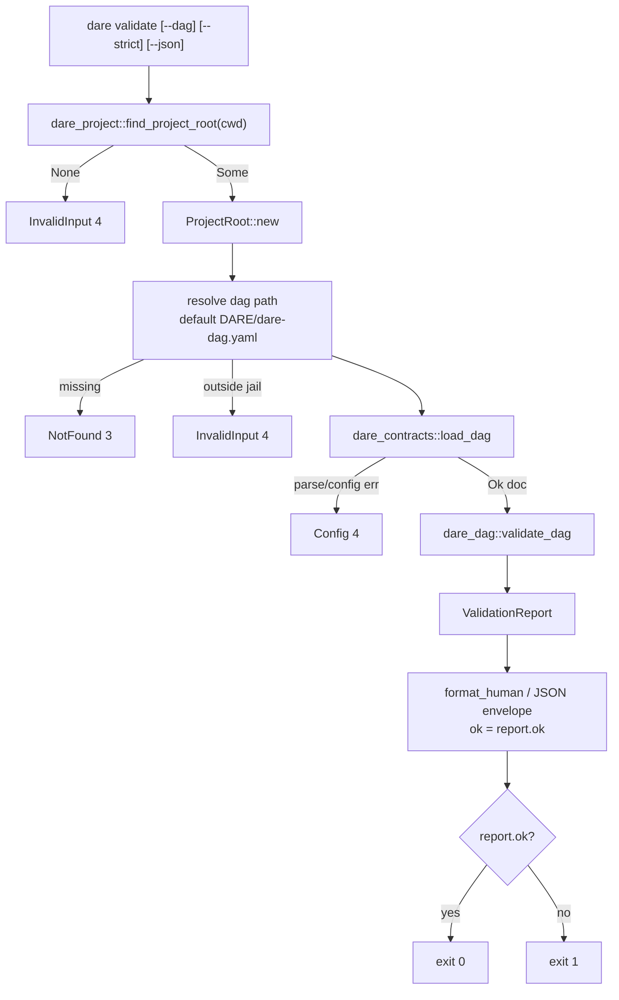

# BLUEPRINT: Validate — validação do DAG (Microplano 020)

> **Gerado a partir de:** `DARE/DESIGN-020-validate.md` v1.0  
> **Data:** 2026-07-21 | **Status:** APPROVED  
> **Arquivo:** `DARE/BLUEPRINT-020-validate.md`  
> **Não substitui:** `DARE/BLUEPRINT.md` nem Blueprints 001–019  
> **Pré-requisitos:** Microplanos **004, 007, 008** (+ path safety **005**; root walk disponível em **018** `dare-project`)  
> **Nota:** validação **read-only**; não executa tasks; não chama `save_dag`.

---

## 0. TRADE-OFFS (Architect)

Sem `PATTERNS.md` / `patterns-facts.json` — decisões 🟡 a partir do Design 020, APIs 004/005/007 e Documento Mestre §20. Conclusões abaixo **congelam** as lacunas do Design.

| # | Trade-off | Escolha | Justificativa |
|---|-----------|---------|---------------|
| T-01 | Domínio | Nova crate **`dare-dag`** (não lógica só em contracts/cli) | Microplano path; RF-01; parse permanece em `dare-contracts` |
| T-02 | Project root | Walk-up via **`dare_project::find_project_root(cwd)`** na CLI; domínio recebe `ProjectRoot` | Mesmos markers 018; `dare-dag` **não** depende de `dare-project` |
| T-03 | Root ausente | `CoreError::invalid_input("project root not found")` → exit **4** | Alinhado discover install (T-17/019); não NotFound de dir |
| T-04 | Default DAG | Relativo fixo `DARE/dare-dag.yaml` sob o root | RF-02; contrato de disco do microplano |
| T-05 | `--dag` relativo | `SafeRelativePath` sob `ProjectRoot` | RS-01 / 005 |
| T-06 | `--dag` absoluto | Canonicalize; deve estar **dentro** do root; converter a rel jail | Fora do root → InvalidInput 4 |
| T-07 | Complexity | Case-sensitive ∈ {`LOW`,`MED`,`HIGH`} → senão error `invalid_complexity` | Fixtures 007; RF-12 |
| T-08 | `ok` + `--strict` | Domínio calcula `report.ok = error_count==0 && (!strict \|\| warning_count==0)`; espelha `strict` no report | RF-04/16; um único sítio de verdade |
| T-09 | JSON em falha de regras | Imprimir **ValidationReport** (stdout); envelope JSON top-level `ok` = `report.ok`; **exit 1** se `!report.ok` | Preserva `data.issues`; classe B vs `write_error` (DEC-021) |
| T-10 | Parse YAML inválido | `CoreError::config` via `load_dag`/`parse_dag_yaml` → **exit 4** (`write_error`); **sem** ValidationReport | Já é contrato 007 |
| T-11 | Ficheiro ausente | `CoreError::not_found` → exit **3** | Apêndice D Design |
| T-12 | `spec_file` resolve | Base = `{project_root}/DARE/` + `spec_file` (POSIX join); existência = `Path::is_file()` | Fixtures `EXECUTION/task-*.md`; RF-14 |
| T-13 | Legacy RF-14 | **Não** aplicar `missing_prompt_or_spec` / `missing_spec_file` a `LegacyDag` | Campos inexistentes no schema legado |
| T-14 | Ciclo canónico | Detectar ciclo; **rodar** path para começar no menor id lexico; fechar com repetição do start | R-03; RF-11 |
| T-15 | Mensagens | en-US; **nunca** incluir corpo de `subtask_prompt`; truncar `message` a **200** chars | RS-02 |
| T-16 | Models block | **Fora MUST** (RF-27 COULD) | Escopo alpha |
| T-17 | Container Fase 1 | Reusar `Dockerfile.rust` + `docker-compose.ci.yml` | Sem imagem nova |
| T-18 | Docs | `cli-validate.md` + **DEC-021** | RF-25 |
| T-19 | Capacidade | Não bloquear closeout se matrix já tem `dare-validate`; smoke CLI basta | RF-26 SHOULD |
| T-20 | Exit 1 vs Internal | Exit **1** em falha de regras **não** usa `ErrorKind::Internal`; só process code + report | Evita confundir panic path com DAG inválido |

### 0.1 Exit codes (congelados)

| Code | Quando | Canal |
|------|--------|-------|
| 0 | `report.ok == true` | human/JSON report |
| 1 | `report.ok == false` (errors e/ou warnings sob `--strict`) | human/JSON **report** (não envelope `error`) |
| 2 | clap Usage | `write_error` |
| 3 | DAG path NotFound | `write_error` |
| 4 | InvalidInput (root/path jail) **ou** Config (YAML parse) | `write_error` |
| 5 | Io ao ler | `write_error` |

### 0.2 GAP ANALYSIS (código → MUST)

| Item | Estado | Ação |
|------|--------|------|
| `parse_dag_yaml` / `load_dag` | ✅ 007 | Reusar |
| Fixtures v21 / legacy contracts | ✅ | Reusar + fixtures inválidas novas |
| Crate `dare-dag` | 🔴 | Criar workspace member |
| Regras / ciclos / report | 🔴 | `validate.rs` |
| `Commands::Validate` | 🔴 | CLI wiring |
| Docs `cli-validate.md` / DEC-021 | 🔴 | Criar |
| Compose | ✅ | Verificar Fase 1 |

---

## 1. VISÃO GERAL DA ARQUITETURA

`dare validate`: resolver root → resolver path do DAG → `load_dag` → `validate_dag` → emitir report → exit derivado de `report.ok`.



**Decisões arquiteturais:**

| Decisão | Escolha | Justificativa |
|---------|---------|---------------|
| Separação crates | parse@contracts · validate@dare-dag · thin cli | RF-01; evita ciclo cli↔domain |
| Strict no domínio | `ok` inclui strict | Um assert nos testes unitários |
| Zero writes | só `read_limited` / `is_file` | RF-21 / RS-03 |
| Determinismo | sort estável de issues + ciclo canónico | RNF-01 / O-08 |

---

## 2. STACK TÉCNICA DEFINIDA

| Camada | Tecnologia | Versão | Papel |
|--------|-----------|--------|-------|
| Rust | rustc/cargo | **1.85.0** | Build |
| Domínio | `dare-dag` | `0.1.0-alpha.0` | validate + report |
| Parse | `dare-contracts` | workspace | `load_dag` / `DagDocument` |
| Root walk | `dare-project` | workspace | **só na CLI** |
| Core | `dare-core` | workspace | ProjectRoot, SafeRelativePath, erros |
| CLI | `dare-cli` + clap **4.5.40** | workspace | Superfície |
| Serde | serde / serde_json | workspace | ValidationReport camelCase |
| YAML | yaml_serde **0.10.4** | via contracts | — |
| Saída | OutputRenderer 004 + helper validate | DEC-005 / T-09 | |
| Testes | tempfile + assert_cmd | workspace | unit + smoke |
| Container | `Dockerfile.rust` + `docker-compose.ci.yml` | 003 | Fase 1 |

**Deps `dare-dag` (MUST):** `dare-core`, `dare-contracts`, `serde`, `serde_json`. **NÃO:** `dare-cli`, `dare-project`, `dare-harness`, `dare-assets`.

**Deps CLI (delta):** `dare-dag = { workspace = true }`.

---

## 3. ESTRUTURA DE PASTAS E ARQUIVOS

```text
dare-cli/
├── Cargo.toml                              # + member dare-dag; workspace.dep
├── crates/dare-dag/
│   ├── Cargo.toml
│   └── src/
│       ├── lib.rs                          # re-exports
│       ├── report.rs                       # ValidationReport / Issue types
│       ├── validate.rs                     # regras + ciclo + sort
│       └── format.rs                       # format_human + report_to_json
├── crates/dare-cli/
│   ├── Cargo.toml                          # + dare-dag
│   └── src/
│       ├── main.rs                         # Commands::Validate
│       ├── commands/mod.rs
│       └── commands/validate.rs            # resolve root/path + exit
├── crates/dare-cli/tests/cli_smoke.rs      # smokes validate*
├── tests/fixtures/dag/
│   ├── valid.v21.yaml
│   ├── valid.legacy.yaml
│   ├── cycle.v21.yaml
│   ├── missing-dep.v21.yaml
│   ├── bad-id.v21.yaml
│   ├── empty-prompt.v21.yaml
│   └── warning-missing-spec.v21.yaml       # spec_file aponta ficheiro ausente
├── docs/compatibility/cli-validate.md
├── docs/DECISION-LOG.md                    # DEC-021
├── docker-compose.ci.yml
└── DARE/
    ├── DESIGN-020-validate.md
    └── BLUEPRINT-020-validate.md
```

> **Constraint:** NÃO `[build] target` global no `.cargo/config.toml`.

---

## 4. MODELO DE DADOS

### 4.1 Constantes

```rust
pub const VALIDATION_SCHEMA_VERSION: u32 = 1;
pub const DEFAULT_DAG_REL: &str = "DARE/dare-dag.yaml";
pub const ID_KEBAB: &str = r"^[a-z0-9]+(-[a-z0-9]+)*$"; // usar regex crate OU match manual sem regex dep — preferir match manual / once_cell-free
pub const MSG_MAX: usize = 200;
pub const COMPLEXITY_ALLOWED: &[&str] = &["LOW", "MED", "HIGH"];
```

> **Anti-stub:** se o workspace **não** tiver `regex`, implementar kebab check com scan ASCII (sem nova dep) — MUST.

### 4.2 `ValidateOptions`

| Campo | Tipo | Default | Semântica |
|-------|------|---------|-----------|
| `strict` | `bool` | `false` | Entra no cálculo de `ok` |

### 4.3 `IssueSeverity`

```rust
#[derive(Debug, Clone, Copy, PartialEq, Eq, PartialOrd, Ord, Serialize, Deserialize)]
#[serde(rename_all = "camelCase")]
pub enum IssueSeverity {
    Error,   // sort key 0 (errors first — ver §4.6)
    Warning,
}
```

JSON: `"error"` \| `"warning"` (`rename_all = "lowercase"` na severity).

### 4.4 `ValidationIssue`

| Campo JSON | Tipo Rust | Obrigatório | Semântica |
|------------|-----------|-------------|-----------|
| `severity` | `IssueSeverity` | sim | error \| warning |
| `code` | `String` | sim | códigos §4.7 |
| `taskId` | `String` | sim | `""` se issue global |
| `message` | `String` | sim | en-US, ≤200 chars, sem prompt body |
| `path` | `Option<Vec<String>>` | não | só `cycle` (e opcional chains futuras) |

### 4.5 `ValidationReport` (schema 1 — **congelado**)

| Campo JSON | Tipo Rust | Semântica |
|------------|-----------|-----------|
| `schemaVersion` | `u32` | sempre `1` |
| `mode` | `String` | sempre `"validate"` |
| `ok` | `bool` | T-08 |
| `dagPath` | `String` | display POSIX-ish (`\` → `/`) relativo ao root quando possível |
| `format` | `String` | `"v2.1"` \| `"legacy"` |
| `taskCount` | `u32` | nº de tasks |
| `errorCount` | `u32` | issues severity=error |
| `warningCount` | `u32` | issues severity=warning |
| `strict` | `bool` | eco de options |
| `issues` | `Vec<ValidationIssue>` | sorted §4.6 |

Bump de campos → ADR + `schemaVersion`++.

### 4.6 Ordenação estável (RF-18)

Sort lexicográfico de tupla:

1. `severity`: `Error` antes de `Warning`
2. `code` asc (byte/Unicode)
3. `taskId` asc
4. `message` asc

### 4.7 Códigos de issue (congelados)

| code | severity | Quando |
|------|----------|--------|
| `invalid_id` | error | id não kebab-case |
| `duplicate_id` | error | id repetido (V21) |
| `missing_dependency` | error | `depends_on` ref inexistente |
| `self_dependency` | error | depende de si |
| `cycle` | error | ciclo; `path` canónico |
| `empty_title` | error | `title.trim().is_empty()` |
| `invalid_complexity` | error | fora de LOW/MED/HIGH |
| `missing_prompt_or_spec` | error | V21: `subtask_prompt.trim()` e `spec_file.trim()` ambos vazios |
| `missing_spec_file` | warning | V21: `spec_file` non-empty e ficheiro ausente sob `DARE/` |
| `invalid_limits` | warning | V21: qualquer de `parent_context_chars`, `task_output_chars`, `timeout_seconds` == 0 |

`parse_error` **não** aparece no report — vira `CoreError::config` antes.

### 4.8 Vista interna `TaskView` (não pública JSON)

Normalizar V21 + Legacy para:

| Campo | Fonte V21 | Fonte Legacy |
|-------|-----------|--------------|
| `id` | `task.id` | map key |
| `title` | `task.title` | `task.title` |
| `depends_on` | vec | vec |
| `complexity` | string | string |
| `subtask_prompt` | string | `None` / skip RF-14 |
| `spec_file` | string | skip RF-14 |

---

## 5. CONTRATOS DE API (domínio + CLI) — anti-stub

### 5.1 Funções públicas `dare-dag`

```rust
pub fn validate_dag(
    doc: &DagDocument,
    opts: &ValidateOptions,
    ctx: &ValidateFsContext<'_>, // root + dag_path_display
) -> ValidationReport;

pub fn validate_path(
    root: &ProjectRoot,
    rel: &SafeRelativePath,
    opts: &ValidateOptions,
) -> CoreResult<ValidationReport>;
// Pré: rel sob root. Pós Ok: zero writes. Err: NotFound / Config / Io / InvalidInput.

pub fn format_human(report: &ValidationReport) -> String;
pub fn report_to_json(report: &ValidationReport) -> CoreResult<Value>; // serde Value camelCase
pub fn is_kebab_id(id: &str) -> bool;
```

`ValidateFsContext<'a>`:

| Campo | Tipo | Uso |
|-------|------|-----|
| `root` | `&'a ProjectRoot` | resolve spec_file |
| `dag_path_display` | `String` | preenche `dagPath` |

### 5.2 Pré / pós `validate_dag`

**Pré:** `doc` já parseado.

**Pós:**
- `issues` sorted
- counts coerentes com `issues`
- `ok` = T-08
- `taskCount` = nº tasks
- `format` correcto
- **nenhuma** mutação FS

**Erros:** função **não** retorna `Err` — só report (parse já ocorreu).

### 5.3 Algoritmo de validação (ordem de coleta)

1. Materializar `Vec<TaskView>` (+ limits se V21).  
2. Por cada task (ordem de aparição no doc):  
   - `invalid_id`  
   - `empty_title`  
   - `invalid_complexity`  
   - V21: `missing_prompt_or_spec`  
   - V21: `missing_spec_file` (FS)  
3. Pass de unicidade: `duplicate_id` (primeira ocorrência ok; seguintes error).  
4. Pass deps: `missing_dependency`, `self_dependency`.  
5. Pass cycles: um issue `cycle` **por componente cíclico** (ou por ciclo encontrado); path canónico T-14; `taskId` = primeiro id do path.  
6. V21 limits: se algum == 0 → um warning `invalid_limits` com `taskId=""`.  
7. Sort + counts + `ok`.

### 5.4 Ciclo canónico (especificação executável)

1. Grafo dirigido: edge `a → b` se `b ∈ depends_on(a)` (a depende de b → aresta a→b para DFS “seguindo deps”).  
2. DFS 3-cores (white/gray/black); ao reencontrar gray, extrair stack do ciclo.  
3. Seja `cycle_nodes = [n0, n1, …, nk]` com `n0` já repetido no fim **ou** fechar concatenando `n0`.  
4. Encontrar índice do menor id lexico; rotacionar; garantir `path[0] == path[last]`.  
5. Message: `dependency cycle detected: id0 -> id1 -> … -> id0`.

### 5.5 `format_human` (MUST)

Linhas en-US, exemplo ok:

```text
validate: ok
dagPath: DARE/dare-dag.yaml
format: v2.1
taskCount: 3
errorCount: 0
warningCount: 0
strict: false
mode: validate (zero mutations)
```

Exemplo fail:

```text
validate: FAILED
dagPath: DARE/dare-dag.yaml
format: v2.1
taskCount: 2
errorCount: 1
warningCount: 0
strict: false
issues:
  - [error] cycle task-001: dependency cycle detected: task-001 -> task-002 -> task-001
mode: validate (zero mutations)
```

### 5.6 JSON envelope (comando validate)

```json
{
  "correlation_id": "<uuid>",
  "data": { /* ValidationReport */ },
  "ok": false
}
```

Quando `report.ok == true`, top-level `"ok": true`.  
Implementação: helper em `commands/validate.rs` (ou extensão `OutputRenderer::write_report`) — **não** chamar `write_success` se isso forçar `ok:true` com report falho.

### 5.7 CLI `dare validate`

```rust
Validate {
    /// Path to dare-dag.yaml (default: DARE/dare-dag.yaml under project root).
    #[arg(long)]
    dag: Option<PathBuf>,
    /// Treat warnings as failures.
    #[arg(long)]
    strict: bool,
}
```

**Fluxo `run_validate`:**

1. `cwd = env::current_dir()`; `find_project_root(&cwd)` → None ⇒ InvalidInput.  
2. `ProjectRoot::new(root)`.  
3. Resolver `rel`:  
   - `dag == None` → `SafeRelativePath::new(DEFAULT_DAG_REL)`  
   - `dag` relativo → join sob root + SafeRelativePath  
   - `dag` absoluto → deve ter prefixo root; strip → SafeRelativePath  
4. `validate_path(&root, &rel, &ValidateOptions { strict })`  
5. Print human/JSON; `ExitCode::from(if report.ok { 0 } else { 1 })`.

**Edge cases:**

| Input | Resultado |
|-------|-----------|
| Sem markers no walk | exit 4 InvalidInput |
| Default path missing | exit 3 |
| `--dag ../outside.yaml` | exit 4 |
| YAML lixo | exit 4 Config |
| Ciclo | exit 1 + report |
| Só warning, sem `--strict` | exit 0 |
| Só warning, `--strict` | exit 1 |
| Tree listing before/after | idêntico |

### 5.8 Exemplo concreto — report ciclo

```json
{
  "schemaVersion": 1,
  "mode": "validate",
  "ok": false,
  "dagPath": "DARE/dare-dag.yaml",
  "format": "v2.1",
  "taskCount": 2,
  "errorCount": 1,
  "warningCount": 0,
  "strict": false,
  "issues": [
    {
      "severity": "error",
      "code": "cycle",
      "taskId": "task-001",
      "message": "dependency cycle detected: task-001 -> task-002 -> task-001",
      "path": ["task-001", "task-002", "task-001"]
    }
  ]
}
```

### 5.9 Testes unitários obrigatórios (`dare-dag`)

| Teste | Assert |
|-------|--------|
| `valid_v21_ok` | fixture valid → ok, errorCount=0 |
| `valid_legacy_ok` | legacy → format legacy, ok |
| `rejects_bad_id` | `invalid_id` |
| `rejects_duplicate_id` | `duplicate_id` |
| `rejects_missing_dep` | `missing_dependency` |
| `rejects_self_dep` | `self_dependency` |
| `rejects_cycle_canonical_path` | path rotacionado estável |
| `rejects_empty_title` | `empty_title` |
| `rejects_bad_complexity_case` | `low` → `invalid_complexity` |
| `rejects_missing_prompt_and_spec` | V21 ambos vazios |
| `warns_missing_spec_file` | warning; ok true sem strict |
| `strict_fails_on_warning` | same fixture + strict → ok false |
| `warns_zero_limits` | `invalid_limits` |
| `issues_sort_stable` | ordem RF-18 |
| `legacy_skips_prompt_rules` | sem missing_prompt |
| `validate_path_zero_writes` | listing snapshot equal |
| `message_never_contains_long_prompt` | prompt 1k chars não aparece em message |
| `report_schema_version_1` | JSON keys |

### 5.10 Smoke CLI obrigatórios (`dare-cli`)

| Teste | Comando | Assert |
|-------|---------|--------|
| `validate_ok_fixture` | `validate --dag <valid.v21>` com cwd=temp project | exit 0; human `validate: ok` |
| `validate_cycle_exit_1` | cycle fixture | exit 1; human `FAILED` |
| `validate_strict_warning` | missing-spec + `--strict` | exit 1 |
| `validate_warning_without_strict` | missing-spec | exit 0 |
| `validate_missing_dag_not_found` | path inexistente | exit 3 |
| `validate_json_schema` | `--json` ok | `data.schemaVersion==1`, `mode==validate`, envelope ok true |
| `validate_json_failure_has_issues` | `--json` ciclo | envelope `ok:false`; `data.issues` non-empty; exit 1 |
| `validate_zero_writes` | listing before/after | equal |

### 5.11 Docs `cli-validate.md`

Secções MUST: flags; regras tabela; issue codes; exit codes (T-09/T-20); ValidationReport schema; strict; zero writes; resolve `spec_file`; diff vs TS 3.18.1 + classification; Local verify compose; DEC-021.

---

## 6. PLANO DE EXECUÇÃO (FASES)

### Fase 1: Containerização ← **SEMPRE PRIMEIRA**

- **DONE:** `docker compose -f docker-compose.ci.yml config` exit 0 **ou** waiver em `cli-validate.md`.  
- **Entregáveis:** nota Local verify.

### Fase 2: Scaffold crate `dare-dag` + tipos report

- **DONE:** member no workspace; `ValidationReport`/`Issue` serializam camelCase schema 1; testes `report_schema_version_1`.  
- **Entregáveis:** `Cargo.toml`, `lib.rs`, `report.rs`.

### Fase 3: Regras de validação + ciclo + fixtures

- **DONE:** todos os testes §5.9 excepto CLI; fixtures sob `tests/fixtures/dag/`.  
- **Entregáveis:** `validate.rs`, `format.rs`, fixtures.

### Fase 4: CLI wiring + smokes

- **DONE:** `Commands::Validate`; smokes §5.10; root walk + path jail.  
- **Entregáveis:** `commands/validate.rs`, `main.rs`, `cli_smoke.rs`.

### Fase 5: Docs DEC-021

- **DONE:** `cli-validate.md` + DEC-021 no DECISION-LOG.  
- **Entregáveis:** docs.

### Fase 6: Auditoria ← **N-1**

- **DONE:** `cargo fmt --check`; `clippy -D warnings`; `test --workspace`; `audit`; `deny` = 0.

### Fase 7: Fechamento ← **N**

- **DONE:** TASKS 020 100%; próximo → **021-update-planejamento-e-manifest**.

---

## 7. VALIDATION GATES POR STACK

| Stack | Build | Test | Lint / Audit |
|-------|-------|------|--------------|
| Rust | `cargo build -p dare-dag -p dare-cli` | `cargo test -p dare-dag` + `cargo test -p dare-cli --test cli_smoke -- validate` | `cargo fmt --check` · `clippy --workspace --all-features -- -D warnings` · `cargo audit` · `cargo deny` |

Ralph Loop obrigatório antes de DONE.

---

## 8. CONTROLES DE SEGURANÇA (RS → fases)

| RS | Fase | Verificação |
|----|------|-------------|
| RS-01 | 3–4 | SafeRelativePath; absoluto fora do root → 4; testes path |
| RS-02 | 3 | `message_never_contains_long_prompt`; MSG_MAX |
| RS-03 | 3–4 | `validate_path_zero_writes` + smoke listing |
| RS-04 | 6 | audit + deny |
| RS-05 | — | sem shell; sem secrets em código |
| RS-06 | 3 | `load_dag` → `read_limited` (007) |
| RS-07 | 4 | `dagPath` relativo ao root no report |

---

## 9. ESTRATÉGIA DE TESTES

| Tipo | Como |
|------|------|
| Unit | §5.9 |
| Fixtures | `tests/fixtures/dag/*` + reuso contracts quando útil |
| Smoke CLI | §5.10 |
| Segurança | zero writes; jail; truncamento message |
| Determinismo | sort + ciclo canónico golden |
| Cross-platform | CI 003; paths SafeRelativePath |

---

## 10. ESTRATÉGIA DE DEPLOY

| Ambiente | Trigger | Artefacto |
|----------|---------|-----------|
| Local | dev | `cargo run -p dare-cli -- validate` |
| CI | PR/main | smokes `validate*` |
| Alpha | pipeline 015 | binário com validate |

Sem pipeline novo.

---

## 11. CHECKLIST DE APROVAÇÃO DO BLUEPRINT

- [ ] Trade-offs T-01…T-20 (esp. **strict/`ok`**, JSON falha exit 1, root walk, spec_file base `DARE/`)
- [ ] Schema ValidationReport §4.5 congelado
- [ ] Issue codes §4.7 + algoritmo ciclo §5.4
- [ ] Contratos §5 anti-stub (assinaturas, edges, testes)
- [ ] Fases 1→7 com DONE verificáveis
- [ ] RS mapeados
- [ ] Separação parse (007) / validate (020) aceite
- [ ] Pronto para `/dare-tasks` → `TASKS-020` + `dare-dag-020.yaml` + `EXECUTION-020/`

---

## 12. PRÓXIMAS ETAPAS

1. Revisar e aprovar este Blueprint.  
2. `/dare-tasks` sobre `DARE/BLUEPRINT-020-validate.md`.  
3. Executar DAG `mp020-*`.  
4. Após closeout → [`021-update-planejamento-e-manifest.md`](../DARE-RUST-MICRO-PLANOS/DARE-RUST-MICRO-PLANOS/021-update-planejamento-e-manifest.md).
