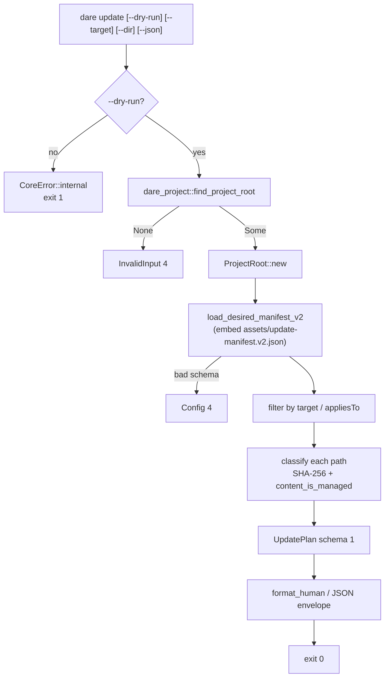

# BLUEPRINT: Update — planejamento e manifest (Microplano 021)

> **Gerado a partir de:** `DARE/DESIGN-021-update-planejamento-e-manifest.md` v1.0  
> **Data:** 2026-07-21 | **Status:** APPROVED  
> **Arquivo:** `DARE/BLUEPRINT-021-update-planejamento-e-manifest.md`  
> **Não substitui:** `DARE/BLUEPRINT.md` nem Blueprints 001–020  
> **Pré-requisitos:** Microplanos **008–014** (+ path/SHA **005**; assets **009**; contracts UPDATE-MANIFEST v1 **007**; `UPDATE_HARNESS_IDES` **013**/DEC-014)  
> **Nota:** **somente planeamento** (`--dry-run`); apply/backup/migrations → **022**.  
> **DEC:** docs em **DEC-022** (Design 021 citava DEC-021 — **colide** com validate/020; Blueprint corrige).

---

## 0. TRADE-OFFS (Architect)

Sem `PATTERNS.md` / `patterns-facts.json` — decisões 🟡 a partir do Design 021, APIs 004/005/007/009/011–014 e Documento Mestre §21. Conclusões abaixo **congelam** as lacunas do Design.

| # | Trade-off | Escolha | Justificativa |
|---|-----------|---------|---------------|
| T-01 | Domínio | Nova crate **`dare-update`** com `plan.rs` | Microplano path; RF-01; apply fica `apply.rs` em 022 |
| T-02 | Apply sem `--dry-run` (RF-21) | **Stub** `CoreError::internal("dare update apply is not implemented; use --dry-run (see microplano 022)")` → exit **1** | Evita writes silenciosas; 022 substitui o stub pelo apply real (DESIGN-022 RF-03) |
| T-03 | Manifest novo | **`UpdateManifestV2`** JSON, `schemaVersion: 2`, ficheiro embed `assets/update-manifest.v2.json` | RF-03; leitor v1 permanece em `dare-contracts` |
| T-04 | Uso do schema 1 | `load_update_manifest` / `UpdateManifestV1` para **compat + testes**; `plan_update` consome **só V2** | Dual-manifest do doc mestre |
| T-05 | Inventário de paths | Lista fechada = `assets[]` do V2 (path + sha256 + appliesTo) | RF-04; determinismo; sem scan livre do disco |
| T-06 | Expected SHA | Campo `sha256` do V2 **é** a fonte; teste MUST: SHA bate com bytes embed/`source` quando `source` presente | Evita drift |
| T-07 | Classificação | Algoritmo §4.6 (missing → identical → managed? apply : customized) | Congela RF-09/R-01 |
| T-08 | `is_managed` | `dare_harness::content_is_managed(bytes)` público (1ª linha: `<!-- dare:managed` **ou** `---`) | Alinhado Codex/Antigravity; evita 4 cópias privadas |
| T-09 | `--target` | Harness id ∈ `UPDATE_HARNESS_IDES`; **não** semver | RF-16; skill IDE desalinhada → corrigir texto na Fase docs |
| T-10 | Expand target | `hybrid` → `{cursor, antigravity}`; `claude-hybrid` → `{claude-code, cursor}`; outros → singleton | RF-12 filter |
| T-11 | Filter `appliesTo` | Item entra se `appliesTo` contém `"*"` **ou** intersecta set expandido do target (se target=None: todos) | RF-12/17 |
| T-12 | Project root | CLI: `dare_project::find_project_root`; domínio recebe `&ProjectRoot` | Como 020; `dare-update` **não** depende de `dare-project` |
| T-13 | `--dir` / `-d` | `PathBuf`; se Some, `find_project_root(dir)` (ou dir se já é root); se None, cwd | RF-26 SHOULD → MUST neste Blueprint |
| T-14 | Root ausente | `CoreError::invalid_input("project root not found")` → exit **4** | Alinhado 019/020 |
| T-15 | Releases V2 | Array `releases[]` ordenado; **sem** buraco estilo TS 3.9+; série nativa a partir de `0.1.0-alpha.0` | Classe C vs bug TS |
| T-16 | Codex | ≥1 asset com `appliesTo` contendo `"codex"` (MUST: `AGENTS.md`); teste `plan_includes_codex_paths` | RF-13 |
| T-17 | Dry-run writes | Zero: sem `atomic_write`, sem backup, sem touch `.dare/` | RF-15 / RS-06 |
| T-18 | JSON | Envelope 004; `data` = `UpdatePlan` schema 1; sem timestamps | RF-19 / RNF-06 |
| T-19 | Docs | `cli-update-plan.md` + **DEC-022** | Corrige colisão DEC-021 (validate) |
| T-20 | Container Fase 1 | Reusar `Dockerfile.rust` + `docker-compose.ci.yml` | Sem imagem nova |
| T-21 | Capacidade matrix | Não bloquear closeout se `dare-update` já na matrix; smoke CLI basta | SHOULD |
| T-22 | Conteúdo human | Contagens + paths; customized listados sob secção própria; **sem** unified diff (RF-28 COULD fora) | Escopo alpha |
| T-23 | `cliVersion` no plan | `env!("CARGO_PKG_VERSION")` do crate `dare-cli` passado em `UpdatePlanOptions` | Determinístico por build |
| T-24 | Deps `dare-update` | `dare-core`, `dare-contracts`, `dare-assets`, `dare-harness`, `serde`, `serde_json` (+ `sha2` via assets ou directo) | **NÃO:** `dare-cli`, `dare-project` |
| T-25 | Fixture customized | Criar `tests/fixtures/update/customized-assets/` neste ciclo (inventário docs já nomeia) | O-09 |

### 0.1 Exit codes (congelados)

| Code | Quando | Canal |
|------|--------|-------|
| 0 | `--dry-run` OK (mesmo com `customized > 0`) | human/JSON plan |
| 1 | Apply stub (sem `--dry-run`) **ou** Internal | `write_error` / Internal |
| 2 | clap Usage | `write_error` |
| 3 | NotFound (ficheiro manifest embed ausente — raro) | `write_error` |
| 4 | InvalidInput (root / `--target` inválido / path jail) **ou** Config (manifest V2 inválido) | `write_error` |
| 5 | Io ao ler ficheiro do project | `write_error` |

### 0.2 GAP ANALYSIS (código → MUST)

| Item | Estado | Ação |
|------|--------|------|
| `UpdateManifestV1` | ✅ 007 | Reusar para testes compat |
| `sha256_hex` / embed | ✅ 009 | Reusar |
| `UPDATE_HARNESS_IDES` | ✅ 013 | Reusar |
| `content_is_managed` público | 🔴 privado nos adapters | Extrair em `dare-harness` |
| Crate `dare-update` | 🔴 | Criar |
| `UpdateManifestV2` + embed | 🔴 | Criar |
| `plan_update` / classify | 🔴 | `plan.rs` |
| `Commands::Update` | 🔴 | CLI wiring |
| Fixture `customized-assets` | 🔴 | Criar sob `tests/fixtures/update/` |
| Docs `cli-update-plan.md` / DEC-022 | 🔴 | Criar |
| Compose | ✅ | Verificar Fase 1 |

---

## 1. VISÃO GERAL DA ARQUITETURA

`dare update --dry-run`: resolver root → carregar V2 embed → filtrar por `--target` → classificar cada asset (SHA + managed) → emitir `UpdatePlan` → exit 0. Sem `--dry-run`: stub Internal (T-02).



**Decisões arquiteturais:**

| Decisão | Escolha | Justificativa |
|---------|---------|---------------|
| Separação crates | plan@`dare-update` · thin cli · root walk só na CLI | RF-01; evita ciclo |
| Dual manifest | V1 contracts + V2 embed desired | Doc mestre; bugfix Classe C |
| Zero writes dry-run | só `read_limited` | RF-15 / RS-06 |
| Determinismo | sort por `path` POSIX; sem timestamps | RNF-01 / RNF-06 |

---

## 2. STACK TÉCNICA DEFINIDA

| Camada | Tecnologia | Versão | Papel |
|--------|-----------|--------|-------|
| Rust | rustc/cargo | **1.85.0** | Build |
| Domínio | `dare-update` | `0.1.0-alpha.0` | plan + classify |
| Contratos | `dare-contracts` | workspace | `UpdateManifestV1` |
| Assets | `dare-assets` | workspace | embed V2 + `sha256_hex` |
| Harness | `dare-harness` | workspace | `UPDATE_HARNESS_IDES`, `content_is_managed` |
| Root walk | `dare-project` | workspace | **só na CLI** |
| Core | `dare-core` | workspace | ProjectRoot, SafeRelativePath, read_limited, erros |
| CLI | `dare-cli` + clap **4.5.40** | workspace | Superfície |
| Serde | serde / serde_json | workspace | camelCase |
| Hash | `sha2` **0.10.9** | via assets/workspace | SHA-256 |
| Saída | OutputRenderer 004 | DEC-005 | |
| Testes | tempfile + assert_cmd | workspace | unit + smoke |
| Container | `Dockerfile.rust` + `docker-compose.ci.yml` | 003 | Fase 1 |

**Deps `dare-update` (MUST):** `dare-core`, `dare-contracts`, `dare-assets`, `dare-harness`, `serde`, `serde_json`. **NÃO:** `dare-cli`, `dare-project`, `dare-config` (config migrate → 022), `dare-dag`.

**Deps CLI (delta):** `dare-update = { workspace = true }`.

**Deps `dare-harness` (delta):** exportar `content_is_managed` (sem nova dep).

---

## 3. ESTRUTURA DE PASTAS E ARQUIVOS

```text
dare-cli/
├── Cargo.toml                              # + member dare-update; workspace.dep
├── assets/
│   └── update-manifest.v2.json             # desired state schema 2 (embed)
├── crates/dare-update/
│   ├── Cargo.toml
│   └── src/
│       ├── lib.rs                          # re-exports
│       ├── manifest_v2.rs                  # UpdateManifestV2 load/parse
│       ├── classify.rs                     # AssetUpdateStatus + classify_path
│       ├── plan.rs                         # plan_update + UpdatePlan
│       └── format.rs                       # format_human + plan_to_json
├── crates/dare-harness/src/
│   └── managed.rs                          # content_is_managed (novo) + re-export lib
├── crates/dare-cli/
│   ├── Cargo.toml                          # + dare-update
│   └── src/
│       ├── main.rs                         # Commands::Update
│       ├── commands/mod.rs
│       └── commands/update.rs              # dry-run wiring + stub apply
├── crates/dare-cli/tests/cli_smoke.rs      # smokes update_*
├── tests/fixtures/update/
│   ├── empty-managed/                      # project root mínimo + ficheiros managed canónicos
│   ├── customized-assets/                  # ficheiro unmanaged com SHA ≠ esperado
│   ├── missing-assets/                     # paths do V2 ausentes
│   └── mixed/                              # identical + missing + apply + customized
├── docs/compatibility/cli-update-plan.md
├── docs/DECISION-LOG.md                    # DEC-022
├── .claude/skills/dare-update/SKILL.md     # corrigir --target = harness (não semver)
├── docker-compose.ci.yml
└── DARE/
    ├── DESIGN-021-update-planejamento-e-manifest.md
    └── BLUEPRINT-021-update-planejamento-e-manifest.md
```

> **Constraint:** NÃO `[build] target` global no `.cargo/config.toml`.

---

## 4. MODELO DE DADOS

### 4.1 Constantes

```rust
pub const UPDATE_PLAN_SCHEMA_VERSION: u32 = 1;
pub const UPDATE_MANIFEST_V2_SCHEMA: u32 = 2;
pub const UPDATE_MANIFEST_V2_EMBED: &str = "update-manifest.v2.json";
pub const MODE_DRY_RUN: &str = "dry-run";

/// Harness ids aceites por `--target` (eco de UPDATE_HARNESS_IDES).
pub fn parse_harness_target(s: &str) -> CoreResult<HarnessTarget>;
```

### 4.2 `HarnessTarget`

```rust
#[derive(Debug, Clone, Copy, PartialEq, Eq)]
pub enum HarnessTarget {
    ClaudeCode,
    Cursor,
    Codex,
    Antigravity,
    Hybrid,
    ClaudeHybrid,
}

impl HarnessTarget {
    pub fn as_str(self) -> &'static str { /* "claude-code" | ... */ }
    /// Set de ids atómicos para filter appliesTo.
    pub fn expanded_ids(self) -> &'static [&'static str];
}
```

| Input CLI | `expanded_ids` |
|-----------|----------------|
| `claude-code` | `["claude-code"]` |
| `cursor` | `["cursor"]` |
| `codex` | `["codex"]` |
| `antigravity` | `["antigravity"]` |
| `hybrid` | `["cursor", "antigravity"]` |
| `claude-hybrid` | `["claude-code", "cursor"]` |
| outro | `Err(InvalidInput("invalid --target harness: …"))` |

### 4.3 `AssetUpdateStatus`

```rust
#[derive(Debug, Clone, Copy, PartialEq, Eq, Serialize, Deserialize)]
#[serde(rename_all = "camelCase")]
pub enum AssetUpdateStatus {
    Identical,
    Missing,
    Apply,
    Customized,
}
```

JSON: `"identical"` \| `"missing"` \| `"apply"` \| `"customized"` (`rename_all = "lowercase"` **ou** serde alias — **congelar:** usar `#[serde(rename_all = "lowercase")]` neste enum).

### 4.4 `UpdateManifestV2` (disco/embed — **congelado**)

| Campo JSON | Tipo Rust | Obrigatório | Semântica |
|------------|-----------|-------------|-----------|
| `schemaVersion` | `u32` | sim | sempre `2` |
| `cliVersion` | `String` | sim | versão do desired state (ex. `0.1.0-alpha.0`) |
| `releases` | `Vec<ReleaseEntry>` | sim | ordenados; sem buracos na série declarada |
| `assets` | `Vec<DesiredAsset>` | sim | inventário fechado |

`ReleaseEntry`: `{ "version": string, "notes": string }` (notes pode ser `""`).

`DesiredAsset`:

| Campo JSON | Tipo | Obrigatório | Semântica |
|------------|------|-------------|-----------|
| `path` | `String` | sim | relativo POSIX; passa `assert_safe_asset_path` |
| `sha256` | `String` | sim | hex lowercase 64 chars |
| `appliesTo` | `Vec<String>` | sim | não vazio; pode incluir `"*"` e/ou harness ids |
| `kind` | `String` | não | hint: `canonical` \| `harness` \| `template` |
| `source` | `String` | não | path embed para verificação de hash (SHOULD em CI) |

**Regras de validação ao load:**
- `schemaVersion != 2` → `CoreError::config("unsupported update manifest schemaVersion")`
- `assets` vazio → config error
- path inválido → config error
- `sha256` len ≠ 64 ou non-hex → config error
- `appliesTo` vazio → config error
- **MUST** existir ≥1 asset cujo `appliesTo` contém `"codex"` e `path == "AGENTS.md"`

### 4.5 `UpdatePlanOptions`

| Campo | Tipo | Default | Semântica |
|-------|------|---------|-----------|
| `target` | `Option<HarnessTarget>` | `None` | filter |
| `cli_version` | `String` | from CLI | eco no plan |

### 4.6 Algoritmo `classify_path` (executável)

**Entrada:** `root`, `path` (SafeRelativePath), `expected_sha: &str`.

```text
1. resolved = root.resolve(path)?
2. se !resolved.as_path().is_file():
     return Ok(Missing)   // dirs não contam como present
3. bytes = read_limited(root, path)?   // cap 007 / 2MiB
4. actual = sha256_hex(&bytes)         // dare_assets::sha256_hex
5. se actual == expected_sha (case-sensitive hex lower):
     return Ok(Identical)
6. se content_is_managed(&bytes):
     return Ok(Apply)
7. return Ok(Customized)
```

**`content_is_managed` (congelado):**

```text
primeira linha (split \n, sem exigir trim do ficheiro inteiro):
  t = line.trim_start()
  t.starts_with("<!-- dare:managed") || t.starts_with("---")
```

### 4.7 `UpdateItem`

| Campo JSON | Tipo Rust | Semântica |
|------------|-----------|-----------|
| `path` | `String` | relativo POSIX |
| `status` | `AssetUpdateStatus` | §4.3 |
| `expectedSha256` | `String` | do V2 |
| `actualSha256` | `Option<String>` | `null` se Missing |
| `appliesTo` | `Vec<String>` | cópia do V2 entry |

### 4.8 `UpdatePlan` (schema 1 — **congelado**)

| Campo JSON | Tipo Rust | Semântica |
|------------|-----------|-----------|
| `schemaVersion` | `u32` | sempre `1` |
| `mode` | `String` | sempre `"dry-run"` |
| `projectRoot` | `String` | display abs path (`\` → `/`) |
| `target` | `Option<String>` | harness id ou `null` |
| `cliVersion` | `String` | options |
| `counts` | `UpdateCounts` | ver abaixo |
| `items` | `Vec<UpdateItem>` | sorted by `path` asc |

`UpdateCounts`: `{ identical, missing, apply, customized }` todos `u32`, coerentes com `items`.

Bump de campos → ADR + `schemaVersion`++.

### 4.9 Ordenação

`items` sorted lexicograficamente por `path` (byte/Unicode). Contagens derivadas após sort.

### 4.10 Filter `appliesTo`

```text
fn item_matches(applies_to: &[String], target: Option<HarnessTarget>) -> bool {
  if applies_to.iter().any(|a| a == "*") { return true; }
  let Some(t) = target else { return true; }; // sem target = all items
  let ids = t.expanded_ids();
  applies_to.iter().any(|a| ids.contains(&a.as_str()))
}
```

> Sem `--target`: **todos** os assets do V2 entram (incluindo harness-specific). Com `--target codex`: assets com `*` **ou** `codex`.

---

## 5. CONTRATOS DE API (domínio + CLI) — anti-stub

### 5.1 Funções públicas `dare-update`

```rust
pub fn load_desired_manifest_v2_from_str(s: &str) -> CoreResult<UpdateManifestV2>;

pub fn load_desired_manifest_v2_embedded() -> CoreResult<UpdateManifestV2>;
// Lê EmbeddedAssets::get("update-manifest.v2.json"); Err NotFound/Config

pub fn classify_path(
    root: &ProjectRoot,
    rel: &SafeRelativePath,
    expected_sha256: &str,
) -> CoreResult<AssetUpdateStatus>;

pub fn plan_update(
    root: &ProjectRoot,
    manifest: &UpdateManifestV2,
    opts: &UpdatePlanOptions,
) -> CoreResult<UpdatePlan>;
// Pré: manifest já validado. Pós Ok: zero writes. Err: InvalidInput/Io/Config.

pub fn format_human(plan: &UpdatePlan) -> String;
pub fn plan_to_json(plan: &UpdatePlan) -> CoreResult<Value>;

pub fn parse_harness_target(raw: &str) -> CoreResult<HarnessTarget>;
```

### 5.2 Função pública `dare-harness`

```rust
/// Shared managed-marker detection for update classification (021+).
pub fn content_is_managed(bytes: &[u8]) -> bool;
```

Adapters internos **devem** chamar esta função (refactor leve) — MUST para um só comportamento.

### 5.3 Pré / pós `plan_update`

**Pré:** `root` válido; `manifest.schema_version == 2`.

**Pós Ok:**
- `items` sorted
- `counts` coerentes
- `mode == "dry-run"`
- `schemaVersion == 1`
- **nenhuma** mutação FS (assert listing em testes)

**Erros:**
- Io/`read_limited` overflow → Io/Config conforme core
- path resolve fail → InvalidInput

### 5.4 Algoritmo `plan_update`

1. `items = []`  
2. Para cada `asset` em `manifest.assets` (ordem do ficheiro):  
   - se `!item_matches(&asset.applies_to, opts.target)` → skip  
   - `rel = SafeRelativePath::new(&asset.path)?`  
   - `status = classify_path(root, &rel, &asset.sha256)?`  
   - `actual = if status==Missing { None } else { Some(sha of bytes) }` — pode reutilizar classify interno que devolve `(status, Option<String>)` para evitar double-read (**SHOULD:** `classify_path_detailed` privado)  
   - push `UpdateItem`  
3. Sort items por path  
4. Contar statuses  
5. Montar `UpdatePlan` com `projectRoot`, `target: opts.target.map(|t| t.as_str())`, `cliVersion`

### 5.5 `format_human` (MUST)

```text
update: dry-run
cliVersion: 0.1.0-alpha.0
target: (all)
projectRoot: /abs/path
counts: identical=2 missing=1 apply=1 customized=1
items:
  - [missing] AGENTS.md
  - [apply] .claude/commands/dare-design.md
  - [identical] templates/DESIGN-template.md
customized:
  - CLAUDE.md (sha mismatch, unmanaged)
mode: dry-run (zero mutations)
```

Regras:
- en-US; sem corpo de ficheiro; hashes **não** obrigatórios no human (só no JSON)
- secção `customized:` só se `counts.customized > 0`

### 5.6 JSON envelope

```json
{
  "correlation_id": "<uuid>",
  "data": { /* UpdatePlan */ },
  "ok": true
}
```

Dry-run happy → top-level `ok: true` mesmo com customized > 0.

### 5.7 CLI `dare update`

```rust
Update {
    /// Plan only; no writes. Required until microplano 022 implements apply.
    #[arg(long)]
    dry_run: bool,
    /// Limit plan to harness: claude-code|cursor|codex|antigravity|hybrid|claude-hybrid
    #[arg(long)]
    target: Option<String>,
    /// Project directory (default: cwd walk).
    #[arg(short = 'd', long = "dir")]
    dir: Option<PathBuf>,
}
```

**Fluxo `run_update`:**

1. Se `!dry_run` → `Err(CoreError::internal("dare update apply is not implemented; use --dry-run (see microplano 022)"))` → `write_error` exit 1.  
2. `start = dir.unwrap_or(cwd)`; `find_project_root(&start)` → None ⇒ InvalidInput 4.  
3. `ProjectRoot::new(root)`.  
4. Se `target` Some → `parse_harness_target` (fail → InvalidInput 4).  
5. `manifest = load_desired_manifest_v2_embedded()?`.  
6. `plan = plan_update(&root, &manifest, &UpdatePlanOptions { target, cli_version: env!("CARGO_PKG_VERSION").into() })?`.  
7. Print human / JSON; exit **0**.

**Edge cases:**

| Input | Resultado |
|-------|-----------|
| Sem `--dry-run` | exit 1 Internal stub |
| Sem markers no walk | exit 4 |
| `--target 3.2.0` | exit 4 InvalidInput (não semver) |
| `--target codex` | só items matching *\|codex; inclui AGENTS.md se missing/… |
| Manifest V2 corrompido | exit 4 Config |
| Ficheiro gigante > cap | Io/Config tipado; sem panic |
| Listing before/after dry-run | idêntico |

### 5.8 Exemplo concreto — `UpdatePlan`

```json
{
  "schemaVersion": 1,
  "mode": "dry-run",
  "projectRoot": "/tmp/proj",
  "target": "codex",
  "cliVersion": "0.1.0-alpha.0",
  "counts": {
    "identical": 0,
    "missing": 1,
    "apply": 0,
    "customized": 0
  },
  "items": [
    {
      "path": "AGENTS.md",
      "status": "missing",
      "expectedSha256": "aaaaaaaaaaaaaaaaaaaaaaaaaaaaaaaaaaaaaaaaaaaaaaaaaaaaaaaaaaaaaaaa",
      "actualSha256": null,
      "appliesTo": ["codex"]
    }
  ]
}
```

### 5.9 Conteúdo mínimo `assets/update-manifest.v2.json`

MUST incluir (além de outros):

| path | appliesTo | Notas |
|------|-----------|-------|
| `AGENTS.md` | `["codex"]` | RF-13 |
| ≥1 path Claude | `["claude-code"]` ou `["*"]` | cobertura |
| ≥1 path Cursor | `["cursor"]` ou `["*"]` | |
| ≥1 path Antigravity | `["antigravity"]` ou `["*"]` | |
| ≥1 path `*` | `["*"]` | templates/common |
| `releases` | contém `0.1.0-alpha.0` | T-15 |

SHA-256 MUST ser regenerável; teste `v2_sha_matches_source_when_present`.

### 5.10 Testes unitários obrigatórios (`dare-update`)

| Teste | Assert |
|-------|--------|
| `v2_rejects_schema_1` | schemaVersion 1 → Config |
| `v2_requires_codex_agents` | sem AGENTS.md+codex → Config |
| `v2_rejects_bad_path` | `../x` → Config |
| `classify_missing` | ficheiro ausente → Missing |
| `classify_identical` | bytes hash == expected → Identical |
| `classify_apply_managed` | managed + hash ≠ → Apply |
| `classify_customized_unmanaged` | unmanaged + hash ≠ → Customized |
| `plan_sorts_by_path` | ordem estável |
| `plan_filter_target_codex` | só *\|codex |
| `plan_includes_codex_paths` | items contêm AGENTS.md |
| `plan_no_target_includes_all_harnesses` | paths dos 4 harnesses presentes no V2 aparecem |
| `plan_zero_writes` | listing equal |
| `plan_counts_coherent` | sum counts == items.len() |
| `parse_target_rejects_semver` | `3.2.0` → InvalidInput |
| `legacy_v1_still_loads` | `update_manifest_from_str` schema 1 ok (contracts) |
| `content_is_managed_markers` | prefix + `---` |

### 5.11 Smoke CLI obrigatórios (`dare-cli`)

| Teste | Comando | Assert |
|-------|---------|--------|
| `update_requires_dry_run_stub` | `update` sem flags | exit 1; mensagem contém `dry-run` e `022` |
| `update_dry_run_ok` | `update --dry-run -d <mixed>` | exit 0; human `mode: dry-run` |
| `update_dry_run_json_schema` | `--dry-run --json` | `data.schemaVersion==1`, `mode==dry-run`, `ok:true` |
| `update_target_codex` | `--dry-run --target codex --json` | todos items appliesTo match *\|codex |
| `update_invalid_target` | `--dry-run --target 3.2.0` | exit 4 |
| `update_customized_detected` | fixture customized-assets | `counts.customized >= 1` |
| `update_zero_writes` | listing before/after | equal |
| `update_no_root` | cwd temp vazio | exit 4 |

### 5.12 Docs `cli-update-plan.md`

Secções MUST: flags; classificação tabela; `UpdatePlan` schema; `UpdateManifestV2`; `--target` harness (não versão); stub apply → 022; Codex Classe C; releases sem buraco; exit codes; zero writes; Local verify; **DEC-022**; nota skill IDE.

---

## 6. PLANO DE EXECUÇÃO (FASES)

### Fase 1: Containerização ← **SEMPRE PRIMEIRA**

- **DONE:** `docker compose -f docker-compose.ci.yml config` exit 0 **ou** waiver em `cli-update-plan.md`.  
- **Entregáveis:** nota Local verify.

### Fase 2: Scaffold `dare-update` + `content_is_managed` + tipos

- **DONE:** member workspace; enums/structs serializam; `content_is_managed` público + adapters refactored; testes markers.  
- **Entregáveis:** crate, `managed.rs`, `lib.rs`.

### Fase 3: Manifest V2 embed + load/validate

- **DONE:** `assets/update-manifest.v2.json` embed; load rejeita schema≠2; Codex AGENTS.md presente; testes §5.10 v2_*.  
- **Entregáveis:** `manifest_v2.rs`, asset JSON.

### Fase 4: Classify + `plan_update` + fixtures

- **DONE:** algoritmo §4.6; fixtures `tests/fixtures/update/**`; testes classify/plan.  
- **Entregáveis:** `classify.rs`, `plan.rs`, `format.rs`, fixtures.

### Fase 5: CLI wiring + smokes

- **DONE:** `Commands::Update`; stub apply; smokes §5.11.  
- **Entregáveis:** `commands/update.rs`, `main.rs`, `cli_smoke.rs`.

### Fase 6: Docs DEC-022 + skill IDE

- **DONE:** `cli-update-plan.md` + DEC-022; skill `--target` = harness.  
- **Entregáveis:** docs + skill patch.

### Fase 7: Auditoria ← **N-1**

- **DONE:** `cargo fmt --check`; `clippy -D warnings`; `test --workspace`; `audit`; `deny` = 0.

### Fase 8: Fechamento ← **N**

- **DONE:** TASKS 021 100%; próximo → **022-update-aplicacao-backup-e-migrations**.

---

## 7. VALIDATION GATES POR STACK

| Stack | Build | Test | Lint / Audit |
|-------|-------|------|--------------|
| Rust | `cargo build -p dare-update -p dare-cli -p dare-harness` | `cargo test -p dare-update` + `cargo test -p dare-harness` + `cargo test -p dare-cli --test cli_smoke -- update` | `cargo fmt --check` · `clippy --workspace --all-features -- -D warnings` · `cargo audit` · `cargo deny` |

Ralph Loop obrigatório antes de DONE.

---

## 8. CONTROLES DE SEGURANÇA (RS → fases)

| RS | Fase | Verificação |
|----|------|-------------|
| RS-01 | 3–5 | SafeRelativePath; target parse; root InvalidInput |
| RS-02 | 4–5 | human/JSON sem conteúdo de ficheiro; só path/status/hash |
| RS-03 | 4–5 | `plan_zero_writes` + smoke listing |
| RS-04 | 7 | audit + deny |
| RS-05 | — | sem shell; sem rede; sem secrets |
| RS-06 | 4–5 | dry-run zero writes (incl. `.dare/`) |
| RS-07 | 4 | `read_limited` em classify |
| RS-08 | 3 | manifest malformado → Config tipado |
| RS-09 | 3–4 | JSON dados; não executar assets |

---

## 9. ESTRATÉGIA DE TESTES

| Tipo | Onde | Cobertura |
|------|------|-----------|
| Unit | `dare-update` | §5.10 |
| Unit | `dare-harness` | `content_is_managed` |
| Compat | `dare-contracts` | V1 round-trip permanece |
| Integração FS | fixtures update | 4 statuses |
| Smoke CLI | `cli_smoke` | §5.11 |
| Segurança | zero writes + path jail | RS-01/03/06 |
| Audit | Fase 7 | RS-04 |

Golden vs TS: classificação enum = Classe A; Codex/releases = Classe C documentada.

---

## 10. ESTRATÉGIA DE DEPLOY

| Ambiente | Branch | Trigger | Artefacto |
|----------|--------|---------|-----------|
| Local | feature | Ralph Loop | bin `dare` |
| CI | PR | `ci.yml` | test + audit/deny |
| Alpha | tag | `release.yml` (015) | binários + checksums |

Sem deploy de serviço; CLI only. Apply real → 022.

---

## 11. CHECKLIST DE APROVAÇÃO

- [ ] T-01…T-25 aceites (stub apply; V2; classify; DEC-022; `--target` harness)
- [ ] `UpdatePlan` / `UpdateManifestV2` schemas congelados
- [ ] Algoritmo classify §4.6 + `content_is_managed` aceites
- [ ] Codex + releases sem buraco (Classe C) aceites
- [ ] RS mapeados às fases
- [ ] Fora de escopo 022 (apply/backup/migrations) alinhado
- [ ] Pronto para `/dare-tasks` → `TASKS-021-…` + `dare-dag-021.yaml` + `EXECUTION-021/`

---

## Apêndice A — Classification vs TypeScript 3.18.1

| Tema | Classe | Notas |
|------|--------|-------|
| Status identical/missing/apply/customized | A | Paridade |
| SHA-256 | A | Paridade |
| Leitor schema 1 | A | Via contracts |
| Manifest desired V2 | B | Novo contrato nativo |
| Releases sem buraco 3.9+ | C | Bugfix |
| Codex em appliesTo / plano | C | Bugfix |
| Exit codes / JSON 004 | B | Nativo |
| Apply stub até 022 | B | Superfície preparada |

## Apêndice B — Mensagens de erro canónicas (en-US)

| Situação | Mensagem (substring MUST) |
|----------|---------------------------|
| Stub apply | `dare update apply is not implemented; use --dry-run (see microplano 022)` |
| Root missing | `project root not found` |
| Bad target | `invalid --target harness:` |
| Bad V2 schema | `unsupported update manifest schemaVersion` |

## Apêndice C — Mapa RF → fases

| RF | Fase |
|----|------|
| RF-01 | 2 |
| RF-02 | 3 (teste V1) + contracts |
| RF-03–04 | 3 |
| RF-05–10 | 4 |
| RF-11–13 | 3–4 |
| RF-14–21 | 5 |
| RF-22–23 | 4–5 |
| RF-24 | 6 |
| RF-25–26 | 5 |
| RF-27–28 | fora / COULD |

---

## Próximas etapas

1. Revisar e aprovar este Blueprint (checklist §11).  
2. Executar `/dare-tasks` sobre este ficheiro (não gerar TASKS/DAG aqui).  
3. Implementar; apply em **022**.
