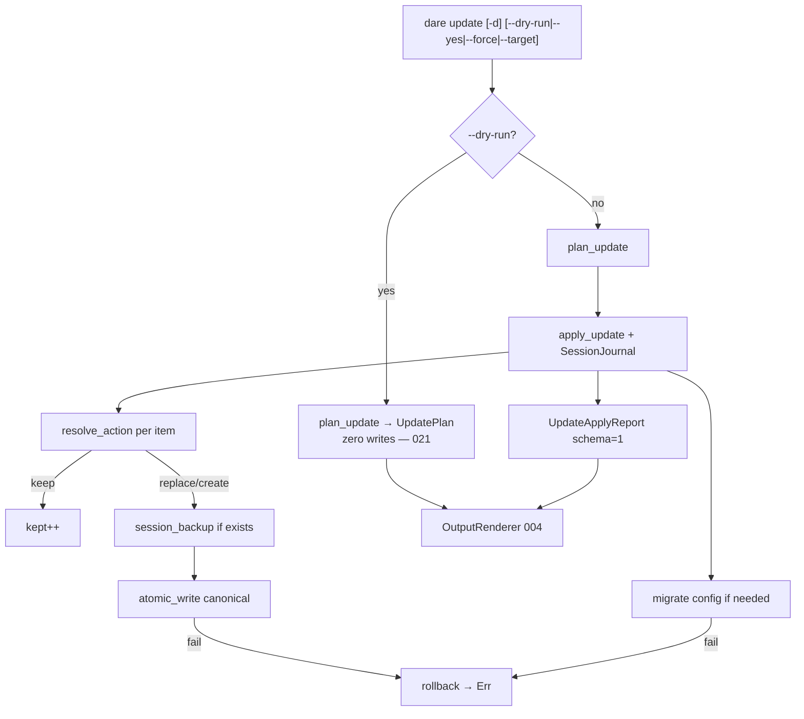

# BLUEPRINT: Update — aplicação, backup e migrations (Microplano 022)

> **Gerado a partir de:** `DARE/DESIGN-022-update-aplicacao-backup-e-migrations.md` v1.0  
> **Data:** 2026-07-21 | **Status:** APPROVED  
> **Arquivo:** `DARE/BLUEPRINT-022-update-aplicacao-backup-e-migrations.md`  
> **Não substitui:** `DARE/BLUEPRINT.md` nem Blueprints 001–021  
> **Pré-requisitos:** Microplano **021** concluído (`UpdatePlan`, classificação, `--dry-run`/`--target`) + **005/008/009/004**  
> **Nota:** este Blueprint **congela** o layout `.dare/backup-<cliVersion>/`, a matriz keep/replace/ask, o journal/rollback e o schema `UpdateApplyReport` 1. Planeamento permanece em 021.

---

## 0. TRADE-OFFS (Architect)

Sem `PATTERNS.md` / `patterns-facts.json` — decisões 🟡 a partir do Design 022 + Design 021 + APIs `dare-core` FS + `dare-config` migrate + journal pattern de `dare-project::install` (019).

| # | Trade-off | Escolha | Justificativa |
|---|-----------|---------|---------------|
| T-01 | Domínio apply | **`dare-update::apply`** (não na cli) | RF-01; cli thin; 021 já cria crate |
| T-02 | Backup layout | **Sessão:** `.dare/backup-<cliVersion>/` espelhando paths relativos; **não** usar `.dare/backups/` do 005 como root de sessão | Compat TS Mestre §21; 005 continua para migrate avulso / outros |
| T-03 | Colisão de dir | Se `.dare/backup-<ver>/` já existe → usar `.dare/backup-<ver>-<utc>/` (`YYYYMMDDThhmmssZ`) | RF-11 |
| T-04 | Cópia de backup | `atomic_write` do conteúdo lido (cap `APPLY_READ_CAP`) para `backupRoot/rel`; journal `(dest, backupRel)` | Path safety; sem shell |
| T-05 | `customized` + `-y` | **keep** (não force) | Design §4.1 / O-02 / R-01 |
| T-06 | Ask non-TTY | **keep** sem ler stdin | R-02 |
| T-07 | Ask TTY | **Batch** SHOULD→MUST técnico: uma pergunta `Replace all customized files? [y/N]` (default N); se Y → replace todos customized; se N → keep todos | RF-26; evita N prompts; injetável via `AskFn` |
| T-08 | Migrate config | Se plan contém item `dare.config.json` com status ∈ `{missing,apply}` **ou** `plan.migrate_config == true`: session-backup + `apply_plan_in_memory` + `save_dare_config` (não chamar `apply_migrate` nested, para um único journal) | RF-13; R-05; evita dual `.dare/backups` vs session |
| T-09 | Migrate default opts | `MigrateOptions { write_schema_version: true, schema_version: 1 }` quando migrate step corre | Alinhado 008 testes |
| T-10 | Rollback cleanup | Restore backups (rev) + delete `created` files; rmdir dirs vazios criados; **manter** `backupRoot` (auditoria); tree de assets == pré-apply | RF-15/16 |
| T-11 | Falha → report | Apply retorna **`Err`** após rollback; CLI envelope 004 erro; mensagem inclui `backupRoot` se criado | Simplicidade; smoke valida FS |
| T-12 | `rolledBack` no JSON | Só em sucesso com `rolledBack:false`; path de erro **não** exige body apply | Apêndice C Design |
| T-13 | Ordem apply | Iterar `plan.items` na ordem já sorted do 021; migrate config **depois** dos asset items (ou quando o item config for processado — MUST: processar item config via migrate helper, não raw bytes do embed se migrate steps non-empty) | RNF-01 |
| T-14 | Conteúdo replace | Bytes canónicos do plan item (`expected` bytes via embed path / `canonical_bytes(path)` API 021) | SHA do plan |
| T-15 | Exit codes | Mapa **004** (Design Apêndice D) | Continuidade |
| T-16 | Stub 021 | Remover: sem `--dry-run` → **apply** (este microplano) | RF-03 |
| T-17 | Container Fase 1 | Reusar `Dockerfile.rust` + `docker-compose.ci.yml` | Sem imagem nova |
| T-18 | Docs | `cli-update-apply.md` + **DEC-023** | RF-24 |
| T-19 | Project root | Mesmo walk 021/018; start missing → NotFound=3; sem markers DARE/`dare.config.json` → InvalidInput=4 se plan vazio obrigatório 🟡: exigir `dare.config.json` **ou** `DARE/` presente | RF-20 |
| T-20 | `--backup-dir` | **Fora MUST** (COULD) | RF-28 |

### 0.1 Exit codes (congelados — 004)

| Code | `ErrorKind` | Uso |
|------|-------------|-----|
| 0 | — | dry-run 021 **ou** apply OK |
| 1 | Internal | rollback incompleto / inconsistência grave |
| 2 | Usage | clap |
| 3 | NotFound | `--dir` missing / not a directory |
| 4 | InvalidInput / Config | path safety; root inválido; harness target inválido (021); migrate inválida |
| 5 | Io | I/O após tentativa de rollback |

### 0.2 GAP ANALYSIS (código → MUST)

| Item | Estado | Ação |
|------|--------|------|
| `dare-update` plan / dry-run | ⬜ 021 | Pré-requisito |
| `apply.rs` / políticas / journal | 🔴 | Implementar §5 |
| CLI apply flags `-y` `--force` | 🔴 | Wiring |
| Session backup `.dare/backup-<ver>/` | 🔴 | Implementar |
| `atomic_write` / restore 005 | ✅ | Reusar primitives |
| `apply_plan_in_memory` / save config | ✅ 008 | Reusar in-memory + session journal |
| Fixture `customized-assets` | 📋 | Materializar / reusar 021 |
| Docs DEC-023 | 🔴 | Criar |

---

## 1. VISÃO GERAL DA ARQUITETURA

`dare update`: se `--dry-run` → `plan_update` (021) zero writes; senão `plan_update` → `apply_update` (políticas + session backup + atomic writes + migrate + journal/rollback) → `UpdateApplyReport`.



**Decisões arquiteturais:**

| Decisão | Escolha | Justificativa |
|---------|---------|---------------|
| Session backup ≠ `.dare/backups/` | Prefix TS-compat | T-02; DEC classifica vs 005 |
| Ask injetável | `AskFn` | Testes sem stdin real |
| Journal espelha 019 | `backed_up` + `created` | Rollback conhecido |
| `-y` ≠ `--force` | Matriz §4.1 | Aceite produto |

---

## 2. STACK TÉCNICA DEFINIDA

| Camada | Tecnologia | Versão | Papel |
|--------|-----------|--------|-------|
| Rust | rustc/cargo | **1.85.0** | Build |
| Crate | `dare-update` | `0.1.0-alpha.0` | plan (021) + apply (022) |
| CLI | `dare-cli` + clap **4.5.40** | workspace | Superfície |
| Core | `dare-core` path/fs/atomic/error | workspace | Jail + writes |
| Config | `dare-config` plan/apply in-memory + save | workspace | Migrations |
| Assets | `dare-assets` canonical bytes / sha | workspace | Payload replace |
| Serde | serde_json camelCase | workspace | Report schema 1 |
| Saída | OutputRenderer 004 | workspace | `--json` |
| Testes | tempfile + assert_cmd | workspace | Unit + smoke |
| Container | `Dockerfile.rust` + `docker-compose.ci.yml` | 003 | Fase 1 |

---

## 3. ESTRUTURA DE PASTAS E ARQUIVOS

```text
dare-cli/
├── crates/dare-update/
│   ├── Cargo.toml
│   └── src/
│       ├── lib.rs                 # re-exports + UPDATE_APPLY_SCHEMA_VERSION
│       ├── plan.rs                # 021 (pré-requisito)
│       ├── policy.rs              # resolve_action + AskFn
│       ├── session_backup.rs      # backup root + copy/restore helpers
│       └── apply.rs               # apply_update + journal + rollback
├── crates/dare-cli/src/
│   ├── commands/update.rs         # dry-run + apply wiring
│   └── main.rs                    # Update { dir, dry_run, yes, force, target }
├── crates/dare-cli/tests/cli_smoke.rs   # update_* apply tests
├── tests/fixtures/
│   ├── customized-assets/         # unmanaged edited file
│   └── update-apply-mixed/        # missing + apply + identical
├── docs/compatibility/cli-update-apply.md
├── docs/DECISION-LOG.md           # DEC-023
├── docker-compose.ci.yml
├── Dockerfile.rust
└── DARE/
    ├── DESIGN-022-update-aplicacao-backup-e-migrations.md
    └── BLUEPRINT-022-update-aplicacao-backup-e-migrations.md
```

> Sem `[build] target` global no `.cargo/config.toml`.

---

## 4. MODELO DE DADOS

### 4.1 Constantes

```rust
pub const UPDATE_APPLY_SCHEMA_VERSION: u32 = 1;
pub const APPLY_READ_CAP: usize = 262_144;
```

### 4.2 `ApplyAction`

```rust
#[derive(Debug, Clone, Copy, PartialEq, Eq)]
pub enum ApplyAction {
    Keep,
    Replace, // create or overwrite
}
```

### 4.3 `ApplyOptions`

| Campo | Tipo | Semântica |
|-------|------|-----------|
| `yes` | `bool` | `-y` / `--yes` |
| `force` | `bool` | `--force` |
| `interactive` | `bool` | `stdout.is_tty() && stdin.is_tty() && !yes && !force` (CLI seta) |
| `ask` | `Option<AskFn>` | Se `interactive`; senão ignorado |
| `cli_version` | `String` | `env!("CARGO_PKG_VERSION")` default |

```rust
pub type AskFn = Box<dyn FnMut(&AskContext) -> bool + Send>; // true = replace all customized

pub struct AskContext {
    pub customized_paths: Vec<String>, // sorted POSIX
}
```

### 4.4 `SessionJournal`

| Campo | Tipo | Semântica |
|-------|------|-----------|
| `backup_root` | `String` | rel POSIX ex. `.dare/backup-0.1.0-alpha.0` |
| `backed_up` | `Vec<(String /*dest*/, String /*backupRel*/)>` | ordem cronológica |
| `created` | `Vec<String>` | paths criados nesta sessão (não existiam) |
| `created_dirs` | `Vec<String>` | dirs criados (rmdir reverse se vazios) |

### 4.5 `UpdateApplyReport` (schema 1 — congelado)

| Campo JSON | Tipo Rust | Nullable | Semântica |
|------------|-----------|----------|-----------|
| `schemaVersion` | `u32` | não | sempre `1` |
| `mode` | `String` | não | `"update"` |
| `cliVersion` | `String` | não | versão CLI |
| `projectRoot` | `String` | não | abs display |
| `backupRoot` | `Option<String>` | sim | rel POSIX; `null` se nenhum write |
| `target` | `Option<String>` | sim | harness id ou null |
| `force` | `bool` | não | |
| `yes` | `bool` | não | |
| `kept` | `Vec<String>` | não | sorted |
| `created` | `Vec<String>` | não | sorted no report final |
| `replaced` | `Vec<String>` | não | sorted |
| `skipped` | `Vec<String>` | não | reserved; v1 pode ficar `[]` |
| `backedUp` | `Vec<String>` | não | dest paths backed up; sorted |
| `migrated` | `Vec<String>` | não | ex. `["dare.config.json"]` |
| `warnings` | `Vec<String>` | não | ex. kept customized notices |
| `rolledBack` | `bool` | não | sempre `false` em `Ok(report)` |

**Semântica pós-sucesso:** lists refletem ações efetivas; sort lexico em todas as `Vec<String>` de paths antes de return.

### 4.6 Layout disco — session backup

```text
.dare/backup-0.1.0-alpha.0/
  CLAUDE.md
  .claude/commands/dare-discover.md
  dare.config.json
```

- `backupRoot` reportado = path relativo POSIX do dir de sessão.
- Ficheiro backupado em `format!("{backupRoot}/{destRel}")` com parents criados via journal `created_dirs`.

---

## 5. CONTRATOS DE API (ANTI-STUB)

### 5.1 `resolve_action`

```rust
pub fn resolve_action(
    status: AssetUpdateStatus,
    opts: &ApplyOptions,
    batch_replace_customized: bool, // resultado do AskFn se interactive; else false
) -> ApplyAction
```

**Tabela MUST (espelha Design §4.1):**

| status | force | yes | interactive | batch_replace | → action |
|--------|-------|-----|-------------|---------------|----------|
| identical | * | * | * | * | Keep |
| missing | * | * | * | * | Replace |
| apply | * | * | * | * | Replace |
| customized | true | * | * | * | Replace |
| customized | false | true | * | * | Keep |
| customized | false | false | false | * | Keep |
| customized | false | false | true | true | Replace |
| customized | false | false | true | false | Keep |

**Pré:** status válido do 021. **Pós:** determinístico. **Erros:** nenhum.

### 5.2 `ensure_backup_root`

```rust
pub fn ensure_backup_root(root: &ProjectRoot, cli_version: &str) -> CoreResult<SafeRelativePath>
```

**Algoritmo:**
1. Sanitize `cli_version` para path segment: allow `[A-Za-z0-9._-]`; replace outros por `_`; se vazio → `"unknown"`.
2. Candidate = `.dare/backup-{sanitized}`.
3. Se `root.resolve(candidate)` **não** existe → criar dir (via `std::fs::create_dir_all` sob jail) → Ok(candidate).
4. Se existe → candidate2 = `.dare/backup-{sanitized}-{utc}` → create → Ok.

**Erros:** InvalidInput se sanitize/path escape; Io se create falha.

### 5.3 `session_backup_file`

```rust
fn session_backup_file(
    root: &ProjectRoot,
    backup_root: &SafeRelativePath,
    dest_rel: &str,
    journal: &mut SessionJournal,
) -> CoreResult<()>
```

**Pré:** `dest_rel` existe como ficheiro.  
**Algoritmo:**
1. `SafeRelativePath::new(dest_rel)?`
2. Ler bytes com cap `APPLY_READ_CAP` (`read_limited` / read + truncate err se > cap → InvalidInput).
3. `bak = SafeRelativePath::new(&format!("{}/{dest_rel}", backup_root.as_str()))?`
4. Criar parent dirs; registar novos dirs em `journal.created_dirs` se criados nesta sessão.
5. `atomic_write(root, &bak, &bytes)?`
6. `journal.backed_up.push((dest_rel.into(), bak.as_str().into()))`

**Pós:** backup legível; dest intacto.  
**Side effects:** write só sob `backup_root/**`.

### 5.4 `rollback_session`

```rust
pub fn rollback_session(root: &ProjectRoot, journal: &SessionJournal) -> CoreResult<()>
```

**Algoritmo:**
1. Para cada `(dest, bak)` em `journal.backed_up.iter().rev()`: `restore(root, bak_path, dest_path)` **ou** ler bak + `atomic_write` dest (prefer reutilizar `dare_core::fs::restore` se paths SafeRelativePath).
2. Para cada `created` em `journal.created.iter().rev()`: se file exists → `std::fs::remove_file` (ignore NotFound).
3. Para cada dir em `journal.created_dirs.iter().rev()`: `remove_dir` se vazio.
4. **Não** apagar `backup_root` inteiro.

**Erros:** se restore falhar → `CoreError::internal` (exit 1) descrevendo path.

### 5.5 `apply_update`

```rust
pub fn apply_update(
    root: &ProjectRoot,
    plan: &UpdatePlan,
    opts: ApplyOptions,
) -> CoreResult<UpdateApplyReport>
```

**Pré-condições:**
- `root` válido.
- `plan.schema_version == 1`.
- `plan.items` já filtrados por `--target` (021).

**Algoritmo (ordem fixa):**
1. Init report fields from opts/plan; `kept/created/replaced/... = vec![]`; `warnings = vec![]`.
2. Collect customized paths = items where status==Customized; sorted.
3. `batch_replace = false`;
   - Se `opts.force` { /* matrix handles */ }
   - Else if `opts.interactive` {
       if let Some(ref mut ask) = opts.ask {
         batch_replace = ask(&AskContext { customized_paths });
       } else { batch_replace = false; }
     }
4. `let mut journal = SessionJournal::default();`
5. `let mut backup_root: Option<SafeRelativePath> = None;`
6. Helper `need_backup_root()`: se None, `ensure_backup_root` → set journal.backup_root + report.backup_root.
7. For each `item` in `plan.items` (stable order):
   - `action = resolve_action(item.status, &opts, batch_replace)`
   - If Keep:
     - `kept.push(item.path)`
     - If status==Customized && !force: `warnings.push(format!("kept customized: {}", item.path))`
     - continue
   - If Replace:
     - Load `bytes = canonical_bytes_for(item)?` (API 021 / assets) — **exceto** se `item.path == "dare.config.json"` **e** migrate aplicável → ver passo migrate abaixo; se migrate, skip raw replace neste branch.
     - `existed = root.resolve(item.path)?.as_path().is_file()`
     - If existed: `need_backup_root(); session_backup_file(...);`
     - Ensure parent dirs of dest (journal created_dirs).
     - `atomic_write(root, &SafeRelativePath::new(&item.path)?, &bytes)?`
     - If !existed: `journal.created.push(item.path.clone()); created_list.push`
     - Else: `replaced.push`
8. **Migrate step** (se `should_migrate(plan)`):
   - `should_migrate` = plan flag **ou** any item path==`dare.config.json` with status in {Missing, Apply} **ou** (Customized && action would Replace).
   - Se customized config kept → **não** migrar.
   - `need_backup_root()`; se config exists → session_backup; else will be create.
   - `cfg = load_or_default`; `plan_m = plan_migrate(&cfg, &MigrateOptions{ write_schema_version: true, schema_version: 1 })`;
   - Se `plan_m.steps.is_empty()` && missing file → still may write default via save se missing+Replace from assets — Blueprint: se steps empty e ficheiro already written no loop, skip; se missing e não escrito, `save_dare_config(default)` após in-memory migrate.
   - `after = apply_plan_in_memory`; `save_dare_config`;
   - Track created/replaced/migrated accordingly; `migrated.push("dare.config.json")`.
9. On **any Err** in steps 7–8: `let _ = rollback_session(root, &journal);` then return Err (prefer original error; se rollback falhar → Internal wrapping ambos).
10. Sort all path vecs; set `rolledBack=false`; `backupRoot` Option; return Ok(report).

**Pós-condições sucesso:**
- Disco coerente com ações; backups sob backupRoot para replaced.
- Zero ficheiros “half-written” (atomic).

**Pós-condições falha:**
- Assets tocados na sessão restaurados/removidos; backupRoot pode permanecer.

**Concorrência:** sem lock multi-process MUST; single-threaded apply.

**Edge cases:**

| Caso | Resultado |
|------|-----------|
| plan.items vazio | Ok report vazio; backupRoot null |
| só identical | kept todos; zero writes; backupRoot null |
| customized + yes | kept; warning |
| customized + force | backup + replace |
| missing | create; journal.created |
| write fail mid-way | rollback; Err Io |
| path escape no item | InvalidInput antes de write |
| bytes > APPLY_READ_CAP ao backup | InvalidInput |

### 5.6 `format_apply_human` / `apply_report_to_json`

```rust
pub fn format_apply_human(r: &UpdateApplyReport) -> String
pub fn apply_report_to_json(r: &UpdateApplyReport) -> Value
```

**Human MUST incluir:** mode, cliVersion, projectRoot, backupRoot, counts (kept/created/replaced/backedUp/migrated), warnings, linha final `mode: update`.  
**JSON MUST:** camelCase schema 1; `schemaVersion == 1`.

### 5.7 CLI wiring

```rust
Update {
    #[arg(long, short = 'd')]
    dir: Option<PathBuf>,
    #[arg(long)]
    dry_run: bool,
    #[arg(long, short = 'y')]
    yes: bool,
    #[arg(long)]
    force: bool,
    #[arg(long)]
    target: Option<String>, // harness id — parse 021
}
```

| Fluxo | Comportamento |
|-------|---------------|
| `dry_run` | `plan_update` → human/JSON plan (021); exit 0; zero writes |
| `!dry_run` | resolve root → `plan_update` → build `ApplyOptions` (interactive = tty && !yes && !force; ask = stdin batch reader) → `apply_update` → human/JSON apply report |
| `--force` + `--dry-run` | dry-run ignora force (sem writes); force só no apply |
| target inválido | InvalidInput 4 (021) |

**Stdin ask reader (MUST quando interactive):**
- Print to stderr: `Replace all N customized files? [y/N]: `
- Read line; trim; `y`/`Y`/`yes` → true; else false (incluindo EOF → false).

### 5.8 Exemplo JSON sucesso (`-y`, um create)

```json
{
  "schemaVersion": 1,
  "mode": "update",
  "cliVersion": "0.1.0-alpha.0",
  "projectRoot": "C:/tmp/proj",
  "backupRoot": null,
  "target": null,
  "force": false,
  "yes": true,
  "kept": [],
  "created": ["AGENTS.md"],
  "replaced": [],
  "skipped": [],
  "backedUp": [],
  "migrated": [],
  "warnings": [],
  "rolledBack": false
}
```

### 5.9 Exemplo JSON — customized kept com `-y`

```json
{
  "schemaVersion": 1,
  "mode": "update",
  "cliVersion": "0.1.0-alpha.0",
  "projectRoot": "/tmp/customized-assets",
  "backupRoot": null,
  "target": null,
  "force": false,
  "yes": true,
  "kept": ["CLAUDE.md"],
  "created": [],
  "replaced": [],
  "skipped": [],
  "backedUp": [],
  "migrated": [],
  "warnings": ["kept customized: CLAUDE.md"],
  "rolledBack": false
}
```

### 5.10 Testes unitários obrigatórios (`dare-update`)

| Teste | Assert |
|-------|--------|
| `resolve_action_matrix_all_rows` | tabela §5.1 completa |
| `ensure_backup_root_creates_and_collides` | second call gets `-utc` suffix |
| `session_backup_and_rollback_restores` | mutate file → backup → overwrite → rollback → original bytes |
| `apply_keeps_customized_with_yes` | fixture customized; `-y`; content unchanged; warning |
| `apply_force_replaces_customized` | content == canonical; backedUp contains path; backupRoot Some |
| `apply_creates_missing` | file created; created list |
| `apply_identical_noop` | zero writes; backupRoot null |
| `apply_partial_failure_rolls_back` | inject fail after 1 write (test hook / bad path after first); tree == before (exceto backup dir) |
| `apply_migrate_writes_schema_version` | dare.config.json gains schemaVersion; migrated list |
| `apply_migrate_kept_customized_config_skips` | customized config + yes → no migrate write |
| `report_schema_version_1_sorted_lists` | JSON keys; lists sorted |
| `read_cap_rejects_huge_backup_source` | InvalidInput |

### 5.11 Smoke CLI obrigatórios

| Teste | Comando | Assert |
|-------|---------|--------|
| `update_dry_run_zero_write` | `dare update --dry-run -d <fix>` | success; listing unchanged |
| `update_yes_keeps_customized` | `dare update -y -d <customized>` | success; customized bytes same; JSON warning |
| `update_force_overwrites_customized` | `dare update --force -y -d <customized>` | success; bytes == canonical; `.dare/backup-*` exists |
| `update_creates_missing` | `dare update -y -d <mixed>` | missing path now exists |
| `update_dir_missing_exit_3` | `dare update -y -d <nope>` | code 3 |

### 5.12 Docs `cli-update-apply.md`

Secções MUST:
1. Flags (`--dry-run`, `-y`, `--force`, `--target`, `-d`)
2. Matriz §5.1
3. Backup layout `.dare/backup-<ver>/` vs `.dare/backups/` (005) — Classe B
4. Rollback semantics
5. Migrate config integration
6. Schema UpdateApplyReport 1 + exemplos
7. Exit codes 004
8. Diff vs TS 3.18.1
9. Local verify compose / waiver
10. Link DEC-023

---

## 6. PLANO DE EXECUÇÃO (FASES)

### Fase 1: Containerização ← **SEMPRE PRIMEIRA**

- **DONE:** `docker compose -f docker-compose.ci.yml config` exit 0 **ou** waiver em `cli-update-apply.md`.  
- **Entregáveis:** nota Local verify.

### Fase 2: Policy + session backup + journal/rollback

- **DONE:** testes `resolve_action_matrix_*`, `ensure_backup_root_*`, `session_backup_and_rollback_*`.  
- **Entregáveis:** `policy.rs`, `session_backup.rs`.

### Fase 3: `apply_update` assets (keep/replace/create) + report

- **DONE:** testes keep customized, force replace, missing create, identical noop, schema/sort.  
- **Entregáveis:** `apply.rs` core loop + human/json.

### Fase 4: Migrations config + falha parcial + CLI smokes

- **DONE:** migrate tests; partial failure rollback; smokes §5.11; stub 021 removido.  
- **Entregáveis:** CLI flags; fixtures; `cli_smoke` update_*.

### Fase 5: Docs DEC-023

- **DONE:** `cli-update-apply.md` §5.12; DEC-023; classification matrix entries.  
- **Entregáveis:** docs.

### Fase 6: Auditoria ← **N-1**

- **DONE:** `cargo fmt --check`; `clippy --workspace --all-features -- -D warnings`; `cargo test --workspace`; `cargo audit`; `cargo deny` = 0.

### Fase 7: Fechamento ← **N**

- **DONE:** Aceite microplano 022; próximo → 023 design determinístico.

---

## 7. VALIDATION GATES POR STACK

| Stack | Build | Test | Lint / Audit |
|-------|-------|------|--------------|
| Rust | `cargo build -p dare-update -p dare-cli` | `cargo test -p dare-update` + `cargo test -p dare-cli --test cli_smoke -- update` | fmt · clippy `-D warnings` · audit · deny |

Ralph Loop obrigatório antes de DONE.

---

## 8. CONTROLES DE SEGURANÇA (RS → fases)

| RS | Fase | Verificação |
|----|------|-------------|
| RS-01 | 2–4 | SafeRelativePath em todos os paths do plan |
| RS-02 | 3–5 | Report só paths/status; redact errors |
| RS-03 | 3–4 | force não sai do ProjectRoot |
| RS-04 | 6 | audit + deny |
| RS-05 | 2–4 | sem shell; sem secrets em código |
| RS-06 | 2–3 | backups só sob `.dare/backup-*` no jail |
| RS-07 | 4 | teste partial failure |
| RS-08 | 2–3 | APPLY_READ_CAP |

---

## 9. ESTRATÉGIA DE TESTES

| Tipo | Como |
|------|------|
| Unit policy | matriz §5.1 |
| Unit FS | backup/rollback/apply tempfile |
| Integração migrate | config extras preservados (008) |
| Smoke CLI | §5.11 |
| Segurança | customized preserve; path escape; cap |
| Compat | DEC vs TS backup path / ask |

Hook de falha parcial: feature `test-utils` ou `apply_update_with_failpoint(after_n: usize)` **só** `#[cfg(test)]`.

---

## 10. ESTRATÉGIA DE DEPLOY

| Ambiente | Trigger | Artefacto |
|----------|---------|-----------|
| Local | dev | `dare update -y` / `--force` |
| CI | PR | smokes update_* |
| Alpha | pipeline 015 | binário com update apply |

Sem pipeline novo.

---

## 11. CHECKLIST DE APROVAÇÃO DO BLUEPRINT

- [ ] Trade-offs T-01…T-20 aceites (esp. **T-02 backup layout**, **T-05/T-07 ask/yes**)
- [ ] Matriz §5.1 congelada
- [ ] Schema `UpdateApplyReport` §4.5 congelado
- [ ] Contratos §5 anti-stub suficientes para `/dare-tasks`
- [ ] Separação 021 dry-run / 022 apply aceite
- [ ] Fases 1→7 DONE verificáveis
- [ ] RS mapeados
- [ ] Pronto para `/dare-tasks` → `TASKS-022` + `dare-dag-022.yaml` + `EXECUTION-022/`

---

## 12. PRÓXIMAS ETAPAS

1. Revisar e aprovar este Blueprint.  
2. `/dare-tasks` sobre `DARE/BLUEPRINT-022-update-aplicacao-backup-e-migrations.md`.  
3. Executar DAG `mp022-*`.  
4. Após closeout → [`023-design-deterministico.md`](../DARE-RUST-MICRO-PLANOS/DARE-RUST-MICRO-PLANOS/023-design-deterministico.md).
