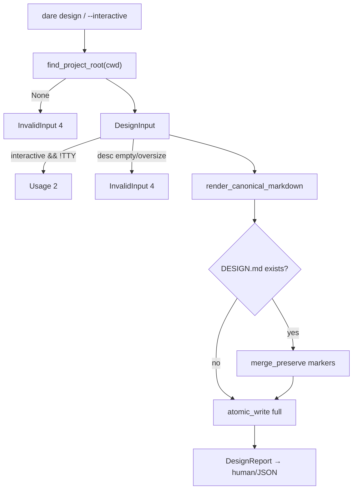

# BLUEPRINT: Design determinístico — `dare design` (Microplano 023)

> **Gerado a partir de:** `DARE/DESIGN-023-design-deterministico.md` v1.0  
> **Data:** 2026-07-21 | **Status:** APPROVED  
> **Arquivo:** `DARE/BLUEPRINT-023-design-deterministico.md`  
> **Não substitui:** Blueprints 001–022  
> **Pré-requisitos:** **009, 010, 019** (+ 004/005)  
> **Escopo:** só checklist do 023. **Não** implementar `--ai`, enrichment LLM, blueprint, multi-`DESIGN-*`.

---

## 0. TRADE-OFFS (Architect)

Sem `PATTERNS.md` / `patterns-facts.json`. Decisões a partir do Design 023, microplano 023, Doc Mestre §22 e precedente welcome/info (lógica no CLI module).

| # | Trade-off | Escolha | Justificativa |
|---|-----------|---------|---------------|
| T-01 | Onde vive o código | **`dare-cli/src/commands/design.rs`** (+ helpers no mesmo módulo/ficheiro) | Paths do microplano; padrão 016/017; sem crate nova |
| T-02 | Path de saída | Só **`DARE/DESIGN.md`** | Contrato de disco 023; path alternativo = 025 |
| T-03 | Markers | `<!-- AGENT:BEGIN section="<id>" -->` … `<!-- AGENT:END section="<id>" -->` | Delimitação parseável para preserve + 024 |
| T-04 | Secções enrichable | `description`, `objectives`, `functional-requirements`, `stack` | Suficiente para 024; resto do template sem marker |
| T-05 | Data no header | Campo **volátil**; testes usam `fixed_date: Option<&str>` / default `"1970-01-01"` em unit; golden normaliza `Data:` | Aceite O-03 |
| T-06 | Interactive sem TTY | `CoreError::usage("design --interactive requires a TTY")` → exit **2** | clap/Usage; CI seguro |
| T-07 | Cap descrição | `DESC_MAX = 32_768` bytes UTF-8 | RF-16 SHOULD → MUST técnico |
| T-08 | Cap read merge | `DESIGN_READ_CAP = 262_144` (igual INSTALL_READ_CAP) | RS-06 |
| T-09 | `--ai` | **Não** declarar flag neste ciclo | Fora de escopo 023; 024 adiciona |
| T-10 | Capability | Patch `cli_commands: ["design"]` na matrix; asset `assets/capabilities/dare-design/` se necessário para render | RF-10/11 |
| T-11 | Container Fase 1 | Reusar compose CI | Sem imagem nova |
| T-12 | Docs | `cli-design.md` + **DEC-024** | RF-15 |
| T-13 | Report schema | `DesignReport` schemaVersion **1** | RF-13 |

### 0.1 Exit codes (004)

| Code | Quando |
|------|--------|
| 0 | Sucesso |
| 1 | Internal |
| 2 | Usage (`--interactive` sem TTY; clap) |
| 3 | NotFound (se `--dir` futuro; neste ciclo N/A salvo root dir missing raro) |
| 4 | InvalidInput (root null, descrição vazia, oversize, path jail) |
| 5 | Io |

### 0.2 GAP

| Item | Estado | Ação |
|------|--------|------|
| Template embed | ✅ | Usar como checklist de secções |
| Matrix `dare-design` | ✅ outputs; `cli_commands: []` | Patch |
| `Commands::Design` | 🔴 | Implementar |
| Markers/preserve | 🔴 | Implementar |
| Snapshots | 🔴 | Criar |
| Docs DEC-024 | 🔴 | Criar |

---

## 1. VISÃO GERAL DA ARQUITETURA



**Decisões:**

| Decisão | Escolha | Justificativa |
|---------|---------|---------------|
| Merge por markers | Só reescreve blocos BEGIN/END conhecidos | RF-09; 024 injeta depois |
| Create vs update | `action` no report | Observabilidade |
| Sem rede | — | RNF-03 |

---

## 2. STACK TÉCNICA DEFINIDA

| Camada | Tecnologia | Versão | Papel |
|--------|-----------|--------|-------|
| Rust | 1.85.0 | pin | Build |
| CLI | clap **4.5.40** | workspace | Superfície |
| Root | `dare-project` | workspace | Walk |
| Path/FS | `dare-core` | workspace | Jail + atomic_write |
| Assets | `dare-assets` | workspace | Template / capability render se necessário |
| Serde JSON | workspace | Report |
| TTY | `std::io::IsTerminal` | std | Interactive gate |
| Testes | tempfile | workspace | Unit + smoke |
| Container | `docker-compose.ci.yml` | 003 | Fase 1 |

**Deps:** sem crate nova. `dare-cli` já depende de `dare-project`, `dare-core`, `dare-assets`.

---

## 3. ESTRUTURA DE PASTAS E ARQUIVOS

```text
dare-cli/
├── crates/dare-cli/src/
│   ├── main.rs                         # Commands::Design
│   ├── commands/mod.rs
│   └── commands/design.rs              # input, render, merge, report, run
├── crates/dare-cli/tests/cli_smoke.rs  # smokes design*
├── assets/capability-matrix.yml        # cli_commands: ["design"]
├── assets/capabilities/dare-design/    # se ainda não existir conteúdo mínimo
├── assets/templates/DESIGN-template.md # SoT de secções (já existe)
├── tests/fixtures/design/
│   ├── input-basic.txt                 # descrição fixa
│   ├── golden-basic.md                 # estrutura esperada (data normalizada)
│   └── existing-with-notes.md          # fixture preserve
├── docs/compatibility/cli-design.md
├── docs/DECISION-LOG.md                # DEC-024
└── DARE/
    ├── DESIGN-023-design-deterministico.md
    └── BLUEPRINT-023-design-deterministico.md
```

> Sem `[build] target` global.

---

## 4. MODELO DE DADOS

### 4.1 Constantes

```rust
pub const DESIGN_REL: &str = "DARE/DESIGN.md";
pub const DESIGN_SCHEMA_VERSION: u32 = 1; // report
pub const DESC_MAX: usize = 32_768;
pub const DESIGN_READ_CAP: usize = 262_144;
pub const MARKER_BEGIN: &str = "<!-- AGENT:BEGIN section=\"";
pub const MARKER_END_PREFIX: &str = "<!-- AGENT:END section=\"";
/// Enrichable section ids (order stable):
pub const ENRICHABLE: &[&str] = &[
    "description",
    "objectives",
    "functional-requirements",
    "stack",
];
```

### 4.2 `DesignInput`

| Campo | Tipo | Default | Semântica |
|-------|------|---------|-----------|
| `title` | `String` | derivado: primeiros 60 chars da desc ou `"Untitled"` | Header `# DESIGN: …` |
| `description` | `String` | — | Corpo secção 1 (dentro marker) |
| `interactive` | `bool` | `false` | Eco no report |
| `fixed_date` | `Option<String>` | `None` → hoje UTC `YYYY-MM-DD` em prod; testes passam `Some("1970-01-01")` | Header |

### 4.3 `DesignOptions`

| Campo | Tipo | Default | Semântica |
|-------|------|---------|-----------|
| `force_full_rewrite` | `bool` | `false` | Se true, ignora preserve (não expor flag CLI neste ciclo — só testes). CLI alpha = sempre merge-preserve |

> Design SHOULD `--force` **não** entra na superfície CLI deste Blueprint (evitar scope creep). Preserve sempre no path feliz.

### 4.4 `DesignReport` (schema 1 — **congelado**)

| Campo JSON | Tipo | Semântica |
|------------|------|-----------|
| `schemaVersion` | `u32` | `1` |
| `mode` | `String` | `"design"` |
| `ok` | `bool` | `true` em sucesso |
| `path` | `String` | `"DARE/DESIGN.md"` POSIX |
| `action` | `String` | `"created"` \| `"updated"` |
| `title` | `String` | título usado |
| `markerCount` | `u32` | nº de pares BEGIN/END escritos |
| `preservedRegions` | `u32` | nº de blocos de texto unmanaged mantidos (aprox. por contagem de gaps) |
| `interactive` | `bool` | eco |
| `warnings` | `Vec<String>` | ex. title truncated |

### 4.5 Marker wrap

```text
<!-- AGENT:BEGIN section="description" -->
<body>
<!-- AGENT:END section="description" -->
```

- `section` id ∈ `ENRICHABLE` only for managed regions.
- Body inicial: descrição do user (section description); outras → `[A definir]` ou tabela stub mínima com `[A definir]`.

---

## 5. CONTRATOS DE API (anti-stub)

### 5.1 Funções públicas no módulo `design`

```rust
pub fn is_stdin_tty() -> bool; // stdout/stdin IsTerminal — usar stdin

pub fn validate_description(desc: &str) -> CoreResult<()>;
// Err InvalidInput se trim empty ou len > DESC_MAX

pub fn derive_title(desc: &str) -> String;
// trim; se vazio "Untitled"; else chars().take(60).collect(); se cortou, sem "..."

pub fn render_canonical(input: &DesignInput) -> String;
// markdown completo com 12 secções do template + markers ENRICHABLE

pub fn merge_preserve(existing: &str, fresh: &str) -> String;
// algoritmo §5.3

pub fn apply_design(root: &ProjectRoot, input: &DesignInput) -> CoreResult<DesignReport>;
// ensure DARE/; merge or create; atomic_write DESIGN_REL

pub fn format_human(r: &DesignReport) -> String;
pub fn report_to_json(r: &DesignReport) -> CoreResult<Value>;

pub fn run_design(description: Option<String>, interactive: bool) -> CoreResult<(String, Value)>;
// orquestra CLI: root, interactive prompts, apply, format
```

### 5.2 `render_canonical` — secções MUST (ordem fixa)

Espelhar `assets/templates/DESIGN-template.md`:

1. Título `# DESIGN: {title}`
2. Meta `> **Versão:** v1.0 | **Data:** {date} | **Status:** DRAFT`
3. `## 1. DESCRIÇÃO` — marker `description` com body = `input.description`
4. `## 2. OBJETIVOS…` — marker `objectives` com tabela stub 1 linha `[A definir]`
5. `## 3. STAKEHOLDERS` — tabela stub `[A definir]` (**sem** marker)
6. `## 4. REQUISITOS FUNCIONAIS` — marker `functional-requirements` stub
7. `## 5. REQUISITOS NÃO-FUNCIONAIS` — stub sem marker
8. `## 6. REQUISITOS DE SEGURANÇA` — stub RS-01…05 linhas placeholder sem marker
9. `## 7. STACK TÉCNICA` — marker `stack` stub
10. `## 8. INTEGRAÇÕES EXTERNAS` — stub
11. `## 9. RESTRIÇÕES` — stub
12. `## 10. FORA DO ESCOPO (v1)` — stub
13. `## 11. RISCOS E MITIGAÇÕES` — stub
14. `## 12. CHECKLIST DE APROVAÇÃO` — checkboxes vazios

Labels en-US ou pt do template existente — **seguir o idioma do ficheiro template embed** (hoje PT no template). Congelado: **usar o texto do template** e só substituir placeholders + injetar markers.

### 5.3 `merge_preserve` (executável)

1. Parse `fresh` → map `section_id → full_block` (BEGIN…END inclusive) para cada `ENRICHABLE`.
2. Se `existing` **não** contém nenhum `AGENT:BEGIN` → se ficheiro existe com conteúdo user: tratar **ficheiro inteiro** como unmanaged:  
   - Escrever `fresh` e **anexar** no fim:

```markdown
## APPENDIX — Preserved previous content

<!-- dare:preserved -->
{existing}
```

   - `preservedRegions = 1`, `action = updated`.
3. Se `existing` tem markers:  
   - Começar de `existing` como base.  
   - Para cada `id` em `ENRICHABLE`: substituir o bloco BEGIN/END correspondente pelo bloco de `fresh` (regex linha a linha ou scanner). Se marker ausente em existing, **inserir** o bloco de `fresh` após o heading da secção correspondente (ou append).  
   - Texto fora de qualquer BEGIN/END permanece intacto.
4. Retornar string final.

**Edge cases:**

| Caso | Comportamento |
|------|----------------|
| existing vazio / missing | `action=created`; write `fresh` |
| Marker BEGIN sem END | InvalidInput 4 `"malformed AGENT markers in DARE/DESIGN.md"` |
| Descrição com `-->` | Escapar não necessário se body raw; se aparecer `<!--` no body user, leave as-is (024 cuidará) |

### 5.4 Interactive

Prompts (en-US), ordem:

1. `Title (empty = derive from description): `
2. `Description: ` (multi-line: read until empty line **ou** single line — **congelar single line** para alpha)

Se `!stdin.is_terminal()` → Usage exit 2.

### 5.5 CLI clap

```rust
Design {
    /// Feature/product description (omit with --interactive).
    description: Vec<String>, // clap trailing; join with " "
    #[arg(long)]
    interactive: bool,
}
```

Regras:
- `interactive && !description.is_empty()` → Usage “cannot combine --interactive with description”
- `!interactive && description.is_empty()` → Usage “description required (or --interactive)”

### 5.6 Human output

```text
design: ok
path: DARE/DESIGN.md
action: created
title: My API
markerCount: 4
preservedRegions: 0
mode: design
```

### 5.7 Exemplo JSON

```json
{
  "schemaVersion": 1,
  "mode": "design",
  "ok": true,
  "path": "DARE/DESIGN.md",
  "action": "created",
  "title": "My API",
  "markerCount": 4,
  "preservedRegions": 0,
  "interactive": false,
  "warnings": []
}
```

### 5.8 Testes unitários MUST

| Teste | Assert |
|-------|--------|
| `validate_description_rejects_empty` | Err |
| `validate_description_rejects_oversize` | Err |
| `derive_title_truncates_60` | len ≤ 60 |
| `render_contains_four_enrichable_markers` | 4 BEGIN/END |
| `render_stable_with_fixed_date` | duas chamadas iguais |
| `merge_preserve_keeps_unmanaged_paragraph` | notes fora de marker sobrevivem |
| `merge_first_existing_without_markers_appends_appendix` | appendix preserved |
| `report_schema_version_1` | JSON keys |

### 5.9 Smoke CLI MUST

| Teste | Assert |
|-------|--------|
| `design_creates_file` | temp project + `design "hello world"` → exit 0; `DARE/DESIGN.md` exists; contém `AGENT:BEGIN` |
| `design_json_schema` | `--json` → `data.schemaVersion==1`, `mode==design` |
| `design_empty_desc_usage_or_4` | exit 2 ou 4 |
| `design_preserve_notes` | pré-escrever notes unmanaged + regenerate → notes still present |
| `design_interactive_no_tty_exits_2` | pipe sem TTY + `--interactive` → 2 |

### 5.10 Capability

1. Em `capability-matrix.yml`: `cli_commands: ["design"]` para `dare-design`.
2. Garantir que `assets/capabilities/dare-design/` existe **ou** que render matrix já produz os 4 outputs (já listados). Se pasta vazia exigida pelo microplano, criar stub README en-US apontando para matrix.
3. Teste: `validate_capability_matrix` continua a passar; assert `cli_commands` contém `design`.

### 5.11 Docs `cli-design.md`

Flags; path `DARE/DESIGN.md`; markers tabela; preserve; interactive TTY; exit codes; DesignReport; snapshots; **fora**: `--ai`→024; Local verify compose; DEC-024; classification vs TS.

---

## 6. PLANO DE EXECUÇÃO (FASES)

### Fase 1: Containerização ← **SEMPRE PRIMEIRA**

- **DONE:** `docker compose -f docker-compose.ci.yml config` exit 0 **ou** waiver em `cli-design.md`.  
- **Entregáveis:** nota Local verify.

### Fase 2: Tipos + render canónico + markers

- **DONE:** `DesignInput`/`DesignReport`; `render_canonical`; testes render_* / validate_* / derive_* / schema.  
- **Entregáveis:** núcleo em `design.rs`.

### Fase 3: merge preserve + apply + fixtures golden

- **DONE:** `merge_preserve` testes; `apply_design` write; golden-basic; preserve fixture.  
- **Entregáveis:** I/O + fixtures.

### Fase 4: CLI wiring + interactive + smokes

- **DONE:** `Commands::Design`; smokes §5.9; interactive TTY gate.  
- **Entregáveis:** `main.rs`, `cli_smoke.rs`.

### Fase 5: Capability matrix + assets

- **DONE:** `cli_commands: ["design"]`; asset path ok; matrix validate.  
- **Entregáveis:** matrix / capabilities.

### Fase 6: Docs DEC-024

- **DONE:** `cli-design.md` + DEC-024.  
- **Entregáveis:** docs.

### Fase 7: Auditoria ← **N-1**

- **DONE:** fmt / clippy -D warnings / test --workspace / audit / deny = 0.

### Fase 8: Fechamento ← **N**

- **DONE:** TASKS 023 100%; próximo → **024**.

---

## 7. VALIDATION GATES POR STACK

| Stack | Build | Test | Lint / Audit |
|-------|-------|------|--------------|
| Rust | `cargo build -p dare-cli` | `cargo test -p dare-cli -- design` + `cli_smoke -- design` | `fmt --check` · `clippy --workspace --all-features -- -D warnings` · `audit` · `deny` |

---

## 8. CONTROLES DE SEGURANÇA (RS → fases)

| RS | Fase | Verificação |
|----|------|-------------|
| RS-01 | 2–4 | validate_description; path DESIGN_REL |
| RS-02 | 4 | sem dump desc em errors longos; redact |
| RS-03 | 3 | atomic_write sob ProjectRoot |
| RS-04 | 7 | audit + deny |
| RS-05 | — | sem shell/rede |
| RS-06 | 2–3 | DESC_MAX + DESIGN_READ_CAP |
| RS-07 | 2 | markers comment-only |

---

## 9. ESTRATÉGIA DE TESTES

| Tipo | Como |
|------|------|
| Unit | §5.8 |
| Golden | `tests/fixtures/design/golden-basic.md` |
| Smoke | §5.9 |
| Segurança | oversize; path jail; TTY |
| Capability | matrix validate |

---

## 10. ESTRATÉGIA DE DEPLOY

| Ambiente | Trigger | Artefacto |
|----------|---------|-----------|
| Local | dev | `cargo run -p dare-cli -- design "…"` |
| CI | PR | smokes `design*` |
| Alpha | 015 | binário com `design` |

---

## 11. CHECKLIST DE APROVAÇÃO DO BLUEPRINT

- [ ] Escopo estrito 023 (sem `--ai`, sem multi-path)
- [ ] Markers T-03/T-04 + merge §5.3 anti-stub
- [ ] DesignReport schema 1
- [ ] Fases 1→8 com DONE verificáveis
- [ ] RS mapeados
- [ ] Pronto para `/dare-tasks` → `TASKS-023` + `dare-dag-023.yaml` + `EXECUTION-023/`

---

## 12. PRÓXIMAS ETAPAS

1. Aprovar este Blueprint.  
2. `/dare-tasks` sobre `DARE/BLUEPRINT-023-design-deterministico.md`.  
3. Executar DAG `mp023-*`.  
4. Closeout → [`024-fundacao-de-enrichment-por-ia.md`](../DARE-RUST-MICRO-PLANOS/DARE-RUST-MICRO-PLANOS/024-fundacao-de-enrichment-por-ia.md).
