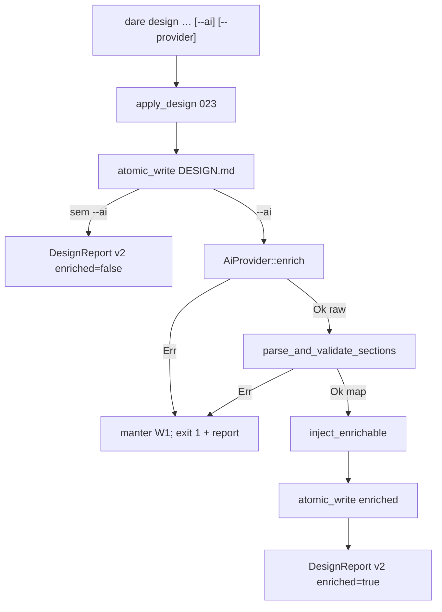

# BLUEPRINT: Fundação de enrichment por IA (Microplano 024)

> **Gerado a partir de:** `DARE/DESIGN-024-fundacao-de-enrichment-por-ia.md` v1.0  
> **Data:** 2026-07-21 | **Status:** APPROVED  
> **Arquivo:** `DARE/BLUEPRINT-024-fundacao-de-enrichment-por-ia.md`  
> **Não substitui:** Blueprints 001–023  
> **Pré-requisitos:** **006** (`dare-core::process`) · **023** (markers / `design`)  
> **Escopo:** só checklist do 024. **Não** blueprint command, `dare ai`, `AgentDriver`, API Anthropic.

---

## 0. TRADE-OFFS (Architect)

Sem `PATTERNS.md` / `patterns-facts.json`. Decisões a partir do Design 024, Doc Mestre §15/§22, TS 3.18.1 `src/ai/`, e APIs 006/023 existentes.

| # | Trade-off | Escolha | Justificativa |
|---|-----------|---------|---------------|
| T-01 | Crate | **`crates/dare-ai`** member | Microplano; isolamento vs `dare-agent` (031) |
| T-02 | Deps `dare-ai` | `dare-core` (+ serde/serde_json) | Process/redact/errors; **não** `dare-cli` / `dare-agent` / `dare-harness` |
| T-03 | Sync vs async | **Sync** `AiProvider::enrich` | `SystemProcessRunner` / `SafeCommand` são sync (006) |
| T-04 | Provider CLI MUST | **`codex`** | Default TS / Doc Mestre; RF-04 |
| T-05 | Default `--provider` | Sem flag + `--ai` → **`codex`**; testes/CI usam **`mock`** explicitamente | RF-14 |
| T-06 | Outros providers | `claude-code`, `cursor-cli`, `antigravity-cli` → `CoreError::invalid_input("provider not implemented: …")` (não silent) | RF-19 SHOULD |
| T-07 | Inject / markers | Lógica de inject em **`dare-ai`** (constantes ENRICHABLE espelhadas); CLI orquestra write | Evita ciclo `dare-ai`→`dare-cli` |
| T-08 | Pipeline write | (1) `apply_design` determinístico **sempre** escreve; (2) se `--ai`, enrich→inject→atomic_write; falha em (2) **mantém** ficheiro de (1) e exit **1** | RF-10/11 |
| T-09 | Schema resposta | JSON objeto `{ "sections": { "<id>": "<markdown body>" } }` com **4 keys** ENRICHABLE obrigatórias | RF-07/08; untrusted stdout |
| T-10 | Report | `DesignReport` **schemaVersion = 2**; campos AI sempre presentes | RF-15; breaking intencional alpha vs 023 schema 1 |
| T-11 | Timeout | `Duration::from_secs(20 * 60)` em todo spawn real | RF-06 |
| T-12 | Caps | `STDOUT_CAP=1_048_576`; `BODY_MAX=65_536` por secção; `PROMPT_LOG_MAX=256` chars em logs | RF-17 / RS-02 |
| T-13 | Overrides env | Parse `DARE_*_COMMAND` como **argv whitespace-split** (sem quotes shell); primeiro token = program | RF-05 / RS-06 |
| T-14 | Docs | Secção AI em `cli-design.md` **+** **DEC-025** | RF-18 (DEC-024 já usado pelo 023) |
| T-15 | Container Fase 1 | Reusar `docker-compose.ci.yml` | Sem imagem nova |
| T-16 | Codex argv default | `codex` + `exec` + prompt via **stdin** (não interpolar prompt na cmdline) | Reduz leak em `ps`; detalhe §5.4 |

### 0.1 Exit codes (004 + enrich)

| Code | Quando |
|------|--------|
| 0 | Sucesso (com ou sem `--ai`; enrich OK) |
| 1 | Internal **ou** falha de provider/timeout/schema **após** write determinístico |
| 2 | Usage (flags inválidas; `--provider` sem `--ai`; interactive sem TTY) |
| 4 | InvalidInput (root, desc, provider id desconhecido, caps) |
| 5 | Io |

### 0.2 GAP

| Item | Estado | Ação |
|------|--------|------|
| Markers 023 | ✅ | Reusar |
| `dare-core::process` | ✅ | Spawn |
| `crates/dare-ai` | 🔴 | Criar |
| `--ai` / `--provider` | 🔴 | Wiring CLI |
| Docs DEC-025 | 🔴 | Criar |

---

## 1. VISÃO GERAL DA ARQUITETURA



**Decisões:**

| Decisão | Escolha | Justificativa |
|---------|---------|---------------|
| Dois writes | Determinístico primeiro | Falha IA não apaga scaffold |
| Trait em crate | `dare-ai` | Separação §15.1 |
| Stdout untrusted | Schema obrigatório | RS-08 |

---

## 2. STACK TÉCNICA DEFINIDA

| Camada | Tecnologia | Versão | Papel |
|--------|-----------|--------|-------|
| Rust | 1.85.0 | pin | Build |
| Crate | `dare-ai` **0.1.0-alpha.0** | workspace | Enrichment |
| Process | `dare-core::process` | workspace | `SafeCommand`, `SystemProcessRunner`, timeout 124 |
| Redact | `dare_core::redact` | workspace | Logs/erros |
| CLI | clap **4.5.40** | workspace | `--ai`, `--provider` |
| Serde | workspace | JSON sections |
| Testes | `MockProcessRunner` + tempfile | workspace | Fake CLI |
| Container | `docker-compose.ci.yml` | 003 | Fase 1 |

**Workspace:** adicionar member + `dare-ai = { path = "crates/dare-ai" }` em `[workspace.dependencies]`.  
**dare-cli:** dep `dare-ai`.  
**Proibido:** `dare-ai` → `dare-cli`.

---

## 3. ESTRUTURA DE PASTAS E ARQUIVOS

```text
dare-cli/
├── Cargo.toml                          # member + workspace.dep dare-ai
├── crates/dare-ai/
│   ├── Cargo.toml
│   └── src/
│       ├── lib.rs                      # re-exports
│       ├── provider.rs                 # AiProvider, ProviderId, resolve
│       ├── request.rs                  # EnrichRequest, EnrichRaw
│       ├── schema.rs                   # parse_and_validate_sections
│       ├── inject.rs                   # inject_enrichable + ENRICHABLE
│       ├── mock.rs                     # MockProvider
│       ├── codex.rs                    # CodexCliProvider
│       └── redact_log.rs               # truncate+redact helpers
├── crates/dare-cli/src/
│   ├── main.rs                         # Design { ai, provider }
│   └── commands/design.rs              # run_design AI branch; DesignReport v2
├── tests/fixtures/ai/
│   ├── mock-sections-valid.json
│   ├── mock-sections-missing-key.json
│   └── mock-sections-oversize.json
├── docs/compatibility/cli-design.md    # secção AI
└── docs/DECISION-LOG.md                # DEC-025
```

> Sem `[build] target` global.

---

## 4. MODELO DE DADOS

### 4.1 Constantes (`dare-ai`)

```rust
pub const ENRICH_TIMEOUT: Duration = Duration::from_secs(20 * 60);
pub const STDOUT_CAP: usize = 1_048_576;
pub const STDERR_CAP: usize = 65_536;
pub const BODY_MAX: usize = 65_536;
pub const PROMPT_LOG_MAX: usize = 256;
pub const ENRICHABLE: &[&str] = &[
    "description",
    "objectives",
    "functional-requirements",
    "stack",
];
pub const MARKER_BEGIN: &str = "<!-- AGENT:BEGIN section=\"";
pub const MARKER_END_PREFIX: &str = "<!-- AGENT:END section=\"";

pub const ENV_CODEX: &str = "DARE_CODEX_COMMAND";
pub const ENV_CLAUDE: &str = "DARE_CLAUDE_COMMAND";
pub const ENV_CURSOR: &str = "DARE_CURSOR_COMMAND";
pub const ENV_ANTIGRAVITY: &str = "DARE_ANTIGRAVITY_COMMAND";
```

### 4.2 `ProviderId`

```rust
#[derive(Debug, Clone, Copy, PartialEq, Eq)]
pub enum ProviderId {
    Mock,
    Codex,
    ClaudeCode,    // not implemented → InvalidInput at resolve
    CursorCli,
    AntigravityCli,
}

impl ProviderId {
    pub fn parse(s: &str) -> CoreResult<Self>; // "mock"|"codex"|"claude-code"|"cursor-cli"|"antigravity-cli"
    pub fn as_str(self) -> &'static str;
}
```

Unknown string → `InvalidInput("unknown provider: {s}")`.

### 4.3 `EnrichRequest`

| Campo | Tipo | Semântica |
|-------|------|-----------|
| `command` | `String` | Sempre `"design"` neste ciclo |
| `title` | `String` | Título do design |
| `description` | `String` | Descrição user |
| `current_markdown` | `String` | Conteúdo pós-023 (para contexto; mock pode ignorar) |
| `cwd` | `Option<(ProjectRoot, SafeRelativePath)>` | Cwd do spawn = project root `"."` |

### 4.4 `EnrichRaw`

| Campo | Tipo | Semântica |
|-------|------|-----------|
| `stdout` | `String` | Texto bruto (JSON esperado) |
| `stderr_redacted` | `String` | Já redigido/truncado |
| `exit_code` | `i32` | Do processo; mock = 0 |

### 4.5 `SectionsMap`

`BTreeMap<String, String>` — keys exatamente as 4 ENRICHABLE; values = body **dentro** do marker (sem linhas BEGIN/END).

### 4.6 `DesignReport` schema **2** (congelado — substitui schema 1 do 023)

| Campo JSON | Tipo | Semântica |
|------------|------|-----------|
| `schemaVersion` | `u32` | **`2`** |
| `mode` | `String` | `"design"` |
| `ok` | `bool` | `true` se exit 0 path |
| `path` | `String` | `"DARE/DESIGN.md"` |
| `action` | `String` | `"created"` \| `"updated"` |
| `title` | `String` | |
| `markerCount` | `u32` | |
| `preservedRegions` | `u32` | |
| `interactive` | `bool` | |
| `warnings` | `Vec<String>` | |
| `ai` | `bool` | eco `--ai` |
| `provider` | `String \| null` | id se `ai`; senão `null` |
| `enriched` | `bool` | `true` só se inject+write2 OK |

Constante CLI: `DESIGN_SCHEMA_VERSION: u32 = 2`.

Atualizar smokes 023 que assertam `schemaVersion==1` → **`==2`**.

---

## 5. CONTRATOS DE API (anti-stub)

### 5.1 Trait e resolve

```rust
pub trait AiProvider: Send + Sync {
    fn id(&self) -> ProviderId;
    fn enrich(&self, req: &EnrichRequest) -> CoreResult<EnrichRaw>;
}

pub fn resolve_provider(id: ProviderId) -> CoreResult<Box<dyn AiProvider>>;
// Mock → MockProvider
// Codex → CodexCliProvider::from_env()
// outros → Err(invalid_input("provider not implemented: …"))
```

### 5.2 `parse_argv_override(env_val: &str) -> CoreResult<(String, Vec<String>)>`

- Trim; empty → InvalidInput  
- Split em whitespace Unicode (`split_whitespace`)  
- `parts[0]` = program; `parts[1..]` = args  
- **Não** interpretar aspas/`$`/`|`  

### 5.3 `MockProvider`

```rust
pub struct MockProvider;

impl AiProvider for MockProvider {
    fn id(&self) -> ProviderId { ProviderId::Mock }
    fn enrich(&self, req: &EnrichRequest) -> CoreResult<EnrichRaw> {
        // stdout = JSON estável:
        // sections.description = req.description (eco)
        // sections.objectives = "| # | Objetivo | … |\n| O-01 | Generated by mock | | |"
        // sections.functional-requirements = tabela stub 1 linha com título
        // sections.stack = "| Camada | Tecnologia | Versão |\n| Runtime | mock | 0 |"
        // Sem spawn. Determinístico para mesmo req.title+description.
    }
}
```

### 5.4 `CodexCliProvider`

```rust
pub struct CodexCliProvider {
    program: String,
    base_args: Vec<String>,
}

impl CodexCliProvider {
    pub fn from_env() -> CoreResult<Self> {
        // se DARE_CODEX_COMMAND set → parse_argv_override
        // senão program="codex", base_args=["exec"]
    }
}

impl AiProvider for CodexCliProvider {
    fn enrich(&self, req: &EnrichRequest) -> CoreResult<EnrichRaw> {
        // 1. Montar prompt texto (en-US) pedindo JSON schema §5.5; incluir title+description;
        //    NÃO incluir secrets; truncar current_markdown a 32KiB no prompt se necessário.
        // 2. SafeCommand::new(program).args(base_args)
        //       .timeout(ENRICH_TIMEOUT)
        //       .stdout_limit(STDOUT_CAP).stderr_limit(STDERR_CAP)
        //       .cwd(root, SafeRelativePath::new(".")?)
        // 3. Escrever prompt em stdin do filho — se SafeCommand ainda não expõe stdin,
        //    usar arg "--prompt" / arquivo temp sob root `.dare/tmp-enrich-*.txt` via atomic_write
        //    + arg path; **preferir** extensão mínima em dare-core se stdin já suportado;
        //    CONGELADO fallback: arquivo temp relativo `.dare/enrich-prompt.txt` + arg `@path`
        //    ou `exec` com último arg = path do prompt file (documentar em DEC-025).
        //    Escolha executável: **prompt file** `DARE/.enrich-prompt-<pid>.txt` sob jail,
        //    arg extra = path relativo; apagar best-effort após run.
        // 4. SystemProcessRunner.run(&cmd)
        // 5. exit timeout/124 → Err(internal ou invalid: "provider timed out"))
        // 6. exit != 0 → Err com stderr redactado (cap 512)
        // 7. Ok(EnrichRaw { stdout, stderr_redacted: redact(stderr), exit_code })
    }
}
```

> Se `SafeCommand` ganhar `.stdin_bytes(Vec<u8>)` neste ciclo (pequeno patch 006-compat em `dare-core`), preferir stdin e **não** gravar prompt em disco. Decisão de implementação: **tentar stdin no Process API**; se custo alto, prompt file sob `.dare/` com delete.

**Congelado para tasks:** implementar **`.stdin(Vec<u8>)` opcional em `SafeCommand` + runner** (extensão 006) **ou** prompt file. Critério: testes com `MockProcessRunner` não precisam stdin real; teste Codex usa `MockProcessRunner` + assert argv contém program.

### 5.5 Schema JSON (stdout)

**Válido:**

```json
{
  "sections": {
    "description": "API de pagamentos com Stripe",
    "objectives": "| # | Objetivo | Métrica verificável | Meta |\n|---|----------|---------------------|------|\n| O-01 | Checkout | taxa sucesso | > 99% |",
    "functional-requirements": "| ID | Requisito | Prioridade | Critério de aceite |\n|----|-----------|------------|--------------------|\n| RF-01 | Cobrar cartão | MUST | webhook 2xx |",
    "stack": "| Camada | Tecnologia | Versão |\n|--------|-----------|--------|\n| Backend | Rust | 1.85 |"
  }
}
```

**`parse_and_validate_sections(stdout: &str) -> CoreResult<BTreeMap<String, String>>`:**

1. `serde_json::from_str` → Value; Err → InvalidInput `"enrichment response is not JSON"`  
2. `sections` object obrigatório  
3. Para cada id em `ENRICHABLE`: key presente; value string; trim non-empty; `len() <= BODY_MAX`  
4. Rejeitar keys extras em `sections` **ou** ignorar extras — **congelar: ignorar extras**, exigir as 4  
5. Body não pode conter a substring `AGENT:BEGIN` / `AGENT:END` (evita marker nesting) → InvalidInput  

### 5.6 `inject_enrichable(markdown: &str, sections: &BTreeMap<String, String>) -> CoreResult<String>`

1. Para cada id: localizar `<!-- AGENT:BEGIN section="{id}" -->` … `<!-- AGENT:END section="{id}" -->`  
2. Ausência de par → InvalidInput `"missing AGENT markers for section {id}"`  
3. BEGIN sem END → InvalidInput `"malformed AGENT markers"`  
4. Substituir **somente** o interior (entre BEGIN e END lines), preservando as linhas marker  
5. Texto fora intacto  
6. Retornar markdown completo  

### 5.7 Pipeline CLI `run_design(…, ai: bool, provider: Option<String>)`

```rust
// pseudo
let report = apply_design(root, &input)?; // write1
if !ai {
  return Ok(report_v2(report, ai:false, provider:None, enriched:false));
}
let pid = match provider {
  None => ProviderId::Codex,
  Some(s) => ProviderId::parse(&s)?,
};
let prov = resolve_provider(pid)?;
let md = read_design_capped(...)?; // pós-write1
let raw = match prov.enrich(&EnrichRequest { ... }) {
  Ok(r) => r,
  Err(e) => return enrich_fail(report, pid, e), // exit 1 path
};
let sections = match parse_and_validate_sections(&raw.stdout) {
  Ok(s) => s,
  Err(e) => return enrich_fail(...),
};
let injected = inject_enrichable(&md, &sections)?;
atomic_write(DESIGN_REL, injected)?;
Ok(report_v2(..., enriched:true, provider:Some(pid.as_str())))
```

`enrich_fail`: ficheiro write1 intacto; `CoreError` com message redactada **ou** retornar report `ok=false` — **congelar:** retornar `Err(e)` tipado (Internal se timeout/spawn; InvalidInput se schema) para `write_error` → exit 1/4; documento write1 preservado.

### 5.8 Clap

```rust
Design {
    description: Vec<String>,
    interactive: bool,
    #[arg(long)]
    ai: bool,
    #[arg(long)]
    provider: Option<String>,
}
```

Regras:
- `provider.is_some() && !ai` → Usage `"--provider requires --ai"`  
- Restante igual 023  

### 5.9 Human output (extensão)

```text
design: ok
path: DARE/DESIGN.md
action: created
title: My API
markerCount: 4
preservedRegions: 0
ai: true
provider: mock
enriched: true
mode: design
```

### 5.10 Redact logs

- `tracing`/`debug`: prompt ≤ `PROMPT_LOG_MAX` + `redact()`  
- Nunca logar `stdout` completo em info; em error só `redact(truncate(stderr, 512))`  
- Teste: string com `api_key=secret` no stderr fictício não aparece raw no Display do erro  

### 5.11 Testes unitários MUST (`dare-ai`)

| Teste | Assert |
|-------|--------|
| `provider_id_parse` | mock/codex/unknown |
| `mock_enrich_deterministic` | duas chamadas iguais |
| `parse_valid_sections` | 4 keys |
| `parse_rejects_missing_key` | Err |
| `parse_rejects_oversize_body` | Err |
| `parse_rejects_nested_markers` | Err |
| `inject_replaces_only_bodies` | unmanaged paragraph sobrevive |
| `inject_missing_marker_errors` | Err |
| `argv_override_split` | `DARE_CODEX_COMMAND` |
| `resolve_unimplemented_provider_errors` | claude-code Err |

### 5.12 Testes / smokes CLI MUST

| Teste | Assert |
|-------|--------|
| `design_without_ai_schema_v2` | schemaVersion 2; enriched false; ai false |
| `design_ai_mock_enriches` | `--ai --provider mock` → bodies mock; enriched true; exit 0 |
| `design_ai_schema_fail_keeps_file` | mock/custom fail path: ficheiro ainda tem AGENT markers pré-enrich; exit ≠ 0 |
| `design_provider_without_ai_usage` | exit 2 |
| `design_unknown_provider` | exit 4 |

Para schema_fail: provider de teste que devolve JSON inválido — pode ser `MockProvider` variant **ou** env override apontando a um binário fake nos testes (script/`MockProcessRunner` injetável). **Congelado:** `MockProvider` com `std::env::var("DARE_AI_MOCK_MODE")` = `invalid-json` só em `cfg(test)` **ou** função `MockProvider::invalid()` usada só em unit na crate; smoke CLI: unit test do pipeline `enrich_fail` em `design.rs` + smoke mock happy path.

### 5.13 Docs

Atualizar `docs/compatibility/cli-design.md`:
- Flags `--ai`, `--provider`
- Default provider `codex`
- Pipeline + non-corrupt
- Env overrides
- Schema JSON sections
- Exit codes enrich
- DEC-025

**DEC-025:** enrichment opcional; crate `dare-ai`; mock+codex; schema v2 report; timeout 20m; inject markers only.

---

## 6. PLANO DE EXECUÇÃO (FASES)

### Fase 1: Containerização ← **SEMPRE PRIMEIRA**

- **DONE:** `docker compose -f docker-compose.ci.yml config` exit 0 **ou** waiver docs.  
- **Entregáveis:** nota Local verify.

### Fase 2: Scaffold `dare-ai` + tipos + schema + inject

- **DONE:** crate no workspace; `ProviderId`, `EnrichRequest`/`EnrichRaw`; `parse_and_validate_sections`; `inject_enrichable`; testes §5.11 (exceto mock/codex spawn).  
- **Entregáveis:** `crates/dare-ai` base.

### Fase 3: MockProvider + resolve

- **DONE:** `MockProvider`; `resolve_provider`; testes mock + unimplemented.  
- **Entregáveis:** `mock.rs`, `provider.rs`.

### Fase 4: CodexCliProvider + overrides + timeout (+ stdin/file)

- **DONE:** `from_env`; timeout 20m; caps; testes argv override + MockProcessRunner path.  
- **Entregáveis:** `codex.rs`; patch `SafeCommand` stdin **se** necessário.

### Fase 5: CLI `--ai` / `--provider` + DesignReport v2 + smokes

- **DONE:** clap; pipeline §5.7; smokes §5.12; atualizar asserts schema 1→2.  
- **Entregáveis:** `main.rs`, `design.rs`.

### Fase 6: Docs DEC-025

- **DONE:** `cli-design.md` AI + DEC-025.  
- **Entregáveis:** docs.

### Fase 7: Auditoria ← **N-1**

- **DONE:** fmt / clippy -D warnings / test --workspace / audit / deny = 0.

### Fase 8: Fechamento ← **N**

- **DONE:** TASKS 024 100%; próximo → **025**.

---

## 7. VALIDATION GATES POR STACK

| Stack | Build | Test | Lint / Audit |
|-------|-------|------|--------------|
| Rust | `cargo build -p dare-ai -p dare-cli` | `cargo test -p dare-ai` + `cargo test -p dare-cli -- design` | `fmt --check` · `clippy --workspace --all-features -- -D warnings` · `audit` · `deny` |

---

## 8. CONTROLES DE SEGURANÇA (RS → fases)

| RS | Fase | Verificação |
|----|------|-------------|
| RS-01 | 2–5 | parse provider; BODY_MAX; inject |
| RS-02 | 4–5 | redact_log + testes |
| RS-03 | 5 | write1 + write2 atomic; fail keeps write1 |
| RS-04 | 7 | audit + deny |
| RS-05 | 4 | sem API key no DARE; env filho só se necessário |
| RS-06 | 4 | SafeCommand argv-only |
| RS-07 | 5 | DESIGN_REL jail |
| RS-08 | 2 | schema before inject |
| RS-09 | 2 | markers comment-only; reject nested AGENT |

---

## 9. ESTRATÉGIA DE TESTES

| Tipo | Como |
|------|------|
| Unit dare-ai | §5.11 |
| Unit/smoke CLI | §5.12 |
| Processo | MockProcessRunner / fake timeout |
| Segurança | oversize, nested markers, redact |
| Compat | tabela vs TS em docs (Class A/B/C) |

---

## 10. ESTRATÉGIA DE DEPLOY

| Ambiente | Trigger | Artefacto |
|----------|---------|-----------|
| Local | dev | `cargo run -p dare-cli -- design "…" --ai --provider mock` |
| CI | PR | smokes mock; sem codex real obrigatório |
| Alpha | 015 | binário com `--ai` |

---

## 11. CHECKLIST DE APROVAÇÃO DO BLUEPRINT

- [ ] Escopo estrito 024 (sem 025/031/050)
- [ ] Default provider **codex**; CLI real = codex; mock para CI
- [ ] Schema JSON sections + inject anti-stub
- [ ] DesignReport **v2** + migração smokes 023
- [ ] Falha enrich não corrompe (write1 preserved)
- [ ] Fases 1→8 com DONE verificáveis
- [ ] RS mapeados
- [ ] Pronto para `/dare-tasks` → `TASKS-024` + `dare-dag-024.yaml` + `EXECUTION-024/`

---

## 12. PRÓXIMAS ETAPAS

1. Aprovar este Blueprint.  
2. `/dare-tasks` sobre `DARE/BLUEPRINT-024-fundacao-de-enrichment-por-ia.md`.  
3. Executar DAG `mp024-*`.  
4. Closeout → [`025-blueprint.md`](../DARE-RUST-MICRO-PLANOS/DARE-RUST-MICRO-PLANOS/025-blueprint.md).
