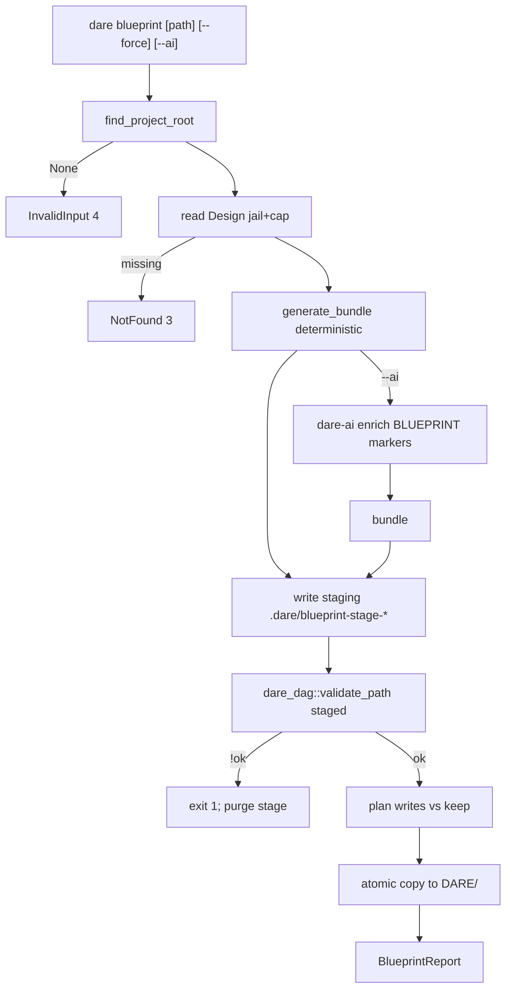

# BLUEPRINT: Comando `dare blueprint` (Microplano 025)

> **Gerado a partir de:** `DARE/DESIGN-025-blueprint.md` v1.0  
> **Data:** 2026-07-21 | **Status:** APPROVED  
> **Arquivo:** `DARE/BLUEPRINT-025-blueprint.md`  
> **Não substitui:** Blueprints 001–024  
> **Pré-requisitos:** **020**, **023**, **024**  
> **Escopo:** só checklist do 025. **Não** execute/viz/refine/review.

---

## 0. TRADE-OFFS (Architect)

Sem `PATTERNS.md` / `patterns-facts.json`. Decisões a partir do Design 025, Doc Mestre §23, validate 020, preserve 023, update keep 022, AI 024.

| # | Trade-off | Escolha | Justificativa |
|---|-----------|---------|---------------|
| T-01 | Código | **`dare-cli/src/commands/blueprint.rs`** | Paths do microplano |
| T-02 | Outputs | Sempre canónicos: `DARE/BLUEPRINT.md`, `TASKS.md`, `dare-dag.yaml`, `EXECUTION/` | Doc Mestre / TS; path arg só no **input** Design |
| T-03 | Design ausente | **`CoreError::not_found`** → exit **3** | Preferência Design RF-04 |
| T-04 | Managed marker | Primeira linha útil: `<!-- dare:managed -->` (md) ou `# dare:managed` (yaml) | Detectar customizado sem hash manifest |
| T-05 | Sem `--force` | Existe + **sem** marker managed → **keep** + warning; missing ou managed → write | Espírito update keep; aceite microplano |
| T-06 | Staging | Gerar tudo em `.dare/blueprint-stage-<pid>/` → `validate_path` no DAG staged → só então copiar para `DARE/` | All-or-nothing; sem DAG inválido live |
| T-07 | Validate fail | Não promove staging; exit **1** + embutir/resumir ValidationReport; staging removido best-effort | RF-10 / R-03 |
| T-08 | Heurística tasks | Algoritmo §5.4 (fix) — sem LLM obrigatório | RNF-01 |
| T-09 | `--ai` | **Implementar** flags SHOULD; enrich só `BLUEPRINT.md` via markers AGENT (4 secções blueprint); default provider = **codex**; CI smokes usam **mock** | Flags partilhadas Mestre + 024 |
| T-10 | Caps | `DESIGN_READ_CAP = 262_144`; `ARTIFACT_WRITE_CAP = 1_048_576` por ficheiro | RS-06 |
| T-11 | Report | `BlueprintReport` **schemaVersion 1** | RF-16 |
| T-12 | Docs | `cli-blueprint.md` + **DEC-026** | RF-18 |
| T-13 | Capability | `cli_commands: ["blueprint"]` | RF-14 |
| T-14 | Container Fase 1 | Reusar compose CI | Sem imagem nova |
| T-15 | Models no DAG | Copiar bloco `models:` canónico do template 020 (cursor/claude/antigravity) | Validate + paridade |
| T-16 | Limits no DAG | `parent_context_chars: 2000`, `task_output_chars: 4000`, `timeout_seconds: 600` | Schema v2.1 |

### 0.1 Exit codes

| Code | Quando |
|------|--------|
| 0 | Sucesso (validate ok; writes promovidos) |
| 1 | Validate DAG falhou **ou** Internal |
| 2 | Usage (`--provider` sem `--ai`) |
| 3 | Design path NotFound |
| 4 | InvalidInput (root, oversize, path jail, Design vazio) |
| 5 | Io |

### 0.2 GAP

| Item | Estado | Ação |
|------|--------|------|
| Template BLUEPRINT | ✅ | Preencher |
| `dare_dag::validate_path` | ✅ | Pós-stage |
| `dare-ai` | ✅ | `--ai` opcional |
| `Commands::Blueprint` | 🔴 | Implementar |
| Heurística + staging | 🔴 | Implementar |
| Docs DEC-026 | 🔴 | Criar |

---

## 1. VISÃO GERAL DA ARQUITETURA



**Decisões:**

| Decisão | Escolha | Justificativa |
|---------|---------|---------------|
| Stage-then-validate | Sim | Nunca deixa `dare-dag.yaml` inválido como único artefato live |
| Keep unmanaged | Marker ausente | Aceite “sem --force não sobrescreve customizações” |
| AI opcional | Pós-render blueprint | Path determinístico sempre funciona |

---

## 2. STACK TÉCNICA DEFINIDA

| Camada | Tecnologia | Versão | Papel |
|--------|-----------|--------|-------|
| Rust | 1.85.0 | pin | Build |
| CLI | clap **4.5.40** | workspace | Superfície |
| Validate | `dare-dag` | workspace | `validate_path` |
| AI | `dare-ai` | workspace | `--ai` |
| FS/path | `dare-core` | workspace | Jail, atomic, process |
| Root | `dare-project` | workspace | Walk |
| Assets | `dare-assets` | workspace | Templates |
| YAML | `serde_yaml` (já no workspace via contracts/dag) | emit DAG | |
| Testes | tempfile | workspace | Fixtures |
| Container | `docker-compose.ci.yml` | 003 | Fase 1 |

**Deps `dare-cli`:** já tem dare-dag / dare-ai após 020/024; blueprint só orquestra.

---

## 3. ESTRUTURA DE PASTAS E ARQUIVOS

```text
dare-cli/
├── crates/dare-cli/src/
│   ├── main.rs                         # Commands::Blueprint
│   ├── commands/mod.rs
│   └── commands/blueprint.rs           # generate, stage, promote, report
├── crates/dare-cli/tests/cli_smoke.rs  # blueprint_* smokes
├── assets/capability-matrix.yml        # cli_commands: ["blueprint"]
├── assets/capabilities/dare-blueprint/ # README se vazio
├── assets/templates/BLUEPRINT-template.md
├── tests/fixtures/blueprint/
│   ├── sample-design.md
│   ├── golden-dag.yaml                 # estrutura (ids/ordem)
│   └── golden-tasks-fragment.md
├── docs/compatibility/cli-blueprint.md
└── docs/DECISION-LOG.md                # DEC-026
```

---

## 4. MODELO DE DADOS

### 4.1 Constantes

```rust
pub const DEFAULT_DESIGN_REL: &str = "DARE/DESIGN.md";
pub const OUT_BLUEPRINT: &str = "DARE/BLUEPRINT.md";
pub const OUT_TASKS: &str = "DARE/TASKS.md";
pub const OUT_DAG: &str = "DARE/dare-dag.yaml";
pub const OUT_EXEC_DIR: &str = "DARE/EXECUTION";
pub const BLUEPRINT_SCHEMA_VERSION: u32 = 1; // report
pub const DESIGN_READ_CAP: usize = 262_144;
pub const ARTIFACT_WRITE_CAP: usize = 1_048_576;
pub const MANAGED_MD: &str = "<!-- dare:managed -->";
pub const MANAGED_YAML: &str = "# dare:managed";
/// Blueprint enrichable section ids (stable):
pub const BP_ENRICHABLE: &[&str] = &[
    "architecture-overview",
    "execution-phases",
    "api-contracts",
    "data-model",
];
```

### 4.2 `BlueprintInput`

| Campo | Tipo | Semântica |
|-------|------|-----------|
| `design_rel_or_abs` | `Option<PathBuf>` | None → DEFAULT_DESIGN_REL |
| `force` | `bool` | |
| `ai` | `bool` | |
| `provider` | `Option<String>` | requer `ai` |

### 4.3 `GeneratedBundle`

| Campo | Tipo | Semântica |
|-------|------|-----------|
| `blueprint_md` | `String` | |
| `tasks_md` | `String` | |
| `dag_yaml` | `String` | |
| `specs` | `BTreeMap<String, String>` | rel path under EXECUTION → body |
| `task_ids` | `Vec<String>` | ordem estável |

### 4.4 `BlueprintReport` schema **1** (congelado)

| Campo JSON | Tipo | Semântica |
|------------|------|-----------|
| `schemaVersion` | `u32` | `1` |
| `mode` | `String` | `"blueprint"` |
| `ok` | `bool` | |
| `designPath` | `String` | POSIX rel se possível |
| `force` | `bool` | |
| `ai` | `bool` | |
| `provider` | `String\|null` | |
| `enriched` | `bool` | AI inject OK |
| `written` | `Vec<String>` | paths escritos nesta run |
| `kept` | `Vec<String>` | skipped unmanaged |
| `taskCount` | `u32` | |
| `validateOk` | `bool` | eco validate |
| `warnings` | `Vec<String>` | |
| `validation` | `Value\|null` | opcional: ValidationReport resumido se fail |

---

## 5. CONTRATOS DE API (anti-stub)

### 5.1 Clap

```rust
Blueprint {
    /// Optional path to DESIGN.md (default DARE/DESIGN.md).
    design: Option<PathBuf>,
    #[arg(long)]
    force: bool,
    #[arg(long)]
    ai: bool,
    #[arg(long)]
    provider: Option<String>,
}
```

- `provider.is_some() && !ai` → Usage `"--provider requires --ai"`

### 5.2 Funções públicas

```rust
pub fn is_managed_markdown(content: &str) -> bool; // trim_start contains MANAGED_MD in first 3 non-empty lines
pub fn is_managed_yaml(content: &str) -> bool;

pub fn parse_design_title(design: &str) -> String;
// first line matching ^#\s+DESIGN:\s*(.+) or first H1; else "Untitled"

pub fn extract_must_requirements(design: &str) -> Vec<(String, String)>;
// rows in RF table where priority cell is MUST → (id, requisito text); max 8; stable order

pub fn generate_bundle(design: &str, title: &str) -> CoreResult<GeneratedBundle>;
// §5.3–5.5

pub fn maybe_enrich_blueprint(bundle: &mut GeneratedBundle, provider: ProviderId, ...) -> CoreResult<bool>;
// se markers presentes; inject; enriched flag

pub fn stage_and_validate(root: &ProjectRoot, bundle: &GeneratedBundle) -> CoreResult<ValidationReport>;
// write staging; validate_path; return report

pub fn promote(
    root: &ProjectRoot,
    bundle: &GeneratedBundle,
    force: bool,
) -> CoreResult<(Vec<String> /*written*/, Vec<String> /*kept*/)>;

pub fn run_blueprint(input: BlueprintInput) -> CoreResult<(String, Value)>;
pub fn format_human(r: &BlueprintReport) -> String;
pub fn report_to_json(r: &BlueprintReport) -> Value;
```

### 5.3 `generate_bundle` — BLUEPRINT.md

1. Prefixo `MANAGED_MD\n\n`
2. Preencher a partir do Design + skeleton do `BLUEPRINT-template.md`:
   - Título `# BLUEPRINT: {title}`
   - Meta versão/data/`Status: DRAFT` (data volátil; testes `fixed_date`)
   - Secções 1–N do template com markers AGENT nos `BP_ENRICHABLE`:
     - `architecture-overview` ← resumo descrição Design
     - `data-model` ← tabela RFs stub ou “[Derived from DESIGN RF table]”
     - `api-contracts` ← “[A definir — derived in later refinement]” ou lista RF ids
     - `execution-phases` ← lista das fases geradas pelas tasks
   - Copiar tabelas RF/RNF/RS/Stack do Design para anexos quando presentes (regex/heading scan)
3. Comprimento ≤ `ARTIFACT_WRITE_CAP` senão InvalidInput

### 5.4 Heurística TASKS + DAG + EXECUTION (determinística)

**Sempre emitir:**

| id | title | depends_on | complexity |
|----|-------|------------|------------|
| `task-001` | Verify docker-compose / container baseline | `[]` | LOW |
| `task-002` | Implement core from design | `[]` | MED |

**Por cada RF-MUST** (máx 8, ordem do ficheiro):  
`task-{003+i}` title = `RF-xx: {requisito trunc 60}`, `depends_on: ["task-002"]`, `complexity: MED`

**Sempre no fim:**

| id | title | depends_on | complexity |
|----|-------|------------|------------|
| `task-audit` | Ralph audit fmt/clippy/test | todos os ids anteriores excepto close | MED |
| `task-close` | Closeout checklist | `["task-audit"]` | LOW |

**`subtask_prompt`:** self-contained en-US, ≥ 80 chars, inclui title + “Follow DARE/BLUEPRINT.md; no git commit.”

**`spec_file`:** `EXECUTION/{id}.md`

**`dare-dag.yaml`:**

```yaml
# dare:managed
title: "{title} - Development Tasks"
version: "1.0.0"
limits: { parent_context_chars: 2000, task_output_chars: 4000, timeout_seconds: 600 }
models:
  cursor:      { HIGH: gpt-5.3-codex,     MED: composer-2,       LOW: auto-low }
  claude:      { HIGH: claude-sonnet-4-5, MED: claude-haiku-4,   LOW: claude-haiku-4 }
  antigravity: { HIGH: gemini-2.5-pro,    MED: gemini-2.5-flash, LOW: gemini-2.5-flash }
tasks: [...]
```

**`TASKS.md`:** tabela Status PENDING + lista por fase; prefixo `MANAGED_MD`.

**`EXECUTION/{id}.md`:** template mínimo:

```markdown
<!-- dare:managed -->
# Task {id}: {title}

## Objetivo
{title}

## Validation Gates
- [ ] Behavior matches BLUEPRINT
- [ ] Tests pass for this task scope
- [ ] No git commit

## Definition of Done (ANTI-STUB)
- [ ] No todo!/unimplemented in public paths
- [ ] No git commit
```

### 5.5 Staging + validate + promote

1. `stage_dir = .dare/blueprint-stage-{pid}/DARE/...` espelhando outputs  
2. Escrever bundle completo no stage (force implícito no stage)  
3. `dare_dag::validate_path(root, staged_dag_rel, ValidateOptions{strict:false})`  
   - Nota: `validate_path` resolve sob root — passar path relativo stage **ou** API que aceite path absoluto jail; se API só aceita sob DARE/, validar lendo YAML em memória via `validate_dag(load_yaml)` **congelado preferir:** `validate_dag` sobre doc parseado do staging (sem exigir path live) + `validate_path` após promote como segunda verificação  
4. **Congelado executável:**  
   - Parse YAML staged → `validate_dag`  
   - Se `!report.ok` → Err interno/validate; **não** promote; purge stage; CLI exit 1 com JSON validation embutido  
   - Se ok → `promote`  
5. `promote` por ficheiro:
   - Se `!force` && exists && !managed → push `kept`, skip  
   - Senão `atomic_write` destino; push `written`  
6. Purge stage best-effort  
7. Opcional: `validate_path(DEFAULT_DAG_REL)` pós-promote; se fail (raro) → Internal exit 1 + warning (ficheiros já escritos — documentar; staging previa reduz risco)

### 5.6 `--ai`

1. Após `generate_bundle`, se `ai`:  
   `resolve_provider` (default Codex; smokes mock)  
   `EnrichRequest { command: "blueprint", title, description: design excerpt, current_markdown: blueprint_md, cwd }`  
   validate sections com keys = `BP_ENRICHABLE` (**estender** `parse_and_validate_sections` para aceitar lista de ids **ou** função `parse_sections_for(ids: &[&str])` em dare-ai — **MUST** neste ciclo se `--ai` implementado)  
2. `inject_enrichable` genérico já usa ENRICHABLE fixo em 024 — **congelado:** adicionar em `dare-ai`  
   `pub fn inject_sections(markdown, sections, ids: &[&str])`  
   e `parse_and_validate_sections_with(stdout, ids)`  
   Mantém ENRICHABLE design como default wrapper.  
3. Falha AI → **não** aborta bundle determinístico: warning + `enriched=false` (diferente de design 024 hard-fail) — **congelado soft-fail** para blueprint alpha (gera artefatos mesmo se AI falhar).  
4. Se soft-fail AI, ainda stage/validate/promote o determinístico.

### 5.7 Human output

```text
blueprint: ok
designPath: DARE/DESIGN.md
taskCount: 5
written: 4
kept: 0
validateOk: true
force: false
ai: false
enriched: false
mode: blueprint
```

### 5.8 Testes unitários MUST

| Teste | Assert |
|-------|--------|
| `parse_design_title` | |
| `extract_must_requirements_stable` | |
| `generate_bundle_has_managed_markers` | |
| `generate_bundle_rank0_at_least_2` | task-001 e task-002 deps [] |
| `is_managed_detects_marker` | |
| `promote_keeps_unmanaged_without_force` | |
| `promote_overwrites_managed_without_force` | |
| `promote_force_overwrites_unmanaged` | |
| `validate_rejects_bad_bundle` | (mutar yaml) |
| `report_schema_version_1` | |

### 5.9 Smokes MUST

| Teste | Assert |
|-------|--------|
| `blueprint_creates_artifacts` | exit 0; 4 paths; validate ok |
| `blueprint_json_schema` | schemaVersion 1; mode blueprint |
| `blueprint_missing_design_not_found` | exit 3 |
| `blueprint_keep_custom_without_force` | custom BLUEPRINT sem marker preservado; warning |
| `blueprint_force_overwrites` | |
| `blueprint_provider_without_ai_usage` | exit 2 |
| `blueprint_ai_mock_soft_or_enrich` | `--ai --provider mock` exit 0 |

### 5.10 Docs DEC-026

Flags; paths; managed marker; staging; heuristic; soft-fail AI; exit codes; BlueprintReport; classification vs TS; Local verify compose.

---

## 6. PLANO DE EXECUÇÃO (FASES)

### Fase 1: Containerização ← **PRIMEIRA**

- **DONE:** compose config exit 0 **ou** waiver docs.  
- **Entregáveis:** nota Local verify.

### Fase 2: Tipos + generate_bundle + heurística + fixtures

- **DONE:** parse/extract/generate; testes §5.8 (exceto promote/validate integrados).  
- **Entregáveis:** núcleo `blueprint.rs`.

### Fase 3: Staging + validate + promote keep/force

- **DONE:** stage/validate_dag/promote; testes keep/force/validate.  
- **Entregáveis:** I/O.

### Fase 4: CLI wiring + smokes (+ AI soft + dare-ai with-ids se necessário)

- **DONE:** clap; smokes §5.9; `parse_and_validate_sections_with` / `inject_sections` se `--ai`.  
- **Entregáveis:** `main.rs`, smokes, patch `dare-ai` mínimo.

### Fase 5: Capability matrix

- **DONE:** `cli_commands: ["blueprint"]`; README asset se preciso; hashes manifest se matrix mudar.  
- **Entregáveis:** matrix.

### Fase 6: Docs DEC-026

- **DONE:** `cli-blueprint.md` + DEC-026.

### Fase 7: Auditoria ← **N-1**

- **DONE:** fmt / clippy -D / test --workspace / audit / deny = 0.

### Fase 8: Fechamento ← **N**

- **DONE:** TASKS 025 100%; próximo → **026**.

---

## 7. VALIDATION GATES POR STACK

| Stack | Build | Test | Lint / Audit |
|-------|-------|------|--------------|
| Rust | `cargo build -p dare-cli` | `cargo test -p dare-cli -- blueprint` + smokes | `fmt --check` · `clippy -D warnings` · `audit` · `deny` |

---

## 8. CONTROLES DE SEGURANÇA (RS → fases)

| RS | Fase | Verificação |
|----|------|-------------|
| RS-01 | 2–4 | path jail; Design resolve |
| RS-02 | 4 | redact; sem dump Design |
| RS-03 | 3 | staging + atomic promote |
| RS-04 | 7 | audit/deny |
| RS-05 | 4 | AI sem API key CLI |
| RS-06 | 2–3 | caps |
| RS-07 | 2 | texto only |
| RS-08 | 2 | prompts sem secrets |

---

## 9. ESTRATÉGIA DE TESTES

| Tipo | Como |
|------|------|
| Unit | §5.8 |
| Smoke | §5.9 |
| Validate | bundle → validate_dag ok |
| Segurança | oversize; jail; keep |
| Capability | matrix validate |

---

## 10. ESTRATÉGIA DE DEPLOY

| Ambiente | Trigger | Artefacto |
|----------|---------|-----------|
| Local | `dare blueprint` | artefatos DARE/ |
| CI | PR | smokes blueprint* |
| Alpha | 015 | binário |

---

## 11. CHECKLIST DE APROVAÇÃO DO BLUEPRINT

- [ ] Escopo estrito 025
- [ ] T-03…T-07 congelados (NotFound, managed, staging, soft-fail AI)
- [ ] Heurística §5.4 anti-stub
- [ ] BlueprintReport schema 1
- [ ] Fases 1→8 DONE verificáveis
- [ ] Pronto para `/dare-tasks` → `TASKS-025` + `dare-dag-025.yaml` + `EXECUTION-025/`

---

## 12. PRÓXIMAS ETAPAS

1. Aprovar este Blueprint.  
2. `/dare-tasks` sobre `DARE/BLUEPRINT-025-blueprint.md`.  
3. Executar DAG `mp025-*`.  
4. Closeout → [`026-dag-parser-ranks-e-state-store.md`](../DARE-RUST-MICRO-PLANOS/DARE-RUST-MICRO-PLANOS/026-dag-parser-ranks-e-state-store.md).
