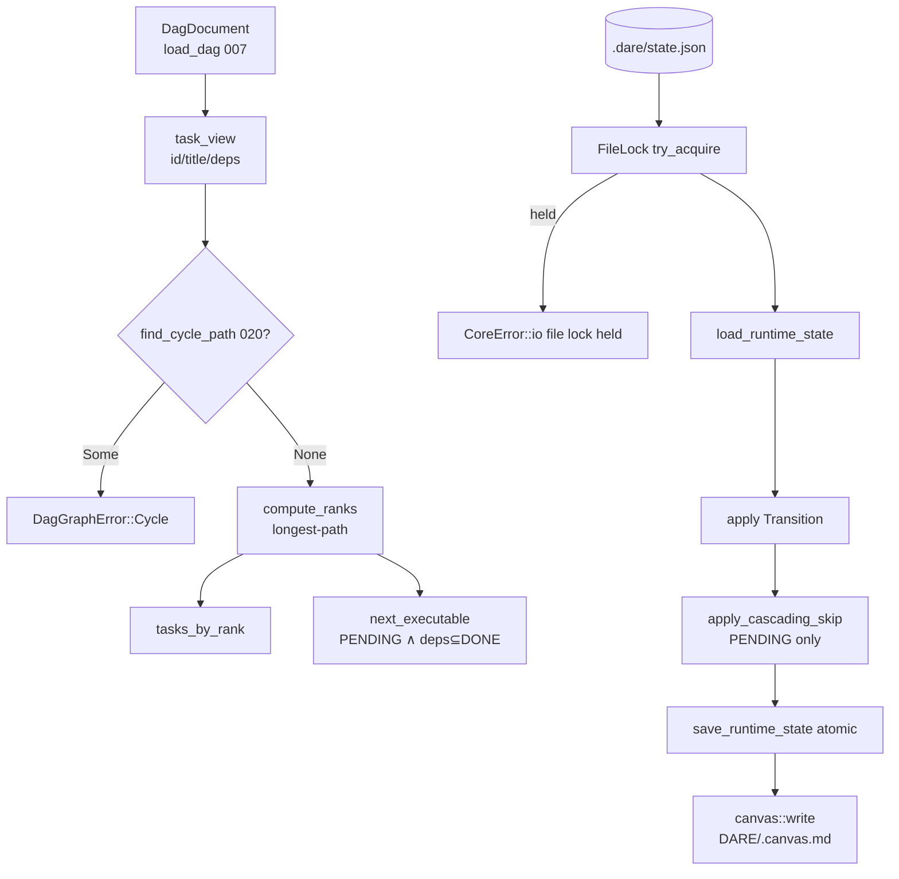

# BLUEPRINT: DAG — parser, ranks e state store (Microplano 026)

> **Gerado a partir de:** `DARE/DESIGN-026-dag-parser-ranks-e-state-store.md` v1.0  
> **Data:** 2026-07-22 | **Status:** APPROVED  
> **Arquivo:** `DARE/BLUEPRINT-026-dag-parser-ranks-e-state-store.md`  
> **Não substitui:** Blueprints 001–025  
> **Pré-requisitos:** Microplanos **005**, **007**, **020** (código presente)  
> **Escopo:** só checklist do 026 (ranks, skip, state store+lock, canvas base, property tests). **Não** `dare dag viz` (027) / `dare execute` (028+).

---

## 0. TRADE-OFFS (Architect)

Sem `PATTERNS.md` / `patterns-facts.json`. Decisões 🟡 a partir do Design 026, APIs 005/007/020, Documento Mestre §5.2 / §24–§25, e DEC-006/008/021. Conclusões abaixo **congelam** as lacunas 🟡 do Design.

| # | Trade-off | Escolha | Justificativa |
|---|-----------|---------|---------------|
| T-01 | Localização | Estender crate **`dare-dag`** com `graph.rs` / `state.rs` / `canvas.rs` | Paths do microplano; validate já vive aqui |
| T-02 | Parse / state I/O | **Reusar** `dare_contracts::{load_dag, DagDocument, load_runtime_state, save_runtime_state, RuntimeStateV1}` | 007; sem segundo schema |
| T-03 | Lock | `FileLock::try_acquire(root, STATE_REL)` → ficheiro `.dare/state.json.darelock` | DEC-006; path = o do state |
| T-04 | Contenção | **Fail-fast**: segundo acquire → `CoreError::io("file lock held")` (não fila) | RNF-03; aceite microplano “falha claramente” |
| T-05 | Roots rank | **rank 0** se `depends_on` vazio; senão `1 + max(rank(deps))` | Design RF-03; R-01 |
| T-06 | Ciclos em ranks | Se ciclo → `DagGraphError::Cycle { path }` **sem** inventar ranks; reusar detecção 020 | RF-05 / R-02 |
| T-07 | Expor ciclos | Extrair `pub(crate) fn find_cycle_path(doc) -> Option<Vec<String>>` em `validate` (ou módulo interno partilhado) e chamar de `graph` | Evita DFS duplicado |
| T-08 | Pré-validate | `compute_ranks` **não** chama validate completo; documentar pré-condição. Helper **`compute_ranks_validated`** = `validate_dag` (strict=false) → se `!ok` com errors de grafo/ciclo → Err; senão ranks | RF-06 SHOULD |
| T-09 | Cascading skip elegível | Só status **`PENDING`** pode virar `SKIPPED` por cascade. **`RUNNING` nunca** é auto-skipped. `DONE` / `FAILED` / `SKIPPED` intocados pelo fixpoint | Congela 🟡 Design C.2 |
| T-10 | Trigger skip | Cascade corre **após** toda transição que persiste (`transition` / `ensure_state` opcional) e via `apply_cascading_skip` puro | API testável sem I/O |
| T-11 | Status wire | Strings exact: `PENDING` \| `RUNNING` \| `DONE` \| `FAILED` \| `SKIPPED` (case-sensitive) | RF-09; paridade TS |
| T-12 | Transições válidas | Ver matriz §5.3; inválidas → `CoreError::invalid_input("invalid transition …")` | RF-12 |
| T-13 | Reset | `Transition::Reset` : `{DONE,FAILED,SKIPPED,RUNNING} → PENDING` (limpa `output`/`error` opcionalmente mantém `attempts`) | Prep 028; Blueprint: **mantém** `attempts`, zera `output`+`error` |
| T-14 | Init state | Ausente → criar v1; tasks do DAG → `PENDING` + `dependsOn` do YAML; `updatedAt` via `Clock` | RF-11 |
| T-15 | Orphans | Task em state **fora** do DAG: **preservar** (não apagar); task nova no DAG: inserir `PENDING` | Conservador; 028 pode prune |
| T-16 | Clock | Trait `Clock { fn now_rfc3339(&self) -> String }` + `SystemClock`; testes injetam `FixedClock` | Goldens canvas/state sem flakiness |
| T-17 | Canvas write | `dare_core::fs::atomic_write` bytes UTF-8 | RF-18; mesma atomicidade do state |
| T-18 | Canvas path | Relativo fixo `DARE/.canvas.md` | Contrato disco microplano |
| T-19 | State path | Relativo fixo `.dare/state.json` (`STATE_REL`) | Contrato 007 |
| T-20 | Refresh canvas | `transition(..., RefreshCanvas::Yes)` default **Yes**; `ensure_state` default **No** (só cria ficheiro) | Evita I/O extra no init |
| T-21 | Property tests | Dep **`proptest`** pinned no workspace + `dare-dag` | Design escolhe; ainda não no workspace |
| T-22 | CLI debug | **Não** implementar `dare dag ranks` neste ciclo (RF-25 COULD) | Consumidores = 027/028 |
| T-23 | `next_executable` | **Implementar** helper puro (RF-27 SHOULD) | Prep 028 sem CLI |
| T-24 | Docs | `docs/compatibility/dag-runtime.md` + **DEC-027** | RF-23; DEC-026 já é blueprint |
| T-25 | Container Fase 1 | Reusar `Dockerfile.rust` + `docker-compose.ci.yml` | Sem imagem nova |
| T-26 | Mensagens | en-US; truncar corpos de `output`/`error` em qualquer log/debug a **200** chars | RS-02 |
| T-27 | Caps persist | Não expandir `output`/`error` além do já lido; save via 007 caps; reject state `version!=1` | RS-06/07 |
| T-28 | Legacy DAG | Ranks/skip/state suportam `DagDocument::Legacy` (mesma view id/deps/title) | Validate já cobre legacy |

### 0.1 Constantes

| Nome | Valor |
|------|-------|
| `STATE_REL` | `.dare/state.json` |
| `CANVAS_REL` | `DARE/.canvas.md` |
| `DEFAULT_DAG_REL` | `DARE/dare-dag.yaml` (já em 020) |
| `MSG_TRUNC` | 200 |
| Status | `PENDING`, `RUNNING`, `DONE`, `FAILED`, `SKIPPED` |

### 0.2 GAP ANALYSIS (código → MUST)

| Item | Estado | Ação |
|------|--------|------|
| `load_dag` / `DagDocument` | ✅ 007 | Reusar + `task_view` helper |
| `RuntimeStateV1` load/save | ✅ 007 | Envolver |
| `FileLock` | ✅ 005 | Usar em `transition` |
| `validate` / ciclos | ✅ 020 | Extrair `find_cycle_path` |
| `graph.rs` ranks | 🔴 | Criar |
| `state.rs` skip+transitions | 🔴 | Criar |
| `canvas.rs` | 🔴 | Criar |
| Fixtures ranks/skip | 🔴 | Criar sob `tests/fixtures/dag/` |
| `proptest` workspace | 🔴 | Adicionar pin |
| `dag-runtime.md` / DEC-027 | 🔴 | Criar |
| CLI execute/viz | — | **Fora** |

---

## 1. VISÃO GERAL DA ARQUITETURA

Núcleo de biblioteca: DAG estático (YAML) → ranks; state runtime (JSON) → transições com lock; skip fixpoint; canvas Markdown. Sem superfície CLI nova.



**Decisões arquiteturais:**

| Decisão | Escolha | Justificativa |
|---------|---------|---------------|
| Library-first | Sem CLI 026 | Design RF-25 COULD; 027/028 wiring |
| Fail-fast lock | Sem wait | Aceite concorrência |
| Skip só PENDING | RUNNING intacto | Evita matar execução viva |
| Clock injetável | Goldens estáveis | RNF-01 |

---

## 2. STACK TÉCNICA DEFINIDA

| Camada | Tecnologia | Versão | Papel |
|--------|-----------|--------|-------|
| Rust | rustc/cargo | **1.85.0** | Build |
| Domínio | `dare-dag` | `0.1.0-alpha.0` | graph/state/canvas |
| Contratos | `dare-contracts` | workspace | DAG + RuntimeStateV1 |
| Core | `dare-core` | workspace | ProjectRoot, FileLock, atomic_write |
| Serde | serde / serde_json | workspace | state |
| Property | **proptest** | **=1.6.0** (pin workspace; Blueprint rascunho citava 1.36.0 — versão inexistente no crates.io; implementação DEC-027) | RF-20 |
| Testes | tempfile | workspace | FS |
| Container | `Dockerfile.rust` + `docker-compose.ci.yml` | 003 | Fase 1 |

**Deps `dare-dag` (delta MUST):** `proptest` (dev-dep ok se só tests; **preferir** `dev-dependencies` no crate). **NÃO** adicionar: `dare-cli`, `dare-project`, `dare-harness`, `dare-ai`.

---

## 3. ESTRUTURA DE PASTAS E ARQUIVOS

```text
crates/dare-dag/
├── Cargo.toml                 # + proptest (dev)
└── src/
    ├── lib.rs                 # mod + re-exports
    ├── validate.rs            # + find_cycle_path (extrair)
    ├── report.rs              # (existente)
    ├── format.rs              # (existente)
    ├── graph.rs               # NOVO ranks / next_executable
    ├── state.rs               # NOVO store / skip / transition
    ├── canvas.rs              # NOVO render / write
    └── status.rs              # NOVO TaskStatus + Transition (ou dentro state.rs)

tests/fixtures/dag/
├── ranks-chain.v21.yaml       # NOVO
├── ranks-diamond.v21.yaml     # NOVO
├── ranks-fanout.v21.yaml      # NOVO
├── skip-cascade.v21.yaml      # NOVO
└── ranks-chain.ranks.json     # NOVO golden { "task-001": 0, ... }

docs/compatibility/
└── dag-runtime.md             # NOVO

docs/DECISION-LOG.md           # + DEC-027

Cargo.toml                     # workspace.dependencies proptest = "=1.6.0" (não 1.36.0 — ver DEC-027)
```

---

## 4. MODELO DE DADOS

### 4.1 `TaskStatus`

| Valor wire | Rust |
|------------|------|
| `PENDING` | `TaskStatus::Pending` |
| `RUNNING` | `TaskStatus::Running` |
| `DONE` | `TaskStatus::Done` |
| `FAILED` | `TaskStatus::Failed` |
| `SKIPPED` | `TaskStatus::Skipped` |

- Parse desconhecido → `CoreError::invalid_input("unknown task status")`.
- `Display` / `as_str()` → wire exact.

### 4.2 `TaskView` (interno/público fino)

| Campo | Tipo | Origem |
|-------|------|--------|
| `id` | `String` | YAML |
| `title` | `String` | YAML |
| `depends_on` | `Vec<String>` | YAML (ordem preservada; para max rank usar set lógico) |

`fn iter_task_views(doc: &DagDocument) -> Vec<TaskView>` — v2.1 array + legacy map (ids sorted lexico só na listagem legacy se necessário; ranks usam deps).

### 4.3 `RuntimeStateV1` (007 — sem breaking)

| Campo | Tipo | Notas |
|-------|------|-------|
| `version` | `u32` | MUST `== 1` |
| `updated_at` | `String` | RFC3339 via `Clock` |
| `tasks` | `BTreeMap<String, TaskRuntimeState>` | chave = task id |

`TaskRuntimeState.status` armazena wire string.

### 4.4 Canvas (gerado)

Markdown determinístico (exceto `Updated` se clock real):

```markdown
# DARE DAG Execution — {dag.title}

**Updated:** {rfc3339}

## Tasks

| ID | Title | Status | Duration | Tokens |
|----|-------|--------|----------|--------|
| {id} | {title} | {emoji} {STATUS} | {duration_ms or -} | {tokens or -} |

## Progress: {done}/{total} tasks ({pct}%)

{bar 20 chars █/░}
```

- Ordenação linhas: **rank asc**, empate **id lexico**; se ranks indisponíveis, **id lexico**.
- `done` = count status `DONE` (SKIPPED **não** conta como done; total = tasks no DAG).
- Emoji (congelar): PENDING `⏳` · RUNNING `🔄` · DONE `✅` · FAILED `❌` · SKIPPED `⏭️` (alinhar canvas existente 025).
- Título: `dag.title` trimmed; se vazio → `"DARE DAG"`.

---

## 5. CONTRATOS DE API (domínio)

> Não há HTTP. Contratos = funções públicas Rust. Anti-stub: assinaturas + pré/pós + erros.

### 5.1 `graph::compute_ranks`

```rust
pub fn compute_ranks(doc: &DagDocument) -> Result<BTreeMap<String, u32>, DagGraphError>
```

| | |
|--|--|
| **Pré** | `doc` com ids únicos preferencialmente validados |
| **Pós OK** | Toda task em `iter_task_views` tem entrada; roots=0; `rank(t) = 1+max(deps)` |
| **Erro** | `DagGraphError::Cycle { path }` (path canónico 020); `MissingDependency { id, dep }` se dep referenciada inexistente |
| **Concorrência** | Puro / thread-safe |

**Edge cases:**

| Caso | Resultado |
|------|-----------|
| DAG vazio (0 tasks) | `Ok({})` |
| Self-dep | Tratado como ciclo ou missing — preferir **Cycle** path `[id,id]` ou reusar validate; Blueprint: chamar `find_cycle_path` primeiro; se None e dep missing → `MissingDependency` |
| Empate | N/A no map; `tasks_by_rank` ordena ids |

### 5.2 `graph::tasks_by_rank`

```rust
pub fn tasks_by_rank(ranks: &BTreeMap<String, u32>) -> BTreeMap<u32, Vec<String>>
```

Cada `Vec` ordenado **lexicograficamente**.

### 5.3 `graph::compute_ranks_validated`

```rust
pub fn compute_ranks_validated(
    doc: &DagDocument,
    opts: &ValidateOptions,
    ctx: &ValidateFsContext<'_>,
) -> Result<BTreeMap<String, u32>, DagGraphError>
```

Se `validate_dag` reporta qualquer **Error** severity → `DagGraphError::InvalidDag { report }` (ou first cycle). Warnings sozinhos **não** bloqueiam ranks.

### 5.4 `graph::next_executable`

```rust
pub fn next_executable(
    doc: &DagDocument,
    state: &RuntimeStateV1,
    ranks: &BTreeMap<String, u32>,
) -> Vec<String>
```

| Regra | |
|-------|--|
| Candidata | status `PENDING` **e** todas deps com status `DONE` |
| Ordem | menor `rank` primeiro; empate `id` lexico |
| Skip | `SKIPPED`/`FAILED` deps ⇒ não candidata (cascade deve ter marcado) |

### 5.5 `DagGraphError`

```rust
pub enum DagGraphError {
    Cycle { path: Vec<String> },
    MissingDependency { task_id: String, missing: String },
    InvalidDag { message: String }, // en-US; sem prompt bodies
}
```

`impl From<DagGraphError> for CoreError` → `invalid_input` ou `config` conforme caso (Blueprint: Cycle/Missing → `invalid_input`; InvalidDag → `invalid_input`).

### 5.6 `status::TaskStatus` / `Transition`

```rust
pub enum Transition {
    Start,                         // PENDING → RUNNING
    Complete { output: String },   // RUNNING → DONE
    Fail { error: String },        // RUNNING → FAILED
    Reset,                         // DONE|FAILED|SKIPPED|RUNNING → PENDING
    // Skip explícito manual (opcional):
    Skip,                          // PENDING → SKIPPED (só PENDING)
}
```

**Matriz (MUST):**

| From \ To | PENDING | RUNNING | DONE | FAILED | SKIPPED |
|-----------|---------|---------|------|--------|---------|
| PENDING | Reset no-op / Skip | Start | — | — | Skip ou cascade |
| RUNNING | Reset | — | Complete | Fail | **proibido** auto |
| DONE | Reset | — | — | — | — |
| FAILED | Reset | — | — | — | — |
| SKIPPED | Reset | — | — | — | — |

`—` = `Err(invalid_input)`.

**Complete/Fail side effects:** set `output` ou `error`; append `AttemptRecord { n: last+1, at: clock, passed: true/false, … }`; `tokens`/`duration` **não** setados neste ciclo (deixar `None` / intactos) salvo campos passados no futuro.

### 5.7 `state::apply_cascading_skip`

```rust
pub fn apply_cascading_skip(state: &mut RuntimeStateV1, doc: &DagDocument) -> usize
```

| | |
|--|--|
| **Algoritmo** | Fixpoint: enquanto ∃ `PENDING` t com ∃ dep ∈ `{FAILED,SKIPPED}` → `t = SKIPPED` |
| **Retorno** | Número de tasks mudadas nesta chamada |
| **Idempotência** | Segunda chamada → `0` |
| **Deps missing no state** | Tratar dep ausente como **não** FAILED/SKIPPED (não skip); 028 garante init |

### 5.8 `state::ensure_state`

```rust
pub fn ensure_state(
    root: &ProjectRoot,
    doc: &DagDocument,
    clock: &dyn Clock,
) -> CoreResult<RuntimeStateV1>
```

| Passo | |
|-------|--|
| 1 | `FileLock::try_acquire(STATE_REL)` |
| 2 | Se ficheiro existe → `load_runtime_state`; senão state vazio `version=1` |
| 3 | Merge: para cada task do DAG, se ausente inserir `PENDING` + `depends_on` |
| 4 | `apply_cascading_skip` |
| 5 | `updated_at = clock.now_rfc3339()` |
| 6 | `save_runtime_state` |
| 7 | drop lock |
| **Canvas** | **Não** escrever (T-20) |

**Erros:** lock held → Io; version≠1 → Config; path jail → InvalidInput.

### 5.9 `state::transition`

```rust
pub enum RefreshCanvas { Yes, No }

pub fn transition(
    root: &ProjectRoot,
    doc: &DagDocument,
    task_id: &str,
    tr: Transition,
    clock: &dyn Clock,
    refresh: RefreshCanvas,
) -> CoreResult<RuntimeStateV1>
```

| Passo (ordem) | |
|---------------|--|
| 1 | Lock state |
| 2 | `ensure`-like load+merge **sem** save ainda (ou load + verify task ∈ DAG) |
| 3 | Se `task_id` ∉ DAG → `not_found` |
| 4 | Aplicar matriz Transition |
| 5 | `apply_cascading_skip` |
| 6 | `updated_at = clock` |
| 7 | `save_runtime_state` |
| 8 | Se `RefreshCanvas::Yes` → `canvas::write` |
| 9 | drop lock (RAII) |

**Concorrência:** segundo `transition` paralelo → Io `"file lock held"`.

**Crash safety:** só `save_runtime_state` / `atomic_write` — nunca write parcial in-place.

### 5.10 `canvas::render` / `write`

```rust
pub fn render(
    doc: &DagDocument,
    state: &RuntimeStateV1,
    ranks: Option<&BTreeMap<String, u32>>,
    clock: &dyn Clock,
) -> String

pub fn write(
    root: &ProjectRoot,
    doc: &DagDocument,
    state: &RuntimeStateV1,
    ranks: Option<&BTreeMap<String, u32>>,
    clock: &dyn Clock,
) -> CoreResult<()>
```

`write` = `atomic_write(CANVAS_REL, render(...).as_bytes())`.

Se `ranks` is `None`, ordenar só por id.

### 5.11 Exemplos concretos

**Ranks chain** `a → b → c`:

```json
{ "a": 0, "b": 1, "c": 2 }
```

**Skip:** `a=FAILED`, `b` depends `a`, `b=PENDING` → após cascade `b=SKIPPED`.

**Lock:** thread A `transition` holds lock; thread B → `Err` contendo `file lock held`.

---

## 6. PLANO DE EXECUÇÃO (FASES)

### Fase 1: Containerização / CI baseline

- **Objetivo:** Confirmar imagem CI existente.
- **DONE:** `docker compose -f docker-compose.ci.yml config` exit 0 (ou waiver documentado em `dag-runtime.md`).
- **Entregáveis:** nota no doc se waiver.

### Fase 2: Task views + cycle helper + ranks

- **Objetivo:** `graph.rs` + `find_cycle_path` + goldens chain/diamond/fanout.
- **DONE:** `compute_ranks` passa goldens; ciclo → `DagGraphError::Cycle`; `tasks_by_rank` estável.
- **Entregáveis:** `graph.rs`, fixtures `ranks-*.yaml` + `*.ranks.json`, testes unitários.

### Fase 3: TaskStatus + cascading skip

- **Objetivo:** Fixpoint skip só PENDING.
- **DONE:** unit skip-cascade; segunda chamada 0 mudanças; RUNNING não skipped.
- **Entregáveis:** `status` + `apply_cascading_skip`; fixture `skip-cascade.v21.yaml`.

### Fase 4: State store — ensure + transition + lock

- **Objetivo:** Persistência atómica com lock.
- **DONE:** `ensure_state` cria v1; `transition` Start/Complete/Fail/Reset/Skip; contenção lock; JSON nunca truncado (teste atomic já 007 + lock test).
- **Entregáveis:** `state.rs`; testes tempfile multi-thread ou sequenciais com lock hold.

### Fase 5: Canvas base

- **Objetivo:** `DARE/.canvas.md` determinístico com `FixedClock`.
- **DONE:** snapshot string `render`; `write` cria ficheiro; `transition(..., Yes)` atualiza canvas.
- **Entregáveis:** `canvas.rs` + snapshot test.

### Fase 6: `next_executable` + `compute_ranks_validated` + property tests

- **Objetivo:** Helpers 027/028 + RF-20.
- **DONE:** property (a) rank>deps; (b) skip idempotent; next_executable ordem.
- **Entregáveis:** `proptest` workspace; props em `dare-dag`.

### Fase 7: Auditoria de segurança e dependências

- **Objetivo:** Ralph gates + RS-*.
- **DONE:** `cargo fmt --check`, `clippy -D warnings`, `cargo test -p dare-dag` (+ workspace se tocado), `cargo audit` / `deny` se deps novas (`proptest`).
- **Entregáveis:** log em EXECUTION na fase tasks.

### Fase 8: Docs + DEC-027 + closeout

- **Objetivo:** Compat documentada.
- **DONE:** `dag-runtime.md` + DEC-027 no DECISION-LOG; Design checklist marcado via tasks.
- **Entregáveis:** docs; **sem** git commit obrigatório nesta fase (humano).

---

## 7. VALIDATION GATES

| Stack | Build | Test | Lint / Audit |
|-------|-------|------|--------------|
| Rust | `cargo build -p dare-dag` | `cargo test -p dare-dag` | `cargo clippy -p dare-dag -- -D warnings` + `cargo fmt --check` |
| Audit (se deps) | — | — | `cargo audit` / `cargo deny check` |
| Container | — | — | `docker compose -f docker-compose.ci.yml config` |

---

## 8. CONTROLES DE SEGURANÇA (RS → fase)

| RS | Controlo | Fase |
|----|----------|------|
| RS-01 | Só `ProjectRoot` + `SafeRelativePath` (`STATE_REL`, `CANVAS_REL`) | 4–5 |
| RS-02 | Sem log de `output`/`error` completos; trunc `MSG_TRUNC` | 4 |
| RS-03 | Lock + `save_runtime_state` / `atomic_write` | 4–5 |
| RS-04 | audit/deny pós-`proptest` | 7 |
| RS-05 | Sem secrets/shell | todas |
| RS-06 | `version != 1` → Config | 4 |
| RS-07 | Caps 007 na leitura | 4 |

---

## 9. ESTRATÉGIA DE TESTES

| Tipo | Cobertura |
|------|-----------|
| Unit | ranks goldens; cycle; skip fixpoint; transition matrix; next_executable |
| Integração FS | ensure_state; transition+lock; canvas write |
| Property | ranks monotonic; skip idempotent (`proptest`) |
| Concorrência | lock held → erro |
| Segurança | path jail (herdado core); version reject |
| Golden TS | SHOULD — documentar diffs em DEC-027 / classification |

**Não** E2E CLI execute neste ciclo.

---

## 10. ESTRATÉGIA DE DEPLOY

| Ambiente | Branch / trigger | Artefato |
|----------|------------------|----------|
| Local | dev | `cargo test -p dare-dag` |
| CI | PR / main (003) | matrix OS; sem release canal novo |
| Alpha | herda 015 | binário já linka `dare-dag`; sem flag CLI nova |

---

## 11. CHECKLIST DE APROVAÇÃO

- [ ] Trade-offs T-01…T-28 aceites (esp. T-05 ranks 0-based, T-09 skip só PENDING, T-04 fail-fast lock)
- [ ] Matriz de transições §5.6 aceite
- [ ] Formato canvas §4.4 aceite
- [ ] Fora de escopo 027/028 confirmado (sem CLI)
- [ ] DEC-027 + `dag-runtime.md` como docs
- [ ] Fases 1–8 com DONE verificável
- [ ] Pronto para `/dare-tasks` → `TASKS-026` + `dare-dag-026.yaml` + `EXECUTION-026/`

---

## Apêndice A — Algoritmos (normativos)

### A.1 Longest-path

```text
rank(t) = 0                                 if deps(t) = ∅
rank(t) = 1 + max { rank(d) | d ∈ deps(t) } otherwise
```

Memo DFS; ao detectar back-edge → Cycle (path canónico).

### A.2 Cascading skip

```text
changed = true
while changed:
  changed = false
  for t in tasks(doc) sorted by id:   # ordem só para determinismo de varredura
    if status(t) != PENDING: continue
    if ∃ d ∈ deps(t): status(d) ∈ {FAILED, SKIPPED}:
      status(t) = SKIPPED
      changed = true
```

### A.3 Progress canvas

```text
done = |{ t ∈ DAG : status(t) = DONE }|
total = |DAG|
pct = if total==0 then 100 else floor(100 * done / total)
bar = 20 chars, filled = round(20 * done / max(total,1))
```

---

## Apêndice B — Mapeamento Design → Blueprint

| Design | Blueprint |
|--------|-----------|
| RF-01…03 ranks | §5.1–5.2, Fase 2, T-05 |
| RF-07…09 skip/status | §5.6–5.7, T-09…T-11, Fase 3 |
| RF-10…16 state/lock | §5.8–5.9, T-03…T-04, Fase 4 |
| RF-17…19 canvas | §4.4 §5.10, Fase 5 |
| RF-20 props | Fase 6, T-21 |
| RF-27 next | §5.4, T-23 |
| RF-25 CLI | T-22 defer |
| DEC nº | **DEC-027** |

---

## Apêndice C — Fora de escopo (reaffirm)

- `dare dag viz` / Mermaid / DOT / Excalidraw → **027**
- `dare execute` actions / watch / Ralph completo → **028–029**
- Agent mock/worktrees → **030+**
- Alterar schema `RuntimeStateV1` fields → ADR

---

## Apêndice D — Próximo passo

Após **aprovação humana** deste Blueprint:

1. `/dare-tasks` sobre `DARE/BLUEPRINT-026-dag-parser-ranks-e-state-store.md`  
2. Gerar `TASKS-026-*.md`, `dare-dag-026.yaml`, `EXECUTION-026/`  
3. Executar ranks 0…N com Ralph Loop  
4. Closeout → [`027-dag-visualizacao.md`](../DARE-RUST-MICRO-PLANOS/DARE-RUST-MICRO-PLANOS/027-dag-visualizacao.md)
