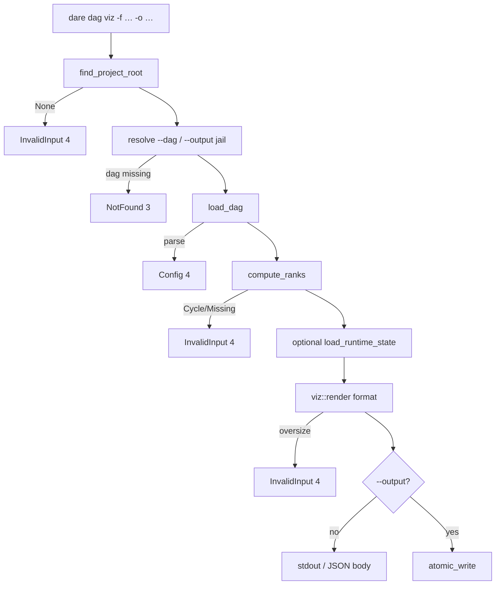

# BLUEPRINT: DAG — visualização `dare dag viz` (Microplano 027)

> **Gerado a partir de:** `DARE/DESIGN-027-dag-visualizacao.md` v1.0  
> **Data:** 2026-07-22 | **Status:** APPROVED  
> **Arquivo:** `DARE/BLUEPRINT-027-dag-visualizacao.md`  
> **Não substitui:** Blueprints 001–026  
> **Pré-requisito:** Microplano **026** concluído  
> **Escopo:** só checklist do 027 (Mermaid / DOT / Excalidraw + CLI). **Não** `dare execute` (028+).

---

## 0. TRADE-OFFS (Architect)

Sem `PATTERNS.md` / `patterns-facts.json`. Decisões 🟡 a partir do Design 027, validate CLI 020, ranks 026, Documento Mestre §24, skill `/dare-dag-viz`.

| # | Trade-off | Escolha | Justificativa |
|---|-----------|---------|---------------|
| T-01 | Domínio | `crates/dare-dag/src/viz.rs` | Microplano path; ranks já no crate |
| T-02 | CLI | `crates/dare-cli/src/commands/dag.rs` + `Commands::Dag { Viz {…} }` | Nested clap; path microplano |
| T-03 | Format parse | clap `ValueEnum`, **exact lowercase**: `mermaid` \| `dot` \| `excalidraw` | RF-03/25; exit 2 via clap |
| T-04 | Default format | **`mermaid`** | RF-04 |
| T-05 | Default dag | `DEFAULT_DAG_REL` = `DARE/dare-dag.yaml` | Paridade validate |
| T-06 | Path resolve | **Reusar** lógica de `validate::resolve_dag_rel` (extrair helper partilhado em `commands/path_util.rs` **ou** duplicar mínimo em `dag.rs` — preferir **fn partilhada** `resolve_project_rel`) | RS-01; DRY |
| T-07 | Ranks | `compute_ranks(doc)` (não validated por default); ciclo → `DagGraphError` → CLI exit **4** | RF-15; Design preferência |
| T-08 | Ordem nós | **rank↑**, empate **id lexico** | Layout swim-lane; aplica aos 3 formatos |
| T-09 | Ordem edges | Lista `(from, to)` onde `from` ∈ `depends_on(to)`; sort por `(from, to)` lexico | RF-14; seta = “dep → task” |
| T-10 | Mermaid | `flowchart TB` + `subgraph rank_{n}["Rank {n}"]` … `end`; nó `id["id<br/>title"]`; edge `from --> to` | RF-10; legível no preview |
| T-11 | DOT | `digraph dare_dag { … }`; nó `id [label="id\\ntitle"]`; edge `from -> to` | RF-11 |
| T-12 | Excalidraw | JSON `{type:"excalidraw", version:2, source:"dare-cli", elements:[…], appState:{}}`; rect 120×60; colunas por rank (x = rank*200, y = index*100); arrows; **sem** campos `updated`/`seed` voláteis (ids estáveis `task-{id}`, `arrow-{from}-{to}`) | RF-12; RNF-01 |
| T-13 | TITLE_MAX | **40** chars Unicode; ellipsis `…` se truncar | RF-16 |
| T-14 | Sanitize id | Mermaid/DOT: se id não match `^[a-zA-Z_][a-zA-Z0-9_]*$`, usar alias `n_{sanitized}` + map; kebab vira `task_001` style (`-`→`_`) | R-03 |
| T-15 | Complexity colors | **Implementar SHOULD** Excalidraw fills: LOW `#e3f2fd`, MED `#fff3e0`, HIGH `#fce4ec`; unknown → `#eeeeee` | RF-17 |
| T-16 | Status colors | **Implementar SHOULD**: se `load_runtime_state(STATE_REL)` Ok → stroke/fill por status; ficheiro ausente/corrupt → todos PENDING **sem erro** | RF-18; R-05 |
| T-17 | Status palette | PENDING `#9e9e9e` stroke; RUNNING `#1976d2` strokeStyle dashed; DONE `#2e7d32`; FAILED `#c62828`; SKIPPED `#757575` dashed | Apêndice C |
| T-18 | `--output` | `atomic_write` sob jail; parent dirs `create_dir_all` via core se necessário | RF-06 |
| T-19 | Sem `-o` | Body UTF-8 em stdout via `ok_msg` / renderer human; `--json` inclui `body` | RF-06/27 |
| T-20 | OUTPUT_CAP | Se `body.len() > 2_097_152` → `invalid_input("viz output too large")` | RS-07 |
| T-21 | Zero writes DAG/state | Só `-o` muta FS | RF-19 |
| T-22 | Docs | `cli-dag-viz.md` + **DEC-028** | RF-23 |
| T-23 | Capability | `dare-dag-viz.cli_commands: ["dag"]` + nota que subcomando é `viz` | RF-22 |
| T-24 | Container Fase 1 | Reusar compose CI | Sem imagem nova |
| T-25 | Edge direction | Semântica: **dependência satisfeita antes** → seta `dep --> dependent` | Intuição Kahn/ranks |
| T-26 | Validate pré-viz | **Não** obrigatório; DAG inválido (missing deps) falha em `compute_ranks`; issues soft do validate **não** bloqueiam | Simplicidade |
| T-27 | EOL goldens | Assert com `.replace("\r\n","\n")` | R-04 |
| T-28 | `--json` data | `{ "format", "dag": "<rel>", "outputPath": null\|string, "body": string\|null }` — `body` null se escrito em ficheiro | RF-27 |

### 0.1 Exit codes (congelados)

| Code | Quando |
|------|--------|
| 0 | Viz OK (stdout ou ficheiro) |
| 1 | Internal |
| 2 | Usage (clap: format inválido, etc.) |
| 3 | DAG NotFound |
| 4 | InvalidInput (root/jail/output/cap/cycle/missing dep) **ou** Config (YAML parse) |
| 5 | Io |

### 0.2 Constantes

| Nome | Valor |
|------|-------|
| `DEFAULT_FORMAT` | Mermaid |
| `TITLE_MAX` | 40 |
| `OUTPUT_CAP` | 2_097_152 |
| `EXCAL_W` / `EXCAL_H` | 120 / 60 |
| `EXCAL_DX` / `EXCAL_DY` | 200 / 100 |
| `STATE_REL` | `.dare/state.json` (026) |

### 0.3 GAP

| Item | Estado | Ação |
|------|--------|------|
| `compute_ranks` / `iter_task_views` | ✅ 026 | Reusar |
| `load_dag` / `FileLock` paths | ✅ | Reusar |
| `viz.rs` | 🔴 | Criar |
| `commands/dag.rs` | 🔴 | Criar |
| Goldens `tests/fixtures/dag/viz/` | 🔴 | Criar |
| `cli-dag-viz.md` / DEC-028 | 🔴 | Criar |
| Matrix `cli_commands: ["dag"]` | 🔴 | Atualizar |

---

## 1. VISÃO GERAL DA ARQUITETURA



**Decisões:**

| Decisão | Escolha | Justificativa |
|---------|---------|---------------|
| Library render + thin CLI | Sim | Testável sem clap |
| Rank subgraphs Mermaid | Sim | Swim lanes úteis |
| Status opcional | Soft-fail | RF-18 |

---

## 2. STACK TÉCNICA DEFINIDA

| Camada | Tecnologia | Versão | Papel |
|--------|-----------|--------|-------|
| Rust | 1.85.0 | pin | Build |
| `dare-dag` | workspace | viz + ranks | |
| `dare-cli` | clap **4.5.40** | superfície | |
| `dare-contracts` | workspace | load_dag / state | |
| `dare-core` | workspace | jail / atomic_write | |
| `dare-project` | workspace | root walk (CLI) | |
| serde_json | workspace | Excalidraw | |
| Container | compose CI 003 | Fase 1 | |

**Deps novas:** nenhuma obrigatória além do já no workspace.

---

## 3. ESTRUTURA DE PASTAS E ARQUIVOS

```text
crates/dare-dag/src/
├── viz.rs                 # NOVO
└── lib.rs                 # mod viz; pub use VizFormat, render, …

crates/dare-cli/src/
├── commands/
│   ├── dag.rs             # NOVO
│   ├── mod.rs             # pub mod dag
│   └── path_resolve.rs    # OPCIONAL helper partilhado validate+dag
└── main.rs                # Commands::Dag

tests/fixtures/dag/viz/
├── sample.v21.yaml        # DAG pequeno diamond/chain
├── sample.mermaid.golden
├── sample.dot.golden
└── sample.excalidraw.golden

docs/compatibility/cli-dag-viz.md
docs/DECISION-LOG.md       # DEC-028
assets/capability-matrix.yml
```

---

## 4. MODELO DE DADOS

### 4.1 `VizFormat`

```rust
pub enum VizFormat { Mermaid, Dot, Excalidraw }
impl VizFormat {
    pub fn as_str(&self) -> &'static str; // mermaid|dot|excalidraw
    pub fn parse(s: &str) -> Option<Self>; // exact lowercase
}
```

### 4.2 `VizOptions`

```rust
pub struct VizOptions {
    pub title_max: usize,              // default 40
    pub state: Option<RuntimeStateV1>, // None => PENDING visuals
}
```

### 4.3 Modelo intermédio `VizGraph` (interno)

| Campo | Tipo |
|-------|------|
| nodes | `Vec<VizNode>` sorted rank↑, id |
| edges | `Vec<(String,String)>` sorted (from,to) |
| ranks | `BTreeMap<String,u32>` |

`VizNode { id, title, complexity, status, rank, alias }`

### 4.4 Excalidraw element (mínimo)

| type | campos |
|------|--------|
| rectangle | id, x, y, width, height, label/text via boundElement ou `label`, backgroundColor, strokeColor, strokeStyle |
| arrow | id, points, start/endBinding ou coordenadas absolutas determinísticas |

Blueprint: usar elementos com `"type":"rectangle"` + `"type":"arrow"` no schema Excalidraw comum; texto no `label` do rect se suportado, senão elemento `text` filho com id `text-{task_id}`.

---

## 5. CONTRATOS DE API

### 5.1 `viz::render`

```rust
pub fn render(
    doc: &DagDocument,
    format: VizFormat,
    opts: &VizOptions,
) -> Result<String, DagGraphError>
```

| | |
|--|--|
| **Pré** | `doc` parseado |
| **Pós OK** | String UTF-8; len ≤ OUTPUT_CAP (senão Err InvalidDag/message ou tipo dedicado — usar `DagGraphError::InvalidDag { message: "viz output too large" }`) |
| **Erro** | Cycle / MissingDependency de `compute_ranks` |
| **Concorrência** | Puro |

### 5.2 Mermaid (normativo)

```text
flowchart TB
  subgraph rank_0["Rank 0"]
    task_001["task-001<br/>Title here"]
  end
  subgraph rank_1["Rank 1"]
    task_002["…"]
  end
  task_001 --> task_002
```

- Subgraphs emitidos por rank crescente.
- Dentro do subgraph: nós por id lexico.
- Edges **depois** de todos subgraphs, ordem `(from,to)`.
- Alias: se id original `task-001`, alias Mermaid `task_001` (replace `-`→`_`).

### 5.3 DOT (normativo)

```text
digraph dare_dag {
  rankdir=TB;
  task_001 [label="task-001\nTitle here"];
  task_001 -> task_002;
}
```

- Nós antes das edges; mesmas ordens.
- Escapar `"` e `\` em labels.

### 5.4 Excalidraw (normativo)

- Coluna `rank`: `x = 40 + rank * EXCAL_DX`
- Índice na coluna: `y = 40 + idx * EXCAL_DY` (idx = ordem lexico dentro do rank)
- Arrow de centro-direita do `from` ao centro-esquerda do `to`
- Cores: T-15 / T-17

### 5.5 CLI `run_dag_viz`

```rust
pub fn run_dag_viz(
    dag: Option<PathBuf>,
    format: VizFormat,
    output: Option<PathBuf>,
    renderer: &OutputRenderer<'_>,
) -> ExitCode
```

Fluxo: root → resolve dag rel → `load_dag` → optional state → `render` → se output: resolve out rel + `atomic_write`; senão human body; JSON per T-28.

### 5.6 Exemplos

**Input** (2 tasks, b depends on a):

```yaml
title: "Sample"
version: "1.0.0"
tasks:
  - id: task-a
    title: Alpha
    depends_on: []
    complexity: LOW
    subtask_prompt: x
  - id: task-b
    title: Beta
    depends_on: [task-a]
    complexity: MED
    subtask_prompt: y
```

**Mermaid edge:** `task_a --> task_b`

**Erro ciclo:** exit 4, mensagem en-US contendo `cycle` (sem dump de prompts).

---

## 6. PLANO DE EXECUÇÃO (FASES)

### Fase 1: Containerização

- **DONE:** `docker compose -f docker-compose.ci.yml config` exit 0 (ou waiver em `cli-dag-viz.md`).
- **Entregáveis:** nota/waiver.

### Fase 2: `viz` core + Mermaid + goldens Mermaid

- **DONE:** `render(…, Mermaid)` passa golden `sample.mermaid.golden`; cycle → Err; sanitize ids; `cargo test -p dare-dag -- viz`.
- **Entregáveis:** `viz.rs` (pelo menos Mermaid), fixture `sample.v21.yaml`, golden mermaid.

### Fase 3: DOT + Excalidraw + status/complexity

- **DONE:** goldens `.dot` + `.excalidraw`; JSON excalidraw parseável; cores complexity+status; OUTPUT_CAP test.
- **Entregáveis:** completude `viz.rs`.

### Fase 4: CLI `dare dag viz` + smokes

- **DONE:** clap nested; smokes: mermaid stdout; `-o` write; missing dag → 3; bad format → 2; cycle dag → 4.
- **Entregáveis:** `commands/dag.rs`, `main.rs` wiring, `cli_smoke` tests.

### Fase 5: Capability + docs DEC-028

- **DONE:** matrix `cli_commands: ["dag"]`; `cli-dag-viz.md`; DEC-028; hashes manifest se necessário.
- **Entregáveis:** docs + matrix.

### Fase 6: Auditoria Ralph

- **DONE:** fmt/clippy/test dare-dag+dare-cli (filtros viz/dag); audit/deny se deps.
- **Entregáveis:** gates verdes.

### Fase 7: Fechamento

- **DONE:** TASKS-027 100%; matriz 000A 027 ✅; Blueprint APPROVED.
- **Entregáveis:** closeout; sem git commit obrigatório.

---

## 7. VALIDATION GATES

| Stack | Build | Test | Lint / Audit |
|-------|-------|------|--------------|
| Rust | `cargo build -p dare-dag -p dare-cli` | `cargo test -p dare-dag -- viz` + `cargo test -p dare-cli --test cli_smoke -- dag` | `clippy -D warnings` + `fmt --check` |
| Audit | — | — | `cargo audit` / `deny` se tocado |
| Container | — | — | compose `config` |

---

## 8. CONTROLES DE SEGURANÇA (RS → fase)

| RS | Controlo | Fase |
|----|----------|------|
| RS-01 | Jail `--dag`/`-o` | 4 |
| RS-02 | Sem prompts no viz | 2–3 |
| RS-03 | Truncate + escape | 2–3 |
| RS-04 | audit/deny | 6 |
| RS-05 | Sem shell | todas |
| RS-06 | atomic_write jail | 4 |
| RS-07 | OUTPUT_CAP | 3 |

---

## 9. ESTRATÉGIA DE TESTES

| Tipo | Cobertura |
|------|-----------|
| Unit | render 3 formatos; cycle; sanitize; truncate title |
| Golden | sample × 3 (EOL normalizado) |
| Integração FS | `-o` atomic; path fora root |
| Smoke CLI | format/stdout/file/missing/cycle |
| Segurança | jail output; no prompt leak |

---

## 10. ESTRATÉGIA DE DEPLOY

| Ambiente | Trigger | Artefato |
|----------|---------|----------|
| Local | dev | bin `dare` |
| CI | PR | matrix 003 |
| Alpha | herda 015 | binário com `dag viz` |

---

## 11. CHECKLIST DE APROVAÇÃO

- [ ] T-08…T-12 (ordem + sintaxes Mermaid/DOT/Excalidraw) aceites
- [ ] Exit codes §0.1 aceites (ciclo → 4)
- [ ] SHOULD status/complexity (T-15/16) aceites
- [ ] Fora de escopo execute confirmado
- [ ] DEC-028 + `cli-dag-viz.md`
- [ ] Fases 1–7 com DONE verificável
- [ ] Pronto para `/dare-tasks` → `TASKS-027` + `dare-dag-027.yaml` + `EXECUTION-027/`

---

## Apêndice A — Mapeamento Design → Blueprint

| Design | Blueprint |
|--------|-----------|
| RF-10 Mermaid subgraph 🟡 | T-10 |
| RF-13 ordem nós 🟡 | T-08 |
| Exit ciclo 🟡 | T-07 / §0.1 |
| DEC nº | **DEC-028** |
| RF-17/18 SHOULD | T-15/16 implement |

## Apêndice B — Fora de escopo (reaffirm)

- execute 028+, refine 033, graph viz GraphRAG, PNG/SVG, force-directed layout

## Apêndice C — Próximo passo

Após aprovação humana: `/dare-tasks` sobre este Blueprint → microplano [`028-execute-status-next-e-watch.md`](../DARE-RUST-MICRO-PLANOS/DARE-RUST-MICRO-PLANOS/028-execute-status-next-e-watch.md) após closeout.
