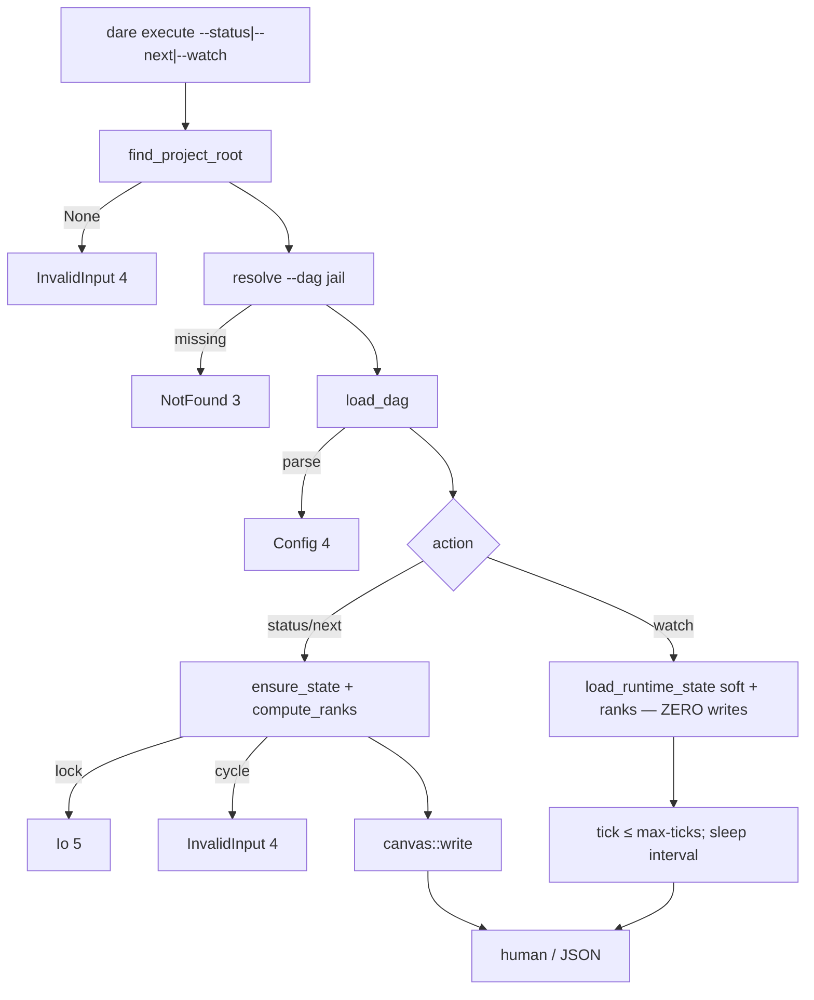

# BLUEPRINT: Execute — status, next e watch (Microplano 028)

> **Gerado a partir de:** `DARE/DESIGN-028-execute-status-next-e-watch.md` v1.0  
> **Data:** 2026-07-22 | **Status:** APPROVED  
> **Arquivo:** `DARE/BLUEPRINT-028-execute-status-next-e-watch.md`  
> **Não substitui:** Blueprints 001–027  
> **Pré-requisito:** Microplano **026** concluído (`ensure_state`, `next_executable`, canvas)  
> **Escopo:** só `--status` (default), `--next`, `--watch`. **Não** `--complete`/`--fail`/`--reset`/Ralph (**029**). **Não** `--agent` (**030+**).

---

## 0. TRADE-OFFS (Architect)

Sem `PATTERNS.md` / `patterns-facts.json`. Decisões 🟡 a partir do Design 028, runtime 026, Documento Mestre §2.1/§25, skills `/dare-dag-run*`.

| # | Trade-off | Escolha | Justificativa |
|---|-----------|---------|---------------|
| T-01 | Domínio | `crates/dare-dag/src/execution.rs` | Microplano; reusa graph/state/canvas |
| T-02 | CLI | `crates/dare-cli/src/commands/execute.rs` + `Commands::Execute {…}` | Path microplano; flat flags (não nested) |
| T-03 | Ações exclusivas | clap `ArgGroup` / mutually exclusive: `--status`, `--next`, `--watch` | RF-33; exit 2 |
| T-04 | Default ação | **`--status`** se nenhuma flag de ação | RF-03; Mestre §2.1 |
| T-05 | Default dag | `DEFAULT_DAG_REL` = `DARE/dare-dag.yaml` | Paridade validate/viz |
| T-06 | Path resolve | Reusar `commands::path_resolve::resolve_project_rel` | RS-01; DRY 027 |
| T-07 | Ensure + canvas | `ensure_state` **não** escreve canvas (026 T-20) → após ensure, CLI chama `canvas::write` em status/next | RF-08; não alterar `ensure_state` |
| T-08 | Start-on-next | **Não** chamar `transition(Start)` | RF-28; R-01 Classe B vs TS possível; DEC-029 |
| T-09 | Ready set | `next_executable` → filtrar **min rank** → sort id lexico | Aceite microplano |
| T-10 | Ordem pais no prompt | **id lexico** das deps (`depends_on` sorted) | Determinismo cross legacy/v21 |
| T-11 | Tail parent | Últimos `parent_context_chars` **Unicode scalars**; se `output` vazio → omitir bloco do pai | RF-12; RS-07 |
| T-12 | Cap total prompt | **Não** implementar neste ciclo (SHOULD deferido) | Escopo mínimo |
| T-13 | Limits source | V21: `doc.limits.parent_context_chars`; Legacy: **2000** (`DagLimits::default`) | 007 |
| T-14 | Empty DAG | Human: `Empty DAG — no tasks.`; JSON `outcome:"empty"`; **exit 0** | RF-22 |
| T-15 | Resolved | Exact: `✅ All tasks resolved.` (+ linha opcional status hint); JSON `outcome:"resolved"`; **exit 0** | RF-24; R-06 |
| T-16 | Blocked | Exact prefix: `Blocked — no executable tasks`; JSON `outcome:"blocked"`; **exit 0** | RF-23; Apêndice D Design |
| T-17 | Watch mutações | **Zero writes** a `STATE_REL` e `CANVAS_REL`; só `load_runtime_state` + `load_dag` + snapshot in-memory | O-04; RF-16/18 |
| T-18 | Watch loop | `--interval <u64>` default **2** (secs); `--max-ticks <u64>` default **ilimitado**; smoke: `--max-ticks 1` | RF-17; CI sem hang |
| T-19 | Watch cancel | SIGINT/Ctrl+C → exit **0** (sem erro) | RS-08 |
| T-20 | Watch JSON | Cada tick = mesmo shape que `--status` `data` (uma linha JSON por tick **ou** human; com `--json` uma envelope por tick) | RF-21 |
| T-21 | Docs | `docs/compatibility/cli-execute-status.md` + **DEC-029** | RF-29 |
| T-22 | Capability | `dare-execute.cli_commands: ["execute"]` | RF-30 |
| T-23 | Container Fase 1 | Reusar compose CI | Sem imagem nova |
| T-24 | Flags 029+ | **Ausentes** do clap neste ciclo (não stubs) | Evita Usage ambíguo; 029 adiciona |
| T-25 | Ranks | `compute_ranks(doc)`; ciclo → exit **4** | Alinhar viz/026 |
| T-26 | Validate pré-execute | **Não** obrigatório; missing dep → ranks Err → 4 | Simplicidade |
| T-27 | Human status | Counts + path canvas; lista tasks opcional compacta (id status rank) rank↑/id | RF-07 |
| T-28 | Human next | Bloco por ready: id/title/complexity/rank/spec_file/prompt indentado | RF-11 |
| T-29 | Prompt secção | Se ≥1 pai com output: anexar `\n\n## Upstream context\n\n` + blocos `### From parent: {id} — {title}\n{tail}\n` | Paridade skill output |
| T-30 | Clock | `SystemClock` em CLI; testes `FixedClock` | 026 |

### 0.1 Exit codes (congelados)

| Code | Quando |
|------|--------|
| 0 | status/next/watch OK — incl. `empty` / `resolved` / `blocked` |
| 1 | Internal |
| 2 | Usage (flags exclusivas, interval inválido, etc.) |
| 3 | DAG NotFound |
| 4 | InvalidInput (root/jail) **ou** Config (YAML) **ou** ciclo/missing dep |
| 5 | Io (lock held, write state/canvas) |

### 0.2 Constantes / strings canónicas

| Nome | Valor |
|------|-------|
| `DEFAULT_DAG_REL` | `DARE/dare-dag.yaml` |
| `DEFAULT_WATCH_INTERVAL_SECS` | `2` |
| `MSG_RESOLVED` | `✅ All tasks resolved.` |
| `MSG_BLOCKED` | `Blocked — no executable tasks` |
| `MSG_EMPTY` | `Empty DAG — no tasks.` |
| `STATE_REL` / `CANVAS_REL` | 026 |

### 0.3 Outcome enum (domínio)

```rust
pub enum ExecuteOutcome {
    Status,           // printed snapshot
    NextReady,        // ≥1 ready at min rank
    Resolved,         // no PENDING/RUNNING
    Blocked,          // 0 ready, � PENDING
    Empty,            // 0 tasks in DAG
}
```

### 0.4 GAP

| Item | Estado | Ação |
|------|--------|------|
| `ensure_state` / `next_executable` / canvas | ✅ 026 | Reusar |
| `path_resolve` | ✅ 027 | Reusar |
| `execution.rs` | 🔴 | Criar |
| `commands/execute.rs` | 🔴 | Criar |
| Fixtures empty/blocked | 🔴 | Criar (+ reusar chain) |
| `cli-execute-status.md` / DEC-029 | ✅ | Criar |
| Matrix `dare-execute` → `["execute"]` | ✅ | Atualizar |

---

## 1. VISÃO GERAL DA ARQUITETURA



**Decisões:**

| Decisão | Escolha | Justificativa |
|---------|---------|---------------|
| Library-first compose/ready | Sim | Testável sem clap |
| Watch read-only | Sim | Aceite microplano |
| Não Start em `--next` | Sim | RF-28; Ralph/Start em 029 |

---

## 2. STACK TÉCNICA DEFINIDA

| Camada | Tecnologia | Versão | Papel |
|--------|-----------|--------|-------|
| Rust | 1.85.0 | pin | Build |
| `dare-dag` | workspace | execution + 026 runtime | |
| `dare-cli` | clap **4.5.40** | superfície | |
| `dare-contracts` | workspace | DagDocument / state / limits | |
| `dare-core` | workspace | jail / lock / atomic | |
| `dare-project` | workspace | root (CLI) | |
| serde_json | workspace | JSON data | |
| Container | compose CI 003 | Fase 1 | |

**Deps novas:** nenhuma obrigatória.

---

## 3. ESTRUTURA DE PASTAS E ARQUIVOS

```text
crates/dare-dag/src/
├── execution.rs           # NOVO
└── lib.rs                 # mod execution; pub use …

crates/dare-cli/src/
├── commands/
│   ├── execute.rs         # NOVO
│   ├── mod.rs             # pub mod execute
│   └── path_resolve.rs    # reusar
└── main.rs                # Commands::Execute

tests/fixtures/dag/
├── exec-empty.v21.yaml          # tasks: []
├── exec-blocked.v21.yaml        # A DONE fail path → B PENDING blocked
├── ranks-chain.v21.yaml         # reusar ready cases
└── … (state fixtures inline nos testes)

docs/compatibility/cli-execute-status.md
docs/DECISION-LOG.md             # DEC-029
assets/capability-matrix.yml     # dare-execute.cli_commands
```

---

## 4. MODELO DE DADOS

### 4.1 `StatusCounts`

```rust
pub struct StatusCounts {
    pub done: u32,
    pub running: u32,
    pub pending: u32,
    pub failed: u32,
    pub skipped: u32,
    pub total: u32, // tasks no DAG
}
```

### 4.2 `StatusTaskRow`

```rust
pub struct StatusTaskRow {
    pub id: String,
    pub title: String,
    pub status: String,      // wire PENDING|…
    pub rank: u32,
    pub complexity: String,
}
```

### 4.3 `StatusSnapshot`

```rust
pub struct StatusSnapshot {
    pub title: String,
    pub dag_rel: String,     // preenchido na CLI
    pub canvas_path: String, // CANVAS_REL
    pub counts: StatusCounts,
    pub tasks: Vec<StatusTaskRow>, // ordenados rank↑, id lexico
    pub outcome: ExecuteOutcome,   // Status | Empty | Resolved | Blocked (para next paths)
}
```

### 4.4 `ReadyTask`

```rust
pub struct ReadyTask {
    pub id: String,
    pub title: String,
    pub rank: u32,
    pub complexity: String,
    pub spec_file: String,
    pub prompt: String,
}
```

### 4.5 `NextReport`

```rust
pub struct NextReport {
    pub rank: Option<u32>,           // Some(min) se ready
    pub ready: Vec<ReadyTask>,
    pub outcome: ExecuteOutcome,     // NextReady | Resolved | Blocked | Empty
}
```

---

## 5. CONTRATOS DE API

### 5.1 `ready_at_min_rank`

```rust
pub fn ready_at_min_rank(
    doc: &DagDocument,
    state: &RuntimeStateV1,
    ranks: &BTreeMap<String, u32>,
) -> Vec<String>
```

| | |
|--|--|
| **Pré** | `state` já cascaded; `ranks` de `compute_ranks` Ok |
| **Pós** | Subconjunto de `next_executable` com `rank == min(ranks dos candidatas)`; ids lexico |
| **Vazio** | `vec![]` se `next_executable` vazio |

### 5.2 `parent_context_limit`

```rust
pub fn parent_context_limit(doc: &DagDocument) -> usize
// V21: limits.parent_context_chars as usize; Legacy: 2000
```

### 5.3 `compose_task_prompt`

```rust
pub fn compose_task_prompt(
    doc: &DagDocument,
    state: &RuntimeStateV1,
    task_id: &str,
) -> Result<String, DagGraphError>
```

| | |
|--|--|
| **Pré** | `task_id` ∈ DAG |
| **Erro** | `InvalidDag { message: "task not found: …" }` se ausente |
| **Pós OK** | `subtask_prompt` + opcional Upstream (T-29); cada tail ≤ `parent_context_limit` |
| **Pais** | deps do task, **ids sorted lexico**; só incluir se `status==DONE` **e** `output` non-empty após trim |
| **Concorrência** | Puro |

**Exemplo** (deps `task-a`, `task-b` DONE):

```text
Implement feature X.

## Upstream context

### From parent: task-a — Alpha
…tail of output a…

### From parent: task-b — Beta
…tail of output b…
```

### 5.4 `build_status_snapshot`

```rust
pub fn build_status_snapshot(
    doc: &DagDocument,
    state: &RuntimeStateV1,
    ranks: &BTreeMap<String, u32>,
) -> StatusSnapshot
```

Counts: por wire status das tasks do DAG (missing state row → contar como PENDING após ensure — ensure garante merge).

`outcome` para snapshot “puro” status = `ExecuteOutcome::Status`, excepto:
- 0 tasks → `Empty`
- (usado por next classifier via helper abaixo)

### 5.5 `classify_next_outcome`

```rust
pub fn classify_next_outcome(
    doc: &DagDocument,
    state: &RuntimeStateV1,
    ready: &[String],
) -> ExecuteOutcome
```

| Condição | Outcome |
|----------|---------|
| `iter_task_views` vazio | `Empty` |
| `ready` non-empty | `NextReady` |
| ∃ task status PENDING | `Blocked` |
| senão (0 PENDING e 0 RUNNING) | `Resolved` |
| ∃ RUNNING e ready vazio | `Resolved` **não** — tratar como: se RUNNING>0 e ready vazio → ainda **Status-like**; para `--next` human: mensagem `No new executable tasks (RUNNING in progress).` com outcome JSON `"waiting"` |

**Congelamento waiting:** introduzir `ExecuteOutcome::Waiting` quando `ready.is_empty() && running > 0`. Exit 0. Human: `No executable tasks (work in progress).`

### 5.6 CLI `run_execute`

```rust
pub enum ExecuteAction {
    Status,
    Next,
    Watch { interval_secs: u64, max_ticks: Option<u64> },
}

pub fn run_execute(
    dag: Option<PathBuf>,
    action: ExecuteAction,
    renderer: &OutputRenderer<'_>,
) -> ExitCode
```

#### Fluxo status / next

1. root → resolve dag → `load_dag`
2. `ensure_state(root, doc, &SystemClock)`
3. `compute_ranks(doc)?`
4. `canvas::write(root, doc, &state, Some(&ranks), &SystemClock)?`
5. status: `build_status_snapshot` → format human / JSON  
   next: `ready = ready_at_min_rank` → `classify` → se NextReady, `compose` cada id → format

#### Fluxo watch

1. root → resolve → `load_dag` (re-load cada tick **ou** uma vez — **congelar: re-load dag+state cada tick** para ver mudanças externas)
2. `load_runtime_state` soft-fail → se fail, state empty v1 in-memory **sem save**
3. `compute_ranks` (Err → exit 4)
4. snapshot + print; **proibido** `ensure_state` / `save_runtime_state` / `canvas::write`
5. se `max_ticks` atingido → exit 0; else sleep `interval_secs` (se 0 e max_ticks>1, sleep 0 — ok)

`--interval 0` permitido (busy loop só se max_ticks alto — smoke usa max_ticks 1).

### 5.7 JSON `data` shapes (camelCase)

**status / watch tick:**

```json
{
  "action": "status",
  "outcome": "status",
  "dag": "DARE/dare-dag.yaml",
  "canvasPath": "DARE/.canvas.md",
  "counts": { "done": 1, "running": 0, "pending": 2, "failed": 0, "skipped": 0, "total": 3 },
  "tasks": [ { "id": "task-a", "title": "…", "status": "DONE", "rank": 0, "complexity": "LOW" } ]
}
```

**next:**

```json
{
  "action": "next",
  "outcome": "ready",
  "dag": "DARE/dare-dag.yaml",
  "rank": 0,
  "ready": [
    {
      "id": "task-b",
      "title": "Beta",
      "rank": 0,
      "complexity": "MED",
      "specFile": "EXECUTION/task-b.md",
      "prompt": "…"
    }
  ],
  "blocked": false,
  "resolved": false
}
```

Map outcome JSON strings: `status` | `ready` | `resolved` | `blocked` | `empty` | `waiting`.

Para next non-ready: `ready: []`, `rank: null`, flags `blocked`/`resolved` booleanas coerentes.

### 5.8 Clap (esqueleto)

```rust
Execute {
  /// Show DAG runtime status (default).
  #[arg(long)]
  status: bool,
  /// Print next executable tasks at the minimum ready rank.
  #[arg(long)]
  next: bool,
  /// Watch status without mutating state.
  #[arg(long)]
  watch: bool,
  #[arg(long)]
  dag: Option<PathBuf>,
  #[arg(long, default_value_t = 2)]
  interval: u64,
  #[arg(long)]
  max_ticks: Option<u64>,
}
// group: status|next|watch exclusive; default status when all false
```

---

## 6. PLANO DE EXECUÇÃO (FASES)

### Fase 1: Containerização

- **DONE:** `docker compose -f docker-compose.ci.yml config` exit 0 (ou waiver em `cli-execute-status.md`).
- **Entregáveis:** nota/waiver.

### Fase 2: `execution` core — ready + compose + snapshot

- **DONE:** `ready_at_min_rank`, `compose_task_prompt`, `build_status_snapshot`, `classify_next_outcome`, `parent_context_limit`; unit tests (cap tail, min-rank, empty/blocked/resolved/waiting); `cargo test -p dare-dag -- execution`.
- **Entregáveis:** `execution.rs` + fixtures YAML se necessário.

### Fase 3: CLI `--status` + `--next` + smokes

- **DONE:** clap Execute; status/next paths com ensure+canvas; smokes: default status; next ready; resolved; blocked; empty; missing dag→3; exclusive flags→2; cycle→4.
- **Entregáveis:** `commands/execute.rs`, wiring, smokes.

### Fase 4: CLI `--watch` + read-only guarantee

- **DONE:** watch loop; `--max-ticks 1` smoke; teste FS: hash `state.json` idêntico antes/depois; sem canvas write.
- **Entregáveis:** watch path + testes.

### Fase 5: Capability + docs DEC-029

- **DONE:** `dare-execute.cli_commands: ["execute"]`; `cli-execute-status.md`; DEC-029; regen manifest se hash matrix.
- **Entregáveis:** docs + matrix.

### Fase 6: Auditoria Ralph

- **DONE:** fmt/clippy `-D warnings` dare-dag+dare-cli; tests execution + execute smokes; audit/deny se deps.
- **Entregáveis:** gates verdes.

### Fase 7: Fechamento

- **DONE:** TASKS-028 100%; matriz 000A 028 ✅; Blueprint APPROVED.
- **Entregáveis:** closeout; sem git commit obrigatório.

---

## 7. VALIDATION GATES

| Stack | Build | Test | Lint / Audit |
|-------|-------|------|--------------|
| Rust | `cargo build -p dare-dag -p dare-cli` | `cargo test -p dare-dag -- execution` + `cargo test -p dare-cli --test cli_smoke -- execute` | `clippy -D warnings` + `fmt --check` |
| Audit | — | — | `cargo audit` / `deny` se tocado |
| Container | — | — | compose `config` |

---

## 8. CONTROLES DE SEGURANÇA (RS → fase)

| RS | Controlo | Fase |
|----|----------|------|
| RS-01 | Jail `--dag` | 3–4 |
| RS-02 | Redact erros; não logar prompts completos em tracing default | 3 |
| RS-03 | State só sob project root | 3–4 |
| RS-04 | audit/deny | 6 |
| RS-05 | Sem secrets hardcoded | todas |
| RS-06 | Sem shell / Ralph | todas |
| RS-07 | Cap parent context | 2 |
| RS-08 | Watch zero-write + cancel limpo | 4 |

---

## 9. ESTRATÉGIA DE TESTES

| Tipo | Cobertura |
|------|-----------|
| Unit | ready min-rank; compose tail exact chars; classify outcomes; legacy limits 2000 |
| Integração FS | ensure+canvas write em status; watch hash state estável |
| Smoke CLI | status/next/watch/empty/blocked/resolved/missing/cycle/exclusive |
| Segurança | jail dag; watch no mutate |
| Compat | strings `MSG_*` golden substring |

---

## 10. ESTRATÉGIA DE DEPLOY

| Ambiente | Trigger | Artefato |
|----------|---------|----------|
| Local | dev | bin `dare` |
| CI | PR | matrix 003 |
| Alpha | herda 015 | binário com `execute` status/next/watch |

---

## 11. CHECKLIST DE APROVAÇÃO

- [ ] T-08…T-16 (Start-on-next=não; outcomes exit 0; strings canónicas) aceites
- [ ] Watch zero-write + `--interval`/`--max-ticks` aceites
- [ ] JSON shapes §5.7 aceites
- [ ] Fora de escopo 029+ confirmado
- [ ] DEC-029 + `cli-execute-status.md`
- [ ] Fases 1–7 com DONE verificável
- [ ] Pronto para `/dare-tasks` → `TASKS-028` + `dare-dag-028.yaml` + `EXECUTION-028/`

---

## Apêndice A — Design → Blueprint

| Design | Blueprint |
|--------|-----------|
| RF-10 min rank | T-09 / §5.1 |
| RF-12/13 compose | T-10 T-11 T-29 / §5.3 |
| RF-16 watch RO | T-17 / §5.6 |
| RF-28 no Start | T-08 |
| Exit blocked 🟡 | T-14…16 → exit **0** |
| DEC nº | **DEC-029** |

## Apêndice B — Fora de escopo (reaffirm)

- complete/fail/reset + Ralph 029
- agent/worktrees/budget 030+
- review/verify avançado; GraphRAG ingest; refine

## Apêndice C — Classificação vs TS (nota DEC)

| Comportamento | TS 3.18.1 (ref.) | Nativo 028 | Classe |
|---------------|------------------|------------|--------|
| `--next` marca RUNNING | possível / a confirmar | **Não** | B/C — documentar em DEC-029 |
| Mensagens emoji/resolved | similar | Strings §0.2 | A se match substring skills |

## Apêndice D — Próximo passo

Após aprovação humana: `/dare-tasks` sobre este Blueprint → microplano [`029-execute-complete-fail-reset-e-ralph-inicial.md`](../DARE-RUST-MICRO-PLANOS/DARE-RUST-MICRO-PLANOS/029-execute-complete-fail-reset-e-ralph-inicial.md) após closeout.
