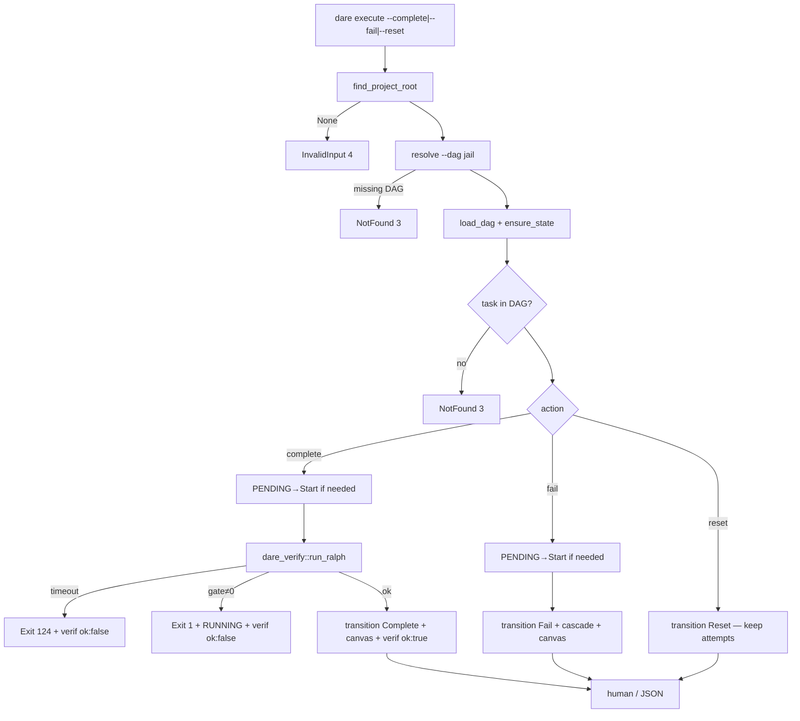

# BLUEPRINT: Execute — complete, fail, reset e Ralph inicial (Microplano 029)

> **Gerado a partir de:** `DARE/DESIGN-029-execute-complete-fail-reset-e-ralph-inicial.md` v1.0  
> **Data:** 2026-07-22 | **Status:** APPROVED  
> **Arquivo:** `DARE/BLUEPRINT-029-execute-complete-fail-reset-e-ralph-inicial.md`  
> **Não substitui:** Blueprints 001–028  
> **Pré-requisitos:** Microplanos **006** (SafeCommand), **026** (`transition`), **028** (`dare execute` status/next/watch · DEC-029)  
> **Escopo:** `--complete` / `--fail` / `--reset` + crate **`dare-verify`** (Ralph build→test→lint). **Não** `--agent` (**030+**). **Não** review/mutation/formal (**032**/**049**). **Não** GraphRAG (**040+**).

---

## 0. TRADE-OFFS (Architect)

Sem `PATTERNS.md` / `patterns-facts.json`. Decisões 🟡 do Design 029 congeladas abaixo (Documento Mestre §2.1 / §5.2 / §25, DEC-029, runtime 026).

| # | Trade-off | Escolha | Justificativa |
|---|-----------|---------|---------------|
| T-01 | Crate verify | **`crates/dare-verify`** novo member | Microplano; isola spawn/gates da CLI |
| T-02 | Deps crate | `dare-verify` → `dare-core` (+ serde/serde_json); **não** depende de `dare-dag` | Evita ciclo; state transitions ficam na CLI via `dare-dag` |
| T-03 | CLI mutações | Estender `commands/execute.rs` + clap flat flags | Paridade 028; um comando `execute` |
| T-04 | Exclusividade | `--complete` / `--fail` / `--reset` / `--status` / `--next` / `--watch` mutuamente exclusivos | RF-19; exit **2** |
| T-05 | `--agent` | **Ausente** do clap neste ciclo | RF-23; evita Usage ambíguo |
| T-06 | Auto-Start | Se status `PENDING` → `transition(Start)` **antes** de Ralph (`--complete`) ou Fail (`--fail`) | Complete/Fail só de `RUNNING` (026); 028 não Start-on-next |
| T-07 | Ralph fail → status | Task permanece **`RUNNING`** (não auto-Fail) | Retry `--complete` sem Reset; artefato `ok:false` |
| T-08 | Timeout | **Por gate** `Duration::from_secs(600)` em cada de build/test/lint | RF-04; aceita microplano |
| T-09 | Exit gate ≠0 | Processo CLI exit **1** (não propaga exit arbitrary do cargo) | Estável p/ skills; timeout → **124** direto |
| T-10 | Exit 124 | `ExitCode::from(124)` na CLI quando `RalphReport.timed_out` | Fora do mapa `ErrorKind` 1–5; DEC-030 |
| T-11 | Stack resolve | `dare.config.json` campo **`backend`**; fallback se `Cargo.toml` workspace/root → `rust-axum`; senão InvalidInput **4** | Este repo usa `backend: rust-axum` |
| T-12 | Adapters | **`rust-axum`** (e alias `rust`) = comandos reais; demais IDs conhecidos → InvalidInput `"stack not implemented: {id}"` | R-03; escopo mínimo |
| T-13 | Comandos rust-axum | build: `cargo build --workspace`; test: `cargo test --workspace`; lint: `cargo clippy --workspace --all-targets -- -D warnings` | Ralph Loop CLAUDE.md / notes config |
| T-14 | Ordem gates | Sempre **build → test → lint**; short-circuit no primeiro ≠0 ou 124 | Mestre §5.2 |
| T-15 | Ingestão pós-DONE | **Só** `.dare/verification/<id>.json` (file-only); **sem** `graph ingest` | Graph crate ausente; RF-16 |
| T-16 | Docs | **`docs/compatibility/cli-execute-mutations.md`** + **DEC-030** (não fundir status) | RF-25 |
| T-17 | Capability | Manter `dare-execute.cli_commands: ["execute"]`; atualizar `instructions` | RF-26 |
| T-18 | Default `--output` | Exact: `Task completed.` | RF-07 |
| T-19 | Default `--reason` | Exact: `Task failed.` | RF-09 |
| T-20 | Caps | Truncate `output`/`error`/stdio com `limits.task_output_chars` (default **4000** Unicode scalars via `truncate_chars`) | RF-14; 007 |
| T-21 | Verification path | `VERIFICATION_DIR_REL` = `.dare/verification`; ficheiro `{id}.json`; id deve match `^[A-Za-z0-9][A-Za-z0-9._-]*$` além de existir no DAG | RS-01; R-06 |
| T-22 | `--skip-ralph` | **Não** expor | RF-31 |
| T-23 | Container Fase 1 | Reusar `docker-compose.ci.yml` | Sem imagem nova |
| T-24 | Clock | `SystemClock` CLI; testes `FixedClock` / mock runner | 026 / 006 |
| T-25 | Canvas | Mutações bem-sucedidas: `transition(..., RefreshCanvas::Yes)` | RF-12 |
| T-26 | Reset attempts | `transition(Reset)` **não** limpa `attempts` (já 026) — teste de regressão obrigatório | Aceite microplano |
| T-27 | Fail mid-RUNNING | `--fail` de `RUNNING` sem Ralph | RF-09 |
| T-28 | Complete de DONE | InvalidInput **4** (`invalid transition Complete from DONE`) | Sem re-complete |
| T-29 | Smokes Ralph | `MockProcessRunner` / injeção de runner; sem `cargo test` real nos smokes default | R-04 |
| T-30 | DEC | **DEC-030** active | Complements DEC-029 |

### 0.1 Exit codes (congelados)

| Code | Quando |
|------|--------|
| 0 | complete / fail / reset OK |
| 1 | Internal **ou** Ralph gate falhou (exit do processo ≠0 e ≠124) |
| 2 | Usage (flags exclusivas, id ausente no clap) |
| 3 | DAG NotFound **ou** task id não está no DAG |
| 4 | InvalidInput / Config / transição ilegal / stack unknown / not implemented / id path-unsafe |
| 5 | Io (lock / write state / verification / canvas) |
| **124** | Timeout de **qualquer** gate Ralph |

### 0.2 Constantes canónicas

| Nome | Valor |
|------|-------|
| `DEFAULT_DAG_REL` | `DARE/dare-dag.yaml` (028) |
| `STATE_REL` / `CANVAS_REL` | 026 |
| `VERIFICATION_DIR_REL` | `.dare/verification` |
| `RALPH_TIMEOUT_SECS` | `600` |
| `MSG_OUTPUT_DEFAULT` | `Task completed.` |
| `MSG_REASON_DEFAULT` | `Task failed.` |
| `MSG_COMPLETE_OK` | `✅ Task {id} marked DONE (Ralph passed).` |
| `MSG_COMPLETE_GATE_FAIL` | `Ralph failed — task {id} left RUNNING (not DONE).` |
| `MSG_FAIL_OK` | `❌ Task {id} marked FAILED.` |
| `MSG_RESET_OK` | `🔄 Task {id} reset to PENDING.` |

### 0.3 Stack IDs

| `backend` / id | Neste ciclo |
|----------------|-------------|
| `rust-axum`, `rust` | **Implementado** (T-13) |
| `node-nestjs`, `python-fastapi`, `php-laravel`, `go-gin`, `go-stdlib`, `react`, `vue`, `rust-leptos`, `rust-leptos-csr`, `mcp-node-ts`, … | **Not implemented** → exit **4** mensagem contém `not implemented` |
| ausente + detecção Cargo | mapear para `rust-axum` |
| outro / vazio sem Cargo | exit **4** `unknown stack` |

### 0.4 GAP

| Item | Estado | Ação |
|------|--------|------|
| `transition` Start/Complete/Fail/Reset | ✅ 026 | Reusar |
| `SafeCommand` / timeout 124 | ✅ 006 | Reusar |
| `dare execute` status/next/watch | ✅ 028 | Estender |
| `dare-verify` / Ralph | 🔴 | Criar |
| `.dare/verification/**` | 🔴 | Criar writer |
| Flags complete/fail/reset | 🔴 | Clap + paths |
| `cli-execute-mutations.md` / DEC-030 | 🔴 | Criar |

---

## 1. VISÃO GERAL DA ARQUITETURA



**Decisões:**

| Decisão | Escolha | Justificativa |
|---------|---------|---------------|
| Library-first Ralph | Sim (`dare-verify`) | Testável com mock runner |
| Auto-Start | Sim em complete/fail | 026 exige RUNNING |
| File-only verification | Sim | Sem graph neste ciclo |
| Gate fail deixa RUNNING | Sim | Retry sem Reset |

---

## 2. STACK TÉCNICA DEFINIDA

| Camada | Tecnologia | Versão | Papel |
|--------|-----------|--------|-------|
| Rust | 1.85.0 | pin | Build |
| `dare-verify` | **NOVO** `0.1.0-alpha.0` | Ralph + adapters | |
| `dare-cli` | clap **4.5.40** | mutações execute | |
| `dare-dag` | workspace | `transition`, `RefreshCanvas` | |
| `dare-core` | workspace | SafeCommand, ProcessRunner, truncate, jail | |
| `dare-contracts` | workspace | state / limits / config load | |
| `dare-project` | workspace | root | |
| serde / serde_json | workspace | VerificationReport | |
| Container | compose CI 003 | Fase 1 | |

**Deps novas:** apenas o crate `dare-verify` (reusa pins workspace). Sem HTTP/LLM.

**Workspace `Cargo.toml`:** adicionar `"crates/dare-verify"` a `members`; `dare-cli` depende de `dare-verify`.

---

## 3. ESTRUTURA DE PASTAS E ARQUIVOS

```text
crates/dare-verify/
├── Cargo.toml
└── src/
    ├── lib.rs                 # pub mod ralph; pub mod stacks; re-exports
    ├── ralph.rs               # run_ralph, RalphReport, GateStep, GateAspect
    ├── stacks.rs              # resolve_stack + argv table
    └── verification.rs        # VerificationReport + write_verification

crates/dare-cli/src/
├── commands/execute.rs        # MOD: Complete/Fail/Reset actions
└── main.rs                    # MOD: clap flags complete/fail/reset + output/reason

Cargo.toml                     # MOD: members + dare-cli dep

docs/compatibility/cli-execute-mutations.md   # NOVO
docs/DECISION-LOG.md                          # DEC-030
assets/capability-matrix.yml                  # instructions dare-execute
assets/manifest.yml                           # regen se hash

tests/fixtures/dag/            # reusar valid / chain; state via smoke helpers
```

---

## 4. MODELO DE DADOS

### 4.1 `GateAspect`

```rust
#[derive(Debug, Clone, Copy, PartialEq, Eq, Serialize)]
#[serde(rename_all = "camelCase")]
pub enum GateAspect {
    Build,
    Test,
    Lint,
}
impl GateAspect {
    pub fn as_str(self) -> &'static str {
        match self {
            Self::Build => "build",
            Self::Test => "test",
            Self::Lint => "lint",
        }
    }
}
```

### 4.2 `GateStep`

```rust
#[derive(Debug, Clone, Serialize)]
#[serde(rename_all = "camelCase")]
pub struct GateStep {
    pub aspect: GateAspect,
    pub program: String,       // e.g. "cargo"
    pub args: Vec<String>,     // argv sem program
    pub exit_code: i32,        // 124 se timeout
    pub timed_out: bool,
    pub stdout_tail: String,   // truncado
    pub stderr_tail: String,   // truncado + redact na escrita verification
    pub duration_ms: u64,
}
```

### 4.3 `RalphReport`

```rust
#[derive(Debug, Clone, Serialize)]
#[serde(rename_all = "camelCase")]
pub struct RalphReport {
    pub ok: bool,              // todos steps exit_code==0 && !timed_out
    pub timed_out: bool,       // algum step timed_out
    pub stack: String,         // id resolvido
    pub steps: Vec<GateStep>,  // 0..=3 (short-circuit)
    pub total_duration_ms: u64,
}
```

### 4.4 `VerificationReport` (disco)

```rust
#[derive(Debug, Clone, Serialize, Deserialize)]
#[serde(rename_all = "camelCase")]
pub struct VerificationReport {
    pub schema_version: u32,   // always 1
    pub task_id: String,
    pub ok: bool,
    pub timed_out: bool,
    pub stack: String,
    pub aspects: Vec<GateStep>, // same shape; redact applied
    pub updated_at: String,     // RFC3339
}
```

Path: `.dare/verification/{task_id}.json` — `atomic_write` sob jail.

### 4.5 Relação com `RuntimeStateV1`

Sem mudança de schema. Campos usados:

| Campo | Complete OK | Ralph fail | Fail | Reset |
|-------|-------------|------------|------|-------|
| `status` | `DONE` | `RUNNING` | `FAILED` | `PENDING` |
| `output` | `--output` truncado | inalterado | cleared? **não** (Fail seta `error`) | cleared |
| `error` | cleared by Complete path | inalterado | `--reason` truncado | cleared |
| `attempts` | +1 `passed:true` | **sem** novo attempt | +1 `passed:false` | **preservado** |

> Nota: Ralph fail **não** chama `transition(Fail)` nem `append_attempt` — só deixa RUNNING.

---

## 5. CONTRATOS DE API (CLI)

### 5.1 Superfície

```text
dare execute --complete <TASK_ID> [--output <TEXT>] [--dag <PATH>]
dare execute --fail <TASK_ID> [--reason <TEXT>] [--dag <PATH>]
dare execute --reset <TASK_ID> [--dag <PATH>]
# + --json / --no-color globais
# status/next/watch permanecem (028)
```

Clap: `<TASK_ID>` como `Option<String>` associado à flag (`num_args=1`) **ou** positional exclusivo — **congelado:**

```rust
#[arg(long, value_name = "TASK_ID", conflicts_with_all = ["status","next","watch","fail","reset"])]
complete: Option<String>,
#[arg(long, value_name = "TASK_ID", conflicts_with_all = ["status","next","watch","complete","reset"])]
fail: Option<String>,
#[arg(long, value_name = "TASK_ID", conflicts_with_all = ["status","next","watch","complete","fail"])]
reset: Option<String>,
#[arg(long)]
output: Option<String>,   // só meaningful com --complete
#[arg(long)]
reason: Option<String>,   // só meaningful com --fail
```

Se `--complete` sem valor → clap Usage **2**.  
`--output` sem `--complete` → Usage **2** (clap `requires = "complete"`).  
`--reason` sem `--fail` → Usage **2** (`requires = "fail"`).

### 5.2 Assinaturas de domínio (ANTI-STUB)

```rust
// crates/dare-verify/src/stacks.rs
pub fn resolve_stack(root: &ProjectRoot) -> CoreResult<String>;
/// Lê dare.config.json `backend` (string); se ausente e existe Cargo.toml → "rust-axum";
/// Err(invalid_input) se unknown.

pub fn gate_commands(stack: &str) -> CoreResult<Vec<(GateAspect, SafeCommand)>>;
/// rust-axum/rust → 3 SafeCommand com cwd=ProjectRoot, timeout=600s;
/// known-but-unimplemented → Err(invalid_input("stack not implemented: …"));
/// unknown → Err(invalid_input("unknown stack: …"));

// crates/dare-verify/src/ralph.rs
pub fn run_ralph(
    root: &ProjectRoot,
    stack: &str,
    runner: &dyn ProcessRunner,
    stdout_cap_chars: usize,
) -> CoreResult<RalphReport>;
/// Pré: stack implementado.
/// Pós: steps preenchidos em ordem; ok iff all exit 0; timed_out se algum 124.
/// Short-circuit: para no primeiro step com exit≠0 ou timed_out.
/// Nunca marca state (sem I/O de state).

// crates/dare-verify/src/verification.rs
pub fn write_verification(
    root: &ProjectRoot,
    report: &VerificationReport,
) -> CoreResult<()>;
/// Path SafeRelativePath::new(format!("{VERIFICATION_DIR_REL}/{}.json", report.task_id))?;
/// Cria `.dare/verification/` se necessário; atomic_write; redact tails antes de serializar.

// crates/dare-cli — orchestration (não pub crate)
fn ensure_running(root, doc, task_id, clock) -> CoreResult<()>;
/// Se PENDING → transition(Start, RefreshCanvas::No); se RUNNING → Ok;
/// senão Err(invalid_input).

fn run_complete(…) -> ExitCode; // ver Apêndice C
fn run_fail(…) -> ExitCode;
fn run_reset(…) -> ExitCode;
```

### 5.3 Pré / pós-condições por ação

#### `--complete`

| | |
|--|--|
| **Pré** | Root OK; DAG load; task ∈ DAG; id path-safe; stack resolúvel e implementada |
| **Passos** | ensure_state → ensure_running → run_ralph → write_verification(ok=ralph.ok) → se !ok: return 1/124 **sem** Complete → se ok: transition(Complete{output}, RefreshCanvas::Yes) → write_verification final ok=true (idempotente overwrite) |
| **Pós OK** | status DONE; attempts+=1 passed; canvas atualizado; verification ok=true; exit 0 |
| **Pós gate fail** | status RUNNING; attempts inalterado; verification ok=false; exit 1 |
| **Pós timeout** | status RUNNING; verification timedOut=true; exit **124** |

#### `--fail`

| | |
|--|--|
| **Pré** | task ∈ DAG |
| **Passos** | ensure_state → ensure_running → transition(Fail{error:reason}, RefreshCanvas::Yes) |
| **Pós** | status FAILED; cascade skip; attempts+=1 passed=false; exit 0 |
| **Erro** | DONE/SKIPPED/… sem PENDING/RUNNING → 4 |

#### `--reset`

| | |
|--|--|
| **Pré** | task ∈ DAG |
| **Passos** | ensure_state → transition(Reset, RefreshCanvas::Yes) |
| **Pós** | PENDING (ou no-op se já PENDING); output/error empty; **attempts length igual**; exit 0 |

### 5.4 Edge cases enumerados

| Caso | Resultado |
|------|-----------|
| `--complete` + `--fail` | clap exit **2** |
| Task id fora do DAG | **3** |
| Task id com `/` ou `..` | **4** (mesmo se YAML tivesse — IDs DAG já restritos) |
| Complete de DONE | **4** invalid transition |
| Complete de FAILED | **4** (precisa `--reset` antes) |
| Ralph build exit 1 | verification ok=false; RUNNING; CLI exit **1**; test/lint **não** correm |
| Ralph test timeout | steps: build ok + test timed_out; exit **124** |
| Lock held | **5** |
| Stack `node-nestjs` | **4** `not implemented` |
| `--output` 10_000 chars | truncate a `task_output_chars` |
| Dois complete paralelos | um 0; outro **5** lock |
| Reset PENDING | exit **0** no-op |
| Crash após Ralph ok antes de Complete | state RUNNING; verification pode ok=true parcial — retry complete reexecuta Ralph (aceitável) |

### 5.5 JSON `data` shapes

**Complete success**

```json
{
  "action": "complete",
  "taskId": "task-001",
  "status": "DONE",
  "verificationPath": ".dare/verification/task-001.json",
  "ralph": { "ok": true, "timedOut": false, "stack": "rust-axum", "steps": [/*…*/], "totalDurationMs": 123 }
}
```

**Complete gate fail** (exit 1; envelope `ok:false` via `write_error` **ou** success envelope com ok false — **congelado:** usar `write_error` / exit≠0 com JSON error **ou** report JSON em stdout com `ok:false` no envelope)

**Congelado:** em falha Ralph, stdout JSON envelope `ok: false`, `error.kind` = `Internal` (exit 1) ou mensagem timeout com exit 124; `data` opcional **não** — manter 004: error envelope sem data. Human em stderr: `MSG_COMPLETE_GATE_FAIL`.

**Fail / Reset success**

```json
{ "action": "fail", "taskId": "task-001", "status": "FAILED", "reason": "…" }
{ "action": "reset", "taskId": "task-001", "status": "PENDING", "attemptsPreserved": true }
```

### 5.6 Human output

- Complete OK: `MSG_COMPLETE_OK` + opcional resumo steps (aspect exit)
- Complete fail: `MSG_COMPLETE_GATE_FAIL` + primeiro step falho (aspect, exit_code)
- Fail OK: `MSG_FAIL_OK`
- Reset OK: `MSG_RESET_OK`

### 5.7 Side effects (ordem)

**Complete OK:**  
1. ensure_state (pode criar PENDING)  
2. Start (se PENDING)  
3. spawn gates (processos)  
4. write verification (ok conforme ralph)  
5. se fail → stop  
6. Complete + cascade + save state  
7. canvas write  
8. overwrite verification ok=true  

**Fail:** ensure → Start? → Fail+cascade+save → canvas  

**Reset:** ensure → Reset+save → canvas  

---

## 6. PLANO DE EXECUÇÃO (FASES)

### Fase 1: Containerização

- **DONE:** `docker compose -f docker-compose.ci.yml config` exit 0 (ou waiver em `cli-execute-mutations.md`).
- **Entregáveis:** nota/waiver.

### Fase 2: Crate `dare-verify` — stacks + `run_ralph`

- **DONE:** member workspace; `resolve_stack`; `gate_commands` rust-axum; `run_ralph` short-circuit + timeout 600; unit com `MockProcessRunner` (ok, fail mid, timeout 124); `cargo test -p dare-verify`.
- **Entregáveis:** `crates/dare-verify/**`.

### Fase 3: Verification writer

- **DONE:** `VerificationReport` schema 1; `write_verification` jail+atomic; redact tails; cria dir; unit FS.
- **Entregáveis:** `verification.rs`.

### Fase 4: CLI `--complete` + smokes

- **DONE:** clap flags; auto-Start; Ralph; bloqueio DONE; exit 1/124; JSON/human; smokes com mock (injetar via `cfg(test)` env `DARE_RALPH_MOCK=1` **ou** feature — **congelado:** env `DARE_RALPH_MOCK=1` faz CLI usar mock que sempre passa / `=fail` / `=timeout`); smokes: complete ok→DONE; gate fail→RUNNING+exit1; timeout→124; missing task→3; exclusive→2.
- **Entregáveis:** execute.rs + main.rs + smokes.

### Fase 5: CLI `--fail` + `--reset`

- **DONE:** fail cascade; reset preserva attempts (assert len); smokes fail/reset; Complete-from-DONE→4.
- **Entregáveis:** paths fail/reset + testes.

### Fase 6: Docs DEC-030 + capability

- **DONE:** `cli-execute-mutations.md`; DEC-030; instructions matrix; `assets verify` ok.
- **Entregáveis:** docs + matrix/manifest.

### Fase 7: Auditoria Ralph (meta)

- **DONE:** `fmt --check`; `clippy -D warnings` em dare-verify+dare-cli+dare-dag; `cargo test -p dare-verify`; `cli_smoke` filter `execute_`; `cargo audit`.
- **Entregáveis:** gates verdes.

### Fase 8: Fechamento

- **DONE:** TASKS-029 100%; matriz 000A 029 ✅; Blueprint APPROVED.
- **Entregáveis:** closeout; sem git commit obrigatório.

---

## 7. VALIDATION GATES

| Stack | Build | Test | Lint / Audit |
|-------|-------|------|--------------|
| Rust | `cargo build -p dare-verify -p dare-cli` | `cargo test -p dare-verify` + `cargo test -p dare-cli --test cli_smoke -- execute` | `clippy -D warnings` + `fmt --check` |
| Audit | — | — | `cargo audit` se deps |
| Container | — | — | compose `config` |

---

## 8. CONTROLES DE SEGURANÇA (RS → fase)

| RS | Controlo | Fase |
|----|----------|------|
| RS-01 | Jail dag + verification path + id regex | 3–5 |
| RS-02 | Redact em verification tails + erros | 3–4 |
| RS-03 | State/verification só sob root | 4–5 |
| RS-04 | audit | 7 |
| RS-05 | Sem secrets hardcoded; denylist env nos gates | 2 / 4 |
| RS-06 | argv-only SafeCommand | 2 |
| RS-07 | Timeout 600 s / gate | 2 |
| RS-08 | Sem DONE se Ralph falhou | 4 |
| RS-09 | Truncate + redact `--output`/`--reason` | 4–5 |

---

## 9. ESTRATÉGIA DE TESTES

| Tipo | Cobertura |
|------|-----------|
| Unit verify | resolve_stack; gate_commands rust; run_ralph ok/fail/timeout; short-circuit |
| Unit verification | write+read roundtrip; path unsafe id |
| Unit dag (regressão) | Reset preserva attempts (já 026 — reforçar se necessário) |
| Smoke CLI | complete ok/fail/timeout; fail; reset; exclusive; missing; invalid transition |
| Segurança | verification path jail; sem shell |
| Compat | exit 124; strings MSG_*; Classe B auto-Start vs TS |

---

## 10. ESTRATÉGIA DE DEPLOY

| Ambiente | Trigger | Artefato |
|----------|---------|----------|
| Local | dev | bin `dare` com mutações |
| CI | PR | matrix 003 |
| Alpha | herda 015 | binário Ciclo 7 completo (status…reset) |

---

## 11. CHECKLIST DE APROVAÇÃO

- [ ] T-06…T-10 (auto-Start; RUNNING on fail; exit 1 vs 124) aceites
- [ ] T-12…T-15 (adapters rust-only; file-only verification) aceites
- [ ] JSON / human / MSG_* §0.2 §5.5–5.6 aceites
- [ ] Env `DARE_RALPH_MOCK` para smokes aceite
- [ ] Fora de escopo 030+/032/049 confirmado
- [ ] DEC-030 + `cli-execute-mutations.md`
- [ ] Fases 1–8 com DONE verificável
- [ ] Pronto para `/dare-tasks` → `TASKS-029` + `dare-dag-029.yaml` + `EXECUTION-029/`

---

## Apêndice A — Design → Blueprint

| Design | Blueprint |
|--------|-----------|
| Auto-Start 🟡 | **T-06** Sim |
| Exit gate 🟡 | **T-09** exit **1** (não propagar) |
| Timeout 124 | **T-10** |
| Ingestão 🟡 | **T-15** file-only |
| Stacks 🟡 | **T-12** rust real; resto not implemented |
| Timeout por gate vs total | **T-08** por gate |
| Ralph fail status 🟡 | **T-07** RUNNING |
| DEC nº | **DEC-030** |

## Apêndice B — Fora de escopo (reaffirm)

- `--agent` / worktrees / budget / decay (**030–031**)
- `dare review` anti-stub (**032**)
- mutation / formal / best-of-N / fail-to-pass (**049**)
- GraphRAG ingest (**040+**)
- Alterar DEC-029 (no Start-on-next)

## Apêndice C — Semântica `--complete` (normativa)

```text
1. root + resolve dag + load_dag + ensure_state
2. if task ∉ DAG → NotFound 3
3. if task id unsafe → InvalidInput 4
4. resolve_stack + gate_commands (may 4)
5. ensure_running: PENDING→Start (RefreshCanvas::No)
6. if not RUNNING → InvalidInput 4
7. run_ralph (mock if DARE_RALPH_MOCK set)
8. write_verification(ok=ralph.ok, …)
9. if ralph.timed_out → human/error; ExitCode(124)
10. if !ralph.ok → human/error; ExitCode(1)  // left RUNNING
11. output = truncate(--output or MSG_OUTPUT_DEFAULT)
12. transition(Complete { output }, RefreshCanvas::Yes)
13. write_verification(ok=true) // final
14. print success human/JSON; ExitCode(0)
```

## Apêndice D — Classificação vs TS (nota DEC-030)

| Comportamento | TS 3.18.1 (ref.) | Nativo 029 | Classe |
|---------------|------------------|------------|--------|
| Auto-Start em complete | típico implícito | **Sim** | A/B |
| Ralph obrigatório | Sim | **Sim** | A |
| Gate fail exit code | variável | **1** estável | B |
| Timeout | 124 | **124** | A |
| Reset preserva attempts | esperado | **Sim** | A |
| Stacks não-Rust | várias | not implemented | C (adiado) |

## Apêndice E — `DARE_RALPH_MOCK` (test-only)

| Valor | Comportamento |
|-------|----------------|
| unset / vazio | `SystemProcessRunner` real |
| `1` / `pass` | 3 steps exit 0 sem spawn |
| `fail` | build exit 1 |
| `timeout` | build timed_out exit 124 |

Documentar em `cli-execute-mutations.md` como **test harness only** (não flag CLI).

## Apêndice F — Próximo passo

Após aprovação humana: `/dare-tasks` sobre este Blueprint → artefatos `TASKS-029` / `dare-dag-029.yaml` / `EXECUTION-029/`.  
Closeout → [`030-execute-agent-mock-worktrees-e-budget.md`](../DARE-RUST-MICRO-PLANOS/DARE-RUST-MICRO-PLANOS/030-execute-agent-mock-worktrees-e-budget.md).
