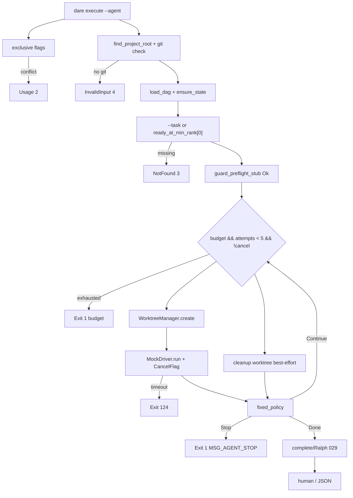

# BLUEPRINT: Execute agent — mock, worktrees e budget (Microplano 030)

> **Gerado a partir de:** `DARE/DESIGN-030-execute-agent-mock-worktrees-e-budget.md` v1.0  
> **Data:** 2026-07-22 | **Status:** APPROVED (execução concluída 8/8)  
> **Arquivo:** `DARE/BLUEPRINT-030-execute-agent-mock-worktrees-e-budget.md`  
> **Não substitui:** Blueprints 001–029  
> **Pré-requisitos:** Microplanos **006** (SafeCommand / CancelFlag), **029** (complete / Ralph / DEC-030)  
> **Escopo:** `dare execute --agent` com driver **`mock`/`noop`**, worktrees, `BudgetTracker`, cancel, `failureSignature`, política **`fixed`**. **Não** drivers reais (**031**). **Não** decay/REPLAN (**033**). **Não** guard exit 6 (**034**). **Não** best-of-N (**049**).

---

## 0. TRADE-OFFS (Architect)

Sem `PATTERNS.md` / `patterns-facts.json`. Decisões 🟡 do Design 030 congeladas (Documento Mestre §15 / §26, DEC-029/030, runtime 006/026/029).

| # | Trade-off | Escolha | Justificativa |
|---|-----------|---------|---------------|
| T-01 | Crate | **`crates/dare-agent`** novo member | Microplano; separado de `dare-ai` / `dare-harness` (Mestre §15.1) |
| T-02 | Deps | `dare-agent` → `dare-core` + `serde`/`serde_json` + `sha2`; **não** `dare-cli` / `dare-dag` | Evita ciclo; orquestração state/Ralph na CLI |
| T-03 | Trait I/O | **`AgentDriver` sync** (`fn doctor` / `fn run`) + `&CancelFlag` | Alinha `dare-ai` / ProcessRunner; Classe B vs Mestre `async_trait` |
| T-04 | CLI module | **`commands/execute_agent.rs`** + thin wire em `execute.rs`/`main.rs` | Isola loop agent; reusa clap `Commands::Execute` |
| T-05 | Exclusividade | `--agent` exclusivo vs status/next/watch/complete/fail/reset/cleanup-worktrees | exit **2** |
| T-06 | `--driver` | Default **`mock`** se `--agent` e omitido; `noop` ≡ mock Success | RF-07 |
| T-07 | Drivers 031 | `claude\|codex\|cursor\|antigravity` → InvalidInput `"driver not implemented: {id}"` | RF-05 |
| T-08 | Mock mode | Env **`DARE_AGENT_MOCK`**: `success` (default) \| `fail` \| `timeout`; sem flag CLI | Paridade `DARE_RALPH_MOCK` |
| T-09 | Política | Só **`fixed`**; default `fixed`; `--policy decay` → **4** | RF-14/20 |
| T-10 | Fixed map | Success→**Done**; Fail→**Continue** se `attempt_n < MAX_AGENT_ATTEMPTS` senão **Stop**; Timeout/Cancel→**Stop** | Determinístico; sem REPLAN |
| T-11 | Max attempts | **`MAX_AGENT_ATTEMPTS = 5`** | Mestre §5.5 máx tentativas |
| T-12 | Budget `0` | **`0` = ilimitado** | R-05; valores >0 finitos |
| T-13 | Budget exhaust | Interrompe loop; CLI exit **1**; JSON `reason: budget_exhausted` | RF-08 |
| T-14 | Task select | `--task <id>` opcional; default = **primeiro** id de `ready_at_min_rank` (lexico já ordenado) | RF-15 |
| T-15 | Empty ready | Sem `--task` e ready vazio → mensagem resolved/blocked (028) exit **0** (sem agent loop) | Consistência 028 |
| T-16 | Ralph pós-Done | **Sim**: após mock Success+Done, chamar path Complete/Ralph (029) com output do mock summary | Aceite Ciclo 8; smokes `DARE_RALPH_MOCK=pass` |
| T-17 | Skip Ralph test | Env **`DARE_AGENT_SKIP_RALPH=1`**: para em Done **sem** Ralph (só testes de agent); **não** flag CLI | R-04 |
| T-18 | Worktree root | **`AGENT_WORKTREES_REL` = `.dare/agent-worktrees`** | Microplano (≠ TS `.dare/worktrees`) Classe B |
| T-19 | Branch | `dare/agent-{taskId}-{n}` (`n` = attempt 1-based) | Canónico |
| T-20 | Worktree dir | `.dare/agent-worktrees/{taskId}-{n}/` | Path-safe id |
| T-21 | Git ops | `git worktree add -b <branch> <path> HEAD` / `git worktree remove --force <path>` via SafeCommand | RS-06 |
| T-22 | Cleanup auto | Após cada iteração: best-effort `remove`; falha → orphan listável | O-06 |
| T-23 | Cleanup CLI | Flag exclusiva **`--cleanup-worktrees`**: lista+remove órfãos sob `AGENT_WORKTREES_REL`; exit 0 | RF-26 |
| T-24 | Guard | `guard_preflight_stub() -> Ok(())`; **nunca** exit **6** | RF-16; 034 |
| T-25 | `--best-of` | **Ausente** | RF-19 defer 049 |
| T-26 | `--require-approval` | **Ausente** | Design fora |
| T-27 | Signature | `failure_signature(aspect, stderr)` = primeiros **8** hex chars de SHA-256(`aspect || 0x00 || normalize(stderr)`) UTF-8 | RF-13 |
| T-28 | Normalize stderr | NFKC skip; lowercase ASCII; strip ANSI CSI; `\s+` → single space; trim | Determinismo |
| T-29 | Cancel | CLI cria `CancelFlag`; mock checa entre “phases”; Ctrl+C seta flag (best-effort) | RF-12 |
| T-30 | Docs | **`docs/compatibility/cli-execute-agent.md`** + **DEC-031** | RF-21 |
| T-31 | Capability | Atualizar `dare-execute` instructions (`--agent --driver mock`) | RF-22 |
| T-32 | Container | Reusar compose CI | T-23 style 029 |
| T-33 | No git | Sem `.git` → InvalidInput **4** `"git repository required for --agent"` | RF-27 |
| T-34 | Mock timeout exit | `AgentRunStatus::Timeout` → CLI **`ExitCode::from(124)`** | O-04 |
| T-35 | Record fail attempt | Em Fail: append attempt `passed=false` + `failureSignature` + `failedAspect="agent"` **sem** `transition(Fail)` se Continue; se Stop após fails → opcional Fail transition — **congelado:** Stop **não** marca FAILED automaticamente (humano `--fail`); só tenta Ralph/Complete em Done | Evita cascade acidental |

### 0.1 Exit codes (congelados)

| Code | Quando |
|------|--------|
| 0 | Agent Done (+ Ralph OK se não skip) **ou** cleanup-worktrees OK **ou** nothing-to-run (resolved/blocked informativo) |
| 1 | Internal **ou** budget exhausted **ou** FixedDecision::Stop após fails **ou** Ralph gate fail (029) |
| 2 | Usage (flags exclusivas) |
| 3 | DAG NotFound **ou** `--task` ausente do DAG |
| 4 | InvalidInput / no git / driver not implemented / policy decay / unsafe id |
| 5 | Io (lock / worktree / state) |
| **124** | Mock timeout **ou** Ralph timeout |
| **6** | **Não usar** (reservado 034) |

### 0.2 Constantes canónicas

| Nome | Valor |
|------|-------|
| `AGENT_WORKTREES_REL` | `.dare/agent-worktrees` |
| `MAX_AGENT_ATTEMPTS` | `5` |
| `DEFAULT_DRIVER` | `mock` |
| `DEFAULT_POLICY` | `fixed` |
| `MSG_AGENT_DONE` | `✅ Agent finished task {id} (decision=Done).` |
| `MSG_AGENT_STOP` | `⏹ Agent stopped task {id} (decision=Stop).` |
| `MSG_AGENT_BUDGET` | `Agent stopped — budget exhausted.` |
| `MSG_CLEANUP_OK` | `Cleaned {n} agent worktree(s).` |
| `MSG_NO_GIT` | `git repository required for --agent` |

### 0.3 GAP

| Item | Estado | Ação |
|------|--------|------|
| CancelFlag / SafeCommand | ✅ 006 | Reusar |
| ready_at_min_rank / execute | ✅ 028/029 | Reusar |
| Ralph / complete | ✅ 029 | Reusar pós-Done |
| AttemptRecord.failureSignature | ✅ contracts | Preencher |
| `dare-agent` | 🔴 | Criar |
| Worktrees / budget / fixed | 🔴 | Criar |
| `--agent` CLI | 🔴 | Criar |
| DEC-031 / cli-execute-agent.md | 🔴 | Criar |

---

## 1. VISÃO GERAL DA ARQUITETURA



**Decisões:**

| Decisão | Escolha | Justificativa |
|---------|---------|---------------|
| Sync driver | Sim | R-01 / T-03 |
| Ralph após Done | Sim | T-16 |
| Path agent-worktrees | Sim | T-18 microplano |

---

## 2. STACK TÉCNICA DEFINIDA

| Camada | Tecnologia | Versão | Papel |
|--------|-----------|--------|-------|
| Rust | 1.85.0 | pin | Build |
| `dare-agent` | **NOVO** | AgentDriver / mock / budget / worktree / policy / signature |
| `dare-cli` | clap 4.5.40 | `--agent` / `--cleanup-worktrees` |
| `dare-core` | workspace | SafeCommand, CancelFlag, redact, truncate, jail |
| `dare-dag` / `dare-verify` | workspace | ready / transition / Ralph (CLI only) |
| `sha2` | workspace pin | failure_signature |
| Git | system `git` | worktree add/remove |
| Container | compose CI 003 | Fase 1 |

**Workspace:** adicionar `crates/dare-agent` a `members`; `dare-cli` depende de `dare-agent`.

---

## 3. ESTRUTURA DE PASTAS E ARQUIVOS

```text
crates/dare-agent/
├── Cargo.toml
└── src/
    ├── lib.rs
    ├── driver.rs          # AgentDriver, AgentRequest, AgentRunResult, DriverHealth
    ├── mock.rs            # MockDriver, MockMode, Noop alias
    ├── budget.rs          # BudgetTracker
    ├── worktree.rs        # WorktreeManager
    ├── policy.rs          # FixedDecision, apply_fixed
    └── signature.rs       # failure_signature, normalize_stderr

crates/dare-cli/src/
├── commands/
│   ├── execute.rs         # MOD: wire Agent / CleanupWorktrees actions
│   ├── execute_agent.rs   # NOVO: run_agent_loop
│   └── mod.rs
└── main.rs                # clap --agent --driver --budget-tokens --policy --task --cleanup-worktrees

docs/compatibility/cli-execute-agent.md
docs/DECISION-LOG.md       # DEC-031
assets/capability-matrix.yml
```

---

## 4. MODELO DE DADOS

### 4.1 `DriverHealth`

```rust
#[derive(Debug, Clone, Serialize)]
#[serde(rename_all = "camelCase")]
pub struct DriverHealth {
    pub driver: String,
    pub ok: bool,
    pub detail: String, // e.g. "mock ready"
}
```

### 4.2 `AgentRunStatus`

```rust
#[derive(Debug, Clone, Copy, PartialEq, Eq, Serialize)]
#[serde(rename_all = "camelCase")]
pub enum AgentRunStatus {
    Success,
    Failure,
    Timeout,
    Cancelled,
}
```

### 4.3 `AgentRequest` / `AgentRunResult`

```rust
pub struct AgentRequest {
    pub task_id: String,
    pub prompt: String,
    pub cwd: PathBuf,           // worktree path
    pub model: Option<String>,  // unused by mock
    pub stdout_cap_chars: usize,
}

pub struct AgentRunResult {
    pub status: AgentRunStatus,
    pub summary: String,
    pub stdout: String,         // already redacted by driver
    pub stderr: String,
    pub tokens: Option<u64>,    // mock Success reports Some(1) default; Fail/Timeout None
    pub duration_ms: u64,
}
```

### 4.4 `MockMode`

```rust
pub enum MockMode { Success, Fail, Timeout }
impl MockMode {
    pub fn from_env() -> Self; // DARE_AGENT_MOCK
}
```

### 4.5 `BudgetTracker`

```rust
pub struct BudgetTracker {
    limit: Option<u64>,      // None if 0=unlimited
    used: u64,
}
impl BudgetTracker {
    pub fn new(budget_tokens: u64) -> Self;
    pub fn remaining(&self) -> Option<u64>;
    pub fn can_continue(&self) -> bool;
    pub fn consume(&mut self, tokens: u64) -> bool; // false if would exceed / already exhausted
}
```

### 4.6 `FixedDecision` + policy

```rust
pub enum FixedDecision { Done, Continue, Stop }

pub fn apply_fixed(
    status: AgentRunStatus,
    attempt_n: u32, // 1-based after this run
    max_attempts: u32,
) -> FixedDecision;
// Success → Done
// Failure if attempt_n < max → Continue else Stop
// Timeout | Cancelled → Stop
```

### 4.7 `WorktreeSpec`

```rust
pub struct WorktreeSpec {
    pub task_id: String,
    pub attempt: u32,
    pub branch: String,     // dare/agent-{id}-{n}
    pub rel_path: String,   // .dare/agent-worktrees/{id}-{n}
}
```

---

## 5. CONTRATOS DE API

### 5.1 Superfície CLI

```text
dare execute --agent [--driver mock|noop] [--task ID] [--budget-tokens N] [--policy fixed] [--dag PATH]
dare execute --cleanup-worktrees [--dag PATH]   # dag ignored for cleanup; root still required
```

Clap (esqueleto):

```rust
agent: bool,  // conflicts_with_all = [status,next,watch,complete,fail,reset,cleanup_worktrees]
driver: Option<String>,           // default mock when agent
task: Option<String>,             // requires agent
budget_tokens: Option<u64>,       // default 0 = unlimited; requires agent
policy: Option<String>,           // default fixed; requires agent
cleanup_worktrees: bool,          // exclusive
```

`--driver` / `--task` / `--budget-tokens` / `--policy` sem `--agent` → Usage **2** (`requires = "agent"`).

### 5.2 Assinaturas de domínio (ANTI-STUB)

```rust
pub trait AgentDriver: Send + Sync {
    fn id(&self) -> &'static str;
    fn doctor(&self) -> CoreResult<DriverHealth>;
    fn run(&self, req: &AgentRequest, cancel: &CancelFlag) -> CoreResult<AgentRunResult>;
}

pub fn resolve_driver(id: &str) -> CoreResult<Box<dyn AgentDriver>>;
// mock | noop → MockDriver; else Err(invalid_input("driver not implemented: …"))

impl MockDriver {
    pub fn from_env() -> Self;
    // Success: sleep 0; if cancel→Cancelled; tokens=Some(1); summary="mock success"
    // Fail: stderr="mock failure"; status Failure; tokens=None
    // Timeout: status Timeout (CLI maps 124)
}

pub fn failure_signature(aspect: &str, stderr: &str) -> String;
pub fn normalize_stderr(stderr: &str) -> String;

impl WorktreeManager {
    pub fn new(root: ProjectRoot, runner: Arc<dyn ProcessRunner>) -> Self;
    pub fn create(&self, task_id: &str, attempt: u32) -> CoreResult<WorktreeSpec>;
    pub fn remove(&self, spec: &WorktreeSpec) -> CoreResult<()>;
    pub fn list_orphans(&self) -> CoreResult<Vec<PathBuf>>; // dirs under AGENT_WORKTREES_REL
    pub fn cleanup_all(&self) -> CoreResult<usize>; // remove orphans; return count
}
// create pré: task_id path-safe; .git exists; create_dir_all parent
// git worktree add -b branch rel_path HEAD  (cwd=project root)
```

### 5.3 Loop `run_agent` (CLI) — pré/pós

| | |
|--|--|
| **Pré** | Root; `.git`; dag; driver mock/noop; policy fixed; guard stub |
| **Select** | `--task` ou `ready_at_min_rank()[0]` |
| **Loop** | `attempt=1..MAX`; budget.can_continue; !cancel |
| **Body** | create WT → compose prompt (028 `compose_task_prompt`) → `driver.run` → consume tokens → if Fail record signature in memory + append attempt via state helper 🟡 **congelado:** persist attempt through `transition` only on final Complete/Fail; **interim:** write attempt by loading state under lock and `append` then save — **simplificar:** só persistir attempts no Ralph Complete (success) ou se Stop após fail chamar `transition(Fail)` com reason=summary — **REVISÃO T-35:** em **Failure+Continue**: `ensure_running` + append attempt failed **sem** mudar status de RUNNING (precisa API). **Pragmático congelado:** usar `transition(Fail)` **somente** em Stop; em Continue só log+JSON step; failureSignature calculado e incluído no JSON do step; no Complete success Ralph grava attempt passed. Em Stop após fails: `transition(Fail{error})` com signature no attempt via Fail path (026 append_attempt — estender Fail para aceitar optional signature) **OU** post-process state. **Mínimo 030:** Fail transition em Stop; signature gravada se `transition`/`append_attempt` ganhar params opcionais em dare-dag — **se touch 026 for too large:** gravar signature só em `AgentRunResult` JSON smoke e TODO 031. **Congelado final:** estender `Transition::Fail` **não**; após `transition(Fail)`, patch attempt last `failure_signature` under lock em helper CLI `stamp_last_failure_signature` (read-modify-write state). |
| **Done** | cleanup WT; se !SKIP_RALPH → run complete path (029) com `--output` = summary |
| **Pós OK** | exit 0 |

### 5.4 Edge cases

| Caso | Resultado |
|------|-----------|
| `--agent` + `--complete` | **2** |
| `--driver claude` | **4** `not implemented` |
| `--policy decay` | **4** |
| Sem `.git` | **4** `MSG_NO_GIT` |
| `--task` missing | **3** |
| Ready vazio sem `--task` | **0** + MSG resolved/blocked |
| Budget 10, mock tokens 1 × 11 Continues | para no exhaust → **1** |
| `DARE_AGENT_MOCK=timeout` | **124** |
| Worktree remove falha | warning tracing; orphan; `--cleanup-worktrees` remove depois |
| Cancel mid-run | Cancelled → Stop → exit **1** (não 124) |

### 5.5 JSON success (`action: agent`)

```json
{
  "action": "agent",
  "taskId": "task-001",
  "driver": "mock",
  "policy": "fixed",
  "decision": "done",
  "attempts": 1,
  "budget": { "limit": null, "used": 1 },
  "worktreePath": ".dare/agent-worktrees/task-001-1",
  "result": { "status": "success", "summary": "mock success", "tokens": 1 },
  "ralphSkipped": false
}
```

### 5.6 Side effects (ordem) Done+Ralph

1. ensure_state  
2. guard stub  
3. worktree create  
4. mock run  
5. cleanup worktree  
6. ensure_running + Ralph + Complete (029)  
7. verification file (029)  

---

## 6. PLANO DE EXECUÇÃO (FASES)

### Fase 1: Containerização

- **DONE:** `docker compose -f docker-compose.ci.yml config` exit 0 (ou waiver em `cli-execute-agent.md`).
- **Entregáveis:** nota/waiver.

### Fase 2: Crate `dare-agent` — driver, mock, budget, policy, signature

- **DONE:** member workspace; sync `AgentDriver`; `MockDriver` success/fail/timeout+cancel; `BudgetTracker` (0=∞); `apply_fixed`; `failure_signature` golden hex; unit tests; `cargo test -p dare-agent`.
- **Entregáveis:** `crates/dare-agent/src/{driver,mock,budget,policy,signature,lib}.rs`.

### Fase 3: WorktreeManager

- **DONE:** create/remove/list_orphans/cleanup_all; git argv; path jail; integration test com `git init` tempfile (+ skip se git ausente `#[ignore]` ou detect); unit com MockProcessRunner para argv esperado.
- **Entregáveis:** `worktree.rs`.

### Fase 4: CLI `--agent` loop + Ralph on Done

- **DONE:** clap flags; `execute_agent.rs`; select task; loop fixed; exits 1/124/4; smokes: success+Ralph mock; fail→stop; timeout→124; unknown driver→4; budget exhaust→1; exclusive→2.
- **Entregáveis:** CLI + `cli_smoke` `execute_agent_*`.

### Fase 5: `--cleanup-worktrees` + recovery

- **DONE:** flag exclusiva; remove orphans; smoke cria dir lixo + cleanup count≥1.
- **Entregáveis:** path cleanup + teste.

### Fase 6: Docs DEC-031 + capability

- **DONE:** `cli-execute-agent.md`; DEC-031; matrix instructions; assets verify.
- **Entregáveis:** docs + manifest.

### Fase 7: Auditoria Ralph (meta)

- **DONE:** fmt; clippy `-D warnings` dare-agent+dare-cli; `cargo test -p dare-agent`; `cli_smoke -- execute_agent`; audit.
- **Entregáveis:** gates verdes.

### Fase 8: Fechamento

- **DONE:** TASKS-030 100%; matriz 000A 030 ✅; Blueprint APPROVED.
- **Entregáveis:** closeout; sem git commit obrigatório.

---

## 7. VALIDATION GATES

| Stack | Build | Test | Lint / Audit |
|-------|-------|------|--------------|
| Rust | `cargo build -p dare-agent -p dare-cli` | `cargo test -p dare-agent` + `cli_smoke -- execute_agent` | `clippy -D warnings` + `fmt --check` |
| Audit | — | — | `cargo audit` |
| Container | — | — | compose `config` |

---

## 8. CONTROLES DE SEGURANÇA (RS → fase)

| RS | Controlo | Fase |
|----|----------|------|
| RS-01 | Jail dag/task/worktree ids | 3–5 |
| RS-02 | Redact em AgentRunResult | 2 / 4 |
| RS-03 | Worktrees sob root | 3 |
| RS-04 | audit | 7 |
| RS-05 | denylist env spawns | 3 |
| RS-06 | argv-only git | 3 |
| RS-07 | budget + max attempts | 2 / 4 |
| RS-08 | cancel + cleanup | 4–5 |
| RS-09 | guard stub only | 4 |

---

## 9. ESTRATÉGIA DE TESTES

| Tipo | Cobertura |
|------|-----------|
| Unit | mock modes; budget 0/∞; apply_fixed; signature golden; normalize |
| Unit/Mock git | worktree argv sequence |
| Integração git | create+remove real (quando `git` no PATH) |
| Smoke CLI | agent success/fail/timeout/budget/driver/exclusive/cleanup |
| Segurança | path escape id; redact |

---

## 10. ESTRATÉGIA DE DEPLOY

| Ambiente | Trigger | Artefato |
|----------|---------|----------|
| Local | dev | bin `dare` com `--agent` |
| CI | PR | matrix 003 |
| Alpha | herda 015 | Ciclo 8 mock |

---

## 11. CHECKLIST DE APROVAÇÃO

- [ ] T-03 sync trait + T-16 Ralph-on-Done aceites
- [ ] T-12 budget 0=∞ + T-13 exit 1 aceites
- [ ] T-18…T-23 worktree paths + cleanup aceites
- [ ] T-35 persistence signature/Stop aceites
- [ ] Sem exit 6 / sem drivers 031 / sem decay
- [ ] DEC-031 + `cli-execute-agent.md`
- [ ] Fases 1–8 com DONE verificável
- [x] Pronto para `/dare-tasks` → `TASKS-030` + `dare-dag-030.yaml` + `EXECUTION-030/` (gerados)

---

## Apêndice A — Design → Blueprint

| Design 🟡 | Blueprint |
|-----------|-----------|
| Sync vs async | **T-03** sync |
| Ralph após mock | **T-16** sim (+ T-17 skip env) |
| Budget 0 | **T-12** ilimitado |
| Task select | **T-14** `--task` ou first ready |
| Cleanup CLI | **T-23** `--cleanup-worktrees` |
| Budget exhaust exit | **T-13** → **1** |
| DEC | **DEC-031** |

## Apêndice B — Fora de escopo (reaffirm)

- Drivers reais **031**
- Decay / REPLAN / splice **033**
- Guard exit 6 **034**
- Review no loop **032**
- Best-of-N **049**

## Apêndice C — Semântica normativa `--agent`

```text
1. exclusive --agent
2. require .git else 4
3. load dag + ensure_state
4. driver = resolve(--driver or mock)
5. policy fixed only
6. guard_preflight_stub()
7. task = --task or ready_at_min_rank[0] or exit 0 empty
8. budget = BudgetTracker::new(--budget-tokens)
9. for attempt in 1..=5:
     if !budget.can_continue() → exit 1 MSG_AGENT_BUDGET
     if cancel → Stop exit 1
     wt = create(task, attempt)
     req = AgentRequest { prompt: compose_task_prompt(...), cwd: wt.path, ... }
     result = driver.run(req, cancel)
     cleanup(wt)
     if result.Timeout → exit 124
     budget.consume(result.tokens.unwrap_or(0))
     decision = apply_fixed(result.status, attempt, 5)
     if Continue: continue
     if Stop: optional stamp Fail; exit 1 MSG_AGENT_STOP
     if Done:
        if DARE_AGENT_SKIP_RALPH: exit 0
        else: run_complete(task, output=result.summary) // 029
        exit per complete
10. JSON envelope
```

## Apêndice D — Classificação vs TS / Mestre (DEC-031)

| Comportamento | Ref | Nativo 030 | Classe |
|---------------|-----|------------|--------|
| AgentDriver async | Mestre §15 | **sync** | B |
| Worktree path | TS `.dare/worktrees` | **`.dare/agent-worktrees`** | B |
| Policy fixed only | TS decay+fixed | **fixed** | C (adiado) |
| Mock driver | TS | **sim** | A |

## Apêndice E — Próximo passo

Após aprovação humana: `/dare-tasks` → `TASKS-030` / `dare-dag-030.yaml` / `EXECUTION-030/`.  
Closeout → [`031-drivers-reais-de-agentes.md`](../DARE-RUST-MICRO-PLANOS/DARE-RUST-MICRO-PLANOS/031-drivers-reais-de-agentes.md).
