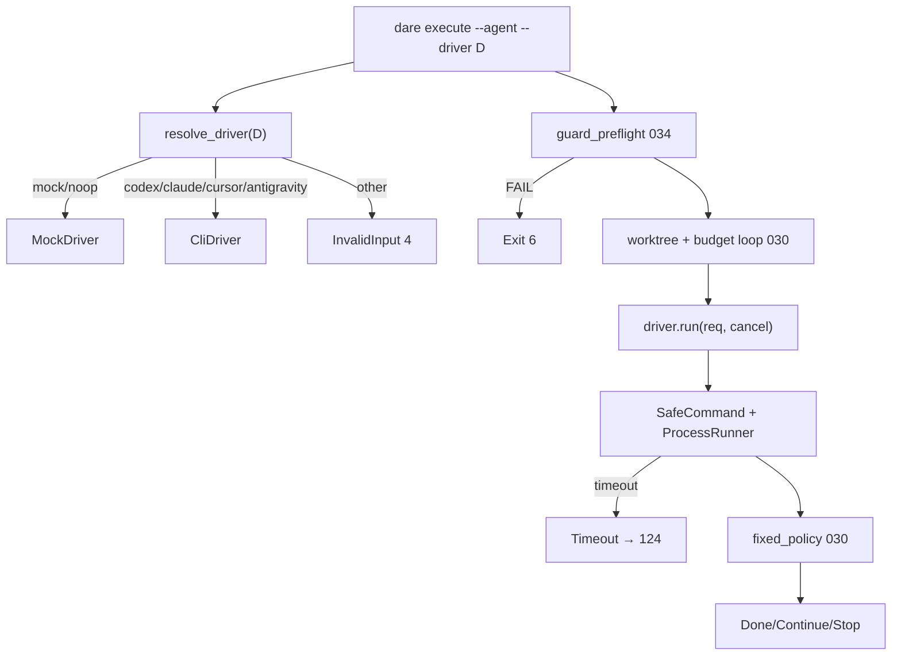

# BLUEPRINT: Drivers reais de agentes (Microplano 031)

> **Gerado a partir de:** `DARE/DESIGN-031-drivers-reais-de-agentes.md` v1.0  
> **Data:** 2026-07-23 | **Status:** APPROVED (execução concluída 8/8)  
> **Arquivo:** `DARE/BLUEPRINT-031-drivers-reais-de-agentes.md`  
> **Não substitui:** Blueprints 001–030 / 032+  
> **Pré-requisitos:** **006** (SafeCommand / CancelFlag / ProcessRunner) · **024** (`DARE_*_COMMAND`) · **030** (`AgentDriver` / mock / loop) · **034** (guard preflight exit 6)  
> **Escopo:** drivers **`codex`**, **`claude`**, **`cursor`**, **`antigravity`** em `crates/dare-agent/src/drivers/**`; `doctor`; overrides; tokens; redaction; suite comum. **Não** decay/REPLAN (**033**). **Não** Anthropic SDK. **Não** `--require-approval` TTY. **Não** best-of-N (**049**). **Não** `dare ai` (**050**).

---

## 0. TRADE-OFFS (Architect)

Sem `PATTERNS.md` / `patterns-facts.json` no repo. Decisões 🟡 ancoradas no Design 031, Mestre §15.2–15.3 / §27, DEC-031 (030), runtime 006/024/030/034.

| # | Trade-off | Escolha | Justificativa |
|---|-----------|---------|---------------|
| T-01 | Local dos drivers | **`crates/dare-agent/src/drivers/`** | Microplano; mesma crate do trait |
| T-02 | Dep `dare-ai` | **Não** depender de `dare-ai` | Evita acoplamento enrichment↔agent |
| T-03 | `parse_argv_override` | **Duplicar** helper mínimo em `dare-agent/src/drivers/argv.rs` (mesma semântica 024) | T-02; testes próprios |
| T-04 | Trait I/O | Manter **sync** `AgentDriver` + `&CancelFlag` | Classe B vs Mestre async; paridade 030 |
| T-05 | IDs CLI | `codex` \| `claude` \| `cursor` \| `antigravity` | Design; ≠ ProviderId `claude-code` (Classe B) |
| T-06 | Claude runtime | **Claude Code CLI** only | Mestre §15.3 passos 2–5; SDK = passo 6 fora |
| T-07 | Missing exe em `run` | `CoreError::internal("executable not found: {program}")` → CLI exit **1** | Diagnóstico claro; doctor já sinaliza `ok=false` |
| T-08 | Missing exe em `doctor` | `DriverHealth { ok: false, detail: "executable not found: {program}" }` **sem** Err | Doctor nunca derruba o processo |
| T-09 | Timeout processo | **`AGENT_DRIVER_TIMEOUT = 20 min`** | Paridade `ENRICH_TIMEOUT` 024 |
| T-10 | Timeout → status | `timed_out \|\| exit_code==124` → `AgentRunStatus::Timeout` | Loop 030 → CLI **124** |
| T-11 | Cancel | Antes do spawn + best-effort; status `Cancelled` | RF-14 |
| T-12 | Malformed | Sem evento terminal → `Failure`, summary `"malformed driver output"`, sem panic | RF-15 |
| T-13 | Tokens | Só `AgentRunResult.tokens: Option<u64>`; **sem** campo `cost` | Contrato 030 |
| T-14 | Caps | `truncate_chars` + `redact` em stdout/stderr/summary | RF-18/19 |
| T-15 | Codex default argv | `codex` + `["exec","--json","--sandbox","read-only","--ask-for-approval","never"]` | Mestre §2.1; defaults seguros |
| T-16 | Claude default argv | `claude` + `["-p","--output-format","text"]` | Non-interactive |
| T-17 | Cursor default argv | `cursor-agent` + `["--print"]` | Estável; override via env |
| T-18 | Antigravity default argv | `antigravity` + `["agent","--print"]` | Idem |
| T-19 | Stdin | Prompt UTF-8 no **stdin** | Paridade Codex enrich 024 |
| T-20 | cwd | `ProjectRoot::new(req.cwd)` + `SafeRelativePath` `.` | Worktree abs path do loop 030 |
| T-21 | Model | Se `req.model` Some: `--model` só em codex/claude; outros ignoram | RF-22 |
| T-22 | Runner | `Arc<dyn ProcessRunner>` via `from_env_with_runner` | RNF-06 |
| T-23 | `resolve_driver` | 4 reais + mock/noop | Remove not-implemented para esses ids |
| T-24 | Unknown id | InvalidInput `"driver not implemented: {id}"` exit **4** | 030 |
| T-25 | Docs / DEC | `cli-execute-agent.md` + **DEC-037** | RF-25 |
| T-26 | Container Fase 1 | Reusar compose CI | Padrão 029/030 |
| T-27 | Smokes | Fake override success + missing-exe; sem CLIs reais no CI | R-02 |
| T-28 | Exit missing | **1** (internal), não 4 | T-07 |
| T-29 | Nonzero exit CLI | `Failure` + stderr redacted | Não Internal |
| T-30 | Success exit 0 | `Success`; summary ≤ 512 chars pós-redact | Determinístico |

### 0.1 Exit codes (herdados 030/034)

| Code | Quando |
|------|--------|
| 0 | Done (+ Ralph) / empty ready / cleanup |
| 1 | Stop / budget / Ralph fail / **executable not found** / internal |
| 2 | Usage |
| 3 | Task / DAG not found |
| 4 | InvalidInput / no git / **unknown** driver / policy decay |
| 5 | Io |
| 6 | Guard FAIL (034) |
| 124 | Driver **Timeout** ou Ralph timeout |

### 0.2 Constantes canónicas

| Nome | Valor |
|------|-------|
| `AGENT_DRIVER_TIMEOUT` | `20 * 60` seconds |
| `ENV_CODEX` | `DARE_CODEX_COMMAND` |
| `ENV_CLAUDE` | `DARE_CLAUDE_COMMAND` |
| `ENV_CURSOR` | `DARE_CURSOR_COMMAND` |
| `ENV_ANTIGRAVITY` | `DARE_ANTIGRAVITY_COMMAND` |
| `MSG_EXEC_NOT_FOUND` | `executable not found: {program}` |
| `MSG_MALFORMED` | `malformed driver output` |
| `SUMMARY_MAX_CHARS` | `512` |

### 0.3 Env override — algoritmo

```text
parse_argv_override(s):
  trim; if empty → Err InvalidInput "command override must not be empty"
  split_whitespace → parts
  program = parts[0]; args = parts[1..]
  Ok((program, args))
```

Env **ausente** → defaults T-15…T-18. Env **presente** → substitui program+args por completo.

### 0.4 GAP

| Item | Estado | Ação |
|------|--------|------|
| `AgentDriver` / mock / loop CLI | ✅ 030 | Estender resolve |
| Guard preflight | ✅ 034 | Intact |
| Nomes `DARE_*_COMMAND` | ✅ 024 | Reusar |
| `drivers/*` reais | 🔴 | Criar |
| Suite comum + DEC-037 | 🔴 | Criar |

---

## 1. VISÃO GERAL DA ARQUITETURA



**Decisões:**

| Decisão | Escolha | Justificativa |
|---------|---------|---------------|
| Drivers na crate agent | Sim | T-01 |
| Sem SDK Anthropic | Sim | T-06 |
| Codex sandbox read-only default | Sim | T-15 / R-06 |

---

## 2. STACK TÉCNICA DEFINIDA

| Camada | Tecnologia | Versão | Papel |
|--------|-----------|--------|-------|
| Rust | 1.85.0 | pin | Build |
| `dare-agent` | workspace | Drivers reais |
| `dare-core` | workspace | SafeCommand, CancelFlag, ProcessRunner, redact |
| `dare-cli` | clap 4.5.40 | `--driver` já existe |
| `serde_json` | workspace | JSONL Codex |
| Container | compose CI | Fase 1 |

**Deps novas de crates.io:** nenhuma (sem Anthropic SDK).

---

## 3. ESTRUTURA DE PASTAS E ARQUIVOS

```text
crates/dare-agent/src/
├── lib.rs                 # MOD: mod drivers
├── driver.rs              # MOD: resolve_driver
├── mock.rs                # intact
└── drivers/
    ├── mod.rs
    ├── argv.rs
    ├── common.rs
    ├── codex.rs
    ├── claude.rs
    ├── cursor.rs
    └── antigravity.rs

crates/dare-cli/tests/cli_smoke.rs   # MOD smokes
docs/compatibility/cli-execute-agent.md
docs/DECISION-LOG.md                 # DEC-037
```

---

## 4. MODELO DE DADOS

### 4.1 Tipos 030 (sem breaking)

`DriverHealth`, `AgentRequest`, `AgentRunResult`, `AgentRunStatus` — inalterados.

### 4.2 `CliDriverConfig` (interno)

```rust
struct CliDriverConfig {
    id: &'static str,
    program: String,
    base_args: Vec<String>,
    supports_model_flag: bool,
    runner: Arc<dyn ProcessRunner>,
}
```

### 4.3 Codex JSONL — eventos (parser tolerante)

Linha a linha; ignora não-JSON.

| Sinal | Efeito |
|-------|--------|
| `type` ∈ {`turn.completed`,`agent.completed`,`result`} ou `status` success/completed | terminal success |
| `type` ∈ {`error`,`turn.failed`} ou `status` failed/error | terminal failure |
| `usage.total_tokens` \| `tokens` \| soma input+output | atualiza `tokens` |
| `message` / `text` / `content` string | candidato a summary |

**Regra terminal:** (1) failure event → Failure; (2) success event ou exit 0 com JSON válido → Success; (3) exit 0 + texto não-JSON → Success (Classe B); (4) exit ≠ 0 → Failure; (5) senão → Failure + `MSG_MALFORMED`.

### 4.4 Claude / Cursor / Antigravity — texto

| Condição | Status |
|----------|--------|
| timed_out / exit 124 | Timeout |
| cancel | Cancelled |
| exit 0 | Success; summary = trim ≤512 chars stdout |
| exit ≠ 0 | Failure |

Tokens: regex `\btokens?\s*[:=]\s*(\d+)\b` no stdout; senão `None`.

---

## 5. CONTRATOS DE API (CLI + domínio)

### 5.1 CLI

```text
dare execute --agent --driver <id> [--task ID] [--budget-tokens N] [--policy fixed] [--dag PATH]
```

| `id` | Comportamento |
|------|----------------|
| `mock` / `noop` | 030 |
| `codex` / `claude` / `cursor` / `antigravity` | **NOVO** |
| outro | exit **4** |

### 5.2 Assinaturas públicas

```rust
pub fn parse_argv_override(env_val: &str) -> CoreResult<(String, Vec<String>)>;
pub fn resolve_driver(id: &str) -> CoreResult<Box<dyn AgentDriver>>;

impl CodexDriver {
    pub fn from_env() -> CoreResult<Self>;
    pub fn from_env_with_runner(runner: Arc<dyn ProcessRunner>) -> CoreResult<Self>;
}
// idem ClaudeDriver, CursorDriver, AntigravityDriver
```

### 5.3 `doctor` — pré/pós

**Pré:** nenhuma.  
**Pós:** sempre `Ok(DriverHealth)`. `ok=true` se probe `--version` (timeout 5s) não timed_out e programa resolvido; `ok=false` + `MSG_EXEC_NOT_FOUND` se missing/127.

### 5.4 `run` — pré/pós

**Pré:** `req.cwd` é diretório; se cancel → `Cancelled`.  
**Pós OK:** `AgentRunResult` redact+truncate.  
**Err:** InvalidInput (override vazio / cwd); Internal `MSG_EXEC_NOT_FOUND`.

### 5.5 Edge cases

| Input | Resultado |
|-------|-----------|
| `--driver Claude` | 4 (só lowercase) |
| `DARE_CODEX_COMMAND=""` | InvalidInput |
| stdout com `Bearer sk-…` | redacted |
| JSONL quebrado sem terminal | Failure malformed |
| exit 0 + stdout vazio | Success, summary `"(empty)"` |
| Guard FAIL | Exit 6 antes do run |

### 5.6 Exemplos

**Success Codex (fake):**

```text
{"type":"turn.completed","usage":{"total_tokens":42},"message":"done task"}
exit 0
→ Success, tokens=Some(42), summary="done task"
```

**Missing exe:**

```text
DARE_CLAUDE_COMMAND=/no/such/claude-bin
dare execute --agent --driver claude --task task-001
→ exit 1, "executable not found: /no/such/claude-bin"
```

---

## 6. PLANO DE EXECUÇÃO (FASES)

### Fase 1 — Containerização / CI verify

- **DONE:** compose CI `config` exit 0 (ou waiver documentado).
- **Entregáveis:** checklist.

### Fase 2 — Argv + common finalize

- **DONE:** units override + redact secret fixture.
- **Entregáveis:** `argv.rs`, `common.rs`.

### Fase 3 — Codex JSONL

- **DONE:** suite comum Codex (9 casos) com mock runner.
- **Entregáveis:** `codex.rs` + fixtures.

### Fase 4 — Claude / Cursor / Antigravity

- **DONE:** suite comum × 3.
- **Entregáveis:** `claude.rs`, `cursor.rs`, `antigravity.rs`.

### Fase 5 — resolve_driver + smokes

- **DONE:** resolve 4 ids; unknown→4; missing-exe→1; guard regressão→6.
- **Entregáveis:** `driver.rs` MOD; `cli_smoke.rs` MOD.

### Fase 6 — Docs + DEC-037 + matriz

- **DONE:** docs + DEC + matriz 031 Concluído.

### Fase 7 — Auditoria (N-1)

- **DONE:** fmt / clippy `-D warnings` / test `dare-agent` / audit sem HIGH/CRITICAL novos.

### Fase 8 — Fechamento

- **DONE:** aceite microplano; sem stubs.

---

## 7. VALIDATION GATES (Rust)

| Gate | Comando |
|------|---------|
| Build | `cargo build -p dare-agent -p dare-cli` |
| Test | `cargo test -p dare-agent` + smokes relevantes |
| Lint | `cargo fmt --check` · `clippy -p dare-agent -p dare-cli -- -D warnings` |
| Audit | `cargo audit` |

---

## 8. CONTROLES DE SEGURANÇA → FASES

| RS | Controle | Fase |
|----|----------|------|
| RS-01 | Allowlist ids | 5 |
| RS-02/07 | redact finalize | 2–4 |
| RS-03 | cwd worktree | 3–4 |
| RS-04 | audit | 7 |
| RS-05 | env overrides only | 2 |
| RS-06 | SafeCommand argv | 3–4 |
| RS-08 | guard exit 6 regressão | 5 |

---

## 9. ESTRATÉGIA DE TESTES

**Unit:** 9 casos × 4 drivers (doctor ok/missing, success, failure, timeout, cancel, malformed, missing exe, secret redaction) + argv + resolve.

**Smoke:** fake success override; missing-exe exit 1; unknown driver 4; guard evil + mock → 6.

**Segurança:** fixture Bearer/token → assert redacted.

---

## 10. ESTRATÉGIA DE DEPLOY

| Ambiente | Nota |
|----------|------|
| CI / local | Overrides; sem CLIs reais obrigatórios |
| Alpha release | Drivers usam PATH do host |

---

## 11. COMPATIBILIDADE (DEC-037)

| Diff vs TS 3.18.1 | Classe | Nota |
|-------------------|--------|------|
| Claude CLI ≠ Anthropic SDK | B | Design |
| ids `claude` vs enrich `claude-code` | B | Tabela docs |
| Worktrees agent path | B | DEC-031 |
| Codex sandbox read-only default | B | Seguro |
| Sem require-approval TTY | C | Fora |

---

## 12. CHECKLIST DE APROVAÇÃO

- [ ] T-01…T-30 aceitos (sem dep `dare-ai`; timeout 20m; missing→exit 1)
- [ ] Defaults argv aceitos (overrides cobrem hosts reais)
- [ ] Suite 9×4 testável
- [ ] JSONL + fallback texto especificados
- [ ] Fora de escopo 033/049/050/SDK confirmado
- [ ] Anti-stub: assinaturas, edges, exemplos presentes
- [ ] Aprovado para `/dare-tasks` → TASKS/DAG/EXECUTION 031

---

## Apêndice A — Mapa Design → Blueprint

| Design | Blueprint |
|--------|-----------|
| RF-01…08 | §3 / §5 |
| RF-09 | §5.3 |
| RF-10 | §0.3 |
| RF-13/14 | T-09…11 |
| RF-17 | T-13 / §4.3 |
| RF-23 | §9 |
| RS-* | §8 |
| DEC-037 | §11 / Fase 6 |

---

## Próximas etapas

1. Revisar e **aprovar** este Blueprint (defaults argv e T-07).
2. Rodar `/dare-tasks` → `TASKS-031-drivers-reais-de-agentes.md`, `dare-dag-031.yaml`, `EXECUTION-031/`.
3. Executar com Ralph Loop.
