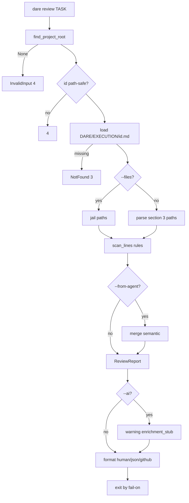

# BLUEPRINT: Review — análise estática anti-stub (Microplano 032)

> **Gerado a partir de:** `DARE/DESIGN-032-review.md` v1.0  
> **Data:** 2026-07-22 | **Status:** APPROVED (ciclo autorizado)  
> **Arquivo:** `DARE/BLUEPRINT-032-review.md`  
> **Pré-requisitos:** **024** dare-ai · **025** blueprint · **029** Ralph/DEC-030 · path safety **005** · output **004**  
> **Escopo:** `dare review` + crate `dare-review`. **Não** refine (**033**).

---

## 0. TRADE-OFFS (Architect)

| # | Trade-off | Escolha | Justificativa |
|---|-----------|---------|---------------|
| T-01 | Crate | **`crates/dare-review`** novo | Isola scan da CLI |
| T-02 | Deps | `dare-core`, `serde`, `serde_json`; **sem** `dare-dag` / `dare-cli` | Evita ciclo; não precisa state |
| T-03 | Scan | Line-oriented regex (sem AST) | Determinístico + rápido; Design RNF |
| T-04 | Spec files | Parse tabela secção `## 3.` paths em `` `...` `` | Paridade skill + TASK-SPEC |
| T-05 | `--format` vs `--json` | `--format` controla body; global `--json` envolve em envelope ADR-002; se `--format json` + sem `--json`, stdout = report JSON puro | Claro para CI |
| T-06 | Default format | `human` | UX local |
| T-07 | Default `--fail-on` | `error` | Warnings não falham CI por default |
| T-08 | `--strict` | Eleva warnings a falha **independente** de fail-on (ok=false se warning>0) | Paridade validate |
| T-09 | fail-on vs ok | Exit 1 se: (`fail_on=error` && errors>0) \|\| (`fail_on=warning` && (errors+warnings)>0) \|\| (`strict` && warnings>0) \|\| unmet semantic; `never` → exit 0 se sem CoreError | Aceite microplano |
| T-10 | Enrich `--ai` | Soft stub Classe B: append finding warning `enrichment_stub` + `enriched=false`; **não** chama LLM | Escopo; DEC-034 |
| T-11 | Capability | Atualizar matrix `cli_commands: ["review"]` + README | RF-19 |
| T-12 | DEC | **DEC-034** | Complementa DEC-030 |
| T-13 | Docs | `docs/compatibility/cli-review.md` | RF-20 |
| T-14 | Max file bytes | **1_048_576** por ficheiro; overflow → skip + warning `file_too_large` | Cap 007 |
| T-15 | Text path | Helper `is_test_path` (Design RF-06) | Mocks OK em testes |
| T-16 | Binary skip | Allowlist: `.rs .ts .tsx .js .jsx .py .go .php .rb .java .kt .cs .vue .svelte .md .toml .yml .yaml .json .sh .bash .zsh .c .h .cpp .hpp .sql` | RF-24 |
| T-17 | Spec rel | `DARE/EXECUTION/{id}.md` | Path fixo |
| T-18 | Id safe | `^[A-Za-z0-9][A-Za-z0-9._-]*$` (reusar ideia verify) | RS-01 |
| T-19 | GitHub format | `::{severity} file={f},line={n}::{msg}` — sem title (opcional) | Actions docs |
| T-20 | `--comment` | Campo `commentMarkdown` + append human | RF-14 |
| T-21 | Ordenação | path, line, col, ruleId (lex) | RF-27 |
| T-22 | Regex crate | **Não** — padrões manuais / `str::contains` + scanners simples | Menos deps; audit |

### 0.1 Exit codes

| Code | Quando |
|------|--------|
| 0 | Review passou (fail-on) |
| 1 | Review falhou (findings / strict / semantic) |
| 2 | Usage (clap) |
| 3 | Spec file NotFound |
| 4 | InvalidInput / Config / id unsafe / fail-on inválido / from-agent malformado |
| 5 | Io |

### 0.2 Constantes

| Nome | Valor |
|------|-------|
| `EXECUTION_DIR_REL` | `DARE/EXECUTION` |
| `REPORT_SCHEMA` | `1` |
| `MAX_FILE_BYTES` | `1048576` |
| `DEFAULT_FAIL_ON` | `error` |
| `MSG_PASS` | `Review passed.` |
| `MSG_FAIL` | `Review failed.` |

### 0.3 GAP

| Item | Estado |
|------|--------|
| Path jail / read_limited | ✅ core |
| OutputRenderer | ✅ cli |
| dare-review crate | 🔴 |
| CLI Review | 🔴 |
| cli-review.md / DEC-034 | 🔴 |
| Capability README + matrix cli_commands | 🔴 |

---

## 1. ARQUITETURA



---

## 2. MODELO DE DADOS

```rust
pub enum Severity { Error, Warning }
pub enum FailOn { Error, Warning, Never }
pub enum OutputFormat { Human, Json, Github }

pub struct Finding {
  pub path: String,       // project-relative POSIX-ish
  pub line: u32,
  pub col: u32,
  pub severity: Severity,
  pub rule_id: String,
  pub message: String,
}

pub struct ReviewReport {
  pub schema_version: u32, // 1
  pub task_id: String,
  pub ok: bool,
  pub error_count: u32,
  pub warning_count: u32,
  pub strict: bool,
  pub fail_on: String,
  pub enriched: bool,
  pub files_scanned: u32,
  pub findings: Vec<Finding>,
  pub unmet_criteria: Vec<String>,
  pub comment_markdown: Option<String>,
  pub notes: Option<String>,
}
```

Serde: **camelCase**.

Semantic agent file:

```json
{ "passed": false, "unmetCriteria": ["..."], "notes": "..." }
```

---

## 3. API PÚBLICA (`dare-review`)

| Função | Papel |
|--------|-------|
| `task_id_is_path_safe` | bool |
| `execution_spec_rel(id)` | `DARE/EXECUTION/{id}.md` |
| `parse_spec_files(markdown)` | `Vec<String>` paths |
| `is_test_path(path)` | bool |
| `scan_file(path, text, &mut findings)` | aplica regras |
| `run_review(root, ReviewOptions)` | `CoreResult<ReviewReport>` |
| `format_human` / `format_github` / `report_to_json` | formatters |
| `compute_ok` / `should_fail_exit` | política exit |
| `load_agent_semantic(path_contents)` | parse merge |

`ReviewOptions`: task_id, files_override, strict, errors_only (filter emit), from_agent, format, comment, fail_on, ai.

---

## 4. CLI

`commands/review.rs` + `Commands::Review` em `main.rs`.

Wire: `mod review` em `commands/mod.rs`; dep `dare-review` no `dare-cli`.

---

## 5. FASES / TASKS

| Fase | Tasks | Entrega |
|------|-------|---------|
| 1 | mp032-001 | Scaffold crate + rules + unit tests |
| 2 | mp032-002 | Spec parse + run_review + formatters |
| 3 | mp032-003 | CLI wire + smokes |
| 4 | mp032-004 | Capability + docs + DEC + matriz |
| 5 | mp032-005 | Ralph workspace gate |

---

## 6. TESTES MUST

- `detects_todo_marker`
- `mock_ignored_in_test_path`
- `mock_flagged_outside_test`
- `strict_fails_on_warning`
- `fail_on_never_exits_ok_policy`
- `github_format_prefix`
- `from_agent_unmet_merges`
- `deterministic_sort`
- CLI smoke: pass / fail TODO / format github

---

## 7. COMPATIBILIDADE (DEC-034)

| Item | Classe |
|------|--------|
| Enrichment `--ai` soft stub (sem LLM) | **B** |
| Sem tree-sitter / AST | **B** (intencional nativo) |
| Exit map alinhado 004 (+1 review fail) | **A** |
| Idioma domínio en-US (vs TS PT parcial) | **B** (language-policy) |

---

## 8. SEGURANÇA

- Jail paths; id safe; redact `.env` content se alguma vez emitido (não emitir body)
- from-agent size cap 64KiB
- Sem spawn de processos neste ciclo
