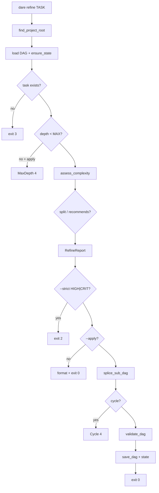

# BLUEPRINT: Refine e sub-DAG (Microplano 033)

> **Gerado a partir de:** `DARE/DESIGN-033-refine.md` v1.0  
> **Data:** 2026-07-24 | **Status:** APPROVED (ciclo autorizado)  
> **Arquivo:** `DARE/BLUEPRINT-033-refine.md`  
> **Pré-requisitos:** **020** validate · **026** dare-dag · **032** review · path safety **005** · output **004**  
> **Escopo:** `dare refine` + `dare_dag::subdag`. **Não** patterns/graph/skills lifecycle.

---

## 0. TRADE-OFFS (Architect)

| # | Trade-off | Escolha | Justificativa |
|---|-----------|---------|---------------|
| T-01 | Onde vive a lógica | **`dare-dag/src/subdag.rs`** | Já tem graph/validate/state |
| T-02 | CRITICAL no YAML | **Não** — só no RefineLevel | validate COMPLEXITY_ALLOWED inalterado |
| T-03 | Forma do split | Chain `a→b→…` | Deps mínimas; deterministic |
| T-04 | Rewire dependents | Substituir parent id pelo **último** child | Downstream espera trabalho completo |
| T-05 | Parent no YAML pós-apply | **Removido** da lista `tasks` | DAG executável só com folhas |
| T-06 | Parent no state | Status **`SPLIT`**; preservar attempts | Histórico |
| T-07 | Max depth | Constante **`MAX_SUBDAG_DEPTH = 2`** | Design RF-06 |
| T-08 | Score thresholds | 0–5 LOW, 6–11 MED, 12–17 HIGH, ≥18 CRITICAL | Heurística estável |
| T-09 | Keywords pesadas | migration, refactor, auth, security, rewrite, workspace, graph, … | Skill refine |
| T-10 | `--strict` exit | **2** (não CoreError::Usage) | Microplano + CI-001 nuance |
| T-11 | DEC | **DEC-040** | Sequência após DEC-039 |
| T-12 | Docs | `docs/compatibility/cli-refine.md` | RF-15 |
| T-13 | Capability | `cli_commands: ["refine"]` | RF-14 |
| T-14 | Apply atomicity | FileLock state; `save_dag` yaml atomic | 005/026 |
| T-15 | Proposal size | min(4, max(2, 1+score/6)) subtasks | Cap pequeno MVP |
| T-16 | Child complexity YAML | LOW se score fragment; MED default | Sempre ∈ {LOW,MED,HIGH} |
| T-17 | Id child | `{parent}-a`, `{parent}-b`, … | kebab; validate `is_kebab_id` |
| T-18 | Spec files children | `EXECUTION/{id}.md` string; create stub specs on apply? **MVP:** copy parent prompt slices; specs opcionais warning | Aceite = DAG válido |
| T-19 | Format | human \| json; global `--json` envelope | Paridade review parcial |
| T-20 | Legacy DAG | Refine **só V2.1**; Legacy → InvalidInput 4 | Escopo |

### 0.1 Exit codes

| Code | Quando |
|------|--------|
| 0 | Report OK / apply OK / no-op |
| 1 | Apply/validate failed (DAG inválido pós-splice) |
| 2 | `--strict` e level HIGH\|CRITICAL **ou** clap usage |
| 3 | Task / DAG / project NotFound |
| 4 | InvalidInput / MaxDepth / Cycle / id unsafe / Legacy |
| 5 | Io |

### 0.2 Constantes

| Nome | Valor |
|------|-------|
| `MAX_SUBDAG_DEPTH` | `2` |
| `DEFAULT_DAG_REL` | `DARE/dare-dag.yaml` |
| `STATE_REL` | `.dare/state.json` |
| `REPORT_SCHEMA` | `1` |
| `MSG_STRICT` | `Refine strict: level requires split (HIGH|CRITICAL).` |
| `STATUS_SPLIT` | `SPLIT` |

### 0.3 Scoring

```
score = 0
score += min(files * 2, 10)          // paths from EXECUTION section 3
score += min(prompt_chars / 400, 6)  // subtask_prompt
score += min(depends_on.len(), 4)
score += 3 per heavy keyword hit (cap 9)
score += baseline: LOW=0, MED=2, HIGH=4
level = thresholds(T-08)
recommends_split = level ∈ {HIGH, CRITICAL}
```

### 0.4 GAP

| Item | Estado |
|------|--------|
| validate / ranks / state | ✅ |
| subdag.rs | 🔴 |
| CLI Refine | 🔴 |
| cli-refine.md / DEC-040 | 🔴 |
| capability cli_commands | 🔴 |

---

## 1. ARQUITETURA



---

## 2. MODELO DE DADOS

```rust
pub enum RefineLevel { Low, Med, High, Critical }

pub struct ComplexitySignals {
  pub file_count: u32,
  pub prompt_chars: u32,
  pub depends_count: u32,
  pub heavy_keywords: Vec<String>,
  pub dag_complexity: String,
}

pub struct ComplexityReport {
  pub score: u32,
  pub level: RefineLevel,
  pub signals: ComplexitySignals,
  pub recommends_split: bool,
}

pub struct ProposedSubtask {
  pub id: String,
  pub title: String,
  pub depends_on: Vec<String>,
  pub complexity: String, // LOW|MED|HIGH
  pub subtask_prompt: String,
  pub rationale: String,
}

pub struct SplitProposal {
  pub parent_id: String,
  pub subtasks: Vec<ProposedSubtask>,
}

pub struct RefineReport {
  pub schema_version: u32, // 1
  pub task_id: String,
  pub report: ComplexityReport,
  pub proposal: Option<SplitProposal>,
  pub applied: bool,
  pub noop: bool,
}
```

Serde: **camelCase**.

Erros tipados:

```rust
pub enum SubDagError {
  Cycle { path: Vec<String> },
  MaxDepth { task_id: String, depth: u32, max: u32 },
  TaskNotFound { task_id: String },
  Invalid { message: String },
}
```

---

## 3. API PÚBLICA (`dare-dag::subdag`)

| Função | Papel |
|--------|-------|
| `task_depth(state, id)` | u32 via parentId chain |
| `assess_complexity(signals)` | ComplexityReport |
| `collect_signals(root, doc, task_id)` | lê spec + task |
| `propose_split(task, report)` | Option\<SplitProposal\> |
| `splice_sub_dag(doc, proposal)` | Result\<DagDocument, SubDagError\> |
| `apply_refine(root, opts)` | RefineReport + writes |
| `format_human` / `report_to_json` | formatters |

---

## 4. CLI

`commands/refine.rs` + `Commands::Refine` em `main.rs` (additivo).

Wire: `mod refine` em `commands/mod.rs`.

---

## 5. FASES / TASKS

| Fase | Tasks | Entrega |
|------|-------|---------|
| 1 | mp033-001 | subdag scoring + propose + unit |
| 2 | mp033-002 | spliceSubDag depth/cycle/state |
| 3 | mp033-003 | CLI + smokes |
| 4 | mp033-004 | Capability + docs + DEC-040 + matriz |
| 5 | mp033-005 | Ralph gate |

---

## 6. TESTES MUST

- `score_thresholds_boundaries`
- `propose_split_high_only`
- `splice_rewires_dependents`
- `max_depth_blocks`
- `cycle_blocks`
- `preserves_parent_id_in_state`
- CLI: apply happy / strict exit 2 / no-op

---

## 7. COMPATIBILIDADE (DEC-040)

| Item | Classe |
|------|--------|
| Domínio en-US | **B** (language-policy) |
| CRITICAL só no score (não YAML) | **B** |
| Sem `--ai`/`--from-agent` neste ciclo | **B** (adiado 050) |
| Exit 2 strict HIGH/CRITICAL | **A** |
| parentId no state | **A** |

---

## 8. PRÓXIMAS ETAPAS

1. Tasks + EXECUTION-033 + dare-dag-033.yaml  
2. Implementar mp033-001…005  
3. Ralph
