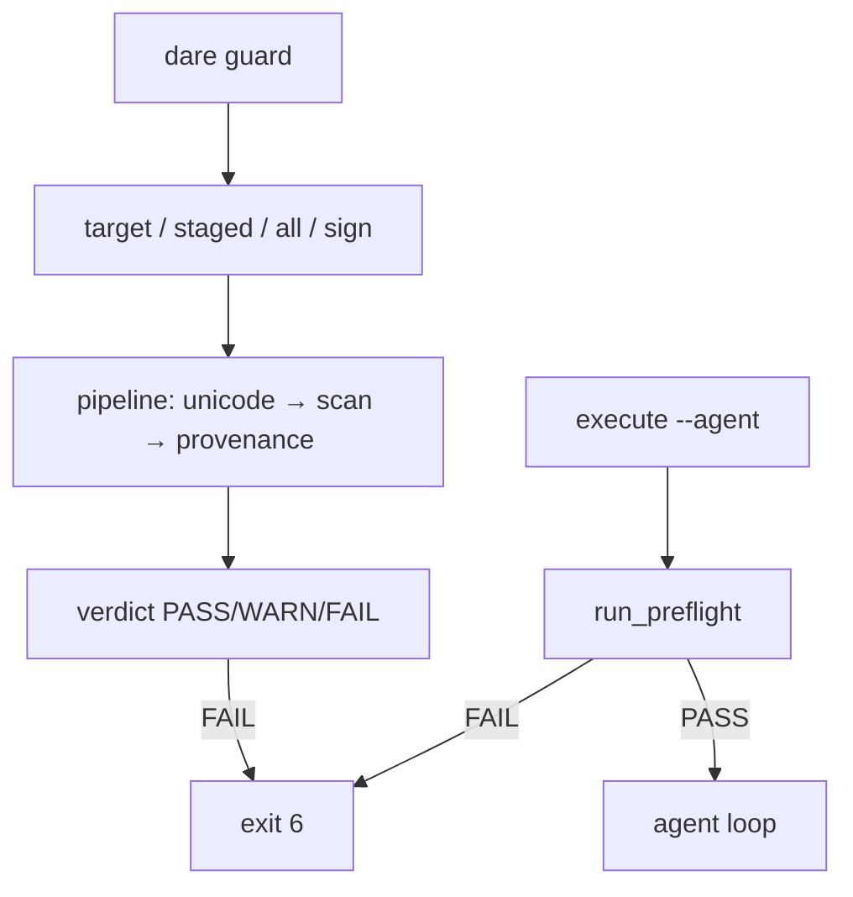

# BLUEPRINT: Guard (Microplano 034)

> **Gerado a partir de:** `DARE/DESIGN-034-guard.md` v1.0  
> **Data:** 2026-07-22 | **Status:** APPROVED (execução autorizada)  
> **Arquivo:** `DARE/BLUEPRINT-034-guard.md`  
> **Pré-requisitos:** 005, 006; stub 030 a substituir  
> **Escopo:** `dare-guard` + CLI + exit 6 + preflight agent. **Não** hooks/steering 048.

---

## 0. TRADE-OFFS (Architect)

| # | Trade-off | Escolha |
|---|-----------|---------|
| T-01 | Crate | **`crates/dare-guard`** novo member |
| T-02 | Deps | `dare-core`, `serde`/`serde_json`, `regex`, `ed25519-dalek`, `sha2`, `base64`; **não** `dare-cli` |
| T-03 | Assinatura | **Ed25519** (`ed25519-dalek`) com ficheiro `<path>.minisig` (header `untrusted comment: dare-guard ed25519`); **não** wire minisign completo — Classe B |
| T-04 | Chaves | Privada: hex 64 chars (`DARE_GUARD_PRIVATE_KEY`); pública: `DARE_GUARD_PUBLIC_KEY` ou `guard.signing.publicKey` |
| T-05 | Unicode default | CLI `--unicode` default **`block`**; strip sanitiza e pode WARN |
| T-06 | Fail exit | Veredito **FAIL** (ou WARN se `--strict` / `--fail-on warn`) → process exit **6** via `CoreError::guard_fail` |
| T-07 | ErrorKind | Novo **`GuardFail`** → exit **6**; `as_str` = `"GuardFail"` |
| T-08 | Scan rules | Built-in embed fallback + ficheiro `assets/rules/scan-rules.json`; override `DARE_GUARD_SCAN_RULES_PATH` |
| T-09 | `--staged` | `git diff --cached --name-only -z` via SafeCommand |
| T-10 | `--all` | Walk project; skip `.git`, `target`, `node_modules`, `.dare/agent-worktrees` |
| T-11 | Target | Path relativo sob ProjectRoot; ficheiro ou dir |
| T-12 | Preflight | `run_preflight`: scan `dare.config.json` + `DARE/**` (md/yml/yaml/json/txt) + regras; FAIL → Err GuardFail **antes** do loop agent |
| T-13 | Control paths | Paths sob `DARE/` e `dare.config.json` são **control**; se `signing.enabled` → exigem `.minisig` válido |
| T-14 | Proveniência | `trustedPaths` (default `["DARE/"]`); agent se sob `.dare/agent-worktrees/`; senão external |
| T-15 | Docs | `docs/compatibility/cli-guard.md` + **DEC-035**; atualizar agent doc exit 6 |
| T-16 | Capability | `dare-guard.cli_commands: ["guard"]` |
| T-17 | Manifest | Entrada `rules-scan` em `assets/manifest.yml` + hash |

### Exit codes

| Code | Quando |
|------|--------|
| 0 | PASS (e WARN sem strict) |
| 1 | Internal |
| 2 | Usage |
| 3 | NotFound (target) |
| 4 | InvalidInput / Config |
| 5 | Io |
| **6** | Guard FAIL |

### Constantes

| Nome | Valor |
|------|-------|
| `DEFAULT_RULES_REL` | `assets/rules/scan-rules.json` |
| `READ_CAP` | 1_048_576 |
| `SIG_EXT` | `.minisig` |
| `MSG_GUARD_FAIL` | `guard failed` |
| `MSG_PREFLIGHT_FAIL` | `guard preflight failed` |

---

## 1. ARQUITETURA

---

## 2. MÓDULOS

| Módulo | Responsabilidade |
|--------|------------------|
| `unicode` | Detect/strip/block |
| `rules` / `scan` | Load JSON + apply regex |
| `provenance` | Classify + trustedPaths |
| `signing` | sign/verify Ed25519 |
| `pipeline` | Orquestra + report |
| `preflight` | API agent |
| `evidence` | Redact snippets |

---

## 3. TASKS (resumo)

Ver `DARE/TASKS-034-guard.md` e `DARE/dare-dag-034.yaml`.

| ID | Título | depends_on |
|----|--------|------------|
| mp034-001 | ErrorKind GuardFail exit 6 | [] |
| mp034-002 | Crate dare-guard unicode | [mp034-001] |
| mp034-003 | scan-rules + injection | [mp034-002] |
| mp034-004 | Proveniência + trustedPaths | [mp034-002] |
| mp034-005 | Assinatura Ed25519 | [mp034-002] |
| mp034-006 | Pipeline + report | [mp034-003, mp034-004, mp034-005] |
| mp034-007 | CLI dare guard | [mp034-006] |
| mp034-008 | Preflight agent | [mp034-006, mp034-007] |
| mp034-009 | Docs DEC matriz assets | [mp034-007, mp034-008] |
| mp034-010 | Ralph close | [mp034-009] |

---

## 4. TESTES

- Unit: unicode corpus, scan match/redact, provenance, sign/verify roundtrip, invalid sig
- CLI smoke: PASS clean; FAIL exit 6; `--sign`; agent preflight fail
- Workspace fmt/clippy/test
