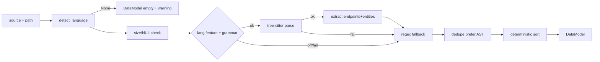

# BLUEPRINT: Engine AST nativo (Microplano 035)

> **Gerado a partir de:** `DARE/DESIGN-035-engine-ast-nativo.md` v1.0  
> **Data:** 2026-07-22 | **Status:** APPROVED (execução concluída 8/8)  
> **Arquivo:** `DARE/BLUEPRINT-035-engine-ast-nativo.md`  
> **Não substitui:** Blueprints 001–034  
> **Pré-requisitos:** Microplanos **005**, **009**  
> **Escopo:** `crates/dare-ast` — tree-sitter nativo, regex fallback, dedupe, corpus. **Não** reverse/dna/patterns/migrate. **Não** alterar `dare-cli/src/main.rs`.

---

## 0. TRADE-OFFS (Architect)

| # | Trade-off | Escolha | Justificativa |
|---|-----------|---------|---------------|
| T-01 | Crate | **`crates/dare-ast`** novo member | Mestre §15.1 / microplano |
| T-02 | Deps | `dare-core` + `serde` + `thiserror` + `tree-sitter` + grammars; **não** `dare-cli` / `dare-project` / `dare-dag` | Evita ciclos; path jail opcional via core |
| T-03 | tree-sitter ver | **`tree-sitter = "=0.25.10"`** | Alinha baseline WASM 0.25.10; ABI estável |
| T-04 | Grammars | Pins: ts `0.23.2`, js `0.25.0`, py `0.25.0`, go `0.25.0`, ruby `0.23.1`, php `0.24.2`, rust `0.24.2` | crates.io latest compatível 0.25 |
| T-05 | Features | Default = all `lang-*`; cada lang gateia grammar crate | RF-03; build regex-only sem default |
| T-06 | I/O | API **in-memory** primária (`analyze_source`); sem walk de projeto neste ciclo | Biblioteca pura; reverse faz walk em 036 |
| T-07 | Extract AST | Walk/query: call-expr HTTP methods + class/struct/interface decls | Cobertura mínima verificável |
| T-08 | Regex | Sempre on; merge após AST | Fallback transparente |
| T-09 | Dedupe | Prefer `SourceKind::Ast`; sort estável | RF-10/18 |
| T-10 | Cap size | **`MAX_SOURCE_BYTES = 2 * 1024 * 1024`** | RF-13; alinhado contratos 2 MiB |
| T-11 | Docs | **`docs/compatibility/ast-engine.md`** + **DEC-032** | RF-15 |
| T-12 | CLI | **Sem** mudanças `dare-cli` | Reduz conflito merge |
| T-13 | Errors | `CoreError::invalid_input` / `internal`; mensagens en-US | DEC-005 |
| T-14 | Language detect | Extensão case-insensitive; `.mts`/`.cts`→TS; `.mjs`/`.cjs`→JS; unknown→`None` | Determinístico |
| T-15 | Endpoint method | Uppercase ASCII (`GET`/`POST`/…) | Normalização |
| T-16 | Path normalize | Trim quotes; keep leading `/` se presente; sem resolve URL | Determinístico |
| T-17 | Warnings | Parse fail / lang feature off → warning string estável | Observabilidade |
| T-18 | PHP grammar | `tree-sitter-php` LANGUAGE_PHP | Skip HTML-only |
| T-19 | TSX | Grammar `tsx()` separado de `typescript()` | RF-02 |
| T-20 | Tests | Unit + corpus golden por lang; `regex_only` cfg test | Aceite |

### 0.1 Constantes

| Nome | Valor |
|------|-------|
| `MAX_SOURCE_BYTES` | `2097152` |
| `SUPPORTED_LANGS` | typescript, tsx, javascript, python, php, go, ruby, rust |
| Doc | `docs/compatibility/ast-engine.md` |
| DEC | `DEC-032` |

### 0.2 GAP

| Item | Estado | Ação |
|------|--------|------|
| `dare-core` path/errors | ✅ | Reusar |
| `dare-ast` | 🔴 | Criar |
| Fixtures corpus | 🔴 | Criar |
| DEC-032 / ast-engine.md | 🔴 | Criar |

---

## 1. VISÃO GERAL DA ARQUITETURA



---

## 2. STACK

| Camada | Tecnologia | Papel |
|--------|-----------|-------|
| Rust | 1.85.0 | Build |
| `dare-ast` | NOVO | Engine |
| `dare-core` | workspace | CoreError, redact helpers |
| tree-sitter | 0.25.10 | Parser |
| grammars | pins T-04 | Languages |
| serde | workspace | Serialize DataModel (tests/docs) |

**Workspace:** adicionar `crates/dare-ast` a `members` + `workspace.dependencies.dare-ast`.

---

## 3. ESTRUTURA DE PASTAS

```text
crates/dare-ast/
  Cargo.toml
  src/
    lib.rs
    model.rs
    language.rs
    parse.rs
    extract.rs
    regex_fallback.rs
    merge.rs
    analyze.rs
  fixtures/
    typescript/sample.ts
    tsx/sample.tsx
    javascript/sample.js
    python/sample.py
    php/sample.php
    go/sample.go
    ruby/sample.rb
    rust/sample.rs
docs/compatibility/ast-engine.md
docs/DECISION-LOG.md  # DEC-032
```

---

## 4. MODELO DE DADOS

```rust
#[derive(Debug, Clone, Copy, PartialEq, Eq, Hash, Serialize)]
pub enum Language { TypeScript, Tsx, JavaScript, Python, Php, Go, Ruby, Rust }

#[derive(Debug, Clone, Copy, PartialEq, Eq, Serialize)]
pub enum SourceKind { Ast, Regex }

#[derive(Debug, Clone, PartialEq, Eq, Serialize)]
pub struct HttpEndpoint {
    pub method: String,   // GET, POST, ...
    pub path: String,
    pub line: u32,        // 1-based
    pub source: SourceKind,
}

#[derive(Debug, Clone, PartialEq, Eq, Serialize)]
pub struct Entity {
    pub name: String,
    pub kind: String,     // class|struct|interface|model|enum
    pub line: u32,
    pub source: SourceKind,
}

#[derive(Debug, Clone, PartialEq, Eq, Serialize)]
pub struct DataModel {
    pub language: Language,
    pub endpoints: Vec<HttpEndpoint>,
    pub entities: Vec<Entity>,
    pub warnings: Vec<String>,
}
```

### 4.1 Extração AST (mínimo)

| Lang | Endpoints (heurística) | Entities |
|------|------------------------|----------|
| TS/TSX/JS | `.(get\|post\|put\|patch\|delete\|options\|head)('path')` / `@Get('path')` | class, interface, enum |
| Python | `@app.\|@router.(get\|post\|…)` | class |
| PHP | `Route::(get\|post\|…)` | class |
| Go | `.(GET\|POST\|…)("` / `HandleFunc("` | type/struct |
| Ruby | `get/post/… '` / `resources` | class |
| Rust | `.route("` / `#[get("` (axum-style) | struct, enum, trait→interface |

### 4.2 Regex (espelha heurísticas; case-insensitive methods)

Sempre executado; merge remove duplicatas.

---

## 5. PLANO DE TASKS

| ID | Título | Depends | Complexity |
|----|--------|---------|------------|
| mp035-001 | Scaffold crate + model/language | — | MED |
| mp035-002 | Parse + feature-gated grammars | mp035-001 | HIGH |
| mp035-003 | Extract AST endpoints/entities | mp035-002 | HIGH |
| mp035-004 | Regex fallback + merge/dedupe | mp035-003 | HIGH |
| mp035-005 | analyze API + corpus fixtures | mp035-004 | MED |
| mp035-006 | Docs DEC-032 + ast-engine.md | mp035-005 | LOW |
| mp035-007 | Ralph Loop audit | mp035-006 | MED |
| mp035-008 | Fechamento TASKS/matriz | mp035-007 | LOW |

---

## 6. TESTES

- Unit: detect_language; size/NUL reject; dedupe prefer AST; sort order
- Corpus: cada fixture → endpoints/entities esperados (mín. 1 endpoint + 1 entity)
- Feature: `cargo test -p dare-ast --no-default-features` ainda passa via regex
- Ralph: workspace fmt/clippy/test

---

## 7. COMPATIBILIDADE (DEC-032)

| Diff | Classe | Nota |
|------|--------|------|
| Native tree-sitter vs WASM | B | Intencional; mesmo contrato DataModel lógico |
| Sem CLI `dare ast` | C | Fora de escopo; lib only |
| Heurísticas ≠ 100% parity TS | B | Documentar; corpus MUST |

---

## 8. SEGURANÇA

- Cap 2 MiB; reject NUL
- Sem spawn/shell
- Sem log de source completo (tracing: path + counts only)
