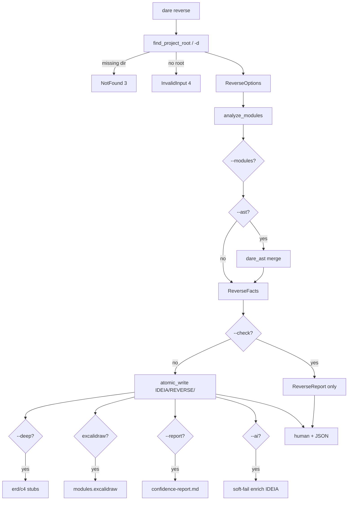

# BLUEPRINT: Reverse — engenharia reversa brownfield (Microplano 036)

> **Gerado a partir de:** `DARE/DESIGN-036-reverse.md` v1.0  
> **Data:** 2026-07-23 | **Status:** APPROVED  
> **Arquivo:** `DARE/BLUEPRINT-036-reverse.md`  
> **Pré-requisitos:** **018** discover · **024** dare-ai · **035** dare-ast · path **005** · output **004**  
> **Escopo:** `dare reverse` + `dare-project::reverse`. **Não** dna/patterns/migrate.

---

## 0. TRADE-OFFS (Architect)

| # | Trade-off | Escolha | Justificativa |
|---|-----------|---------|---------------|
| T-01 | Crate | Módulo em **`dare-project`** (não crate novo) | Já é brownfield; evita fan-out |
| T-02 | Deps project | + `dare-ast` | RF-10 AST opcional |
| T-03 | Enrichment | Soft-fail na **CLI** (`dare-ai`), não em dare-project | Evita ciclo; espelha blueprint |
| T-04 | Módulos | Heurística: `crates/*`, senão `src`, senão top-level source dirs | MVP Classe B vs TS |
| T-05 | Dep graph | Rust path-deps de Cargo.toml; resto vazio | Classe B; DNA/patterns refinam |
| T-06 | `--check` | Mesmo analyze; skip writes | Aceite |
| T-07 | Excalidraw | Default **on**; `--no-excalidraw` desliga | Paridade plano Mestre |
| T-08 | AST | Só com `--ast`; caps files/bytes | Perf |
| T-09 | Markers | `<!-- AGENT:BEGIN/END section="…" -->` (dare-ai) | Compat inject |
| T-10 | DEC | **DEC-038** (não reusar 037) | Pedido |
| T-11 | Capability | `cli_commands: ["reverse"]` + README asset | RF-14 |
| T-12 | Schema | ReverseReport `schemaVersion: 1` | Congela |

### 0.1 Exit codes

| Code | Quando |
|------|--------|
| 0 | Sucesso (incl. check / soft-fail AI) |
| 2 | Usage (clap) |
| 3 | Dir `-d` NotFound |
| 4 | InvalidInput / sem project root / módulos inválidos |
| 5 | Io |

### 0.2 Constantes

| Nome | Valor |
|------|-------|
| `REVERSE_SCHEMA_VERSION` | `1` |
| `IDEIA_REL` | `DARE/IDEIA.md` |
| `REVERSE_DIR` | `DARE/REVERSE` |
| `FACTS_REL` | `DARE/REVERSE/reverse-facts.json` |
| `MAX_MODULES` | `64` |
| `MAX_AST_FILES` | `200` |
| `MAX_FILE_BYTES` | `1048576` |
| `MSG_CHECK` | `mode: check (zero mutations)` |

### 0.3 GAP

| Item | Estado |
|------|--------|
| dare-project detect/root | ✅ |
| dare-ast analyze_source | ✅ |
| dare-ai soft-fail | ✅ padrão |
| reverse.rs + CLI | 🔴 |
| docs/DEC-038 | 🔴 |

---

## 1. ARQUITETURA



---

## 2. MODELO DE DADOS

```text
ReverseOptions { dir?, check, deep, modules: Vec<String>, ast, excalidraw, report, force? }
ModuleFact { id, path, languages[], loc, file_count, depends_on[] }
AstSummary { endpoints[], entities[], files_scanned, warnings[] }
ReverseFacts { schemaVersion, projectRoot, stacks[], modules[], ast?, deep }
ReverseReport { schemaVersion, mode: check|reverse, ok, modules, written[], warnings[], enriched, … }
```

Ordenação: modules por `id` lex; endpoints por (method, path, line); entities por (kind, name, line).

---

## 3. ARTEFATOS DE DISCO

| Path | Quando |
|------|--------|
| `DARE/IDEIA.md` | write (não check) |
| `DARE/REVERSE/reverse-facts.json` | write |
| `DARE/REVERSE/module-<id>.md` | write por módulo |
| `DARE/REVERSE/modules.excalidraw` | write se excalidraw |
| `DARE/REVERSE/erd.md` (+ deep stubs) | `--deep` |
| `DARE/REVERSE/confidence-report.md` | `--report` |

---

## 4. TASKS (resumo)

Ver `DARE/TASKS-036-reverse.md` / `dare-dag-036.yaml`.

| ID | Título |
|----|--------|
| mp036-001 | reverse domain types + module scan |
| mp036-002 | artifacts IDEIA/module/facts + --check |
| mp036-003 | --deep / excalidraw / --report |
| mp036-004 | --ast merge |
| mp036-005 | CLI wire + enrichment soft-fail |
| mp036-006 | capability + docs + DEC-038 |
| mp036-007 | smokes + Ralph |
| mp036-008 | fechamento matriz/TASKS |

---

## 5. COMPATIBILIDADE (preview)

| Diff | Classe | Nota |
|------|--------|------|
| Heurística de módulos simplificada vs TS | B | Documentar; aceitável MVP |
| Dep graph mínimo | B | DNA/patterns expandem |
| Enrichment soft-fail | A | Igual blueprint |
| Paths canónicos DARE/* | A | Paridade skill |

---

## 6. STATUS DE EXECUÇÃO

- Progresso: 8/8
- Branch: `feature/mp-036-reverse`
- DEC: **DEC-038**
