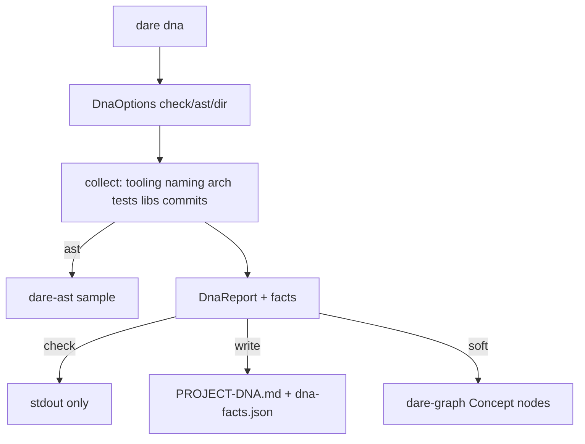

# BLUEPRINT: DNA (Microplano 037)

> **Gerado a partir de:** `DARE/DESIGN-037-dna.md` v1.0  
> **Data:** 2026-07-23 | **Status:** APPROVED  
> **Arquivo:** `DARE/BLUEPRINT-037-dna.md`  
> **Pré-requisitos:** 018, 024, 035  
> **Escopo:** `dare dna` + `dare-project::dna` + capability + docs DEC-039. **Não** reverse/patterns/migrate.

---

## 0. TRADE-OFFS (Architect)

| # | Trade-off | Escolha |
|---|-----------|---------|
| T-01 | Crate | Domínio em **`dare-project`** (`dna.rs`); CLI thin em `dare-cli` |
| T-02 | Deps | `dare-ast` + `dare-graph` em `dare-project` (graph soft-fail runtime) |
| T-03 | Schema | `DnaReport` **schemaVersion 1** camelCase; também `dna-facts.json` |
| T-04 | Outputs | Write: `DARE/PROJECT-DNA.md` + `DARE/dna-facts.json`; check: zero writes |
| T-05 | Git | `git log -n 20 --pretty=format:%h%x09%s` via SafeCommand; timeout 5s; soft-fail |
| T-06 | AST | `--ast` amostra ≤32 ficheiros, ≤512 KiB cada; warnings se parse fail |
| T-07 | Caps | `MANIFEST_READ_CAP` 256 KiB; walk depth/skip `target`/`node_modules`/`.git` |
| T-08 | Graph | Soft: `open_graph` + `migrate` + `add_node` Concept `concept:dna:{cat}:{key}`; fail→warning |
| T-09 | AI | Sem `--ai` neste microplano (skill IDE `/dare-dna`); flags reserved future = fora |
| T-10 | DEC | **DEC-039** (036→DEC-038); não alterar texto DEC-037 |
| T-11 | Capability | `dare-dna.cli_commands: ["dna"]` |
| T-12 | Exit | 004 map: 0 ok; 2 usage; 3 not found dir; 4 invalid; 5 io |
| T-13 | Naming | Heurística majority vote: snake / kebab / camel / pascal / other |
| T-14 | Determinismo | Sort facts `(category, key)`; evidence sorted unique |

### Exit codes

| Code | Quando |
|------|--------|
| 0 | Sucesso (check ou write) |
| 2 | Usage / clap |
| 3 | `--dir` missing / not a directory |
| 4 | InvalidInput / path safety |
| 5 | Io |

### Constantes

| Nome | Valor |
|------|-------|
| `DNA_SCHEMA_VERSION` | `1` |
| `PROJECT_DNA_REL` | `DARE/PROJECT-DNA.md` |
| `DNA_FACTS_REL` | `DARE/dna-facts.json` |
| `GIT_LOG_LIMIT` | `20` |
| `AST_FILE_CAP` | `32` |
| `AST_BYTES_CAP` | `524_288` |
| `TOP_LIBS` | `25` |

---

## 1. ARQUITETURA

---

## 2. MÓDULOS

| Módulo | Responsabilidade |
|--------|------------------|
| `dare-project/dna.rs` | Collect, render MD/JSON, write, graph soft, report |
| `dare-cli/commands/dna.rs` | Flags → `run_dna` → human/JSON |
| `main.rs` | Variante `Dna` apenas |

### Categorias de fato

| category | Exemplos |
|----------|----------|
| `tooling` | packageManager, rustEdition, pythonBuild |
| `naming` | fileNamingStyle |
| `architecture` | layersDetected, astEntityCount |
| `tests` | testLayout, testFramework |
| `libraries` | dep:{name} |
| `commits` | recentCommit:{hash} |

---

## 3. TASKS (resumo)

| ID | Título | depends_on |
|----|--------|------------|
| mp037-001 | Domínio dna collect + report types | [] |
| mp037-002 | Render PROJECT-DNA + dna-facts + write/check | [mp037-001] |
| mp037-003 | Git log + AST opt-in + graph soft | [mp037-001] |
| mp037-004 | CLI dare dna + main.rs | [mp037-002, mp037-003] |
| mp037-005 | Capability + docs DEC-039 + matriz | [mp037-004] |
| mp037-006 | Smokes + Ralph close | [mp037-005] |

---

## 4. TESTES

- Unit: tooling/naming/tests facts; check no-write; no-git; evidence present
- CLI smoke: `dna` success write; `dna --check` no-write; no-git fixture
- fmt / clippy `-p dare-project -p dare-cli` / tests

---

## 5. COMPAT vs TS 3.18.1

| Diff | Classe | Nota |
|------|--------|------|
| Sem `--ai` no CLI Rust 037 | B | Enrichment via skill IDE; foundation 024 |
| Graph soft-index nativo | B | TS indexing via GraphRAG pipeline posterior |
| AST nativo tree-sitter | A/B | Mesmo contrato opt-in `--ast`; engine 035 |
| Schema DnaReport 1 camelCase | A | Alinhado estilo discover |
