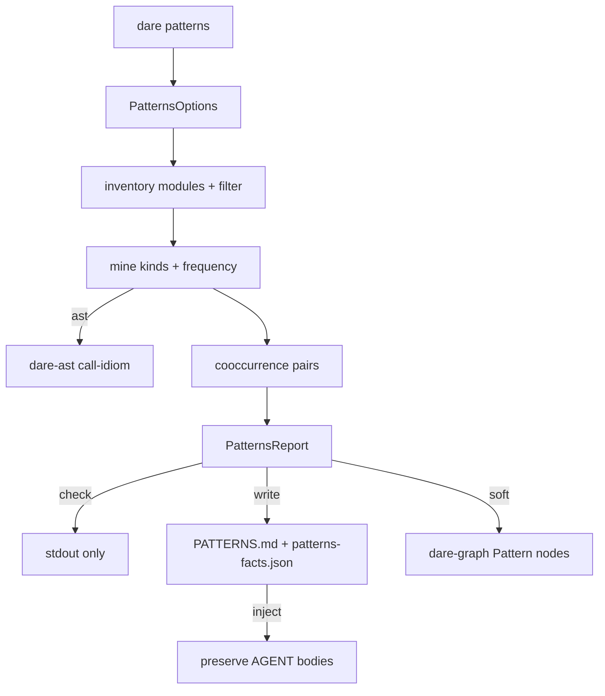

# BLUEPRINT: Patterns (Microplano 038)

> **Gerado a partir de:** `DARE/DESIGN-038-patterns.md` v1.0  
> **Data:** 2026-07-24 | **Status:** APPROVED  
> **Arquivo:** `DARE/BLUEPRINT-038-patterns.md`  
> **Pré-requisitos:** 035, 037  
> **Escopo:** `dare patterns` + `dare-project::patterns` + capability + docs DEC-041. **Não** reverse/dna/migrate.

---

## 0. TRADE-OFFS (Architect)

| # | Trade-off | Escolha |
|---|-----------|---------|
| T-01 | Crate | Domínio em **`dare-project`** (`patterns.rs`); CLI thin |
| T-02 | Deps | Reusa `dare-ast` + `dare-graph` (graph soft runtime) |
| T-03 | Schema | `PatternsReport` **schemaVersion 1** camelCase; `patterns-facts.json` |
| T-04 | Outputs | Write: `DARE/PATTERNS.md` + `DARE/patterns-facts.json`; check: zero |
| T-05 | Kinds | Fechados: inferred-layer, naming-idiom, structural-idiom, call-idiom, implicit-decision |
| T-06 | Score | `score = frequency` (u64); tie-break `(kind, id)` lex |
| T-07 | Cooccur | Pares de pattern ids no mesmo módulo; `count`; sort `(left, right)` |
| T-08 | Modules | Inventário leve (crates/* \| src \| top-level source dirs); `--modules` filter |
| T-09 | Inject | Se PATTERNS.md existe: preservar corpos entre `<!-- AGENT:BEGIN/END -->` |
| T-10 | AST | `--ast` ≤32 ficheiros × 512 KiB → call-idiom (HTTP methods / entity kinds) |
| T-11 | Graph | Soft: Pattern nodes `canonical_pattern_node_id`; só se store existe |
| T-12 | AI | Sem `--ai` (skill IDE); Classe B vs TS |
| T-13 | DEC | **DEC-041** apenas |
| T-14 | Capability | `dare-patterns.cli_commands: ["patterns"]` |
| T-15 | Exit | 004: 0 ok; 2 usage; 3 not found; 4 invalid; 5 io |

### Exit codes

| Code | Quando |
|------|--------|
| 0 | Sucesso |
| 2 | Usage / clap |
| 3 | `--dir` missing / not a directory |
| 4 | InvalidInput (no root / bad --modules / path) |
| 5 | Io |

### Constantes

| Nome | Valor |
|------|-------|
| `PATTERNS_SCHEMA_VERSION` | `1` |
| `PATTERNS_MD_REL` | `DARE/PATTERNS.md` |
| `PATTERNS_FACTS_REL` | `DARE/patterns-facts.json` |
| `AST_FILE_CAP` | `32` |
| `AST_BYTES_CAP` | `524_288` |
| `WALK_MAX_ENTRIES` | `2_000` |
| `MIN_FREQUENCY` | `1` |

---

## 1. ARQUITETURA

---

## 2. MÓDULOS

| Módulo | Responsabilidade |
|--------|------------------|
| `dare-project/patterns.rs` | Mine, score, render, write/check/inject, graph soft |
| `dare-cli/commands/patterns.rs` | Flags → `run_patterns` |
| `main.rs` | Variante `Patterns` **aditiva** |

### Pattern id format

`{kind}:{slug}` — ex. `naming-idiom:snake-case`, `inferred-layer:handlers`

---

## 3. TASKS (resumo)

| ID | Título | depends_on |
|----|--------|------------|
| mp038-001 | Domínio patterns types + mine kinds/freq | [] |
| mp038-002 | Cooccur + render PATTERNS.md/facts + check/inject | [mp038-001] |
| mp038-003 | AST opt-in + graph soft + --modules | [mp038-001] |
| mp038-004 | CLI dare patterns + main.rs | [mp038-002, mp038-003] |
| mp038-005 | Capability + docs DEC-041 + matriz | [mp038-004] |
| mp038-006 | Smokes + Ralph close | [mp038-005] |

---

## 4. TESTES

- Unit: kinds; frequency; cooccur sort; inject preserve; check no-write
- CLI smoke: help; write; check no-write
- Ralph: fmt + clippy + test `-p dare-project -p dare-cli`

---

## 5. COMPAT vs TS 3.18.1

| Diff | Classe | Nota |
|------|--------|------|
| Sem `--ai` no CLI Rust 038 | B | Enrichment via `/dare-patterns` |
| Graph soft nativo | B | Só se store existir |
| AST nativo dare-ast | B | Mesmo opt-in `--ast` |
| Schema PatternsReport 1 | A | camelCase alinhado dna/discover |
