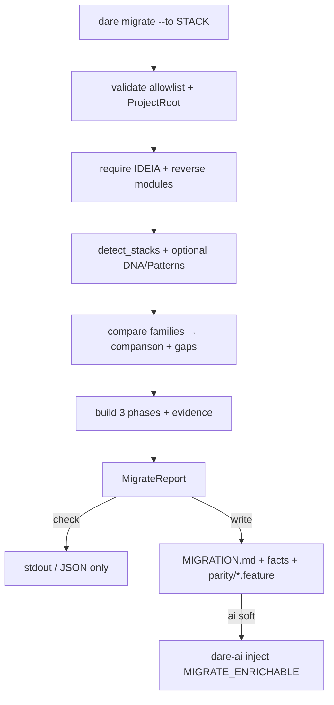

# BLUEPRINT: Migrate — plano + Gherkin de paridade (Microplano 039)

> **Gerado a partir de:** `DARE/DESIGN-039-migrate.md` v1.0  
> **Data:** 2026-07-24 | **Status:** APPROVED (ciclo autorizado via `/dare-blueprint`)  
> **Arquivo:** `DARE/BLUEPRINT-039-migrate.md`  
> **Pré-requisitos:** **024** dare-ai · **036** reverse · **037** dna · **038** patterns · path **005** · output **004**  
> **Escopo:** `dare migrate --to <stack>` + `dare-project::migrate` + `DARE/MIGRATION/**` + capability `dare-migrate` + **DEC-044**.  
> **Não:** reescrita destrutiva de código · init/bootstrap (**046–047**) · Neo4j/semantic (**042+**) · config `plan_migrate` (**008**) · `KnowledgeGraph::migrate` (**040**).

---

## 0. TRADE-OFFS (Architect)

| # | Trade-off | Escolha | Justificativa |
|---|-----------|---------|---------------|
| T-01 | Crate | Domínio em **`dare-project`** (`migrate.rs`); CLI thin | Mesmo padrão reverse/dna/patterns |
| T-02 | Enrichment | Soft-fail na **CLI** via `dare-ai` | Evita ciclo dare-project→dare-ai; espelha reverse/blueprint |
| T-03 | Schema facts | `MigrateReport` / `migration-facts.json` **schemaVersion 1** camelCase | Paridade discover/dna/patterns |
| T-04 | `--to` allowlist | Congelada §0.3 (ids scaffold/Ralph) | RF-03; exit 4 se fora |
| T-05 | Pré-condição | Exige `DARE/IDEIA.md` **e** ≥1 módulo em `reverse-facts.json` (ou `DARE/REVERSE/module-*.md`) | RF-06; não inventar módulos |
| T-06 | DNA/Patterns | Opcionais; ausência → `warnings[]` | RF-07 |
| T-07 | `--check` | Mesmo analyze; skip todas as writes | RF-12 |
| T-08 | Gherkin CLI | Só **esqueleto** (Scenario Outline stub + tags módulo) | Skill `/dare-migrate` preenche comportamento |
| T-09 | Fases | Sempre 3: `foundations` → `modules` → `cutover` | Determinístico; módulos reverse na fase 2 |
| T-10 | Comparison | `same_family` \| `cross_stack` \| `unknown_origin` | Mapa família §0.4 |
| T-11 | DEC | **DEC-044** apenas | Próximo livre após DEC-043 |
| T-12 | Capability | `dare-migrate` → `cli_commands: ["migrate"]` | RF-16 |
| T-13 | Patterns file | Sem `DARE/PATTERNS.md` no repo CLI agora | Trade-offs sem ids inventados; se existir no projeto-alvo, citar no plano (🟡) |

### 0.1 Exit codes

| Code | Quando |
|------|--------|
| 0 | Sucesso (write ou check; AI soft-fail ainda 0) |
| 2 | Usage (clap: falta `--to`) |
| 3 | `-d/--dir` NotFound / não é diretório |
| 4 | InvalidInput: stack fora allowlist; sem IDEIA/REVERSE; path escape; `--to` vazio |
| 1 | Internal (I/O inesperado após validação) |
| 5 | Io (quando mapeado por CoreError::Io) |

### 0.2 Constantes

| Nome | Valor |
|------|-------|
| `MIGRATE_SCHEMA_VERSION` | `1` |
| `MIGRATION_DIR` | `DARE/MIGRATION` |
| `MIGRATION_MD_REL` | `DARE/MIGRATION/MIGRATION.md` |
| `MIGRATION_FACTS_REL` | `DARE/MIGRATION/migration-facts.json` |
| `PARITY_DIR_REL` | `DARE/MIGRATION/parity` |
| `IDEIA_REL` | `DARE/IDEIA.md` (reusa reverse) |
| `REVERSE_FACTS_REL` | `DARE/REVERSE/reverse-facts.json` |
| `PROJECT_DNA_REL` | `DARE/PROJECT-DNA.md` |
| `PATTERNS_MD_REL` | `DARE/PATTERNS.md` |
| `MAX_MODULES` | `64` (alinhar reverse) |
| `MAX_FEATURE_BYTES` | `65_536` |
| `MSG_CHECK` | `mode: check (zero mutations)` |
| `MIGRATE_ENRICHABLE` | `paradigm`, `strategy`, `risk-register`, `target-architecture`, `cutover-rollback` |

### 0.3 Allowlist `--to` (congelada)

Ids **case-sensitive** lowercase (Classe B se TS for case-insensitive):

```text
node-nestjs
python-fastapi
php-laravel
go-gin
go-stdlib
rails
rust-axum
rust
rust-leptos
rust-leptos-csr
react
vue
mcp-node-ts
```

Alias: `rust` → tratar como família `rust` (comparison); persistir `toStack` como o id pedido pelo user (sem rewrite), excepto documentar em facts `toStackNormalized` = `rust-axum` quando `to=rust` (🟡 decisão: **persistir literal** `toStack` + `toFamily` derivado).

**Congelado:** `toStack` = input trim; `toFamily` = map §0.4; sem rewrite do id.

### 0.4 Famílias (comparison)

| Detect id (`detect_stacks`) | Família |
|----------------------------|---------|
| `node` | `node` |
| `python` | `python` |
| `rust` | `rust` |
| (ausente) | `unknown` |

| `--to` id | Família |
|-----------|---------|
| `node-nestjs`, `react`, `vue`, `mcp-node-ts` | `node` |
| `python-fastapi` | `python` |
| `php-laravel` | `php` |
| `go-gin`, `go-stdlib` | `go` |
| `rails` | `ruby` |
| `rust-axum`, `rust`, `rust-leptos`, `rust-leptos-csr` | `rust` |

`comparison`:
- `same_family` — alguma `fromStacks[].family` == `toFamily`
- `cross_stack` — from não vazio e nenhuma família bate
- `unknown_origin` — `fromStacks` vazio

### 0.5 Blocking gaps (determinísticos)

Emitir gap se condição verdadeira (ids estáveis):

| id | severity | Quando |
|----|----------|--------|
| `gap-no-dna` | `warning` | Sem `PROJECT-DNA.md` |
| `gap-no-patterns` | `warning` | Sem `PATTERNS.md` |
| `gap-cross-stack` | `blocking` | `comparison == cross_stack` |
| `gap-unknown-origin` | `blocking` | `comparison == unknown_origin` |
| `gap-stack-conflict` | `blocking` | `detect` reportou `conflicts` não vazios |

`blockingGaps` sort by `(severity desc: blocking first, then warning), id asc`.

---

## 1. ARQUITETURA



| Camada | Peça |
|--------|------|
| CLI | `commands/migrate.rs` + `Commands::Migrate` aditivo |
| Domínio | `dare-project::migrate` |
| Detect | `detect_stacks` / `find_project_root` |
| Reverse facts | Ler `reverse-facts.json` (`modules[].id`) |
| AI | Soft-fail CLI (opcional) |

---

## 2. ESTRUTURA DE FICHEIROS

```text
crates/dare-project/src/migrate.rs          # NOVO
crates/dare-project/src/lib.rs              # MOD pub mod migrate
crates/dare-cli/src/commands/migrate.rs     # NOVO
crates/dare-cli/src/commands/mod.rs         # MOD
crates/dare-cli/src/main.rs                # MOD Commands::Migrate
crates/dare-cli/tests/cli_smoke.rs          # MOD smokes
assets/capabilities/dare-migrate/README.md  # NOVO
assets/capability-matrix.yml                # MOD row
docs/compatibility/cli-migrate.md           # NOVO
docs/DECISION-LOG.md                        # MOD DEC-044
DARE-RUST-MICRO-PLANOS/.../000A-MATRIZ-DE-STATUS.md  # MOD 039
```

---

## 3. MODELO DE DADOS (tipos Rust + JSON)

### 3.1 Domínio (assinaturas tipadas — MUST)

```rust
pub const MIGRATE_SCHEMA_VERSION: u32 = 1;

#[derive(Debug, Clone)]
pub struct MigrateOptions {
    pub to_stack: String,
    pub check: bool,
    /// Reserved for CLI; domain ignores AI (CLI owns enrich).
    pub ai: bool,
}

#[derive(Debug, Clone, PartialEq, Eq, Serialize, Deserialize)]
#[serde(rename_all = "camelCase")]
pub struct BlockingGap {
    pub id: String,
    pub severity: String, // "blocking" | "warning"
    pub evidence: String,
    pub detail: String,
}

#[derive(Debug, Clone, PartialEq, Eq, Serialize, Deserialize)]
#[serde(rename_all = "camelCase")]
pub struct MigrationPhase {
    pub id: String,       // foundations | modules | cutover
    pub title: String,
    pub modules: Vec<String>,
    pub evidence: Vec<String>,
}

#[derive(Debug, Clone, PartialEq, Eq, Serialize, Deserialize)]
#[serde(rename_all = "camelCase")]
pub struct MigrateReport {
    pub schema_version: u32,
    pub mode: String, // "write" | "check"
    pub from_stacks: Vec<String>,
    pub to_stack: String,
    pub to_family: String,
    pub comparison: String, // same_family | cross_stack | unknown_origin
    pub phases: Vec<MigrationPhase>,
    pub blocking_gaps: Vec<BlockingGap>,
    pub module_ids: Vec<String>,
    pub written: Vec<String>,
    pub warnings: Vec<String>,
}

/// Pré: `to_stack` trim não vazio; root é ProjectRoot válido.
/// Pós OK: report preenchido; se !check, ficheiros em written existem.
/// Err: InvalidInput | NotFound | Io | Internal
pub fn run_migrate(root: &Path, opts: &MigrateOptions) -> CoreResult<MigrateReport>;

pub fn format_migrate_human(r: &MigrateReport) -> String;
pub fn migrate_report_to_json(r: &MigrateReport) -> CoreResult<String>;
```

### 3.2 `migration-facts.json` (campos MUST)

```json
{
  "schemaVersion": 1,
  "mode": "write",
  "fromStacks": ["rust"],
  "toStack": "node-nestjs",
  "toFamily": "node",
  "comparison": "cross_stack",
  "moduleIds": ["dare-core", "dare-cli"],
  "phases": [ /* MigrationPhase */ ],
  "blockingGaps": [ /* BlockingGap */ ],
  "warnings": [],
  "written": [
    "DARE/MIGRATION/MIGRATION.md",
    "DARE/MIGRATION/migration-facts.json",
    "DARE/MIGRATION/parity/dare-core.feature"
  ]
}
```

Ordenação: `moduleIds` lex; `written` lex; phases por id fixo order foundations→modules→cutover.

### 3.3 Fases (conteúdo determinístico)

| phase.id | title | modules | evidence (exemplos) |
|----------|-------|---------|---------------------|
| `foundations` | Foundations & toolchain | `[]` | `dare.config.json` se existir; `fromStacks`; `toStack` |
| `modules` | Module reimplementation | todos `moduleIds` | `DARE/REVERSE/module-<id>.md` ou facts path |
| `cutover` | Cutover & parity validation | `[]` | `DARE/MIGRATION/parity/*.feature` (após write) / planned paths |

### 3.4 `MIGRATION.md` (template MUST)

Ordem de secções + markers:

1. Title `# Migration Plan: {from} → {toStack}`
2. Summary table (fromStacks, toStack, comparison, module count)
3. Phases (lista numerada com evidence)
4. Blocking gaps (tabela)
5. AGENT sections (empty body initially):

```html
<!-- AGENT:BEGIN section="paradigm" -->
<!-- AGENT:END section="paradigm" -->
<!-- AGENT:BEGIN section="strategy" -->
<!-- AGENT:END section="strategy" -->
<!-- AGENT:BEGIN section="risk-register" -->
<!-- AGENT:END section="risk-register" -->
<!-- AGENT:BEGIN section="target-architecture" -->
<!-- AGENT:END section="target-architecture" -->
<!-- AGENT:BEGIN section="cutover-rollback" -->
<!-- AGENT:END section="cutover-rollback" -->
```

### 3.5 Gherkin esqueleto por módulo

Path: `DARE/MIGRATION/parity/{moduleId}.feature`  
`moduleId` sanitizado = mesmo id reverse (já safe).

Conteúdo mínimo (exact shape):

```gherkin
Feature: Parity for module {moduleId}
  # dare:managed skeleton — fill via /dare-migrate
  # evidence: DARE/REVERSE/module-{moduleId}.md

  @module:{moduleId} @parity @skeleton
  Scenario: Observable behavior placeholder
    Given the legacy module "{moduleId}" is available
    When a critical user flow of "{moduleId}" is exercised
    Then the target stack behavior matches the legacy outcomes
```

**Proibido:** inventar Given/When/Then de negócio no CLI.

---

## 4. CONTRATOS DE API (CLI)

### 4.1 Invocação

```text
dare migrate --to <stack> [--check] [-d|--dir <path>] [--ai] [--provider <id>] [--json] [--no-color]
```

| Flag | Tipo | Default | Regras |
|------|------|---------|--------|
| `--to` | string | **obrigatório** | trim; allowlist §0.3; vazio → clap/Usage **2** ou InvalidInput **4** |
| `--check` | bool | false | zero writes |
| `-d/--dir` | path | cwd | NotFound → **3** |
| `--ai` | bool | false | soft-fail enrich |
| `--provider` | string | `codex` se `--ai` | só com `--ai`; ids iguais design 024 |

### 4.2 Pré / pós

**Pré:**
1. Resolve ProjectRoot (`find_project_root`).
2. Validate `--to` ∈ allowlist.
3. `IDEIA.md` exists as file; else Err InvalidInput `"run dare reverse first: missing DARE/IDEIA.md"`.
4. Load modules: prefer `reverse-facts.json` `modules[].id`; else glob `DARE/REVERSE/module-*.md` → ids; se vazio → InvalidInput `"run dare reverse first: no modules"`.

**Pós OK (`check=false`):**
1. `atomic_write` MIGRATION.md
2. `atomic_write` migration-facts.json
3. Para cada moduleId: `atomic_write` parity feature (create `parity/` dir)
4. Optional AI: read MIGRATION.md → enrich → `inject_sections` com `MIGRATE_ENRICHABLE` → rewrite; on fail append warning, keep deterministic file
5. stdout human ou JSON envelope

**Pós OK (`check=true`):** nenhum write; `written=[]`; `mode=check`; human contém `MSG_CHECK`.

### 4.3 Edge cases

| Input | Resultado |
|-------|-----------|
| `--to Not-A-Stack` | 4, msg contains `unknown migrate target` ou `not in allowlist` |
| `--to node-nestjs` sem IDEIA | 4, msg contains `dare reverse` |
| `--check` com dir limpo+IDEIA+modules | 0, zero new files under DARE/MIGRATION |
| write 2× | overwrite atómico; parity set = módulos atuais |
| `--ai` provider fail | 0 + warning; facts sem corrupt |
| path fora jail | 4 path safety |

### 4.4 Human stdout (mínimo)

```text
mode: write
fromStacks: rust
toStack: node-nestjs
comparison: cross_stack
modules: 2
phases: 3
blockingGaps: 1
written: 4
mode: migrate
```

Check:

```text
mode: check (zero mutations)
...
mode: migrate
```

### 4.5 JSON (`--json`)

Envelope ADR-002: `ok: true`, `data` = MigrateReport camelCase (serde).

---

## 5. FUNÇÕES PÚBLICAS — COMPORTAMENTO DETALHADO

### `run_migrate`

| Caminho | Retorno |
|---------|---------|
| allowlist fail | `Err(InvalidInput)` |
| missing IDEIA / no modules | `Err(InvalidInput)` |
| root inválido | `Err(NotFound\|InvalidInput)` |
| check ok | `Ok(report)` `written=[]` |
| write ok | `Ok(report)` `written` sorted |
| IO mid-write | `Err(Io\|Internal)` — best-effort: sem half-feature sem md (escrever md+facts antes de parity loop; se parity falhar a meio, Err e documentar Classe B: partial ok **não** — MUST rollback? **Congelado:** writes all-or-nothing não transacional; ordem md → facts → parity; se parity falha, facts já escritos; teste cobre happy path; falha artificial → Internal |

### `validate_migrate_target(to: &str) -> CoreResult<()>`

- trim; empty → InvalidInput `"migrate target must not be empty"`
- not in allowlist → InvalidInput `format!("unknown migrate target: {to}")`

### Concorrência

Single-threaded CLI; sem lock dedicado (Classe B vs multi-agent concurrent write).

---

## 6. PLANO DE EXECUÇÃO (FASES)

> Nota: ciclo é biblioteca CLI — **sem** Fase Docker obrigatória do template genérico de apps.

### Fase A — Domínio migrate

- **DONE:** `validate_migrate_target`, load modules, compare, phases, gaps, render md/facts/feature strings; unit tests verdes
- Entregáveis: `migrate.rs` + exports

### Fase B — Write/check + path safety

- **DONE:** `run_migrate` check zero-write; write cria 3 tipos de artefacto; redact em evidence/detail
- Entregáveis: I/O + testes check/write

### Fase C — CLI + AI soft

- **DONE:** `dare migrate` flags; smokes; `--ai` soft-fail
- Entregáveis: `commands/migrate.rs`, `main.rs`

### Fase D — Capability + docs + DEC + matriz

- **DONE:** matrix row; `cli-migrate.md`; DEC-044; matriz 039 Concluído
- Entregáveis: docs/assets

### Fase E — Ralph / auditoria

- **DONE:** `cargo fmt --check`; `clippy -p dare-project -p dare-cli --all-targets -- -D warnings`; `cargo test -p dare-project`; `cli_smoke` migrate_*; `cargo audit` sem HIGH/CRITICAL novo
- Entregáveis: evidência gates

---

## 7. VALIDATION GATES

| Gate | Comando |
|------|---------|
| Build/Test domain | `cargo test -p dare-project -- migrate` |
| Clippy | `cargo clippy -p dare-project -p dare-cli --all-targets -- -D warnings` |
| Smokes | `cargo test -p dare-cli --test cli_smoke -- migrate_` |
| Audit | `cargo audit` |
| Fmt | `cargo fmt --check` |

---

## 8. CONTROLES DE SEGURANÇA → FASES

| RS | Controlo | Fase |
|----|----------|------|
| RS-01 | Allowlist + validate paths | A/B |
| RS-02 | `redact` em gaps/evidence | B |
| RS-03 | Writes só `DARE/MIGRATION/**` | B |
| RS-04 | Audit na Fase E | E |
| RS-05 | Sem secrets em código | C |
| RS-06 | AI via SafeCommand providers | C |
| RS-07 | `--check` smokes | C/E |

---

## 9. ESTRATÉGIA DE TESTES

| Tipo | Casos |
|------|-------|
| Unit | allowlist; comparison matrix; phases order; gaps ids; feature skeleton shape; check no-write |
| Unit | missing IDEIA → err; empty modules → err |
| Smoke | `migrate_help_requires_to`; `migrate_write_success`; `migrate_check_no_write`; `migrate_bad_target_exit_4`; `migrate_missing_reverse_exit_4` |
| Negativo | path traversal em `-d` |

Fixture smoke: tempdir com `Cargo.toml` + `src/lib.rs` + pré-criar `DARE/IDEIA.md` + `DARE/REVERSE/reverse-facts.json` com 1 módulo.

---

## 10. COMPAT vs TS 3.18.1

| Diff | Classe | Nota |
|------|--------|------|
| Allowlist ids alinhados a Ralph/init | A/B | Documentar subset |
| Gherkin só skeleton | B | Skill IDE completa |
| Soft-fail `--ai` | A | Igual blueprint/reverse |
| Sem destructive migrate | A | Aceite microplano |
| Nome `dare migrate` ≠ config migrate | B | Docs DEC-044 |

---

## 11. TASKS (resumo para `/dare-tasks`)

| ID | Título | depends_on | Complexidade |
|----|--------|------------|--------------|
| mp039-001 | migrate.rs types + allowlist + compare + phases/gaps | [] | MED |
| mp039-002 | render MIGRATION.md + facts + parity skeletons + check/write | [mp039-001] | HIGH |
| mp039-003 | CLI migrate + main.rs + AI soft-fail | [mp039-002] | MED |
| mp039-004 | Capability + docs DEC-044 + matriz | [mp039-003] | LOW |
| mp039-005 | Smokes + Ralph close | [mp039-004] | MED |

---

## 12. CHECKLIST DE APROVAÇÃO

- [ ] Allowlist §0.3 aceita
- [ ] Contratos anti-stub (tipos, edge cases, Gherkin shape) suficientes para implementar sem inventar
- [ ] Distinção clara vs config/graph migrate
- [ ] Sem Fase Docker (ciclo CLI) OK
- [ ] Pronto para `/dare-tasks` → `TASKS-039` + `dare-dag-039.yaml` + `EXECUTION-039/`

---

## Próximo passo

Humano: confirmar Blueprint. Depois `/dare-tasks` em `DARE/BLUEPRINT-039-migrate.md`.
