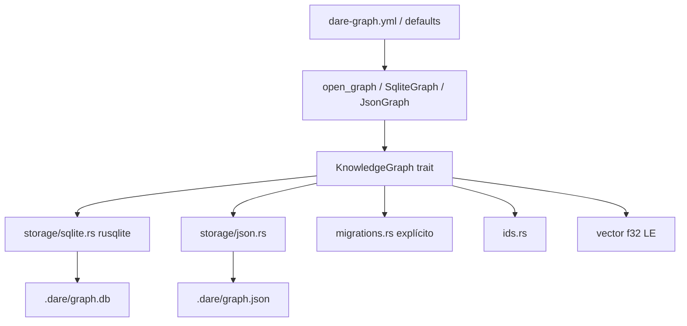

# BLUEPRINT: GraphRAG — storage e compatibilidade (Microplano 040)

> **Gerado a partir de:** `DARE/DESIGN-040-graphrag-storage-e-compatibilidade.md` v1.0  
> **Data:** 2026-07-22 | **Status:** APPROVED (ciclo autorizado)  
> **Arquivo:** `DARE/BLUEPRINT-040-graphrag-storage-e-compatibilidade.md`  
> **Pré-requisitos:** 005 (path), 007 (contracts / IDs parciais), 026 (contexto DAG; sem dep de código), ADR-006  
> **Escopo:** `dare-graph` storage SQLite+JSON+IDs+migrations. **Não** CLI graph · **Não** ingest/search/RRF · **Não** Neo4j.

---

## 0. TRADE-OFFS (Architect)

| # | Trade-off | Escolha | Justificativa |
|---|-----------|---------|---------------|
| T-01 | Crate | **`crates/dare-graph`** novo | Microplano; isola GraphRAG |
| T-02 | Deps | `dare-core` + `dare-contracts` + serde/serde_json + rusqlite bundled; **não** `dare-cli`/`dare-dag` | Sem ciclos |
| T-03 | API sync | Trait sync | Classe B vs TS `async init`; alinhado 024/030 |
| T-04 | Escopo trait | Storage-only (sem search/traverse/locate) | 041+ |
| T-05 | SQLite crate | `rusqlite` **=0.32.1** `features=["bundled"]` | Mestre; pin workspace |
| T-06 | Persistência | Conexão de ficheiro nativa (não sql.js export) | Classe B; schema idêntico |
| T-07 | Silent ALTER | **Proibido** no open | ADR-006; Classe B vs TS `ensureVectorColumn` |
| T-08 | Migrations table | `dare_schema_migrations(version INTEGER PRIMARY KEY, applied_at TEXT NOT NULL)` | Só via `migrate()` |
| T-09 | Schema version | **1** = nodes+edges+indexes+vector | Baseline 3.18.1 |
| T-10 | Version 0 | nodes/edges sem coluna `vector` | `migrate()` ADD COLUMN |
| T-11 | JSON flush | `atomic_write` a cada mutação | Paridade TS flushSync |
| T-12 | Paths | `GRAPH_DB_REL=.dare/graph.db` · `GRAPH_JSON_REL=.dare/graph.json` · `GRAPH_YML_REL=dare-graph.yml` | ADR-006 |
| T-13 | Neo4j | Reject Config/InvalidInput | 043 |
| T-14 | IDs | Helpers em `dare_graph::ids` (reusa edge/task/file de contracts onde igual) | Paridade TS |
| T-15 | Docs | `docs/compatibility/graphrag-storage.md` + **DEC-036** | RF-21 |
| T-16 | CLI | **Zero** mudanças em `dare-cli` | RF-23 |
| T-17 | Ordenação | `ORDER BY id ASC` / sort por id em JSON | RNF-03 |
| T-18 | Upsert edge | REPLACE/INSERT OR REPLACE por id | TS upsert |
| T-19 | Metadata | JSON object string; default `{}` | Schema TS |
| T-20 | Weight default | `1.0` | Schema TS |
| T-21 | Fixture | Gerada em teste (schema legado sem migrations table) | Sem binário commitado obrigatório |
| T-22 | DEC | **DEC-036** active | Complements ADR-006 |

### 0.1 SCHEMA_SQL (congelado — idêntico ao TS)

```sql
CREATE TABLE IF NOT EXISTS nodes (
  id TEXT PRIMARY KEY,
  type TEXT NOT NULL,
  label TEXT NOT NULL,
  description TEXT,
  vector BLOB,
  metadata TEXT DEFAULT '{}',
  created_at TEXT DEFAULT (datetime('now')),
  updated_at TEXT DEFAULT (datetime('now'))
);

CREATE TABLE IF NOT EXISTS edges (
  id TEXT PRIMARY KEY,
  source_id TEXT NOT NULL,
  target_id TEXT NOT NULL,
  type TEXT NOT NULL,
  weight REAL DEFAULT 1.0,
  metadata TEXT DEFAULT '{}'
);

CREATE INDEX IF NOT EXISTS idx_nodes_type ON nodes(type);
CREATE INDEX IF NOT EXISTS idx_edges_source ON edges(source_id);
CREATE INDEX IF NOT EXISTS idx_edges_target ON edges(target_id);
CREATE INDEX IF NOT EXISTS idx_edges_type ON edges(type);
```

### 0.2 NodeType / EdgeType (congelados)

**NodeType (12):** `task`, `file`, `schema`, `endpoint`, `component`, `entity`, `concept`, `gate`, `code_symbol`, `requirement`, `pattern`, `formal-gate`

**EdgeType (13):** `depends_on`, `implements`, `uses`, `references`, `related_to`, `contains`, `extends`, `verified_by`, `affects`, `derives_from`, `evidenced_by`, `exhibits`, `proven_by`

### 0.3 IDs canônicos

| Kind | Formato |
|------|---------|
| task | `task:{taskId}` |
| file | `file:{posixPath}` |
| code_symbol | `code_symbol:{posixPath}::{symbol}` |
| requirement | `requirement:{reqId}` |
| pattern | `pattern:{patternId}` |
| edge | `{kind}:{fromId}->{toId}` |

Path: backslash→`/`; drive letter lowercased no Win (legado `toQualifiedName`).

### 0.4 Exit / erros (library)

Mapear para `CoreError`: Io (5), InvalidInput/Config (4), NotFound (3). Sem CLI exits neste ciclo.

### 0.5 GAP

| Item | Estado |
|------|--------|
| ADR-006 | ✅ |
| contracts GraphDocument / IDs parciais | ✅ |
| `dare-graph` crate | 🔴 |
| SQLite/JSON storage | 🔴 |
| Migrations explícitas | 🔴 |
| Docs/DEC/matriz | 🔴 |

---

## 1. ARQUITETURA



---

## 2. STACK

| Camada | Tecnologia |
|--------|------------|
| Rust | 1.85.0 |
| `dare-graph` | NOVO |
| rusqlite | 0.32.1 bundled |
| serde/serde_json | workspace |
| dare-core | path jail + atomic_write |
| dare-contracts | GraphDocument yml + IDs parciais |

---

## 3. MÓDULOS

```
crates/dare-graph/src/
  lib.rs
  types.rs
  ids.rs
  vector.rs
  knowledge_graph.rs   # trait
  config.rs
  migrations.rs
  storage/mod.rs
  storage/sqlite.rs
  storage/json.rs
```

### Trait (congelado)

```rust
pub trait KnowledgeGraph {
    fn schema_version(&self) -> u32;
    fn migrate(&mut self) -> CoreResult<()>;
    fn add_node(&mut self, node: GraphNode) -> CoreResult<()>;
    fn get_node(&self, id: &str) -> CoreResult<Option<GraphNode>>;
    fn query_nodes(&self, ty: Option<NodeType>, limit: Option<usize>) -> CoreResult<Vec<GraphNode>>;
    fn delete_node(&mut self, id: &str) -> CoreResult<()>;
    fn add_edge(&mut self, edge: GraphEdge) -> CoreResult<()>;
    fn get_edges(&self, node_id: &str, dir: EdgeDirection) -> CoreResult<Vec<GraphEdge>>;
    fn load_vectors(&self) -> CoreResult<Vec<VectorRow>>;
    fn get_statistics(&self) -> CoreResult<GraphStatistics>;
    fn export_document(&self) -> CoreResult<GraphStoreDocument>;
    fn import_document(&mut self, doc: &GraphStoreDocument) -> CoreResult<()>;
    fn flush(&mut self) -> CoreResult<()>;
    fn close(self) -> CoreResult<()> where Self: Sized;
}
```

---

## 4. TASKS (resumo)

| ID | Título | Deps | Complexity |
|----|--------|------|------------|
| mp040-001 | Workspace member + Cargo.toml rusqlite | — | LOW |
| mp040-002 | types + ids + vector | mp040-001 | MED |
| mp040-003 | trait + migrations | mp040-002 | MED |
| mp040-004 | SqliteGraph + legacy tests | mp040-003 | HIGH |
| mp040-005 | JsonGraph + contract tests | mp040-004 | HIGH |
| mp040-006 | config factory + path safety | mp040-005 | MED |
| mp040-007 | docs + DEC-036 + matriz | mp040-006 | MED |
| mp040-008 | Ralph Loop + fechamento | mp040-007 | MED |

---

## 5. SEGURANÇA

- Path jail obrigatório
- Sem shell
- Metadata/erros sem secrets
- `cargo audit` se deps novas

---

## 6. TESTES

1. vector LE round-trip
2. canonical IDs
3. SQLite CRUD + upsert + delete cascades edges
4. open legacy copy + mutate
5. migrate v0→v1 explícito; open sem ALTER
6. JSON↔SQLite contract
7. neo4j config → error
8. stats zero-filled

---

## 7. ACEITE

Espelha Design §7 + Ralph verde.
