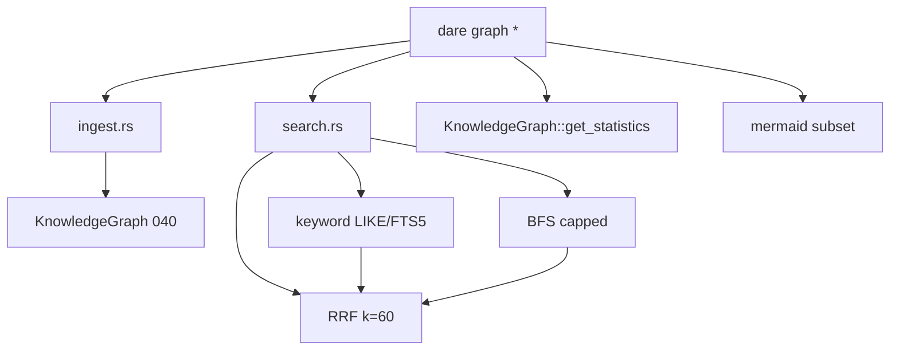

# BLUEPRINT: GraphRAG — ingest, keyword, BFS e RRF (Microplano 041)

> **Gerado a partir de:** `DARE/DESIGN-041-graphrag-ingest-keyword-bfs-e-rrf.md` v1.0  
> **Data:** 2026-07-24 | **Status:** APPROVED (ciclo autorizado)  
> **Arquivo:** `DARE/BLUEPRINT-041-graphrag-ingest-keyword-bfs-e-rrf.md`  
> **Pré-requisitos:** 035 (AST — não usado no index), 040 (storage), ADR-006  
> **Escopo:** ingest + search (keyword/BFS/RRF) + CLI `dare graph *`. **Não** semantic · **Não** Neo4j.

---

## 0. TRADE-OFFS (Architect)

| # | Trade-off | Escolha | Justificativa |
|---|-----------|---------|---------------|
| T-01 | Code-index | **Regex** (não dare-ast) | Paridade TS §5.1 |
| T-02 | Hash | sha256 hex em metadata `contentHash` | Paridade TS |
| T-03 | Keyword SoT | **LIKE** case-insensitive (id/label/description) | Paridade TS; JSON+SQLite |
| T-04 | FTS5 | Opcional SQLite (populate on ingest; MATCH; fallback LIKE) | rusqlite bundled “ganha FTS5”; ranking golden = LIKE |
| T-05 | BFS default | **2 hops** | Mestre §5.1 |
| T-06 | Caps | maxHops ≤ **5**; fanout ≤ **200** | Mestre traverse |
| T-07 | RRF | k=**60**; `score += 1/(k+rank)` rank 1-based | Mestre |
| T-08 | Hybrid 041 | keyword + graph only (sem vector rank) | Semantic → 042 |
| T-09 | Tie-break | score DESC, id ASC | Determinismo |
| T-10 | Walk | std::fs recursive; SKIP_DIRS espelha reverse | Sem walkdir crate |
| T-11 | CLI | Nested `dare graph <ingest\|query\|stats\|viz>` | Additive |
| T-12 | DEC | **DEC-042** | Pedido do ciclo |
| T-13 | Docs | `docs/compatibility/graphrag-ingest.md` | RF-17 |
| T-14 | Capability | `dare-graph` → `cli_commands: ["graph"]` | Paridade outros cmds |
| T-15 | Deps crate | `sha2` + `regex` em dare-graph | Workspace pins |
| T-16 | Exit codes | 004: Usage 2, NotFound 3, InvalidInput/Config 4, Io 5 | Sem exit novo |

### 0.1 API de domínio (congelada)

```rust
pub struct IngestOptions { pub max_files: usize, pub max_file_bytes: usize }
pub struct IngestReport { pub scanned, pub indexed, pub skipped_unchanged, pub symbols, pub warnings }

pub fn ingest_project(root: &ProjectRoot, graph: &mut dyn KnowledgeGraph, opts: &IngestOptions) -> CoreResult<IngestReport>;

pub const RRF_K: u32 = 60;
pub struct SearchOptions { pub limit: usize, pub max_hops: usize, pub fanout: usize }
pub struct RankedHit { pub id: String, pub score: f64, pub label: String, pub node_type: String }

pub fn keyword_search(g: &dyn KnowledgeGraph, query: &str, limit: usize) -> CoreResult<Vec<RankedHit>>;
pub fn bfs_expand(g: &dyn KnowledgeGraph, seeds: &[String], max_hops: usize, fanout: usize) -> CoreResult<Vec<String>>;
pub fn rrf_fuse(rankings: &[Vec<String>], k: u32) -> Vec<(String, f64)>;
pub fn hybrid_query(g: &dyn KnowledgeGraph, query: &str, opts: &SearchOptions) -> CoreResult<Vec<RankedHit>>;
```

### 0.2 Caps

| Const | Default | Max |
|-------|---------|-----|
| max_hops | 2 | 5 |
| fanout | 50 | 200 |
| query limit | 20 | 100 |
| max_files | 4096 | — |
| max_file_bytes | 1_048_576 | — |

### 0.3 Exit / erros CLI

Mapear `CoreError` → exits 004. Empty query → InvalidInput. Neo4j já rejeitado em 040.

---

## 1. ARQUITETURA



---

## 2. MÓDULOS

```
crates/dare-graph/src/
  ingest.rs   # NOVO
  search.rs   # NOVO
  lib.rs      # mod + re-exports
crates/dare-cli/src/commands/graph.rs  # NOVO
crates/dare-cli/src/main.rs            # Commands::Graph additive
```

---

## 3. FASES / TASKS

| ID | Título | Depends | Complexity |
|----|--------|---------|------------|
| mp041-001 | ingest.rs contentHash + símbolos regex | — | HIGH |
| mp041-002 | search.rs keyword LIKE/FTS5 + BFS + RRF + golden | mp041-001 | HIGH |
| mp041-003 | CLI graph ingest/query/stats/viz + smokes | mp041-002 | HIGH |
| mp041-004 | Docs + DEC-042 + matriz + capability | mp041-003 | MED |
| mp041-005 | Ralph Loop + fechamento | mp041-004 | MED |

---

## 4. TESTES

- Unit: hash skip, symbol extract, RRF math, BFS caps, clamp
- Golden: ranking fixo hybrid
- Smoke CLI: help, ingest temp, query, stats, viz

---

## 5. COMPAT

| Item | Classe | Nota |
|------|--------|------|
| Keyword LIKE SoT | A | = TS |
| FTS5 opcional SQLite | B | Aceleração; fallback LIKE |
| Sem semantic rank | — | Escopo 042 |
| Regex code-index | A | = TS (não AST) |
