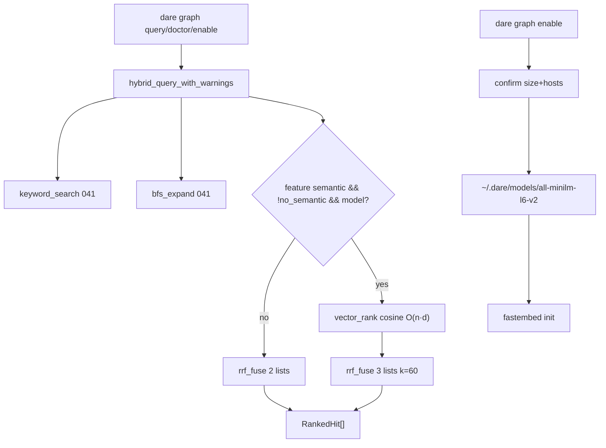

# BLUEPRINT: GraphRAG — semântico opcional (Microplano 042)

> **Gerado a partir de:** `DARE/DESIGN-042-graphrag-semantico-opcional.md` v1.0  
> **Data:** 2026-07-24 | **Status:** APPROVED (ciclo autorizado via `/dare-blueprint`)  
> **Arquivo:** `DARE/BLUEPRINT-042-graphrag-semantico-opcional.md`  
> **Pré-requisitos:** **040** storage · **041** ingest/keyword/BFS/RRF (`hybrid_query`, `rrf_fuse`, `RRF_K=60`) · ADR-006  
> **Escopo:** feature Cargo **`semantic`** + `semantic.rs` + MiniLM local + cache `~/.dare/models/**` + cosine + RRF 3 canais + fallback 041 + CLI `doctor`/`enable` + `--no-semantic` + docs + **DEC-045**.  
> **Não:** Neo4j / locate / impact / owners / drift (**043**) · embeddings cloud · `semantic` como default do binário release · Fase Docker (ciclo CLI; alinhado 039/041).

---

## 0. TRADE-OFFS (Architect)

> `DARE/PATTERNS.md` ausente neste repo CLI — trade-offs ancorados no código 🟢 (`dare-graph` layered: `search`/`ingest`/`storage`) e no Design. Conclusões de escolha de crate = 🟡 congeladas abaixo.

| # | Trade-off | Escolha | Justificativa |
|---|-----------|---------|---------------|
| T-01 | Runtime embeddings | **`fastembed`** (feature-gated) | API MiniLM pronta; menos glue que `ort`+tokenizers; pin workspace |
| T-02 | Modelo | **`AllMiniLML6V2`** / id string `all-MiniLM-L6-v2` | Design MUST; dim **384** |
| T-03 | Quantizado | Usar variante **quantized** exposta pelo fastembed para este modelo (se API tiver `…Q` / quantized enum; senão documentar Classe B “float weights via fastembed default”) | Critério microplano; Blueprint: prefer quantized API; fallback documentado |
| T-04 | Cache root | **`{home}/.dare/models/all-minilm-l6-v2/`** | RF-06; set `FASTEMBED_CACHE_PATH` (ou equiv. fastembed) para este dir antes de init |
| T-05 | Persistência vetores no graph.db | **Não** neste ciclo (runtime-only) | Evita schema ADR; invalidação = recompute; 043 pode revisitar |
| T-06 | Candidatos semantic | União **keyword hits ∪ BFS expanded**, cap **`MAX_CANDIDATES=512`**, ordem id ASC antes do embed | Evita O(N) full-DB; reusa 041 |
| T-07 | Passage text | `label` + `" "` + `description.unwrap_or("")`, truncado a **`MAX_PASSAGE_CHARS=2048`** (Unicode scalar chars) | Determinístico |
| T-08 | Query text | `query.trim()`, max **`MAX_QUERY_CHARS=8192`**; vazio → InvalidInput (igual 041) | RS-01 |
| T-09 | Cosine | Dot / (\|a\|·\|b\|); zero-norm ou len mismatch → **0.0** | Sem NaN no ranking |
| T-10 | RRF | Reusar `rrf_fuse`; k=**60**; 3 listas quando semantic OK | Paridade Mestre / 041 |
| T-11 | Fallback | Qualquer falha semantic → `hybrid_query` 041 + `warnings[]` | Exit 0; busca nunca quebra |
| T-12 | Feature default | **`semantic` off** em `dare-graph` e `dare-cli` | O-01; binário base sem pesos |
| T-13 | CLI flags | Default (com feature): tenta semantic; **`--no-semantic`** força 041; **sem** `--semantic` hard-fail | Soft-fail > exit 4 |
| T-14 | doctor / enable | **MUST neste Blueprint** (Design SHOULD → promovido) | Aceite microplano “enable/doctor se aprovado” — aprovado |
| T-15 | Download confirm | TTY: prompt `y/N` após mostrar URL allowlist + `EXPECTED_BYTES`; non-TTY: exige `--yes` **ou** env `DARE_GRAPH_SEMANTIC_YES=1` | RS-08 |
| T-16 | HTTP | **`ureq`** workspace (`=2.12.1`, native-tls) só se download manual; se fastembed baixar sozinho, confirmação **antes** de chamar init + size da constante | Sem reqwest novo |
| T-17 | Allowlist hosts | Ver §0.4 | RS-03 |
| T-18 | DEC | **DEC-045** | Próximo após DEC-044 |
| T-19 | Docs | `docs/compatibility/graphrag-semantic.md` | RF-18 |
| T-20 | Docker fase 1 | **Omitida** | Microplano CLI (como 039/041) |

### 0.1 Constantes (congeladas)

| Const | Valor |
|-------|-------|
| `SEMANTIC_MODEL_ID` | `"all-minilm-l6-v2"` (dir cache) |
| `SEMANTIC_MODEL_DISPLAY` | `"all-MiniLM-L6-v2"` |
| `EMBED_DIM` | `384` |
| `MAX_CANDIDATES` | `512` |
| `MAX_QUERY_CHARS` | `8192` |
| `MAX_PASSAGE_CHARS` | `2048` |
| `RRF_K` | `60` (reexport / reuse) |
| `EXPECTED_MODEL_BYTES` | `22_000_000` (± display; “~22 MB”) |
| `MODELS_DIR_REL` | `.dare/models` sob home |
| `MSG_SEMANTIC_UNAVAILABLE` | prefix `"semantic unavailable: "` |

### 0.2 Feature Cargo (congelada)

```toml
# crates/dare-graph/Cargo.toml
[features]
default = []
semantic = ["dep:fastembed"]

[dependencies]
fastembed = { version = "=4.9.1", optional = true }  # pin exact; bump só com DEC note se resolver falhar

# crates/dare-cli/Cargo.toml
[features]
default = []
semantic = ["dare-graph/semantic"]
```

> Se `=4.9.1` não resolver no crates.io na data da implementação, pin da **maior 4.x estável** disponível + nota Classe B no DEC-045. **Não** ativar `semantic` em `default`.

### 0.3 API de domínio (congelada — anti-stub)

```rust
// Always available (no feature):
pub fn cosine_similarity(a: &[f32], b: &[f32]) -> f64;

#[derive(Debug, Clone)]
pub struct SearchOptions {
    pub limit: usize,
    pub max_hops: usize,
    pub fanout: usize,
    /// When true, skip vector channel even if feature+model OK.
    pub no_semantic: bool,
}

/// Extends 041. If semantic unavailable or no_semantic: identical to hybrid_query (2-list RRF).
/// If OK: rrf_fuse([kw_ids, bfs_ids, vector_ids], 60) then materialize RankedHit.
pub fn hybrid_query(
    graph: &dyn KnowledgeGraph,
    query: &str,
    opts: &SearchOptions,
) -> CoreResult<Vec<RankedHit>>;

/// Same as hybrid_query but returns warnings (semantic skip reasons) for CLI.
pub fn hybrid_query_with_warnings(
    graph: &dyn KnowledgeGraph,
    query: &str,
    opts: &SearchOptions,
) -> CoreResult<(Vec<RankedHit>, Vec<String>)>;

#[cfg(feature = "semantic")]
pub struct SemanticOptions {
    pub yes: bool,
    pub max_candidates: usize, // clamp 1..=MAX_CANDIDATES
}

#[cfg(feature = "semantic")]
pub struct ModelHandle { /* opaque; not Clone across threads required */ }

#[cfg(feature = "semantic")]
pub fn models_cache_dir() -> CoreResult<PathBuf>; // {home}/.dare/models/all-minilm-l6-v2

#[cfg(feature = "semantic")]
pub fn model_is_cached() -> bool;

#[cfg(feature = "semantic")]
/// Confirm + download/init. Idempotent if cached.
pub fn ensure_model(opts: &SemanticOptions) -> CoreResult<ModelHandle>;

#[cfg(feature = "semantic")]
pub fn embed_texts(handle: &ModelHandle, texts: &[String]) -> CoreResult<Vec<Vec<f32>>>;

#[cfg(feature = "semantic")]
pub fn vector_rank(
    handle: &ModelHandle,
    query: &str,
    candidates: &[(String, String)], // (id, passage)
) -> CoreResult<Vec<String>>; // ids score DESC, id ASC tie

#[derive(Debug, Clone, Serialize)]
#[serde(rename_all = "camelCase")]
pub struct SemanticDoctorReport {
    pub semantic_compiled: bool,
    pub model_id: String,
    pub embed_dim: u32,
    pub cache_dir: String,
    pub model_present: bool,
    pub expected_bytes: u64,
    pub allowlist_hosts: Vec<String>,
    pub warnings: Vec<String>,
}

pub fn semantic_doctor() -> SemanticDoctorReport; // works without feature (compiled=false)
```

**Pré `hybrid_query`:** query trim non-empty (else `InvalidInput` `"query must not be empty"`); opts clamped as 041 + `max_candidates` interno.

**Pós OK:** `Vec<RankedHit>` len ≤ limit; scores finitos; ordem score DESC, id ASC.

**Concorrência:** sem lock global obrigatório; `ModelHandle` usado single-threaded no CLI sync (paridade 040/041).

### 0.4 Download allowlist (congelada — fecha 🔴 do Design)

| Campo | Valor |
|-------|-------|
| Hosts permitidos | `huggingface.co`, `cdn-lfs.huggingface.co`, `cdn-lfs-us-1.huggingface.co` |
| Path prefix allow | `/sentence-transformers/all-MiniLM-L6-v2/` **ou** paths que o fastembed 4.x usa para `AllMiniLML6V2` (documentar URL efetiva no DEC após 1 download de referência) |
| Scheme | **https** only |
| Size gate | Se Content-Length presente e `> EXPECTED_MODEL_BYTES * 3` → abort InvalidInput; se `< 1_000_000` → warning |
| Hash | **SHOULD:** sha256 do artefacto principal se fastembed expor; senão Classe B “trust HTTPS+host allowlist+size” documentado no DEC-045 |

Implementação preferida: **não** reimplementar CDN — chamar `ensure_model` → confirmação humana → `std::env::set_var("FASTEMBED_CACHE_PATH", cache_dir)` → init fastembed (download interno). Se a lib exigir URL custom, só hosts da tabela.

### 0.5 Exit codes CLI

| Code | Quando |
|------|--------|
| 0 | query / doctor / enable OK; query com fallback também **0** |
| 2 | Usage (clap) |
| 3 | NotFound dir |
| 4 | InvalidInput (query vazia; `--yes` em falta em non-TTY no **enable**; host não allowlist se download manual) |
| 5 | Io |

`enable` cancelado pelo user (respondeu N) → exit **0** + message `"download cancelled"` (não erro).

---

## 1. ARQUITETURA



| Camada | Peça |
|--------|------|
| CLI | `commands/graph.rs` — actions Query(+flags), Doctor, Enable |
| Domínio | `dare-graph::semantic` + extensão `search.rs` |
| Cache | home `.dare/models/**` |
| Store | KnowledgeGraph 040 **sem** schema novo |

---

## 2. ESTRUTURA DE FICHEIROS

```text
crates/dare-graph/Cargo.toml              # MOD feature semantic + fastembed optional
crates/dare-graph/src/semantic.rs         # NOVO
crates/dare-graph/src/search.rs           # MOD SearchOptions.no_semantic; hybrid_query_with_warnings
crates/dare-graph/src/lib.rs              # MOD exports + cfg mod
crates/dare-cli/Cargo.toml                # MOD feature semantic
crates/dare-cli/src/commands/graph.rs     # MOD Query flags; Doctor; Enable
crates/dare-cli/src/main.rs               # MOD Graph subcommands additive
crates/dare-cli/tests/cli_smoke.rs        # MOD graph_semantic_* / doctor / no_semantic
docs/compatibility/graphrag-semantic.md   # NOVO
docs/DECISION-LOG.md                      # MOD DEC-045
DARE-RUST-MICRO-PLANOS/.../000A-MATRIZ…   # MOD 042 Concluído
docs/compatibility/graphrag-ingest.md     # MOD 1 linha “semantic → 042 doc”
```

---

## 3. MODELO DE DADOS / DISCO

### 3.1 Cache layout

```text
{home}/.dare/models/all-minilm-l6-v2/
  … artefatos geridos pelo fastembed …
```

- `models_cache_dir()` cria `.dare` + `models` + model id com mode segura (0755 / default fs).
- Path jail: após canonicalize, deve ter prefixo `{home}/.dare/models`; senão InvalidInput.

### 3.2 Sem alteração schema graph.db

Nenhum campo embedding persistido (T-05).

### 3.3 Doctor JSON (camelCase)

```json
{
  "semanticCompiled": true,
  "modelId": "all-MiniLM-L6-v2",
  "embedDim": 384,
  "cacheDir": "C:/Users/x/.dare/models/all-minilm-l6-v2",
  "modelPresent": false,
  "expectedBytes": 22000000,
  "allowlistHosts": ["huggingface.co", "cdn-lfs.huggingface.co", "cdn-lfs-us-1.huggingface.co"],
  "warnings": []
}
```

---

## 4. CONTRATOS CLI

### 4.1 Invocação

```text
dare graph query <q> [-d DIR] [--limit N] [--max-hops H] [--fanout F] [--no-semantic] [--json]
dare graph doctor [-d DIR] [--json]
dare graph enable [-d DIR] [--yes] [--json]
```

| Flag | Regra |
|------|-------|
| `--no-semantic` | Só em `query`; força canal 041 |
| `--yes` | Só em `enable`; obrigatório se stdin não for TTY e env `DARE_GRAPH_SEMANTIC_YES` ausente |
| `DARE_GRAPH_SEMANTIC_YES=1` | Equivale `--yes` |

### 4.2 Comportamentos

| Ação | Comportamento |
|------|----------------|
| `query` sem feature | = 041; ignore `--no-semantic` |
| `query` + feature + modelo | 3-list RRF; stdout pode listar `warnings` vazios |
| `query` + feature sem modelo | 2-list RRF + warning `semantic unavailable: model not cached (run dare graph enable)` |
| `doctor` | Sempre exit 0; `semanticCompiled` reflete `cfg` |
| `enable` sem feature | InvalidInput `"semantic feature not compiled into this binary"` exit 4 |
| `enable` + feature + cached | exit 0 `"model already present"` |
| `enable` + feature + download | confirm → download → exit 0 |
| `enable` user N | exit 0 cancelled |

### 4.3 Human stdout (mínimos)

Query (igual espírito 041) + se warnings: linhas `warning: semantic unavailable: …` (redacted).

Doctor:

```text
semanticCompiled: true
modelPresent: false
cacheDir: …
embedDim: 384
```

---

## 5. ALGORITMO `vector_rank` (anti-stub)

1. Validar `query` len ≤ MAX_QUERY_CHARS.
2. Truncar cada passage a MAX_PASSAGE_CHARS.
3. `q_vec = embed_texts(handle, &[query])?[0]`; se dim ≠ 384 → Internal.
4. `p_vecs = embed_texts(handle, &passages)?`; zip com ids.
5. Para cada: `score = cosine_similarity(&q_vec, &p_vec)`.
6. Sort: score DESC, id ASC; retornar ids (ranks 1..n para RRF).

Complexidade: O(n·d) com n≤512, d=384.

---

## 6. FASES DE EXECUÇÃO

> Sem Fase Docker. Última fase = Ralph + audit.

### Fase A — Cosine + SearchOptions + RRF 3-list (sem rede)

- **DONE:** `cosine_similarity` testado (incl. zero-norm, mismatch len); `SearchOptions.no_semantic`; `hybrid_query_with_warnings` com vector ranking **injectável/mock** nos testes (feature off path = bit-igual a 041 golden).
- Entregáveis: `search.rs` + testes golden 2-list inalterados.

### Fase B — `semantic.rs` + fastembed + cache + ensure_model

- **DONE:** feature compila; `models_cache_dir` / `model_is_cached`; `ensure_model` confirmação + init; download falha → erro tipado para enable, não para query.
- Entregáveis: `semantic.rs`, Cargo features.

### Fase C — Wire vector channel real em hybrid

- **DONE:** candidatos keyword∪BFS ≤512; `vector_rank`; fuse 3; fallback warnings.
- Entregáveis: integração search↔semantic.

### Fase D — CLI doctor / enable / `--no-semantic` + smokes

- **DONE:** subcommands additive; smokes sem rede (doctor; query `--no-semantic`; enable sem feature → 4).
- Entregáveis: `graph.rs`, `main.rs`, `cli_smoke`.

### Fase E — Docs DEC-045 + matriz + ingest doc pointer

- **DONE:** `graphrag-semantic.md`; DEC-045; 042 Concluído.

### Fase F — Ralph / audit

- **DONE:**  
  `cargo test -p dare-graph`  
  `cargo test -p dare-graph --features semantic`  
  `cargo clippy -p dare-graph -p dare-cli --all-targets -- -D warnings`  
  `cargo clippy -p dare-graph -p dare-cli --all-targets --features semantic -- -D warnings`  
  `cargo test -p dare-cli --test cli_smoke -- graph_`  
  `cargo audit` (sem HIGH/CRITICAL **novo** atribuível a fastembed; se houver, fix/pin/deny note no DEC)

---

## 7. VALIDATION GATES

| Gate | Comando |
|------|---------|
| Unit base | `cargo test -p dare-graph -- cosine_similarity hybrid` |
| Unit semantic | `cargo test -p dare-graph --features semantic` |
| Clippy dual | ver Fase F |
| Smokes | `graph_doctor_*`, `graph_query_no_semantic_*`, `graph_enable_without_feature_*` |
| Audit | `cargo audit` |
| Fmt | `cargo fmt --check` (ficheiros tocados; sem mass CRLF) |

---

## 8. CONTROLOS DE SEGURANÇA → FASES

| RS | Controlo | Fase |
|----|----------|------|
| RS-01 | Caps query/passage/candidates | A/C |
| RS-02 | redact em warnings/erros | C/D |
| RS-03 | allowlist hosts + https | B |
| RS-04 | audit feature semantic | F |
| RS-05 | só env YES / sem API keys | B/D |
| RS-06 | jail `~/.dare/models` | B |
| RS-07 | sem shell concat (fastembed/ureq) | B |
| RS-08 | confirm + tamanho | B/D |

---

## 9. ESTRATÉGIA DE TESTES

| Tipo | Casos |
|------|-------|
| Unit | cosine; RRF 3-list order golden (ids fixos, scores manuais injectados) |
| Unit | `no_semantic` ⇒ igual golden 041 |
| Unit semantic | cache path join; dim 384; candidate cap |
| Integração | `ensure_model` com cache **pré-populado** fixture (skip network) |
| Smoke | doctor compiled true/false; enable w/o feature → 4; query `--no-semantic` |
| Negativo | query empty → 4; path `..` em model id rejeitado |

**Proibido em CI default:** download real de HuggingFace (flaky). Network test `#[ignore]` opcional.

---

## 10. COMPAT vs TS 3.18.1

| Diff | Classe | Nota |
|------|--------|------|
| Runtime `fastembed` vs stack TS | B | Documentar |
| Cache `~/.dare/models` | A/B | Alinhar se TS usar outro path — documentar |
| Soft-fail query | A | Busca não quebra |
| Sem persist embed DB | B | Simplificação Rust ciclo 042 |
| doctor/enable surface | B | UX opt-in |

---

## 11. TASKS (resumo para `/dare-tasks`)

| ID | Título | depends_on | Complexity |
|----|--------|------------|------------|
| mp042-001 | cosine + SearchOptions.no_semantic + hybrid_query_with_warnings (2-list parity) | [] | MED |
| mp042-002 | semantic.rs fastembed + cache dir + ensure_model + doctor report types | [] | HIGH |
| mp042-003 | Wire vector_rank + 3-list RRF + fallback warnings | [mp042-001, mp042-002] | HIGH |
| mp042-004 | CLI query `--no-semantic` + doctor + enable + smokes | [mp042-003] | MED |
| mp042-005 | Docs graphrag-semantic + DEC-045 + matriz 042 | [mp042-004] | LOW |
| mp042-006 | Ralph dual-feature + audit close | [mp042-005] | MED |

Rank 0 paralelo: **001 ∥ 002**.

---

## 12. CHECKLIST DE APROVAÇÃO

- [ ] T-01…T-20 aceites (`fastembed`, runtime-only, `--no-semantic`, doctor/enable MUST)
- [ ] Allowlist hosts §0.4 suficiente (URL path exacta pode ser anotada no DEC pós-spike)
- [ ] API §0.3 anti-stub executável sem inventar
- [ ] Sem Fase Docker OK
- [ ] Sem schema graph breaking OK
- [ ] Pronto para `/dare-tasks` → `TASKS-042` + `dare-dag-042.yaml` + `EXECUTION-042/`

---

**Não gerar** TASKS/DAG/EXECUTION neste passo — só após aprovação humana + `/dare-tasks`.
