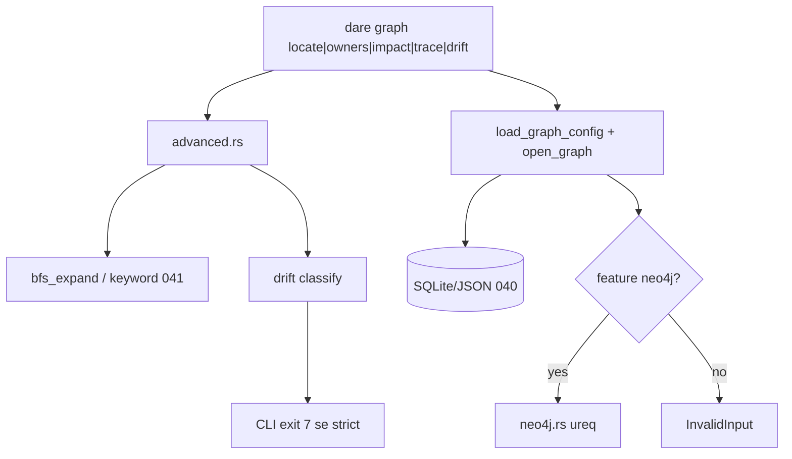

# BLUEPRINT: GraphRAG — avançado + Neo4j experimental (Microplano 043)

> **Gerado a partir de:** `DARE/DESIGN-043-graphrag-avancado-e-neo4j.md` v1.0  
> **Data:** 2026-07-24 | **Status:** APPROVED (ciclo autorizado via `/dare-blueprint`)  
> **Arquivo:** `DARE/BLUEPRINT-043-graphrag-avancado-e-neo4j.md`  
> **Pré-requisitos:** **040** storage · **041** search/BFS/RRF · **042** semantic (independente) · ADR-006  
> **Escopo:** `advanced.rs` (locate/owners/impact/trace/drift) + exit **7** + `neo4j.rs` HTTP opt-in + CLI + docs **DEC-046**.  
> **Não:** Neo4j default · dashboard/MCP · Fase Docker (ciclo CLI) · `execute --policy decay`.

---

## 0. TRADE-OFFS (Architect)

> `DARE/PATTERNS.md` ausente no repo CLI — trade-offs ancorados em código 🟢 (`NodeType`/`EdgeType`, `bfs_expand`, `config` Neo4j reject, exit table Mestre).

| # | Trade-off | Escolha | Justificativa |
|---|-----------|---------|---------------|
| T-01 | Locate decay | `score(h) = base * DECAY.pow(hop)` com `DECAY=0.7` | Simples, determinístico, testável |
| T-02 | Locate base | Keyword match (`node_matches_keyword`) hop=0 score=1.0; expansão BFS | Reusa 041 |
| T-03 | Owners | Pais via `Contains` **incoming** + metadata `owner` string se presente | Edge type já no schema |
| T-04 | Impact | BFS **Out** em edges `depends_on\|uses\|contains\|affects\|implements` | Blast-radius típico |
| T-05 | Trace | Caminhos de comprimento mínimo `from→to` (BFS), max_hops; sort len ASC, path-ids ASC | Determinismo |
| T-06 | Drift orphan-requirement | `NodeType::Requirement` **sem** edge outbound `implements` | Mestre orphan-requirement |
| T-07 | Drift orphan-code | `File` ou `CodeSymbol` **sem** edge inbound `implements` | Mestre orphan-code |
| T-08 | Drift stale | `metadata.stale == true` (bool JSON) **ou** string `"true"` | Sem TS golden no repo — Classe B local |
| T-09 | Violations | `violations = orphans_req.len() + orphans_code.len() + stale.len()` (contagem de entradas, ids podem repetir entre listas só se regras distintas) | Contagem simples |
| T-10 | Threshold default | `1` | Strict falha no primeiro finding |
| T-11 | Exit 7 | **Só** CLI: `strict && violations >= threshold` → `ExitCode::from(7)`; domínio retorna `DriftReport` sempre `Ok` | Mestre §2.2 |
| T-12 | Caps | Reusar `MAX_HOPS_CAP=5`, `MAX_FANOUT_CAP=200`, defaults 2 / 50; `limit` default 20 max 100 | Paridade 041 |
| T-13 | Neo4j feature | Cargo `neo4j = ["dep:…"]` **não** default; sem feature → reject backend como hoje | O-08 |
| T-14 | HTTP client | Workspace **`ureq` =2.12.1** native-tls | Já no monorepo |
| T-15 | Neo4j API | HTTP `POST {base}/db/{db}/tx/commit` (Neo4j 5 HTTP) com Basic auth | Sem bolt driver pesado |
| T-16 | Neo4j KG | **Read-only** subset (`get_node`, `query_nodes`, `get_edges`); mutate → `InvalidInput("neo4j writes not supported in 043")` | Experimental |
| T-17 | Timeout/retry | timeout **5s**; retries **2**; backoff **100ms * attempt** | RF-15 |
| T-18 | URL allowlist | scheme `http` \| `https` only; host não vazio | RS-06 |
| T-19 | DEC | **DEC-046** | Após DEC-045 |
| T-20 | Docs | `docs/compatibility/graphrag-advanced.md` | RF-17 |
| T-21 | Docker | Omitida | Microplano CLI |

### 0.1 Constantes

| Const | Valor |
|-------|-------|
| `LOCATE_DECAY` | `0.7_f64` |
| `DEFAULT_THRESHOLD` | `1` |
| `DRIFT_STRICT_EXIT` | `7` |
| `NEO4J_HTTP_TIMEOUT_MS` | `5_000` |
| `NEO4J_HTTP_RETRIES` | `2` |
| `NEO4J_BACKOFF_MS` | `100` |
| `NEO4J_DEFAULT_DB` | `"neo4j"` |
| `MSG_DRIFT_THRESHOLD` | `"DRIFT_THRESHOLD exceeded"` |

### 0.2 API de domínio (congelada — anti-stub)

```rust
use crate::knowledge_graph::{EdgeDirection, KnowledgeGraph};
use crate::search::{RankedHit, MAX_FANOUT_CAP, MAX_HOPS_CAP, MAX_LIMIT_CAP};

pub const LOCATE_DECAY: f64 = 0.7;
pub const DEFAULT_DRIFT_THRESHOLD: u32 = 1;

#[derive(Debug, Clone)]
pub struct TraverseOptions {
    pub max_hops: usize,  // clamp 0..=MAX_HOPS_CAP
    pub fanout: usize,    // clamp 1..=MAX_FANOUT_CAP
    pub limit: usize,     // clamp 1..=MAX_LIMIT_CAP
}

impl Default for TraverseOptions { /* hops=2, fanout=50, limit=20 */ }

#[derive(Debug, Clone)]
pub struct LocateOptions {
    pub query: String,           // trim; empty → InvalidInput "query must not be empty"
    pub max_hops: usize,
    pub fanout: usize,
    pub limit: usize,
    pub decay: f64,              // default LOCATE_DECAY; must be in (0.0, 1.0]
}

#[derive(Debug, Clone)]
pub struct DriftOptions {
    pub threshold: u32,          // default 1; 0 means any violation counts as exceed when strict at CLI
}

#[derive(Debug, Clone, PartialEq, Eq, Serialize)]
#[serde(rename_all = "camelCase")]
pub struct DriftReport {
    pub orphan_requirements: Vec<String>, // ids sorted ASC
    pub orphan_code: Vec<String>,
    pub stale: Vec<String>,
    pub violations: u32,
    pub threshold: u32,
}

/// Keyword seeds (hop 0, score 1.0) + BFS neighbors score = 1.0 * decay^hop.
/// Aggregate max score per id; sort score DESC, id ASC; take limit.
pub fn locate(g: &dyn KnowledgeGraph, opts: &LocateOptions) -> CoreResult<Vec<RankedHit>>;

/// Owners of `seed` (must exist else InvalidInput "unknown node"):
/// 1) metadata["owner"] if string non-empty (push as synthetic owner id `owner:{value}` OR raw value — **congelado: raw trimmed string**)
/// 2) all source ids of Contains edges where target==seed (incoming Contains)
/// Unique, sort ASC.
pub fn owners(g: &dyn KnowledgeGraph, seed: &str) -> CoreResult<Vec<String>>;

/// BFS from seeds, direction Out, edge types:
/// depends_on, uses, contains, affects, implements.
/// Exclude seeds from output; sort ASC; apply limit.
/// Unknown seed → InvalidInput.
pub fn impact(g: &dyn KnowledgeGraph, seeds: &[String], opts: &TraverseOptions) -> CoreResult<Vec<String>>;

/// All shortest paths from→to within max_hops (unweighted).
/// Empty vec if none. Each path = vec of node ids including endpoints.
/// Sort: path.len ASC, then lexicographic join of ids.
pub fn trace(
    g: &dyn KnowledgeGraph,
    from: &str,
    to: &str,
    opts: &TraverseOptions,
) -> CoreResult<Vec<Vec<String>>>;

/// Classify drift; always Ok on readable graph.
pub fn drift(g: &dyn KnowledgeGraph, opts: &DriftOptions) -> CoreResult<DriftReport>;

/// Helper for CLI: true if violations >= threshold (threshold 0 ⇒ true iff violations > 0).
pub fn drift_exceeds_threshold(report: &DriftReport) -> bool;
```

**Pré comuns:** graph aberto + `migrate()` já feito no CLI (como ingest/query).

**Concorrência:** sync single-threaded CLI (paridade 040).

### 0.3 Drift — regras exactas

| Lista | Condição |
|-------|----------|
| `orphan_requirements` | `node_type == requirement` AND zero outbound edges with type `implements` |
| `orphan_code` | `node_type ∈ {file, code_symbol}` AND zero inbound edges with type `implements` |
| `stale` | `metadata.get("stale")` is JSON `true` OR string equal ignore-ascii-case `"true"` |

Ids em cada lista: sort ASC, dedup within list.  
`violations = (len orphan_requirements + len orphan_code + len stale) as u32`.

### 0.4 Locate — algoritmo

1. `q = query.trim()`; empty → Err InvalidInput.  
2. `nodes = g.query_nodes(None, None)?`; seeds = nodes matching `node_matches_keyword(n, q)`; if none → Ok `[]`.  
3. Init `scores: BTreeMap<id, f64>` with seed ids → `1.0`.  
4. BFS from seeds up to `max_hops` with `fanout` (reuse neighbor ordering estável de `bfs_expand` / sort neighbor ids ASC).  
5. For each visit at hop `h >= 1`: `cand = 1.0 * opts.decay.powi(h as i32)`; keep **max** score per id.  
6. Materialize `RankedHit` for top `limit` by score DESC, id ASC (label/type from `get_node`).

### 0.5 Neo4j (feature `neo4j`)

```toml
# dare-graph
[features]
default = []
neo4j = []   # gate code with cfg; ureq already workspace dep — use cfg(feature="neo4j") modules

# dare-cli
neo4j = ["dare-graph/neo4j"]
```

Config YAML (quando feature on):

```yaml
backend: neo4j
neo4j:
  url: http://localhost:7474
  database: neo4j
  # user/password: prefer env NEO4J_USER / NEO4J_PASSWORD
```

Env override: `NEO4J_URL`, `NEO4J_USER`, `NEO4J_PASSWORD`, `NEO4J_DATABASE`.

`open_graph`: se backend neo4j && !cfg(feature) → InvalidInput `"neo4j backend requires the neo4j feature"`.  
Se feature: construct `Neo4jGraph` client.

HTTP: Basic auth; `POST {url}/db/{database}/tx/commit` body:
```json
{ "statements": [ { "statement": "…", "parameters": { } } ] }
```
Só statements internos fixos (templates). Password never in Debug/Display.

Retries: on timeout/5xx only; max `NEO4J_HTTP_RETRIES`.

### 0.6 Exit codes CLI

| Code | Quando |
|------|--------|
| 0 | OK (incl. drift report sem strict ou sob threshold) |
| 2 | Usage clap |
| 3 | NotFound dir |
| 4 | InvalidInput/Config |
| 5 | Io |
| **7** | `drift --strict` && `drift_exceeds_threshold` |

Stderr/human em exit 7 deve conter `DRIFT_THRESHOLD`.

---

## 1. ARQUITETURA



---

## 2. ESTRUTURA DE FICHEIROS

```text
crates/dare-graph/src/advanced.rs     # NOVO
crates/dare-graph/src/neo4j.rs        # NOVO (cfg feature)
crates/dare-graph/src/lib.rs          # MOD
crates/dare-graph/src/config.rs       # MOD open neo4j when feature
crates/dare-graph/Cargo.toml          # MOD feature neo4j
crates/dare-cli/Cargo.toml            # MOD feature neo4j
crates/dare-cli/src/commands/graph.rs # MOD actions
crates/dare-cli/src/main.rs           # MOD subcommands
crates/dare-cli/tests/cli_smoke.rs    # MOD smokes
docs/compatibility/graphrag-advanced.md  # NOVO
docs/DECISION-LOG.md                  # MOD DEC-046
DARE-RUST-MICRO-PLANOS/.../000A-…     # MOD 043
docs/compatibility/graphrag-ingest.md # MOD pointer
```

---

## 3. MODELO / REPORTS

### DriftReport JSON (camelCase)

```json
{
  "orphanRequirements": ["requirement:r1"],
  "orphanCode": ["file:src/a.rs"],
  "stale": ["file:src/b.rs"],
  "violations": 3,
  "threshold": 1
}
```

### Locate hits

Reusar `RankedHit` `{ id, score, label, nodeType }`.

---

## 4. CONTRATOS CLI

```text
dare graph locate <query> [-d DIR] [--max-hops H] [--fanout F] [--limit N] [--json]
dare graph owners <seed> [-d DIR] [--json]
dare graph impact <seed>[,seed…] [-d DIR] [--max-hops H] [--fanout F] [--limit N] [--json]
dare graph trace --from <id> --to <id> [-d DIR] [--max-hops H] [--json]
dare graph drift [-d DIR] [--strict] [--threshold N] [--json]
```

| Edge | Resultado |
|------|-----------|
| locate query vazio | exit 4 |
| owners seed missing | exit 4 |
| impact seed missing | exit 4 |
| trace sem path | exit 0 + empty list |
| drift --strict violations≥threshold | **exit 7** |
| backend neo4j sem feature | exit 4 |

---

## 5. FASES DE EXECUÇÃO

> Sem Docker. Ralph + audit no fim.

### Fase A — locate + owners
**DONE:** algoritmos §0.2–0.4; unit goldens.  
Entregável: `advanced.rs` parcial.

### Fase B — impact + trace
**DONE:** BFS impact + shortest paths; caps.  

### Fase C — drift + `drift_exceeds_threshold`
**DONE:** três listas + violations; unit.  

### Fase D — CLI advanced + smokes (exit 7)
**DONE:** subcommands; smoke `graph_drift_strict_exit_7`.  

### Fase E — Neo4j feature + HTTP client + config
**DONE:** open quando feature; mock timeout/retry; reject sem feature.  

### Fase F — Docs DEC-046 + matriz
**DONE:** `graphrag-advanced.md`; DEC-046; 043 Concluído.  

### Fase G — Ralph
```
cargo test -p dare-graph
cargo test -p dare-graph --features neo4j
cargo clippy -p dare-graph -p dare-cli --all-targets -- -D warnings
cargo clippy -p dare-graph -p dare-cli --features neo4j --all-targets -- -D warnings
cargo test -p dare-cli --test cli_smoke -- graph_
cargo audit
```

---

## 6. VALIDATION GATES

| Gate | Comando |
|------|---------|
| Unit advanced | `cargo test -p dare-graph -- advanced locate drift impact trace` |
| Unit neo4j | `cargo test -p dare-graph --features neo4j -- neo4j` |
| Smoke exit 7 | `graph_drift_strict_exit_7` |
| Audit | `cargo audit` |

---

## 7. SEGURANÇA → FASES

| RS | Fase |
|----|------|
| RS-01 caps/validate | A–D |
| RS-02 redact secrets | E |
| RS-03 Cypher templates only | E |
| RS-04 audit | G |
| RS-05 env creds | E |
| RS-06 URL scheme | E |
| RS-07 timeout | E |
| RS-08 retry cap | E |

---

## 8. TESTES

| Tipo | Casos |
|------|-------|
| Unit | decay scores; owners Contains; impact exclude seeds; trace shortest; drift three buckets |
| Golden | fixture graph fixed ids |
| Smoke | locate/owners/impact/trace/drift; drift strict → 7 |
| Neo4j | sem feature reject; mock HTTP 5xx retry then fail |
| Negativo | empty query; unknown seed |

CI: **sem** Neo4j real.

---

## 9. COMPAT vs TS 3.18.1

| Diff | Classe | Nota |
|------|--------|------|
| Decay 0.7 local | B | Documentar se TS diferir |
| stale via metadata.stale | B | Sem golden TS no repo |
| Neo4j HTTP vs driver | B | Experimental |
| Exit 7 | A | Mestre |
| Owners = Contains parents + metadata.owner | B | |

---

## 10. TASKS (resumo para `/dare-tasks`)

| ID | Título | depends_on | Complexity |
|----|--------|------------|------------|
| mp043-001 | advanced locate + owners + tests | [] | HIGH |
| mp043-002 | advanced impact + trace + tests | [] | HIGH |
| mp043-003 | advanced drift + threshold helper | [] | MED |
| mp043-004 | neo4j feature + HTTP client + config | [] | HIGH |
| mp043-005 | CLI locate/owners/impact/trace/drift + exit 7 smokes | [mp043-001, mp043-002, mp043-003] | MED |
| mp043-006 | Docs DEC-046 + matriz + Ralph close | [mp043-004, mp043-005] | MED |

Rank 0 paralelo: **001 ∥ 002 ∥ 003 ∥ 004**.

---

## 11. CHECKLIST DE APROVAÇÃO

- [ ] Decay 0.7 + drift rules §0.3 aceites
- [ ] Exit 7 só no CLI drift strict
- [ ] Neo4j feature off default + read-only KG
- [ ] API §0.2 executável sem inventar
- [ ] Sem Fase Docker OK
- [ ] Pronto para `/dare-tasks` → `TASKS-043` + `dare-dag-043.yaml` + `EXECUTION-043/`

---

**Não gerar** TASKS/DAG/EXECUTION neste passo.
