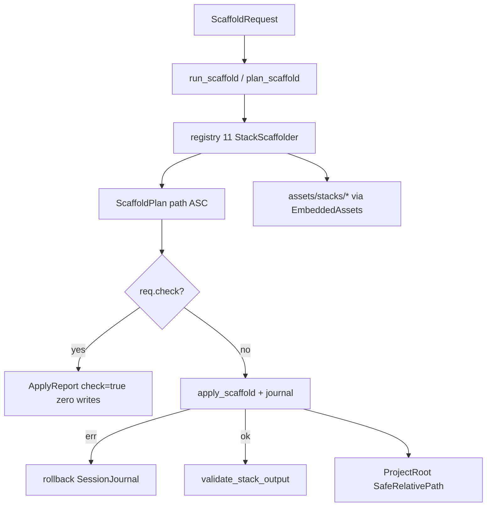

# BLUEPRINT: Scaffolding — contratos, stacks e artefatos AX (Microplano 046)

> **Gerado a partir de:** `DARE/DESIGN-046-scaffolding-contratos-stacks-e-artefatos-ax.md` v1.0  
> **Data:** 2026-07-25 | **Status:** APPROVED (ciclo autorizado via `/dare-blueprint`)  
> **Arquivo:** `DARE/BLUEPRINT-046-scaffolding-contratos-stacks-e-artefatos-ax.md`  
> **Pré-requisitos:** **007–010** contracts/assets · **022** update (journal/rollback pattern) · Mestre §12 / §36  
> **Escopo:** crate **`dare-scaffold`** + **`assets/stacks/**`** + trait + 11 IDs + modelo + 7 AX + plan/apply/rollback + validate + fixtures + docs **DEC-047**.  
> **Não:** CLI `dare init`/`dare bootstrap` (**047**) · hooks (**048**) · Fase Docker do CLI · deps npm/cargo da stack alvo.

---

## 0. TRADE-OFFS (Architect)

> `DARE/PATTERNS.md` / `patterns-facts.json` ausentes neste repo — trade-offs ancorados em código 🟢 (`dare-update` SessionJournal, `dare-assets` EmbeddedAssets, `SafeRelativePath`, `MIGRATE_TARGET_ALLOWLIST`, Mestre §36).

| # | Trade-off | Escolha | Justificativa |
|---|-----------|---------|---------------|
| T-01 | Fronteira 046/047 | Só lib + assets; **zero** clap/commands | RF-20; evita merge storm com CLI |
| T-02 | 11 stack IDs | Congelar lista Mestre §36 (não migrate allowlist) | Paridade Ciclo 18 |
| T-03 | `rails` vs `ruby-rails-8` | Scaffold id = `ruby-rails-8`; hint se input `rails` | Classe B vs migrate |
| T-04 | Frontend `react`/`vue` | **Não** IDs de registry; `ScaffoldRequest.frontend: Option<FrontendKind>` reserved `None` em 046 | Design §10 |
| T-05 | Templates | MVP sob `assets/stacks/<id>/` + embed via `dare-assets` | RNF-04; binário controlado |
| T-06 | 7 AX paths | Lista §0.3 congelada (raiz do projeto alvo) | dare-ax + Design §4.1 |
| T-07 | OpenAPI MCP | Sempre `openapi.json` na raiz; MCP = stub `paths:{}` + `info.title` | Uniformidade validate |
| T-08 | Rate-limit file | Path **fixado por família** §0.3 (não 11 paths ad-hoc soltos) | Determinismo |
| T-09 | Journal/rollback | Espelhar `dare-update::SessionJournal` **dentro** de `dare-scaffold` (sem dep `dare-update`) | Evita ciclo crates; RS-07 |
| T-10 | Conflito de ficheiro | Sem `force`: `InvalidInput("path already exists: …")`; `force` campo reserved (047) | Sem ErrorKind novo |
| T-11 | Project name | `^[a-z][a-z0-9_-]{0,63}$` ASCII; trim; empty → InvalidInput | RS-01 |
| T-12 | Plan order | Items sort `path` ASC (posix `/`) | RNF-01 |
| T-13 | Dry-run | `plan_scaffold` only; `apply` never called | RF-12 |
| T-14 | DEC | **DEC-047** | Após DEC-046 |
| T-15 | Docker fase template | Omitida para o **CLI** (não é serviço); `Dockerfile`/`compose` são **artefatos AX gerados** | Microplano CLI |

### 0.1 Constantes

| Const | Valor |
|-------|-------|
| `STACK_IDS` | 11 strings §0.2 |
| `AX_ARTIFACT_COUNT` | `7` |
| `MAX_PROJECT_NAME_LEN` | `64` |
| `PROJECT_NAME_RE` | `^[a-z][a-z0-9_-]{0,63}$` |
| `MSG_UNKNOWN_STACK` | `"unknown stack id"` |
| `MSG_PATH_EXISTS` | `"path already exists: {path}"` |
| `MSG_HINT_RAILS` | `"did you mean ruby-rails-8?"` (sufixo se id==`rails`) |
| `JOURNAL_DIR_PREFIX` | `.dare/scaffold-session` |
| `SECRET_SCAN_NEEDLES` | `password=`, `api_key=`, `BEGIN PRIVATE KEY` (ASCII case-insensitive contains) |
| `OPENAPI_STUB_VERSION` | `"3.0.3"` |

### 0.2 Stack IDs (fechados — ordem canónica ASC para `list_stack_ids`)

```text
go-gin
go-stdlib
mcp-go
mcp-node-ts
mcp-python
mcp-rust
node-nestjs
php-laravel
python-fastapi
ruby-rails-8
rust-axum
```

| id | kind | language | default_toolchain | default_transport |
|----|------|----------|-------------------|-------------------|
| `go-gin` | backend | go | none | — |
| `go-stdlib` | backend | go | none | — |
| `mcp-go` | mcp | go | none | stdio |
| `mcp-node-ts` | mcp | typescript | none | stdio |
| `mcp-python` | mcp | python | none | stdio |
| `mcp-rust` | mcp | rust | none | stdio |
| `node-nestjs` | backend | typescript | none | — |
| `php-laravel` | backend | php | none | — |
| `python-fastapi` | backend | python | none | — |
| `ruby-rails-8` | backend | ruby | none | — |
| `rust-axum` | backend | rust | none | — |

`list_stack_ids()` **MUST** retornar exactamente esta ordem ASC (já sorted).

### 0.3 Sete artefatos AX (paths relativos à raiz do projeto alvo)

| # | Path relativo | Notas |
|---|---------------|-------|
| 1 | `llms.txt` | Template AX Discovery; sem secrets |
| 2 | `README.md` | Secções `## Bootstrap` e `## Docs` obrigatórias |
| 3 | `.env.example` | Só placeholders `KEY=` / `# comment`; sem valores secretos |
| 4 | `openapi.json` | Sempre na raiz. Backend HTTP: paths mínimos `/healthz`. MCP: `"paths":{}` |
| 5 | `Dockerfile` | Multi-stage mínimo ou single-stage documentado |
| 6 | `docker-compose.yml` | Serviço app + healthcheck stub |
| 7 | Rate-limit starter | Path por **família** (abaixo) |

**Rate-limit path (artefato #7) por família de language/kind:**

| Família | Path AX #7 |
|---------|------------|
| `node-nestjs`, `mcp-node-ts` | `src/rate-limit.ts` |
| `python-fastapi`, `mcp-python` | `app/rate_limit.py` |
| `php-laravel` | `app/Http/Middleware/RateLimitStarter.php` |
| `ruby-rails-8` | `config/initializers/rack_attack_starter.rb` |
| `rust-axum`, `mcp-rust` | `src/rate_limit.rs` |
| `go-gin`, `go-stdlib`, `mcp-go` | `internal/ratelimit/limiter.go` |

### 0.4 Enums e tipos (congelados)

```rust
#[derive(Debug, Clone, Copy, PartialEq, Eq, Serialize, Deserialize)]
#[serde(rename_all = "camelCase")]
pub enum StackKind { Backend, Mcp }

#[derive(Debug, Clone, Copy, PartialEq, Eq, Serialize, Deserialize)]
#[serde(rename_all = "camelCase")]
pub enum Toolchain { None, Docker }

impl Default for Toolchain { fn default() -> Self { Self::None } }

#[derive(Debug, Clone, Copy, PartialEq, Eq, Serialize, Deserialize)]
#[serde(rename_all = "camelCase")]
pub enum Transport { Stdio, Http, Sse }

impl Default for Transport { fn default() -> Self { Self::Stdio } }

/// Reserved for 047 — always None in 046 tests.
#[derive(Debug, Clone, Copy, PartialEq, Eq, Serialize, Deserialize)]
#[serde(rename_all = "camelCase")]
pub enum FrontendKind { React, Vue }

#[derive(Debug, Clone, PartialEq, Eq, Serialize, Deserialize)]
#[serde(rename_all = "camelCase")]
pub struct StackMetadata {
    pub id: String,
    pub kind: StackKind,
    pub language: String,
    pub default_toolchain: Toolchain,
    pub default_transport: Option<Transport>, // Some only if kind==Mcp
    pub template_root: String, // e.g. "stacks/node-nestjs"
    pub rate_limit_rel: String, // AX #7 path
}

#[derive(Debug, Clone)]
pub struct ScaffoldRequest {
    pub project_name: String,
    pub stack_id: String,
    pub toolchain: Toolchain,
    pub transport: Option<Transport>, // if None && mcp → Stdio
    pub frontend: Option<FrontendKind>, // MUST be None in 046 apply path → ignore if Some with warning in report? **congelado: se Some → InvalidInput "frontend composition reserved for 047"**
    pub force: bool, // reserved; if true in 046 still only used for overwrite policy — **046 implements force=false behavior; force=true allowed to overwrite (needed for tests) — congelado: force=true OVERWRITES existing planned paths**
    pub check: bool, // if true: plan only, zero writes
}

#[derive(Debug, Clone, Copy, PartialEq, Eq, Serialize, Deserialize)]
#[serde(rename_all = "camelCase")]
pub enum PlanAction { Create, Skip, Replace }

#[derive(Debug, Clone, Copy, PartialEq, Eq, Serialize, Deserialize)]
#[serde(rename_all = "camelCase")]
pub enum PlanItemKind { Template, Ax, Meta }

#[derive(Debug, Clone, PartialEq, Eq, Serialize, Deserialize)]
#[serde(rename_all = "camelCase")]
pub struct ScaffoldPlanItem {
    pub path: String,       // posix relative
    pub action: PlanAction,
    pub kind: PlanItemKind,
}

#[derive(Debug, Clone, PartialEq, Eq, Serialize, Deserialize)]
#[serde(rename_all = "camelCase")]
pub struct ScaffoldPlan {
    pub schema_version: u32, // 1
    pub stack_id: String,
    pub project_name: String,
    pub items: Vec<ScaffoldPlanItem>, // sorted path ASC
}

#[derive(Debug, Clone, PartialEq, Eq, Serialize, Deserialize)]
#[serde(rename_all = "camelCase")]
pub struct ScaffoldApplyReport {
    pub schema_version: u32, // 1
    pub stack_id: String,
    pub created: Vec<String>,
    pub replaced: Vec<String>,
    pub skipped: Vec<String>,
    pub rolled_back: bool,
    pub check: bool,
}

#[derive(Debug, Clone, PartialEq, Eq, Serialize, Deserialize)]
#[serde(rename_all = "camelCase")]
pub struct ValidationReport {
    pub stack_id: String,
    pub ok: bool,
    pub missing: Vec<String>, // sorted ASC
    pub secret_hits: Vec<String>, // paths that failed secret scan
}
```

### 0.5 API de domínio (congelada — anti-stub)

```rust
pub trait StackScaffolder: Send + Sync {
    fn id(&self) -> &'static str;
    fn metadata(&self) -> &StackMetadata;
    fn plan(&self, root: &ProjectRoot, req: &ScaffoldRequest) -> CoreResult<ScaffoldPlan>;
    fn validate(&self, root: &ProjectRoot) -> CoreResult<ValidationReport>;
}

pub fn list_stack_ids() -> &'static [&'static str]; // len 11, ASC
pub fn scaffolder_for(id: &str) -> CoreResult<&'static dyn StackScaffolder>;
// unknown → InvalidInput containing MSG_UNKNOWN_STACK; if id=="rails" message also contains MSG_HINT_RAILS

pub fn plan_scaffold(root: &ProjectRoot, req: &ScaffoldRequest) -> CoreResult<ScaffoldPlan>;
pub fn apply_scaffold(root: &ProjectRoot, plan: &ScaffoldPlan) -> CoreResult<ScaffoldApplyReport>;
/// plan then apply; if `req.check` → return report with check=true, created/replaced empty, skipped=all plan paths, rolled_back=false, **zero FS writes**.
pub fn run_scaffold(root: &ProjectRoot, req: &ScaffoldRequest) -> CoreResult<ScaffoldApplyReport>;

pub fn validate_stack_output(root: &ProjectRoot, stack_id: &str) -> CoreResult<ValidationReport>;
```

#### Pré-condições `run_scaffold` / `plan_scaffold`

1. `project_name` match `PROJECT_NAME_RE` senão InvalidInput `"invalid project name"`.
2. `scaffolder_for(&req.stack_id)?`.
3. Se `req.frontend.is_some()` → InvalidInput `"frontend composition reserved for 047"`.
4. Se `kind==Mcp` e `transport` é `Some(Http|Sse)` → **permitido** (metadata only); default Stdio se None.
5. Paths de template + 7 AX entram no plan; template skeleton mínimo: `dare.config.json` (meta) + ficheiros idiomáticos mínimos por stack (ver §0.6).

#### Plan actions

| Condição | action |
|----------|--------|
| path não existe | `Create` |
| path existe && `!force` | **não** incluir replace; `plan` ainda lista item com `Skip` **e** `run_scaffold`/`apply` com qualquer `Create`/`Replace` pendente… **congelado:** se **qualquer** path planejado como conteúdo obrigatório já existe e `!force`, **todo** `plan_scaffold` retorna `Err(InvalidInput(MSG_PATH_EXISTS))` imediatamente (fail-fast). Se `force`, existentes → `Replace`. |
| path existe && `force` | `Replace` |

#### Apply + rollback

1. Criar journal dir `.dare/scaffold-session-<utc>/`.
2. Para cada item `Create`/`Replace` em ordem plan:  
   - se Replace: backup bytes para journal;  
   - `atomic_write` conteúdo (template render ou AX bytes).
3. Em **qualquer** erro após primeiro write: rollback (restore backups; delete `created`); set `rolled_back=true`; return `Err` (mensagem original). Se rollback também falhar → `Err` Internal com ambas mensagens.
4. Sucesso: `rolled_back=false`; lists populated; opcionalmente apagar journal (MAY keep; **congelado: delete journal dir on success**).

#### Render

- Templates: substituição `{{project_name}}`, `{{stack_id}}` only (sem engine complexa).
- AX `llms.txt` / `README.md`: incluir `project_name` e stack id.
- Secret scan pós-render nos 7 AX + templates escritos: se needle → fail apply before write **or** fail validate; **congelado: scan before write**; se hit → InvalidInput `"template contains forbidden secret pattern"`.

#### Validate

`ok == missing.is_empty() && secret_hits.is_empty()`.  
`missing` = subset dos 7 AX paths (+ `dare.config.json`) que não existem.  
Não exige que rate-limit compile — só existência do ficheiro.

### 0.6 Skeleton mínimo por stack (além dos 7 AX)

Todos MUST incluir:

| Path | Conteúdo mínimo |
|------|-----------------|
| `dare.config.json` | `{"schemaVersion":1,"projectName":"…","stack":"<id>","toolchain":"none"}` |

Mais ficheiros **MVP** (existem no template embed; conteúdo ≤ 2 KiB cada):

| Stack | Extra paths |
|-------|-------------|
| `node-nestjs` | `package.json`, `src/main.ts` |
| `python-fastapi` | `pyproject.toml`, `app/main.py` |
| `php-laravel` | `composer.json`, `routes/api.php` |
| `ruby-rails-8` | `Gemfile`, `config/application.rb` |
| `rust-axum` | `Cargo.toml`, `src/main.rs` |
| `go-gin` / `go-stdlib` | `go.mod`, `cmd/server/main.go` |
| `mcp-node-ts` | `package.json`, `src/index.ts` |
| `mcp-python` | `pyproject.toml`, `src/server.py` |
| `mcp-rust` | `Cargo.toml`, `src/main.rs` |
| `mcp-go` | `go.mod`, `cmd/server/main.go` |

### 0.7 Alias / migrate mapping (docs + DEC)

| Migrate id | Scaffold id |
|------------|-------------|
| `rails` | `ruby-rails-8` |
| `rust` | *(não scaffold — use `rust-axum`)* |
| `react` / `vue` / `rust-leptos*` | fora das 11 |

---

## 1. ARQUITETURA



**Decisões:**

| Decisão | Escolha | Justificativa |
|---------|---------|---------------|
| Crate | `dare-scaffold` nova | Mestre §12 |
| Embed | `dare-assets` folder `assets/` já embeda `stacks/**` | T-05 |
| Rollback | Journal local na crate | T-09 |
| Sem CLI | RF-20 | Isolamento |

---

## 2. STACK TÉCNICA DEFINIDA

| Camada | Tecnologia | Versão |
|--------|-----------|--------|
| Rust | workspace | `1.85.0` |
| Crate | `dare-scaffold` | `0.1.0-alpha.0` |
| Deps | `dare-core`, `dare-contracts`, `dare-assets`, `serde`, `serde_json` | workspace pins |
| Embed | `rust-embed` (via dare-assets) | workspace |
| Tests | `tempfile` | workspace |

`Cargo.toml` workspace `members` **MUST** incluir `"crates/dare-scaffold"`.

---

## 3. ESTRUTURA DE PASTAS E ARQUIVOS

```text
Cargo.toml                              # MOD members += dare-scaffold
crates/dare-scaffold/
  Cargo.toml                            # NOVO
  src/
    lib.rs                              # NOVO exports
    types.rs                            # NOVO enums/structs
    registry.rs                         # NOVO list + scaffolder_for
    trait_api.rs                        # NOVO StackScaffolder
    plan.rs                             # NOVO plan_scaffold
    apply.rs                            # NOVO apply + journal + rollback
    validate.rs                         # NOVO validate + secret scan
    ax.rs                               # NOVO 7 AX generators
    render.rs                           # NOVO {{project_name}} replace
    stacks/
      mod.rs                            # NOVO
      node_nestjs.rs                    # NOVO … (um módulo fino por id ou tabela)
      …                                 # MAY: single table-driven impl GenericScaffolder
assets/stacks/
  <id>/
    dare.config.json.tpl                # NOVO
    … skeleton + ax templates           # NOVO
  README.md                             # NOVO índice
docs/compatibility/scaffold-contracts.md # NOVO
docs/DECISION-LOG.md                    # MOD DEC-047
DARE-RUST-MICRO-PLANOS/.../000A-MATRIZ-DE-STATUS.md  # MOD 046
crates/dare-scaffold/tests/
  greenfield_fixtures.rs                # NOVO integration
```

> Preferência de implementação: **um** `GenericScaffolder` table-driven + metadata static array (menos boilerplate) — aceite desde que `scaffolder_for` / `id()` / testes por cada um dos 11 passem.

---

## 4. MODELO DE DADOS / REPORTS

### ScaffoldPlan JSON (camelCase)

```json
{
  "schemaVersion": 1,
  "stackId": "node-nestjs",
  "projectName": "demo-api",
  "items": [
    { "path": ".env.example", "action": "create", "kind": "ax" },
    { "path": "dare.config.json", "action": "create", "kind": "meta" },
    { "path": "llms.txt", "action": "create", "kind": "ax" }
  ]
}
```

### ScaffoldApplyReport JSON

```json
{
  "schemaVersion": 1,
  "stackId": "node-nestjs",
  "created": ["dare.config.json", "llms.txt"],
  "replaced": [],
  "skipped": [],
  "rolledBack": false,
  "check": false
}
```

Listas **sempre** sorted ASC.

---

## 5. CONTRATOS DE API

> Sem HTTP. Superfície = funções Rust públicas §0.5.

| Função | Auth | Erros | Side effects |
|--------|------|-------|--------------|
| `list_stack_ids` | — | — | none |
| `scaffolder_for` | — | InvalidInput unknown | none |
| `plan_scaffold` | — | InvalidInput name/stack/frontend/exists | none (read FS exists checks) |
| `apply_scaffold` | — | Io / InvalidInput / Internal | writes + journal |
| `run_scaffold` | — | union | plan±apply |
| `validate_stack_output` | — | InvalidInput unknown stack | read-only |

**Edge cases enumerados:**

| Caso | Resultado |
|------|-----------|
| `stack_id=""` / unknown | InvalidInput `unknown stack id` |
| `stack_id="rails"` | InvalidInput + `did you mean ruby-rails-8?` |
| `project_name="Demo"` / com espaço | InvalidInput `invalid project name` |
| `frontend=Some(_)` | InvalidInput `frontend composition reserved for 047` |
| path existe, `force=false` | InvalidInput `path already exists: …` |
| `check=true` | Ok report `check=true`, zero writes |
| falha mid-apply | rollback; `Err`; FS restaurado |
| template com `api_key=` | InvalidInput forbidden secret pattern |
| validate após apply happy | `ok=true`, missing=[] |

---

## 6. PLANO DE EXECUÇÃO (FASES)

> Sem Fase Docker do produto CLI. Ralph + audit no fim.

### Fase A — Crate + types + registry
**DONE:** `dare-scaffold` no workspace; `list_stack_ids` len=11 ASC; `scaffolder_for` unknown/`rails` hint; metadata table completa.  
Entregáveis: `Cargo.toml`s, `types.rs`, `registry.rs`, unit `registry_lists_eleven_sorted`.

### Fase B — Templates `assets/stacks/**` + render
**DONE:** Árvore MVP §0.6 para 11 ids; `{{project_name}}`/`{{stack_id}}`; secret scan pré-write.  
Entregáveis: `assets/stacks/**`, `render.rs`.

### Fase C — AX generators (7 artefatos)
**DONE:** Paths §0.3; OpenAPI HTTP vs MCP stub; rate-limit path por família; unit `ax_paths_for_each_stack`.  
Entregáveis: `ax.rs` + templates AX.

### Fase D — plan / apply / rollback
**DONE:** Plan ASC; fail-fast exists; check zero-write; journal rollback test (inject fail).  
Entregáveis: `plan.rs`, `apply.rs`.

### Fase E — validate + fixtures greenfield
**DONE:** `validate_stack_output`; integration ≥3 famílias (`node-nestjs`, `rust-axum`, `mcp-node-ts`).  
Entregáveis: `validate.rs`, `tests/greenfield_fixtures.rs`.

### Fase F — Docs DEC-047 + matriz
**DONE:** `scaffold-contracts.md`; DEC-047; matriz 046 Concluído; pointer opcional em docs migrate.  

### Fase G — Ralph
```
cargo test -p dare-scaffold
cargo clippy -p dare-scaffold --all-targets -- -D warnings
cargo test -p dare-assets
cargo audit
```

---

## 7. VALIDATION GATES

| Gate | Comando |
|------|---------|
| Unit registry/AX/plan | `cargo test -p dare-scaffold` |
| Integration fixtures | `cargo test -p dare-scaffold --test greenfield_fixtures` |
| Assets still verify | `cargo test -p dare-assets` |
| Lint | `cargo clippy -p dare-scaffold --all-targets -- -D warnings` |
| Audit | `cargo audit` |

---

## 8. SEGURANÇA → FASES

| RS | Fase |
|----|------|
| RS-01 validate name/stack/paths | A, D |
| RS-02/.env + redact | B, C |
| RS-03 path jail | D |
| RS-04 audit | G |
| RS-05 no secrets in templates | B, C |
| RS-06 secret scan needles | B, C, E |
| RS-07 rollback | D |
| RS-08 no shell | D (FS only) |

---

## 9. ESTRATÉGIA DE TESTES

| Tipo | Casos |
|------|-------|
| Unit | 11 ids ASC; rails hint; invalid name; frontend rejected; AX 7 paths; plan sort; check no-write |
| Integration | apply happy ×3 stacks; force replace; rollback após falha injectada |
| Security | template com `password=` rejeitado; path `../` rejeitado via SafeRelativePath |
| Negativo | unknown stack; exists without force |

---

## 10. COMPAT vs TS 3.18.1

| Diff | Classe | Nota |
|------|--------|------|
| IDs = Mestre 11 (`ruby-rails-8`) | A | Alinhado Ciclo 18 |
| migrate `rails` ≠ scaffold id | B | Hint + docs table |
| AX rate-limit paths locais | B | Sem golden TS no monorepo — documentar |
| Sem CLI init neste ciclo | A | Intencional (047) |
| Templates MVP não app completa | C | Aceite explícito |

---

## 11. DEPLOY

N/A (biblioteca no binário `dare` no 047). CI: testes unit/integration no PR.

---

## 12. CHECKLIST DE APROVAÇÃO

- [ ] §0 API + 11 IDs + 7 AX paths aprovados
- [ ] Fronteira sem CLI confirmada
- [ ] Rollback/journal ok
- [ ] Diffs migrate/TS aceites (DEC-047)
- [ ] Pronto para `/dare-tasks` → `DARE/dare-dag-046.yaml`

---

## IDs sugeridos para `/dare-tasks`

| id | Fase | depends_on |
|----|------|------------|
| `mp046-001` | A crate+registry | [] |
| `mp046-002` | B templates+render | [mp046-001] |
| `mp046-003` | C AX | [mp046-001] |
| `mp046-004` | D plan/apply/rollback | [mp046-002, mp046-003] |
| `mp046-005` | E validate+fixtures | [mp046-004] |
| `mp046-006` | F+G docs+Ralph | [mp046-005] |

> Rank 0 pode fan-out **002 ∥ 003** após 001.
