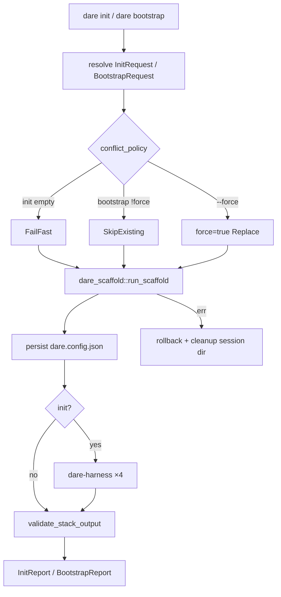

# BLUEPRINT: Init e bootstrap greenfield (Microplano 047)

> **Gerado a partir de:** `DARE/DESIGN-047-init-e-bootstrap.md` v1.0  
> **Data:** 2026-07-26 | **Status:** APPROVED (tasks geradas via `/dare-tasks`)  
> **Arquivo:** `DARE/BLUEPRINT-047-init-e-bootstrap.md`  
> **Pré-requisitos:** **011–014** harness · **015** release · **019** discover install · **022** update · **046** `dare-scaffold` / DEC-047 · Mestre §36  
> **Escopo:** CLI **`dare init`** + **`dare bootstrap`** · resolve flags · unlock `frontend` + `ConflictPolicy` em scaffold · harnesses ×4 · golden trees · docs **DEC-048**.  
> **Não:** hooks (**048**) · install deps de rede · stacks fora das 11 · Fase Docker do produto CLI · `dare new`.

---

## 0. TRADE-OFFS (Architect)

> `DARE/PATTERNS.md` / `patterns-facts.json` ausentes — trade-offs ancorados em código 🟢 (`dare-scaffold` plan/apply/rollback, `dare-harness::*install*`, `dare-project::install`, `clap` Commands, DEC-005 exit codes, Mestre §36).

| # | Trade-off | Escolha | Justificativa |
|---|-----------|---------|---------------|
| T-01 | Fronteira lib/CLI | Domínio em `dare-scaffold` (+ thin helpers); `commands/init.rs` / `bootstrap.rs` orquestram | RNF-07; espelha discover |
| T-02 | Prompts interativos | Crate **`dialoguer = "=0.11.0"`** (workspace pin) | Sem dep hoje; Classe B vs inquirer TS |
| T-03 | Bootstrap sem `--force` | **`ConflictPolicy::SkipExisting`** — presentes → `Skip`; em falta → `Create` | RF-16/20 idempotência |
| T-04 | Init em dir vazio | **`ConflictPolicy::FailFast`** (default 046) | Greenfield limpo |
| T-05 | Init dir já existe | Sem `--force` → InvalidInput `target directory already exists: {name}`; com `--force` → `force=true` | RF-03 |
| T-06 | `--stack` vs `--mcp` | Mutual exclusive; ambos → Usage exit **2**; non-interactive exige exactamente um | RF-05/07 |
| T-07 | `--mcp` aliases | Tabela §0.2 (case-insensitive) | Fecha 🟡 Design |
| T-08 | `--transport` em backend | Se backend + `--transport` Some → InvalidInput `transport is only valid for mcp stacks` | RF-08 |
| T-09 | `--fullstack` | MUST: artefacts `frontend/**` via `assets/stacks/_frontend/{react,vue}/`; unlock `frontend` | RF-10/11 |
| T-10 | Harnesses no init | Sempre as **4** IDEs (claude, cursor, codex, antigravity) | Determinismo golden |
| T-11 | Bootstrap e harnesses | **Não** reinstala harnesses; só scaffold (+ toolchain) | Escopo mínimo |
| T-12 | Config | `schemaVersion`, `projectName`, `stack`, `toolchain`, opcional `frontend`/`transport` | Templates 046 |
| T-13 | `--check` | MUST (elevado de SHOULD): zero writes; `check=true` | Agentes CI |
| T-14 | DEC | **DEC-048** | DEC-047 = scaffold |
| T-15 | Docker fase template | Omitida para o CLI | Igual 046 |

### 0.1 Constantes

| Const | Valor |
|-------|-------|
| `INIT_REPORT_SCHEMA` | `1` |
| `BOOTSTRAP_REPORT_SCHEMA` | `1` |
| `PROJECT_NAME_RE` | `^[a-z][a-z0-9_-]{0,63}$` |
| `MSG_TARGET_EXISTS` | `"target directory already exists: {name}"` |
| `MSG_NEED_STACK_OR_MCP` | `"--non-interactive requires --stack or --mcp"` |
| `MSG_STACK_AND_MCP` | `"--stack and --mcp are mutually exclusive"` |
| `MSG_FULLSTACK_NEEDS_STACK` | `"--fullstack requires --stack"` |
| `MSG_TRANSPORT_BACKEND` | `"transport is only valid for mcp stacks"` |
| `MSG_MISSING_CONFIG` | `"dare.config.json not found"` |
| `MSG_MISSING_STACK_FIELD` | `"dare.config.json missing stack"` |
| `CLI_ALIAS_RAILS` | `rails` → `ruby-rails-8` |
| `HARNESS_IDS` | `antigravity`, `claude`, `codex`, `cursor` (ASC) |
| `FRONTEND_ROOT` | `frontend/` |

### 0.2 Mapa `--mcp` → stack id (case-insensitive)

| Input | Stack id |
|-------|----------|
| `ts`, `node`, `typescript`, `mcp-node-ts` | `mcp-node-ts` |
| `python`, `py`, `mcp-python` | `mcp-python` |
| `rust`, `mcp-rust` | `mcp-rust` |
| `go`, `mcp-go` | `mcp-go` |
| outro | InvalidInput `unknown mcp language: {input}` |

### 0.3 Mapa `--fullstack` → `FrontendKind`

| Input | Enum |
|-------|------|
| `react` | `FrontendKind::React` |
| `vue` | `FrontendKind::Vue` |
| outro | InvalidInput `unknown frontend: {input}` |

### 0.4 ConflictPolicy (novo em `dare-scaffold`)

```rust
#[derive(Debug, Clone, Copy, PartialEq, Eq, Default)]
pub enum ConflictPolicy {
    #[default]
    FailFast,
    SkipExisting,
}
```

`ScaffoldRequest` **MUST** incluir `pub conflict_policy: ConflictPolicy` (default `FailFast`).  
`force=true` → Replace (inalterado).  
`frontend: Some(React|Vue)` **MUST** ser aceite (remover `frontend composition reserved for 047`).

### 0.5 Artefactos frontend mínimos

Embed: `assets/stacks/_frontend/react/` e `vue/`. Destinos:

| Destino | Conteúdo mínimo |
|---------|-----------------|
| `frontend/package.json` | name `{{project_name}}-web`, private true |
| `frontend/src/main.tsx` (react) / `frontend/src/main.ts` (vue) | stub |
| `frontend/README.md` | companion line + `{{stack_id}}` |

Kind: `PlanItemKind::Template`. Secret scan aplica-se.

### 0.6 `dare.config.json` greenfield

```json
{
  "schemaVersion": 1,
  "projectName": "demo-app",
  "stack": "rust-axum",
  "toolchain": "none",
  "frontend": "react",
  "transport": "stdio"
}
```

| Campo | Obrigatório | Notas |
|-------|-------------|-------|
| `schemaVersion` | sim | `1` |
| `projectName` | sim | nome init |
| `stack` | sim | um dos 11 |
| `toolchain` | sim | `none` \| `docker` |
| `frontend` | não | omitir se None |
| `transport` | não | só MCP |
| `ide` | não | **omitir** no init v1 |

---

## 1. VISÃO GERAL DA ARQUITETURA



| Decisão | Escolha | Justificativa |
|---------|---------|---------------|
| Onde vive a lógica | CLI commands + diffs mínimos em scaffold | Evita crate nova |
| Idempotência | `SkipExisting` | RF-20 |
| Fullstack | Assets `_frontend` | MUST sem stub vazio |
| Harness | Sempre 4 no init | Golden estável |

---

## 2. STACK TÉCNICA DEFINIDA

| Camada | Tecnologia | Versão | Papel |
|--------|-----------|--------|-------|
| Linguagem | Rust | `1.85.0` | MSRV |
| CLI | `clap` | `=4.5.40` | Commands |
| Prompts | `dialoguer` | `=0.11.0` | Init interativo |
| Scaffold | `dare-scaffold` | workspace | plan/apply |
| Harness | `dare-harness` | workspace | install×4 |
| Config | `dare-contracts` | workspace | JSON |
| Core | `dare-core` | workspace | jail / erros |
| Assets | `dare-assets` | workspace | embed |
| Testes | `tempfile` | workspace | FS |

---

## 3. ESTRUTURA DE PASTAS E ARQUIVOS

```text
Cargo.toml                                    # MOD: dialoguer pin
crates/dare-cli/src/main.rs                   # MOD: Init, Bootstrap
crates/dare-cli/src/commands/mod.rs           # MOD
crates/dare-cli/src/commands/init.rs          # NOVO
crates/dare-cli/src/commands/bootstrap.rs     # NOVO
crates/dare-scaffold/src/types.rs             # MOD: ConflictPolicy
crates/dare-scaffold/src/plan.rs              # MOD: Skip + frontend
assets/stacks/_frontend/react/**              # NOVO
assets/stacks/_frontend/vue/**                # NOVO
assets/capability-matrix.yml                  # MOD
docs/compatibility/cli-init-bootstrap.md      # NOVO
docs/compatibility/scaffold-contracts.md      # MOD pointer
docs/DECISION-LOG.md                          # MOD DEC-048
…/000A-MATRIZ-DE-STATUS.md                    # MOD 047
crates/dare-cli/tests/init_bootstrap_cli.rs   # NOVO
crates/dare-scaffold/tests/frontend_compose.rs
crates/dare-scaffold/tests/conflict_skip.rs
fixtures/golden/init/*.paths.txt              # ≥3 MUST; 11 closeout
```

---

## 4. MODELO DE DADOS / REPORTS

### InitReport (schemaVersion 1, camelCase)

```json
{
  "schemaVersion": 1,
  "mode": "init",
  "projectRoot": "/abs",
  "projectName": "demo-app",
  "stackId": "rust-axum",
  "frontend": null,
  "toolchain": "none",
  "transport": null,
  "created": ["Cargo.toml", "dare.config.json", "llms.txt"],
  "replaced": [],
  "skipped": [],
  "harnessesInstalled": ["antigravity", "claude", "codex", "cursor"],
  "rolledBack": false,
  "check": false
}
```

Listas **ASC**. `harnessesInstalled` vazio se `check=true`.

### BootstrapReport (schemaVersion 1)

```json
{
  "schemaVersion": 1,
  "mode": "bootstrap",
  "projectRoot": "/abs",
  "stackId": "rust-axum",
  "toolchain": "docker",
  "created": [],
  "replaced": ["dare.config.json"],
  "skipped": ["llms.txt", "README.md"],
  "rolledBack": false,
  "check": false
}
```

### Requests internos

```rust
pub struct InitRequest {
    pub project_name: String,
    pub stack_id: String,
    pub toolchain: Toolchain,
    pub transport: Option<Transport>,
    pub frontend: Option<FrontendKind>,
    pub force: bool,
    pub check: bool,
    pub non_interactive: bool,
}

pub struct BootstrapRequest {
    pub toolchain_override: Option<Toolchain>,
    pub force: bool,
    pub check: bool,
}
```

---

## 5. CONTRATOS DE API (CLI + domínio)

### 5.1 `dare init`

```text
dare init [NAME]
  [--stack <ID>] [--mcp <LANG>] [--fullstack <react|vue>]
  [--transport <stdio|http|sse>] [--toolchain <none|docker>]
  [--non-interactive] [--force] [--check]
  [-d|--dir <PATH>]   # parent; default cwd; target = {dir}/{NAME}
  [--json] [--no-color]
```

**Pré-condições `run_init`:**

1. Resolver nome (arg ou prompt); validar `PROJECT_NAME_RE`.
2. Stack: `--stack` (alias `rails`) **xor** `--mcp`; interativo: Select 11 ids ASC.
3. `--fullstack` sem backend → InvalidInput `MSG_FULLSTACK_NEEDS_STACK`.
4. `--fullstack` + MCP → InvalidInput `fullstack is only valid with backend stacks`.
5. Transport: só MCP; backend+transport → `MSG_TRANSPORT_BACKEND`.
6. `!force` && target exists → `MSG_TARGET_EXISTS`.
7. `check=true` → **não** cria dir; report com `projectRoot` proposto; `created=[]`; zero writes.

**Side effects (`!check`) ordem:**

1. `create_dir_all(target)` (`created_root=true`)
2. `ProjectRoot::new(target)`
3. `run_scaffold` (FailFast / force)
4. atomic write `dare.config.json` (§0.6)
5. install claude + cursor + codex + antigravity (`force=init.force`)
6. `validate_stack_output` → must `ok`

**Rollback:** Err após passo 1 → rollback scaffold se houver; se `created_root` → `remove_dir_all(target)` best-effort; exit ≠ 0.

### 5.2 `dare bootstrap`

```text
dare bootstrap [--force] [--toolchain <none|docker>] [--check] [-d|--dir <PATH>] [--json]
```

1. `ProjectRoot` em `-d`/cwd.
2. Load config; missing → NotFound 3 `MSG_MISSING_CONFIG`.
3. `stack` obrigatório; senão InvalidInput `MSG_MISSING_STACK_FIELD`.
4. `toolchain` = flag else config else `none`.
5. `conflict_policy = SkipExisting` se `!force`; se `force` → `force=true` Replace.
6. Não reinstala harnesses.
7. Se toolchain override: persistir no config (preserve extras).

### 5.3 Assinaturas

```rust
pub fn run_init(parent: &Path, req: &InitRequest) -> CoreResult<InitReport>;
pub fn run_bootstrap(root: &ProjectRoot, req: &BootstrapRequest) -> CoreResult<BootstrapReport>;
```

### 5.4 Exit codes

| Code | Quando |
|------|--------|
| 0 | Ok |
| 1 | Internal / rollback grave |
| 2 | Usage (flags / non-interactive incompleto) |
| 3 | NotFound |
| 4 | InvalidInput |
| 5 | Io |

### 5.5 Edge cases

| Caso | Resultado |
|------|-----------|
| `--non-interactive` sem name | Usage 2 |
| `--non-interactive` sem stack/mcp | Usage 2 |
| `--stack` + `--mcp` | Usage 2 |
| `--stack rails` | `ruby-rails-8` |
| `--mcp java` | InvalidInput |
| `--fullstack` + `--mcp` | InvalidInput |
| backend + `--transport` | InvalidInput |
| target exists `!force` | InvalidInput |
| `init --check` | zero writes |
| Ctrl+C no prompt | exit ≠0; sem órfão |
| scaffold mid-fail | rollback + remove target |
| bootstrap sem config | NotFound 3 |
| bootstrap ×2 `!force` | `created=[]` |
| bootstrap `--force` | replaced⊇ |

**Exemplos:**

```bash
dare init demo-app --stack rust-axum --non-interactive --json
dare init mcp-svc --mcp ts --transport stdio --non-interactive
dare init shop --stack node-nestjs --fullstack react --non-interactive
cd demo-app && dare bootstrap && dare bootstrap
dare bootstrap --force --toolchain docker
```

---

## 6. PLANO DE EXECUÇÃO (FASES)

### Fase A — Clap + resolve flags
**DONE:** help com init/bootstrap; mutual exclusion; rails; mcp map; unit resolve sem FS.  
Entregáveis: `main.rs`, `resolve_*` em init/bootstrap.

### Fase B — ConflictPolicy + frontend unlock
**DONE:** SkipExisting; plan `frontend/**`; sem rejeição 047; testes + manifest.  
Entregáveis: scaffold types/plan + `_frontend` assets.

### Fase C — `run_init` + rollback
**DONE:** pipeline completo; `--check` zero-write; falha remove target.  
Entregáveis: `init.rs`.

### Fase D — Interactive dialoguer
**DONE:** prompts TTY; non-TTY sem flag → InvalidInput `interactive mode requires a TTY (use --non-interactive)`.  
Entregáveis: prompt helpers.

### Fase E — `run_bootstrap` + idempotência
**DONE:** SkipExisting; force; toolchain persist.  
Entregáveis: `bootstrap.rs`.

### Fase F — Golden + CLI tests
**DONE:** ≥3 stacks CI; path lists; help/json schema.  
Entregáveis: fixtures + `init_bootstrap_cli.rs`.

### Fase G — Docs + DEC-048 + Ralph
**DONE:** `cli-init-bootstrap.md`; DEC-048; matriz; capabilities; audit.  
Entregáveis: docs + DECISION-LOG + matrix.

| Gate | Comando |
|------|---------|
| Build | `cargo build -p dare-cli` |
| Test | `cargo test -p dare-cli -p dare-scaffold` |
| Lint | `cargo clippy -p dare-cli -p dare-scaffold --all-targets -- -D warnings` |
| Audit (G) | `cargo audit` |

---

## 7. VALIDATION GATES POR STACK

| Stack | Build | Test | Lint/Audit |
|-------|-------|------|------------|
| Rust CLI | `cargo build -p dare-cli` | `cargo test -p dare-cli -p dare-scaffold` | clippy `-D warnings` + `cargo audit` |

Stacks alvo greenfield: só asserts de ficheiros (não compilam no Ralph do CLI).

---

## 8. CONTROLES DE SEGURANÇA (RS → fase)

| RS | Controlo | Fase |
|----|----------|------|
| RS-01 | Validação entradas | A, C, E |
| RS-02 | Sem secrets / redact | B, C |
| RS-03 | Path jail | C, E |
| RS-04 | cargo audit | G |
| RS-05 | Fixtures limpos | F, G |
| RS-06 | Secret scan + frontend | B |
| RS-07 | Rollback + delete root | C |
| RS-08 | Harness FS APIs | C |
| RS-09 | Non-interactive sem stdin | A, D |

---

## 9. ESTRATÉGIA DE TESTES

| Tipo | Cobertura |
|------|-----------|
| Unit | resolve, maps, ConflictPolicy |
| Integration | init, fullstack, rollback, bootstrap ×2 |
| Golden | ≥3 path lists (11 closeout) |
| CLI | help, `--json` schemaVersion |
| Segurança | needle secret; path escape |
| Audit | closeout |

---

## 10. ESTRATÉGIA DE DEPLOY

| Ambiente | Trigger | Artefacto |
|----------|---------|-----------|
| Local | `cargo run -p dare-cli -- init …` | debug bin |
| CI | PR/main | test+clippy |
| Release | pipeline 015 | bins multi-target (sem mudança de canal) |

---

## 11. CHECKLIST DE APROVAÇÃO

- [ ] T-03 SkipExisting e T-09 fullstack MUST aceites
- [ ] Contratos CLI + edge cases revisados
- [ ] Assinaturas `run_init` / `run_bootstrap` claras
- [ ] Exit codes DEC-005
- [ ] DEC-048 confirmado
- [ ] Fora de escopo alinhado
- [ ] Aprovar para `/dare-tasks`

---

## 12. DIFFS VS TS 3.18.1 (proposta DEC-048)

| Área | Classe | Nota |
|------|--------|------|
| inquirer → dialoguer | B | Flags estáveis |
| Exit codes | B | Tabela Rust |
| Bootstrap SkipExisting | B/C | Documentar se TS diverge |
| Init 4 harnesses | B | vs detect-only |
| Paths `frontend/` | C | Congelado |
| `--check` | C | Extensão agentes |

---

## Anti-stub self-check

- [x] Flags com erros concretos  
- [x] ConflictPolicy + frontend especificados  
- [x] Reports JSON tipados  
- [x] Edge cases tabelados  
- [x] Side effects + rollback ordenados  
