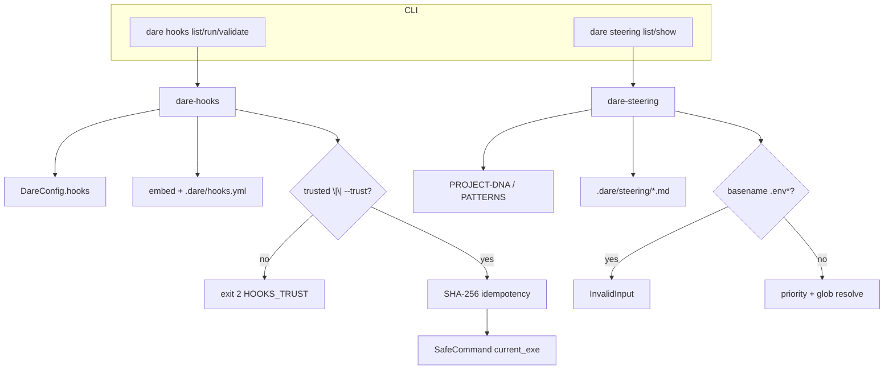

# BLUEPRINT: Hooks e steering (Microplano 048)

> **Gerado a partir de:** `DARE/DESIGN-048-hooks-e-steering.md` v1.0  
> **Data:** 2026-07-26 | **Status:** APPROVED (tasks geradas via `/dare-tasks`)  
> **Arquivo:** `DARE/BLUEPRINT-048-hooks-e-steering.md`  
> **Pré-requisitos:** **005** path safety · **006** process safety · **019** discover install · Mestre §37 Ciclo 19 · baseline TS `@dewtech/dare-cli@3.18.1`  
> **Escopo:** crates **`dare-hooks`** + **`dare-steering`** · CLI **`dare hooks`** / **`dare steering`** · eventos fechados · allowlist · trust gate · idempotência SHA-256 · frontmatter scope/glob/priority · exclusão `.env*` · docs + **DEC-049**.  
> **Não:** verificação avançada / bench (**049**) · dashboard/MCP `GET /steering` (**051/052**) · hooks nativos Cursor IDE · shell arbitrário · deps `dare-agent` / GraphRAG / scaffold · Fase Docker do produto CLI.

---

## 0. TRADE-OFFS (Architect)

> `DARE/PATTERNS.md` / `patterns-facts.json` ausentes no repo CLI — trade-offs ancorados em código 🟢 (`SafeCommand`/`ProjectRoot`/`SafeRelativePath`, `ErrorKind::Usage→2`, `dare-contracts::DareConfig.hooks`, `sha2`, `serde_yaml`, skills `dare-hooks`/`dare-steering`, Mestre §37, DESIGN-048).

| # | Trade-off | Escolha | Justificativa |
|---|-----------|---------|---------------|
| T-01 | Fronteira lib/CLI | Duas crates de domínio; CLI thin em `commands/hooks.rs` + `steering.rs` | RF-01/12; RNF-05; espelha `dare-guard` |
| T-02 | Eventos | Enum fechado **4**: `on-save`, `on-file-create`, `on-task-complete`, `pre-commit` | Mestre §37; RF-02; desconhecido → exit **2** |
| T-03 | Allowlist ações | Enum fechado **5** + spawn só via `current_exe` (§0.3) | Mestre + RS-09; sem shell concat (006) |
| T-04 | SoT defs hooks | **Embed** `assets/hooks/default-hooks.yml` + overlay opcional `.dare/hooks.yml` | RF-24; overlay só ações allowlisted |
| T-05 | Untrusted `run` | **Exit 2** + mensagem contendo `HOOKS_TRUST`; zero spawn | Fecha 🟡 Design; RF-06/20 |
| T-06 | `hooks.enabled: false` | `list`/`validate` ok; `run` → exit **2** + `HOOKS_DISABLED` | RF-05 |
| T-07 | Idempotência | SHA-256 hex do digest canónico; marker `.dare/hooks-idempotency/{hash}.ok` | RF-10/25; path jail |
| T-08 | Cache bound | Cap **512** markers; prune por mtime ASC ao exceder | R-04 Design |
| T-09 | Frontmatter | Bloco `---` YAML via `serde_yaml` (já no workspace) | Sem crate nova de matter |
| T-10 | Glob | Workspace pin **`globset = "=0.4.16"`** | Posix-rel; RNF-03 |
| T-11 | Steering bases | Sempre tentar `DARE/PROJECT-DNA.md` + `DARE/PATTERNS.md` (se existirem) + `.dare/steering/*.md` | RF-13; skill `dare-steering` |
| T-12 | `.env*` | Deny por **basename** antes de read (`\.env` ou `.env.*`) | RS-07; R-05 |
| T-13 | Trust fontes | `hooks.trusted == true` **OU** CLI `--trust` | RF-06; RS-05 |
| T-14 | DEC | **DEC-049** (DEC-048 = init/bootstrap) | Design |
| T-15 | Docker fase template | Omitida (CLI) | Igual 046/047 |
| T-16 | `lint`/`test` spawn | Mapear para `current_exe` subcomandos seguros (§0.3); Classe **B** vs runners TS genéricos | Evita shell; auditável |
| T-17 | Capabilities | `dare-hooks.cli_commands: ["hooks"]`; `dare-steering.cli_commands: ["steering"]` | RF-21 |

### 0.1 Constantes

| Const | Valor |
|-------|-------|
| `HOOKS_LIST_SCHEMA` | `1` |
| `HOOKS_RUN_SCHEMA` | `1` |
| `HOOKS_VALIDATE_SCHEMA` | `1` |
| `STEERING_LIST_SCHEMA` | `1` |
| `STEERING_SHOW_SCHEMA` | `1` |
| `DEFAULT_HOOKS_EMBED` | `assets/hooks/default-hooks.yml` |
| `HOOKS_OVERLAY_REL` | `.dare/hooks.yml` |
| `IDEMPOTENCY_DIR_REL` | `.dare/hooks-idempotency` |
| `IDEMPOTENCY_CAP` | `512` |
| `HOOK_TIMEOUT` | `120s` |
| `STREAM_LIMIT` | `dare_core::DEFAULT_STREAM_LIMIT` |
| `STEERING_DIR_REL` | `.dare/steering` |
| `PROJECT_DNA_REL` | `DARE/PROJECT-DNA.md` |
| `PATTERNS_REL` | `DARE/PATTERNS.md` |
| `MSG_HOOKS_TRUST` | `"hooks run requires trust (pass --trust or set hooks.trusted: true) [HOOKS_TRUST]"` |
| `MSG_HOOKS_DISABLED` | `"hooks are disabled (hooks.enabled: false) [HOOKS_DISABLED]"` |
| `MSG_UNKNOWN_EVENT` | `"unknown hook event: {event}"` |
| `MSG_UNKNOWN_ACTION` | `"unknown hook action: {action}"` |
| `MSG_ENV_EXCLUDED` | `"steering target excluded: .env* paths are not eligible"` |
| `MSG_PATH_ESCAPE` | `"path escapes project root"` |
| `PRIORITY_DEFAULT` | `100` |

### 0.2 Eventos fechados (`HookEvent`)

| Variante | CLI string | Uso típico |
|----------|------------|------------|
| `OnSave` | `on-save` | PostToolUse / save |
| `OnFileCreate` | `on-file-create` | ficheiro novo |
| `OnTaskComplete` | `on-task-complete` | task DONE |
| `PreCommit` | `pre-commit` | git hook |

Parse: case-sensitive exact match às strings acima. Outro → `CoreError::usage(MSG_UNKNOWN_EVENT)` → exit **2**.

### 0.3 Allowlist de ações (`HookAction`) + spawn

| Variante | CLI / YAML id | `SafeCommand` (argv-only) |
|----------|---------------|---------------------------|
| `DareValidate` | `dare-validate` | `current_exe` + `["validate"]` |
| `DareReview` | `dare-review` | `current_exe` + `["review"]` |
| `GraphRegister` | `graph-register` | `current_exe` + `["graph", "ingest"]` |
| `Lint` | `lint` | `current_exe` + `["guard"]` *(Classe B: gate estático no lugar de linter de stack)* |
| `Test` | `test` | `current_exe` + `["info"]` *(Classe B: smoke binário; sem test harness de projeto)* |

- Program **sempre** o path do binário em execução (`std::env::current_exe`), nunca string `"dare"` do PATH (evita hijack).
- `cwd` = `ProjectRoot` + `SafeRelativePath::new(".")`.
- `timeout` = `HOOK_TIMEOUT`; stdout/stderr truncados; **nunca** logar env secrets.
- Ação fora da tabela → `CoreError::invalid_input(MSG_UNKNOWN_ACTION)` → exit **4** em validate; em defs inválidas no overlay → validate fail.

### 0.4 Schema embed / overlay `hooks.yml`

```yaml
schemaVersion: 1
hooks:
  - event: on-save
    actions: [dare-validate]
  - event: on-file-create
    actions: [dare-validate]
  - event: on-task-complete
    actions: [dare-review, graph-register]
  - event: pre-commit
    actions: [dare-validate, lint]
```

Regras:

1. `schemaVersion` MUST ser `1`.
2. Cada `event` MUST ser um dos 4.
3. Cada action MUST estar na allowlist.
4. Overlay `.dare/hooks.yml`: se presente e parseável, **substitui** a lista de hooks do embed (não merge profundo por evento — replace total do array `hooks`).
5. Overlay malformado → `validate`/`run` → InvalidInput/Config exit **4** com mensagem en-US.
6. Embed é fallback quando overlay ausente.

### 0.5 Config `dare.config.json` → hooks

Ler via `dare-config` / `DareConfig.hooks: Option<ConfigObject>`:

| Campo (em `hooks` / `extra`) | Tipo | Default |
|------------------------------|------|---------|
| `enabled` | bool | `true` se omitido |
| `trusted` | bool | **`false`** se omitido |

Helpers na crate `dare-hooks`:

```rust
pub fn hooks_enabled(cfg: &DareConfig) -> bool;
pub fn hooks_trusted(cfg: &DareConfig) -> bool;
```

`trusted` lido de `hooks.enabled` sibling: `cfg.hooks.as_ref().and_then(|h| h.extra.get("trusted").and_then(|v| v.as_bool())).unwrap_or(false)`.

### 0.6 Digest de idempotência

Canonical JSON (chaves ASC, sem whitespace extra via `dare_core::to_canonical_json_string` se existir; senão serialize estável documentada):

```json
{
  "action": "dare-validate",
  "event": "on-save",
  "file": "src/main.rs",
  "schemaVersion": 1,
  "task": null
}
```

| Campo | Regra |
|-------|-------|
| `schemaVersion` | `1` |
| `event` | string canónica |
| `action` | string canónica |
| `file` | rel posix (`/`) ou `null` |
| `task` | string ou `null` |

`hash = hex_lower(SHA-256(utf8_bytes))`.  
Marker: `{IDEMPOTENCY_DIR_REL}/{hash}.ok` (conteúdo: `"ok\n"` ou vazio).  
Se marker existe → skip spawn; `status: "skipped"`, `reason: "idempotent"`.  
Após spawn exit 0 → criar marker (atomic write). Spawn ≠0 → **não** criar marker.

Prune: se count markers > 512, apagar os mais antigos (mtime) até ≤ 512 **antes** de criar novo.

### 0.7 Frontmatter steering

```yaml
---
scope: glob
glob: "crates/**/*.rs"
priority: 10
---
Corpo markdown...
```

| Campo | Tipo | Default | Validação |
|-------|------|---------|-----------|
| `scope` | `project` \| `glob` | `project` | outro → ficheiro ignorado + warning (não fatal em list) |
| `glob` | string | omitido | obrigatório se `scope=glob`; globset compile fail → ignore + warning |
| `priority` | i32 | `100` | menor = mais prioritário |

Ficheiros base DNA/PATTERNS: tratados como `scope: project`, `priority: 0` (DNA) e `1` (PATTERNS), sem frontmatter obrigatório.

### 0.8 Resolução `steering show <file>`

1. Validar target: `SafeRelativePath`; basename não elegível `.env` / `.env.*` → InvalidInput `MSG_ENV_EXCLUDED` exit **4**.
2. Carregar candidatos: DNA (se existe) → PATTERNS (se existe) → todos `*.md` em `.dare/steering/` (não recursivo).
3. Filtrar aplicáveis:
   - `scope=project` → sempre aplicável
   - `scope=glob` → `globset` match no path rel posix do target
4. Ordenar: `priority ASC`, tie-break `path ASC` (posix).
5. Report: lista de blocos `{ path, scope, glob, priority, body }` na ordem.

---

## 1. VISÃO GERAL DA ARQUITETURA



| Decisão | Escolha | Justificativa |
|---------|---------|---------------|
| Duas crates | Isolamento e testes sem CLI | RF-01/12 |
| Trust default false | RS-05 | Sem execução acidental |
| Spawn = current_exe | RS-08/09 | Sem PATH hijack / shell |
| Steering read-only | Escopo | Sem `steering write` |

---

## 2. STACK TÉCNICA DEFINIDA

| Camada | Tecnologia | Versão | Papel |
|--------|-----------|--------|-------|
| Linguagem | Rust | `1.85.0` | MSRV |
| CLI | `clap` | `=4.5.40` | Commands |
| Core | `dare-core` | workspace | jail, SafeCommand, erros |
| Config | `dare-config` / `dare-contracts` | workspace | `hooks.*` |
| Hash | `sha2` | `=0.10.9` | idempotência |
| YAML | `serde_yaml` (`yaml_serde`) | `=0.10.4` | hooks.yml + frontmatter |
| Glob | `globset` | `=0.4.16` | steering globs |
| Serde | `serde` / `serde_json` | workspace | reports |
| Testes | `tempfile`, `assert_cmd` | workspace | unit + CLI smoke |

---

## 3. ESTRUTURA DE PASTAS E ARQUIVOS

```text
Cargo.toml                                         # MOD: members + globset + dare-hooks/steering paths
crates/dare-hooks/
  Cargo.toml                                       # NOVO
  src/lib.rs                                       # NOVO
  src/event.rs                                     # NOVO HookEvent
  src/action.rs                                    # NOVO HookAction + argv
  src/defs.rs                                      # NOVO load embed/overlay
  src/config.rs                                    # NOVO enabled/trusted helpers
  src/idempotency.rs                               # NOVO digest + markers + prune
  src/run.rs                                       # NOVO list/run/validate domain
  src/report.rs                                    # NOVO report structs
  tests/*.rs                                       # NOVO
crates/dare-steering/
  Cargo.toml                                       # NOVO
  src/lib.rs                                       # NOVO
  src/frontmatter.rs                               # NOVO
  src/resolve.rs                                   # NOVO list/show
  src/env_deny.rs                                  # NOVO .env* basename
  src/report.rs                                    # NOVO
  tests/*.rs                                       # NOVO
crates/dare-cli/src/main.rs                        # MOD: Hooks, Steering
crates/dare-cli/src/commands/mod.rs                # MOD
crates/dare-cli/src/commands/hooks.rs              # NOVO
crates/dare-cli/src/commands/steering.rs           # NOVO
crates/dare-cli/Cargo.toml                         # MOD: deps
assets/hooks/default-hooks.yml                     # NOVO embed SoT
assets/capability-matrix.yml                       # MOD cli_commands
docs/compatibility/cli-hooks-steering.md           # NOVO
docs/DECISION-LOG.md                               # MOD DEC-049
…/000A-MATRIZ-DE-STATUS.md                         # MOD 048 Concluído
crates/dare-cli/tests/hooks_steering_cli.rs        # NOVO smokes
```

**Constraints:** sem `[build] target` global; crates **não** dependem de `dare-cli`.

---

## 4. MODELO DE DADOS / REPORTS

### 4.1 HooksListReport (`schemaVersion: 1`, camelCase)

```json
{
  "schemaVersion": 1,
  "projectRoot": "/abs",
  "trusted": false,
  "enabled": true,
  "source": "embed",
  "hooks": [
    { "event": "on-save", "actions": ["dare-validate"] },
    { "event": "on-file-create", "actions": ["dare-validate"] },
    { "event": "on-task-complete", "actions": ["dare-review", "graph-register"] },
    { "event": "pre-commit", "actions": ["dare-validate", "lint"] }
  ]
}
```

`hooks` ordenados por `event` ASC; `actions` na ordem da def.  
`source`: `"embed"` \| `"overlay"`.

### 4.2 HooksRunReport

```json
{
  "schemaVersion": 1,
  "event": "on-save",
  "file": "src/lib.rs",
  "task": null,
  "trusted": true,
  "results": [
    {
      "action": "dare-validate",
      "status": "ok",
      "exitCode": 0,
      "skipped": false,
      "reason": null,
      "idempotencyKey": "a1b2…",
      "stdoutTruncated": false,
      "stderrTruncated": false
    }
  ]
}
```

`status`: `"ok"` \| `"failed"` \| `"skipped"`.  
`results` na ordem das actions da def do evento.

### 4.3 HooksValidateReport

```json
{
  "schemaVersion": 1,
  "ok": true,
  "source": "embed",
  "errors": [],
  "warnings": []
}
```

Zero writes. `ok=false` → processo exit **4** (InvalidInput/Config).

### 4.4 SteeringListReport

```json
{
  "schemaVersion": 1,
  "files": [
    { "path": "DARE/PROJECT-DNA.md", "scope": "project", "glob": null, "priority": 0 },
    { "path": "DARE/PATTERNS.md", "scope": "project", "glob": null, "priority": 1 },
    { "path": ".dare/steering/rust.md", "scope": "glob", "glob": "crates/**/*.rs", "priority": 10 }
  ]
}
```

Ordem: priority ASC, path ASC.

### 4.5 SteeringShowReport

```json
{
  "schemaVersion": 1,
  "target": "crates/dare-core/src/lib.rs",
  "blocks": [
    {
      "path": "DARE/PROJECT-DNA.md",
      "scope": "project",
      "glob": null,
      "priority": 0,
      "body": "…"
    }
  ]
}
```

---

## 5. CONTRATOS DE API (CLI + domínio)

### 5.1 Superfície CLI

```text
dare hooks list [--json] [-d|--dir <PATH>]
dare hooks run <EVENT> [--file <REL>] [--task <ID>] [--trust] [--json] [-d|--dir <PATH>]
dare hooks validate [--json] [-d|--dir <PATH>]

dare steering list [--json] [-d|--dir <PATH>]
dare steering show <FILE> [--json] [-d|--dir <PATH>]
```

### 5.2 Assinaturas de domínio

```rust
// dare-hooks
pub fn list_hooks(root: &ProjectRoot, cfg: &DareConfig) -> CoreResult<HooksListReport>;

pub fn validate_hooks(root: &ProjectRoot, cfg: &DareConfig) -> CoreResult<HooksValidateReport>;

pub struct RunHooksRequest<'a> {
    pub event: HookEvent,
    pub file: Option<&'a str>,   // relative, posix-normalized after jail
    pub task: Option<&'a str>,
    pub trust_flag: bool,        // --trust
}

pub fn run_hooks(
    root: &ProjectRoot,
    cfg: &DareConfig,
    req: &RunHooksRequest<'_>,
    runner: &dyn ProcessRunner,
) -> CoreResult<HooksRunReport>;

// dare-steering
pub fn list_steering(root: &ProjectRoot) -> CoreResult<SteeringListReport>;

pub fn show_steering(root: &ProjectRoot, target_rel: &str) -> CoreResult<SteeringShowReport>;
```

### 5.3 Pré / pós-condições `run_hooks`

**Pré:**

1. `hooks_enabled(cfg)` senão `CoreError::usage(MSG_HOOKS_DISABLED)` → exit **2**.
2. `hooks_trusted(cfg) || req.trust_flag` senão `CoreError::usage(MSG_HOOKS_TRUST)` → exit **2**.
3. Evento já parseado (CLI faz parse; lib recebe enum).
4. Se `file` Some: `SafeRelativePath::new` ok; senão InvalidInput.
5. Defs carregadas (embed/overlay) ok.

**Pós (sucesso):**

1. Para cada action do evento: check idempotency → skip ou spawn → update marker se ok.
2. Report preenchido; se **qualquer** action `failed` → `CoreError::internal` ou retornar report + CLI exit **1**?  

**Política de falha de action (congelada):**  
`run_hooks` retorna `Ok(report)` sempre que trust/defs ok; CLI mapeia: se algum `status=="failed"` → exit **1**; se todos ok/skipped → **0**.  
Isto evita confundir falha de subprocesso com InvalidInput. Documentar no DEC.

### 5.4 Exit codes

| Code | Quando |
|------|--------|
| 0 | Ok (list/validate ok; run todas ok/skipped; steering ok) |
| 1 | Internal / action spawn failed |
| **2** | Usage: unknown event, HOOKS_TRUST, HOOKS_DISABLED, clap usage |
| 3 | NotFound (project root / ficheiro steering target ausente quando exigido) |
| 4 | InvalidInput / Config (overlay YAML, path escape, `.env*`, action desconhecida em validate) |
| 5 | Io |

`show` de ficheiro target que não existe: **NotFound 3** `"file not found: {rel}"` (após passar deny `.env*`).

### 5.5 Edge cases enumerados

| Caso | Resultado |
|------|-----------|
| `hooks run foo` | exit 2 `unknown hook event: foo` |
| `hooks run on-save` sem trust/config | exit 2 `HOOKS_TRUST`; zero spawn; zero marker |
| `hooks.trusted: true` sem `--trust` | executa |
| `--trust` com `trusted: false` | executa |
| `hooks.enabled: false` + run | exit 2 `HOOKS_DISABLED` |
| Re-run mesmo file/event/action | skip `idempotent` |
| Overlay com action `rm -rf` | validate/run InvalidInput unknown action |
| Overlay schemaVersion 2 | InvalidInput |
| `steering show .env` | exit 4 `MSG_ENV_EXCLUDED` (sem read) |
| `steering show .env.local` | exit 4 |
| `steering show ../etc/passwd` | exit 4 path escape |
| `steering show` ficheiro sem matches | `blocks: []` exit 0 |
| DNA ausente | list omite; show continua com restantes |
| Glob inválido no frontmatter | warning; ficheiro omitido de resolve |
| Windows path `crates\a.rs` | normalizar para `crates/a.rs` antes de glob/hash |

### 5.6 Exemplos concretos

```bash
# Trust gate
dare hooks run on-save --file src/x.rs
# stderr contains HOOKS_TRUST; exit 2

dare hooks run on-save --file src/x.rs --trust --json
# {"schemaVersion":1,"event":"on-save",...}

dare hooks validate --json
# {"schemaVersion":1,"ok":true,...}

dare steering list --json
dare steering show crates/dare-core/src/lib.rs --json
dare steering show .env
# exit 4
```

### 5.7 Side effects `run` (ordem)

1. Load config + defs (read-only).
2. Trust/enabled checks.
3. `create_dir_all` idempotency dir (jail).
4. Prune se > cap.
5. Por action: read marker → maybe spawn → maybe write marker.
6. Emit report (stdout human ou `--json`).

`list` / `validate` / `steering *`: **zero writes**.

---

## 6. PLANO DE EXECUÇÃO (FASES)

> Fase Docker omitida (CLI). Última fase = docs + auditoria deps.

### Fase A — Crate `dare-hooks` eventos + ações + defs
**DONE quando:** `HookEvent`/`HookAction` parse roundtrip; embed `default-hooks.yml`; load overlay; testes unit.  
Entregáveis: crate member, `event.rs`, `action.rs`, `defs.rs`, asset.

### Fase B — Trust/config + validate + idempotency
**DONE quando:** helpers enabled/trusted; `validate_hooks` zero-write; digest estável; prune cap; testes trust/idempotency.  
Entregáveis: `config.rs`, `idempotency.rs`, parte de `run.rs`.

### Fase C — `run_hooks` + SafeCommand
**DONE quando:** spawn current_exe; skip idempotent; report statuses; testes com `ProcessRunner` fake.  
Entregáveis: `run.rs` completo.

### Fase D — CLI `dare hooks`
**DONE quando:** clap subcommands; exit 2 trust/unknown event; smokes.  
Entregáveis: `commands/hooks.rs`, `main.rs`.

### Fase E — Crate `dare-steering`
**DONE quando:** frontmatter; globset; `.env*` deny; list/show; unit security.  
Entregáveis: crate `dare-steering`.

### Fase F — CLI `dare steering`
**DONE quando:** list/show + `--json`; path escape; `.env` exit 4.  
Entregáveis: `commands/steering.rs`.

### Fase G — Docs + DEC-049 + capabilities + Ralph
**DONE quando:** `cli-hooks-steering.md`; DEC-049; matriz 048; capabilities; audit limpo.  
Entregáveis: docs + matrix + Ralph gates.

| Gate | Comando |
|------|---------|
| Build | `cargo build -p dare-hooks -p dare-steering -p dare-cli` |
| Test | `cargo test -p dare-hooks -p dare-steering` + CLI smokes hooks/steering |
| Lint | `cargo clippy -p dare-hooks -p dare-steering -p dare-cli --all-targets -- -D warnings` |
| Audit (G) | `cargo audit` |

**Paralelismo lógico:** A→B→C→D e E→F em paralelo após workspace members; G após D+F.

---

## 7. VALIDATION GATES POR STACK

| Stack | Build | Test | Lint/Audit |
|-------|-------|------|------------|
| Rust CLI | `cargo build -p dare-hooks -p dare-steering -p dare-cli` | `cargo test -p dare-hooks -p dare-steering` + `cargo test -p dare-cli --test hooks_steering_cli` | clippy `-D warnings` + `cargo audit` |

---

## 8. CONTROLES DE SEGURANÇA (RS → fase)

| RS | Controlo | Fase |
|----|----------|------|
| RS-01 | Validar evento, ações, paths, globs, YAML | A, B, E |
| RS-02 | Sem dump `.env`; redact streams se necessário | C, E |
| RS-03 | `SafeRelativePath` / `ProjectRoot` em file + cache | B, C, E, F |
| RS-04 | `cargo audit` sem HIGH/CRITICAL novas | G |
| RS-05 | Trust default false; `--trust` explícito | B, D |
| RS-06 | Fixtures sem secrets | D, F, G |
| RS-07 | Basename `.env*` deny antes de read | E, F |
| RS-08 | Só `SafeCommand` argv-only | C |
| RS-09 | Allowlist fecha superfície | A, C |

---

## 9. ESTRATÉGIA DE TESTES

| Tipo | Cobertura |
|------|-----------|
| Unit hooks | parse event/action; overlay replace; digest estável; prune; trust helpers |
| Unit hooks run | fake `ProcessRunner`: ok / fail / skip idempotent |
| Unit steering | frontmatter; priority sort; glob match; `.env` / `.env.local` deny |
| CLI smoke | unknown event exit 2; untrusted exit 2; trusted run; validate; steering list/show; show `.env` exit 4 |
| Segurança | path `../`; `.env*`; action fora allowlist |
| Audit | closeout G |

Fixtures mínimas (MUST):

1. Untrusted bloqueia (`HOOKS_TRUST`).
2. `--trust` executa (runner fake ou binário).
3. `.env` excluído no steering.
4. Unknown event exit 2.

---

## 10. ESTRATÉGIA DE DEPLOY

| Ambiente | Trigger | Artefacto |
|----------|---------|-----------|
| Local | `cargo run -p dare-cli -- hooks …` | debug bin |
| CI | PR/main | test + clippy |
| Release | pipeline 015 | bins multi-target (sem mudança de canal) |

---

## 11. CHECKLIST DE APROVAÇÃO

- [ ] Eventos §0.2 e allowlist/spawn §0.3 aceites (incl. Classe B lint/test)
- [ ] Trust gate exit **2** + `HOOKS_TRUST` / `HOOKS_DISABLED` alinhados
- [ ] SoT embed + overlay replace aceite
- [ ] Idempotência + cap 512 aceites
- [ ] Exclusão `.env*` + path jail validados
- [ ] Schemas JSON reports (§4) suficientes para implementação sem inventar
- [ ] Duas crates + CLI aprovados
- [ ] Fora de escopo (049/051/052/Cursor) alinhado
- [ ] DEC id **049** confirmado
- [ ] Aprovar para `/dare-tasks` → `TASKS-048` + `dare-dag-048.yaml` + `EXECUTION-048/`

---

## 12. AUTO-VALIDAÇÃO ANTI-STUB

- [x] Cada comando CLI tem flags, exits e exemplos concretos
- [x] Funções públicas tipadas com pré/pós e erros
- [x] Edge cases enumerados (tabela §5.5)
- [x] Validações concretas (event strings, allowlist, basename `.env*`, schemaVersion 1)
- [x] Decisões com justificativa (§0)

---

## Próximas etapas

1. Revisar e aprovar este Blueprint (arquitetura, §0.2/0.3, trust exit 2, Classe B lint/test).
2. Quando aprovado, rodar `/dare-tasks` para gerar DAG + specs de execução.
3. **Não** gerar `TASKS` / `dare-dag` / `EXECUTION` neste passo.
