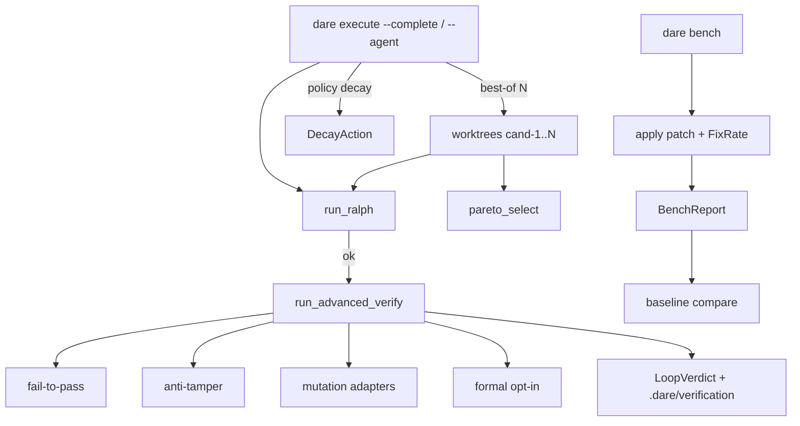

# BLUEPRINT: Verificação avançada e bench (Microplano 049)

> **Gerado a partir de:** `DARE/DESIGN-049-verificacao-avancada-e-bench.md` v1.0  
> **Data:** 2026-07-26 | **Status:** APPROVED (tasks geradas via `/dare-tasks`)  
> **Arquivo:** `DARE/BLUEPRINT-049-verificacao-avancada-e-bench.md`  
> **Pré-requisitos:** **029–030** Ralph/execute · **030–031** agent/worktrees · **033** refine/spliceSubDag · **034** guard · **005/006** path/process · Mestre §38 / §5.5 · baseline TS `@dewtech/dare-cli@3.18.1`  
> **Escopo:** estender **`dare-verify`** · fail-to-pass · anti-tamper · mutation adapters · formal opt-in · repair ≤5 · best-of-N + Pareto · decay policy · CLI **`dare bench`** · flags execute · docs + **DEC-050**.  
> **Não:** `dare ai` (**050**) · dashboard/MCP (**051/052**) · reescrever Ralph build/test/lint · Fase Docker do produto CLI · deps Cargo de Dafny/Stryker.

---

## 0. TRADE-OFFS (Architect)

> `DARE/PATTERNS.md` / `patterns-facts.json` ausentes no repo CLI — trade-offs ancorados em código 🟢 (`dare-verify` Ralph/GateAspect/VerificationReport, `dare-agent::failure_signature`/`WorktreeManager`, `SafeCommand`, execute clap, Mestre §5.5/§38, DESIGN-049, skill `dare-bench`).

| # | Trade-off | Escolha | Justificativa |
|---|-----------|---------|---------------|
| T-01 | Fronteira | Domínio em `dare-verify` (+ thin `commands/bench.rs`); decay/Pareto lib; CLI execute só orquestra | RNF-05; espelha 029 |
| T-02 | GateAspect Ralph | **Não** misturar enums: Ralph fica `Build\|Test\|Lint`; avançados = `AdvancedAspect` | Evita quebrar reports v1 |
| T-03 | Mutation limiar | **`MUTATION_THRESHOLD = 0.70`** | Mestre §5.5; RF-05 |
| T-04 | Tool mutation ausente | Verify default: aspecto `skipped` + `tool_missing` (**não** bloqueia DONE). `--full-mutation` + tool missing → **FAIL** | Fecha RF-25/PM opt-in |
| T-05 | Tool formal ausente | Só corre se opted-in; missing → **FAIL** + `FORMAL_TOOL_MISSING` | Explícito → fail |
| T-06 | Formal default | Off; `--formal` ou `verify.formal.enabled: true` | RF-07 |
| T-07 | Fix·Rate | Fórmula §0.4; pass-to-pass fail → fixture FixRate **0.0** | Aceite microplano |
| T-08 | `--fail-on-regression N` | N = pontos percentuais (0–100) de drop máximo permitido em `solveRate` | Skill + RF-19 |
| T-09 | Pareto | Dimensões §0.6; tie-break determinístico | Fecha 🔴 Design |
| T-10 | Best-of worktrees | `.dare/worktrees/cand-{n}/` via git worktree; `BEST_OF_MAX=8` | Mestre; cap R-03 |
| T-11 | Decay | Reusa `dare_agent::failure_signature`; janela 3 → FRESH_START→REPLAN→ESCALATE; max 5 | §5.5; RF-14 |
| T-12 | REPLAN | Chama `dare_dag` spliceSubDag / refine path existente | RF-15; 033 |
| T-13 | Report schema | `LoopVerdict` / `BenchReport` **schemaVersion 1**; verification advanced append em ficheiro task | RF-20 |
| T-14 | DEC | **DEC-050** | DEC-049 = hooks |
| T-15 | Docker fase | Omitida (CLI) | 046–048 |
| T-16 | Adapters mutation | 4 módulos; spawn argv; parse score best-effort | RF-04 |
| T-17 | Capability | `dare-bench` → `cli_commands:["bench"]` | RF-23 |

### 0.1 Constantes

| Const | Valor |
|-------|-------|
| `LOOP_VERDICT_SCHEMA` | `1` |
| `BENCH_REPORT_SCHEMA` | `1` |
| `MUTATION_THRESHOLD` | `0.70` |
| `REPAIR_MAX` | `5` |
| `BEST_OF_MAX` | `8` |
| `BEST_OF_MIN` | `1` |
| `DECAY_WINDOW` | `3` (assinaturas idênticas consecutivas) |
| `DECAY_MAX_ATTEMPTS` | `5` |
| `ADVANCED_TIMEOUT_SECS` | `600` |
| `WORKTREES_REL` | `.dare/worktrees` |
| `VERIFICATION_DIR_REL` | `.dare/verification` (já existe) |
| `DEFAULT_SUITE_REL` | `fixtures/bench` |
| `MSG_SUITE_INVALID` | `"invalid bench suite: {reason}"` |
| `MSG_BASELINE_INVALID` | `"invalid bench baseline: {reason}"` |
| `MSG_FORMAL_MISSING` | `"formal backend not found on PATH [FORMAL_TOOL_MISSING]"` |
| `MSG_MUTATION_MISSING` | `"mutation tool not found on PATH [MUTATION_TOOL_MISSING]"` |
| `MSG_BEST_OF_RANGE` | `"--best-of must be between 1 and 8"` |
| `MSG_POLICY_UNKNOWN` | `"unknown policy: {p} (expected fixed|decay)"` |
| `MSG_BACKEND_UNKNOWN` | `"unknown formal backend: {b}"` |

### 0.2 `AdvancedAspect`

| Variante | CLI / report string |
|----------|---------------------|
| `FailToPass` | `fail-to-pass` |
| `AntiTamper` | `anti-tamper` |
| `Mutation` | `mutation` |
| `Formal` | `formal` |

### 0.3 AspectResult

```rust
pub struct AspectResult {
    pub aspect: AdvancedAspect, // or string in JSON
    pub status: AspectStatus,   // pass | fail | skipped
    pub score: Option<f64>,     // mutation score when applicable
    pub reason: Option<String>, // tool_missing | threshold | ...
    pub exit_code: Option<i32>,
    pub duration_ms: u64,
    pub stdout_tail: String,
    pub stderr_tail: String,
}
```

`status` mapping:
- `pass` → não bloqueia
- `fail` → bloqueia DONE / fixture fail
- `skipped` → não bloqueia (salvo política explícita acima)

### 0.4 Fix·Rate e solve-rate (congelados)

Por **fixture** `F` com listas:
- `fail_to_pass.txt`: ids de teste (1 por linha, trim, ignore `#` e vazias)
- `pass_to_pass.txt`: idem

Após aplicar `patch.diff` em `repo/` e correr o harness de testes da fixture:

1. Se **qualquer** teste de `pass_to_pass` falhar → `fixtureFixRate = 0.0` e `fixtureOk = false`.
2. Senão: seja `A` = |fail_to_pass|, `B` = quantos de fail_to_pass passam agora.  
   - Se `A == 0` → `fixtureFixRate = 1.0` se `fixtureOk` else `0.0`.  
   - Senão → `fixtureFixRate = (B as f64) / (A as f64)`.
3. `suiteFixRate = mean(fixtureFixRate)` sobre fixtures selecionadas (filtro aplicado), aritmética, arredondar a **4 casas** (half-up) só na serialização JSON; comparação interna em f64.
4. `solveRate = (count fixtureOk) / (count fixtures)` — 4 casas na serialização.

**Regressão:** com `--baseline file` e `--fail-on-regression N` (`N` inteiro 0..=100):

```
drop_pp = (baseline.solveRate - current.solveRate) * 100.0
if drop_pp > (N as f64) → exit 1
```

Sem `--fail-on-regression`: reporta drop mas exit 0 (salvo suite inválida).  
Sem `--baseline`: não compara; `--fail-on-regression` sozinho → Usage exit **2** `baseline required when using --fail-on-regression`.

### 0.5 Mutation score

Adapter devolve `score ∈ [0.0, 1.0]` (killed/total ou equivalente documentado no adapter).  
`pass` se `score >= 0.70`; senão `fail`.  
Incremental: se `!full_mutation` e git disponível → passar paths do `git diff --name-only` ao adapter quando suportado; senão full.  
`--full-mutation` → sempre full; tool missing → fail.

Stack → tool default:

| Stack family | Program | Notas |
|--------------|---------|-------|
| rust / rust-axum / leptos | `cargo-mutants` | args Blueprint §5 |
| node / nest / react / vue / mcp-node | `npx` → `stryker` ou `stryker` | Classe B: prefer `stryker` no PATH |
| python / fastapi | `mutmut` | |
| php / laravel | `infection` | |

### 0.6 Pareto (best-of-N)

Cada candidato `C`:
- `aspectsPassed: u32` — count status==pass (skipped não conta)
- `mutationScore: f64` — score ou `0.0` se skipped/fail
- `durationMs: u64` — soma aspectos + ralph
- `id: u32` — 1..=N

`C` **domina** `D` se:
- `aspectsPassed(C) >= aspectsPassed(D)`
- `mutationScore(C) >= mutationScore(D)`
- `durationMs(C) <= durationMs(D)`
- e pelo menos uma desigualdade estrita.

Pareto front = não dominados. Vencedor = sort ASC keys:
1. `-aspectsPassed` (mais primeiro)
2. `-mutationScore`
3. `durationMs`
4. `id`

### 0.7 Decay policy

```rust
pub enum DecayAction {
    Done,
    Continue,
    FreshStart,
    Replan,
    Escalate,
    Stop,
}
```

Após tentativa falha com `sig = failure_signature(aspect, stderr)` (já em `dare-agent`):
- Sucesso → `Done`
- Timeout/cancel → `Stop`
- Falha: contar assinaturas idênticas consecutivas no fim de `attempts`:
  - `< DECAY_WINDOW` → `Continue`
  - `== DECAY_WINDOW` → `FreshStart` (nova worktree limpa)
  - `== DECAY_WINDOW+1` → `Replan` (spliceSubDag se task HIGH/CRITICAL ou API refine; se não aplicável → `Escalate`)
  - `>= DECAY_WINDOW+2` ou `attempt_n >= DECAY_MAX_ATTEMPTS` → `Escalate` então `Stop` no próximo

`--policy fixed` → comportamento atual `apply_fixed` (inalterado).  
`--policy decay` só com `--agent` (ou complete+repair path documentado); valor desconhecido → Usage **2**.

### 0.8 Formal

- Backends: `dafny` (default) \| `verus` \| `lean`
- Descoberta de alvos: ficheiros sob ProjectRoot cujo conteúdo contém a substring ASCII `@dare-formal` (cap walk: 2000 entries, skip `target`/`node_modules`/`.git`)
- Spawn: program = backend name; args mínimos documentados por backend (ex. `dafny verify <file>`)
- Sem ficheiros alvo + formal opted-in → `skipped` reason `no_targets` (**não** fail)
- Tool missing + opted-in → `fail` `FORMAL_TOOL_MISSING`
- Anti-bypass: status `pass` só se exit_code==0 **e** stderr/stdout não contêm marcadores de skip forjado listados (`FAKE_PROOF`, `BYPASS_FORMAL`) — case-insensitive

### 0.9 Fail-to-pass / anti-tamper (domínio execute/verify)

**Fail-to-pass (task complete):** lê lista de testes esperados de falha→pass de `.dare/verification/<id>.fail_to_pass.txt` **ou** campo opcional no output do agente; se ficheiro ausente → `skipped` `no_ftp_list`. Runner: reusa gate `test` da stack; parse output por linhas contendo ids (substring match). Todos os ids devem aparecer como pass; senão fail.

**Anti-tamper:** scan diff (`git diff` SafeCommand) + working tree tocada:
- FAIL se diff remove linhas matching `(?i)assert!|assert_eq!|assert_ne!|#\[test\]|dare review|ralph` em excesso: remoção líquida de `#[test]` > 0 **e** zero adições de test → fail reason `removed_tests`
- FAIL se ficheiro de gate CI conhecido apagado (lista: `.github/workflows/*.yml` delete) — soft: só se path in diff status D
- Heurística documentada; fixtures unit cobrem positivos/negativos

### 0.10 Repair loop

Quando advanced aspect falha e `--agent` não está ativo, `run_advanced_verify` **não** auto-repara sozinho.  
Repair loop aplica-se no path agent/best-of: até `REPAIR_MAX` re-runs do candidato perdedor com mesmo driver; cada tentativa regista `AspectResult`. Esgotou → fail.

---

## 1. VISÃO GERAL DA ARQUITETURA



| Decisão | Escolha | Justificativa |
|---------|---------|---------------|
| Onde vive | `dare-verify` + CLI | RF-01 |
| Tools externos | PATH + SafeCommand | RNF-07 |
| Decay | Extende agent policy | Reuso signature |

---

## 2. STACK TÉCNICA DEFINIDA

| Camada | Tecnologia | Versão | Papel |
|--------|-----------|--------|-------|
| Rust | `1.85.0` | MSRV | |
| clap | `=4.5.40` | CLI | |
| dare-verify | workspace | Domínio | |
| dare-core | workspace | SafeCommand / jail | |
| dare-agent | workspace | signature, worktrees helpers | |
| dare-dag | workspace | REPLAN splice | |
| sha2 | `=0.10.9` | já workspace | |
| serde/json | workspace | reports | |

---

## 3. ESTRUTURA DE PASTAS E ARQUIVOS

```text
crates/dare-verify/src/
  lib.rs                         # MOD exports
  ralph.rs                       # inalterado (Ralph)
  stacks.rs                      # inalterado
  verification.rs                # MOD: merge advanced into report opcional
  advanced.rs                    # NOVO orchestrator run_advanced_verify
  aspects/
    mod.rs
    fail_to_pass.rs              # NOVO
    anti_tamper.rs               # NOVO
    mutation/
      mod.rs
      cargo_mutants.rs
      stryker.rs
      mutmut.rs
      infection.rs
    formal.rs                    # NOVO
  bench/
    mod.rs                       # NOVO run_bench, FixRate
    suite.rs                     # NOVO load suite.json + fixtures
    baseline.rs                  # NOVO
  best_of.rs                     # NOVO Pareto + cand worktrees
  decay.rs                       # NOVO DecayAction
  repair.rs                      # NOVO
  report.rs                      # NOVO LoopVerdict, BenchReport
crates/dare-cli/src/commands/bench.rs   # NOVO
crates/dare-cli/src/main.rs             # MOD: Bench + execute flags
crates/dare-cli/src/commands/execute.rs # MOD: wire advanced
fixtures/bench/README.md
fixtures/bench/suite.json
fixtures/bench/cases/sample-*/**        # ≥1 golden case
docs/compatibility/cli-verify-bench.md  # NOVO
docs/DECISION-LOG.md                    # MOD DEC-050
assets/capability-matrix.yml            # MOD dare-bench
…/000A-MATRIZ-DE-STATUS.md              # MOD 049
crates/dare-cli/tests/bench_cli.rs      # NOVO
```

---

## 4. MODELO DE DADOS / REPORTS

### 4.1 LoopVerdict (`schemaVersion: 1`)

```json
{
  "schemaVersion": 1,
  "taskId": "mp049-001",
  "ok": false,
  "ralphOk": true,
  "policy": "decay",
  "decayAction": "continue",
  "bestOf": null,
  "winnerId": null,
  "aspects": [
    {
      "aspect": "mutation",
      "status": "fail",
      "score": 0.42,
      "reason": "below_threshold",
      "exitCode": 0,
      "durationMs": 1200,
      "stdoutTail": "",
      "stderrTail": "…"
    }
  ],
  "failureSignature": "a1b2c3d4"
}
```

`bestOf` quando `--best-of N`:

```json
"bestOf": {
  "n": 3,
  "candidates": [
    { "id": 1, "aspectsPassed": 2, "mutationScore": 0.8, "durationMs": 900, "ok": true }
  ],
  "paretoIds": [1, 3],
  "winnerId": 1
}
```

### 4.2 BenchReport (`schemaVersion: 1`)

```json
{
  "schemaVersion": 1,
  "suitePath": "fixtures/bench",
  "fixRate": 0.5,
  "solveRate": 0.5,
  "fixtures": [
    {
      "id": "sample-ok",
      "ok": true,
      "fixRate": 1.0,
      "failToPassTotal": 2,
      "failToPassPassed": 2,
      "passToPassFailed": 0
    }
  ],
  "baseline": {
    "path": "bench-baseline.json",
    "solveRate": 0.75,
    "fixRate": 0.8,
    "dropSolvePp": 25.0,
    "regressionFailed": true
  },
  "filter": null
}
```

### 4.3 `suite.json`

```json
{
  "schemaVersion": 1,
  "name": "dare-bench-default",
  "cases": [
    { "id": "sample-ok", "path": "cases/sample-ok" }
  ]
}
```

Cada case dir MUST conter: `patch.diff`, `fail_to_pass.txt`, `pass_to_pass.txt`, `repo/` (árvore mínima).  
Opcional: `stack.txt` (uma linha, default `rust-axum`).

### 4.4 Baseline file

```json
{
  "schemaVersion": 1,
  "solveRate": 0.75,
  "fixRate": 0.8,
  "suiteName": "dare-bench-default"
}
```

---

## 5. CONTRATOS DE API (CLI + domínio)

### 5.1 `dare bench`

```text
dare bench
  [--suite <DIR>]                 # default fixtures/bench (relativo a -d/cwd)
  [--json]
  [--baseline <FILE>]
  [--fail-on-regression <N>]      # 0..=100 percentage points
  [--filter <GLOB>]               # globset on case id
  [-d|--dir <PATH>]
```

**Pré-condições `run_bench`:**
1. Resolver root; suite path via SafeRelativePath (se relativo).
2. Load `suite.json`; schemaVersion≠1 ou cases vazio → Usage/InvalidInput exit **2** `MSG_SUITE_INVALID`.
3. Cada case path deve existir com ficheiros obrigatórios; senão exit **2**.
4. `--fail-on-regression` sem `--baseline` → Usage **2**.
5. Baseline parse fail → exit **2** `MSG_BASELINE_INVALID`.
6. `N` fora 0..=100 → InvalidInput **4**.

**Side effects:** copia `repo/` para temp jail sob `.dare/bench-work/<caseId>/` (ou tempfile sob root), aplica `patch.diff` via `git apply` **ou** parser diff simples — MUST usar SafeCommand `git` `apply` se git; senão implementação apply hunk limitada documentada. Corre testes (Ralph test gate ou `cargo test` na cópia). **Não** modifica suite original.

**Exits:** 0 ok; 1 regressão; 2 suite/baseline/usage; 4 InvalidInput; 5 Io; 124 timeout.

### 5.2 Flags `dare execute` (additive)

| Flag | Tipo | Default | Efeito |
|------|------|---------|--------|
| `--verify` / `--no-verify` | bool | verify on (config `verify.enabled` default true) | Skip advanced+ralph write path se no-verify |
| `--full-mutation` | bool | false | Mutation full; tool missing → fail |
| `--formal` / `--no-formal` | bool | false | Opt-in formal |
| `--formal-backend` | enum | `dafny` | Só com formal |
| `--best-of <n>` | u32 | none | 1..=8; sem flag = single |
| `--policy` | `fixed`\|`decay` | `fixed` | decay exige agent path |
| `--verdict-json` | bool | false | Imprime LoopVerdict no stdout (além envelope) |
| `--prerank` | bool | false | Soft: ordena candidatos sem autorizar DONE (no-op se sem best-of) |

### 5.3 Assinaturas domínio

```rust
pub struct AdvancedVerifyRequest {
    pub task_id: String,
    pub full_mutation: bool,
    pub formal: bool,
    pub formal_backend: FormalBackend,
    pub verify: bool,
}

pub fn run_advanced_verify(
    root: &ProjectRoot,
    cfg: &DareConfig,
    req: &AdvancedVerifyRequest,
    runner: &dyn ProcessRunner,
) -> CoreResult<LoopVerdict>;

pub fn pareto_select(cands: &[CandidateMetrics]) -> u32; // winner id

pub fn apply_decay(
    status: AgentRunStatus,
    attempt_n: u32,
    recent_signatures: &[String],
    last_sig: &str,
) -> DecayAction;

pub fn run_bench(
    root: &ProjectRoot,
    opts: &BenchOptions,
    runner: &dyn ProcessRunner,
) -> CoreResult<BenchReport>;
```

### 5.4 Edge cases

| Caso | Resultado |
|------|-----------|
| `--best-of 0` / `9` | exit 2/4 `MSG_BEST_OF_RANGE` |
| `--policy foo` | exit 2 |
| `--formal` sem dafny | aspect fail; LoopVerdict.ok false; complete bloqueado |
| mutation tool missing, sem `--full-mutation` | skipped; DONE permitido se resto ok |
| `--full-mutation` sem tool | fail |
| pass-to-pass regressão no bench | fixtureFixRate 0 |
| suite sem suite.json | exit 2 |
| path escape suite | exit 4 |
| formal sem `@dare-formal` files | skipped `no_targets` |

### 5.5 Exemplos

```bash
dare bench --suite fixtures/bench --json
dare bench --suite fixtures/bench --baseline bench-baseline.json --fail-on-regression 3
dare execute --complete mp049-001 --full-mutation --verdict-json
dare execute --agent --best-of 3 --policy decay --driver mock
dare execute --complete t1 --formal --formal-backend verus
```

---

## 6. PLANO DE EXECUÇÃO (FASES)

> Docker omitido. Última fase = docs + audit.

### Fase A — Reports + AdvancedAspect + fail-to-pass/anti-tamper
**DONE quando:** tipos `AspectResult`/`LoopVerdict`; unit ftp + anti-tamper com fixtures temp.  
Entregáveis: `report.rs`, `aspects/fail_to_pass.rs`, `anti_tamper.rs`.

### Fase B — Mutation adapters + threshold
**DONE quando:** 4 adapters compilam; score parse; missing tool skipped; `--full-mutation` missing → fail; threshold 0.70.  
Entregáveis: `aspects/mutation/*`.

### Fase C — Formal + repair
**DONE quando:** backends enum; walk `@dare-formal`; anti-bypass; repair≤5 unit.  
Entregáveis: `formal.rs`, `repair.rs`.

### Fase D — `run_advanced_verify` + wire `--complete`
**DONE quando:** flags clap; complete corre advanced após Ralph; bloqueia DONE se fail.  
Entregáveis: `advanced.rs`, execute.rs/main.rs.

### Fase E — Best-of-N + Pareto + decay
**DONE quando:** worktrees cand; Pareto unit; decay matrix unit; agent `--policy decay`.  
Entregáveis: `best_of.rs`, `decay.rs`.

### Fase F — `dare bench` + fixtures + baseline
**DONE quando:** CLI smokes FixRate/regressão/exit 2; ≥1 case em `fixtures/bench`.  
Entregáveis: `bench/*`, `commands/bench.rs`, fixtures.

### Fase G — Docs DEC-050 + capabilities + Ralph
**DONE quando:** docs; DEC-050; matriz 049; capability; audit.  
Entregáveis: docs + matrix.

| Gate | Comando |
|------|---------|
| Build | `cargo build -p dare-verify -p dare-cli` |
| Test | `cargo test -p dare-verify` + `cargo test -p dare-cli --test bench_cli` |
| Lint | clippy `-D warnings` nos packages |
| Audit (G) | `cargo audit` |

**Paralelismo:** A∥ (prep) → B∥C → D → E∥F → G.

---

## 7. VALIDATION GATES POR STACK

| Stack | Build | Test | Lint/Audit |
|-------|-------|------|------------|
| Rust CLI | `cargo build -p dare-verify -p dare-cli` | `cargo test -p dare-verify` + bench_cli | clippy + `cargo audit` |

---

## 8. CONTROLES DE SEGURANÇA (RS → fase)

| RS | Controlo | Fase |
|----|----------|------|
| RS-01 | Validar N, suite, backend, limiar | A, D, F |
| RS-02 | redact tails | A, D |
| RS-03 | SafeRelativePath worktrees/suite | E, F |
| RS-04 | cargo audit | G |
| RS-05 | fixtures sem secrets | F, G |
| RS-06 | SafeCommand only | B, C, F |
| RS-07 | `.dare/worktrees` jail | E |
| RS-08 | formal anti-bypass | C |
| RS-09 | truncagem streams | B, C |

---

## 9. ESTRATÉGIA DE TESTES

| Tipo | Cobertura |
|------|-----------|
| Unit | FixRate (ptp fail→0); Pareto; decay matrix; threshold; anti-tamper heuristics |
| Unit adapters | parse score samples; missing tool |
| Integration | advanced verify fake runner; best-of n=2 |
| CLI | bench json schema; regression exit 1; suite invalid exit 2 |
| Segurança | path escape suite; redact |
| Audit | closeout G |

---

## 10. ESTRATÉGIA DE DEPLOY

| Ambiente | Trigger | Artefacto |
|----------|---------|-----------|
| Local | `cargo run -p dare-cli -- bench …` | debug |
| CI | PR/main | test+clippy (sem Dafny obrigatório) |
| Release | 015 | bins inalterados canal |

---

## 11. CHECKLIST DE APROVAÇÃO

- [ ] §0.4 Fix·Rate / solveRate / fail-on-regression aceites
- [ ] §0.5–0.6 mutation 0.70 + Pareto aceites
- [ ] Tools missing: skip vs fail (§0 T-04/T-05) aceites
- [ ] Decay + best-of caps aceites
- [ ] Schemas LoopVerdict / BenchReport suficientes (anti-stub)
- [ ] DEC-050 confirmado
- [ ] Aprovar para `/dare-tasks` → TASKS-049 + dare-dag-049 + EXECUTION-049

---

## 12. AUTO-VALIDAÇÃO ANTI-STUB

- [x] CLI flags e exits concretos
- [x] Funções públicas tipadas + erros
- [x] Edge cases enumerados
- [x] Fórmulas numéricas (FixRate, threshold, drop_pp)
- [x] Decisões justificadas (§0)

---

## Próximas etapas

1. Revisar e aprovar este Blueprint (especialmente §0.4–0.7).
2. Quando aprovado, rodar `/dare-tasks` para gerar DAG + specs.
3. **Não** gerar TASKS/DAG/EXECUTION neste passo.
