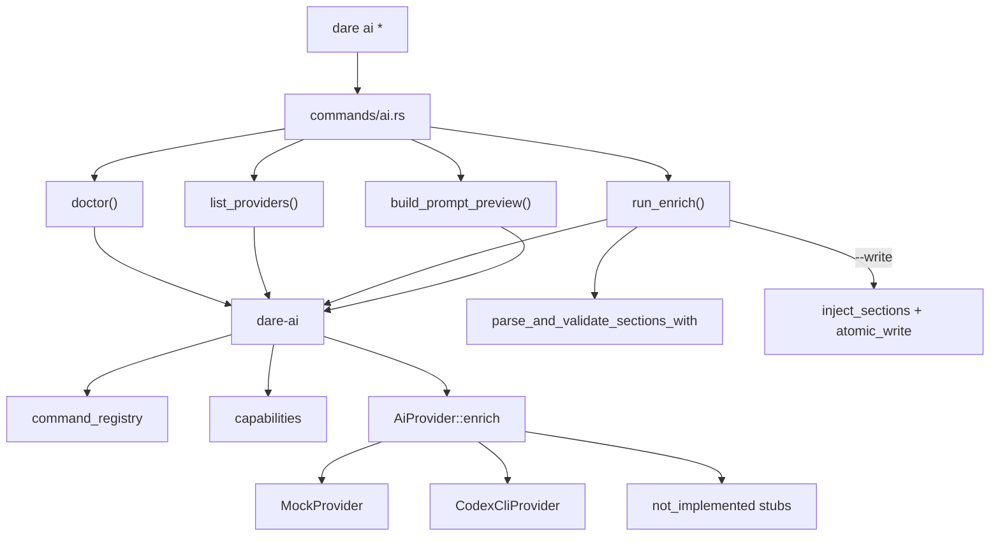

# BLUEPRINT: Comandos `dare ai` (Microplano 050)

> **Gerado a partir de:** `DARE/DESIGN-050-comandos-ai.md` v1.0  
> **Data:** 2026-07-29 | **Status:** APPROVED (tasks geradas via `/dare-tasks`)  
> **Arquivo:** `DARE/BLUEPRINT-050-comandos-ai.md`  
> **Pré-requisitos:** **024** `dare-ai` (DEC-025) · **005/006** path/process · **004** envelope CLI · Mestre §39 Ciclo 21 · §15 · baseline TS `@dewtech/dare-cli@3.18.1` · skill `/dare-ai`  
> **Escopo:** CLI **`dare ai doctor|providers|run|prompt`** · domain helpers em **`dare-ai`** · schemas multi-command v1 · capabilities · timeouts/redaction · mock CI · docs + **DEC-051**.  
> **Não:** dashboard/REST/MCP (**051/052**) · reescrever `dare design --ai` · `dare-agent` / execute `--agent` · Fase Docker · SDKs cloud.

---

## 0. TRADE-OFFS (Architect)

> `DARE/PATTERNS.md` / `patterns-facts.json` ausentes no repo CLI — trade-offs ancorados em código 🟢 (`dare-ai` AiProvider/Mock/Codex/schema/inject/redact, `commands/design.rs` + `blueprint.rs` enrich, `SafeCommand`, hooks/bench thin CLI, capability `dare-ai` com `cli_commands:[]`, Mestre §39, DESIGN-050).

| # | Trade-off | Escolha | Justificativa |
|---|-----------|---------|---------------|
| T-01 | Fronteira | Domínio em `dare-ai` (+ thin `commands/ai.rs`); CLI só orquestra I/O/clap | RNF-06; espelha hooks/bench |
| T-02 | vs AgentDriver | **Zero** dep `dare-agent`; ProviderId ≠ driver ids | RF-24; DEC-037 |
| T-03 | Commands v1 | **`design`** + **`blueprint`** apenas | Fecha 🔴 RF-07; ambos já têm section ids 🟢 |
| T-04 | Write policy | Default **no-write**; `--write` opt-in + `atomic_write` | Fecha 🟡 RF-09; R-07 |
| T-05 | Doctor status | Enum: `ready` \| `missing` \| `invalid` \| `not_implemented` | Fecha 🟡 Analyst |
| T-06 | Doctor probe | Resolve program (PATH/override) **sem** spawn `--help` (leve) | RNF-02; evita falso timeout |
| T-07 | Unimplemented CLIs | MUST: stubs tipados; SHOULD: adapters Claude/Cursor/Antigravity (Fase C) | RF-13/14 |
| T-08 | Default provider | Sem `--provider` → **`codex`**; smokes → **`mock`** | DEC-025 |
| T-09 | Report schema | `schemaVersion: 1` camelCase para doctor/providers/run/prompt | RF-17 |
| T-10 | Capability | Atualizar capability existente **`dare-ai`** → `cli_commands:["ai"]` | RF-22; evita id duplicado |
| T-11 | DEC | **DEC-051** | DEC-050 = verify/bench |
| T-12 | Docker fase | Omitida (CLI) | 046–049 |
| T-13 | Timeout map | `timed_out` / exit 124 → `CoreError` → CLI exit **124** | RF-15 |
| T-14 | Malformed | Schema fail → `CoreError::invalid_input` → exit **4**; sem write | RF-08/10 |
| T-15 | Facts path missing | `CoreError::not_found` → exit **3** | RF-19 |

### 0.1 Constantes

| Const | Valor |
|-------|-------|
| `AI_REPORT_SCHEMA` | `1` |
| `ENRICH_TIMEOUT` | `20 * 60` s (já em `dare-ai`) |
| `STDOUT_CAP` | `1_048_576` |
| `STDERR_CAP` | `65_536` |
| `BODY_MAX` | `65_536` |
| `PROMPT_LOG_MAX` | `256` |
| `MARKDOWN_PROMPT_MAX` | `32 * 1024` (codex) |
| `DEFAULT_PROVIDER` | `codex` |
| `MSG_UNKNOWN_PROVIDER` | `"unknown provider: {id}"` |
| `MSG_UNKNOWN_COMMAND` | `"unknown ai command: {c} (expected design\|blueprint)"` |
| `MSG_PROVIDER_NOT_IMPL` | `"provider not implemented: {id}"` |
| `MSG_PROVIDER_MISSING` | `"provider executable not found: {program}"` |
| `MSG_FACTS_REQUIRED` | `"--facts or --markdown required for ai run/prompt"` |
| `MSG_WRITE_NEEDS_MARKDOWN` | `"--write requires --markdown <path>"` |
| `CAPABILITY_ID` | `dare-ai` |

### 0.2 ProviderId (canónico, ordem estável)

| Id CLI | `ProviderId` | Env override | Implemented v1 MUST |
|--------|--------------|--------------|---------------------|
| `mock` | `Mock` | — | ✅ in-process |
| `codex` | `Codex` | `DARE_CODEX_COMMAND` | ✅ |
| `claude-code` | `ClaudeCode` | `DARE_CLAUDE_COMMAND` | stubs → `not_implemented` (SHOULD Fase C) |
| `cursor-cli` | `CursorCli` | `DARE_CURSOR_COMMAND` | stubs |
| `antigravity-cli` | `AntigravityCli` | `DARE_ANTIGRAVITY_COMMAND` | stubs |

### 0.3 DoctorStatus

```rust
pub enum DoctorStatus {
    Ready,           // "ready" — program resolves (mock always ready)
    Missing,         // "missing" — executable not on PATH / override program missing
    Invalid,         // "invalid" — override empty/malformed argv
    NotImplemented,  // "not_implemented" — ProviderId known but enrich() unsupported
}
```

Regras:
- `mock` → sempre `ready`, `program: "mock"`, `implemented: true`.
- `codex`: se `parse_argv_override`/default ok **e** `resolve_program` encontra exe → `ready`; senão `missing`. Override vazio → `invalid`.
- `claude-code`/`cursor-cli`/`antigravity-cli` **antes** de Fase C: `not_implemented` (mesmo se exe existir). Após Fase C: mesmas regras que codex.
- Doctor **nunca** chama `enrich()`.

### 0.4 EnrichCommand registry (v1)

| `--command` | Section ids | Default markdown path (hint) |
|-------------|-------------|------------------------------|
| `design` | `description`, `objectives`, `functional-requirements`, `stack` | `DARE/DESIGN.md` |
| `blueprint` | `architecture-overview`, `execution-phases`, `api-contracts`, `data-model` | `DARE/BLUEPRINT.md` |

Unknown → usage exit **2** com `MSG_UNKNOWN_COMMAND`.

### 0.5 Write policy

| Flag | Comportamento |
|------|----------------|
| (default) | Só report JSON/human; **não** toca disco |
| `--write` | Exige `--markdown <rel>`; `parse_and_validate_sections_with` → `inject_sections` → `atomic_write` no mesmo path; falha schema → **não** escreve |

---

## 1. VISÃO GERAL DA ARQUITETURA



### Decisões arquiteturais

| Decisão | Justificativa |
|---------|---------------|
| Thin CLI | Paridade hooks/bench; testável sem binário |
| Registry em `dare-ai` | Evita duplicar `ENRICHABLE`/`BP_ENRICHABLE` entre crates; CLI passa `&str` command |
| Prompt preview aparte de enrich | RF-10/11; zero spawn |
| Capability update in-place | `dare-ai` já existe no matrix |

---

## 2. STACK TÉCNICA DEFINIDA

| Camada | Tecnologia | Versão |
|--------|------------|--------|
| Rust | workspace | `rust-toolchain.toml` (pin do repo) |
| `dare-ai` | crate | workspace |
| `dare-cli` | clap + envelope | workspace |
| `dare-core` | SafeCommand, ProjectRoot, redact, atomic_write | workspace |
| Serde JSON | camelCase reports | workspace |
| Testes | `ai_cli.rs` + unit `dare-ai` | tempfile |

---

## 3. ESTRUTURA DE PASTAS

```text
crates/dare-ai/src/
  lib.rs                 # MOD — re-exports novos
  provider.rs            # MOD — resolve + not_implemented messages
  capabilities.rs        # NOVO — ProviderCapability + list
  doctor.rs              # NOVO — diagnose_provider / diagnose_all
  command_registry.rs    # NOVO — EnrichCommand + sections_for
  prompt.rs              # NOVO — build_enrich_prompt + preview redacted
  run.rs                 # NOVO — run_enrich(+ optional write)
  mock.rs / codex.rs / schema.rs / inject.rs / redact_log.rs  # existentes
  # Fase C (SHOULD): claude.rs, cursor.rs, antigravity.rs OU text_cli genérico

crates/dare-cli/src/
  commands/ai.rs         # NOVO
  commands/mod.rs        # MOD
  main.rs                # MOD — Commands::Ai + dispatch
crates/dare-cli/tests/
  ai_cli.rs              # NOVO

docs/compatibility/cli-ai.md   # NOVO
docs/DECISION-LOG.md           # MOD — DEC-051 only
assets/capability-matrix.yml   # MOD — dare-ai cli_commands
assets/manifest.yml            # MOD — hash
```

---

## 4. MODELO DE DADOS / REPORTS

### 4.1 DoctorReport (`schemaVersion: 1`)

```json
{
  "schemaVersion": 1,
  "ok": true,
  "providers": [
    {
      "id": "mock",
      "status": "ready",
      "implemented": true,
      "program": "mock",
      "envOverride": null,
      "reason": null,
      "defaultTimeoutSecs": 1200
    },
    {
      "id": "codex",
      "status": "missing",
      "implemented": true,
      "program": "codex",
      "envOverride": "DARE_CODEX_COMMAND",
      "reason": "provider executable not found: codex",
      "defaultTimeoutSecs": 1200
    },
    {
      "id": "claude-code",
      "status": "not_implemented",
      "implemented": false,
      "program": "claude",
      "envOverride": "DARE_CLAUDE_COMMAND",
      "reason": "provider not implemented: claude-code",
      "defaultTimeoutSecs": 1200
    }
  ]
}
```

Com `--provider codex`: array com **um** elemento.

### 4.2 ProvidersReport (`schemaVersion: 1`)

```json
{
  "schemaVersion": 1,
  "providers": [
    {
      "id": "mock",
      "enrich": true,
      "implemented": true,
      "envOverride": null,
      "defaultTimeoutSecs": 1200,
      "commands": ["design", "blueprint"]
    }
  ]
}
```

Ordem: lexicográfica pelos ids da tabela §0.2 (`mock`, `codex`, `antigravity-cli`, `claude-code`, `cursor-cli` — **ordem canónica fixa** abaixo, não alpha livre):

**Ordem congelada:** `mock`, `codex`, `claude-code`, `cursor-cli`, `antigravity-cli`.

### 4.3 RunReport (`schemaVersion: 1`)

```json
{
  "schemaVersion": 1,
  "ok": true,
  "command": "design",
  "provider": "mock",
  "enriched": true,
  "written": false,
  "writePath": null,
  "sections": ["description", "objectives", "functional-requirements", "stack"],
  "durationMs": 12,
  "warnings": []
}
```

Com `--write`: `written: true`, `writePath: "DARE/DESIGN.md"` (relativo safe).

### 4.4 PromptReport (`schemaVersion: 1`)

```json
{
  "schemaVersion": 1,
  "command": "design",
  "provider": "codex",
  "promptPreview": "[REDACTED truncated prompt…]",
  "promptChars": 1200,
  "envLeaked": false
}
```

`promptPreview` = `redact_prompt_for_log(full_prompt)` — **nunca** inclui valores de env/`DARE_*_COMMAND`/`PATH`.

---

## 5. CONTRATOS CLI (anti-stub)

### 5.1 Superfície

```text
dare ai doctor   [--provider <id>] [--json] [-d <dir>]
dare ai providers [--json] [-d <dir>]
dare ai run --command <design|blueprint>
            [--provider <id>] [--facts <rel>] [--markdown <rel>]
            [--write] [--json] [-d <dir>]
dare ai prompt --command <design|blueprint>
            [--provider <id>] [--facts <rel>] [--markdown <rel>]
            [--json] [-d <dir>]
```

### 5.2 Assinaturas de domínio (`dare-ai`)

```rust
pub fn diagnose_provider(id: ProviderId) -> CoreResult<ProviderDoctorEntry>;
pub fn diagnose_all() -> CoreResult<DoctorReport>;

pub fn list_provider_capabilities() -> ProvidersReport;

pub fn sections_for_command(command: &str) -> CoreResult<&'static [&'static str]>;

pub fn build_enrich_prompt(req: &EnrichRequest, section_ids: &[&str]) -> String;
pub fn prompt_preview(req: &EnrichRequest, section_ids: &[&str]) -> PromptReport;

pub struct RunEnrichRequest {
    pub provider: ProviderId,
    pub command: String,
    pub title: String,
    pub description: String,
    pub markdown: String,
    pub cwd: (ProjectRoot, SafeRelativePath),
    pub write_rel: Option<SafeRelativePath>, // Some ⇒ --write
}

pub fn run_enrich(
    req: &RunEnrichRequest,
    runner: &dyn ProcessRunner, // mock ignores
) -> CoreResult<RunReport>;
```

**Pré-condições `run_enrich`:**
- `sections_for_command` ok
- `resolve_provider` ok (unimplemented → invalid_input `MSG_PROVIDER_NOT_IMPL`)
- markdown UTF-8; se `write_rel` Some, path safe sob root

**Pós-condições sucesso:**
- `ok=true`, `enriched=true`, sections listadas
- se write: ficheiro contém bodies injetados só nos markers; unmanaged intacto
- se !write: filesystem inalterado

**Erros:**
| Condição | Erro | Exit CLI |
|----------|------|----------|
| unknown command/provider flag | `usage` | 2 |
| facts/markdown path missing | `not_found` | 3 |
| path traversal / unsafe | `invalid_input` | 4 |
| provider not implemented | `invalid_input` | 4 |
| malformed enrich JSON/sections | `invalid_input` | 4 |
| exe missing on run | `internal` / tipado com `MSG_PROVIDER_MISSING` | 1 |
| timeout | `internal("provider timed out")` | **124** |
| IO write | `io` | 5 |

### 5.3 Edge cases enumerados

| Caso | Resultado |
|------|-----------|
| `doctor` sem providers instalados | exit 0; statuses `missing`/`not_implemented` |
| `doctor --provider unknown` | exit 2/4 usage/invalid |
| `providers --json` | schemaVersion 1; 5 entries ordem §4.2 |
| `run` sem `--facts` e sem `--markdown` | exit 2 `MSG_FACTS_REQUIRED` |
| `run --write` sem `--markdown` | exit 2 `MSG_WRITE_NEEDS_MARKDOWN` |
| `run --provider mock --command design --markdown …` | exit 0; enriched |
| `run --provider claude-code` (pré Fase C) | exit 4 `provider not implemented` |
| `run` stdout inválido (fixture) | exit 4; !written |
| `prompt` com `DARE_CODEX_COMMAND=codex exec` set | preview **não** contém a string do override value |
| Concurrent writes | N/A single-process; atomic_write |

### 5.4 Carregar facts/markdown (CLI)

1. Resolver `ProjectRoot` via `-d` ou cwd.
2. Se `--markdown <rel>`: ler ficheiro jail; `title`/`description` derivados de basename + primeiras linhas **ou** campos opcionais futuros — v1: `title = command`, `description = "ai run {command}"` se só markdown.
3. Se `--facts <rel>`: JSON object exigindo strings `title`, `description`, e opcional `markdown` **ou** `markdownPath` relativo; missing keys → exit 4.
4. Se ambos: facts prevalecem para title/description; markdown file prevalece para corpo se `--markdown` presente.

**Exemplo facts mínimo:**

```json
{
  "title": "Payments API",
  "description": "Stripe checkout",
  "markdown": "# Design\n<!-- AGENT:BEGIN section=\"description\" -->\n\n<!-- AGENT:END section=\"description\" -->\n"
}
```

---

## 6. PLANO DE EXECUÇÃO (FASES)

> Fase Docker **omitida** (T-12). Última fase = audit + docs.

### Fase A — Registry + capabilities + doctor
**DONE quando:** `sections_for_command`, `list_provider_capabilities`, `diagnose_*` unit-tested; statuses §0.3.

**Entregáveis:** `command_registry.rs`, `capabilities.rs`, `doctor.rs`, tests.

### Fase B — Prompt preview + run_enrich (+ write opt-in)
**DONE quando:** `prompt_preview` `envLeaked=false` unit; `run_enrich` mock ok; schema fail não escreve; `--write` atomic.

**Entregáveis:** `prompt.rs`, `run.rs`, fixtures.

### Fase C — CLI `dare ai` + smokes (+ SHOULD providers)
**DONE quando:** help lista `ai`; `ai_cli.rs` cobre RF-25; unknown command/provider exits corretos.

**Entregáveis:** `commands/ai.rs`, `main.rs` wiring, `ai_cli.rs`.  
**SHOULD:** adapters `claude-code`/`cursor-cli`/`antigravity-cli` (TextCli pattern); se não: stubs permanecem e docs Class B.

### Fase D — Docs DEC-051 + capability + Ralph
**DONE quando:** `cli-ai.md`; DEC-051 append-only; `dare-ai` → `cli_commands:["ai"]` + manifest hash; matriz 050 Concluído; Ralph verde.

**Ralph:**
```bash
cargo test -p dare-ai
cargo test -p dare-cli --test ai_cli
cargo clippy -p dare-ai -p dare-cli --all-targets -- -D warnings
cargo audit
```

---

## 7. VALIDATION GATES

| Gate | Comando |
|------|---------|
| Build | `cargo build -p dare-ai -p dare-cli` |
| Test | `cargo test -p dare-ai` · `cargo test -p dare-cli --test ai_cli` |
| Lint | `cargo clippy -p dare-ai -p dare-cli --all-targets -- -D warnings` |
| Audit | `cargo audit` (fail HIGH/CRITICAL) |
| Flake | se `assets_verify_ok`: `cargo clean -p dare-assets`; `CARGO_TARGET_DIR` local |

---

## 8. CONTROLES DE SEGURANÇA → FASES

| RS | Controlo | Fase |
|----|----------|------|
| RS-01 | Parse whitelist command/provider; facts schema | A–C |
| RS-02 | redact_prompt / redact_stderr; caps | B |
| RS-03 | SafeRelativePath + ProjectRoot | B–C |
| RS-04 | cargo audit | D |
| RS-05 | só `DARE_*_COMMAND` | A/C |
| RS-06 | SafeCommand argv | C (providers) / existente codex |
| RS-07 | unit `prompt_no_env_leak` | B |
| RS-08 | schema validate before inject | B |

---

## 9. ESTRATÉGIA DE TESTES

| Tipo | Cobertura |
|------|-----------|
| Unit `dare-ai` | registry; doctor statuses; capabilities order; prompt redact; run mock; schema fail no-write |
| CLI `ai_cli` | doctor mock ready; providers json schemaVersion; prompt no-env-leak; run mock; unknown provider; missing facts → 3; malformed → 4; write opt-in roundtrip |
| Segurança | prompt não contém override env; markers rejeitados no body |
| Golden | mock sections fixtures existentes em `tests/fixtures/ai/` |

---

## 10. ESTRATÉGIA DE DEPLOY

| Ambiente | Nota |
|----------|------|
| Dev / CI | `--provider mock` |
| Release | binário `dare`; capability matrix atualizada; sem novo serviço |
| Prod cloud LLM | **Fora** |

---

## 11. CHECKLIST DE APROVAÇÃO

- [ ] Commands v1 = `design` + `blueprint` aceites
- [ ] Write default off + `--write` opt-in aceite
- [ ] DoctorStatus enum aceite
- [ ] Capability `dare-ai` → `["ai"]` (não novo id)
- [ ] DEC-051 (não 050) confirmado
- [ ] SHOULD providers Fase C opcional vs stubs tipados alinhado
- [ ] Anti-stub: schemas JSON + assinaturas + exits suficientes para `/dare-tasks`
- [ ] Aprovar → `/dare-tasks` com este Blueprint

---

## Compatibilidade TS (Classificação)

| Item | Classe | Nota |
|------|--------|------|
| Subcomandos doctor/providers/run/prompt | A | Alvo paridade |
| 8 schemas Zod workflows TS | B | v1 só design+blueprint; restantes microplanos donos |
| Provider ids | A | mock/codex/claude-code/cursor-cli/antigravity-cli |
| AgentDriver ids | C | Intencionalmente distintos (DEC-037) |

---

## Próximas etapas

1. Revisar e **aprovar** este Blueprint (especialmente T-03/T-04/T-07).
2. Rodar `/dare-tasks` → `TASKS-050` + `dare-dag-050.yaml` + `EXECUTION-050/`.
