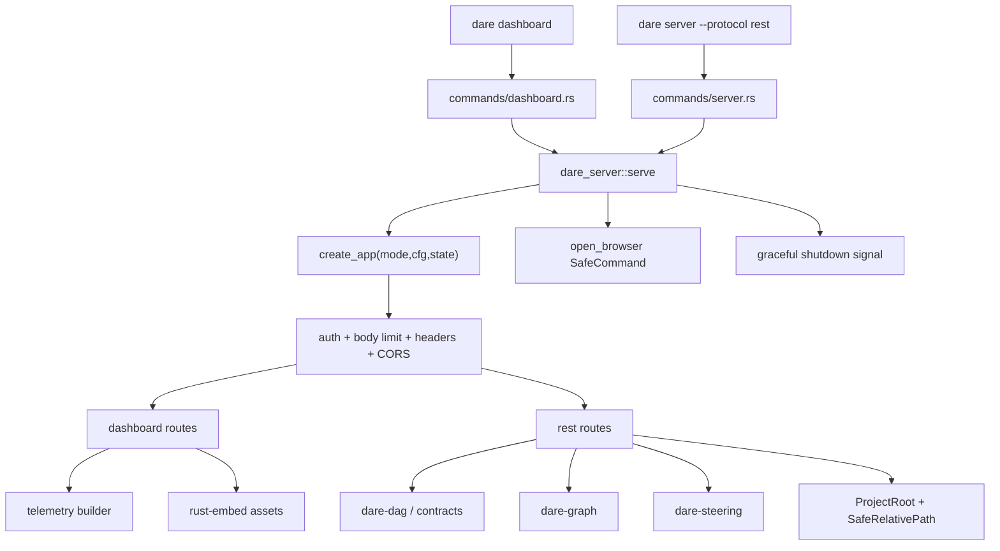

# BLUEPRINT: Dashboard e REST compatível (Microplano 051)

> **Gerado a partir de:** `DARE/DESIGN-051-dashboard-e-rest-compativel.md` v1.0  
> **Data:** 2026-07-30 | **Status:** APPROVED (tasks geradas via `/dare-tasks`)  
> **Arquivo:** `DARE/BLUEPRINT-051-dashboard-e-rest-compativel.md`  
> **Pré-requisitos:** **026** DAG · **040** graph · **049** verify/telemetry fields · path/process **005/006** · `TelemetrySnapshot` **007** · `dare info` (**017** 🟢 no CLI) · ADR-004 · Mestre §6/§40 · baseline TS `@dewtech/dare-cli@3.18.1` · skill `/dare-dashboard`  
> **Escopo:** crate **`dare-server`** (Axum shared app) · dashboard read-only · REST legado · auth/body-limit/path-safety · loopback bind · open browser · graceful shutdown · CLI **`dare dashboard`** + **`dare server --protocol rest`** · docs + **DEC-052**.  
> **Não:** MCP JSON-RPC/stdio/SSE (**052**) · OAuth/TLS · WebSocket · Fase Docker · alias binário `dare-mcp-server` (COULD diferido).

---

## 0. TRADE-OFFS (Architect)

> `DARE/PATTERNS.md` / `patterns-facts.json` ausentes — trade-offs ancorados em código 🟢 (`TelemetrySnapshot` em `dare-contracts`, `locate`/`bfs_expand` em `dare-graph`, `show_steering` + `.env*` deny em `dare-steering`, `SafeCommand`/`ProjectRoot`/`atomic_write` em `dare-core`, capability `dare-dashboard` com `cli_commands:[]`, ADR-004, DESIGN-051, Mestre §6).

| # | Trade-off | Escolha | Justificativa |
|---|-----------|---------|---------------|
| T-01 | Fronteira crate | Domínio HTTP em **`dare-server`**; CLI thin (`commands/dashboard.rs`, `commands/server.rs`) | RNF-06; espelha hooks/bench/ai |
| T-02 | Deps proibidas | **Zero** `dare-ai` / `dare-agent` | RF-01; evita ciclo e mistura enrichment/agent |
| T-03 | Shared app | `create_app(AppMode, ServerConfig, AppState) -> Router` único | RF-02; Mestre §6.2 |
| T-04 | Assets | **`rust-embed`** em `crates/dare-server/assets/dashboard/` | Fecha 🟡 Design; single-binary; workspace já tem `rust-embed =8.7.2` |
| T-05 | Graph subset v1 | **`/graph/locate`** + **`/graph/traverse`** + **`/graph/map-requirement`** | Fecha 🟡 RF-15; Mestre lista os 3; APIs 🟢 `locate` / `bfs_expand` |
| T-06 | map-requirement | `locate` com filtro pós-query: seeds/hits preferindo `node_type == "requirement"`; se zero hits tipados, fallback `locate` completo | Sem API dedicada 🟢; Class B documentado |
| T-07 | Telemetry | Reusar **`dare_contracts::TelemetrySnapshot`**; builder preenche maps a partir de `.dare/state.json`, DAG counts, drift se graph open | Fecha 🔴 Design; tipo já camelCase |
| T-08 | Auth | Bearer + **loopback isento**; non-loopback exige token | RF-18; Mestre §6.1 |
| T-09 | Token | `DARE_MCP_TOKEN` ou UUID v4 gerado; log human mostra presença/`token=…` **só em startup human** se `DARE_MCP_LOG_TOKEN=1` (default: **não** imprime valor — só `token=set|generated`) | RS-02; compat nome env TS |
| T-10 | Body limit | **1_048_576** bytes; excesso → **413** | RF-20 |
| T-11 | PUT tasks | Só `AppMode::Rest`; atomic rewrite STATUS em `DARE/TASKS.md` | RF-08/14 |
| T-12 | Capability | Atualizar **`dare-dashboard`** → `cli_commands:["dashboard","server"]` | RF-28; matriz 49 entries — sem novo id |
| T-13 | DEC | **DEC-052** | DEC-051 = ai (050) |
| T-14 | Docker | Omitida | DESIGN §9; padrão 046–050 |
| T-15 | HTTP pins | Workspace deps exact: axum/tokio/tower-http | R-07 |
| T-16 | Alias `dare-mcp-server` | **Fora v1** (COULD) | ADR-004 exige janela de transição; RF-30 |
| T-17 | `/health` | Presente em **ambos** modos | Smoke + load balancer local |
| T-18 | Context query | Tipos fechados: `architecture` \| `task` \| `dependency` | CLAUDE.md / Design RF-11 |

### 0.1 Constantes

| Const | Valor |
|-------|-------|
| `DEFAULT_DASHBOARD_BIND` | `127.0.0.1` |
| `DEFAULT_DASHBOARD_PORT` | `4100` |
| `DEFAULT_REST_BIND` | `127.0.0.1` |
| `DEFAULT_REST_PORT` | `3000` |
| `DEFAULT_BODY_LIMIT` | `1_048_576` (1 MiB) |
| `ENV_BIND` | `DARE_MCP_BIND` |
| `ENV_PORT` | `DARE_MCP_PORT` |
| `ENV_TOKEN` | `DARE_MCP_TOKEN` |
| `ENV_BODY_LIMIT` | `DARE_MCP_BODY_LIMIT` |
| `ENV_PROJECT` | `DARE_PROJECT_PATH` |
| `ENV_LOG_TOKEN` | `DARE_MCP_LOG_TOKEN` (`1`/`true` → log token value) |
| `BLUEPRINT_REL` | `DARE/BLUEPRINT.md` |
| `DAG_REL` | `DARE/dare-dag.yaml` |
| `TASKS_REL` | `DARE/TASKS.md` |
| `STATE_REL` | `.dare/state.json` |
| `CAPABILITY_ID` | `dare-dashboard` |
| `CSP_DASHBOARD` | `default-src 'self'; script-src 'self'; style-src 'self'; img-src 'self' data:; frame-ancestors 'none'; base-uri 'self'; form-action 'self'` |
| `MSG_PATH_ESCAPE` | `"path escape forbidden"` |
| `MSG_UNAUTHORIZED` | `"unauthorized"` |
| `MSG_BODY_TOO_LARGE` | `"request body too large"` |
| `MSG_UNKNOWN_PROTOCOL` | `"unknown protocol: {p} (expected rest)"` |
| `MSG_INVALID_CONTEXT_TYPE` | `"invalid context type (expected architecture\|task\|dependency)"` |
| `MSG_TASK_NOT_FOUND` | `"task not found: {id}"` |
| `MSG_INVALID_STATUS` | `"invalid status (expected PENDING\|RUNNING\|DONE\|FAILED\|SKIPPED)"` |
| `MSG_GRAPH_DISABLED` | `"graph unavailable"` |
| `MSG_STEERING_ENV` | reuse `dare_steering::MSG_ENV_EXCLUDED` |
| `HTTP_ERROR_SCHEMA` | `{ "error": string, "code": string }` |

### 0.2 AppMode

```rust
#[derive(Debug, Clone, Copy, PartialEq, Eq)]
pub enum AppMode {
    Dashboard, // read-only routes only
    Rest,      // + tools/context/blueprint/dag/tasks/graph/project/steering + PUT tasks
}
```

### 0.3 Auth rules

| Peer | `Authorization: Bearer <token>` | Resultado |
|------|----------------------------------|-----------|
| Loopback (`127.0.0.1`, `::1`) | ausente ou presente | **200 path** (token ignored if present unless mismatch — mismatch → **401**) |
| Non-loopback | ausente / malformed / wrong | **401** `{error,code:"unauthorized"}` |
| Non-loopback | exact match (constant-time) | OK |

Loopback detection: `SocketAddr::ip().is_loopback()` após `ConnectInfo<SocketAddr>`. Em testes oneshot sem ConnectInfo → tratar como **loopback** (documentado).

### 0.4 Graph route mapping

| Rota | Função domínio | Notas |
|------|----------------|-------|
| `POST /graph/locate` | `dare_graph::locate` | body → `LocateOptions` |
| `POST /graph/traverse` | `dare_graph::bfs_expand` | body seeds + hops/fanout |
| `POST /graph/map-requirement` | `locate` + filter `NodeType::Requirement` | fallback locate completo se filtro vazio |

---

## 1. VISÃO GERAL DA ARQUITETURA

Servidor HTTP local modular: um crate de domínio (`dare-server`) expõe factory Axum + handlers; o binário `dare` só faz clap, resolve `ProjectRoot`, chama `serve_*`, e mapeia `CoreError` → exit codes.



### Decisões arquiteturais

| Decisão | Justificativa |
|---------|---------------|
| Crate novo `dare-server` | Isola Axum/tokio do restante do workspace; CLI permanece sync-friendly na borda |
| Shared middleware | Auth/limit/headers idênticos dashboard↔REST (RF-02) |
| Embed assets | Distribuição single-binary; anti-traversal sem FS real |
| REST ≠ MCP | ADR-004; `--protocol rest` explícito |
| Thin CLI | Testes HTTP via `oneshot` sem spawn de binário |

---

## 2. STACK TÉCNICA DEFINIDA

| Camada | Tecnologia | Versão |
|--------|------------|--------|
| Rust | workspace | `rust-toolchain.toml` / `rust-version = 1.85.0` |
| HTTP | `axum` | `=0.8.8` (workspace dep) |
| Runtime | `tokio` | `=1.45.1` features: `macros`, `rt-multi-thread`, `net`, `signal`, `fs`, `io-util` |
| Middleware | `tower-http` | `=0.6.8` features: `limit`, `set-header`, `cors`, `trace` |
| Tower | `tower` | `=0.5.2` |
| HTTP types | `http` / `http-body-util` | pins compatíveis axum 0.8.8 (`http-body-util =0.1.3`) |
| Embed | `rust-embed` | `=8.7.2` (já workspace) |
| UUID token | `uuid` | `=1.16.0` (já workspace) |
| Domínio | `dare-server` | path crate |
| Contratos | `dare-contracts` | `TelemetrySnapshot`, `load_dag` |
| Graph | `dare-graph` | `locate`, `bfs_expand`, `open_graph` |
| Steering | `dare-steering` | `show_steering`, `list_steering` |
| Core | `dare-core` | path, process, atomic_write, redact |
| CLI | `dare-cli` | clap |
| Serde | `serde` / `serde_json` / `serde_yaml` | workspace |

> Pins exactos (`=`) no `[workspace.dependencies]`; crate `dare-server` só referencia workspace.

---

## 3. ESTRUTURA DE PASTAS

```text
crates/dare-server/
  Cargo.toml
  assets/dashboard/
    index.html          # servido em GET /dashboard
    app.js
    styles.css
  src/
    lib.rs              # re-exports públicos
    config.rs           # ServerConfig, env parse
    mode.rs             # AppMode
    state.rs            # AppState { root, token, body_limit, graph_handle? }
    auth.rs             # bearer + loopback
    error.rs            # HttpError → Response
    middleware.rs       # headers, CORS layer factory
    app.rs              # create_app
    serve.rs            # bind, graceful shutdown, open_browser hook
    browser.rs          # open_browser(url) via SafeCommand
    telemetry.rs        # build_telemetry_snapshot(root) -> TelemetrySnapshot
    tasks_md.rs         # get_task_line / put_task_status
    routes/
      mod.rs
      health.rs
      dashboard.rs      # /dashboard + /assets/{*path} + /api/telemetry
      tools.rs
      context.rs
      blueprint.rs
      dag.rs
      tasks.rs
      graph.rs
      project.rs
      steering.rs
  tests/
    http_contracts.rs   # oneshot suite

crates/dare-cli/src/commands/
  dashboard.rs          # NOVO
  server.rs             # NOVO
  mod.rs                # MOD
crates/dare-cli/src/main.rs  # MOD: Commands::Dashboard, Commands::Server
crates/dare-cli/tests/
  dashboard_cli.rs      # help + --protocol invalid
  # HTTP contracts prefer dare-server tests; CLI smokes bind optional

Cargo.toml              # MOD: member + workspace deps axum/tokio/tower-http/...
docs/compatibility/cli-dashboard-rest.md   # NOVO
docs/DECISION-LOG.md                       # MOD: DEC-052
assets/capability-matrix.yml               # MOD: dare-dashboard cli_commands
DARE-RUST-MICRO-PLANOS/.../000A-MATRIZ-DE-STATUS.md  # MOD: 051 Concluído (fase docs)
```

**Constraint workspace:** NÃO definir `[build] target` global.

---

## 4. MODELO DE DADOS

### 4.1 `ServerConfig`

| Campo | Tipo | Default | Constraints |
|-------|------|---------|-------------|
| `bind` | `IpAddr` | `127.0.0.1` | parse de `DARE_MCP_BIND` / `--bind` |
| `port` | `u16` | 4100 dashboard / 3000 rest | `1..=65535`; `0` → invalid_input |
| `project_root` | `ProjectRoot` | `-d` / `DARE_PROJECT_PATH` / cwd find | MUST existir |
| `token` | `String` | env ou uuid v4 hyphenated | len ≥ 8 se set via env; gerado = uuid |
| `token_source` | enum `Env` \| `Generated` | — | para log |
| `body_limit` | `usize` | `1_048_576` | parse `DARE_MCP_BODY_LIMIT` (`1mb`/`1048576`/`1MiB`); min 1024 max 16 MiB |
| `open_browser` | `bool` | `true` dashboard; N/A rest | `--no-open` → false |
| `log_token_value` | `bool` | false | `DARE_MCP_LOG_TOKEN=1` |

### 4.2 `AppState`

| Campo | Tipo | Notas |
|-------|------|-------|
| `root` | `ProjectRoot` | Arc |
| `token` | `Arc<str>` | compare auth |
| `body_limit` | `usize` | redundante c/ layer; handlers podem checar |
| `mode` | `AppMode` | |
| `version` | `String` | `env!("CARGO_PKG_VERSION")` do server ou cli |

### 4.3 `TelemetrySnapshot` (já em `dare-contracts`)

Campos camelCase: `dag`, `gates`, `cost`, `bestOfN`, `guard`, `drift`, + `extra` flatten.

**Builder v1 (`build_telemetry_snapshot`):**

| Chave | Fonte | Conteúdo mínimo |
|-------|-------|-----------------|
| `dag` | `.dare/state.json` se presente + `dare-dag.yaml` | `{ "tasksTotal": n, "done": n, "pending": n, "running": n, "failed": n, "skipped": n }` (contagens de `TaskStatus` se state; senão zeros + `"source":"none"`) |
| `gates` | state / verification se legível | `{}` se ausente |
| `cost` | `{}` v1 | reservado |
| `bestOfN` | state/extra se houver | `{}` default |
| `guard` | `{}` ou último report se path conhecido | default `{}` |
| `drift` | se graph abre: `{ "available": true }` senão `{ "available": false }` | sem rodar drift pesado por default (RNF-03); SHOULD call `drift` only if query `?full=1` **fora v1** |

Sempre serializa com chaves presentes (maps vazios OK). Canonical JSON via `telemetry_snapshot_to_canonical_json` nos testes.

### 4.4 Context query

```rust
#[derive(Deserialize)]
#[serde(rename_all = "camelCase")]
pub struct ContextQueryRequest {
    #[serde(rename = "type")]
    pub kind: ContextKind, // architecture | task | dependency
    pub query: String,     // trim; 1..=512 chars
}

#[derive(Serialize)]
#[serde(rename_all = "camelCase")]
pub struct ContextQueryResponse {
    pub schema_version: u32, // 1
    #[serde(rename = "type")]
    pub kind: String,
    pub query: String,
    pub hits: Vec<ContextHit>,
    pub warnings: Vec<String>,
}

#[derive(Serialize)]
#[serde(rename_all = "camelCase")]
pub struct ContextHit {
    pub id: String,
    pub label: String,
    pub kind: String,
    pub snippet: String, // ≤ 280 chars
}
```

**Resolução v1:**
- `architecture` → ler `DARE/BLUEPRINT.md` (se existir) e extrair headings/parágrafos que contenham `query` (case-insensitive); hits sintéticos `id=blueprint#N`.
- `task` → scan `DARE/TASKS.md` + state tasks ids matching query.
- `dependency` → se graph disponível: `locate` com query; senão warning `MSG_GRAPH_DISABLED` + hits de `depends_on` em `dare-dag.yaml` text search.

### 4.5 Task PUT body

```json
{ "status": "DONE" }
```

`status` ∈ `PENDING|RUNNING|DONE|FAILED|SKIPPED` (exact wire).  
Side effect: reescreve **apenas** a linha de `DARE/TASKS.md` que contém o `id` (substring `| {id} |` **ou** `` `{id}` `` **ou** token `id` em célula markdown); atualiza emoji/word de status:

| Status | Emoji canónico | Word |
|--------|----------------|------|
| PENDING | ⏳ | PENDING |
| RUNNING | 🔄 | RUNNING |
| DONE | ✅ | DONE |
| FAILED | ❌ | FAILED |
| SKIPPED | ⏭️ | SKIPPED |

Algoritmo: se a linha tem emoji conhecido → substitui emoji; se tem word status → substitui word; se nenhum → append ` ✅ DONE` no fim da linha. `atomic_write` no path `TASKS_REL`. Se ficheiro ausente → **404**. Se id não encontrado → **404** `MSG_TASK_NOT_FOUND`.

### 4.6 Graph request bodies

**locate / map-requirement:**

```json
{
  "query": "auth middleware",
  "maxHops": 2,
  "fanout": 50,
  "limit": 20,
  "decay": 0.7
}
```

Defaults = `LocateOptions::default` (decay `LOCATE_DECAY=0.7`).  
`query` trim empty → **400** `invalid_input`.

**traverse:**

```json
{
  "seeds": ["task:mp051-001"],
  "maxHops": 2,
  "fanout": 50
}
```

`seeds` min 1 max 32; cada seed non-empty ≤ 256 chars. Response: `{ "schemaVersion": 1, "nodes": ["id", ...] }` ordem estável (BFS + sort já em `bfs_expand`).

### 4.7 Relacionamentos

| De | Para | Via |
|----|------|-----|
| AppState | ProjectRoot | Arc |
| Telemetry | state + dag files | read-only |
| Graph routes | KnowledgeGraph | `open_graph` lazy |
| Steering | filesystem | `show_steering` |
| PUT tasks | TASKS.md | atomic_write |

---

## 5. CONTRATOS DE API

### 5.0 Tabela resumo

| Método | Path | Modos | Auth* | Body | Success | Erros |
|--------|------|-------|-------|------|---------|-------|
| GET | `/health` | D+R | * | — | 200 Health | — |
| GET | `/dashboard` | D (+R opcional) | * | — | 200 text/html | 404 se asset missing |
| GET | `/assets/{*path}` | D (+R se montado) | * | — | 200 file | **403** escape; 404 missing |
| GET | `/api/telemetry` | D (+R) | * | — | 200 TelemetrySnapshot | 500 IO |
| GET | `/tools` | R | * | — | 200 ToolsList | — |
| POST | `/context/query` | R | * | ContextQueryRequest | 200 ContextQueryResponse | 400/413 |
| GET | `/blueprint` | R | * | — | 200 `{path,content}` ou raw md | 403/404 |
| GET | `/dag` | R | * | — | 200 JSON dag doc | 404 |
| GET | `/tasks/{id}` | R | * | — | 200 TaskView | 400/404 |
| PUT | `/tasks/{id}` | R only | * | `{status}` | 200 TaskView | 400/403/404/413 |
| POST | `/graph/locate` | R | * | LocateBody | 200 `{hits}` | 400/503 |
| POST | `/graph/traverse` | R | * | TraverseBody | 200 `{nodes}` | 400/503 |
| POST | `/graph/map-requirement` | R | * | LocateBody | 200 `{hits}` | 400/503 |
| GET | `/project` | R | * | — | 200 ProjectSnapshot | — |
| GET | `/steering` | R | * | query `file` | 200 SteeringShow | 400/403/404 |

\*Auth: §0.3. Dashboard **não** registra PUT nem mutações.

### 5.1 Error envelope

Todos os 4xx/5xx JSON (exceto HTML assets):

```json
{ "error": "path escape forbidden", "code": "path_escape" }
```

| HTTP | `code` |
|------|--------|
| 400 | `invalid_input` |
| 401 | `unauthorized` |
| 403 | `path_escape` \| `forbidden` |
| 404 | `not_found` |
| 413 | `body_too_large` |
| 500 | `internal` |
| 503 | `graph_unavailable` |

### 5.2 `GET /health`

**Response 200:**

```json
{
  "ok": true,
  "version": "0.1.0-alpha.0",
  "protocol": "rest",
  "mode": "dashboard"
}
```

`protocol` sempre `"rest"` neste ciclo (mesmo no dashboard — transporte HTTP REST).  
`mode`: `"dashboard"` \| `"rest"`.

### 5.3 `GET /dashboard`

- Content-Type: `text/html; charset=utf-8`
- Body: embed `index.html`
- Headers: CSP = `CSP_DASHBOARD`; `X-Frame-Options: DENY`; `X-Content-Type-Options: nosniff`

### 5.4 `GET /assets/{*path}`

Validações (ordem):
1. Reject se `path` contém `..` **ou** começa com `/` **ou** contém `\` → **403** `path_escape`
2. Reject se segmento vazio → **403**
3. Allowlist extensão: `js|css|svg|png|ico|woff2|map` → senão **403** `forbidden`
4. Lookup embed `dashboard/{path}` → missing **404**

Exemplo: `/assets/../Cargo.toml` → **403**.

### 5.5 `GET /api/telemetry`

**200:** body = `TelemetrySnapshot` JSON (não-canonical ok em wire; testes comparam campos chave).

Exemplo mínimo:

```json
{
  "dag": { "tasksTotal": 0, "done": 0, "pending": 0, "running": 0, "failed": 0, "skipped": 0, "source": "none" },
  "gates": {},
  "cost": {},
  "bestOfN": {},
  "guard": {},
  "drift": { "available": false }
}
```

### 5.6 `GET /tools`

Anúncio estático (não MCP):

```json
{
  "schemaVersion": 1,
  "tools": [
    { "name": "health", "method": "GET", "path": "/health" },
    { "name": "tools", "method": "GET", "path": "/tools" },
    { "name": "context_query", "method": "POST", "path": "/context/query" },
    { "name": "blueprint", "method": "GET", "path": "/blueprint" },
    { "name": "dag", "method": "GET", "path": "/dag" },
    { "name": "tasks_get", "method": "GET", "path": "/tasks/:id" },
    { "name": "tasks_put", "method": "PUT", "path": "/tasks/:id" },
    { "name": "graph_locate", "method": "POST", "path": "/graph/locate" },
    { "name": "graph_map_requirement", "method": "POST", "path": "/graph/map-requirement" },
    { "name": "graph_traverse", "method": "POST", "path": "/graph/traverse" },
    { "name": "project", "method": "GET", "path": "/project" },
    { "name": "steering", "method": "GET", "path": "/steering" }
  ]
}
```

Ordem congelada acima (12 tools).

### 5.7 `POST /context/query`

**Headers:** `Content-Type: application/json`  
**Request exemplo:**

```json
{ "type": "task", "query": "mp051-001" }
```

**Validações:**
- JSON parse fail → 400
- `type` ∉ set → 400 `MSG_INVALID_CONTEXT_TYPE`
- `query` empty/whitespace ou len > 512 → 400
- Body > limit → 413

**200 exemplo:**

```json
{
  "schemaVersion": 1,
  "type": "task",
  "query": "mp051-001",
  "hits": [
    { "id": "mp051-001", "label": "mp051-001", "kind": "task", "snippet": "| mp051-001 | … |" }
  ],
  "warnings": []
}
```

**Side effects:** nenhum (read-only).

### 5.8 `GET /blueprint`

- Resolve `BLUEPRINT_REL` sob jail
- Se missing → 404
- Escape attempts via crafted Accept/path N/A (path fixo)
- **200:**

```json
{
  "path": "DARE/BLUEPRINT.md",
  "content": "# BLUEPRINT: …",
  "bytes": 1234
}
```

`content` UTF-8; se ficheiro > 2 MiB → 400 `invalid_input` `"blueprint exceeds size limit"`.

### 5.9 `GET /dag`

- `load_dag(root, DAG_REL)` → serialize JSON estável do `DagDocument`
- Missing → 404
- Invalid YAML → 400

### 5.10 `GET /tasks/{id}` / `PUT /tasks/{id}`

**id validações:** `^[A-Za-z0-9][A-Za-z0-9._:-]{0,127}$`; caso contrário 400.  
Reject id com `..` / `/` / `\` → 403 `path_escape`.

**GET 200:**

```json
{
  "id": "mp051-001",
  "status": "PENDING",
  "line": "| mp051-001 | … | ⏳ PENDING |"
}
```

**PUT** — ver §4.5. Response 200 = TaskView atualizado.  
**Concorrência:** best-effort; `atomic_write`; last-writer-wins; sem lock distribuído.

### 5.11 Graph POSTs

**200 locate:**

```json
{
  "schemaVersion": 1,
  "hits": [
    { "id": "file:src/auth.rs", "score": 1.0, "label": "auth.rs", "nodeType": "file" }
  ]
}
```

Graph open fail → **503** `graph_unavailable`.

### 5.12 `GET /project`

```json
{
  "schemaVersion": 1,
  "root": "C:/proj",
  "dareDirPresent": true,
  "configPresent": true,
  "backend": "rust-axum",
  "graphPresent": false
}
```

Campos alinhados ao subset de `InfoReport` (sem reexportar CLI). Implementação: funções read-only em `dare-server` espelhando lógica de `info.rs` **ou** extrair helper compartilhado — **preferir duplicação mínima no server** (não depender de `dare-cli`).

### 5.13 `GET /steering?file=`

- Query `file` obrigatória; missing → 400
- Chama `dare_steering::show_steering(root, file)`
- `.env*` → **403** (map `invalid_input` env excluded → 403 `forbidden`)
- path escape → **403**
- not found → **404**
- **200:** JSON do `SteeringShowReport` (schema_version existente)

### 5.14 Funções públicas de domínio (anti-stub)

```rust
pub fn create_app(mode: AppMode, cfg: &ServerConfig, state: AppState) -> axum::Router;

pub async fn serve(
    mode: AppMode,
    cfg: ServerConfig,
    shutdown: impl Future<Output = ()> + Send + 'static,
) -> CoreResult<()>;
// bind TcpListener; create_app; axum::serve with graceful shutdown; on dashboard+open_browser → open_browser

pub fn open_browser(url: &str, runner: &dyn ProcessRunner) -> CoreResult<()>;
// Windows: cmd.exe /C start "" <url>  — NAO: usar `cmd /C start` é shell-ish;
// v1 SafeCommand:
//   Windows: SafeCommand::new("cmd.exe").args(["/C","start","", url])  // documentado Class B vs explorer
//   macOS: SafeCommand::new("open").arg(url)
//   Linux: SafeCommand::new("xdg-open").arg(url)
// URL must match ^https?://(127\.0\.0\.1|localhost)(:\d+)?(/.*)?$ — senão invalid_input

pub fn build_telemetry_snapshot(root: &ProjectRoot) -> CoreResult<TelemetrySnapshot>;

pub fn put_task_status(root: &ProjectRoot, id: &str, status: &str) -> CoreResult<TaskView>;
pub fn get_task_view(root: &ProjectRoot, id: &str) -> CoreResult<TaskView>;

pub fn parse_server_config_from_env(
    mode: AppMode,
    bind_override: Option<&str>,
    port_override: Option<u16>,
    project: &Path,
    open_browser: bool,
) -> CoreResult<ServerConfig>;
```

**Pré-condições `serve`:** port livre ou erro `io`; root válido.  
**Pós-condições:** listener closed após shutdown; exit path sem panic.  
**Erros:** bind fail → `CoreError::io`; browser fail → **warning log**, não falha serve (R-06).

### 5.15 CLI

```text
dare dashboard [--port <u16>] [--no-open] [-d <dir>]
dare server --protocol rest [--bind <ip>] [--port <u16>] [-d <dir>]
```

| Caso | Exit |
|------|------|
| ok até Ctrl+C | 0 |
| usage / missing `--protocol` / protocol ≠ `rest` | 2 |
| project root not found | 3 |
| invalid bind/port/path | 4 |
| bind IO | 5 |

Prioridade config: flags CLI > env > defaults.  
`-d` / `DARE_PROJECT_PATH` → root.

### 5.16 Edge cases enumerados

| Caso | Resultado |
|------|-----------|
| `/assets/../../etc/passwd` | 403 |
| `/assets/foo.exe` | 403 forbidden |
| Non-loopback sem Bearer | 401 |
| Non-loopback Bearer errado | 401 |
| Loopback sem Bearer | 200 |
| Body 1_048_577 bytes | 413 |
| `POST /context/query` type `foo` | 400 |
| PUT no modo dashboard (rota ausente) | 404 Axum |
| PUT status `done` (lowercase) | 400 |
| Graph disabled / missing store | 503 nos POSTs graph |
| Steering `?file=.env` | 403 |
| `dare server --protocol mcp` | exit 2 `MSG_UNKNOWN_PROTOCOL` |
| Browser open falha | serve continua; log warn |
| SIGINT | graceful shutdown exit 0 |

---

## 6. PLANO DE EXECUÇÃO (FASES)

> Fase Docker **omitida** (T-14). Última fase = audit + docs + DEC.

### Fase A — Crate `dare-server` + config + auth + app skeleton
**DONE quando:** workspace member compila; `create_app(Dashboard)` serve `/health` em oneshot; auth unit: loopback OK / non-loopback 401; body limit layer retorna 413; headers nosniff/DENY presentes.

**Entregáveis:** `Cargo.toml` workspace pins, `config.rs`, `auth.rs`, `error.rs`, `middleware.rs`, `app.rs`, `routes/health.rs`, unit tests.

### Fase B — Dashboard embed + telemetry
**DONE quando:** `GET /dashboard` HTML 200; `/assets/..` → 403; `/api/telemetry` devolve maps §4.3; assets allowlist testada.

**Entregáveis:** `assets/dashboard/*`, `routes/dashboard.rs`, `telemetry.rs`, embed mod.

### Fase C — REST routes (read) + graph + steering + project
**DONE quando:** contract tests cobrem tabela §5.0 GET/POST read; graph 503 sem store; steering `.env` 403; context types validados.

**Entregáveis:** `routes/{tools,context,blueprint,dag,tasks,graph,project,steering}.rs`, `http_contracts.rs` parcial.

### Fase D — PUT tasks + serve/bind/browser/shutdown + CLI
**DONE quando:** PUT atualiza TASKS.md atomicamente; `dare dashboard --help` / `dare server --help`; `--protocol` inválido exit 2; `open_browser` URL allowlist; graceful shutdown test (trigger oneshot cancel).

**Entregáveis:** `tasks_md.rs`, `serve.rs`, `browser.rs`, `commands/dashboard.rs`, `commands/server.rs`, wiring `main.rs`, CLI smokes.

### Fase E — Docs DEC-052 + capability + Ralph
**DONE quando:** `docs/compatibility/cli-dashboard-rest.md`; DEC-052 append-only; `dare-dashboard` → `cli_commands:["dashboard","server"]` + manifest hash; matriz 051 Concluído; Ralph verde.

**Ralph:**
```bash
cargo test -p dare-server
cargo test -p dare-cli --test dashboard_cli
cargo clippy -p dare-server -p dare-cli --all-targets -- -D warnings
cargo audit
```

---

## 7. VALIDATION GATES

| Gate | Comando |
|------|---------|
| Build | `cargo build -p dare-server -p dare-cli` |
| Test | `cargo test -p dare-server` · `cargo test -p dare-cli --test dashboard_cli` |
| Lint | `cargo clippy -p dare-server -p dare-cli --all-targets -- -D warnings` |
| Audit | `cargo audit` (fail HIGH/CRITICAL) |
| Flake | `CARGO_TARGET_DIR` local; se assets fail: `cargo clean -p dare-assets` |

---

## 8. CONTROLES DE SEGURANÇA → FASES

| RS | Controlo | Fase |
|----|----------|------|
| RS-01 | JSON schema/type whitelist; id regex; query len | A–C |
| RS-02 | Não logar token por default; redact errors | A/D |
| RS-03 | SafeRelativePath; assets `..` → 403; steering deny | B–C |
| RS-04 | cargo audit | E |
| RS-05 | `DARE_MCP_*` env only | A |
| RS-06 | SafeCommand browser argv | D |
| RS-07 | body limit 413 | A |
| RS-08 | CSP + X-Frame-Options + nosniff | A/B |
| RS-09 | PUT só Rest + id safe + auth off-loopback | D |

---

## 9. ESTRATÉGIA DE TESTES

| Tipo | Cobertura |
|------|-----------|
| Unit `dare-server` | auth matrix; config parse body limit; tasks_md put/get; telemetry maps; browser URL reject |
| HTTP contracts | oneshot: health, telemetry, assets 403, context 400, steering env 403, graph locate empty query 400, PUT status roundtrip |
| Auth | non-loopback simulado via state flag test helper `AuthMode::ForceRequire` **ou** inject ConnectInfo |
| CLI | help; protocol invalid → 2; `--no-open` não chama runner (mock) |
| Segurança | path escape; body 413; token mismatch 401 |
| Compat | documentar Class A/B/C vs TS 3.18.1 |

**Nota auth em oneshot:** expor `#[cfg(test)]` / `ServerConfig.force_auth: bool` — quando true, exige Bearer mesmo sem ConnectInfo. Contract test usa `force_auth=true`.

---

## 10. ESTRATÉGIA DE DEPLOY

| Ambiente | Nota |
|----------|------|
| Dev | `dare dashboard --no-open`; `dare server --protocol rest` |
| CI | oneshot only; sem browser; `--no-open` |
| Release | binário `dare`; capability matrix; **sem** serviço cloud |
| Prod multi-tenant | **Fora** |

---

## 11. CHECKLIST DE APROVAÇÃO

- [ ] Pins axum `0.8.8` / tokio `1.45.1` / tower-http `0.6.8` aceites (ou bump documentado)
- [ ] Graph v1 = locate + traverse + map-requirement aceite
- [ ] Telemetry builder mínimo §4.3 aceite
- [ ] Capability `dare-dashboard` → `["dashboard","server"]` (sem novo id) aceite
- [ ] DEC-052 (não 051) confirmado
- [ ] Alias `dare-mcp-server` fora v1 alinhado ADR-004
- [ ] Docker omitido alinhado
- [ ] Anti-stub: schemas + status codes + edge cases suficientes para `/dare-tasks`
- [ ] Aprovar → `/dare-tasks` com este Blueprint

---

## Compatibilidade TS (Classificação)

| Item | Classe | Nota |
|------|--------|------|
| Paths / methods REST | A | Paridade Mestre §6.1 |
| Auth loopback isento | A | |
| Body limit 1 MiB → 413 | A/B | TS pode usar 400; Rust congela **413** (documentar B se TS ≠) |
| Telemetry maps | A | tipo 007 |
| map-requirement via locate+filter | B | Sem API TS idêntica no Rust |
| Tools list count/order | B | 12 tools congelados |
| Dashboard HTML visual | C | vanilla mínimo funcional |
| Nome binário `dare-mcp-server` | C | diferido; CLI `dare server --protocol rest` |
| MCP protocol | C | 052 |

---

## Próximas etapas

1. Revisar e aprovar este Blueprint (contratos §5 e freezes §0).
2. Quando aprovado, rodar `/dare-tasks` com `@DARE/BLUEPRINT-051-dashboard-e-rest-compativel.md`.
