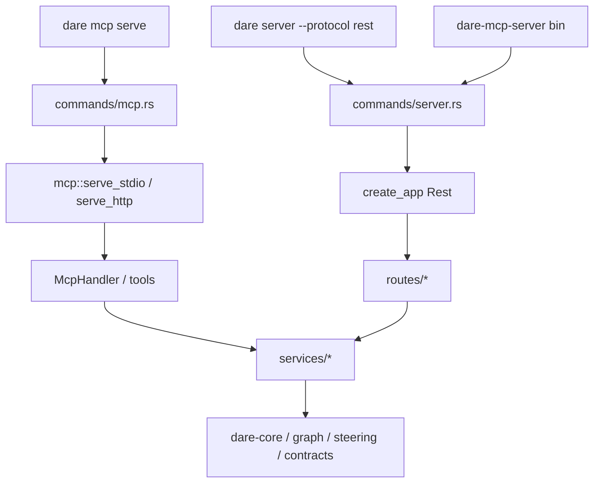

# BLUEPRINT: MCP real como transporte separado (Microplano 052)

> **Gerado a partir de:** `DARE/DESIGN-052-mcp-real-como-transporte-separado.md` v1.0  
> **Data:** 2026-07-30 | **Status:** APPROVED (tasks geradas via `/dare-tasks`)  
> **Arquivo:** `DARE/BLUEPRINT-052-mcp-real-como-transporte-separado.md`  
> **Pré-requisitos:** **051** DONE (DEC-052) · **ADR-004** Accepted · path/process **005/006** · graph **040+** · steering **048** · Mestre §40  
> **Escopo:** `rmcp` · services compartilhados · tools MCP · stdio + streamable-http · CLI `dare mcp serve` · alias transição · docs + **DEC-053**.  
> **Não:** reescrever REST/dashboard · OAuth cloud · Resources/Prompts MCP completos · self-update **053** · substituição silenciosa REST↔MCP · Fase Docker.

---

## 0. TRADE-OFFS (Architect)

> `DARE/PATTERNS.md` / `patterns-facts.json` ausentes — trade-offs ancorados em código 🟢 (`dare-server` routes/services 051, `tasks_md`, `http_map`, ADR-004, DESIGN-052, `rmcp` crates.io **3.0.1**).

| # | Trade-off | Escolha | Justificativa |
|---|-----------|---------|---------------|
| T-01 | SDK | **`rmcp =3.0.1`** oficial | RF-01; Mestre cita rmcp |
| T-02 | Feature Cargo | `dare-server` feature **`mcp`** **default-on** | RF-03; binário único; desligar em builds mínimos |
| T-03 | Fronteira | MCP + services em **`dare-server`**; CLI thin | RF-02; espelha 051 |
| T-04 | Services | Extrair `services/*`; REST handlers **delegam** | RF-09; evita drift |
| T-05 | Tool names | Snake_case domínio (não paths HTTP) | Fecha 🔴 Design; Class B vs `/tools` REST |
| T-06 | Tool count v1 | **10 tools** congelados §0.4 | RF-10 |
| T-07 | Default transport | **`stdio`** se `--transport` omitido | RF-14 |
| T-08 | Streamable HTTP | **MUST**; porta default **3100** | RF-15; evita colisão REST 3000 |
| T-09 | Auth HTTP MCP | Reusar Bearer + loopback isento 051 | RNF-01/02 |
| T-10 | Alias `dare-mcp-server` | Binário thin → **REST** + stderr deprecation | RF-21; ADR-004 seguro |
| T-11 | Resources/Prompts | **Fora v1** | RF-13 COULD |
| T-12 | Capability | **Novo** id `dare-mcp` → `cli_commands:["mcp"]` | RF-22; matriz já >49 |
| T-13 | DEC | **DEC-053** | DEC-052 = dashboard |
| T-14 | Docker | Omitida | DESIGN §9 |
| T-15 | Protocolo MCP | Versão suportada pelo pin `rmcp 3.0.1` (estável SDK) | Fecha 🟡 Analyst |
| T-16 | Testes | Unit services + in-process MCP handler; stdio smoke opcional CI | R-07 |

### 0.1 Constantes

| Const | Valor |
|-------|-------|
| `RMCP_VERSION` | `=3.0.1` |
| `DEFAULT_MCP_TRANSPORT` | `stdio` |
| `DEFAULT_MCP_HTTP_BIND` | `127.0.0.1` |
| `DEFAULT_MCP_HTTP_PORT` | `3100` |
| `ENV_MCP_HTTP_BIND` | `DARE_MCP_HTTP_BIND` (não reusar `DARE_MCP_PORT` do REST sem flag) |
| `ENV_MCP_HTTP_PORT` | `DARE_MCP_HTTP_PORT` |
| `CAPABILITY_ID` | `dare-mcp` |
| `MSG_UNKNOWN_TRANSPORT` | `"unknown transport: {t} (expected stdio\|streamable-http)"` |
| `MSG_ALIAS_DEPRECATED` | `"dare-mcp-server is deprecated: it serves legacy REST only. Use 'dare server --protocol rest' or 'dare mcp serve' for MCP."` |
| `BLUEPRINT_REL` | `DARE/BLUEPRINT.md` (já 051) |
| `DAG_REL` | `DARE/dare-dag.yaml` |
| `TASKS_REL` | `DARE/TASKS.md` |
| `TOOL_RESULT_SCHEMA` | `1` (envelope JSON dentro de text content) |

### 0.2 Feature Cargo

```toml
# crates/dare-server/Cargo.toml
[features]
default = ["mcp"]
mcp = ["dep:rmcp", "dep:rmcp-macros", "dep:schemars"]

[dependencies]
rmcp = { workspace = true, optional = true, features = [
  "server", "macros", "transport-io", "transport-streamable-http-server", "schemars"
] }
```

Workspace: `rmcp = { version = "=3.0.1", default-features = false }` (+ macros/schemars pins compatíveis).

### 0.3 Alias `dare-mcp-server` (janela ADR-004)

| Item | Valor |
|------|-------|
| Comportamento | Inicia **REST** (`AppMode::Rest`) — **nunca** MCP |
| Deprecation | Sempre imprime `MSG_ALIAS_DEPRECATED` em **stderr** antes do listen |
| Args | Espelha `dare server --protocol rest` (`--bind`, `--port`, `-d`) |
| Fim da janela | Documentado até release **1.0** / revisitado no microplano **053+**; Class C remoção futura |
| Implementação | `[[bin]] name = "dare-mcp-server"` em `dare-cli` → chama mesma lógica que `commands/server.rs` |

### 0.4 Tools MCP v1 (ordem congelada `tools/list`)

| # | `name` | Service | Side effect |
|---|--------|---------|-------------|
| 1 | `project` | ProjectService::snapshot | none |
| 2 | `blueprint` | ProjectService::read_blueprint | none |
| 3 | `dag` | DagService::load_json | none |
| 4 | `task_get` | TaskService::get | none |
| 5 | `task_put` | TaskService::put | atomic_write TASKS.md |
| 6 | `context_query` | ProjectService::context_query | none |
| 7 | `graph_locate` | GraphService::locate | none |
| 8 | `graph_traverse` | GraphService::traverse | none |
| 9 | `graph_map_requirement` | GraphService::map_requirement | none |
| 10 | `steering_show` | SteeringService::show | none |

**Não** expor tool `health`/`tools` HTTP — MCP tem `tools/list` nativo.

### 0.5 Envelope de resultado tool (text content)

Todo `tools/call` sucesso retorna **um** `TextContent` cujo texto é JSON:

```json
{
  "schemaVersion": 1,
  "ok": true,
  "tool": "project",
  "data": { }
}
```

Erro de domínio (antes de falha MCP protocol): preferir **Err** MCP mapped (§5.3); se tool retorna ok=false (não usar v1 — sempre Err tipado).

---

## 1. VISÃO GERAL DA ARQUITETURA

Camada de **services** única; dois transportes (REST Axum 051 + MCP `rmcp`) consomem a mesma API. CLI orquestra modo de execução.



### Decisões arquiteturais

| Decisão | Justificativa |
|---------|---------------|
| Services antes de tools | RF-09; testável sem rmcp |
| Porta MCP HTTP 3100 | Evita colidir com REST 3000 no mesmo host |
| Alias = REST | ADR-004; zero surpresa para quem ainda usa nome legado |
| Tool names ≠ REST path names | Protocolo diferente; documentar mapa Class B |

---

## 2. STACK TÉCNICA DEFINIDA

| Camada | Tecnologia | Versão |
|--------|------------|--------|
| Rust | workspace | `rust-version = 1.85.0` |
| `rmcp` | MCP SDK | `=3.0.1` features §0.2 |
| `rmcp-macros` | macros | `=3.0.1` |
| `schemars` | JSON Schema | pin compatível rmcp 3.0.1 (Blueprint implementador confirma `cargo tree`) |
| Tokio / Axum | já 051 | `tokio=1.45.1`, `axum=0.8.8` |
| `dare-server` | domain | path + feature `mcp` |
| `dare-cli` | clap + bins | `dare` + `dare-mcp-server` |
| Testes | tempfile + rmcp client/in-process | |

---

## 3. ESTRUTURA DE PASTAS

```text
crates/dare-server/
  Cargo.toml                 # MOD: feature mcp + rmcp
  src/
    lib.rs                   # MOD: mod services; #[cfg(feature="mcp")] mod mcp
    services/
      mod.rs                 # NOVO
      project.rs             # snapshot, blueprint, context_query
      graph.rs               # locate/traverse/map_requirement
      dag.rs                 # load_json
      task.rs                # get/put → tasks_md
      steering.rs            # show
    mcp/
      mod.rs                 # serve_stdio, serve_streamable_http
      handler.rs             # ServerHandler + tools
      error_map.rs           # CoreError → rmcp ErrorData
      tools.rs               # schemas + dispatch
    routes/*.rs              # MOD: thin wrappers → services
crates/dare-cli/
  Cargo.toml                 # MOD: [[bin]] dare-mcp-server; feature passthrough
  src/commands/mcp.rs        # NOVO
  src/bin/dare_mcp_server.rs # NOVO alias
  src/main.rs                # MOD: Commands::Mcp
  tests/mcp_cli.rs           # NOVO
crates/dare-server/tests/
  mcp_tools.rs               # NOVO in-process list/call
docs/compatibility/cli-mcp.md
docs/DECISION-LOG.md         # DEC-053
assets/capability-matrix.yml # + dare-mcp
```

---

## 4. MODELO DE DADOS / SERVICES

### 4.1 `ProjectSnapshot` (já em routes — mover para services)

Campos: `schemaVersion: u32 = 1`, `root: String`, `dareDirPresent: bool`, `configPresent: bool`, `backend: Option<String>`, `graphPresent: bool`.

### 4.2 Assinaturas de domínio

```rust
pub struct ServiceCtx {
    pub root: ProjectRoot,
}

// project.rs
pub fn project_snapshot(ctx: &ServiceCtx) -> CoreResult<ProjectSnapshot>;
pub fn read_blueprint(ctx: &ServiceCtx) -> CoreResult<BlueprintDoc>; // {path, content, bytes}
// > 2 MiB → invalid_input "blueprint exceeds size limit"
pub fn context_query(ctx: &ServiceCtx, kind: &str, query: &str) -> CoreResult<ContextQueryResponse>;
// kind ∈ {architecture,task,dependency}; query trim 1..=512

// dag.rs
pub fn dag_load_json(ctx: &ServiceCtx) -> CoreResult<serde_json::Value>;

// task.rs
pub fn task_get(ctx: &ServiceCtx, id: &str) -> CoreResult<TaskView>;
pub fn task_put(ctx: &ServiceCtx, id: &str, status: &str) -> CoreResult<TaskView>;
// reusa tasks_md::validate_task_id / put_task_status

// graph.rs
pub fn graph_locate(ctx: &ServiceCtx, opts: LocateOptions) -> CoreResult<Vec<RankedHit>>;
pub fn graph_traverse(ctx: &ServiceCtx, seeds: &[String], max_hops: usize, fanout: usize) -> CoreResult<Vec<String>>;
pub fn graph_map_requirement(ctx: &ServiceCtx, opts: LocateOptions) -> CoreResult<Vec<RankedHit>>;
// graph unavailable → CoreError::internal or dedicated; MCP map → -32000 style / application error "graph_unavailable"

// steering.rs
pub fn steering_show(ctx: &ServiceCtx, file: &str) -> CoreResult<SteeringShowReport>;
```

**Pré-condições comuns:** `ctx.root` válido.  
**Concorrência:** `task_put` last-writer-wins via `atomic_write` (igual 051).

### 4.3 Tool input schemas (JSON Schema / schemars)

| Tool | Required props | Constraints |
|------|----------------|-------------|
| `project` | _(none)_ | `{}` |
| `blueprint` | _(none)_ | `{}` |
| `dag` | _(none)_ | `{}` |
| `task_get` | `id: string` | regex `^[A-Za-z0-9][A-Za-z0-9._:-]{0,127}$`; reject `..` `/` `\` |
| `task_put` | `id`, `status` | status ∈ `PENDING\|RUNNING\|DONE\|FAILED\|SKIPPED` |
| `context_query` | `type`, `query` | type enum; query 1..=512 |
| `graph_locate` | `query` | optional maxHops/fanout/limit/decay (defaults LocateOptions) |
| `graph_traverse` | `seeds: string[]` | len 1..=32; each non-empty ≤256 |
| `graph_map_requirement` | `query` | same as locate |
| `steering_show` | `file: string` | relative path; `.env*` → error |

---

## 5. CONTRATOS MCP / CLI (ANTI-STUB)

### 5.1 CLI

```text
dare mcp serve [--transport stdio|streamable-http] [-d <dir>]
               [--bind <ip>] [--port <u16>]   # só streamable-http
```

| Caso | Exit |
|------|------|
| ok até EOF/Ctrl+C | 0 |
| usage / unknown transport | 2 |
| root missing | 3 |
| invalid bind/port/args | 4 |
| bind IO / serve fail | 5 |

Prioridade: flags > `DARE_MCP_HTTP_*` > defaults.  
`-d` / `DARE_PROJECT_PATH` para root (igual 051).

### 5.2 `serve_stdio`

```rust
#[cfg(feature = "mcp")]
pub async fn serve_stdio(ctx: ServiceCtx) -> CoreResult<()>;
```

- Constrói `McpHandler { ctx }`
- `handler.serve((stdin(), stdout())).await` (API rmcp 3.x — ajustar nomes exactos na implementação sem mudar semântica)
- Bloqueia até disconnect/shutdown

### 5.3 `serve_streamable_http`

```rust
#[cfg(feature = "mcp")]
pub async fn serve_streamable_http(ctx: ServiceCtx, bind: IpAddr, port: u16, token: Arc<str>, force_auth: bool) -> CoreResult<()>;
```

- Bind `bind:port` (default 127.0.0.1:3100)
- Auth: mesmo middleware semântico 051 (loopback isento; non-loopback Bearer) **na camada HTTP do transport** — se rmcp não plugar middleware, documentar Class B e aplicar tower layer no router exposto
- Graceful shutdown Ctrl+C
- Body limit ≥ 1 MiB alinhado 051

### 5.4 Error map (`error_map.rs`)

| `CoreError` kind / msg | MCP | Nota |
|------------------------|-----|------|
| InvalidInput / Usage / path escape / env deny | `invalid_params` (−32602) | message en-US redact |
| NotFound | `invalid_params` ou application `not_found` | prefer code estável string em data |
| graph unavailable | application error `graph_unavailable` | |
| Io / Internal | `internal_error` (−32603) | sem paths absolutos sensíveis |

Nunca incluir token, env values, ou stack traces.

### 5.5 Exemplos tools/call

**Call `project` args `{}` → content text:**

```json
{
  "schemaVersion": 1,
  "ok": true,
  "tool": "project",
  "data": {
    "schemaVersion": 1,
    "root": "C:/proj",
    "dareDirPresent": true,
    "configPresent": true,
    "backend": "rust-axum",
    "graphPresent": false
  }
}
```

**Call `task_put`:**

```json
{ "id": "mp052-001", "status": "DONE" }
```

**Call `context_query` invalid type →** MCP error invalid_params message = `MSG_INVALID_CONTEXT_TYPE`.

### 5.6 Edge cases

| Caso | Resultado |
|------|-----------|
| `--transport sse` | exit 2 `MSG_UNKNOWN_TRANSPORT` |
| stdio sem project root | exit 3 |
| `task_get` id `../x` | invalid_params path escape |
| `steering_show` `.env` | invalid_params/forbidden mapped |
| graph missing | graph_unavailable |
| REST tests após refactor | todos verdes |
| `dare-mcp-server` | REST listen + stderr deprecation; **não** fala JSON-RPC |
| feature `mcp` off | `dare mcp` → exit 4 `mcp feature disabled` (ou binário não compila tool — prefer compile-time: cli always depends dare-server/default) |

### 5.7 REST refactor (obrigatório mínimo)

Cada handler em `routes/{project,context,blueprint,dag,tasks,graph,steering}.rs` chama `services::*` em vez de lógica inline. Assinaturas HTTP e JSON **wire-compatíveis** com 051 (Class A regression).

---

## 6. PLANO DE EXECUÇÃO (FASES)

> Fase Docker **omitida** (T-14). Última = audit + docs.

### Fase A — Services + REST delegation
**DONE quando:** `services/*` unit-tested; handlers REST só delegam; `cargo test -p dare-server` suite 051 intacta (health/tools/403/put/telemetry/…).

**Entregáveis:** `services/{mod,project,graph,dag,task,steering}.rs`; routes refatoradas.

### Fase B — MCP handler + tools + error_map (sem CLI)
**DONE quando:** in-process: `tools/list` retorna 10 names ordem §0.4; `tools/call` project/task_get/context_query happy; invalid type → invalid_params; feature `mcp` compila.

**Entregáveis:** `mcp/{mod,handler,tools,error_map}.rs`; `tests/mcp_tools.rs`.

### Fase C — stdio + CLI `dare mcp serve`
**DONE quando:** help lista `mcp`; `--transport` default stdio; unknown transport exit 2; smoke stdio list (ou mock transport se CI Windows flaky — documentar).

**Entregáveis:** `commands/mcp.rs`, `main.rs`, `mcp_cli.rs`.

### Fase D — streamable-http
**DONE quando:** serve em 127.0.0.1:3100; force_auth 401 off-loopback; graceful shutdown; integration test mínimo.

**Entregáveis:** `serve_streamable_http`; flags `--bind`/`--port`.

### Fase E — Alias + docs DEC-053 + capability + Ralph
**DONE quando:** bin `dare-mcp-server` imprime deprecation e sobe REST; `cli-mcp.md`; DEC-053; capability `dare-mcp`; matriz 052 Concluído; Ralph verde + audit.

**Ralph:**
```bash
cargo test -p dare-server
cargo test -p dare-cli --test mcp_cli
cargo test -p dare-cli --test dashboard_cli
cargo clippy -p dare-server -p dare-cli --all-features --all-targets -- -D warnings
cargo audit
```

---

## 7. VALIDATION GATES

| Gate | Comando |
|------|---------|
| Build | `cargo build -p dare-server -p dare-cli --all-features` |
| Test | `cargo test -p dare-server` · `mcp_cli` · `dashboard_cli` |
| Lint | clippy `--all-features -D warnings` |
| Audit | `cargo audit` (rmcp + deps) |
| Flake | `CARGO_TARGET_DIR` local; `cargo clean -p dare-assets` se hash fail |

---

## 8. CONTROLES DE SEGURANÇA → FASES

| RS | Controlo | Fase |
|----|----------|------|
| RS-01 | schemars + validate args | B |
| RS-02 | redact error_map | B |
| RS-03 | services path jail | A |
| RS-04 | cargo audit | E |
| RS-05 | env/flags only | C–D |
| RS-06 | sem shell | D/E alias |
| RS-07 | body limit HTTP MCP | D |
| RS-08 | stdio sem leak | C |
| RS-09 | docs ADR-004 | E |

---

## 9. ESTRATÉGIA DE TESTES

| Tipo | Cobertura |
|------|-----------|
| Unit services | snapshot; blueprint missing; context kinds; task put; steering env; graph empty query |
| MCP tools | list order; call project; bad context type; path escape id |
| REST regression | suite 051 existente |
| CLI | help; bad transport exit 2; alias stderr contains deprecated |
| HTTP MCP | bind + unauthorized force_auth |
| Audit | deps rmcp |

---

## 10. ESTRATÉGIA DE DEPLOY

| Ambiente | Nota |
|----------|------|
| Dev | `dare mcp serve` stdio na IDE |
| CI | in-process MCP + CLI help; stdio e2e best-effort |
| Release | bins `dare` + `dare-mcp-server` (REST alias) |
| Cloud MCP | **Fora** |

---

## 11. CHECKLIST DE APROVAÇÃO

- [ ] `rmcp =3.0.1` + feature `mcp` default-on aceites
- [ ] 10 tools §0.4 aceites
- [ ] Porta MCP HTTP **3100** aceite
- [ ] Alias = REST + deprecation aceite
- [ ] Capability novo `dare-mcp` aceite
- [ ] DEC-053 confirmado
- [ ] Anti-stub suficiente para `/dare-tasks`
- [ ] Aprovar → `/dare-tasks` com este Blueprint

---

## Compatibilidade (Classificação)

| Item | Classe | Nota |
|------|--------|------|
| REST wire 051 | A | Regression obrigatória |
| MCP tools nomes | B | Não 1:1 com `/tools` REST |
| Alias serve REST | B | Nome histórico ≠ MCP |
| Envelope schemaVersion tool | B | Novo |
| Resources/Prompts | C | Fora |
| Remoção futura alias | C | Pós-1.0 |

---

## Próximas etapas

1. Revisar e aprovar este Blueprint (tools, alias, porta 3100).
2. Quando aprovado, rodar `/dare-tasks` com `@DARE/BLUEPRINT-052-mcp-real-como-transporte-separado.md`.
