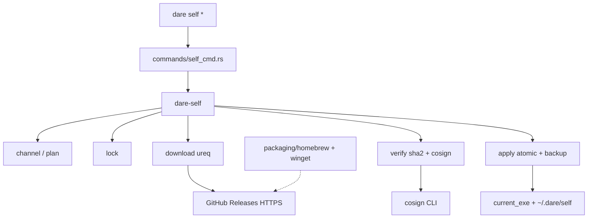

# BLUEPRINT: Self-update e package managers (Microplano 053)

> **Gerado a partir de:** `DARE/DESIGN-053-self-update-e-package-managers.md` v1.0  
> **Data:** 2026-07-30 | **Status:** APPROVED (tasks geradas via `/dare-tasks`)  
> **Arquivo:** `DARE/BLUEPRINT-053-self-update-e-package-managers.md`  
> **Pré-requisitos:** **015** DONE (ADR-008 / DEC-016) · CI checksums **004** · path/process **005/006** · guard signing patterns **034** · MCP **052** (DEC-053) · Mestre §16.5–16.6  
> **Escopo:** crate **`dare-self`** · CLI **`dare self update|rollback|uninstall`** · lock · download temp · SHA-256 + cosign verify-blob · atomic replace · rollback · uninstall mínimo · `packaging/homebrew` + `packaging/winget` · docs + **DEC-054**.  
> **Não:** alterar `dare update` (assets) · npm cutover **056** · hardening **054** · Scoop (COULD) · Fase Docker · auto-update background.

---

## 0. TRADE-OFFS (Architect)

> `DARE/PATTERNS.md` / `patterns-facts.json` ausentes — trade-offs ancorados em código 🟢 (`ureq` workspace, `fs4`, `sha2`, `ed25519-dalek`/`dare-guard` signing, ADR-008 `SHA256SUMS`+`.sig`, `dare-update` separado, DESIGN-053 A-01…A-10).

| # | Trade-off | Escolha | Justificativa |
|---|-----------|---------|---------------|
| T-01 | Fronteira crate | Nova crate **`dare-self`** + CLI thin `commands/self_cmd.rs` | Testável sem spawn CLI; espelha `dare-update`; microplano path CLI = thin wrapper |
| T-02 | HTTP client | **`ureq =2.12.1`** (workspace, `native-tls`) | Já usado; evita novo pin `reqwest` |
| T-03 | Checksum | SHA-256 vs `SHA256SUMS` (formato `sha256sum` two-space) | ADR-008 / installers |
| T-04 | Assinatura | **`cosign verify-blob`** sobre `SHA256SUMS` + arquivo `.sig` | Casa artefato Release; fail-closed |
| T-05 | `signing skipped` | **Rejeitar** (exit 6) | DESIGN A-09; self-update ≠ soft-fail alpha dos installers |
| T-06 | cosign ausente | Exit 6 `MSG_COSIGN_MISSING` | Fail-closed; override só `DARE_SELF_ALLOW_UNSIGNED=1` (dev, documentado) |
| T-07 | Canal default | **`beta`** | Produto ainda alpha/prerelease |
| T-08 | Canal `stable` | Latest **non-prerelease**; se vazio → exit 4 `MSG_STABLE_UNAVAILABLE` | Sem redirect silencioso |
| T-09 | Canal `beta` | Latest **prerelease** (GitHub API `prerelease=true` / tags alpha) | Alinha ADR-008 |
| T-10 | Windows PM | **WinGet** MUST (`packaging/winget`); Scoop **fora v1** | Path do microplano; WinGet mais “oficial” |
| T-11 | State home | `~/.dare/self/` (override `DARE_SELF_HOME`) | Fora do ProjectRoot do usuário |
| T-12 | Uninstall | Remove **somente** `current_exe()` (binário); não apaga projetos nem `~/.dare/self` salvo `--purge` COULD fora | Blast radius |
| T-13 | Capability | **`dare-self`** → `cli_commands:["self"]` | RF-26 |
| T-14 | DEC | **DEC-054** | DEC-053 = MCP |
| T-15 | Docker | **Omitida** | CLI local / DESIGN §10 |
| T-16 | Verifier testável | Trait `SignatureVerifier` + `CosignCliVerifier` + `RejectSkippedVerifier` | Unit sem rede/cosign |
| T-17 | Download timeout | **120s** default; env `DARE_SELF_TIMEOUT_SECS` | RNF-03 |
| T-18 | Lock stale | Lock exclusivo; `--force-unlock` SHOULD se mtime > **3600s** | DESIGN risco lock |

### 0.1 Constantes congeladas

| Const | Valor |
|-------|-------|
| `CAPABILITY_ID` | `dare-self` |
| `DEFAULT_CHANNEL` | `beta` |
| `ENV_SELF_HOME` | `DARE_SELF_HOME` |
| `ENV_RELEASE_API` | `DARE_SELF_RELEASE_API` (default `https://api.github.com`) |
| `ENV_RELEASE_REPO` | `DARE_SELF_RELEASE_REPO` (default owner/repo do remoto documentado no DEC — **sem token** no código) |
| `ENV_TIMEOUT` | `DARE_SELF_TIMEOUT_SECS` (default `120`) |
| `ENV_ALLOW_UNSIGNED` | `DARE_SELF_ALLOW_UNSIGNED` (`1`/`true` only) |
| `ENV_COSIGN_KEY` | `DARE_SELF_COSIGN_KEY` (path pubkey; opcional se keyless) |
| `ENV_COSIGN_IDENTITY` | `DARE_SELF_COSIGN_IDENTITY` |
| `ENV_COSIGN_OIDC_ISSUER` | `DARE_SELF_COSIGN_OIDC_ISSUER` |
| `LOCK_NAME` | `update.lock` |
| `BACKUP_REL` | `backup/dare` (+ `.exe` no Windows) |
| `MSG_STABLE_UNAVAILABLE` | `"stable channel has no non-prerelease GitHub Release"` |
| `MSG_LOCK_HELD` | `"self-update lock is held by another process"` |
| `MSG_SIGNING_SKIPPED` | `"SHA256SUMS.sig indicates signing skipped; refusing self-update"` |
| `MSG_CHECKSUM_MISMATCH` | `"checksum mismatch for downloaded asset"` |
| `MSG_COSIGN_MISSING` | `"cosign not found on PATH; required to verify release signature"` |
| `MSG_NO_BACKUP` | `"no rollback backup found"` |
| `MSG_NOT_SELF_CMD` | (help only) distinguish from `dare update` |
| `GITHUB_UA` | `dare-cli-self-update` |

### 0.2 Exit codes (congelados)

| Code | Quando |
|------|--------|
| **0** | Sucesso (update/rollback/uninstall/dry-run ok) |
| **2** | Usage / flag desconhecida / subcomando inválido |
| **3** | Path inválido / não consegue resolver `current_exe` / home self |
| **4** | Input inválido: canal, versão, lock held, stable vazio, confirmação negada |
| **5** | Rede / I/O / HTTP não-2xx / timeout |
| **6** | Checksum ou assinatura falhou / cosign missing / signing skipped |

> Alinha semanticamente exit **6** com `dare guard` (verify/integrity).

### 0.3 Canais → resolução de Release

| Canal | Resolução |
|-------|-----------|
| `beta` (default) | GitHub Releases API: mais recente com `"prerelease": true` (ou tag matching `v*-alpha*` / `v*-beta*` se API filtrar) |
| `stable` | Mais recente com `"prerelease": false`; se nenhum → exit **4** `MSG_STABLE_UNAVAILABLE` |
| `--version X` | Release cuja `tag_name` é `X` ou `vX` (aceitar ambos; Blueprint: prefer exact tag match após normalizar `v` prefix) |

Asset name: `dare-${TAG}-${TARGET}.{tar.gz\|zip}` conforme ADR-008 TARGET triple.

### 0.4 Pipeline `update` (ordem obrigatória)

1. Parse flags → validate channel/version (RS-01)  
2. Acquire lock (`~/.dare/self/update.lock`)  
3. Resolve target release + asset URL (HTTPS only)  
4. Se `--dry-run`: imprimir plano JSON/human → release lock → exit 0  
5. Download asset + `SHA256SUMS` + `SHA256SUMS.sig` para temp dir  
6. Verify SHA-256 do asset ∈ `SHA256SUMS`  
7. Verify assinatura (`signing skipped` → fail; senão cosign verify-blob)  
8. Extrair binário do archive para temp  
9. Backup `current_exe` → `~/.dare/self/backup/dare[.exe]`  
10. Atomic replace `current_exe`  
11. Smoke: novo binário `--version` (best-effort; falha → rollback automático)  
12. Cleanup temp; release lock  

Falha em qualquer passo ≥5: **não** substitui binário (ou restaura backup se replace já começou).

### 0.5 Assinatura — contrato anti-stub

```text
fn verify_sums_signature(
  sums_path: &Path,
  sig_path: &Path,
  verifier: &dyn SignatureVerifier,
) -> Result<(), SelfError>
```

| Caso | Resultado |
|------|-----------|
| `.sig` começa com `signing skipped` (case-sensitive prefix) | Err → exit 6 `MSG_SIGNING_SKIPPED` |
| `DARE_SELF_ALLOW_UNSIGNED=1` | Permite pular cosign **após** checksum OK; imprime stderr warning en-US; **proibido** em docs de produção |
| cosign OK | Ok |
| cosign fail / missing | Err → exit 6 |

`CosignCliVerifier` spawna argv separado:

```text
cosign verify-blob --signature <sig> [--key <path>|--certificate-identity …] <sums>
```

Sem shell. Timeout = `DARE_SELF_TIMEOUT_SECS`.

---

## 1. VISÃO GERAL DA ARQUITETURA

CLI orquestra; domínio em `dare-self`; origem = GitHub Releases; packaging = manifests estáticos no repo.



### Decisões arquiteturais

| Decisão | Justificativa |
|---------|---------------|
| Crate `dare-self` | Isola I/O/verify; CLI thin; sem ciclo com `dare-update` |
| Não reusar `dare-update` | Domínio diferente (binário ≠ assets projeto) |
| Fail-closed sig | Self-update é supply-chain crítico |
| WinGet not Scoop | Um MUST Windows; menos superfície |
| State em `~/.dare/self` | Não toca ProjectRoot do usuário |

---

## 2. STACK TÉCNICA DEFINIDA

| Camada | Tecnologia | Versão |
|--------|------------|--------|
| Rust | workspace | `rust-version` atual (1.88) |
| Crate | `dare-self` | path member |
| CLI | `dare-cli` clap | `=4.5.40` |
| HTTP | `ureq` | `=2.12.1` + `native-tls` |
| Hash | `sha2` | `=0.10.9` |
| Lock | `fs4` | `=1.1.0` |
| Archive | `flate2`+`tar` / `zip` (pins workspace ou adicionar se ausentes) | Blueprint implementador confirma `cargo tree` |
| Semver | `semver` crate se necessário parse | pin exact |
| Signature | cosign **external binary** | PATH |
| Tests | tempfile, assert_cmd, mock verifier | |
| Packaging | Homebrew Formula + WinGet manifest | estáticos |

---

## 3. ESTRUTURA DE PASTAS

```text
crates/dare-self/
  Cargo.toml
  src/
    lib.rs
    channel.rs      # Channel enum, resolve release
    plan.rs         # UpdatePlan / DryRunReport schemaVersion 1
    lock.rs         # acquire/release/force
    download.rs     # asset + sums + sig
    verify.rs       # sha256 + SignatureVerifier
    apply.rs        # backup + atomic replace + smoke
    rollback.rs
    uninstall.rs
    paths.rs        # SelfHome, backup path
    report.rs       # human + json
crates/dare-cli/src/commands/self_cmd.rs
crates/dare-cli/src/commands/mod.rs      # MOD
crates/dare-cli/src/main.rs             # MOD Commands::Self_
crates/dare-cli/tests/self_cli.rs
packaging/homebrew/dare.rb              # Formula template
packaging/winget/DareLabs.DareCli.yaml  # manifest mínimo
docs/compatibility/cli-self-update.md
docs/DECISION-LOG.md                    # DEC-054
assets/capability-matrix.yml            # + dare-self
```

Workspace: adicionar `dare-self` em `Cargo.toml` members + `dare-cli` dep.

---

## 4. MODELO DE DADOS (domínio)

### 4.1 `Channel`

```rust
pub enum Channel { Beta, Stable }
impl Channel {
  pub fn parse(s: &str) -> Result<Self, SelfError>; // only "beta"|"stable"
}
```

### 4.2 `UpdatePlan` (dry-run / apply input)

| Campo | Tipo | Notas |
|-------|------|-------|
| `schemaVersion` | `u32` | `1` |
| `channel` | `String` | `beta`\|`stable`\|`version` |
| `currentVersion` | `String` | de `--version` do binário atual (best-effort) |
| `targetTag` | `String` | tag GitHub |
| `targetTriple` | `String` | rustc host triple |
| `assetName` | `String` | `dare-${tag}-${triple}.tar.gz\|zip` |
| `assetUrl` | `String` | HTTPS |
| `sumsUrl` | `String` | |
| `sigUrl` | `String` | |
| `actions` | `Vec<String>` | ordem humana estável |

### 4.3 `SelfHome` layout

```text
$DARE_SELF_HOME/          # default: {dirs_home}/.dare/self
  update.lock
  backup/dare[.exe]
  tmp/<uuid>/             # created per run; deleted after
```

### 4.4 Relatórios

`DryRunReport` / `ApplyReport` / `RollbackReport`: JSON `schemaVersion: 1`, campos espelhando plano + `ok: bool` + `mode: update|rollback|uninstall`.

---

## 5. CONTRATOS CLI (ANTI-STUB)

### 5.1 Superfície

```text
dare self update [--channel beta|stable] [--version <tag>] [--dry-run] [--yes] [--force-unlock] [--json]
dare self rollback [--yes] [--json]
dare self uninstall [--yes] [--json]
```

| Regra | Comportamento |
|-------|---------------|
| `--channel` e `--version` juntos | exit **2** usage |
| canal desconhecido | exit **2** |
| sem `--yes` e TTY | prompt `Proceed? [y/N]`; não → exit **4** |
| sem TTY e sem `--yes` | exit **4** (non-interactive requires `--yes`) |
| `--json` | stdout JSON only; progress em stderr |

### 5.2 Assinaturas de domínio

```rust
pub fn plan_update(opts: UpdateOpts) -> CoreResult<UpdatePlan>;
pub fn apply_update(opts: UpdateOpts, verifier: &dyn SignatureVerifier) -> CoreResult<ApplyReport>;
pub fn rollback(opts: RollbackOpts) -> CoreResult<RollbackReport>;
pub fn uninstall(opts: UninstallOpts) -> CoreResult<UninstallReport>;
```

**Pré-condições `apply_update`:** lock livre (ou force); URLs https; exe resolvível.  
**Pós-condições:** binário novo no lugar **ou** binário antigo intacto; lock liberado; temp limpo.  
**Concorrência:** segundo `apply` com lock → `SelfError::LockHeld` → exit 4.

### 5.3 Edge cases

| Caso | Exit | Mensagem |
|------|------|----------|
| `stable` sem release | 4 | `MSG_STABLE_UNAVAILABLE` |
| lock held | 4 | `MSG_LOCK_HELD` |
| HTTP 404 asset | 5 | en-US short |
| checksum mismatch | 6 | `MSG_CHECKSUM_MISMATCH` |
| signing skipped | 6 | `MSG_SIGNING_SKIPPED` |
| cosign missing | 6 | `MSG_COSIGN_MISSING` |
| rollback sem backup | 4 | `MSG_NO_BACKUP` |
| uninstall negado | 4 | confirmation |
| `dare update` regressão | — | testes existentes verdes |

### 5.4 Exemplos

**Dry-run (human):**

```text
self update: dry-run
channel: beta
current: 0.1.0-alpha.0
target: v0.1.0-alpha.2
asset: dare-v0.1.0-alpha.2-x86_64-pc-windows-msvc.zip
actions: download, verify-sha256, verify-sig, backup, replace
mode: update
```

**Assinatura inválida:** exit 6; `current_exe` bytes inalterados.

---

## 6. PLANO DE EXECUÇÃO (FASES)

> Fase Docker **omitida** (T-15). Penúltima = packaging. Última = docs + audit.

### Fase A — Crate `dare-self` skeleton + paths + lock + channel
**DONE quando:** `Channel::parse`, `SelfHome`, lock acquire/release/force; unit tests lock contention; `cargo test -p dare-self` verde.

**Entregáveis:** `crates/dare-self/**` mínimo; workspace member.

### Fase B — plan + download + SHA-256 verify (fixtures, sem rede)
**DONE quando:** `plan_update` monta asset names; `verify_sha256` passa/falla com fixtures `SHA256SUMS`; download abstrai `HttpClient` trait mockável.

**Entregáveis:** `plan.rs`, `download.rs`, `verify.rs` (sha only).

### Fase C — SignatureVerifier + apply atomic + backup + interrupt
**DONE quando:** signing skipped → err; checksum mismatch → err; apply com fake FS preserva anterior em failpoint; backup escrito antes do replace.

**Entregáveis:** `verify` cosign path; `apply.rs`; tests failpoint.

### Fase D — rollback + uninstall
**DONE quando:** rollback restaura backup; sem backup exit tipado; uninstall remove apenas exe (temp dir fixture).

**Entregáveis:** `rollback.rs`, `uninstall.rs`.

### Fase E — CLI `dare self` + smokes
**DONE quando:** help lista `self`; unknown channel exit 2; dry-run exit 0; distinção help vs `dare update`.

**Entregáveis:** `commands/self_cmd.rs`, `tests/self_cli.rs`, `main.rs`.

### Fase F — Packaging Homebrew + WinGet
**DONE quando:** arquivos em `packaging/homebrew` e `packaging/winget` com placeholders de URL/sha documentados; validação estrutural (YAML/Ruby parse ou checklist test).

**Entregáveis:** manifests; nota em docs.

### Fase G — Docs DEC-054 + capability + Ralph
**DONE quando:** `cli-self-update.md`; DEC-054 append-only; capability `dare-self`; matriz 053 Concluído; Ralph verde + audit; contagem capabilities atualizada nos testes harness/cli_smoke (**50→51**).

**Ralph:**
```bash
cargo fmt --check
cargo test -p dare-self
cargo test -p dare-cli --test self_cli
cargo test -p dare-cli --test cli_smoke
cargo clippy -p dare-self -p dare-cli --all-targets -- -D warnings
cargo audit
```

---

## 7. VALIDATION GATES

| Gate | Comando |
|------|---------|
| Build | `cargo build -p dare-self -p dare-cli` |
| Test | `cargo test -p dare-self && cargo test -p dare-cli --test self_cli` |
| Lint | `cargo clippy -p dare-self -p dare-cli --all-targets -- -D warnings` |
| Fmt | `cargo fmt --check` |
| Audit | `cargo audit` |

---

## 8. CONTROLES DE SEGURANÇA → FASES

| RS | Fase |
|----|------|
| RS-01 validação flags | A/E |
| RS-02 redact tokens/URLs | B/E |
| RS-03 allowlist paths | A/C |
| RS-04 audit | G |
| RS-05 env secrets | B/C |
| RS-06 argv cosign | C |
| RS-07 fail checksum/sig | B/C |
| RS-08 lock | A |
| RS-09 uninstall blast | D |

---

## 9. ESTRATÉGIA DE TESTES

| Tipo | Cobertura |
|------|-----------|
| Unit | channel parse, sha256 fixture, signing skipped, lock, plan asset naming |
| Integration (FS) | apply failpoint, rollback, uninstall temp exe |
| CLI smoke | help, bad channel exit 2, dry-run |
| Security | unsigned rejected; allow_unsigned warning path |
| Regression | `dare update` / cli_smoke capability count 51 |
| Cross-platform | apply rename path `cfg(windows)` documentado; CI matrix existente |

**Não** exigir rede GitHub real no CI unitário — HTTP mock/`HttpClient` trait.

---

## 10. ESTRATÉGIA DE DEPLOY / DISTRIBUIÇÃO

| Ambiente | Mecanismo |
|----------|-----------|
| Alpha/Beta | GitHub prerelease (015) + `dare self update --channel beta` |
| Stable | Non-prerelease Release; canal `stable` |
| Homebrew | Tap formula aponta Release tag |
| WinGet | Manifest aponta URL asset + sha256 |
| npm | **Fora** (056) |

---

## 11. CLASSES DE COMPATIBILIDADE

| Item | Classe | Nota |
|------|--------|------|
| `dare update` assets | A | Intacto |
| Novo `dare self` | B | Superfície nova |
| Fail-closed vs ADR-008 soft-fail installers | B | Documentar diferença |
| Capability count 51 | B | Atualizar testes |
| Remoção Scoop | C | Nunca shipped |

---

## 12. CHECKLIST DE APROVAÇÃO

- [x] Trade-offs T-01…T-18 aceitos (esp. cosign fail-closed, WinGet, default beta)
- [x] Exit codes 0/2/3/4/5/6 aceitos
- [x] Pipeline §0.4 aceito
- [x] Separação `dare-self` vs `dare-update` aceita
- [x] Packaging Homebrew + WinGet (sem Scoop) aceito
- [x] Docker omitido aceito
- [x] DEC-054 (não 053) aceito
- [x] Pronto para `/dare-tasks`

---

## 13. PRÓXIMO PASSO

Aprovação humana deste Blueprint → `/dare-tasks` (gera `TASKS-053`, `dare-dag-053.yaml`, `EXECUTION-053/`).

**Não** gerar TASKS/DAG/EXECUTION neste comando.
